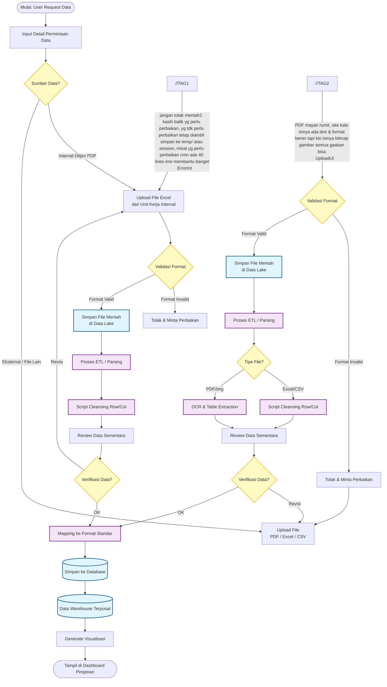
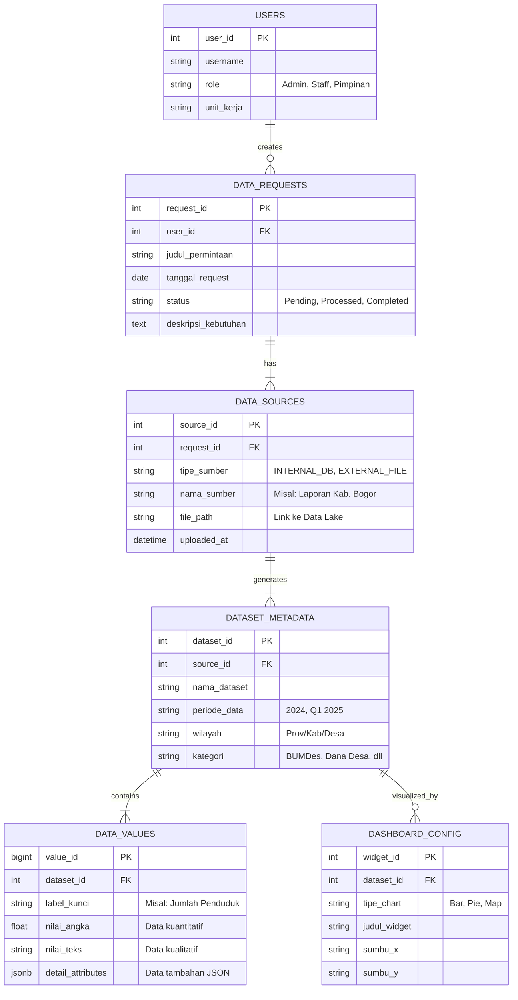

# Walkthrough: Sistem Integrasi Data untuk Dashboard Pimpinan

Dokumen ini menjelaskan arsitektur dan alur kerja sistem integrasi data yang dirancang untuk Ditjen PDP. Sistem ini mampu menangani data dari berbagai sumber (internal & eksternal) dengan format beragam, kemudian mengolahnya menjadi visualisasi dashboard yang informatif.

---

## 1. Ringkasan Arsitektur Sistem

Sistem ini menggunakan pendekatan **hybrid architecture** yang menggabungkan:

| Komponen          | Teknologi/Pendekatan          | Fungsi                                                |
|----------         |---------------------          |--------                                               |
| **Data Lake**     | Object Storage                | Menyimpan file mentah (PDF, Excel, CSV) sebagai arsip |
| **ETL Pipeline**  | Script Cleansing + OCR        | Transformasi data ke format standar                   |
| **Database**      | Relational + JSON Flexible    | Manajemen user & struktur data dinamis                |
| **Dashboard**     | Konfigurasi berbasis tabel    | Visualisasi tanpa coding                              |

---

## 2. Alur Logika Sistem (Flowchart)



### 2.1 Penjelasan Tahapan Utama

#### Fase 1: Penerimaan Permintaan
1. **User Request Data** - Pimpinan atau staff mengajukan permintaan data
2. **Input Detail Permintaan** - Sistem mencatat kebutuhan spesifik (periode, wilayah, kategori)
3. **Penentuan Sumber** - Sistem mengidentifikasi apakah data tersedia internal atau perlu input eksternal

#### Fase 2: Pengambilan Data

````carousel
**Jalur Internal (File Excel dari Unit Kerja)**
- Unit kerja internal upload file Excel
- Validasi format file dilakukan otomatis
- File mentah disimpan di Data Lake sebagai arsip
//TAG3-- dibahas lagi, kayanya compressed csv tapi di versioning
- Proses ETL (cleansing row/column) diperlukan
- Review & verifikasi sebelum masuk database

<!-- slide -->

**Jalur Eksternal (Upload File dari Luar)**
- User upload file PDF/Excel/CSV dari sumber eksternal
- Validasi format dilakukan secara otomatis
- File mentah disimpan di Data Lake sebagai arsip
//TAG3
- Proses ETL dengan deteksi tipe file (Excel → Cleansing, PDF → OCR)
- Review & verifikasi sebelum masuk database
````

#### Fase 3: Proses ETL (Extract, Transform, Load)

| Tipe File | Proses | Output |
|-----------|--------|--------|
| **Excel/CSV** | Script Cleansing (hapus row kosong, normalisasi kolom) | Data tabular bersih |
| **PDF/Image** | OCR + Table Extraction | Data tabular dari scan dokumen |

#### Fase 4: Human-in-the-Loop Verification

> [!IMPORTANT]
> **Mengapa Verifikasi Manual Diperlukan?**
> 
> Data eksternal (terutama PDF scan) seringkali mengandung noise atau kesalahan OCR. Tahap **Review Data Sementara** memastikan prinsip **GIGO (Garbage In, Garbage Out)** tidak terjadi.

Alur verifikasi:
- ✅ **OK** → Data lanjut ke mapping format standar
- ⚠️ **Revisi** → User diminta upload ulang atau koreksi manual

#### Fase 5: Penyimpanan & Visualisasi
1. Data yang sudah bersih di-mapping ke format standar
2. Disimpan di **Data Warehouse Terpusat**
3. Dashboard otomatis generate visualisasi berdasarkan konfigurasi

---

## 3. Entity Relationship Diagram (ERD)



### 3.1 Penjelasan Struktur Tabel

#### Tabel Manajemen User & Request

| Tabel | Fungsi | Contoh Data |
|-------|--------|-------------|
| `USERS` | Menyimpan data pengguna sistem | Admin, Staff Kecamatan, Pimpinan |
| `DATA_REQUESTS` | Log permintaan data dari user | "Laporan BUMDes Q3 2024" |

#### Tabel Sumber Data

**`DATA_SOURCES`** - Mencatat asal data

```
┌─────────────────────────────────────────────────────────────┐
│  tipe_sumber: INTERNAL_DB                                   │
│  → Menyimpan query log ke database internal                 │
├─────────────────────────────────────────────────────────────┤
│  tipe_sumber: EXTERNAL_FILE                                 │
│  → Menyimpan path file di Data Lake (PDF/Excel asli)        │
│  → Berguna untuk audit trail & verifikasi ulang             │
└─────────────────────────────────────────────────────────────┘
```

#### Tabel Struktur Data Dinamis

> [!TIP]
> **Mengapa Menggunakan Struktur Fleksibel?**
> 
> Format data dari berbagai daerah seringkali tidak konsisten. Dengan pendekatan **EAV (Entity-Attribute-Value)** pada tabel `DATA_VALUES`, sistem dapat menerima format yang berubah-ubah tanpa perlu `ALTER TABLE`.

**`DATA_VALUES`** - Kunci fleksibilitas sistem

| Kolom | Penggunaan |
|-------|------------|
| `label_kunci` | Nama field dinamis (contoh: "Jumlah Petani", "Total Dana Desa") |
| `nilai_angka` | Untuk data kuantitatif |
| `nilai_teks` | Untuk data kualitatif |
| `detail_attributes` | **JSON column** untuk struktur kompleks/nested |

**Contoh penggunaan `detail_attributes`:**

```json
{
  "breakdown_per_desa": [
    {"nama_desa": "Sukamaju", "jumlah": 150},
    {"nama_desa": "Cibadak", "jumlah": 230}
  ],
  "catatan": "Data per Desember 2024",
  "sumber_asli": "Laporan Camat"
}
```

#### Tabel Konfigurasi Dashboard

**`DASHBOARD_CONFIG`** - Self-service visualization

> [!NOTE]
> Admin dapat mengatur tampilan dashboard **tanpa coding**. Cukup pilih dataset, tentukan tipe chart, dan atur sumbu X/Y.

---

## 4. Keunggulan Arsitektur

### 4.1 Data Governance

| Aspek | Implementasi |
|-------|-------------|
| **Audit Trail** | File mentah (PDF asli) tersimpan di Data Lake |
| **Data Quality** | Human-in-the-loop verification sebelum masuk warehouse |
| **Traceability** | Setiap data terhubung ke `request_id` dan `source_id` |

### 4.2 Skalabilitas

```
┌─────────────────────────────────────────────────────────────┐
│  Format Baru Masuk?                                         │
│  ───────────────────                                        │
│  ✅ Tidak perlu ALTER TABLE                                 │
│  ✅ Cukup mapping ke label_kunci baru                       │
│  ✅ Gunakan detail_attributes untuk struktur kompleks       │
└─────────────────────────────────────────────────────────────┘
```

### 4.3 User Experience

- **Untuk Staff**: Upload file dengan validasi otomatis
- **Untuk Admin**: Konfigurasi dashboard via UI
- **Untuk Pimpinan**: Dashboard real-time yang informatif

---

## 5. Teknologi yang Direkomendasikan

| Layer | Opsi Teknologi |
|-------|---------------|
| **Data Lake** | MinIO, AWS S3, Azure Blob |
| **Database** | PostgreSQL (dengan JSONB support) |
| **ETL** | Apache Airflow, Prefect, atau script Python |
| **OCR** | Tesseract, Adobe PDF Extract, AWS Textract |
| **Dashboard** | Metabase, Apache Superset, atau custom web app |
| **Backend API** | Laravel, FastAPI, atau NestJS |

---

## 6. Langkah Implementasi Selanjutnya

- [ ] Setup infrastruktur Data Lake
- [ ] Implementasi database schema (PostgreSQL)
- [ ] Develop upload & validation module
- [ ] Setup ETL pipeline untuk Excel/CSV
- [ ] Integrasi OCR untuk PDF processing
- [ ] Build review & approval workflow
- [ ] Develop dashboard configuration UI
- [ ] Testing end-to-end dengan data riil
- [ ] Deploy ke production environment

---

> [!CAUTION]
> **Perhatian untuk Tim Development**
> 
> Pastikan implementasi `detail_attributes` (JSONB) memiliki **indexing yang tepat** untuk performa query yang optimal, terutama jika volume data besar.
