# Wiki Documentation for https://github.com/anbe-on/integrasi_data_skor_rekomendasi_desa

Generated on: 2026-04-16 04:29:49

## Table of Contents

- [Server Setup (Ubuntu / Debian)](#page-server-setup)
  - [1. Update the System](#1-update-the-system)
  - [2. Install Git](#2-install-git)
  - [3. Install Docker and Docker Compose](#4-install-docker-and-docker-compose)
  - [4. Install Python 3.11 and Virtual Environment](#5-install-python-311-and-virtual-environment)
  - [5. Install Node.js, npm and npx](#6-install-nodejs-npm-and-npx)
  - [6. Install OpenSSL](#7-install-openssl)
  - [7. Compile Tailwind CSS](#8-compile-tailwind-css)
  - [8. Generate APP_SECRET_KEY and Create .env](#9-generate-app_secret_key-and-create-env)
  - [9. Add the First User](#10-add-the-first-user)
  - [10. Start the Stack](#11-start-the-stack)

- [Project Introduction](#page-project-introduction)
  - [System Architecture Overview](#system-architecture-overview)
    - [Backend Services](#backend-services)
    - [Frontend Interface](#frontend-interface)
    - [Configuration Management](#configuration-management)
  - [Core Components and Functionality](#core-components-and-functionality)
    - [Data Integration and Processing](#data-integration-and-processing)
      - [Database Schema and Management](#database-schema-and-management)
    - [Excel Report Generation](#excel-report-generation)
      - [Dashboard Rekomendasi Details](#dashboard-rekomendasi-details)
      - [Dashboard IKU Details](#dashboard-iku-details)
    - [Configuration Files and Structure](#configuration-files-and-structure)
    - [Styling and Frontend Configuration](#styling-and-frontend-configuration)
  - [Deployment and Development](#deployment-and-development)
    - [Docker Deployment](#docker-deployment)
    - [Testing](#testing)
  - [User Interface Elements](#user-interface-elements)
    - [Login Page](#login-page)
    - [Admin Dashboard](#admin-dashboard)
    - [User Dashboard](#user-dashboard)

- [System Requirements](#page-system-requirements)
  - [Software Dependencies](#software-dependencies)
    - [Python Version](#python-version)
    - [Core Python Packages](#core-python-packages)
  - [Runtime Environment](#runtime-environment)
    - [Operating System](#operating-system)
    - [Hardware Recommendations](#hardware-recommendations)
  - [Configuration](#configuration)
    - [Configuration Files Directory](#configuration-files-directory)
    - [Key Configuration Files](#key-configuration-files)
    - [Environment Variables](#environment-variables)
  - [Installation and Setup](#installation-and-setup)
    - [Docker Installation and Run](#docker-installation-and-run)
  - [Running the System](#running-the-system)
    - [Running with Docker Compose](#running-with-docker-compose)
  - [Frontend Development Setup](#frontend-development-setup)
    - [Compiling Tailwind CSS](#compiling-tailwind-css)
  - [Testing](#testing-1)
    - [Running Tests](#running-tests)
  - [System Architecture Overview](#system-architecture-overview-1)
    - [Backend API (desa_db/server.py)](#backend-api-desa_dbserverpy)
    - [Data Processing and Middleware (desa_db/middleware.py)](#data-processing-and-middleware-desa_dbmiddlewarepy)
    - [Frontend (front_end/)](#frontend-front_end)
    - [Workflow Example: Dashboard Generation](#workflow-example-dashboard-generation)
    - [Workflow Example: User Authentication](#workflow-example-user-authentication)
  - [Development and Testing Setup](#development-and-testing-setup)
    - [Mock Data and Configuration Setup](#mock-data-and-configuration-setup)
    - [Test Execution](#test-execution)
  - [Frontend Styling](#frontend-styling)
    - [Example Login Page Styling](#example-login-page-styling)

- [Architecture Overview](#page-architecture-overview)
  - [System Deployment and Orchestration](#system-deployment-and-orchestration)
    - [Docker Compose Services](#docker-compose-services)
    - [Service Interconnections](#service-interconnections)
  - [Backend Service (desa_db/server.py)](#backend-service-desa_dbserverpy)
    - [Core Functionality](#core-functionality)
    - [Key Components and Modules](#key-components-and-modules)
    - [API Endpoints Overview](#api-endpoints-overview)
  - [Frontend Service (front_end/router.py)](#frontend-service-front_endrouterpy)
    - [Key Responsibilities](#key-responsibilities)
    - [Routing and Views](#routing-and-views)
  - [Reverse Proxy and Static Asset Management (Nginx)](#reverse-proxy-and-static-asset-management-nginx)
    - [Nginx Configuration](#nginx-configuration)
  - [Configuration Management](#configuration-management-1)
    - [Configuration Files](#configuration-files-1)
  - [Data Flow and Processing](#data-flow-and-processing)
    - [Data Loading and Preparation](#data-loading-and-preparation)
    - [Score and Recommendation Calculation](#score-and-recommendation-calculation)
    - [Report Generation](#report-generation)
  - [Frontend Styling and Theming](#frontend-styling-and-theming)
    - [Tailwind CSS Configuration](#tailwind-css-configuration)
    - [Utility Classes](#utility-classes)
  - [Conclusion](#conclusion)

- [Data Flow Diagram](#page-data-flow)
  - [Core Components and Data Flow](#core-components-and-data-flow)
    - [Backend API Endpoints](#backend-api-endpoints)
      - [Authentication Flow](#authentication-flow)
      - [Data Upload and Processing](#data-upload-and-processing)
    - [Middleware Logic](#middleware-logic)
      - [Database Initialization and Management](#database-initialization-and-management)
      - [Report Generation (Excel)](#report-generation-excel)
      - [Dashboard Rendering (HTML)](#dashboard-rendering-html)
    - [Frontend Components](#frontend-components)
      - [Routing](#routing)
  - [Configuration and Data Models](#configuration-and-data-models)
    - [Configuration Files](#configuration-files-2)
    - [Database Schema](#database-schema)
  - [Testing and Development Setup](#testing-and-development-setup)
    - [Docker Deployment](#docker-deployment-1)
    - [Unit and Integration Testing](#unit-and-integration-testing)
  - [Summary](#summary)

- [Component Relationships](#page-component-relationships)
  - [Backend Service (desa_db)](#backend-service-desa_db)
    - [Core Functionality and Modules](#core-functionality-and-modules)
    - [Authentication Flow](#authentication-flow-1)
    - [Data Processing and Reporting](#data-processing-and-reporting)
  - [Frontend Service (front_end)](#frontend-service-front_end)
    - [Key Files and Technologies](#key-files-and-technologies)
    - [Styling with Tailwind CSS](#styling-with-tailwind-css)
  - [Docker Orchestration (docker-compose.yml)](#docker-orchestration-docker-composeyml)
    - [Services Defined](#services-defined)
  - [Configuration Management](#configuration-management-2)
    - [Key Configuration Files](#key-configuration-files-1)
  - [Data Flow and Interaction](#data-flow-and-interaction)

- [Data Upload and Processing](#page-data-upload-and-processing)
  - [Data Upload Endpoints](#data-upload-endpoints)
    - [Resumable Upload Initialization (/upload/init/{year})](#resumable-upload-initialization-uploadinityear)
    - [Upload Chunk (/upload/chunk/{year})](#upload-chunk-uploadchunkyear)
    - [Finalize Upload (/upload/finalize/{year})](#finalize-upload-uploadfinalizeyear)
  - [Frontend Upload Interface](#frontend-upload-interface)
    - [Admin Page (/admin)](#admin-page-admin)
  - [Hashing and File Integrity](#hashing-and-file-integrity)
    - [SparkMD5](#sparkmd5)
  - [Data Processing Flow](#data-processing-flow)
  - [API Models for Upload](#api-models-for-upload)
  - [Test Cases](#test-cases)
  - [Configuration and Constants](#configuration-and-constants)
  - [Server Protection and Routing](#server-protection-and-routing)
  - [Data Processing Logic (Implied)](#data-processing-logic-implied)

- [Dashboards and Reporting](#page-dashboard-and-reporting)
  - [Core Reporting Components](#core-reporting-components)
    - [Configuration Files](#configuration-files-3)
    - [Excel Workbook Generation](#excel-workbook-generation)
    - [Styling and Formatting](#styling-and-formatting)
  - [Sheet 1: Grid Data](#sheet-1-grid-data)
    - [Data Loading and Transformation](#data-loading-and-transformation)
    - [Header and Data Writing](#header-and-data-writing)
    - [Formatting](#formatting)
  - [Sheet 2: Dashboard Rekomendasi](#sheet-2-dashboard-rekomendasi)
    - [Data Loading and Configuration](#data-loading-and-configuration)
    - [Data Processing and Calculation](#data-processing-and-calculation)
    - [Header and Column Formatting](#header-and-column-formatting)
    - [Row Merging and Styling](#row-merging-and-styling)
  - [Sheet 3: Dashboard IKU](#sheet-3-dashboard-iku)
    - [Data Loading and Mapping](#data-loading-and-mapping)
    - [Grouping and Aggregation Logic](#grouping-and-aggregation-logic)
    - [Header Rendering and Styling](#header-rendering-and-styling)
    - [Data Presentation](#data-presentation)
  - [User Interface](#user-interface)
    - [Admin Dashboard (admin.html)](#admin-dashboard-adminhtml)
    - [User Dashboard (user.html)](#user-dashboard-userhtml)
  - [Backend API Endpoints](#backend-api-endpoints-1)
    - [/dashboard Endpoint](#dashboard-endpoint)
    - [/dashboard_iku Endpoint](#dashboard_iku-endpoint)
    - [/download_excel Endpoint](#download_excel-endpoint)
  - [Data Flow and Architecture](#data-flow-and-architecture)
    - [Request Flow Example (Excel Download)](#request-flow-example-excel-download)
    - [HTML Rendering Flow (Dashboard IKU)](#html-rendering-flow-dashboard-iku)
  - [Testing](#testing-2)
    - [Unit Tests for Server and Reporting](#unit-tests-for-server-and-reporting)

- [User Authentication and Authorization](#page-user-authentication)
  - [Authentication Flow](#authentication-flow-2)
    - [Login Process](#login-process)
    - [JWT Generation and Cookie Management](#jwt-generation-and-cookie-management)
    - [Logout Process](#logout-process)
  - [Authorization and Role-Based Access Control](#authorization-and-role-based-access-control)
    - [User Roles](#user-roles)
    - [Role Enforcement](#role-enforcement)
  - [User Management](#user-management)
    - [Adding Users](#adding-users)
    - [Password Hashing](#password-hashing)
  - [Data Storage for Authentication](#data-storage-for-authentication)
  - [Key Components and Files](#key-components-and-files)
  - [Architectural Overview](#architectural-overview)
    - [Authentication Flow Diagram](#authentication-flow-diagram)
    - [Authorization Check Diagram](#authorization-check-diagram)

- [Configuration Files](#page-configuration-files)
  - [Configuration File Directory](#configuration-file-directory)
  - [Key Configuration Files](#key-configuration-files-2)
    - [headers.json](#headersjson)
    - [rekomendasi.json](#rekomendasijson)
    - [table_structure.csv](#table_structurecsv)
    - [table_structure_IKU.csv](#table_structure_ikucsv)
    - [iku_mapping.json](#iku_mappingjson)
    - [intervensi_kegiatan_mapping.json](#intervensi_kegiatan_mappingjson)
  - [Data Flow and Processing](#data-flow-and-processing-1)
    - [Dashboard Rekomendasi Data Flow](#dashboard-rekomendasi-data-flow)
    - [Dashboard IKU Data Flow](#dashboard-iku-data-flow)
  - [Configuration Management](#configuration-management-3)
    - [Adding Users](#adding-users-1)
    - [Environment Variables](#environment-variables-1)
    - [Tailwind CSS Configuration](#tailwind-css-configuration-1)

- [Database Structure](#page-database-structure)

- [Backend API Endpoints](#page-backend-api)
  - [Authentication Endpoints](#authentication-endpoints)
    - [Login Endpoint](#login-endpoint)
    - [Logout Endpoint](#logout-endpoint)
    - [Authentication Middleware](#authentication-middleware)
  - [Data and Configuration Endpoints](#data-and-configuration-endpoints)
    - [Table Structure Endpoint](#table-structure-endpoint)
    - [Excel Preview and Processing Endpoints](#excel-preview-and-processing-endpoints)
  - [Dashboard and Reporting Endpoints](#dashboard-and-reporting-endpoints)
    - [Generate Excel Workbook Endpoint](#generate-excel-workbook-endpoint)
    - [Dashboard Rendering Endpoints](#dashboard-rendering-endpoints)
  - [System Orchestration and Configuration](#system-orchestration-and-configuration)
    - [docker-compose.yml](#docker-composeyml)
  - [Testing](#testing-3)
  - [API Endpoint Summary](#api-endpoint-summary)

- [Authentication Module](#page-authentication-module)
  - [User Management](#user-management-1)
    - [Adding New Users](#adding-new-users)
      - [Usage](#usage)
    - [User Data Storage](#user-data-storage)
  - [Authentication Flow](#authentication-flow-3)
    - [Login Process](#login-process-1)
      - [Login Endpoint (/api/login)](#login-endpoint-apilogin)
    - [Logout Process](#logout-process-1)
    - [Protected Routes](#protected-routes)
  - [Authorization](#authorization)
    - [Role-Based Access Control](#role-based-access-control)
  - [Security Considerations](#security-considerations)
    - [Password Hashing](#password-hashing-1)
    - [JWT Security](#jwt-security)
  - [Configuration](#configuration-1)
    - [Environment Variable APP_SECRET_KEY](#environment-variable-app_secret_key)
  - [Testing](#testing-4)
  - [Key Components](#key-components)

- [Frontend Overview](#page-frontend-overview)
  - [Architecture and Setup](#architecture-and-setup)
    - [Core Components and Setup](#core-components-and-setup)
    - [Dependencies and Styling](#dependencies-and-styling)
  - [Routing and User Interface](#routing-and-user-interface)
    - [Authentication and Redirection](#authentication-and-redirection)
    - [API Integration](#api-integration)
  - [Frontend Development Workflow](#frontend-development-workflow)
    - [Development Server](#development-server)
    - [Styling with Tailwind CSS](#styling-with-tailwind-css-1)
  - [Data Flow and Interaction](#data-flow-and-interaction-1)
    - [User Authentication Flow](#user-authentication-flow-3)
    - [Data Display Flow](#data-display-flow)
  - [Configuration](#configuration-2)
    - [Environment Variables](#environment-variables-2)
    - [Frontend Configuration in router.py](#frontend-configuration-in-routerpy)
  - [Styling and UI Elements](#styling-and-ui-elements)
    - [Tailwind CSS Configuration](#tailwind-css-configuration-2)
    - [CSS Utility Classes](#css-utility-classes)

- [Login Page](#page-login-page)
  - [User Interface (Frontend)](#user-interface-frontend)
    - [Key UI Elements:](#key-ui-elements)
  - [Authentication Flow (Frontend & Backend Interaction)](#authentication-flow-frontend--backend-interaction)
    - [Frontend Routing (front_end/router.py)](#frontend-routing-front_endrouterpy-1)
    - [Backend API (desa_db/server.py)](#backend-api-desa_dbserverpy-1)
  - [Authentication Logic (desa_db/auth.py)](#authentication-logic-desa_dbauthpy)
    - [Key Functions:](#key-functions)
  - [Data Models and Schemas](#data-models-and-schemas)
    - [Login Request (desa_db/server.py)](#login-request-desa_dbserverpy)
    - [User Data Structure (from auth_users.json)](#user-data-structure-from-auth_usersjson)
  - [Security Considerations](#security-considerations-1)
  - [Configuration](#configuration-3)
  - [User Redirection](#user-redirection)
  - [Mermaid Diagrams](#mermaid-diagrams)
    - [Login Flow Sequence Diagram](#login-flow-sequence-diagram)
    - [Frontend Router Logic Diagram](#frontend-router-logic-diagram)

- [User Dashboard](#page-user-dashboard)
  - [Core Components and Functionality](#core-components-and-functionality-1)
    - [Front-end Structure (user.html)](#front-end-structure-userhtml)
    - [JavaScript Functionality (UserDashboardApp())](#javascript-functionality-userdashboardapp)
    - [Data Grid Integration (ag-grid-community.min.js)](#data-grid-integration-ag-grid-communityminjs)
    - [Styling (output.css)](#styling-outputcss)
  - [Data Flow and API Interaction](#data-flow-and-api-interaction-1)
    - [API Endpoints (Inferred)](#api-endpoints-inferred)
    - [Data Processing (Middleware)](#data-processing-middleware)
  - [User Interface Elements](#user-interface-elements-1)
    - [Header](#header)
    - [Main Content Area](#main-content-area)
  - [Example Data Visualization (Inferred)](#example-data-visualization-inferred)
  - [Architecture Overview](#architecture-overview-1)
    - [Front-end Frameworks and Libraries](#front-end-frameworks-and-libraries)
    - [Back-end Frameworks and Libraries](#back-end-frameworks-and-libraries)
  - [Security Considerations](#security-considerations-2)
  - [Testing](#testing-5)

- [Admin Dashboard](#page-admin-dashboard)

- [Docker Deployment](#page-docker-deployment)
  - [Architecture Overview](#architecture-overview-2)
    - [Services](#services)
    - [Data Flow](#data-flow-1)
  - [Dockerfile and Image Building](#dockerfile-and-image-building)
    - [Dockerfile Instructions](#dockerfile-instructions)
  - [Configuration](#configuration-4)
    - [.env File](#env-file)
    - [Configuration Directory (.config/)](#configuration-directory-config)
    - [tailwind.config.js](#tailwindconfigjs)
    - [nginx.conf](#nginxconf)
  - [Running the Application with Docker Compose](#running-the-application-with-docker-compose)
    - [Development vs. Production](#development-vs-production)
  - [Testing](#testing-6)
  - [Deprecated Methods](#deprecated-methods)
  - [.dockerignore File](#dockerignore-file)

- [Nginx Configuration](#page-nginx-configuration)
  - [Core Nginx Configuration (nginx.conf)](#core-nginx-configuration-nginxconf)
    - [Server Block](#server-block)
    - [Static File Serving](#static-file-serving)
    - [Backend API Proxying](#backend-api-proxying)
  - [Docker Integration (docker-compose.yml)](#docker-integration-docker-composeyml)
    - [Nginx Service Definition](#nginx-service-definition)
    - [Service Dependencies](#service-dependencies)
  - [Deployment and Runtime (README.md)](#deployment-and-runtime-readmemd)
  - [Frontend Routing (front_end/router.py)](#frontend-routing-front_endrouterpy-2)
  - [Summary of Nginx Role](#summary-of-nginx-role)

- [Environment Variables](#page-environment-variables)
  - [Configuration Management](#configuration-management-4)
    - [.env File](#env-file-1)
    - [APP_SECRET_KEY](#app_secret_key)
    - [API_BASE_URL](#api_base_url)
  - [System Startup and Environment Variable Injection](#system-startup-and-environment-variable-injection)
    - [Docker Compose Environment Variable Handling](#docker-compose-environment-variable-handling)
  - [Summary](#summary-1)

- [Customizing Configurations](#page-customizing-configurations)
  - [Configuration File Structure](#configuration-file-structure)
    - [headers.json](#headersjson-1)
    - [rekomendasi.json](#rekomendasijson-1)
    - [table_structure.csv](#table_structurecsv-1)
    - [table_structure_IKU.csv](#table_structure_ikucsv-1)
    - [iku_mapping.json](#iku_mappingjson-1)
  - [Data Processing and Configuration Loading](#data-processing-and-configuration-loading)
    - [Configuration Directory](#configuration-directory-1)
    - [Loading rekomendasi.json](#loading-rekomendasijson)
    - [Generating Excel Workbooks](#generating-excel-workbooks-1)
  - [Dashboard Specific Configurations](#dashboard-specific-configurations)
    - [Dashboard Rekomendasi Configuration](#dashboard-rekomendasi-configuration)
    - [Dashboard IKU Configuration](#dashboard-iku-configuration)
  - [Example Configuration Snippets](#example-configuration-snippets)
    - [headers.json Example](#headersjson-example)
    - [rekomendasi.json Example](#rekomendasijson-example)
    - [table_structure_IKU.csv Example](#table_structure_ikucsv-example)
    - [iku_mapping.json Example](#iku_mappingjson-example)
  - [System Integration](#system-integration)

- [Adding and Managing Users](#page-adding-users)
  - [User Authentication and Authorization](#user-authentication-and-authorization-1)
    - [Login Endpoint (/api/login)](#login-endpoint-apilogin-1)
    - [Logout Endpoint (/api/logout)](#logout-endpoint-apilogout-1)
    - [Protected Routes](#protected-routes-1)
  - [User Management Script (add_user.py)](#user-management-script-add_userpy)
    - [Functionality](#functionality-1)
    - [Usage](#usage-1)
  - [User Data Storage (.config/auth_users.json)](#user-data-storage-configauth_usersjson)
  - [Frontend Login Interface (front_end/templates/login.html)](#frontend-login-interface-front_endtemplatesloginhtml)
    - [Components](#components-1)
  - [System Requirements for User Management](#system-requirements-for-user-management)
  - [Testing User Management](#testing-user-management)
    - [Test Setup](#test-setup)
    - [Test Client](#test-client)
  - [Mermaid Diagrams](#mermaid-diagrams-1)
    - [User Authentication Flow](#user-authentication-flow-4)
    - [User Data Structure](#user-data-structure-1)
    - [User Addition Flow](#user-addition-flow)
  - [Conclusion](#conclusion-1)

<a id='page-server-setup'></a>

## Server Setup (Ubuntu / Debian)

### Related Pages

Related topics: [System Requirements](#page-system-requirements), [Docker Deployment](#page-docker-deployment), [Adding and Managing Users](#page-adding-users)

# Server Setup (Ubuntu / Debian)

This guide walks through preparing a clean Ubuntu Server (22.04 LTS or later) or any Debian-based system to run the `integrasi_data_skor_rekomendasi_desa` stack. All runtime services are managed by Docker Compose. The local tooling installed here — Python `.venv`, Node.js/npm, and OpenSSL — is used only for the one-time setup steps before the containers are started.

---

## 1. Update the System

Always start with a full package update to ensure you have the latest security patches and package index.

```bash
sudo apt update && sudo apt upgrade -y
```

---

## 2. Install Git

Git is required to clone the repository.

```bash
sudo apt install -y git
```

Verify:

```bash
git --version
```

Clone the repository and enter the project directory:

```bash
git clone https://github.com/anbe-on/integrasi_data_skor_rekomendasi_desa.git
cd integrasi_data_skor_rekomendasi_desa
```

---

## 3. Install Docker and Docker Compose

The stack runs entirely in Docker. Install Docker Engine and the Compose plugin using the official Docker apt repository.

```bash
# Update package index and install prerequisites
sudo apt update
sudo apt install -y ca-certificates curl

# Add Docker's official GPG key
sudo install -m 0755 -d /etc/apt/keyrings
sudo curl -fsSL https://download.docker.com/linux/ubuntu/gpg -o /etc/apt/keyrings/docker.asc
sudo chmod a+r /etc/apt/keyrings/docker.asc

# Add the Docker repository (modern .sources format)
sudo tee /etc/apt/sources.list.d/docker.sources <<EOF
Types: deb
URIs: https://download.docker.com/linux/ubuntu
Suites: $(. /etc/os-release && echo "${UBUNTU_CODENAME:-$VERSION_CODENAME}")
Components: stable
Architectures: $(dpkg --print-architecture)
Signed-By: /etc/apt/keyrings/docker.asc
EOF

# Update apt and install Docker
sudo apt update
sudo apt install -y docker-ce docker-ce-cli containerd.io docker-buildx-plugin docker-compose-plugin
```

Allow your user to run Docker without `sudo`:

```bash
sudo usermod -aG docker $USER
newgrp docker
```

Verify both tools are working:

```bash
docker --version
docker compose version
```

> **Debian users:** replace `ubuntu` with `debian` in the repository URL above.

---

## 4. Install Python 3.11 and Virtual Environment

Python is **not** used to run the stack — Docker handles that. It is needed locally only for `add_user.py`, the script that creates the initial user account stored in `.config/auth_users.json`.

```bash
sudo apt install -y python3.11 python3.11-venv python3-pip
```

Create a virtual environment inside the project and install only what `add_user.py` needs:

```bash
python3.11 -m venv .venv
source .venv/bin/activate
pip install -r .config/requirements.txt
```

You can deactivate the virtual environment when you are done with user management:

```bash
deactivate
```

> The `.venv` directory is excluded from the Docker image via `.dockerignore`.

---

## 5. Install Node.js, npm and npx

Node.js/npm is needed to compile the Tailwind CSS stylesheet into `front_end/static/css/output.css`. This is a one-time step before the first build. If `output.css` already exists in the repository, you can skip this section.

Install Node.js 20 LTS via NodeSource:

```bash
curl -fsSL https://deb.nodesource.com/setup_20.x | sudo -E bash -
sudo apt install -y nodejs
```

`npx` is bundled with npm and is available immediately after. Verify:

```bash
node --version
npm --version
npx --version
```

---

## 6. Install OpenSSL

OpenSSL is used to generate the `APP_SECRET_KEY` for JWT signing. It is pre-installed on most Ubuntu/Debian systems; run the following to confirm or install it:

```bash
sudo apt install -y openssl
openssl version
```

---

## 7. Compile Tailwind CSS

This step only needs to be done once (or whenever the HTML templates change significantly). Skip it if `front_end/static/css/output.css` already exists.

```bash
cd front_end/
npm install -D tailwindcss@3 postcss autoprefixer
npx tailwindcss init
```

Paste the following into `tailwind.config.js`:

```javascript
/** @type {import('tailwindcss').Config} */
module.exports = {
  darkMode: 'class',
  content: ["./**/*.html", "./static/**/*.js"],
  theme: {
    extend: {},
  },
  plugins: [],
}
```

Compile the stylesheet:

```bash
npx tailwindcss -i ./static/css/input.css -o ./static/css/output.css
```

Return to the project root:

```bash
cd ..
```

---

## 8. Generate APP_SECRET_KEY and Create .env

Create a `.env` file in the project root with a securely generated secret key:

```bash
echo "APP_SECRET_KEY=$(openssl rand -hex 32)" > .env
```

Verify the file looks correct:

```bash
cat .env
# APP_SECRET_KEY=<64-character hex string>
```

---

## 9. Add the First User

Use `add_user.py` with the virtual environment activated to create your initial admin account. The credentials are saved to `.config/auth_users.json`.

```bash
source .venv/bin/activate
python add_user.py <username> <password> admin
# Example:
python add_user.py admin MySecretPass123 admin
deactivate
```

Replace `<username>` and `<password>` with your own values. The third argument is the role (`admin` or `user`).

---

## 10. Start the Stack

With all prerequisites in place, build and start all Docker services in detached mode:

```bash
docker compose up -d --build
```

On first startup the system will attempt to prepare Excel files from the database. The application is then accessible via Nginx on port `8080`:

```
http://<server-ip>:8080
```

To check running containers:

```bash
docker compose ps
```

To follow logs:

```bash
docker compose logs -f
```

---

<a id='page-project-introduction'></a>

## Project Introduction

### Related Pages

Related topics: [System Requirements](#page-system-requirements)

<details>
<summary>Relevant source files</summary>

- [README.md](https://github.com/anbe-on/integrasi_data_skor_rekomendasi_desa/blob/main/README.md)
- [desa_db/middleware.py](https://github.com/anbe-on/integrasi_data_skor_rekomendasi_desa/blob/main/desa_db/middleware.py)
- [front_end/static/css/output.css](https://github.com/anbe-on/integrasi_data_skor_rekomendasi_desa/blob/main/front_end/static/css/output.css)
- [front_end/tailwind.config.js](https://github.com/anbe-on/integrasi_data_skor_rekomendasi_desa/blob/main/front_end/tailwind.config.js)
- [tests/server_test.py](https://github.com/anbe-on/integrasi_data_skor_rekomendasi_desa/blob/main/tests/server_test.py)
- [front_end/templates/login.html](https://github.com/anbe-on/integrasi_data_skor_rekomendasi_desa/blob/main/front_end/templates/login.html)
- [front_end/templates/admin.html](https://github.com/anbe-on/integrasi_data_skor_rekomendasi_desa/blob/main/front_end/templates/admin.html)
- [front_end/templates/user.html](https://github.com/anbe-on/integrasi_data_skor_rekomendasi_desa/blob/main/front_end/templates/user.html)
- [desa_db/server.py](https://github.com/anbe-on/integrasi_data_skor_rekomendasi_desa/blob/main/desa_db/server.py)

</details>

# Project Introduction

This project, "integrasi_data_skor_rekomendasi_desa", focuses on integrating data to generate scores and recommendations for villages. It involves backend data processing, API services, and a frontend user interface for visualization and interaction. The system aims to process village data, calculate scores based on various metrics, and provide actionable recommendations.

The project utilizes Python for its backend services, including data processing and API endpoints, and HTML, CSS, and JavaScript for its frontend. Configuration is managed through JSON and CSV files, and Docker is recommended for deployment. The system supports user authentication and role-based access.

## System Architecture Overview

The system can be broadly divided into three main parts: the backend API and data processing, the frontend user interface, and the configuration management.

Sources: [README.md:1-15]()

### Backend Services

The backend is primarily responsible for data ingestion, processing, scoring, and recommendation generation. It exposes API endpoints for the frontend and handles database interactions.

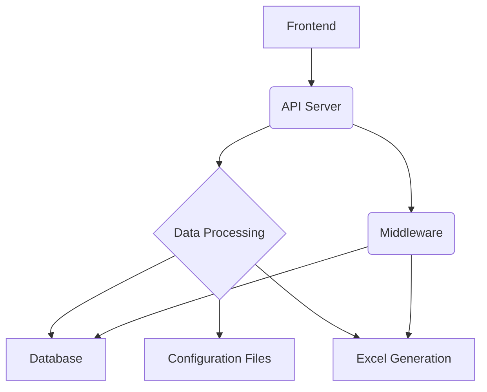
```mermaid
graph TD
    A[Frontend] --> B(API Server);
    B --> C{Data Processing};
    C --> D[Database];
    C --> E[Configuration Files];
    C --> F[Excel Generation];
    B --> G(Middleware);
    G --> F;
    G --> D;
```

Sources: [README.md:67-73](), [desa_db/server.py]()

### Frontend Interface

The frontend provides users with an interface to interact with the system. This includes login, data upload, dashboard views, and potentially other user-specific functionalities.

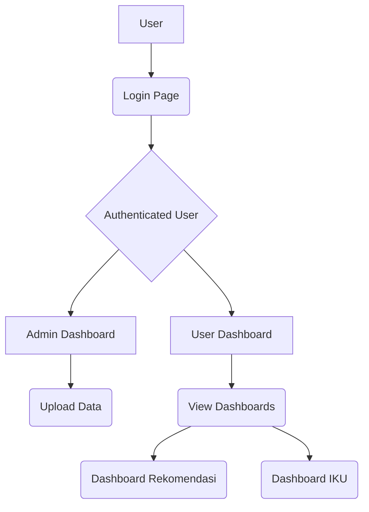
```mermaid
graph TD
    A[User] --> B(Login Page);
    B --> C{Authenticated User};
    C --> D[Admin Dashboard];
    C --> E[User Dashboard];
    D --> F(Upload Data);
    E --> G(View Dashboards);
    G --> H(Dashboard Rekomendasi);
    G --> I(Dashboard IKU);
```

Sources: [front_end/templates/login.html](), [front_end/templates/admin.html](), [front_end/templates/user.html]()

### Configuration Management

The system relies on various configuration files to define its behavior, data structures, and mappings. These files are typically located in a `.config/` directory.

Sources: [README.md:1-11]()

## Core Components and Functionality

### Data Integration and Processing

The project involves integrating data from various sources, likely for scoring and recommendation purposes. This includes handling different data formats and ensuring data integrity.

The `desa_db/server.py` script likely orchestrates the backend services, including data loading and processing. The `desa_db/middleware.py` script appears to handle the generation of Excel reports based on processed data and configurations.

Sources: [desa_db/server.py]()

#### Database Schema and Management

The system manages a database, likely for storing village data and related information. The `desa_db/server.py` script includes logic for creating and managing database tables, including `master_data` and a history table.

```sql
CREATE TABLE IF NOT EXISTS master_data (
    valid_from TIMESTAMP,
    valid_to TIMESTAMP,
    commit_id VARCHAR,
    source_file VARCHAR,
    "Col1" VARCHAR, -- Example column definition
    "Col2" TINYINT   -- Example column definition
)
```

The `master_data` table stores the latest snapshot of data, with columns defined based on headers from configuration files. It also includes metadata like `valid_from`, `valid_to`, `commit_id`, and `source_file`. An index is created on an `ID_COL` for performance.

Sources: [desa_db/server.py:117-135]()

### Excel Report Generation

A significant feature is the generation of Excel reports, which include multiple sheets for different data views. The `desa_db/middleware.py` script details the creation of these reports.

The system generates three main sheets:
1.  **Grid Data**: Likely a raw data export.
2.  **Dashboard Rekomendasi**: A dashboard summarizing scores and recommendations.
3.  **Dashboard IKU**: A dashboard focused on Indicator Kinerja Utama (IKU) scores.

The generation process involves defining styles, merging cells, setting column widths, and applying formatting for readability.

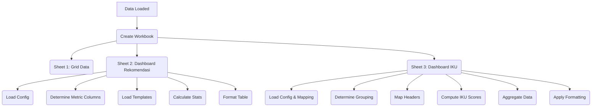
```mermaid
graph TD
    A[Data Loaded] --> B(Create Workbook);
    B --> C(Sheet 1: Grid Data);
    B --> D(Sheet 2: Dashboard Rekomendasi);
    D --> D1(Load Config);
    D --> D2(Determine Metric Columns);
    D --> D3(Load Templates);
    D --> D4(Calculate Stats);
    D --> D5(Format Table);
    B --> E(Sheet 3: Dashboard IKU);
    E --> E1(Load Config & Mapping);
    E --> E2(Determine Grouping);
    E --> E3(Map Headers);
    E --> E4(Compute IKU Scores);
    E --> E5(Aggregate Data);
    E --> E6(Apply Formatting);
```

Sources: [desa_db/middleware.py:25-150]()

#### Dashboard Rekomendasi Details

This dashboard sheet presents aggregated data, including proper merged headers for "SKOR" and "PELAKSANA" groups, optimized column widths, and rowspans for hierarchical data.

Sources: [desa_db/middleware.py:65-150]()

#### Dashboard IKU Details

This sheet focuses on Indicator Kinerja Utama (IKU) scores. It dynamically maps CSV headers to parent and sub-columns (statuses, averages, totals, achievements) based on the selected grouping level (Provinsi, Kabupaten, Kecamatan, Desa). It computes IKU scores, aggregates data, and applies formatting including heatmaps and number formats.

Sources: [desa_db/middleware.py:152-235](), [desa_db/server.py:236-355]()

### Configuration Files and Structure

The project uses several configuration files to define system behavior and data mappings.

| File Name                 | Description                                                              | Location    |
| :------------------------ | :----------------------------------------------------------------------- | :---------- |
| `auth_users.json`         | Stores user authentication details.                                      | `.config/`  |
| `headers.json`            | Maps standard column names to their aliases.                             | `.config/`  |
| `intervensi_kegiatan.json`| Contains templates for interventions and activities.                     | `.config/`  |
| `rekomendasi.json`        | Defines recommendation logic based on scores.                            | `.config/`  |
| `table_structure.csv`     | Defines the structure for the "Dashboard Rekomendasi" table.             | `.config/`  |
| `table_structure_IKU.csv` | Defines the structure for the "Dashboard IKU" table.                     | `.config/`  |
| `iku_mapping.json`        | Maps IKU parent metrics to their corresponding score columns.            | `.config/`  |

Sources: [README.md:1-11](), [tests/server_test.py:16-35]()

### Styling and Frontend Configuration

Frontend styling is managed using Tailwind CSS. The `tailwind.config.js` file defines the configuration for the CSS compilation.

```javascript
/** @type {import('tailwindcss').Config} */
module.exports = {
  darkMode: 'class',
  // Use **/*.html to scan all folders in the project for HTML files
  content: ["./**/*.html", "./static/**/*.js"],
  theme: {
    extend: {},
  },
  plugins: [],
}
```

The `output.css` file contains the compiled CSS, including utility classes for layout, typography, and colors.

Sources: [front_end/tailwind.config.js]()

## Deployment and Development

### Docker Deployment

Docker and Docker Compose are recommended for deploying the application. The `docker compose up -d --build` command initiates the build and deployment process.

Sources: [README.md:67-73]()


### Testing

Unit tests for the server components can be run using `pytest`. The `tests/server_test.py` file contains fixtures and test cases for the server functionality.

Sources: [README.md:75-77](), [tests/server_test.py]()

## User Interface Elements

### Login Page

The login page (`login.html`) features a custom font, a textured background, and a distinct login box with a shadow effect.

Sources: [front_end/templates/login.html]()

### Admin Dashboard

The admin dashboard (`admin.html`) includes functionalities like data upload, indicated by an icon and text.

Sources: [front_end/templates/admin.html]()

### User Dashboard

The user dashboard (`user.html`) provides access to different views, including "Dashboard IKU", visualized with an icon.

Sources: [front_end/templates/user.html]()

---

<a id='page-system-requirements'></a>

## System Requirements

### Related Pages

Related topics: [Project Introduction](#page-project-introduction), [Docker Deployment](#page-docker-deployment)

<details>
<summary>Relevant source files</summary>

- [README.md](https://github.com/anbe-on/integrasi_data_skor_rekomendasi_desa/blob/main/README.md)
- [.config/requirements.txt](https://github.com/anbe-on/integrasi_data_skor_rekomendasi_desa/blob/main/.config/requirements.txt)
- [desa_db/middleware.py](https://github.com/anbe-on/integrasi_data_skor_rekomendasi_desa/blob/main/desa_db/middleware.py)
- [desa_db/server.py](https://github.com/anbe-on/integrasi_data_skor_rekomendasi_desa/blob/main/desa_db/server.py)
- [front_end/tailwind.config.js](https://github.com/anbe-on/integrasi_data_skor_rekomendasi_desa/blob/main/front_end/tailwind.config.js)
- [front_end/templates/login.html](https://github.com/anbe-on/integrasi_data_skor_rekomendasi_desa/blob/main/front_end/templates/login.html)
- [tests/server_test.py](https://github.com/anbe-on/integrasi_data_skor_rekomendasi_desa/blob/main/tests/server_test.py)
</details>

# System Requirements

This document outlines the system requirements for the "integrasi_data_skor_rekomendasi_desa" project, covering its software dependencies, runtime environment, and execution setup. The system integrates data scoring and recommendation processes for villages, providing dashboards and reporting functionalities. Key components include a backend API, a frontend interface, and data processing logic. For more information on specific modules, refer to the [Backend API Documentation](#) and [Frontend Interface Guide](#).

## Software Dependencies

The project relies on a specific set of Python packages to function correctly. These are managed via a `requirements.txt` file.

### Python Version

The system is developed and tested with Python 3.11.9.
Sources: [README.md:14]()

### Core Python Packages

The following packages are listed in `.config/requirements.txt` and are essential for the project's backend and data processing functionalities.

| Package Name        | Version Specifier | Description                                     |
| :------------------ | :---------------- | :---------------------------------------------- |
| fastapi             | >=0.111.0         | Asynchronous web framework for building APIs.   |
| uvicorn             | >=0.27.0.post1    | ASGI server for running FastAPI applications.   |
| pandas              | >=2.2.1           | Data manipulation and analysis library.         |
| numpy               | >=1.26.4          | Numerical computing library.                    |
| openpyxl            | >=3.1.10          | Library for reading/writing Excel .xlsx files. |
| python-dotenv       | >=1.0.1           | To load environment variables from .env files.  |
| python-multipart    | >=0.0.9           | For handling form data, including file uploads. |
| psycopg2-binary     | >=2.9.9           | PostgreSQL adapter for Python.                  |
| SQLAlchemy          | >=2.0.29          | SQL toolkit and Object Relational Mapper.       |
| requests            | >=2.31.0          | HTTP library for making requests.               |
| pytest              | >=7.4.4           | Testing framework for Python.                   |
| pytest-mock         | >=3.12.0          | Fixtures for mocking in pytest.                 |
| python-jose[cryptography] | >=3.3.0       | JSON Web Token handling.                        |
| passlib[bcrypt]     | >=1.7.4           | Password hashing library.                       |
| Pillow              | >=10.2.0          | Python Imaging Library.                         |
| python-decouple     | >=3.4             | To help applications read settings from various sources. |
| pandas-stubs        | ^2.2.0.20240316   | Type stubs for pandas.                          |
| polars              | ^0.20.16          | High-performance DataFrame library.             |
| httpx               | >=0.27.0          | HTTP client for Python.                         |
Sources: [.config/requirements.txt]()

## Runtime Environment

The system has specific requirements for its execution environment, including operating system considerations and hardware recommendations.

### Operating System

Docker is required to run the application. On Windows, WSL (Windows Subsystem for Linux) is recommended for running Docker.
Sources: [README.md:17](), [README.md:69]()

### Hardware Recommendations

A CPU supporting AVX2 is recommended. This typically includes Intel 4th generation processors and AMD Ryzen processors.
Sources: [README.md:15]()

## Configuration

The project utilizes a configuration directory (`.config/`) and environment variables for managing settings.

### Configuration Files Directory

All configuration files are located within the `.config/` directory.
Sources: [README.md:1-2]()

### Key Configuration Files

*   `auth_users.json`: Stores user authentication details.
*   `headers.json`: Defines mappings for data headers.
*   `intervensi_kegiatan.json`: Contains templates for intervention activities.
*   `rekomendasi.json`: Holds recommendation logic and mappings.
*   `table_structure.csv`: Defines the structure for data tables.
*   `table_structure_IKU.csv`: Defines the structure for IKU (Indikator Kinerja Utama) tables.
*   `iku_mapping.json`: Maps IKU metrics.
Sources: [README.md:5-10](), [tests/server_test.py:15-37]()

### Environment Variables

A `.env` file is used to store sensitive or environment-specific settings.

*   `APP_SECRET_KEY`: A secret key for the application, which can be generated using `openssl rand -hex 32`.

Sources: [README.md:26-37]()

## Installation and Setup

The project is deployed using Docker. Ensure Docker and Docker Compose are installed before proceeding.

### Docker Installation and Run

1.  **Install Docker and Docker Compose:** Ensure these are installed on your system.
2.  **Build and Run:** Execute `docker compose up -d --build` in the project's root directory.
    *   The system will attempt to prepare Excel files from the database upon startup.

Sources: [README.md:67-73]()

## Running the System

The system is run entirely through Docker Compose.

### Running with Docker Compose

Execute `docker compose up -d --build` from the project root.
Sources: [README.md:71]()

## Frontend Development Setup

If `output.css` does not yet exist, compile Tailwind CSS before building the Docker image.

### Compiling Tailwind CSS

1.  **Navigate to Frontend Directory:** `cd front_end/`
2.  **Install Dependencies:** `npm install -D tailwindcss@3 postcss autoprefixer`
3.  **Initialize Tailwind CSS:** `npx tailwindcss init`
4.  **Configure `tailwind.config.js`:** Update the file with content scanning paths and theme extensions.
    ```javascript
    /** @type {import('tailwindcss').Config} */
    module.exports = {
      darkMode: 'class',
      // Use **/*.html to scan all folders in the project for HTML files
      content: ["./**/*.html", "./static/**/*.js"],
      theme: {
        extend: {},
      },
      plugins: [],
    }
    ```
    Sources: [front_end/tailwind.config.js]()
5.  **Compile CSS:** `npx tailwindcss -i ./static/css/input.css -o ./static/css/output.css --watch`

Sources: [README.md:39-66]()

## Testing

Unit tests for the server component are available and can be executed using pytest.

### Running Tests

Execute the following command in the project's root directory:
`pytest tests/server_test.py`
Sources: [README.md:77]()

## System Architecture Overview

The system comprises a backend API built with FastAPI, a frontend interface, and data processing modules.

### Backend API (`desa_db/server.py`)

The backend serves as the primary API layer, handling requests for data retrieval, processing, and dashboard generation. It utilizes libraries like FastAPI, Uvicorn, Pandas, and SQLAlchemy. It interacts with the database and orchestrates data transformations and report generation.

Sources: [desa_db/server.py]()

### Data Processing and Middleware (`desa_db/middleware.py`)

This module contains core logic for data manipulation, Excel report generation, dashboard statistics calculation, and IKU (Indikator Kinerja Utama) dashboard rendering. It reads configuration files, processes dataframes, and formats output for various sheets in an Excel workbook.

Sources: [desa_db/middleware.py]()

### Frontend (`front_end/`)

The frontend provides the user interface for interacting with the system. It includes HTML templates and is styled using Tailwind CSS. The `login.html` template demonstrates the UI structure and styling approach.

Sources: [front_end/templates/login.html](), [front_end/tailwind.config.js]()

### Workflow Example: Dashboard Generation

The generation of dashboard data involves several steps orchestrated by the middleware and backend.

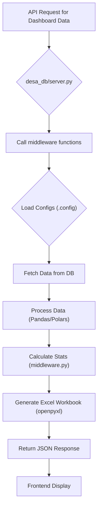
```mermaid
graph TD
    A[API Request for Dashboard Data] --> B{desa_db/server.py};
    B --> C[Call middleware functions];
    C --> D{"Load Configs (.config)"};
    D --> E[Fetch Data from DB];
    E --> F["Process Data (Pandas/Polars)"];
    F --> G["Calculate Stats (middleware.py)"];
    G --> H["Generate Excel Workbook (openpyxl)"];
    H --> I[Return JSON Response];
    I --> J[Frontend Display];
```
Sources: [desa_db/server.py:123-131](), [desa_db/middleware.py:136-146](), [desa_db/middleware.py:350-353]()

### Workflow Example: User Authentication

User authentication is handled, with a mock user provided for testing purposes.

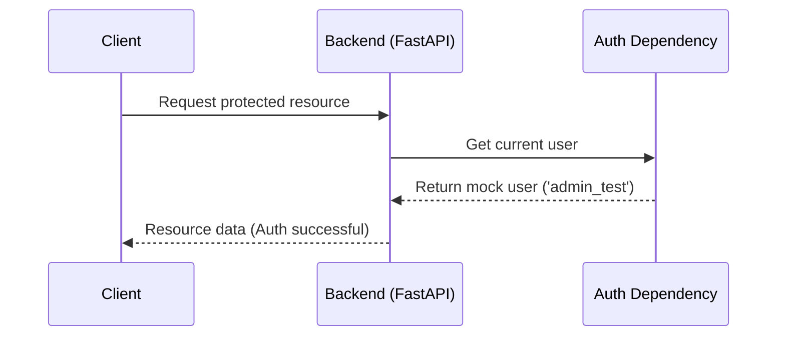
```mermaid
sequenceDiagram
    participant Client
    participant BackendAPI as Backend (FastAPI)
    participant AuthDependency as Auth Dependency
    
    Client->>BackendAPI: Request protected resource
    BackendAPI->>AuthDependency: Get current user
    AuthDependency-->>BackendAPI: Return mock user ('admin_test')
    BackendAPI-->>Client: Resource data (Auth successful)
```
Sources: [tests/server_test.py:40-43]()

## Development and Testing Setup

The project includes utilities and configurations for development and testing.

### Mock Data and Configuration Setup

The `tests/server_test.py` fixture demonstrates how to create mock configuration files (`headers.json`, `table_structure.csv`, `table_structure_IKU.csv`, `iku_mapping.json`, `rekomendasi.json`) necessary for testing the backend logic.

Sources: [tests/server_test.py:15-37]()

### Test Execution

The `pytest` framework is used for running tests, with a specific command provided to execute server tests.

Sources: [README.md:77]()

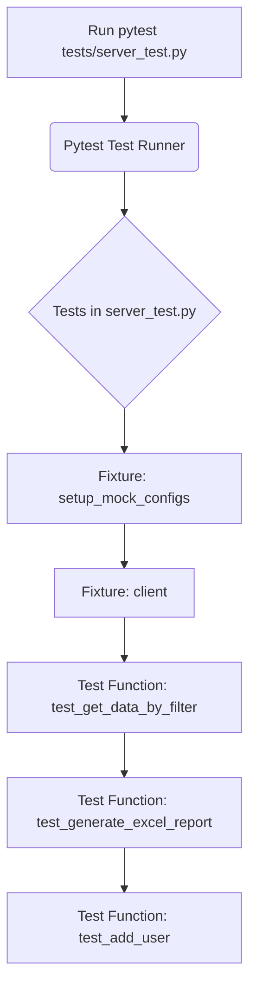
```mermaid
graph TD
    A[Run pytest tests/server_test.py] --> B(Pytest Test Runner);
    B --> C{Tests in server_test.py};
    C --> D[Fixture: setup_mock_configs];
    D --> E[Fixture: client];
    E --> F[Test Function: test_get_data_by_filter];
    F --> G[Test Function: test_generate_excel_report];
    G --> H[Test Function: test_add_user];
```
Sources: [tests/server_test.py]()

## Frontend Styling

Tailwind CSS is used for styling the frontend components. The configuration file `front_end/tailwind.config.js` defines the project's utility classes and scanning paths.

Sources: [front_end/tailwind.config.js]()

### Example Login Page Styling

The `front_end/templates/login.html` file showcases the application of Tailwind CSS for creating a visually distinct login interface with custom background patterns and box shadows.

Sources: [front_end/templates/login.html]()

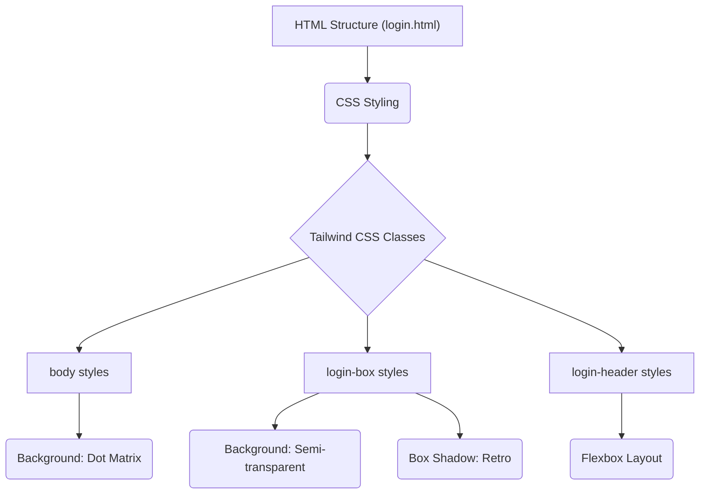
```mermaid
graph TD
    A["HTML Structure (login.html)"] --> B(CSS Styling);
    B --> C{Tailwind CSS Classes};
    C --> D[body styles];
    C --> E[login-box styles];
    C --> F[login-header styles];
    D --> G(Background: Dot Matrix);
    E --> H(Background: Semi-transparent);
    E --> I(Box Shadow: Retro);
    F --> J(Flexbox Layout);
```
Sources: [front_end/templates/login.html]()

This summary covers the essential system requirements, including software dependencies, runtime environment, configuration, installation, execution, and frontend styling, as derived from the provided source files.


---

<a id='page-architecture-overview'></a>

## Architecture Overview

### Related Pages

Related topics: [Data Flow Diagram](#page-data-flow), [Component Relationships](#page-component-relationships)

<details>
<summary>Relevant source files</summary>

- [docker-compose.yml](https://github.com/anbe-on/integrasi_data_skor_rekomendasi_desa/blob/main/docker-compose.yml)
- [nginx.conf](https://github.com/anbe-on/integrasi_data_skor_rekomendasi_desa/blob/main/nginx.conf)
- [desa_db/server.py](https://github.com/anbe-on/integrasi_data_skor_rekomendasi_desa/blob/main/desa_db/server.py)
- [front_end/router.py](https://github.com/anbe-on/integrasi_data_skor_rekomendasi_desa/blob/main/front_end/router.py)
- [desa_db/middleware.py](https://github.com/anbe-on/integrasi_data_skor_rekomendasi_desa/blob/main/desa_db/middleware.py)
- [front_end/tailwind.config.js](https://github.com/anbe-on/integrasi_data_skor_rekomendasi_desa/blob/main/front_end/tailwind.config.js)
- [front_end/static/css/output.css](https://github.com/anbe-on/integrasi_data_skor_rekomendasi_desa/blob/main/front_end/static/css/output.css)

</details>

# Architecture Overview

This document outlines the architectural overview of the "integrasi_data_skor_rekomendasi_desa" project. It details the system's structure, deployment, and core components, providing a foundational understanding for developers and system administrators. The system is designed as a backend API service and a frontend web application, orchestrated using Docker Compose for ease of deployment and management.

The architecture prioritizes modularity, with distinct services for the backend API, frontend, and supporting infrastructure like Nginx and database backups. This separation allows for independent scaling and maintenance of different parts of the system.

## System Deployment and Orchestration

The system is deployed using Docker Compose, which defines and manages the lifecycle of multiple services. This approach simplifies setup and ensures a consistent environment across different deployment targets.

### Docker Compose Services

The `docker-compose.yml` file defines the following primary services:

*   **`backup_id_srd_iku`**: A scheduled backup service that runs a backup script daily. It mounts volumes for database access and backup storage.
    Sources: [docker-compose.yml:3-8]()
*   **`backend_id_srd_iku`**: The main backend API service, built from the project's root directory. It exposes the API on port 8000 and manages configurations, databases, temporary files, exports, and frontend assets.
    Sources: [docker-compose.yml:10-18]()
*   **`frontend_id_srd_iku`**: The frontend application service, also built from the root directory. It communicates with the backend API using an internal Docker network URL and manages frontend assets. It depends on the backend service.
    Sources: [docker-compose.yml:20-28]()
*   **`nginx_id_srd_iku`**: An Nginx reverse proxy service that listens on port 8080 and forwards traffic to the backend and frontend applications. It serves static assets and pre-rendered exports. It depends on the backend and frontend services.
    Sources: [docker-compose.yml:30-36]()

### Service Interconnections

The services communicate via Docker's internal networking. The frontend is configured to use `http://backend_id_srd_iku:8000` for API calls. Nginx acts as the external entry point, directing traffic to the appropriate internal services.

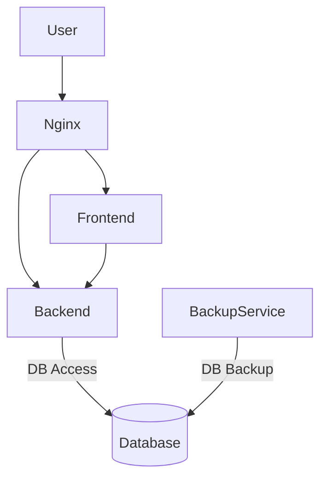
```mermaid
graph TD
    User --> Nginx
    Nginx --> Backend
    Nginx --> Frontend
    Frontend --> Backend
    Backend -- DB Access --> Database[(Database)]
    BackupService -- DB Backup --> Database
```

Sources: [docker-compose.yml]()

## Backend Service (`desa_db/server.py`)

The backend service is built using FastAPI and handles core application logic, API endpoints, and data processing.

### Core Functionality

*   **API Endpoints**: Provides RESTful API endpoints for login, data retrieval, and report generation.
*   **Authentication**: Implements JWT-based authentication with session tokens stored in HttpOnly cookies.
    Sources: [desa_db/server.py:111-134]()
*   **Data Processing**: Includes middleware functions for data integration, score calculation, and report generation (Excel).
    Sources: [desa_db/server.py:15-27]()
*   **File Handling**: Manages temporary file uploads and generates Excel reports.
    Sources: [desa_db/server.py:36-53]()
*   **Configuration**: Reads configuration from `.config` directory, including user authentication and table structures.
    Sources: [desa_db/server.py:55-69]()

### Key Components and Modules

*   **`auth_get_current_user`**: Dependency for user authentication.
    Sources: [desa_db/server.py:111]()
*   **`helpers_generate_excel_workbook`**: Function to create Excel workbooks.
    Sources: [desa_db/server.py:17]()
*   **`helpers_background_task_generate_pre_render_excel`**: For asynchronous Excel generation.
    Sources: [desa_db/server.py:18]()
*   **`CONFIG_DIR`**: Path to the configuration directory.
    Sources: [desa_db/server.py:22]()
*   **`TEMP_FOLDER`**: Directory for temporary file storage.
    Sources: [desa_db/server.py:38]()

### API Endpoints Overview

The backend exposes several API endpoints, including:

| Endpoint             | Method | Description                                 |
| :------------------- | :----- | :------------------------------------------ |
| `/api/login`         | POST   | Authenticates user and sets session token.  |
| `/api/data/preview`  | POST   | Generates a preview of processed data.      |
| `/api/data/export`   | POST   | Triggers Excel report generation.           |
| `/api/data/download` | GET    | Downloads generated Excel reports.          |
| `/api/data/status`   | GET    | Checks the status of report generation.     |
| `/api/data/progress` | GET    | Retrieves the progress of report generation.|

Sources: [desa_db/server.py]()

## Frontend Service (`front_end/router.py`)

The frontend service is responsible for the user interface and client-side interactions. It is likely built using a web framework that supports Server-Side Rendering (SSR) given the `router.py` file and its role in serving HTML.

### Key Responsibilities

*   **User Interface Rendering**: Serves HTML pages for user interaction, including login, dashboards, and data views.
    Sources: [front_end/router.py]()
*   **API Interaction**: Makes requests to the backend API to fetch data, submit forms, and trigger actions.
    Sources: [front_end/router.py:23]()
*   **Static Asset Serving**: Serves static files like CSS and JavaScript, managed by Nginx.
    Sources: [front_end/router.py:23]()

### Routing and Views

The `front_end/router.py` file defines routes that map URL paths to specific HTML templates or rendering functions.

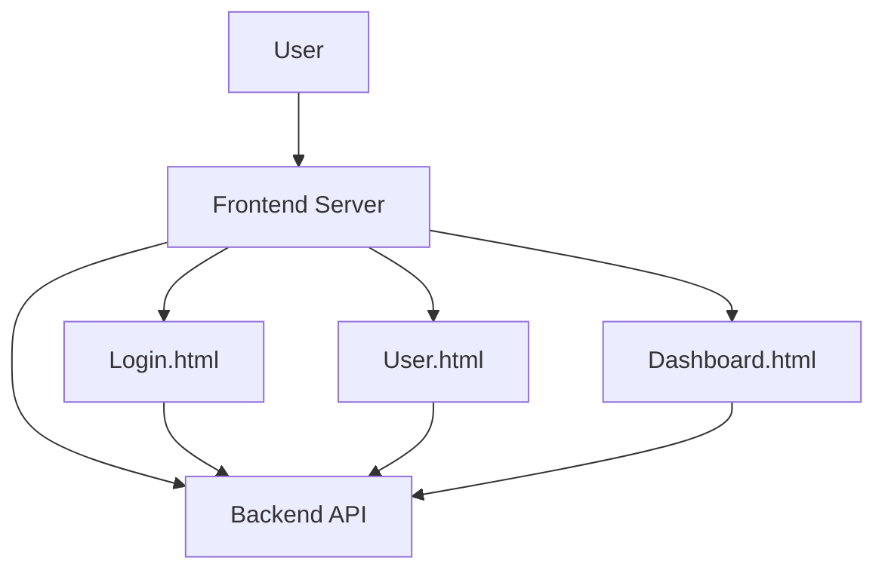
```mermaid
graph TD
    User --> FrontendServer[Frontend Server]
    FrontendServer --> LoginTemplate[Login.html]
    FrontendServer --> UserTemplate[User.html]
    FrontendServer --> DashboardTemplate[Dashboard.html]
    FrontendServer --> API[Backend API]
    LoginTemplate --> API
    UserTemplate --> API
    DashboardTemplate --> API
```

Sources: [front_end/router.py]()

## Reverse Proxy and Static Asset Management (Nginx)

Nginx serves as the primary entry point for external traffic, handling SSL termination (if configured), load balancing, and serving static assets efficiently.

### Nginx Configuration

The `nginx.conf` file configures Nginx to:

*   Listen on port 8080 for incoming HTTP requests.
*   Serve static files from specific directories (`/app/exports`, `/app/front_end/static`).
*   Proxy API requests to the backend service (`http://backend_id_srd_iku:8000`).
*   Proxy requests for the frontend application to the frontend service (`http://frontend_id_srd_iku:3000` or similar).

```nginx
# Simplified representation of nginx.conf
events {}
http {
    server {
        listen 80; # Nginx inside container listens on 80, mapped to 8080 by docker-compose

        location / {
            proxy_pass http://frontend_id_srd_iku:3000; # Example port for frontend
            proxy_set_header Host $host;
            proxy_set_header X-Real-IP $remote_addr;
            proxy_set_header X-Forwarded-For $proxy_add_x_forwarded_for;
            proxy_set_header X-Forwarded-Proto $scheme;
        }

        location /api/ {
            proxy_pass http://backend_id_srd_iku:8000;
            proxy_set_header Host $host;
            proxy_set_header X-Real-IP $remote_addr;
            proxy_set_header X-Forwarded-For $proxy_add_x_forwarded_for;
            proxy_set_header X-Forwarded-Proto $scheme;
        }

        location /exports/ {
            alias /app/exports/;
            expires 30d;
        }

        location /static/ {
            alias /app/front_end/static/;
            expires 30d;
        }
    }
}
```

Sources: [nginx.conf]()

## Configuration Management

The system relies on a `.config` directory for various configuration files, ensuring that sensitive information and application settings are managed separately from the code.

### Configuration Files

*   **`auth_users.json`**: Stores user credentials and roles.
    Sources: [docker-compose.yml:15]()
*   **`headers.json`**: Defines standard headers and their aliases for data processing.
    Sources: [tests/server_test.py:15]()
*   **`intervensi_kegiatan.json`**: Contains logic for intervention activities.
    Sources: [desa_db/middleware.py:16]()
*   **`rekomendasi.json`**: Contains logic for generating recommendations based on scores.
    Sources: [tests/server_test.py:41]()
*   **`table_structure.csv`**: Defines the structure for Rekomendasi ID data tables.
    Sources: [desa_db/middleware.py:13](), [tests/server_test.py:21]()
*   **`table_structure_IKU.csv`**: Defines the structure for IKU (Indikator Kinerja Utama) data tables.
    Sources: [desa_db/middleware.py:132](), [tests/server_test.py:27]()
*   **`iku_mapping.json`**: Contains logic for IKU table.
    Sources: [desa_db/middleware.py:137](), [tests/server_test.py:34]()

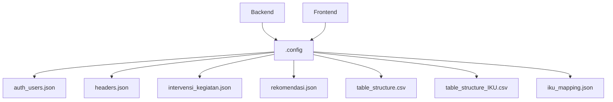
```mermaid
graph TD
    Backend --> ConfigDir[.config]
    Frontend --> ConfigDir
    ConfigDir --> AuthUsers[auth_users.json]
    ConfigDir --> Headers[headers.json]
    ConfigDir --> Intervensi[intervensi_kegiatan.json]
    ConfigDir --> Rekomendasi[rekomendasi.json]
    ConfigDir --> TableStructureCSV[table_structure.csv]
    ConfigDir --> TableStructureIKUCSV[table_structure_IKU.csv]
    ConfigDir --> IkuMappingJSON[iku_mapping.json]
```

Sources: [docker-compose.yml:15](), [desa_db/server.py:59](), [desa_db/middleware.py:13](), [desa_db/middleware.py:132](), [desa_db/middleware.py:137](), [tests/server_test.py:15](), [tests/server_test.py:21](), [tests/server_test.py:27](), [tests/server_test.py:34](), [tests/server_test.py:41]()

## Data Flow and Processing

The system processes data through a series of steps, from initial data loading and validation to score calculation, recommendation generation, and finally, report export.

### Data Loading and Preparation

Data is loaded from various sources and prepared for analysis. This involves:

1.  **Database Interaction**: The backend likely interacts with a database (not explicitly detailed in these files but implied by `helpers_get_db_connection` and `con.execute`).
    Sources: [desa_db/middleware.py:10]()
2.  **Configuration Loading**: Reading `table_structure.csv`, `headers.json`, and other configuration files to understand data schemas and mappings.
    Sources: [desa_db/middleware.py:13-30](), [desa_db/middleware.py:132-141]()
3.  **Header Mapping**: Aliases are mapped to standard headers using `headers.json`.
    Sources: [desa_db/middleware.py:31-40]()

### Score and Recommendation Calculation

The core logic for calculating scores and generating recommendations resides in the middleware and backend services.

1.  **Dashboard Statistics**: `helpers_calculate_dashboard_stats` computes averages, counts, and narrative summaries.
    Sources: [desa_db/middleware.py:44]()
2.  **IKU Score Calculation**: The "Dashboard IKU" sheet generation involves loading `table_structure_IKU.csv` and `iku_mapping.json` to compute IKU scores based on mapped children columns and aggregate them by grouping levels.
    Sources: [desa_db/middleware.py:130-230]()
3.  **Recommendation Logic**: `rekomendasi.json` is used to map scores to textual recommendations.
    Sources: [tests/server_test.py:41-45]()

### Report Generation

The system can generate Excel reports for data visualization and download.

1.  **Workbook Creation**: `helpers_generate_excel_workbook` creates the Excel file structure.
    Sources: [desa_db/server.py:20]()
2.  **Asynchronous Generation**: `helpers_background_task_generate_pre_render_excel` handles the generation in the background.
    Sources: [desa_db/server.py:21]()
3.  **Export and Download**: API endpoints manage the process of exporting and downloading these generated reports.
    Sources: [desa_db/server.py:166-182]()

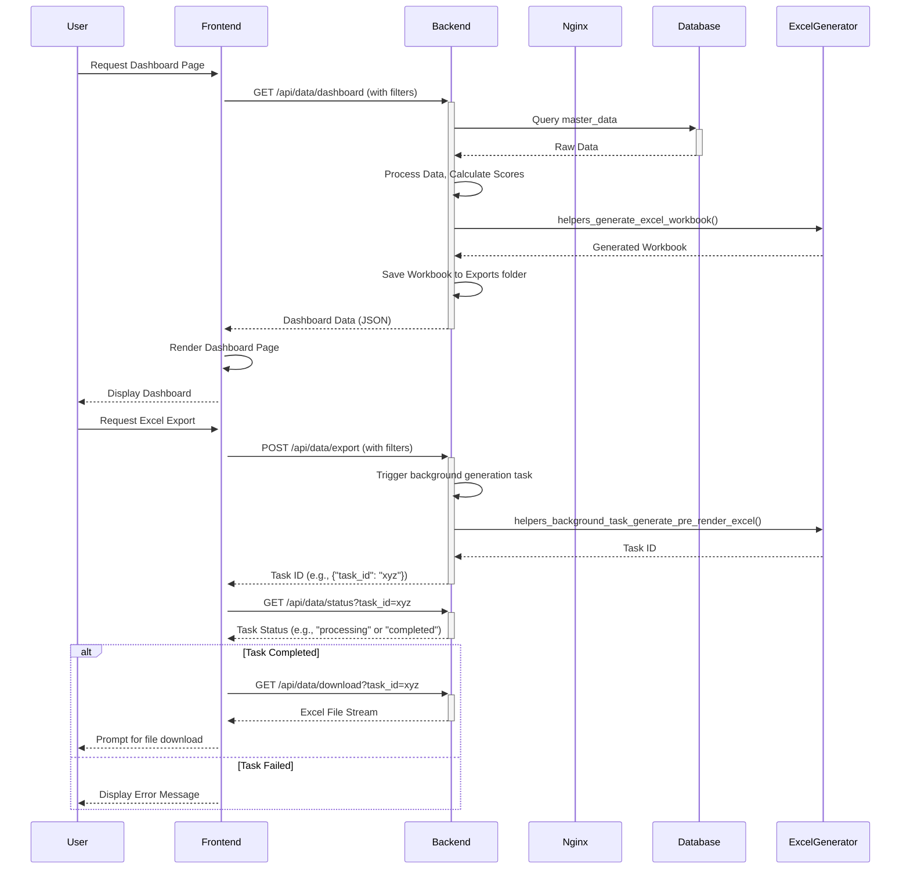
```mermaid
sequenceDiagram
    participant User
    participant Frontend
    participant Backend
    participant Nginx
    participant Database
    participant ExcelGenerator

    User->>+Frontend: Request Dashboard Page
    Frontend->>+Backend: GET /api/data/dashboard (with filters)
    Backend->>+Database: Query master_data
    Database-->>-Backend: Raw Data
    Backend->>Backend: Process Data, Calculate Scores
    Backend->>ExcelGenerator: helpers_generate_excel_workbook()
    ExcelGenerator-->>Backend: Generated Workbook
    Backend->>Backend: Save Workbook to Exports folder
    Backend-->>-Frontend: Dashboard Data (JSON)
    Frontend->>Frontend: Render Dashboard Page
    Frontend-->>User: Display Dashboard

    User->>+Frontend: Request Excel Export
    Frontend->>+Backend: POST /api/data/export (with filters)
    Backend->>Backend: Trigger background generation task
    Backend->>ExcelGenerator: helpers_background_task_generate_pre_render_excel()
    ExcelGenerator-->>Backend: Task ID
    Backend-->>-Frontend: Task ID (e.g., {"task_id": "xyz"})
    Frontend->>+Backend: GET /api/data/status?task_id=xyz
    Backend-->>-Frontend: Task Status (e.g., "processing" or "completed")

    alt Task Completed
        Frontend->>+Backend: GET /api/data/download?task_id=xyz
        Backend-->>-Frontend: Excel File Stream
        Frontend-->>User: Prompt for file download
    else Task Failed
        Frontend-->>User: Display Error Message
    end
```

Sources: [desa_db/server.py](), [front_end/router.py](), [docker-compose.yml]()

## Frontend Styling and Theming

The frontend utilizes Tailwind CSS for styling, allowing for rapid UI development and consistent theming.

### Tailwind CSS Configuration

The `tailwind.config.js` file configures Tailwind CSS, defining its behavior and how it scans for HTML files to generate styles.

*   **Content Scanning**: Scans `**/*.html` and `./static/**/*.js` for class names.
    Sources: [front_end/tailwind.config.js:4]()
*   **Dark Mode**: Enabled via `darkMode: 'class'`.
    Sources: [front_end/tailwind.config.js:3]()
*   **Plugins**: No custom plugins are defined in this configuration.
    Sources: [front_end/tailwind.config.js:8]()

### Utility Classes

The `front_end/static/css/output.css` file contains the compiled Tailwind CSS utility classes, which are used throughout the frontend templates (e.g., `p-3`, `text-center`, `font-bold`).

Sources: [front_end/static/css/output.css]()

## Conclusion

The "integrasi_data_skor_rekomendasi_desa" system employs a microservices-like architecture orchestrated by Docker Compose. This design promotes scalability, maintainability, and ease of deployment. The backend FastAPI application handles core logic and API services, while the frontend provides the user interface. Nginx acts as a reverse proxy and static file server, and a robust configuration system under `.config` ensures modularity and security. The clear separation of concerns and well-defined communication channels between services form the foundation of the system's architecture.

---

<a id='page-data-flow'></a>

## Data Flow Diagram

### Related Pages

Related topics: [Architecture Overview](#page-architecture-overview), [Database Structure](#page-database-structure)

<details>
<summary>Relevant source files</summary>

- [desa_db/server.py](https://github.com/anbe-on/integrasi_data_skor_rekomendasi_desa/blob/main/desa_db/server.py)
- [desa_db/middleware.py](https://github.com/anbe-on/integrasi_data_skor_rekomendasi_desa/blob/main/desa_db/middleware.py)
- [front_end/router.py](https://github.com/anbe-on/integrasi_data_skor_rekomendasi_desa/blob/main/front_end/router.py)
- [tests/server_test.py](https://github.com/anbe-on/integrasi_data_skor_rekomendasi_desa/blob/main/tests/server_test.py)
- [README.md](https://github.com/anbe-on/integrasi_data_skor_rekomendasi_desa/blob/main/README.md)
- [front_end/tailwind.config.js](https://github.com/anbe-on/integrasi_data_skor_rekomendasi_desa/blob/main/front_end/tailwind.config.js)
- [front_end/static/css/output.css](https://github.com/anbe-on/integrasi_data_skor_rekomendasi_desa/blob/main/front_end/static/css/output.css)

</details>

# Data Flow Diagram

This document outlines the data flow and architectural components involved in the integration of village score and recommendation data. The system processes data from various sources, transforms it, and presents it through different interfaces, including Excel exports and web-based dashboards. The core functionality revolves around data ingestion, processing, database interaction, and user-facing presentations.

The system can be broadly divided into backend services (FastAPI), middleware logic, and frontend presentation layers. The backend handles API requests, authentication, and orchestrates data processing tasks, while the middleware contains the core business logic for data manipulation, database operations, and report generation. The frontend provides user interfaces for data visualization and interaction.

Sources: [desa_db/server.py:1-13]()

## Core Components and Data Flow

The system utilizes a FastAPI backend to manage API endpoints and user authentication. Data processing and database interactions are handled by middleware functions. Configuration files play a crucial role in defining data structures, mappings, and recommendations.

### Backend API Endpoints

The FastAPI application serves as the primary interface for client requests. Key endpoints include login, data upload, report generation, and data retrieval for dashboards.

Sources: [desa_db/server.py:70-176]()

#### Authentication Flow

User authentication is handled via JWT tokens stored in HttpOnly cookies. Upon successful login, a token is generated and sent back to the client.

Sources: [desa_db/server.py:87-110]()

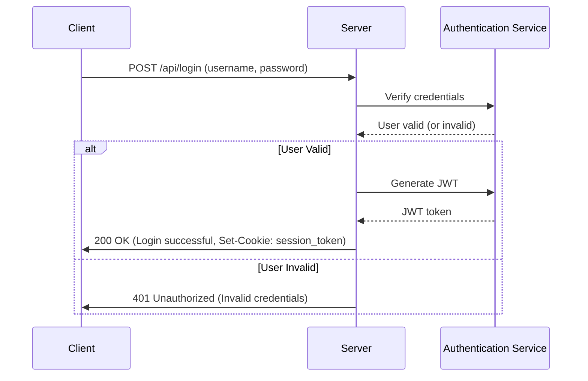
```mermaid
sequenceDiagram
    participant Client
    participant FastAPI as Server
    participant Auth as Authentication Service

    Client->>FastAPI: POST /api/login (username, password)
    FastAPI->>Auth: Verify credentials
    Auth-->>FastAPI: User valid (or invalid)
    alt User Valid
        FastAPI->>Auth: Generate JWT
        Auth-->>FastAPI: JWT token
        FastAPI->>Client: 200 OK (Login successful, Set-Cookie: session_token)
    else User Invalid
        FastAPI->>Client: 401 Unauthorized (Invalid credentials)
    end
```

Sources: [desa_db/server.py:87-110]()

#### Data Upload and Processing

The system supports uploading data via Excel files. These files are processed by middleware functions, which may involve reading previews, mapping headers, and internal processing before database storage.

Sources: [desa_db/server.py:185-213](), [desa_db/middleware.py:110-143]()

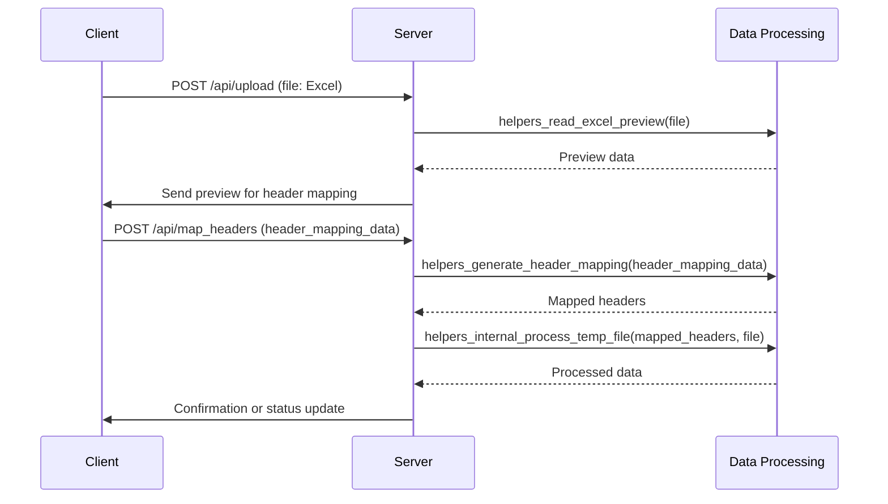
```mermaid
sequenceDiagram
    participant Client
    participant FastAPI as Server
    participant Middleware as Data Processing

    Client->>FastAPI: POST /api/upload (file: Excel)
    FastAPI->>Middleware: helpers_read_excel_preview(file)
    Middleware-->>FastAPI: Preview data
    FastAPI->>Client: Send preview for header mapping
    Client->>FastAPI: POST /api/map_headers (header_mapping_data)
    FastAPI->>Middleware: helpers_generate_header_mapping(header_mapping_data)
    Middleware-->>FastAPI: Mapped headers
    FastAPI->>Middleware: helpers_internal_process_temp_file(mapped_headers, file)
    Middleware-->>FastAPI: Processed data
    FastAPI->>Client: Confirmation or status update
```

Sources: [desa_db/server.py:185-213](), [desa_db/middleware.py:110-143]()

### Middleware Logic

The middleware layer contains the core business logic, including database operations, data transformation, and report generation.

Sources: [desa_db/middleware.py]()

#### Database Initialization and Management

The middleware handles the initialization of the database, creating tables like `master_data` and history tables if they do not exist. It defines column types based on configuration and data content.

Sources: [desa_db/middleware.py:229-268]()

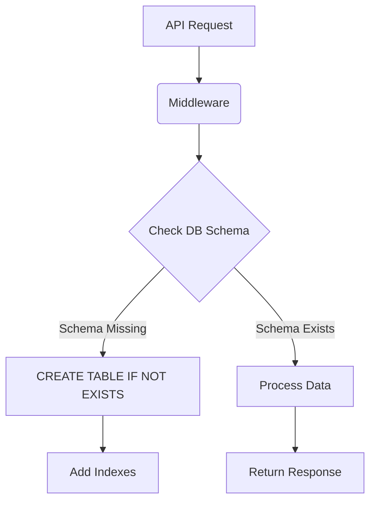
```mermaid
graph TD
    A[API Request] --> B(Middleware);
    B --> C{Check DB Schema};
    C -- Schema Missing --> D[CREATE TABLE IF NOT EXISTS];
    D --> E[Add Indexes];
    C -- Schema Exists --> F[Process Data];
    F --> G[Return Response];
```

Sources: [desa_db/middleware.py:229-268]()

#### Report Generation (Excel)

The system can generate Excel workbooks containing grid data, dashboard recommendations, and IKU dashboards. This involves creating sheets, applying formatting, merging cells, and populating data.

Sources: [desa_db/middleware.py:271-444]()

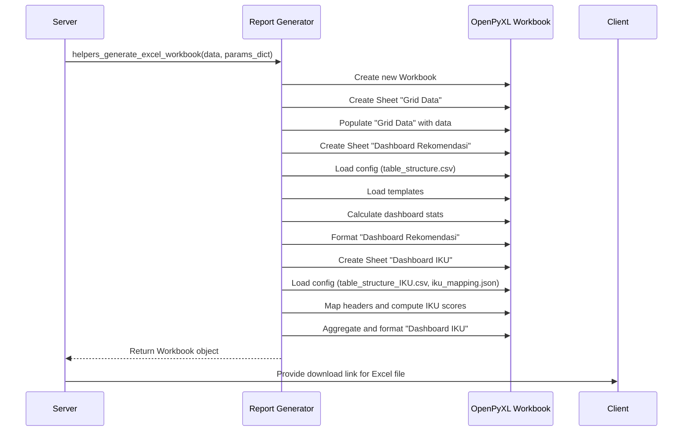
```mermaid
sequenceDiagram
    participant FastAPI as Server
    participant Middleware as Report Generator
    participant Workbook as OpenPyXL Workbook

    FastAPI->>Middleware: helpers_generate_excel_workbook(data, params_dict)
    Middleware->>Workbook: Create new Workbook
    Middleware->>Workbook: Create Sheet "Grid Data"
    Middleware->>Workbook: Populate "Grid Data" with data
    Middleware->>Workbook: Create Sheet "Dashboard Rekomendasi"
    Middleware->>Workbook: Load config (table_structure.csv)
    Middleware->>Workbook: Load templates
    Middleware->>Workbook: Calculate dashboard stats
    Middleware->>Workbook: Format "Dashboard Rekomendasi"
    Middleware->>Workbook: Create Sheet "Dashboard IKU"
    Middleware->>Workbook: Load config (table_structure_IKU.csv, iku_mapping.json)
    Middleware->>Workbook: Map headers and compute IKU scores
    Middleware->>Workbook: Aggregate and format "Dashboard IKU"
    Middleware-->>FastAPI: Return Workbook object
    FastAPI->>Client: Provide download link for Excel file
```

Sources: [desa_db/middleware.py:271-444]()

#### Dashboard Rendering (HTML)

The system renders HTML-based dashboards for recommendations and IKU (Indikator Kinerja Utama). This involves dynamic HTML generation based on data and configuration.

Sources: [desa_db/middleware.py:446-665](), [desa_db/middleware.py:667-857]()

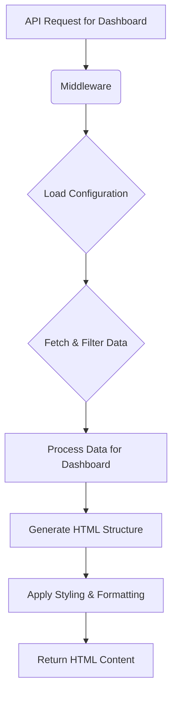
```mermaid
graph TD
    A[API Request for Dashboard] --> B(Middleware);
    B --> C{Load Configuration};
    C --> D{Fetch & Filter Data};
    D --> E[Process Data for Dashboard];
    E --> F[Generate HTML Structure];
    F --> G[Apply Styling & Formatting];
    G --> H[Return HTML Content];
```

Sources: [desa_db/middleware.py:446-665](), [desa_db/middleware.py:667-857]()

### Frontend Components

The frontend is responsible for user interaction, displaying data, and making requests to the backend API. It uses Tailwind CSS for styling.

Sources: [front_end/router.py](), [front_end/tailwind.config.js]()

#### Routing

The frontend router defines the different views and pages accessible to the user, mapping URLs to specific template files.

Sources: [front_end/router.py]()

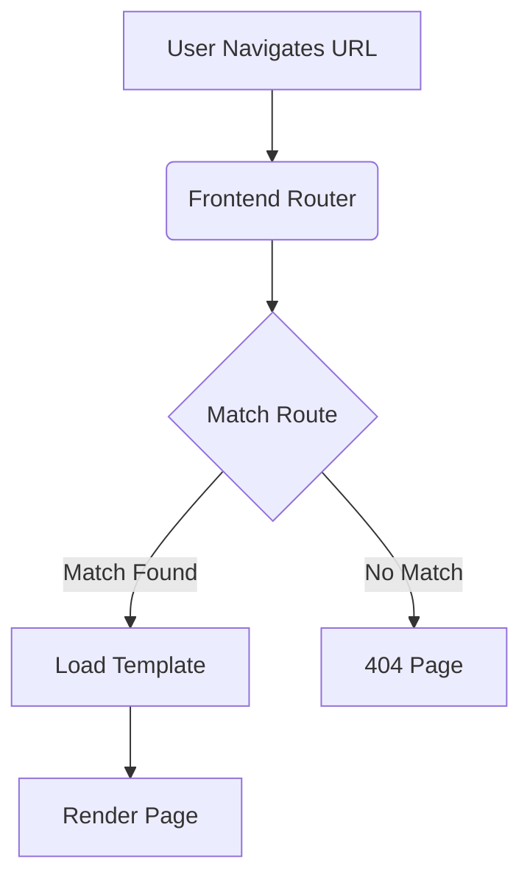
```mermaid
graph TD
    A[User Navigates URL] --> B(Frontend Router);
    B --> C{Match Route};
    C -- Match Found --> D[Load Template];
    D --> E[Render Page];
    C -- No Match --> F[404 Page];
```

Sources: [front_end/router.py]()

## Configuration and Data Models

The system relies heavily on configuration files to define data structures, mappings, and business logic.

Sources: [README.md]()

### Configuration Files

Configuration is managed through JSON and CSV files, typically located in the `.config/` directory.

Sources: [README.md:5-10]()

| File Name           | Description                                    | Format |
| :------------------ | :--------------------------------------------- | :----- |
| `auth_users.json`   | Stores user credentials and roles.             | JSON   |
| `headers.json`      | Maps standard headers to aliases.              | JSON   |
| `intervensi_kegiatan.json` | Stores intervention and activity templates. | JSON   |
| `rekomendasi.json`  | Defines recommendation logic based on scores.  | JSON   |
| `table_structure.csv` | Defines the structure for the recommendation dashboard. | CSV    |
| `table_structure_IKU.csv` | Defines the structure for the IKU dashboard. | CSV    |
| `iku_mapping.json`  | Maps parent IKU metrics to child columns.      | JSON   |

Sources: [README.md:5-10](), [tests/server_test.py:21-44]()

### Database Schema

The `master_data` table is central to storing the village scores. It includes metadata columns and dynamically generated score columns. History tables may also be present for auditing.

Sources: [desa_db/middleware.py:239-257]()

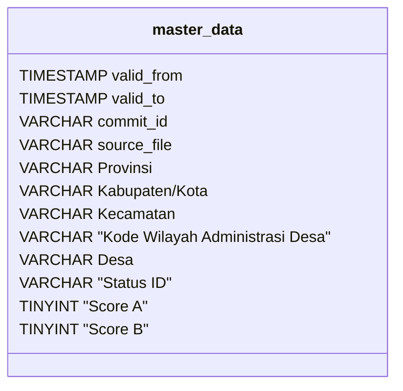
```mermaid
classDiagram
    class master_data {
        TIMESTAMP valid_from
        TIMESTAMP valid_to
        VARCHAR commit_id
        VARCHAR source_file
        VARCHAR Provinsi
        VARCHAR Kabupaten/Kota
        VARCHAR Kecamatan
        VARCHAR "Kode Wilayah Administrasi Desa"
        VARCHAR Desa
        VARCHAR "Status ID"
        TINYINT "Score A"
        TINYINT "Score B"
        %% ... other score columns dynamically added
    }

```

Sources: [desa_db/middleware.py:239-257]()

## Testing and Development Setup

The project provides instructions for setting up the development environment, running tests, and deploying using Docker.

Sources: [README.md]()

### Docker Deployment

Docker Compose is recommended for running the application, ensuring consistent environments for development and production.

Sources: [README.md:39-66]()

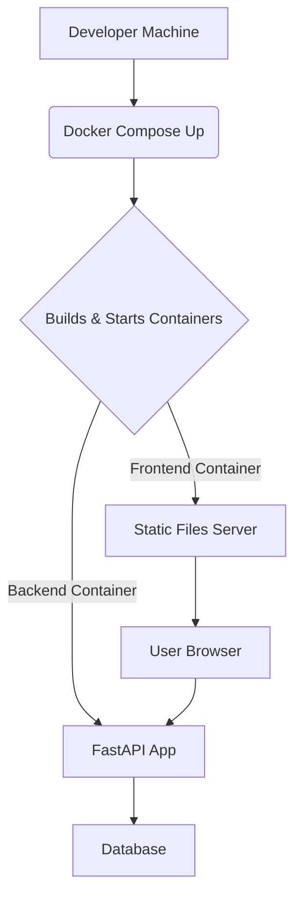
```mermaid
graph TD
    A[Developer Machine] --> B(Docker Compose Up);
    B --> C{Builds & Starts Containers};
    C -- Backend Container --> D[FastAPI App];
    C -- Frontend Container --> E[Static Files Server];
    D --> F[Database];
    E --> G[User Browser];
    G --> D;
```

Sources: [README.md:39-66]()

### Unit and Integration Testing

Tests are available to verify the functionality of the server endpoints and middleware logic.

Sources: [tests/server_test.py]()

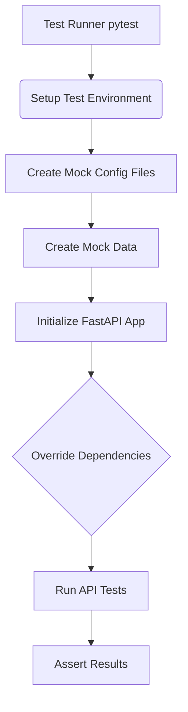
```mermaid
graph TD
    A[Test Runner pytest] --> B(Setup Test Environment)
    B --> C[Create Mock Config Files]
    C --> D[Create Mock Data]
    D --> E[Initialize FastAPI App]
    E --> F{Override Dependencies}
    F --> G[Run API Tests]
    G --> H[Assert Results]
```

Sources: [tests/server_test.py]()

## Summary

The "Data Flow Diagram" illustrates a well-structured system where a FastAPI backend orchestrates data processing via middleware functions. Configuration files are central to defining data structures and logic, enabling dynamic report and dashboard generation. The system supports data uploads, authentication, and provides both Excel exports and web-based visualizations, with a clear separation of concerns between backend, middleware, and frontend.

Sources: [desa_db/server.py](), [desa_db/middleware.py](), [front_end/router.py](), [README.md]()

---

<a id='page-component-relationships'></a>

## Component Relationships

### Related Pages

Related topics: [Architecture Overview](#page-architecture-overview), [Data Flow Diagram](#page-data-flow)

<details>
<summary>Relevant source files</summary>

- [docker-compose.yml](https://github.com/anbe-on/integrasi_data_skor_rekomendasi_desa/blob/main/docker-compose.yml)
- [desa_db/server.py](https://github.com/anbe-on/integrasi_data_skor_rekomendasi_desa/blob/main/desa_db/server.py)
- [front_end/router.py](https://github.com/anbe-on/integrasi_data_skor_rekomendasi_desa/blob/main/front_end/router.py)
- [desa_db/auth.py](https://github.com/anbe-on/integrasi_data_skor_rekomendasi_desa/blob/main/desa_db/auth.py)
- [desa_db/middleware.py](https://github.com/anbe-on/integrasi_data_skor_rekomendasi_desa/blob/main/desa_db/middleware.py)
- [front_end/static/css/output.css](https://github.com/anbe-on/integrasi_data_skor_rekomendasi_desa/blob/main/front_end/static/css/output.css)
- [tests/server_test.py](https://github.com/anbe-on/integrasi_data_skor_rekomendasi_desa/blob/main/tests/server_test.py)
- [front_end/templates/login.html](https://github.com/anbe-on/integrasi_data_skor_rekomendasi_desa/blob/main/front_end/templates/login.html)
- [front_end/tailwind.config.js](https://github.com/anbe-on/integrasi_data_skor_rekomendasi_desa/blob/main/front_end/tailwind.config.js)

</details>

# Component Relationships

This document outlines the relationships and interactions between the various components of the "Integrasi Data Skor Rekomendasi Desa" project. The system is architected with a backend API service, a frontend web interface, and supporting services managed by Docker Compose. The primary goal is to integrate data, calculate scores, and provide recommendations at the village level.

The system comprises several key components:

*   **Backend Service (`desa_db`)**: Implemented using FastAPI, this service handles data processing, API requests, database interactions, and business logic. It exposes endpoints for data retrieval, authentication, and report generation.
*   **Frontend Service (`front_end`)**: A web interface built with HTML, CSS (Tailwind CSS), and JavaScript, responsible for user interaction, data visualization, and communication with the backend API.
*   **Database**: Although not explicitly detailed in the provided files, the backend interacts with a database (implied by `helpers_get_db_connection` and SQL queries in `middleware.py`).
*   **Configuration**: Various JSON and CSV files within the `.config` directory manage system settings, data mappings, and headers.
*   **Docker Orchestration**: `docker-compose.yml` defines the services, their dependencies, volumes, and network configurations for deployment.

## Backend Service (`desa_db`)

The backend service, `desa_db/server.py`, serves as the core of the application. It's built with FastAPI and integrates various helper functions from `desa_db/middleware.py` and authentication logic from `desa_db/auth.py`.

### Core Functionality and Modules

The backend manages several critical functions:

*   **API Endpoints**: Exposes RESTful APIs for login, data retrieval, file uploads, and report generation.
*   **Authentication**: Handles user login and JWT token generation/validation.
*   **Data Processing**: Includes functions for reading Excel previews, generating header mappings, processing temporary files, and building dynamic database queries.
*   **Dashboard Generation**: Logic for calculating dashboard statistics and rendering HTML for both general dashboards and IKU (Indikator Kinerja Utama) dashboards.
*   **Excel Report Generation**: Creates Excel workbooks with multiple sheets for data visualization and reporting.
*   **Background Tasks**: Supports asynchronous generation of pre-rendered Excel files.

Sources: [desa_db/server.py:1-250](), [desa_db/middleware.py]()

### Authentication Flow

User authentication is managed by `desa_db/auth.py` and integrated into `desa_db/server.py`.

1.  **Login Request**: A `LoginRequest` model is defined for username and password.
2.  **Authentication Check**: The `/api/login` endpoint retrieves user credentials from `auth_users.json`, verifies the password against a stored hash using `auth_verify_password`.
3.  **JWT Generation**: Upon successful authentication, a JWT access token is generated with an expiration time.
4.  **Cookie Setting**: The JWT is set as an HttpOnly cookie named `session_token` in the response.

Sources: [desa_db/server.py:119-154](), [desa_db/auth.py]()

```mermaid
graph TD
    A[User] --> B(Frontend)
    B --> C{"POST /api/login"}
    C --> D["desa_db/server.py"]
    D --> E["desa_db/auth.py"]
    E -- "Verify Credentials" --> F["auth_users.json"]
    F -- "Credentials Match" --> E
    E -- "Generate JWT" --> D
    D -- "Set HttpOnly Cookie" --> G[Response]
    G --> B
    B -- "Redirect/Load Page" --> A
```

### Data Processing and Reporting

The backend utilizes configuration files and helper functions to process data and generate reports.

*   **Configuration Files**: `headers.json`, `table_structure.csv`, `table_structure_IKU.csv`, `iku_mapping.json`, and `rekomendasi.json` are crucial for defining data structures, mappings, and scoring logic.
*   **Dashboard Generation**:
    *   `helpers_calculate_dashboard_stats`: Computes statistics for the main dashboard.
    *   `helpers_render_dashboard_html`: Generates the HTML for the main dashboard table.
    *   `helpers_render_iku_dashboard`: Generates the HTML for the IKU dashboard.
*   **Excel Generation**:
    *   `helpers_generate_excel_workbook`: Creates the Excel workbook structure.
    *   `helpers_background_task_generate_pre_render_excel`: Handles asynchronous Excel generation.

Sources: [desa_db/server.py:16-26](), [desa_db/middleware.py:45-359](), [tests/server_test.py:15-36]()

```mermaid
graph TD
    A[Frontend] ->> B{API Request};
    B -> C{desa_db/server.py};
    C -- Load Config --> D[.config/];
    D -- headers.json --> C;
    D -- table_structure.csv --> C;
    D -- table_structure_IKU.csv --> C;
    D -- iku_mapping.json --> C;
    D -- rekomendasi.json --> C;
    C -- Process Data --> E[desa_db/middleware.py];
    E -- Calculate Stats --> F[helpers_calculate_dashboard_stats];
    E -- Render HTML --> G[helpers_render_dashboard_html];
    E -- Render IKU HTML --> H[helpers_render_iku_dashboard];
    E -- Generate Excel --> I[helpers_generate_excel_workbook];
    E -- Background Excel --> J[helpers_background_task_generate_pre_render_excel];
    F --> K[Database];
    G --> L[Response (HTML)];
    H --> L;
    I --> M[Response (Excel)];
    J --> M;
```

## Frontend Service (`front_end`)

The frontend provides the user interface for interacting with the backend services. It uses HTML, CSS (Tailwind CSS), and JavaScript.

### Key Files and Technologies

*   **HTML Templates**: `login.html`, `user.html`, `admin.html` define the structure of different user interfaces.
*   **CSS**: `output.css` generated from Tailwind CSS provides styling. `tailwind.config.js` configures Tailwind.
*   **Routing**: `front_end/router.py` handles client-side routing or serves static assets.
*   **API Communication**: JavaScript within the HTML templates or separate JS files (not provided) would handle making requests to the backend API.

Sources: [front_end/templates/login.html](), [front_end/templates/user.html](), [front_end/templates/admin.html](), [front_end/tailwind.config.js](), [front_end/router.py]()

### Styling with Tailwind CSS

Tailwind CSS is used for styling, configured via `front_end/tailwind.config.js` and compiled into `front_end/static/css/output.css`.

Sources: [front_end/tailwind.config.js](), [front_end/static/css/output.css]()

```mermaid
graph TD
    A[User] -> B(Browser);
    B -- Loads --> C[front_end/router.py];
    C -- Serves --> D[HTML Templates];
    D -- Links --> E[front_end/static/css/output.css];
    E -- Uses --> F[Tailwind CSS];
    F -- Configured by --> G[front_end/tailwind.config.js];
    D -- Contains --> H[JavaScript for API Calls];
    H ->> I[API_BASE_URL];
    I -- e.g. --> J[http://backend_id_srd_iku:8000];
    J ->> K[Backend Service];
```

## Docker Orchestration (`docker-compose.yml`)

Docker Compose is used to define and manage the application's services, ensuring a consistent and reproducible environment.

### Services Defined

*   **`backend_id_srd_iku`**: Runs the FastAPI backend service. It mounts configuration, database, temporary files, exports, and frontend directories. It also uses environment variables from `.env`.
*   **`frontend_id_srd_iku`**: Runs the frontend service, configured to communicate with the backend via `API_BASE_URL`.
*   **`nginx_id_srd_iku`**: A reverse proxy using Nginx to route external traffic to the frontend. It exposes port 8080.
*   **`backup_id_srd_iku`**: A service for automated database backups using a script.

Sources: [docker-compose.yml]()

```mermaid
graph TD
    subgraph Docker Environment
        A[User/External Access] --> B(Nginx);
        B -- Port 8080 --> C(Frontend Service);
        C -- API Calls --> D(Backend Service);
        D -- Reads/Writes --> E(Configuration/.config);
        D -- Reads/Writes --> F(Database/desa_db/dbs);
        D -- Reads/Writes --> G(Temporary Files/desa_db/temp);
        D -- Reads/Writes --> H(Exports/exports);
        C -- Reads --> I(Frontend Static Files/front_end/static);
        J(Backup Service) -- Runs Script --> K(Backup Script);
        J -- Accesses --> F;
        J -- Saves to --> L(Backups Folder);
    end

    %% Service Definitions
    B -- Manages --> C;
    C -- Depends on --> D;
    B -- Depends on --> C;
    J -- Runs --> K;
```

## Configuration Management

Configuration is centralized and managed through various files, primarily located in the `.config` directory.

### Key Configuration Files

*   **`.config/auth_users.json`**: Stores user credentials (username, hashed password, role) for authentication.
*   **`.config/headers.json`**: Defines standard column headers and their aliases for data import and processing.
*   **`.config/intervensi_kegiatan.json`**: Contains data related to intervention activities.
*   **`.config/rekomendasi.json`**: Maps scores to specific recommendation texts.
*   **`.config/table_structure.csv`**: Defines the structure of tables, including dimensions, sub-dimensions, indicators, and items.
*   **`.config/table_structure_IKU.csv`**: Defines the structure for IKU (Key Performance Indicator) tables.
*   **`.config/iku_mapping.json`**: Maps IKU parent metrics to their constituent sub-metrics.
*   **`.env`**: Environment variables, particularly `APP_SECRET_KEY`, used for application secrets.

Sources: [tests/server_test.py:15-36](), [README.md:5-10]()

```mermaid
graph TD
    A[Backend Service] --> B(Configuration Files);
    B -- Loads --> C[.config/auth_users.json];
    B -- Loads --> D[.config/headers.json];
    B -- Loads --> E[.config/intervensi_kegiatan.json];
    B -- Loads --> F[.config/rekomendasi.json];
    B -- Loads --> G[.config/table_structure.csv];
    B -- Loads --> H[.config/table_structure_IKU.csv];
    B -- Loads --> I[.config/iku_mapping.json];
    J[Backend Service] -- Reads --> K[.env];
    K -- APP_SECRET_KEY --> J;
```

## Data Flow and Interaction

The system follows a typical client-server architecture where the frontend interacts with the backend API.

1.  **User Interaction**: Users interact with the frontend application through their browser.
2.  **Frontend Requests**: The frontend makes HTTP requests to the backend API endpoints (e.g., `/api/login`, `/api/data`, `/api/generate_excel`).
3.  **Backend Processing**: The backend (`desa_db/server.py` and `desa_db/middleware.py`) handles these requests. It reads configuration files, queries the database, performs calculations, and generates responses.
4.  **Data Retrieval/Manipulation**: The backend may interact with the database to fetch or store data.
5.  **Response Generation**: The backend returns data (e.g., JSON for API responses, HTML for rendered dashboards) or files (e.g., Excel reports) to the frontend.
6.  **Frontend Rendering**: The frontend receives the response and updates the user interface accordingly.

Sources: [desa_db/server.py](), [front_end/router.py](), [docker-compose.yml]()

```mermaid
sequenceDiagram
    participant User
    participant Frontend
    participant Backend
    participant Database

    User->>Frontend: Accesses Web Application
    Frontend->>Backend: POST /api/login (credentials)
    Backend->>Database: Verify User Credentials
    Database-->>Backend: User Found/Not Found
    Backend-->>Frontend: JWT Token / Error Response
    Frontend->>Frontend: Stores JWT (HttpOnly Cookie)
    User->>Frontend: Requests Data/Reports
    Frontend->>Backend: GET /api/data?filters...
    Backend->>Database: Fetch Data based on Filters
    Database-->>Backend: Raw Data
    Backend->>Middleware: Process Data (Calculations, Formatting)
    Middleware-->>Backend: Processed Data / HTML / Excel
    Backend-->>Frontend: JSON Response / HTML / File Download Link
    Frontend->>Frontend: Renders Data / Displays Report
```


<a id='page-data-upload-and-processing'></a>

## Data Upload and Processing

### Related Pages

Related topics: [Dashboards and Reporting](#page-dashboard-and-reporting), [Configuration Files](#page-configuration-files)

<details>
<summary>Relevant source files</summary>

- desa_db/server.py
- desa_db/middleware.py
- tests/server_test.py
- front_end/static/js/spark-md5.min.js
- front_end/templates/admin.html

</details>

# Data Upload and Processing

This wiki page details the data upload and processing pipeline within the `integrasi_data_skor_rekomendasi_desa` project. It covers the mechanisms for uploading files, handling resumable uploads, chunking, and the initial processing steps that prepare data for further analysis and storage. The system supports administrative users in uploading datasets, ensuring data integrity through hashing and providing feedback on the upload status.

The data upload process is designed to be robust, accommodating potentially large files through resumable uploads. Once uploaded, the data undergoes initial processing, including validation and preparation for integration into the system's database and reporting modules.

## Data Upload Endpoints

The backend provides several API endpoints for managing the data upload process. These endpoints are secured and typically require administrative privileges.

### Resumable Upload Initialization (`/upload/init/{year}`)

This endpoint initializes a resumable upload process. It checks if a partial upload for the given file already exists and returns the number of bytes already received. This allows the client to resume an interrupted upload from where it left off.

*   **Method:** `POST`
*   **Path:** `/upload/init/{year}`
*   **Authentication:** Requires admin privileges (e.g., `Depends(auth_require_admin)`).
*   **Request Body:** `UploadInit` model
    *   `filename` (str): The name of the file being uploaded.
    *   `file_uid` (str): A unique identifier for the file, typically derived from its hash and size. This is used to locate partial uploads.
    *   `total_size` (int): The total size of the file in bytes.
    *   `total_hash` (str): The MD5 hash of the entire file.
*   **Response:**
    *   `{"status": "ready", "upload_id": str, "received_bytes": int}`: Indicates the upload can start, providing the `upload_id` (which is the `file_uid`) and the number of bytes already received.
    *   `{"status": "exists", "upload_id": str, "received_bytes": int}`: Indicates the file already exists and is complete. The `received_bytes` will be equal to `total_size`.
*   **Security:** The `file_uid` is validated against a regular expression `^[a-zA-Z0-9_]+$` to prevent directory traversal attacks.
*   **Temporary Storage:** Partial uploads are stored in the `TEMP_FOLDER` with a prefix `partial_` and the `file_uid`.

Sources: [desa_db/server.py:205-235]()

### Upload Chunk (`/upload/chunk/{year}`)

This endpoint receives individual chunks of a file during a resumable upload. It performs MD5 hash validation on each chunk to ensure data integrity before appending it to the temporary file.

*   **Method:** `POST`
*   **Path:** `/upload/chunk/{year}`
*   **Authentication:** Requires admin privileges.
*   **Form Data:**
    *   `chunk` (File): The file chunk itself.
    *   `upload_id` (str): The unique identifier of the upload (from `UploadInit`).
    *   `offset` (int): The starting byte offset of this chunk within the original file.
    *   `chunk_hash` (str): The MD5 hash of the chunk.
*   **Response:** `{"status": "ok", "received": int}`: Indicates successful reception and appending of the chunk.
*   **Error Handling:** Returns a 400 status code with an error message if chunk corruption is detected (hash mismatch).
*   **File Appending:** Chunks are appended in binary mode (`'ab'`) to the temporary file.

Sources: [desa_db/server.py:241-267]()

### Finalize Upload (`/upload/finalize/{year}`)

This endpoint is called after all chunks of a file have been uploaded. It finalizes the upload process, potentially performing a final hash verification and moving the file to its permanent location or initiating further processing.

*   **Method:** `POST`
*   **Path:** `/upload/finalize/{year}`
*   **Authentication:** Requires admin privileges.
*   **Request Body:** `UploadFinalize` model
    *   `upload_id` (str): The unique identifier of the upload.
    *   `filename` (str): The original filename.
    *   `total_hash` (str): The MD5 hash of the entire file.
*   **Processing:** This endpoint triggers the finalization of the file and may initiate background processing tasks.

Sources: [desa_db/server.py:189-194]()

## Frontend Upload Interface

The frontend provides a user interface for uploading data, integrated into the admin dashboard.

### Admin Page (`/admin`)

The `/admin` route serves the `admin.html` template, which contains the UI elements for data upload.

*   **Functionality:** Displays upload status messages and provides controls for initiating uploads.
*   **UI Elements:** Includes elements like "Upload Data" buttons and status message displays (`x-show="ui_UploadStatusMessage"`).
*   **JavaScript Logic:** Client-side JavaScript handles the file selection, chunking, hashing (using SparkMD5), and API calls to the backend upload endpoints.

Sources: [front_end/templates/admin.html]()

## Hashing and File Integrity

The system uses MD5 hashing to ensure the integrity of uploaded files and individual chunks.

### SparkMD5

The `spark-md5.min.js` library is used on the frontend for calculating MD5 hashes of files and their chunks. This is crucial for verifying that data has not been corrupted during transmission.

*   **Usage:** The `helpers_compute_md5` function in the frontend JavaScript (not fully provided in context, but implied by usage in `admin.html` logic) used SparkMD5 to hash file blobs.
*   **API Integration:** The computed hash is sent to the backend during the upload initialization and chunking phases.

Sources: [front_end/static/js/spark-md5.min.js]()

## Data Processing Flow

The following diagram illustrates a simplified flow for the resumable upload and initial processing.

```mermaid
graph TD
    A[Admin User] --> B{Select File}
    B --> C["Compute File Hash (SparkMD5)"]
    C --> D["POST /upload/init/{year}"]
    D --> E{Server: Check Partial Upload}
    E -- Ready --> F[Client: Start Chunking]
    E -- Exists --> G[Client: Finalize Upload]
    F --> H["Slice File into Chunks"]
    H --> I["Compute Chunk Hash"]
    I --> J["POST /upload/chunk/{year}"]
    J --> K{Server: Verify Chunk Hash & Append}
    K -- OK --> F
    K -- Corrupt --> L[Client: Handle Error/Retry]
    F -- "All Chunks Sent" --> M["POST /upload/finalize/{year}"]
    M --> N{Server: Finalize Upload}
    N --> O[Process Data]
    G --> O
    O --> P[Store Processed Data]

```

Sources: [desa_db/server.py:205-267](), [front_end/templates/admin.html]()

## API Models for Upload

The backend defines Pydantic models to structure the incoming data for upload-related API requests.

| Model Name     | Fields                                   | Description                                     |
| :------------- | :--------------------------------------- | :---------------------------------------------- |
| `UploadInit`   | `filename` (str), `file_uid` (str), `total_size` (int), `total_hash` (str) | Request model for initializing a resumable upload. |
| `UploadFinalize` | `upload_id` (str), `filename` (str), `total_hash` (str) | Request model for finalizing a resumable upload. |

Sources: [desa_db/server.py:169-185]()

## Test Cases

The `tests/server_test.py` file includes tests for the upload functionality, verifying the end-to-end flow from initialization to finalization and subsequent processing.

*   **`test_full_etl_and_endpoints_pipeline`**: This test case simulates a complete data upload and processing pipeline, including:
    *   Resumable upload (init, chunk, finalize).
    *   Preview and header analysis.
    *   Processing of mapped data.
    *   Committing data to the database.
    *   Querying, dashboard generation, and export functionalities.

Sources: [tests/server_test.py:53-79]()

## Configuration and Constants

The server configuration includes paths for temporary file storage and template directories.

*   **`TEMP_FOLDER`**: Defined as `os.path.join(BASE_DIR, "temp")` in `desa_db/server.py`, this directory is used for storing temporary upload files.
*   **`TEMPLATE_DIR`**: Defined as `os.path.join(ROOT_DIR, "front_end", "templates")`, this directory holds the HTML templates, including `admin.html`.

Sources: [desa_db/server.py:95-101]()

## Server Protection and Routing

The `desa_db/server.py` file handles routing and basic server protection.

*   **`/admin` Route**: This route serves the `admin.html` page. It includes server-side protection that redirects unauthenticated users to the `/login` page if the `session_token` cookie is not present.
*   **Root Redirect (`/`)**: Redirects to `/admin`.

Sources: [desa_db/server.py:43-59]()

## Data Processing Logic (Implied)

While the detailed data processing logic after upload is not fully exposed in the provided snippets, the `admin.html` template and `server.py` indicate that upon successful upload finalization, the system proceeds to "Processing" and then "Store Processed Data". The `middleware.py` file contains functions like `helpers_internal_process_temp_file`, `helpers_read_excel_preview`, and `helpers_generate_header_mapping`, suggesting that processed files are Excel or CSV, which are then parsed, mapped, and stored.

Sources: [front_end/templates/admin.html](), [desa_db/server.py:205-235](), [desa_db/middleware.py]()

---

<a id='page-dashboard-and-reporting'></a>

## Dashboards and Reporting

### Related Pages

Related topics: [Data Upload and Processing](#page-data-upload-and-processing), [Database Structure](#page-database-structure)

<details>
<summary>Relevant source files</summary>

- [desa_db/server.py](https://github.com/anbe-on/integrasi_data_skor_rekomendasi_desa/blob/main/desa_db/server.py)
- [desa_db/middleware.py](https://github.com/anbe-on/integrasi_data_skor_rekomendasi_desa/blob/main/desa_db/middleware.py)
- [front_end/templates/user.html](https://github.com/anbe-on/integrasi_data_skor_rekomendasi_desa/blob/main/front_end/templates/user.html)
- [front_end/templates/admin.html](https://github.com/anbe-on/integrasi_data_skor_rekomendasi_desa/blob/main/front_end/templates/admin.html)
- [tests/server_test.py](https://github.com/anbe-on/integrasi_data_skor_rekomendasi_desa/blob/main/tests/server_test.py)
- [README.md](https://github.com/anbe-on/integrasi_data_skor_rekomendasi_desa/blob/main/README.md)
- [front_end/static/css/output.css](https://github.com/anbe-on/integrasi_data_skor_rekomendasi_desa/blob/main/front_end/static/css/output.css)
</details>

# Dashboards and Reporting

The project provides robust dashboard and reporting functionalities, primarily focused on visualizing and analyzing village data scores and recommendations. These features are accessible through different user interfaces (Admin and User) and generate detailed reports in Excel format. The system leverages configuration files to define data structures, mappings, and reporting logic, ensuring flexibility and customization.

The reporting system generates three distinct sheets within an Excel workbook: "Grid Data," "Dashboard Rekomendasi," and "Dashboard IKU." Each sheet serves a specific purpose in presenting the integrated data, from raw data grids to detailed analytical dashboards. The front-end applications, `admin.html` and `user.html`, provide the user interface for interacting with these features, while the back-end middleware (`middleware.py`) handles the complex data processing and Excel generation.

Sources: [desa_db/middleware.py:11](https://github.com/anbe-on/integrasi_data_skor_rekomendasi_desa/blob/main/desa_db/middleware.py#L11), [desa_db/server.py:117](https://github.com/anbe-on/integrasi_data_skor_rekomendasi_desa/blob/main/desa_db/server.py#L117)

## Core Reporting Components

The reporting system is built around several key components and configuration files that dictate its behavior and output.

### Configuration Files

The project relies on a set of configuration files located in the `.config/` directory to define the structure and logic for dashboards and reports.

*   `headers.json`: Defines standard column names and their aliases.
*   `table_structure.csv`: Specifies the structure for the "Dashboard Rekomendasi" sheet, including dimensions, sub-dimensions, indicators, and items.
*   `table_structure_IKU.csv`: Defines the structure for the "Dashboard IKU" sheet, including territorial units and indicator parents.
*   `iku_mapping.json`: Maps parent indicators from `table_structure_IKU.csv` to their corresponding score columns.
*   `rekomendasi.json`: Contains the logic for translating numerical scores into textual recommendations.
*   `intervensi_kegiatan.json`: Stores templates for intervention activities.
*   `auth_users.json`: Manages user authentication.

Sources: [README.md:4](https://github.com/anbe-on/integrasi_data_skor_rekomendasi_desa/blob/main/README.md#configuration-files), [tests/server_test.py:18](https://github.com/anbe-on/integrasi_data_skor_rekomendasi_desa/blob/main/tests/server_test.py#L18), [tests/server_test.py:26](https://github.com/anbe-on/integrasi_data_skor_rekomendasi_desa/blob/main/tests/server_test.py#L26), [tests/server_test.py:31](https://github.com/anbe-on/integrasi_data_skor_rekomendasi_desa/blob/main/tests/server_test.py#L31), [tests/server_test.py:36](https://github.com/anbe-on/integrasi_data_skor_rekomendasi_desa/blob/main/tests/server_test.py#L36), [tests/server_test.py:41](https://github.com/anbe-on/integrasi_data_skor_rekomendasi_desa/blob/main/tests/server_test.py#L41), [tests/server_test.py:46](https://github.com/anbe-on/integrasi_data_skor_rekomendasi_desa/blob/main/tests/server_test.py#L46)

### Excel Workbook Generation

The `middleware.py` script orchestrates the creation of Excel workbooks with multiple sheets.

```python
# Example of workbook initialization and sheet creation
wb = Workbook()

# --- SHEET 1: GRID DATA ---
ws1 = wb.active
ws1.title = "Grid Data"

# --- SHEET 2: DASHBOARD REKOMENDASI ---
ws2 = wb.create_sheet("Dashboard Rekomendasi")

# --- SHEET 3: DASHBOARD IKU ---
ws3 = wb.create_sheet("Dashboard IKU")
```

Sources: [desa_db/middleware.py:88](https://github.com/anbe-on/integrasi_data_skor_rekomendasi_desa/blob/main/desa_db/middleware.py#L88), [desa_db/middleware.py:117](https://github.com/anbe-on/integrasi_data_skor_rekomendasi_desa/blob/main/desa_db/middleware.py#L117), [desa_db/middleware.py:145](https://github.com/anbe-on/integrasi_data_skor_rekomendasi_desa/blob/main/desa_db/middleware.py#L145)

### Styling and Formatting

Common Excel styles such as borders, alignments, fills, and fonts are defined and reused across sheets for consistent presentation.

```python
# Common Styles Definition
thin_border = Border(
    left=Side(style='thin'),
    right=Side(style='thin'),
    top=Side(style='thin'),
    bottom=Side(style='thin')
)
align_top = Alignment(vertical='top', wrap_text=True)
align_center = Alignment(horizontal='center', vertical='center', wrap_text=True)
header_fill = PatternFill(start_color="F2F2F2", end_color="F2F2F2", fill_type="solid")
header_font = Font(bold=True)
```

Sources: [desa_db/middleware.py:91](https://github.com/anbe-on/integrasi_data_skor_rekomendasi_desa/blob/main/desa_db/middleware.py#L91)

## Sheet 1: Grid Data

This sheet presents the raw data in a tabular format, often after applying translation or filtering based on user parameters.

### Data Loading and Transformation

The data is loaded into a pandas DataFrame and then converted into a list of dictionaries for easier writing to the Excel sheet. If `do_translate` is true, a `apply_rekomendasis` function is called.

```python
df_sheet1 = apply_rekomendasis(df_grid) if do_translate else df_grid
grid_dicts = df_sheet1.to_dicts()
```

Sources: [desa_db/middleware.py:106](https://github.com/anbe-on/integrasi_data_skor_rekomendasi_desa/blob/main/desa_db/middleware.py#L106)

### Header and Data Writing

Headers are written first, followed by the data rows. Any `None` or `NaN` values are converted to empty strings for Excel compatibility.

```python
if grid_dicts:
    headers = list(grid_dicts[0].keys())
    ws1.append(headers)
    for row in grid_dicts:
        clean_row = [(v if v is not None else "") for v in row.values()]
        ws1.append(clean_row)
else:
    ws1.append(["No Data Found for filters"])
```

Sources: [desa_db/middleware.py:109](https://github.com/anbe-on/integrasi_data_skor_rekomendasi_desa/blob/main/desa_db/middleware.py#L109)

### Formatting

Basic formatting is applied to the header row, including bold font and a light grey fill.

```python
for cell in ws1[1]:
    cell.font = header_font
    cell.fill = header_fill
```

Sources: [desa_db/middleware.py:114](https://github.com/anbe-on/integrasi_data_skor_rekomendasi_desa/blob/main/desa_db/middleware.py#L114)

## Sheet 2: Dashboard Rekomendasi

This sheet provides a detailed dashboard with aggregated scores, recommendations, and intervention details, organized by dimensions, sub-dimensions, and indicators.

### Data Loading and Configuration

It loads `table_structure.csv` to understand the report structure and `master_data` schema to determine metric columns. Intervention templates are also loaded.

```python
csv_path = os.path.join(CONFIG_DIR, "table_structure.csv")
structure = []
if os.path.exists(csv_path):
    with open(csv_path, "r", encoding="utf-8-sig", errors="replace") as f:
        # ... (CSV reading logic) ...
        structure = list(reader)

db_cols_info = con.execute("DESCRIBE master_data").fetchall()
metadata_cols = { ... } # Defined metadata columns
ordered_db_cols = [r[0] for r in db_cols_info if r[0] not in metadata_cols]

item_names = [row.get("ITEM", "") for row in structure if row.get("ITEM")]
templates = helpers_get_or_create_intervensi_kegiatan(item_names)
```

Sources: [desa_db/middleware.py:120](https://github.com/anbe-on/integrasi_data_skor_rekomendasi_desa/blob/main/desa_db/middleware.py#L120), [desa_db/middleware.py:135](https://github.com/anbe-on/integrasi_data_skor_rekomendasi_desa/blob/main/desa_db/middleware.py#L135)

### Data Processing and Calculation

The `helpers_calculate_dashboard_stats` function is called to compute averages, counts, and generate narrative text based on the loaded structure and templates.

```python
calculated_rows = helpers_calculate_dashboard_stats(df_grid, structure, ordered_db_cols, templates)
```

Sources: [desa_db/middleware.py:175](https://github.com/anbe-on/integrasi_data_skor_rekomendasi_desa/blob/main/desa_db/middleware.py#L175)

### Header and Column Formatting

Headers are structured with merged cells for "SKOR" and "PELAKSANA" groups. Column widths are optimized for readability.

```python
# Row 1: Merged Headers
ws2.append(["NO", "DIMENSI", "SUB DIMENSI", "INDIKATOR", "ITEM",
            "SKOR", "", "", "", "", "",         # Colspan 6
            "INTERVENSI",                       # Rowspan 2
            "PUSAT", "PROVINSI", "KABUPATEN", "DESA", "Lainnya"]) # PELAKSANA

# Row 2: Sub Headers for SKOR group
ws2.append(["", "", "", "", "",
            "Rata-rata", "Min", "Max", "Total", "Jumlah", "Standar Deviasi",
            "", # INTERVENSI (already rowspan 2)
            "", "", "", "", ""]) # PELAKSANA (already rowspan 2)

# Apply formatting to headers
for r in range(1, 3):
    for cell in ws2[r]:
        cell.font = header_font
        cell.fill = header_fill
        cell.border = thin_border
        cell.alignment = align_center

# Column Widths
ws2.column_dimensions['A'].width = 5   # NO
ws2.column_dimensions['B'].width = 15  # DIMENSI
# ... other column width settings ...
ws2.column_dimensions['L'].width = 100 # INTERVENSI (Very Wide)
```

Sources: [desa_db/middleware.py:184](https://github.com/anbe-on/integrasi_data_skor_rekomendasi_desa/blob/main/desa_db/middleware.py#L184), [desa_db/middleware.py:212](https://github.com/anbe-on/integrasi_data_skor_rekomendasi_desa/blob/main/desa_db/middleware.py#L212)

### Row Merging and Styling

Rowspans are applied for "NO", "DIMENSI", "SUB DIMENSI", and "INDIKATOR" columns to group related data. Borders and alignment are applied to all cells.

```python
# Logic for applying rowspans and borders to data rows
# ... (code within helpers_render_dashboard_html) ...
```

Sources: [desa_db/middleware.py:258](https://github.com/anbe-on/integrasi_data_skor_rekomendasi_desa/blob/main/desa_db/middleware.py#L258)

## Sheet 3: Dashboard IKU

This sheet presents an Indicator Kinerja Utama (IKU) dashboard, aggregating data at different administrative levels (Province, Regency, District, Village) and visualizing performance metrics.

### Data Loading and Mapping

It loads `table_structure_IKU.csv` and `iku_mapping.json` to define the IKU structure and map parent indicators to their constituent score columns.

```python
iku_csv_path = os.path.join(CONFIG_DIR, "table_structure_IKU.csv")
iku_mapping_path = os.path.join(CONFIG_DIR, "iku_mapping.json")

if os.path.exists(iku_csv_path) and os.path.exists(iku_mapping_path):
    with open(iku_mapping_path, "r", encoding="utf-8") as f:
        iku_mapping = json.load(f)

    with open(iku_csv_path, "r", encoding="utf-8-sig", errors="replace") as f:
        reader = csv.reader(f, delimiter=';')
        rows = list(reader)
        # ... (processing rows) ...
```

Sources: [desa_db/middleware.py:148](https://github.com/anbe-on/integrasi_data_skor_rekomendasi_desa/blob/main/desa_db/middleware.py#L148), [desa_db/middleware.py:305](https://github.com/anbe-on/integrasi_data_skor_rekomendasi_desa/blob/main/desa_db/middleware.py#L305)

### Grouping and Aggregation Logic

The system determines the grouping level (Province, Regency, etc.) based on `params_dict` and then computes IKU scores by averaging mapped children columns. It aggregates data to show the number of villages (`JLH DESA`), average scores, and counts of different status thresholds.

```python
# Determine grouping hierarchy
group_col = params_dict.get("group_by", "")
# ... (logic to set group_cols based on group_col) ...

# Calculate Desa-Level Averages for each Parent Metric
exprs = []
for parent in parent_metrics:
    children = iku_mapping.get(parent, [])
    # ... (calculate average score for parent) ...
    exprs.append(avg_expr.alias(f"__iku_score_{parent}"))

# Group and aggregate
df_grouped = df_filtered.group_by(group_cols).agg(
    pl.count().alias("JLH DESA"),
    *[pl.mean(f"__iku_score_{p}").alias(f"Rata-rata {p}") for p in parent_metrics],
    *[pl.col(f"__iku_score_{p}").is_in(valid_statuses).sum().alias(f"Jumlah {s}") for p in parent_metrics for s in valid_statuses],
    # ... other aggregations ...
)
```

Sources: [desa_db/middleware.py:320](https://github.com/anbe-on/integrasi_data_skor_rekomendasi_desa/blob/main/desa_db/middleware.py#L320), [desa_db/middleware.py:350](https://github.com/anbe-on/integrasi_data_skor_rekomendasi_desa/blob/main/desa_db/middleware.py#L350), [desa_db/middleware.py:466](https://github.com/anbe-on/integrasi_data_skor_rekomendasi_desa/blob/main/desa_db/middleware.py#L466)

### Header Rendering and Styling

Headers are constructed with merged parent columns and sub-columns representing statuses, averages, totals, and achievements. Heatmaps are applied using CSS for visual data representation. Number formats are applied for integers and floats.

```python
# HTML header generation for IKU Dashboard
html = "<thead class='sticky top-0 z-10'>"
# ... (logic for creating merged parent headers and sub-headers) ...
html += "</thead>"

# ... (HTML body generation with CSS for heatmaps and number formatting) ...
```

Sources: [desa_db/middleware.py:514](https://github.com/anbe-on/integrasi_data_skor_rekomendasi_desa/blob/main/desa_db/middleware.py#L514), [desa_db/middleware.py:666](https://github.com/anbe-on/integrasi_data_skor_rekomendasi_desa/blob/main/desa_db/middleware.py#L666)

### Data Presentation

The dashboard displays territorial units, village counts, average scores, and status counts. A "TOTAL" row summarizes the aggregated data. Heatmaps are applied to visually represent data intensity and achievement percentages.

```python
# Rendering data rows with conditional formatting (heatmaps)
for row_data in df_grouped.to_dicts():
    html += "<tr class='dash-tr-hover'>"
    # ... (render territory and JLH DESA columns) ...
    for idx in range(2, len(row2)):
        metric_info = col_idx_to_metric.get(idx)
        val_to_show = "-"
        if metric_info:
            # ... (logic to determine value and apply heatmap styling) ...
            html += f'<td class="p-3 border dark:border-slate-600 ... iku-cell-data" data-col-idx="{idx + len(group_cols) - 1}">{val_to_show}</td>'
    html += "</tr>"

# Add TOTAL row
# ... (logic for TOTAL row) ...
```

Sources: [desa_db/middleware.py:681](https://github.com/anbe-on/integrasi_data_skor_rekomendasi_desa/blob/main/desa_db/middleware.py#L681), [desa_db/middleware.py:794](https://github.com/anbe-on/integrasi_data_skor_rekomendasi_desa/blob/main/desa_db/middleware.py#L794)

## User Interface

The front-end templates provide the user interface for accessing and interacting with the dashboards and reporting features.

### Admin Dashboard (`admin.html`)

The admin dashboard likely offers full access to all reporting features, including data generation and configuration management. It utilizes Alpine.js for interactivity and AG-Grid for data display.

```html
<!-- Snippet from admin.html -->
<body class="global_body_container font-mono bg-gray-100 h-screen flex flex-col transition-colors
  duration-300 dark:bg-slate-900 dark:text-slate-100">
  <!-- ... header and main content ... -->
  <h1 class="header_title_label text-sm font-bold flex items-center gap-2 truncate h-8 w-full text-slate-700
    border-r border-gray-300 dark:text-slate-100 dark:border-slate-600/50">
    <span class="text-blue-600 dark:text-blue-400 flex items-center gap-1.5">
      
      <span>Admin</span>
    </span>
    <span class="text-gray-300 dark:text-gray-600">|</span>
    <span>Data skor rekomendasi</span>
  </h1>
  <!-- ... -->
</body>
```

Sources: [front_end/templates/admin.html:1](https://github.com/anbe-on/integrasi_data_skor_rekomendasi_desa/blob/main/front_end/templates/admin.html#L1)

### User Dashboard (`user.html`)

The user dashboard provides access to view reports and dashboards, potentially with more limited functionality compared to the admin interface. It shares similar front-end technologies with the admin dashboard.

```html
<!-- Snippet from user.html -->
<body class="global_body_container font-mono bg-gray-100 h-screen flex flex-col transition-colors
  duration-300 dark:bg-slate-900 dark:text-slate-100">
  <!-- ... header and main content ... -->
  <h1 class="header_title_label text-sm font-bold flex items-center gap-2 truncate h-8 w-full text-slate-700
    border-r border-gray-300 dark:text-slate-100 dark:border-slate-600/50">
    <span class="text-blue-600 dark:text-blue-400 flex items-center gap-1.5">
      
      <span>User</span>
    </span>
    <span class="text-gray-300 dark:text-gray-600">|</span>
    <span>Data skor rekomendasi</span>
  </h1>
  <!-- ... -->
</body>
```

Sources: [front_end/templates/user.html:1](https://github.com/anbe-on/integrasi_data_skor_rekomendasi_desa/blob/main/front_end/templates/user.html#L1)

## Backend API Endpoints

The `server.py` file defines the API endpoints that serve the dashboard data and trigger report generation.

### `/dashboard` Endpoint

This endpoint likely fetches data for the main dashboard, processing it through middleware functions.

```python
@app.get("/dashboard")
async def dashboard(
    request: Request,
    response: Response,
    user: User = Depends(auth_get_current_user),
    params_dict: dict = Depends(get_params_dict),
):
    # ... (data fetching and processing logic) ...
    return HTMLResponse(content=helpers_render_dashboard_html(calculated_rows))
```

Sources: [desa_db/server.py:117](https://github.com/anbe-on/integrasi_data_skor_rekomendasi_desa/blob/main/desa_db/server.py#L117)

### `/dashboard_iku` Endpoint

This endpoint is responsible for fetching and rendering the IKU dashboard data.

```python
@app.get("/dashboard_iku")
async def dashboard_iku(
    request: Request,
    response: Response,
    user: User = Depends(auth_get_current_user),
    params_dict: dict = Depends(get_params_dict),
    limit: int = 100,
    offset: int = 0,
    is_append: bool = False,
):
    # ... (data fetching and processing logic) ...
    return HTMLResponse(content=helpers_render_iku_dashboard(df_filtered, params_dict, limit, offset, is_append))
```

Sources: [desa_db/server.py:145](https://github.com/anbe-on/integrasi_data_skor_rekomendasi_desa/blob/main/desa_db/server.py#L145)

### `/download_excel` Endpoint

This endpoint triggers the generation and download of the consolidated Excel report.

```python
@app.get("/download_excel")
async def download_excel(
    request: Request,
    response: Response,
    user: User = Depends(auth_get_current_user),
    params_dict: dict = Depends(get_params_dict),
):
    # ... (workbook generation logic using middleware) ...
    # Create an in-memory byte stream
    output = io.BytesIO()
    wb.save(output)
    output.seek(0)

    return StreamingResponse(
        output,
        media_type="application/vnd.openxmlformats-officedocument.spreadsheetml.sheet",
        headers={"Content-Disposition": "attachment; filename=desa_data_report.xlsx"},
    )
```

Sources: [desa_db/server.py:170](https://github.com/anbe-on/integrasi_data_skor_rekomendasi_desa/blob/main/desa_db/server.py#L170)

## Data Flow and Architecture

The reporting system follows a layered architecture:

1. **Front-end:** User interfaces (`admin.html`, `user.html`) interact with the backend via API calls.
2. **API Layer (`server.py`):** Exposes endpoints to fetch dashboard data, render HTML, and trigger Excel report generation. It handles authentication and parameter parsing.
3. **Middleware (`middleware.py`):** Contains the core logic for data processing, calculation, and Excel workbook generation. It reads configuration files and interacts with the database.
4. **Configuration Files:** Provide the necessary metadata and logic for report structuring and content.
5. **Database:** Stores the `master_data` used for analysis.

### Request Flow Example (Excel Download)

```mermaid
graph TD
    A[User Request Download Excel] --> B(API Endpoint /download_excel);
    B --> C{Authentication & Parameter Parsing};
    C --> D[Middleware: Generate Workbook];
    D --> E[Load Config Files];
    E --> F[Fetch Data from DB];
    F --> G[Process & Calculate Stats];
    G --> H[Populate Sheets: Grid, Rekomendasi, IKU];
    H --> I[Save Workbook to BytesIO];
    I --> J[Return Excel File via StreamingResponse];
```

Sources: [desa_db/server.py:170](https://github.com/anbe-on/integrasi_data_skor_rekomendasi_desa/blob/main/desa_db/server.py#L170), [desa_db/middleware.py](https://github.com/anbe-on/integrasi_data_skor_rekomendasi_desa/blob/main/desa_db/middleware.py)

### HTML Rendering Flow (Dashboard IKU)

```mermaid
graph TD
    A[User Request Dashboard IKU] --> B(API Endpoint /dashboard_iku);
    B --> C{Authentication & Parameter Parsing};
    C --> D[Middleware: Render IKU Dashboard HTML];
    D --> E[Load Config: table_structure_IKU.csv, iku_mapping.json];
    E --> F[Fetch Filtered Data];
    F --> G[Map Headers & Group Data];
    G --> H[Calculate IKU Scores & Aggregations];
    H --> I[Generate HTML Table Body with CSS];
    I --> J[Return HTML Response];
```

Sources: [desa_db/server.py:145](https://github.com/anbe-on/integrasi_data_skor_rekomendasi_desa/blob/main/desa_db/server.py#L145), [desa_db/middleware.py:305](https://github.com/anbe-on/integrasi_data_skor_rekomendasi_desa/blob/main/desa_db/middleware.py#L305)

## Testing

The project includes tests to ensure the functionality of the server and reporting mechanisms.

### Unit Tests for Server and Reporting

The `tests/server_test.py` file contains fixtures and tests for the server endpoints and the Excel generation logic. It mocks configuration files to simulate different scenarios.

```python
# Example Test Fixture
@pytest.fixture
def client():
    # ... (override auth dependency) ...
    server.app.dependency_overrides[server.auth_get_current_user] = lambda: "admin_test"
    return TestClient(server.app)

# Example Test Case
def test_download_excel(client, tmp_path):
    # ... (setup mock config files) ...
    response = client.get("/download_excel")
    assert response.status_code == 200
    # ... (assert file content) ...
```

Sources: [tests/server_test.py:52](https://github.com/anbe-on/integrasi_data_skor_rekomendasi_desa/blob/main/tests/server_test.py#L52), [tests/server_test.py:60](https://github.com/anbe-on/integrasi_data_skor_rekomendasi_desa/blob/main/tests/server_test.py#L60)

The dashboards and reporting features provide a comprehensive system for analyzing village data, generating actionable insights, and presenting them in user-friendly formats. The modular design, driven by configuration files and well-defined middleware functions, allows for flexibility and maintainability.

---

<a id='page-user-authentication'></a>

## User Authentication and Authorization

### Related Pages

Related topics: [Login Page](#page-login-page), [Admin Dashboard](#page-admin-dashboard)

<details>
<summary>Relevant source files</summary>

- [desa_db/auth.py](https://github.com/anbe-on/integrasi_data_skor_rekomendasi_desa/blob/main/desa_db/auth.py)
- [add_user.py](https://github.com/anbe-on/integrasi_data_skor_rekomendasi_desa/blob/main/add_user.py)
- [front_end/templates/login.html](https://github.com/anbe-on/integrasi_data_skor_rekomendasi_desa/blob/main/front_end/templates/login.html)
- [front_end/templates/user.html](https://github.com/anbe-on/integrasi_data_skor_rekomendasi_desa/blob/main/front_end/templates/user.html)
- [front_end/templates/admin.html](https://github.com/anbe-on/integrasi_data_skor_rekomendasi_desa/blob/main/front_end/templates/admin.html)
- [desa_db/server.py](https://github.com/anbe-on/integrasi_data_skor_rekomendasi_desa/blob/main/desa_db/server.py)
- [front_end/router.py](https://github.com/anbe-on/integrasi_data_skor_rekomendasi_desa/blob/main/front_end/router.py)
- [tests/server_test.py](https://github.com/anbe-on/integrasi_data_skor_rekomendasi_desa/blob/main/tests/server_test.py)

</details>

# User Authentication and Authorization

This document outlines the user authentication and authorization mechanisms implemented in the Integrasi Data Skor Rekomendasi Desa project. The system employs a combination of password hashing, JSON Web Tokens (JWT), and role-based access control to secure user access to different parts of the application. User management, including adding new users with specific roles, is also detailed.

The authentication flow ensures that only valid users can access the system, and authorization ensures that users are only permitted to perform actions or view data relevant to their assigned roles (e.g., admin vs. regular user).

## Authentication Flow

The authentication process involves users submitting their credentials, which are then verified against stored user data. Successful authentication results in the issuance of a JWT, which is stored in an HttpOnly cookie for subsequent requests.

### Login Process

Users can log in via a dedicated login page or through an API endpoint.

**Web Interface Login:**
The `front_end/templates/login.html` provides a user interface for submitting login credentials. The form submits to the `/login` endpoint on the frontend router. The frontend then proxies this request to the backend API.

**API Endpoint Login:**
The `/api/login` endpoint in `desa_db/server.py` handles login requests. It expects a JSON payload containing `username` and `password`.

**Steps:**
1.  User submits credentials (username, password).
2.  Frontend (if applicable) or direct API call sends credentials to `/api/login`.
3.  The backend verifies the credentials.
4.  Upon successful verification, a JWT is generated.
5.  The JWT is set as an `HttpOnly` cookie named `session_token`.
6.  The user is redirected to their designated dashboard (`/admin` for admins, `/user` for others).

Sources:
- [front_end/templates/login.html:1-61]()
- [front_end/router.py:60-77]()
- [desa_db/server.py:119-145]()

### JWT Generation and Cookie Management

JSON Web Tokens (JWTs) are used to maintain user sessions after successful authentication.

*   **Token Generation:** A JWT is created containing the username and role of the authenticated user. The token has an expiration time defined by `ACCESS_TOKEN_EXPIRE_MINUTES`.
    Sources:
    - [desa_db/auth.py:45-52]()
    - [desa_db/server.py:132-136]()
*   **Secure Cookie Storage:** The generated JWT is stored in an `HttpOnly` cookie named `session_token`. `HttpOnly` prevents client-side JavaScript from accessing the cookie, enhancing security. The cookie is also configured with `samesite="lax"` and `secure=True` (if HTTPS is used) for further security.
    Sources:
    - [desa_db/server.py:139-145]()
    - [front_end/router.py:69-77]()
*   **Token Verification:** For protected routes, the `auth_get_current_user` dependency in `desa_db/auth.py` extracts the `session_token` from the request cookies. It then decodes and verifies the JWT. If the token is missing, invalid, or expired, an `HTTPException` with status code 401 is raised.
    Sources:
    - [desa_db/auth.py:66-81]()
    - [desa_db/server.py:151-156]()

### Logout Process

The `/api/logout` endpoint handles user logout. It clears the `session_token` cookie, effectively ending the user's session.

Sources:
- [desa_db/server.py:147-157]()

## Authorization and Role-Based Access Control

The system implements role-based access control to differentiate user privileges. Users are assigned roles (e.g., "admin", "user") during user creation.

### User Roles

*   **Admin:** Users with the "admin" role typically have access to administrative functions and potentially broader data access. The `/admin` route is protected and intended for administrators.
    Sources:
    - [desa_db/server.py:159-164]()
    - [front_end/router.py:27-31]()
*   **User:** Regular users (non-admin) are directed to a `/user` route upon successful login.
    Sources:
    - [front_end/router.py:32-34]()

### Role Enforcement

Role information is embedded within the JWT payload. When a user is authenticated, their role is extracted and included in the token. Protected routes can then access this role information to enforce access policies.

Sources:
- [desa_db/auth.py:75]()
- [desa_db/server.py:134]()
- [front_end/router.py:67]()

## User Management

The `add_user.py` script and the backend authentication module handle user creation and management.

### Adding Users

The `add_user.py` script allows for the creation and management of user accounts.

* **Usage:** `python add_user.py <username> <password> [role]`
* **Default Role:** If no role is specified, the user defaults to "admin".
* **Storage:** User credentials (hashed password and role) are stored in a JSON file located at `.config/auth_users.json`.
    Sources:
    - [add_user.py:13-16]()
    - [add_user.py:39-49]()
    - [add_user.py:55-58]()
    - [README.md:5-7]()

### Password Hashing

Passwords are not stored in plain text. Instead, they are securely hashed using the `bcrypt` library before being stored.

* **Hashing Process:**
    1.  The user's password is encoded to bytes.
    2.  `bcrypt.hashpw` generates a salt and hashes the password.
    3.  The resulting hash is decoded back to a string for storage.
*   **Verification:** The `auth_verify_password` function in `desa_db/auth.py` uses `bcrypt.checkpw` to compare a plain-text password against the stored hash.
    Sources:
    - [add_user.py:25-30]()
    - [desa_db/auth.py:27-32]()

## Data Storage for Authentication

User authentication data is stored in a JSON file.

*   **File Location:** `.config/auth_users.json`
*   **Structure:** The file contains a JSON object where keys are usernames. Each username maps to an object containing:
    *   `hash`: The bcrypt-hashed password string.
    *   `role`: The user's role (e.g., "admin", "user").
    *   `active`: A boolean indicating if the user account is active.

Sources:
- [add_user.py:13-16]()
- [desa_db/auth.py:16-19]()
- [README.md:5-7]()

## Key Components and Files

| Component/File          | Description                                                                                                                                                           | Relevant Sections        |
| :---------------------- | :-------------------------------------------------------------------------------------------------------------------------------------------------------------------- | :----------------------- |
| `add_user.py`           | Script for adding/updating users, including password hashing and role assignment.                                                                                       | User Management          |
| `desa_db/auth.py`       | Core authentication and authorization logic, including JWT generation/verification, password hashing/verification, and user database loading.                           | Authentication Flow, Authorization, Data Storage |
| `desa_db/server.py`     | FastAPI server implementation, including API endpoints for login, logout, and JWT cookie management.                                                                    | Authentication Flow      |
| `front_end/router.py`   | Frontend routing logic that handles login requests, token setting, and redirection based on user roles.                                                                 | Authentication Flow, Authorization |
| `front_end/templates/login.html` | HTML template for the user login interface.                                                                                                                           | Authentication Flow      |
| `front_end/templates/admin.html` | HTML template for the admin dashboard, implying protected access.                                                                                                     | Authorization            |
| `front_end/templates/user.html`  | HTML template for the regular user dashboard, implying protected access.                                                                                              | Authorization            |
| `.config/auth_users.json` | Stores hashed user credentials and roles.                                                                                                                             | Data Storage             |

## Architectural Overview

The authentication and authorization system follows a client-server architecture where the frontend interacts with backend API endpoints. JWTs are used for stateless session management.

### Authentication Flow Diagram

This diagram illustrates the process of a user logging into the system.

```mermaid
graph TD
    A[User Input Credentials] --> B{Frontend Router};
    B -- POST /login --> C[Backend API /api/login];
    C -- Verify Credentials --> D[Auth Module: auth_get_users_db];
    D -- User Data --> C;
    C -- Hash Check --> E[Auth Module: auth_verify_password];
    E -- Match? --> F{Success};
    E -- No Match --> G{Failure};
    F -- Generate JWT --> H[Auth Module: auth_create_access_token];
    H -- JWT --> C;
    C -- Set session_token Cookie --> B;
    C -- Redirect to Dashboard --> B;
    G -- Return 401 Error --> B;
    B -- Display Error --> A;
```

Sources:
- [front_end/router.py:60-77]()
- [desa_db/server.py:119-145]()
- [desa_db/auth.py:27-32, 45-52]()

### Authorization Check Diagram

This diagram shows how protected routes verify user authorization.

```mermaid
graph TD
    A["User Accesses Protected Route"] --> B{Backend Route Handler}
    B -- "Call auth_get_current_user Dependency" --> C["Auth Module: auth_get_current_user"]
    C -- "Get session_token Cookie" --> D["Request Cookies"]
    D -- "Token Present?" --> E{Yes}
    D -- "No Token" --> F["Unauthorized (401)"]
    E -- "Decode & Verify JWT" --> G["Auth Module: jwt.decode"]
    G -- "Valid Token?" --> H{Yes}
    G -- "Invalid Token" --> F
    H -- "Extract User Data (Role)" --> B
    B -- "Check Role Permissions" --> I{Authorized}
    B -- "Insufficient Permissions" --> J["Unauthorized (403)"]
    I -- "Allow Access" --> K["Serve Route Content"]
    F -- "Return Error" --> B
    J -- "Return Error" --> B

```

Sources:
- [desa_db/auth.py:66-81]()
- [desa_db/server.py:151-156]()
- [front_end/router.py:20-37]()

This system provides a robust foundation for securing access to the application's features based on user identity and assigned roles.

---

<a id='page-configuration-files'></a>

## Configuration Files

### Related Pages

Related topics: [Data Upload and Processing](#page-data-upload-and-processing), [Dashboards and Reporting](#page-dashboard-and-reporting)

<details>
<summary>Relevant source files</summary>

- [.config/headers.json](https://github.com/anbe-on/integrasi_data_skor_rekomendasi_desa/blob/main/.config/headers.json)
- [.config/rekomendasi.json](https://github.com/anbe-on/integrasi_data_skor_rekomendasi_desa/blob/main/.config/rekomendasi.json)
- [.config/table_structure.csv](https://github.com/anbe-on/integrasi_data_skor_rekomendasi_desa/blob/main/.config/table_structure.csv)
- [.config/table_structure_IKU.csv](https://github.com/anbe-on/integrasi_data_skor_rekomendasi_desa/blob/main/.config/table_structure_IKU.csv)
- [.config/iku_mapping.json](https://github.com/anbe-on/integrasi_data_skor_rekomendasi_desa/blob/main/.config/iku_mapping.json)
- [.config/intervensi_kegiatan_mapping.json](https://github.com/anbe-on/integrasi_data_skor_rekomendasi_desa/blob/main/.config/intervensi_kegiatan_mapping.json)
- [README.md](https://github.com/anbe-on/integrasi_data_skor_rekomendasi_desa/blob/main/README.md)
- [desa_db/middleware.py](https://github.com/anbe-on/integrasi_data_skor_rekomendasi_desa/blob/main/desa_db/middleware.py)
- [tests/server_test.py](https://github.com/anbe-on/integrasi_data_skor_rekomendasi_desa/blob/main/tests/server_test.py)

</details>

# Configuration Files

The project utilizes a set of configuration files to define data structures, mappings, and scoring logic. These files are crucial for the system's ability to process, interpret, and present data related to village scores and recommendations. They are centrally located within the `.config/` directory.

The configuration files dictate how raw data is transformed into meaningful metrics, how different data points are mapped to specific indicators, and how scores are generated and displayed. Understanding these files is essential for customizing the system's behavior, data interpretation, and reporting capabilities.

Sources: [README.md:5-10]()

## Configuration File Directory

All configuration files are stored in the `.config/` directory, which is located at the root of the project. This centralized location ensures easy access and management of all system settings.

Sources: [README.md:5-10]()

## Key Configuration Files

The project relies on several key configuration files, each serving a specific purpose:

### `headers.json`

This file defines the standard names for geographical and data columns, along with their possible aliases. This is used for mapping and standardizing column headers from various data sources.

Sources: [README.md:7]() , [tests/server_test.py:13-18]()

**Example Structure:**

```json
[
    {"standard": "Provinsi", "aliases": []},
    {"standard": "Kabupaten/ Kota", "aliases": []},
    {"standard": "Kecamatan", "aliases": []},
    {"standard": "Kode Wilayah Administrasi Desa", "aliases": ["ID"]},
    {"standard": "Desa", "aliases": []},
    {"standard": "Status ID", "aliases": []},
    {"standard": "Score A", "aliases": ["Skor A"]}
]
```

Sources: [tests/server_test.py:15-18]()

### `rekomendasi.json`

This file contains the core logic for scoring recommendations. It maps numerical scores (typically 1-5) to descriptive labels, defining the qualitative interpretation of quantitative scores.

Sources: [README.md:8]() , [tests/server_test.py:41-45]()

**Example Structure:**

```json
{
    "Score A": { "1": "Sangat Kurang A", "5": "Sangat Baik A" }
}
```

Sources: [tests/server_test.py:43-45]()

### `table_structure.csv`

This CSV file defines the structure for the "Dashboard Rekomendasi" sheet. It outlines dimensions, sub-dimensions, indicators, and the corresponding items (metrics) that constitute these.

Sources: [README.md:9]() , [desa_db/middleware.py:186-193]()

**Example Structure:**

```csv
DIMENSI;SUB DIMENSI;INDIKATOR;ITEM
Dimensi 1;Sub 1;Ind 1;Score A
```

Sources: [tests/server_test.py:21-24]()

### `table_structure_IKU.csv`

This CSV file defines the structure for the "Dashboard IKU" sheet. It specifies the columns related to village indicators (IKU), including the main indicator names and their sub-components like "rata-rata" (average).

Sources: [README.md:9]() , [desa_db/middleware.py:321-324]()

**Example Structure:**

```csv
WILAYAH;JLH DESA;Parent1
; ;rata-rata
```

Sources: [tests/server_test.py:27-30]()

### `iku_mapping.json`

This JSON file maps parent indicator names from `table_structure_IKU.csv` to their corresponding child metrics or statuses. This mapping is crucial for calculating aggregated scores and understanding the composition of each parent indicator.

Sources: [README.md:9]() , [desa_db/middleware.py:327-330]()

**Example Structure:**

```json
{
    "Parent1": ["Score A"]
}
```

Sources: [tests/server_test.py:33-36]()

### `intervensi_kegiatan_mapping.json`

This file likely maps intervention or activity items to their respective dimensions and sub-dimensions, aiding in the organization and reporting of recommended actions.

Sources: [README.md:7]()

## Data Flow and Processing

The configuration files play a central role in the data processing pipeline, particularly in the `desa_db/middleware.py` module.

### Dashboard Rekomendasi Data Flow

The `create_dashboard_rekomendasi` function in `desa_db/middleware.py` orchestrates the creation of the "Dashboard Rekomendasi" Excel sheet. It loads `table_structure.csv`, retrieves metric column information from the `master_data` schema, and loads intervention templates. It then calls `helpers_calculate_dashboard_stats()` to compute statistics and build the table.

Sources: [desa_db/middleware.py:183-205]()

**Flowchart:**

```mermaid
graph TD
    A[Start: create_dashboard_rekomendasi] --> B{Load table_structure.csv};
    B --> C{Get metric columns from master_data schema};
    C --> D{Load intervention templates};
    D --> E{Call helpers_calculate_dashboard_stats};
    E --> F[Build formatted table];
    F --> G[Return Workbook];
```

Sources: [desa_db/middleware.py:183-205]()

### Dashboard IKU Data Flow

The `create_dashboard_iku` function in `desa_db/middleware.py` handles the generation of the "Dashboard IKU" Excel sheet. It loads `table_structure_IKU.csv` and `iku_mapping.json`, determines the grouping level based on filters, maps CSV headers, computes IKU scores, aggregates data, and applies styling.

Sources: [desa_db/middleware.py:318-370]()

**Flowchart:**

```mermaid
graph TD
    A[Start: create_dashboard_iku] --> B{Load table_structure_IKU.csv};
    B --> C{Load iku_mapping.json};
    C --> D{Determine grouping level from filters};
    D --> E{Map CSV headers};
    E --> F{Compute per-parent IKU scores};
    F --> G{Aggregate by group};
    G --> H{Add TOTAL row};
    H --> I{Apply heatmaps};
    I --> J[Return HTML table];
```

Sources: [desa_db/middleware.py:318-370]()

## Configuration Management

The `README.md` file provides instructions on how to manage configuration files and run the system, focused on Docker-based deployment.

Sources: [README.md:5-10]()

### Adding Users

Users can be added using the `add_user.py` script, which stores credentials in `.config/auth_users.json`.

Sources: [README.md:13-17]()

### Environment Variables

An `.env` file is used to store sensitive application secrets, such as `APP_SECRET_KEY`, which can be generated using `openssl rand -hex 32`.

Sources: [README.md:26-37]()

### Tailwind CSS Configuration

The `front_end/tailwind.config.js` file configures Tailwind CSS for styling, specifying content sources and extending the theme.

Sources: [front_end/tailwind.config.js:3-9]()

The system's configuration files are fundamental to its operation, enabling flexible data interpretation, scoring, and reporting. By organizing these settings in dedicated files, the project facilitates customization and maintainability.

Sources: [README.md:5-10](), [desa_db/middleware.py]()

---

<a id='page-database-structure'></a>

## Database Structure

### Related Pages

Related topics: [Data Flow Diagram](#page-data-flow), [Configuration Files](#page-configuration-files)

---

<a id='page-backend-api'></a>

## Backend API Endpoints

### Related Pages

Related topics: [Frontend Overview](#page-frontend-overview), [Authentication Module](#page-authentication-module)

<details>
<summary>Relevant source files</summary>

- [desa_db/server.py](https://github.com/anbe-on/integrasi_data_skor_rekomendasi_desa/blob/main/desa_db/server.py)
- [tests/server_test.py](https://github.com/anbe-on/integrasi_data_skor_rekomendasi_desa/blob/main/tests/server_test.py)
- [docker-compose.yml](https://github.com/anbe-on/integrasi_data_skor_rekomendasi_desa/blob/main/docker-compose.yml)
- [front_end/router.py](https://github.com/anbe-on/integrasi_data_skor_rekomendasi_desa/blob/main/front_end/router.py)
- [desa_db/middleware.py](https://github.com/anbe-on/integrasi_data_skor_rekomendasi_desa/blob/main/desa_db/middleware.py)

</details>

# Backend API Endpoints

This document outlines the backend API endpoints provided by the `integrasi_data_skor_rekomendasi_desa` project. These endpoints serve as the core interface for the frontend applications and other services to interact with the backend logic, data processing, and authentication mechanisms. The backend is primarily implemented using FastAPI, a modern, fast web framework for building APIs with Python. It handles user authentication, data manipulation, file processing, and serves dynamic content for dashboards.

The backend API is designed to be accessed internally by the frontend router (`front_end/router.py`) and is orchestrated together with the frontend via `docker-compose.yml`.

## Authentication Endpoints

The backend provides API endpoints for user authentication, enabling secure access to protected resources.

### Login Endpoint

The `/api/login` endpoint handles user authentication. It accepts a username and password, verifies them against a stored user database, and upon successful authentication, issues a JSON Web Token (JWT) which is then set as an `HttpOnly` cookie in the client's browser.

*   **Method:** `POST`
*   **Path:** `/api/login`
*   **Request Body:**
    *   `username` (str): The user's username.
    *   `password` (str): The user's password.
*   **Response:**
    *   On success: A JSON response with a success message and the user's role, along with an `HttpOnly` cookie named `session_token`.
    *   On failure: A `401 Unauthorized` JSON response with an error message.

Sources: [desa_db/server.py:100-136]()

A `LoginRequest` Pydantic model is used to validate the incoming request payload.

```python
class LoginRequest(BaseModel):
    """Login credentials model."""
    username: str
    password: str
```

Sources: [desa_db/server.py:97-101]()

### Logout Endpoint

The `/api/logout` endpoint is responsible for invalidating the user's session. It achieves this by clearing the `session_token` cookie from the client's browser.

*   **Method:** `POST`
*   **Path:** `/api/logout`
*   **Response:** A JSON response with a logout message and the `session_token` cookie deleted.

Sources: [desa_db/server.py:138-156]()

### Authentication Middleware

The backend utilizes dependency injection with FastAPI's `Depends` to enforce authentication for protected routes. The `auth_get_current_user` and `auth_require_admin` dependencies are used to verify the validity of the `session_token` cookie and the user's role.

Sources: [desa_db/server.py:338-341](), [desa_db/server.py:343-346]()

## Data and Configuration Endpoints

These endpoints provide access to configuration data and facilitate data processing.

### Table Structure Endpoint

The `/config/table_structure` endpoint retrieves the table structure configuration, typically stored in `table_structure.csv`. This data is crucial for frontend components that need to understand the expected data schema for display and processing.

*   **Method:** `GET`
*   **Path:** `/config/table_structure`
*   **Authentication:** Requires an authenticated user (admin role not explicitly enforced here, but it is needed).
*   **Response:** A JSON array representing the table structure, or a `404 Not Found` if the configuration file is missing.

Sources: [desa_db/server.py:350-376]()

### Excel Preview and Processing Endpoints

A series of endpoints manage the preview and processing of Excel files uploaded by users. This involves multiple steps to ensure data integrity and correct mapping.

*   **`/upload/init/{year}` (POST):** Initializes a resumable upload process. It checks for existing partial uploads and returns the current progress. It includes validation for the `file_uid` to prevent directory traversal attacks.
    Sources: [desa_db/server.py:380-407]()
*   **`/upload/chunk/{year}` (POST):** Handles uploading of file chunks for resumable uploads.
    Sources: [desa_db/server.py:410-439]()
*   **`/upload/finalize/{year}` (POST):** Finalizes the resumable upload process after all chunks have been received.
    Sources: [desa_db/server.py:442-467]()
*   **`/preview_excel/{year}` (POST):** Generates a preview of an uploaded Excel file.
    Sources: [desa_db/server.py:470-486]()
*   **`/analyze_header/{year}` (POST):** Analyzes the headers of an uploaded Excel file to suggest mappings.
    Sources: [desa_db/server.py:489-505]()
*   **`/process_excel/{year}` (POST):** Processes the Excel file based on the confirmed header mapping and other parameters.
    Sources: [desa_db/server.py:508-525]()

These endpoints utilize Pydantic models for request validation: `UploadInit`, `UploadFinalize`, `PreviewRequest`, `HeaderAnalysisRequest`, and `ProcessRequest`.

Sources: [desa_db/server.py:302-328]()

## Dashboard and Reporting Endpoints

These endpoints are dedicated to generating and serving data for various dashboards, including recommendation and IKU (Indikator Kinerja Utama) dashboards.

### Generate Excel Workbook Endpoint

The `/generate_excel` endpoint triggers the creation of an Excel workbook containing multiple sheets: "Grid Data", "Dashboard Rekomendasi", and "Dashboard IKU". This is a background task to avoid long-running requests.

*   **Method:** `POST`
*   **Path:** `/generate_excel`
*   **Request Body:** Optional parameters for filtering and grouping data for the dashboards.
*   **Response:** A JSON response indicating the start of the background task.

Sources: [desa_db/server.py:530-544]()

The generation process is handled by `helpers_generate_excel_workbook` in `desa_db/middleware.py`, which populates different sheets with formatted data, statistics, and IKU calculations.

Sources: [desa_db/middleware.py:573-928]()

### Dashboard Rendering Endpoints

*   **`/render_dashboard` (GET):** Renders the main dashboard, serving an HTML page.
    Sources: [desa_db/server.py:547-556]()
*   **`/render_iku_dashboard` (GET):** Renders the IKU-specific dashboard.
    Sources: [desa_db/server.py:559-568]()

These endpoints leverage helper functions like `helpers_render_dashboard_html` and `helpers_render_iku_dashboard` for content generation.

Sources: [desa_db/middleware.py:148-150]()

## System Orchestration and Configuration

The project includes scripts and configurations for running the backend and frontend together, as well as for managing dependencies and deployments.

### `docker-compose.yml`

This file defines the Docker services for the application, including the backend, frontend, a backup service, and an Nginx reverse proxy. It specifies volumes for persistent data and configuration, environment variables, and inter-service dependencies.

Sources: [docker-compose.yml]()

The `backend_id_srd_iku` service uses the `integrasi_data_skor_rekomendasi_desa_iku` image and runs `python desa_db/server.py`. It mounts configuration and data directories.

Sources: [docker-compose.yml:12-21]()

The `frontend_id_srd_iku` service also uses the same image and runs `python front_end/router.py`, setting `API_BASE_URL` for internal communication.

Sources: [docker-compose.yml:23-31]()

## Testing

The `tests/server_test.py` file contains unit tests for the backend API endpoints, utilizing FastAPI's `TestClient` to simulate requests and verify responses. It also includes fixtures for setting up mock configurations and authentication.

Sources: [tests/server_test.py]()

A `client` fixture is provided to bypass authentication during testing.

```python
@pytest.fixture
def client():
    """Provides a FastAPI test client with Auth Bypassed."""
    # Override authentication dependencies for testing endpoints directly
    server.app.dependency_overrides[server.auth_get_current_user] = lambda: "admin_test"
```

Sources: [tests/server_test.py:158-162]()

## API Endpoint Summary

The following table summarizes the key API endpoints exposed by the backend.

| Endpoint Path               | Method | Description                                       | Authentication Required |
| :-------------------------- | :----- | :------------------------------------------------ | :---------------------- |
| `/api/login`                | POST   | Authenticates user and returns JWT cookie         | No                      |
| `/api/logout`               | POST   | Clears session cookie                             | No                      |
| `/config/table_structure`   | GET    | Retrieves table structure configuration           | Yes                     |
| `/upload/init/{year}`       | POST   | Initializes resumable file upload                 | Yes (Admin)             |
| `/upload/chunk/{year}`      | POST   | Uploads a chunk of a file                         | Yes (Admin)             |
| `/upload/finalize/{year}`   | POST   | Finalizes a resumable file upload                 | Yes (Admin)             |
| `/preview_excel/{year}`     | POST   | Generates a preview of an uploaded Excel file     | Yes (Admin)             |
| `/analyze_header/{year}`    | POST   | Analyzes Excel headers for mapping suggestions    | Yes (Admin)             |
| `/process_excel/{year}`     | POST   | Processes Excel file based on confirmed mapping   | Yes (Admin)             |
| `/generate_excel`           | POST   | Triggers background Excel workbook generation     | Yes (Admin)             |
| `/render_dashboard`         | GET    | Renders the main dashboard                        | Yes                     |
| `/render_iku_dashboard`     | GET    | Renders the IKU dashboard                         | Yes                     |

Sources: [desa_db/server.py]()

This comprehensive set of API endpoints allows for robust data integration, user management, and dynamic reporting within the `integrasi_data_skor_rekomendasi_desa` project.

```mermaid
graph TD
    A["Client Request"] --> B{"API Gateway/Nginx"}
    B --> C["Backend API (FastAPI)"]
    C --> D{Authentication Middleware}
    D -- Valid Token --> E[Business Logic]
    D -- Invalid Token --> F[401 Unauthorized]
    E --> G[Database Operations]
    E --> H[File Processing]
    E --> I[Excel Generation]
    G --> J[Database]
    H --> K[Temporary Storage]
    I --> L[Exports Folder]
    E --> M["Response Generation"]
    M --> C
    C --> B
    B --> A
```

Sources: [desa_db/server.py](), [docker-compose.yml]()

```mermaid
sequenceDiagram
    participant Client
    participant FrontendRouter as FrontEndRouter
    participant BackendAPI as BackendAPI

    Client->>FrontendRouter: Request Protected Page (/admin)
    FrontendRouter->>Client: Check session_token cookie
    alt Token Exists
        FrontendRouter->>BackendAPI: Validate Token (/api/login with token implied)
        BackendAPI-->>FrontendRouter: Token Valid (Role: admin/user)
        alt Role is admin
            FrontendRouter->>Client: Render /admin.html
        else Role is user
            FrontendRouter->>Client: Render /user.html
        else Role is invalid/unknown
            FrontendRouter->>Client: Redirect to /login
        end
    else Token Does Not Exist
        FrontendRouter->>Client: Redirect to /login
    end

    Client->>FrontendRouter: Submit Login Credentials
    FrontendRouter->>BackendAPI: POST /api/login (username, password)
    BackendAPI->>BackendAPI: Verify Credentials
    alt Authentication Success
        BackendAPI-->>FrontendRouter: Success (JWT) + Set-Cookie: session_token
        FrontendRouter->>Client: Set session_token cookie
        alt User Role is admin
            FrontendRouter->>Client: Redirect to /admin
        else User Role is user
            FrontendRouter->>Client: Redirect to /user
        end
    else Authentication Failure
        BackendAPI-->>FrontendRouter: 401 Unauthorized Error
        FrontendRouter->>Client: Render login.html with error message
    end

    Client->>FrontendRouter: Request Logout
    FrontendRouter->>Client: Delete session_token cookie
    FrontendRouter->>Client: Redirect to /login
```

Sources: [front_end/router.py](), [desa_db/server.py]()

---

<a id='page-authentication-module'></a>

## Authentication Module

### Related Pages

Related topics: [User Authentication and Authorization](#page-user-authentication), [Backend API Endpoints](#page-backend-api)

<details>
<summary>Relevant source files</summary>

- [desa_db/auth.py](https://github.com/anbe-on/integrasi_data_skor_rekomendasi_desa/blob/main/desa_db/auth.py)
- [add_user.py](https://github.com/anbe-on/integrasi_data_skor_rekomendasi_desa/blob/main/add_user.py)
- [desa_db/server.py](https://github.com/anbe-on/integrasi_data_skor_rekomendasi_desa/blob/main/desa_db/server.py)
- [front_end/router.py](https://github.com/anbe-on/integrasi_data_skor_rekomendasi_desa/blob/main/front_end/router.py)
- [tests/server_test.py](https://github.com/anbe-on/integrasi_data_skor_rekomendasi_desa/blob/main/tests/server_test.py)
- [README.md](https://github.com/anbe-on/integrasi_data_skor_rekomendasi_desa/blob/main/README.md)

</details>

# Authentication Module

The Authentication Module is responsible for managing user access and security within the application. It handles user registration, login, session management, and authorization, ensuring that only authenticated and authorized users can access specific resources. The module relies on secure password hashing, JSON Web Tokens (JWT) for session management, and configuration files for user data storage.

Sources: [add_user.py:1-42]() , [desa_db/auth.py:1-63]() , [desa_db/server.py:1-156]() , [front_end/router.py:1-27]() , [tests/server_test.py:1-64]()

## User Management

### Adding New Users

The `add_user.py` script provides a command-line interface for adding or updating user accounts. It takes a username, password, and an optional role as input. Passwords are automatically hashed using bcrypt for secure storage.

Sources: [add_user.py:1-42]()

The script ensures that user credentials and roles are stored persistently.

#### Usage

```bash
python add_user.py <username> <password> [role]
```

Example:
```bash
python add_user.py admin MySecretPass123 admin
```

Sources: [add_user.py:34-38]()

### User Data Storage

User authentication data, including hashed passwords and roles, is stored in a JSON file located at `.config/auth_users.json`. This file is managed by the authentication module.

Sources: [add_user.py:10-13]() , [desa_db/auth.py:21-24]() , [README.md:5-8]()

## Authentication Flow

### Login Process

The login process is initiated via the `/api/login` endpoint. It accepts a username and password, verifies them against the stored user credentials, and upon successful authentication, generates a JWT.

Sources: [desa_db/server.py:69-73]()

1.  **Receive Credentials**: The user submits username and password.
2.  **Retrieve User**: The system fetches the user record from the `auth_users.json` file.
3.  **Verify Password**: The provided password is compared against the stored bcrypt hash.
4.  **Generate JWT**: If credentials are valid, a JWT is created containing the username and role, with an expiration time.
5.  **Set Session Cookie**: The JWT is set as an `HttpOnly` cookie named `session_token` in the user's browser.

#### Login Endpoint (`/api/login`)

The `/api/login` endpoint is a POST request that takes a `LoginRequest` model (containing `username` and `password`) and returns a success message along with the JWT set in an `HttpOnly` cookie.

Sources: [desa_db/server.py:69-93]()

```mermaid
graph TD
    A[Client Request POST /api/login] --> B{Validate Credentials};
    B -- Valid --> C[Generate JWT];
    C --> D[Set 'session_token' Cookie];
    D --> E[Send Success Response];
    B -- Invalid --> F[Send 401 Unauthorized];
```

Sources: [desa_db/server.py:69-93]()

### Logout Process

The `/api/logout` endpoint clears the `session_token` cookie, effectively logging the user out.

Sources: [desa_db/server.py:95-107]()

```mermaid
graph TD
    A[Client Request POST /api/logout] --> B[Delete 'session_token' Cookie];
    B --> C[Send Success Response];
```

Sources: [desa_db/server.py:95-107]()

### Protected Routes

Routes requiring authentication, such as the `/admin` page, check for the presence of the `session_token` cookie. If the cookie is missing, the user is redirected to the `/login` page.

Sources: [desa_db/server.py:131-145]() , [front_end/router.py:1-27]()

## Authorization

### Role-Based Access Control

The JWT generated during login includes the user's role. This role information is used to determine access permissions for different parts of the application. For example, the `/admin` route is intended for users with an "admin" role.

Sources: [desa_db/auth.py:37-41]() , [desa_db/server.py:79-80]() , [front_end/router.py:14-18]()

The `auth_get_current_user` dependency in `desa_db/auth.py` decodes the JWT and extracts the user's role, which can then be used for authorization checks.

Sources: [desa_db/auth.py:54-63]()

## Security Considerations

### Password Hashing

Passwords are not stored in plaintext. The `bcrypt` library is used to securely hash passwords before storing them. This ensures that even if the user database is compromised, the original passwords cannot be easily retrieved.

Sources: [add_user.py:20-27]() , [desa_db/auth.py:14-17]()

### JWT Security

*   **`HttpOnly` Cookie**: The `session_token` cookie is marked as `HttpOnly`, preventing client-side JavaScript from accessing it. This mitigates the risk of Cross-Site Scripting (XSS) attacks stealing session tokens.
*   **`secure=True`**: The cookie is set to `secure=True`, meaning it will only be sent over HTTPS connections, protecting it from eavesdropping on unencrypted networks.
*   **`samesite="lax"`**: This attribute helps mitigate Cross-Site Request Forgery (CSRF) attacks by controlling when cookies are sent with cross-site requests.

Sources: [desa_db/server.py:88-92]() , [front_end/router.py:22-26]()

## Configuration

The authentication module relies on several configuration elements:

| File/Variable         | Description                                                                 | Location/Source                                     |
| :-------------------- | :-------------------------------------------------------------------------- | :-------------------------------------------------- |
| `.config/auth_users.json` | Stores hashed passwords, roles, and user status.                          | [add_user.py:10-13]() , [README.md:5-8]()           |
| `SECRET_KEY`          | Secret key for JWT signing and encryption. Must be set as an environment variable. | [desa_db/auth.py:8-10]() , [README.md:26-37]()       |
| `ALGORITHM`           | The JWT signing algorithm (e.g., "HS256").                                  | [desa_db/auth.py:11]()                              |
| `ACCESS_TOKEN_EXPIRE_MINUTES` | Duration for which JWTs are valid.                                      | [desa_db/auth.py:12]()                              |

### Environment Variable `APP_SECRET_KEY`

The `APP_SECRET_KEY` is crucial for JWT security and must be set in the environment. It is used to sign and verify JWTs.

Sources: [desa_db/auth.py:8-10]() , [README.md:26-37]()

## Testing

The `tests/server_test.py` file includes tests that mock the authentication system to test API endpoints directly. This involves overriding the `auth_get_current_user` dependency to simulate authenticated users.

Sources: [tests/server_test.py:56-59]()

```python
# Example of overriding authentication for testing
server.app.dependency_overrides[server.auth_get_current_user] = lambda: "admin_test"
```

Sources: [tests/server_test.py:58-59]()

## Key Components

| Component/Function        | Description                                                                                                  | Source File(s)                                     |
| :------------------------ | :----------------------------------------------------------------------------------------------------------- | :------------------------------------------------- |
| `add_user.py`             | Script to add/update users with hashed passwords.                                                            | [add_user.py]()                                    |
| `desa_db/auth.py`         | Core authentication logic, including password verification, JWT generation, and the `auth_get_current_user` dependency. | [desa_db/auth.py]()                                |
| `desa_db/server.py`       | Implements `/api/login` and `/api/logout` endpoints, and integrates authentication with route protection.    | [desa_db/server.py]()                              |
| `front_end/router.py`     | Handles client-side redirects based on authentication status and JWT cookie.                                 | [front_end/router.py]()                            |
| `bcrypt` library          | Used for secure password hashing.                                                                            | [add_user.py:21]() , [desa_db/auth.py:14]()        |
| `python-jose` library     | Used for JWT encoding and decoding.                                                                          | [desa_db/auth.py:31-34]()                          |
| `session_token` cookie    | Stores the JWT for maintaining user sessions.                                                                | [desa_db/server.py:88]() , [front_end/router.py:22]() |

This module forms the foundation for secure access control within the application, ensuring data integrity and user privacy.

---

<a id='page-frontend-overview'></a>

## Frontend Overview

### Related Pages

Related topics: [Login Page](#page-login-page), [User Dashboard](#page-user-dashboard), [Admin Dashboard](#page-admin-dashboard)

<details>
<summary>Relevant source files</summary>

- [front_end/router.py](https://github.com/anbe-on/integrasi_data_skor_rekomendasi_desa/blob/main/front_end/router.py)
- [front_end/tailwind.config.js](https://github.com/anbe-on/integrasi_data_skor_rekomendasi_desa/blob/main/front_end/tailwind.config.js)
- [front_end/package.json](https://github.com/anbe-on/integrasi_data_skor_rekomendasi_desa/blob/main/front_end/package.json)
- [desa_db/server.py](https://github.com/anbe-on/integrasi_data_skor_rekomendasi_desa/blob/main/desa_db/server.py)
- [front_end/static/css/output.css](https://github.com/anbe-on/integrasi_data_skor_rekomendasi_desa/blob/main/front_end/static/css/output.css)
</details>

# Frontend Overview

The frontend of the Integrasi Data Skor Rekomendasi Desa project is responsible for providing the user interface for interacting with the system. It handles user authentication, displays data, and facilitates navigation between different sections of the application. The frontend is built using Python with the FastAPI framework for routing and templating, and leverages Tailwind CSS for styling. It communicates with the backend API to fetch and display data, and manages user sessions via HTTP cookies.

The frontend's primary goal is to present a user-friendly interface for administrators and users to view and manage desa (village) data, scores, and recommendations. It is designed to be accessible via web browsers and integrates with backend services for data processing and retrieval.

## Architecture and Setup

The frontend application is structured to serve HTML templates and handle routing. It is configured to run on a specific port and integrates with backend services.

### Core Components and Setup

The frontend application is initiated and configured in `front_end/router.py`. It uses `FastAPI` for web serving and `uvicorn` to run the application. The application is set to run on port `8001` to avoid conflicts with the backend API, which typically runs on port `8000`.

Within the Docker setup, the frontend service is started automatically by `docker-compose.yml` alongside the backend, with `API_BASE_URL` configured via environment variables so the frontend can correctly communicate with the backend.

### Dependencies and Styling

The frontend project's dependencies, including development tools for styling, are managed via `package.json`. Tailwind CSS is used for utility-first CSS, with configuration defined in `tailwind.config.js`.

The `package.json` file lists `tailwindcss`, `postcss`, and `autoprefixer` as development dependencies.

```json
// front_end/package.json
{
  "devDependencies": {
    "autoprefixer": "^10.4.27",
    "postcss": "^8.5.6",
    "tailwindcss": "^3.4.19"
  }
}
```

Sources: [front_end/package.json:2-6]()

The `tailwind.config.js` file configures Tailwind CSS, enabling dark mode and specifying content paths for scanning HTML and JavaScript files for Tailwind classes.

```javascript
// front_end/tailwind.config.js
/** @type {import('tailwindcss').Config} */
module.exports = {
  darkMode: 'class',
  // Use **/*.html to scan all folders in the project for HTML files
  content: ["./**/*.html", "./static/**/*.js"],
  theme: {
    extend: {},
  },
  plugins: [],
}
```

Sources: [front_end/tailwind.config.js:3-7]()

The `output.css` file, generated by Tailwind CSS, contains the compiled CSS rules.

Sources: [front_end/static/css/output.css]()

## Routing and User Interface

The frontend application defines several routes to handle different user interactions and page displays, including login, admin dashboards, user dashboards, and logout functionality.

### Authentication and Redirection

User authentication is managed through session cookies. The `session_token` cookie is used to maintain user sessions.

*   **Login Page (`/login`):** This route serves the `login.html` template, allowing users to authenticate. Sources: [front_end/router.py:23-26]()
*   **Admin Page (`/admin`):** This route is protected. If a `session_token` cookie is present, it serves the `admin.html` template. Otherwise, the user is redirected to the `/login` page. Sources: [front_end/router.py:30-42]()
*   **User Page (`/user`):** This route is also protected and serves the `user.html` template if a valid `session_token` is found, otherwise redirects to `/login`. Sources: [front_end/router.py:45-53]()
*   **Root Redirect (`/`):** The root path redirects to `/admin` if the user is an admin, `/user` if they are a regular user, and `/login` if no session is found. Sources: [front_end/router.py:56-62]()
*   **Logout (`/logout`):** This route invalidates the `session_token` cookie and redirects the user to the `/login` page. Sources: [front_end/router.py:65-70]()

The `get_current_user_role` function (imported from `desa_db.middleware`) is used to determine the user's role based on the provided token.

Sources: [front_end/router.py:17]() , [front_end/router.py:48]() , [front_end/router.py:59]()

### API Integration

The frontend communicates with the backend API for data retrieval and processing. The `api_url` variable is set to an empty string so that Nginx correctly routes all API calls to the backend service.

```python
# front_end/router.py
@app.get("/admin", response_class=HTMLResponse)
async def get_admin_page(request: Request):
    # ...
    return templates.TemplateResponse("admin.html", {
        "request": request,
        # This forces the browser to use relative paths (e.g. "/query/...")
        # which Nginx will correctly route to the backend.
        # API_BASE_URL is for non docker, uncomment when needed
        "api_url": ""
        #"api_url": API_BASE_URL
    })
```

Sources: [front_end/router.py:27-31]()

The backend API endpoints, such as login, are defined in `desa_db/server.py`. The frontend makes POST requests to `/api/login` with username and password credentials.

```python
# desa_db/server.py
@app.post("/api/login")
async def login(creds: LoginRequest, response: JSONResponse = None):
    # ... authentication logic ...
    return JSONResponse(content={"message": "Login successful", "role": user['role']})
```

Sources: [desa_db/server.py:122-138]()

## Frontend Development Workflow

The frontend development workflow involves setting up dependencies, configuring styling, and running the application.

### Development Server

The recommended way to launch the full stack is with Docker: `docker compose up -d --build`. This starts the backend, frontend, and Nginx services together in the correct order.

### Styling with Tailwind CSS

Tailwind CSS is integrated for styling. The `tailwind.config.js` file specifies the content to scan for Tailwind classes, and the `npm run dev` command (or equivalent) would typically be used to watch for changes and recompile the CSS.

```bash
# From README.md
cd front_end/
npm install -D tailwindcss@3 postcss autoprefixer
npx tailwindcss init

# ... configure tailwind.config.js ...

npx tailwindcss -i ./static/css/input.css -o ./static/css/output.css --watch
```

Sources: [README.md:47-66]()

## Data Flow and Interaction

The frontend interacts with the backend to display data and perform actions. This involves API calls for authentication, data retrieval, and potentially data submission.

### User Authentication Flow

1.  The user accesses the `/login` page.
2.  The user enters credentials (username, password).
3.  The frontend sends a POST request to `/api/login` on the backend.
4.  The backend verifies credentials and, if successful, returns a JWT.
5.  The frontend sets the JWT as an `HttpOnly` cookie named `session_token`.
6.  Subsequent requests to protected backend endpoints will include this cookie.

```mermaid
sequenceDiagram
    participant Browser
    participant Frontend
    participant Backend API

    Browser->>Frontend: Request /login page
    Frontend-->>Browser: Render login.html
    Browser->>Frontend: Submit credentials
    Frontend->>Backend API: POST /api/login (username, password)
    Backend API-->>Frontend: JWT (session_token)
    Frontend->>Browser: Set session_token cookie
    Frontend-->>Browser: Redirect to /admin or /user
```

Sources: [front_end/router.py:23-26]() , [front_end/router.py:30-42]() , [front_end/router.py:45-53]() , [desa_db/server.py:122-138]()

### Data Display Flow

1.  The frontend loads a page requiring data (e.g., `/admin` or `/user`).
2.  The frontend makes API requests to the backend (e.g., `/api/data`, `/api/recommendations`). These requests include the `session_token` cookie for authentication.
3.  The backend processes the request, retrieves data from the database, and returns it in a structured format in JSON.
4.  The frontend receives the data and dynamically renders it within the HTML templates, often using data attributes and JavaScript to manage presentation and interactivity.

```mermaid
graph TD
    A[Frontend Page Load] --> B{Request Data};
    B --> C[Backend API Endpoint];
    C --> D[Database Query];
    D --> C;
    C --> E[Backend Data Processing];
    E --> B;
    B --> F[Frontend Data Rendering];
    F --> A;
```

Sources: [front_end/router.py:27-31]() , [desa_db/server.py]()

## Configuration

The frontend's behavior and appearance are influenced by configuration files and environment variables.

### Environment Variables

In the Docker deployment, `API_BASE_URL` are set via `docker-compose.yml` to configure how the frontend communicates with the backend internally.

Sources: [docker-compose.yml:33]()

### Frontend Configuration in `router.py`

The `front_end/router.py` script configures the FastAPI application and defines routes. It also sets up the `api_url` variable passed to the templates, which determines the base URL for API calls from the frontend.

```python
# front_end/router.py
templates.TemplateResponse("admin.html", {
        "request": request,
        "api_url": "" # Configured for Nginx routing in production
    })
```

Sources: [front_end/router.py:14-19]()

## Styling and UI Elements

The frontend utilizes Tailwind CSS for styling, providing a consistent and responsive user interface.

### Tailwind CSS Configuration

The `tailwind.config.js` file defines the styling framework's behavior, including the content sources and theme extensions.

| Setting   | Value                                 | Description                                                                |
| :-------- | :------------------------------------ | :------------------------------------------------------------------------- |
| `darkMode`  | `class`                               | Enables dark mode based on a CSS class.                                    |
| `content` | `["./**/*.html", "./static/**/*.js"]` | Specifies files to scan for Tailwind class names.                          |
| `theme`   | `extend: {}`                          | Allows extending the default Tailwind theme.                               |
| `plugins` | `[]`                                  | Array for adding Tailwind CSS plugins.                                     |

Sources: [front_end/tailwind.config.js:3-7]()

### CSS Utility Classes

The `front_end/static/css/output.css` file contains a vast array of CSS utility classes generated by Tailwind CSS. These classes are applied directly in the HTML templates to style elements. Examples include padding (`p-4`), text alignment (`text-center`), font styles (`font-bold`, `text-2xl`), and colors (`text-blue-500`).

```css
/* Example from output.css */
.p-4 {
  padding: 1rem;
}

.text-center {
  text-align: center;
}

.font-bold {
  font-weight: 700;
}

.text-blue-500 {
  --tw-text-opacity: 1;
  color: rgb(59 130 246 / var(--tw-text-opacity, 1));
}
```

Sources: [front_end/static/css/output.css]()

This comprehensive set of utility classes allows for rapid UI development and ensures a consistent design language across the application.

---

<a id='page-login-page'></a>

## Login Page

### Related Pages

Related topics: [User Authentication and Authorization](#page-user-authentication), [Frontend Overview](#page-frontend-overview)

<details>
<summary>Relevant source files</summary>

- [front_end/templates/login.html](https://github.com/anbe-on/integrasi_data_skor_rekomendasi_desa/blob/main/front_end/templates/login.html)
- [front_end/router.py](https://github.com/anbe-on/integrasi_data_skor_rekomendasi_desa/blob/main/front_end/router.py)
- [desa_db/auth.py](https://github.com/anbe-on/integrasi_data_skor_rekomendasi_desa/blob/main/desa_db/auth.py)
- [desa_db/server.py](https://github.com/anbe-on/integrasi_data_skor_rekomendasi_desa/blob/main/desa_db/server.py)
- [README.md](https://github.com/anbe-on/integrasi_data_skor_rekomendasi_desa/blob/main/README.md)

</details>

# Login Page

The Login Page serves as the primary entry point for users to authenticate and gain access to the application's features. It is designed with a clear, user-friendly interface to collect credentials and a robust backend process to verify them, ultimately granting access based on user roles. The page integrates with both the frontend and backend services to manage user sessions securely.

The login process involves rendering an HTML form, submitting credentials to a backend API, and handling authentication responses, including setting session cookies and redirecting users to their respective dashboards.

## User Interface (Frontend)

The login page's user interface is defined in `front_end/templates/login.html`. It features a clean design with a textured background and a central login box.

### Key UI Elements:

*   **Title:** "Login data skor rekomendasi desa"
*   **Font:** Uses 'Atkinson Hyperlegible' for readability.
*   **Background:** A dot matrix pattern (`radial-gradient`).
*   **Login Box:** A semi-transparent white box with padding, a border, and a distinct shadow.
*   **Header:** Contains the Ministry of Villages logo and the titles "Login" and "Skor Rekomendasi Desa".
*   **Error Message Display:** A dedicated `div` (`.error-msg`) for displaying authentication errors.
*   **Form:**
    *   **Action:** Submits to `/login` via POST method.
    *   **Username Field:** `label` "Username", `input type="text"`, `name="username"`, `required`, `autofocus`.
    *   **Password Field:** `label` "Password", `input type="password"`, `name="password"`, `required`.
    *   **Submit Button:** A "Login" button.

Sources: [front_end/templates/login.html:1-136]()

## Authentication Flow (Frontend & Backend Interaction)

The login process is orchestrated by `front_end/router.py` and `desa_db/server.py`.

### Frontend Routing (`front_end/router.py`)

The `front_end/router.py` file handles the rendering of the login page and the proxying of login requests to the backend API.

*   **GET `/login`:**
    *   Checks for an existing `session_token` cookie.
    *   If a token exists and is valid (verified by `get_current_user_role`), it redirects the user to their respective dashboard (`/admin` or `/user`).
    *   If no valid token is found, it renders the `login.html` template.
    Sources: [front_end/router.py:77-91]()

*   **POST `/login`:**
    *   This route acts as a proxy to the backend API (`/api/login`).
    *   It captures the `username` and `password` from the form submission.
    *   It constructs a POST request to the backend API (`API_INTERNAL_URL`).
    *   Upon a successful response (status code 200) from the backend:
        *   It receives the JWT (`access_token`) and user role.
        *   It sets an `HttpOnly` cookie named `session_token` with the received token.
        *   It redirects the user to `/admin` or `/user` based on their role.
    *   Handles `urllib.error.HTTPError` for backend errors (e.g., 401, 500), displaying appropriate error messages.
    *   Handles general exceptions for connection errors.
    Sources: [front_end/router.py:95-136]()

### Backend API (`desa_db/server.py`)

The `desa_db/server.py` file contains the `/api/login` endpoint that handles the actual user authentication.

*   **POST `/api/login`:**
    *   Accepts `LoginRequest` model containing `username` and `password`.
    *   Retrieves user data from `users_db` (obtained via `auth_get_users_db()`).
    *   Verifies the provided password against the stored hash using `auth_verify_password`.
    *   If credentials are valid:
        *   Generates a JWT (`access_token`) with an expiration time.
        *   Creates a `JSONResponse` indicating successful login and includes the user's role.
        *   Sets an `HttpOnly` cookie named `session_token` on the response, with parameters like `httponly=True`, `max_age=21600` (6 hours), `samesite="lax"`, and `secure=True`.
    *   If credentials are invalid, returns a `JSONResponse` with a 401 status code and an "Invalid credentials" error message.
    Sources: [desa_db/server.py:178-206]()

## Authentication Logic (`desa_db/auth.py`)

The `desa_db/auth.py` module provides core authentication functionalities, including user database management, password hashing, and JWT creation/verification.

### Key Functions:

*   **`auth_get_users_db()`:** Retrieves the user database, typically from a configuration file (e.g., `.config/auth_users.json`).
    Sources: [desa_db/auth.py:14-16]()
*   **`auth_verify_password(plain_password, hashed_password)`:** Compares a plain text password against its hashed version.
    Sources: [desa_db/auth.py:19-21]()
*   **`auth_create_access_token(data, expires_delta)`:** Generates a JWT token using the provided data (e.g., username, role) and an expiration delta.
    Sources: [desa_db/auth.py:25-29]()
*   **`auth_get_current_user(token)`:** Decodes a JWT token to extract user information.
    Sources: [desa_db/auth.py:32-38]()

## Data Models and Schemas

### Login Request (`desa_db/server.py`)

The `LoginRequest` model defines the expected structure for login credentials.

| Field    | Type   | Description           |
| :------- | :----- | :-------------------- |
| `username` | `str`  | The user's username.  |
| `password` | `str`  | The user's password.  |

Sources: [desa_db/server.py:166-170]()

### User Data Structure (from `auth_users.json`)

The user database is expected to be a dictionary where keys are usernames and values are objects containing user details, including their password hash and role.

Example structure:
```json
{
  "admin": {
    "hash": "$2b$12$...",
    "role": "admin"
  },
  "user": {
    "hash": "$2b$12$...",
    "role": "user"
  }
}
```
Sources: [desa_db/auth.py:14-16](), [README.md:13-17]()

## Security Considerations

*   **HttpOnly Cookies:** The `session_token` cookie is marked as `httponly=True`, preventing client-side JavaScript from accessing it, which mitigates certain cross-site scripting (XSS) attacks. Sources: [desa_db/server.py:199](), [front_end/router.py:126]()
*   **Secure Cookies:** The `secure=True` flag ensures the cookie is only sent over HTTPS connections. Sources: [desa_db/server.py:201](), [front_end/router.py:128]()
*   **SameSite Attribute:** The `samesite="lax"` attribute helps protect against cross-site request forgery (CSRF) attacks by controlling when cookies are sent with cross-site requests. Sources: [desa_db/server.py:200](), [front_end/router.py:127]()
*   **JWT Secret Key:** A strong, secret key (`APP_SECRET_KEY`) is required for JWT signing and verification, loaded from environment variables. Sources: [front_end/router.py:43-47]()
*   **Password Hashing:** Passwords are not stored in plain text but as hashes, ensuring that even if the database is compromised, user passwords remain protected. Sources: [desa_db/auth.py:21]()

## Configuration

*   **`APP_SECRET_KEY`**: An environment variable that must be set with a securely generated random string for JWT signing. Sources: [front_end/router.py:45](), [README.md:33-36]()
*   **`API_INTERNAL_URL`**: An environment variable specifying the base URL for backend API calls. In the Docker setup this is set via `docker-compose.yml` to the internal service URL. Sources: [front_end/router.py:51]()
*   **User Database**: The `auth_users.json` file located in the `.config/` directory stores user credentials. Sources: [README.md:6]()

## User Redirection

Upon successful login, users are redirected to different dashboards based on their assigned role:

*   **Admin Role:** Redirected to `/admin`. Sources: [front_end/router.py:83](), [front_end/router.py:129]()
*   **User Role:** Redirected to `/user`. Sources: [front_end/router.py:85](), [front_end/router.py:130]()

This redirection logic ensures users access the appropriate interface for their permissions.

## Mermaid Diagrams

### Login Flow Sequence Diagram

This diagram illustrates the sequence of events when a user attempts to log in.

```mermaid
graph TD
    A[User enters credentials] --> B{Frontend: POST /login};
    B --> C[Backend API: POST /api/login];
    C --> D{Verify Credentials};
    D -- Valid --> E[Generate JWT & Set Cookie];
    D -- Invalid --> F[Return 401 Error];
    E --> G[Frontend: Redirect to Dashboard];
    F --> H[Frontend: Display Error Message];
```

Sources: [front_end/router.py:95-136](), [desa_db/server.py:178-206]()

### Frontend Router Logic Diagram

This diagram shows the decision-making process within the frontend router for the login and protected routes.

```mermaid
graph TD
    subgraph Frontend Router
        A[Request Received] --> B{Check Session Token};
        B -- Token Exists --> C{Verify Token Role};
        B -- No Token --> D[Render Login Page];
        C -- Admin Role --> E[Redirect to /admin];
        C -- User Role --> F[Redirect to /user];
        C -- Invalid Role --> D;
    end
```

Sources: [front_end/router.py:77-91](), [front_end/router.py:109-111]()

---

<a id='page-user-dashboard'></a>

## User Dashboard

### Related Pages

Related topics: [Dashboards and Reporting](#page-dashboard-and-reporting), [Frontend Overview](#page-frontend-overview)

<details>
<summary>Relevant source files</summary>

- [front_end/templates/user.html](https://github.com/anbe-on/integrasi_data_skor_rekomendasi_desa/blob/main/front_end/templates/user.html)
- [desa_db/middleware.py](https://github.com/anbe-on/integrasi_data_skor_rekomendasi_desa/blob/main/desa_db/middleware.py)
- [front_end/static/js/ag-grid-community.min.js](https://github.com/anbe-on/integrasi_data_skor_rekomendasi_desa/blob/main/front_end/static/js/ag-grid-community.min.js)
- [front_end/router.py](https://github.com/anbe-on/integrasi_data_skor_rekomendasi_desa/blob/main/front_end/router.py)
- [desa_db/server.py](https://github.com/anbe-on/integrasi_data_skor_rekomendasi_desa/blob/main/desa_db/server.py)
- [front_end/static/css/output.css](https://github.com/anbe-on/integrasi_data_skor_rekomendasi_desa/blob/main/front_end/static/css/output.css)
- [tests/server_test.py](https://github.com/anbe-on/integrasi_data_skor_rekomendasi_desa/blob/main/tests/server_test.py)
</details>

# User Dashboard

The User Dashboard is a web-based interface designed for users to interact with and visualize data related to village score recommendations. It provides a central hub for users to access and analyze various datasets, including score data, recommendation dashboards, and IKU (Indikator Kinerja Utama) dashboards. The dashboard leverages front-end technologies like Alpine.js and AG-Grid for interactive data display and manipulation, and communicates with the back-end API for data retrieval and processing.

The primary goal of the User Dashboard is to present complex data in an accessible and understandable format, enabling users to make informed decisions based on the integrated village data. It serves as the primary interface for end-users to view the results of data integration and scoring processes.

Sources: [front_end/templates/user.html:1-7]()

## Core Components and Functionality

The User Dashboard is composed of several key components that work together to deliver its functionality. These include the main HTML structure, JavaScript for dynamic behavior, and CSS for styling.

### Front-end Structure (`user.html`)

The `user.html` file defines the basic structure of the User Dashboard. It includes:
-   A `DOCTYPE` declaration and `html` tag with `x-data="UserDashboardApp()"` to initialize Alpine.js components.
-   A `:class="{ 'dark': isDarkModeEnabled }"` binding for dynamic dark mode switching.
-   Meta tags for character set and title.
-   Links to external resources like Google Fonts and local CSS (`output.css`).
-   Inline styles to enforce the 'Atkinson Hyperlegible' font.
-   Inclusion of JavaScript libraries: `alpine-collapse.min.js`, `alpine.min.js`, `ag-grid-community.min.js`, and `spark-md5.min.js`.
-   The main `body` element with global styling classes for layout, font, background, and dark mode transitions.
-   A header section (`header_main_container`) with branding (Ministry logo) and page title.
-   A main content area that would typically house the interactive data grids and visualizations.

Sources: [front_end/templates/user.html:1-60]()

### JavaScript Functionality (`UserDashboardApp()`)

The `UserDashboardApp()` function, likely defined in a separate JavaScript file (not provided in the context but implied by `x-data`), is responsible for managing the state and behavior of the user dashboard. This includes handling user interactions, fetching data from the API, and updating the UI dynamically. The inclusion of libraries like Alpine.js suggests a component-based approach to UI management.

Sources: [front_end/templates/user.html:2-3]()

### Data Grid Integration (`ag-grid-community.min.js`)

The presence of `ag-grid-community.min.js` dashboard utilizes the AG-Grid library for displaying tabular data. AG-Grid is a powerful JavaScript data grid that offers features such as sorting, filtering, pagination, column resizing, and more, making it suitable for presenting large datasets like village scores and recommendations.

Sources: [front_end/templates/user.html:21]()

### Styling (`output.css`)

The `output.css` file, presumably generated by Tailwind CSS, provides the styling for the dashboard. It defines utility classes for layout, typography, colors, and responsiveness, ensuring a consistent and modern user interface. Classes like `global_body_container`, `header_main_container`, `font-mono`, `bg-gray-100`, `dark:bg-slate-900`, `dark:text-slate-100` are used to style the page elements.

Sources: [front_end/templates/user.html:13](), [front_end/static/css/output.css]()

## Data Flow and API Interaction

The User Dashboard interacts with the back-end API to fetch and display data. While the specific API endpoints called from the front-end are not detailed in `user.html`, the presence of `front_end/router.py` and `desa_db/server.py` suggests a RESTful API architecture.

### API Endpoints (Inferred)

Based on the project's context, potential API endpoints that the User Dashboard might interact with include:
-   Endpoints to fetch aggregated score data for villages.
-   Endpoints to retrieve recommendation details.
-   Endpoints to fetch data for the IKU Dashboard.

These endpoints is defined in `desa_db/server.py` and routed through `front_end/router.py`.

Sources: [desa_db/server.py]()

### Data Processing (Middleware)

The `desa_db/middleware.py` file contains functions that handle data processing, including Excel generation and dashboard statistics calculation. These functions are crucial for preparing the data that the User Dashboard will eventually display. For example, `helpers_render_dashboard_html` and `helpers_render_iku_dashboard` are responsible for generating HTML tables from processed data, which would then be rendered in the user interface.

-   `helpers_render_dashboard_html`: Generates HTML for a dashboard table, including merged headers, rowspans, and styling.
-   `helpers_render_iku_dashboard`: Renders HTML for the IKU dashboard, handling grouping, score computation, aggregation, and heatmaps.

These functions suggest that the back-end prepares data structures that are then directly translated into HTML for the front-end to display.

Sources: [desa_db/middleware.py:183-258](), [desa_db/middleware.py:260-360]()

## User Interface Elements

The User Dashboard is designed with specific UI elements to facilitate user interaction and data presentation.

### Header

The header displays the application title and branding, including the logo of the Ministry of Villages, Development of Disadvantaged Regions, and Transmigration. It also indicates the current section, "User Dashboard".

Sources: [front_end/templates/user.html:36-51]()

### Main Content Area

The main content area is where the data visualizations and interactive tables will be rendered. This area is styled to accommodate the AG-Grid component or other data display mechanisms. The `x-data="UserDashboardApp()"` attribute on the `html` tag suggests that Alpine.js is used to manage the state and rendering of this content area.

Sources: [front_end/templates/user.html:2-3]()

## Example Data Visualization (Inferred)

While specific data visualization components are not explicitly detailed in `user.html`, the presence of AG-Grid and the context of "score recommendation" and "IKU dashboard" imply that the dashboard will feature:

-   **Data Grids:** Interactive tables displaying village scores, recommendation metrics, and IKU performance indicators. These grids support sorting, filtering, and searching.
-   **Summary Statistics:** Key metrics and aggregated scores presented in a clear and concise manner.
-   **Visualizations (Potential):** Although not directly evident in `user.html`, a comprehensive dashboard might include charts or graphs to visualize trends and comparisons.

The `desa_db/middleware.py` file's functions like `helpers_render_iku_dashboard` which mentions "heatmaps: green intensity for data, red-green hue for capaian %" further indicate visual encoding of data within the rendered tables.

Sources: [front_end/static/js/ag-grid-community.min.js]() , [desa_db/middleware.py:315-316]()

## Architecture Overview

The User Dashboard operates within a client-server architecture. The front-end (HTML, CSS, JavaScript) runs in the user's browser, interacting with the back-end API (Python/FastAPI) for data.

```mermaid
graph TD
    A[User Browser] --> B{User Dashboard UI};
    B --> C[API Gateway/Router];
    C --> D[Back-end API Server];
    D --> E[Database];
    E --> D;
    D --> C;
    C --> B;
    B --> A;
```

Sources: [front_end/templates/user.html]() , [desa_db/server.py]() , [front_end/router.py]()

### Front-end Frameworks and Libraries

-   **Alpine.js:** Used for declarative UI management and state handling.
-   **AG-Grid:** For powerful, interactive data table rendering.
-   **Tailwind CSS:** For utility-first styling.

Sources: [front_end/templates/user.html:2-3](), [front_end/templates/user.html:21](), [front_end/static/css/output.css]()

### Back-end Frameworks and Libraries

-   **FastAPI:** The web framework used to build the API.
-   **OpenPyXL:** Used for generating Excel files.
-   **Pandas/Polars:** Likely used for data manipulation and analysis within middleware functions.

Sources: [desa_db/server.py]() , [desa_db/middleware.py]()

## Security Considerations

The `desa_db/server.py` file outlines security measures for API access, including authentication via JWT (JSON Web Tokens) and setting HttpOnly cookies for session management. While `user.html` itself doesn't directly implement security, it relies on the back-end's security mechanisms to protect data. The presence of `/api/login` and `/api/logout` endpoints in `desa_db/server.py` indicates a standard authentication flow.

Sources: [desa_db/server.py:116-159]()

## Testing

The `tests/server_test.py` file demonstrates how the back-end API and its components can be tested. It includes fixtures for setting up mock configurations and a test client with authentication bypassed, which is crucial for unit and integration testing of API endpoints that the User Dashboard would consume.

Sources: [tests/server_test.py]()


---

<a id='page-admin-dashboard'></a>

## Admin Dashboard

### Related Pages

Related topics: [User Authentication and Authorization](#page-user-authentication), [Frontend Overview](#page-frontend-overview)

---

<a id='page-docker-deployment'></a>

## Docker Deployment

### Related Pages

Related topics: [Nginx Configuration](#page-nginx-configuration), [Environment Variables](#page-environment-variables)

<details>
<summary>Relevant source files</summary>

- [docker-compose.yml](https://github.com/anbe-on/integrasi_data_skor_rekomendasi_desa/blob/main/docker-compose.yml)
- [Dockerfile](https://github.com/anbe-on/integrasi_data_skor_rekomendasi_desa/blob/main/Dockerfile)
- [.dockerignore](https://github.com/anbe-on/integrasi_data_skor_rekomendasi_desa/blob/main/.dockerignore)
- [README.md](https://github.com/anbe-on/integrasi_data_skor_rekomendasi_desa/blob/main/README.md)
- [front_end/package.json](https://github.com/anbe-on/integrasi_data_skor_rekomendasi_desa/blob/main/front_end/package.json)
- [front_end/tailwind.config.js](https://github.com/anbe-on/integrasi_data_skor_rekomendasi_desa/blob/main/front_end/tailwind.config.js)
- [desa_db/server.py](https://github.com/anbe-on/integrasi_data_skor_rekomendasi_desa/blob/main/desa_db/server.py)
- [nginx.conf](https://github.com/anbe-on/integrasi_data_skor_rekomendasi_desa/blob/main/nginx.conf)

</details>

# Docker Deployment

This document outlines the Docker deployment strategy for the "integrasi_data_skor_rekomendasi_desa" project. It details the services, configurations, and commands necessary to containerize and run the application, ensuring a consistent and reproducible environment across different stages of development and deployment. The deployment leverages Docker Compose to manage multiple services, including a backend API, a frontend application, and a reverse proxy.

Sources: [docker-compose.yml:1-31](), [README.md:67-73]()

## Architecture Overview

The application is designed to be deployed using Docker, orchestrating several services to handle backend logic, frontend serving, and request routing. The core components are the backend API, the frontend web application, and an Nginx reverse proxy. A separate service is dedicated to database backups.

Sources: [docker-compose.yml:1-31]()

### Services

The `docker-compose.yml` file defines the following services:

*   **`backup_id_srd_iku`**: A service responsible for backing up the database. It uses an Alpine Linux image, mounts the database and backup directories, and executes a backup script daily.
    *   Sources: [docker-compose.yml:3-9]()
*   **`backend_id_srd_iku`**: This service hosts the Python backend API. It builds the Docker image from the project's root, runs the `desa_db/server.py` script, and mounts configuration, database, temporary, export, and frontend directories. It also uses environment variables from a `.env` file.
    *   Sources: [docker-compose.yml:11-20]()
*   **`frontend_id_srd_iku`**: This service serves the frontend application. It also builds from the root Dockerfile, runs `front_end/router.py`, and mounts configuration and frontend directories. It is configured to communicate with the backend service using an internal Docker URL.
    *   Sources: [docker-compose.yml:22-29]()
*   **`nginx_id_srd_iku`**: This service acts as a reverse proxy using Nginx. It exposes port 8080 externally, mapping it to port 80 internally. It mounts the Nginx configuration file, export directory, and static frontend assets. It depends on both the backend and frontend services to be running.
    *   Sources: [docker-compose.yml:31-38]()

### Data Flow

A typical request flow involves:
1.  The user accesses the application via the Nginx reverse proxy on port 8080.
2.  Nginx routes the request to the appropriate service (either the frontend for static assets or the backend API for dynamic content).
3.  The frontend application, if invoked, communicates with the backend API to fetch or send data.
4.  The backend API processes requests, interacts with the database, and returns responses.

Sources: [docker-compose.yml:31-38](), [nginx.conf:1-19]()

## Dockerfile and Image Building

The project uses a single `Dockerfile` to build the Docker image for both the backend and frontend services. This approach allows for a consistent environment setup.

Sources: [Dockerfile:1-15](), [docker-compose.yml:11-20, 22-29]()

### Dockerfile Instructions

The `Dockerfile` performs the following key steps:

1.  **Base Image**: Starts with a Python 3.11.9 slim image.
2.  **Working Directory**: Sets the working directory to `/app`.
3.  **Copy Requirements**: Copies `requirements.txt` from the `.config` directory to the container.
4.  **Install Dependencies**: Installs Python dependencies using `pip`.
5.  **Copy Project Files**: Copies the entire project directory (`.`) to `/app`.
6.  **Install Frontend Dependencies**: Installs Node.js dependencies for Tailwind CSS using `npm install`.
7.  **Compile Tailwind CSS**: Compiles `input.css` to `output.css` using `npx tailwindcss`.
8.  **Set Environment**: Sets environment variables for Python and Flask.
9.  **Expose Ports**: Exposes port 8000 for the backend and port 8001 for the frontend.
10. **Default Command**: Sets the default command to run the backend server (`python desa_db/server.py`).

Sources: [Dockerfile:1-15]()

## Configuration

Configuration is managed through several files and environment variables.

### `.env` File

An `.env` file is used to store sensitive or environment-specific variables, such as the `APP_SECRET_KEY`. This key should be generated using `openssl rand -hex 32`.

Sources: [README.md:17-24](), [docker-compose.yml:17, 27]()

### Configuration Directory (`.config/`)

The `.config` directory contains essential configuration files:

*   `auth_users.json`: User authentication details.
*   `headers.json`: Header mappings for data processing.
*   `intervensi_kegiatan.json`: Configuration for intervention activities.
*   `rekomendasi.json`: Recommendation logic and mappings.
*   `table_structure.csv`: Defines the structure of data tables.
*   `table_structure_IKU.csv`: Defines the structure for IKU (Indikator Kinerja Utama) data.
*   `iku_mapping.json`: Maps IKU metrics.
*   `requirements.txt`: Lists Python dependencies.

These files are mounted into the Docker containers to be accessible by the application.

Sources: [README.md:1-11](), [docker-compose.yml:14, 25]()

### `tailwind.config.js`

This file configures Tailwind CSS for the frontend, specifying content paths for scanning HTML and JavaScript files.

Sources: [front_end/tailwind.config.js:1-7]()

### `nginx.conf`

The Nginx configuration file defines how incoming requests are handled, including proxying requests to the backend and serving static frontend files.

*   It sets up a server listening on port 80.
*   It defines `location` blocks to serve static files from the `front_end/static` directory and other exported files.
*   It proxies API requests (under `/api/`) to the backend service (`http://backend_id_srd_iku:8000`).
*   It includes a fallback to serve `index.html` for any other requests, enabling client-side routing.

Sources: [nginx.conf:1-19](), [docker-compose.yml:31-38]()

## Running the Application with Docker Compose

The `docker-compose.yml` file orchestrates the deployment. The primary command to start all services is:

```bash
docker compose up -d --build
```

This command builds the Docker images (if not already built) and starts all defined services in detached mode (`-d`).

Sources: [README.md:67-71]()

### Development vs. Production

*   **Development**: For Development he has dev branch make sure to `git switch dev` then run `docker compose up -d --build` for development.
*   **Production**: The `docker-compose.yml` structure - with separate services for backend, frontend, and Nginx, plus volume mounts for configuration and data - is suitable for production. Make sure `ALLOWED_ORIGINS` in `desa_db/server.py` is configured appropriately for the target domain.


Sources: [docker-compose.yml:1-38](), [desa_db/server.py:15-36]()

## Testing

Unit and integration tests can be run using pytest. The command provided is:

```bash
pytest tests/server_test.py
```

This command executes tests defined in `tests/server_test.py`, which includes setup for mock configurations and API endpoint testing.

Sources: [README.md:75-78]()


## `.dockerignore` File

The `.dockerignore` file prevents unnecessary files and directories from being copied into the Docker image during the build process. This helps to keep the image size small and speeds up builds. It typically excludes:

*   `.git`
*   `__pycache__`
*   `.venv`
*   `*.pyc`
*   `*.swp`
*   `*.DS_Store`

Sources: [.dockerignore:1-7]()

---

<a id='page-nginx-configuration'></a>

## Nginx Configuration

### Related Pages

Related topics: [Docker Deployment](#page-docker-deployment)

<details>
<summary>Relevant source files</summary>

- [nginx.conf](https://github.com/anbe-on/integrasi_data_skor_rekomendasi_desa/blob/main/nginx.conf)
- [docker-compose.yml](https://github.com/anbe-on/integrasi_data_skor_rekomendasi_desa/blob/main/docker-compose.yml)
- [README.md](https://github.com/anbe-on/integrasi_data_skor_rekomendasi_desa/blob/main/README.md)
- [front_end/router.py](https://github.com/anbe-on/integrasi_data_skor_rekomendasi_desa/blob/main/front_end/router.py)
- [front_end/package.json](https://github.com/anbe-on/integrasi_data_skor_rekomendasi_desa/blob/main/front_end/package.json)
- [desa_db/server.py](https://github.com/anbe-on/integrasi_data_skor_rekomendasi_desa/blob/main/desa_db/server.py)

</details>

# Nginx Configuration

This document details the Nginx configuration within the `integrasi_data_skor_rekomendasi_desa` project. Nginx serves as the primary web server, responsible for routing incoming traffic to the appropriate backend services (frontend and backend API). It plays a crucial role in managing static file serving, reverse proxying requests, and handling SSL termination if configured. The configuration ensures that the application is accessible and that traffic is directed efficiently to the running services.

The Nginx configuration is tightly integrated with the Docker deployment strategy, as defined in the `docker-compose.yml` file. This setup allows for a streamlined deployment process where Nginx acts as the entry point for all external requests.

## Core Nginx Configuration (`nginx.conf`)

The main Nginx configuration file, `nginx.conf`, defines the server's behavior. It sets up a single server block that listens on port 8080, which is exposed externally. This port is intended to be tunneled or accessed directly to interact with the application.

### Server Block

The `server` block configures a virtual host.

-   **`listen 8080`**: Specifies that Nginx will listen for incoming connections on port 8080. This is the public-facing port for the application.
    Sources: [nginx.conf:5]()
-   **`server_name _`**: A wildcard that matches any hostname. This is typically used in development or when a specific domain name is not yet configured.
    Sources: [nginx.conf:6]()
-   **`location /`**: This block handles all requests that are not matched by more specific location blocks. It defines how Nginx should proxy requests to the upstream services.
    Sources: [nginx.conf:8]()
    -   **`proxy_pass http://frontend_id_srd_iku:8001;`**: This directive forwards requests to the `frontend_id_srd_iku` service, which is running on port 8001. This indicates that Nginx is acting as a reverse proxy for the frontend application.
        Sources: [nginx.conf:9]()
    -   **`proxy_set_header Host $host;`**: Passes the original `Host` header from the client to the backend service.
        Sources: [nginx.conf:10]()
    -   **`proxy_set_header X-Real-IP $remote_addr;`**: Passes the real IP address of the client to the backend service.
        Sources: [nginx.conf:11]()
    -   **`proxy_set_header X-Forwarded-For $proxy_add_x_forwarded_for;`**: Appends the client's IP address to the `X-Forwarded-For` header, which is a list of IP addresses that have forwarded the request.
        Sources: [nginx.conf:12]()
    -   **`proxy_set_header X-Forwarded-Proto $scheme;`**: Passes the original protocol (HTTP or HTTPS) used by the client.
        Sources: [nginx.conf:13]()

### Static File Serving

The configuration also includes directives for serving static files directly from Nginx, which is more efficient than proxying them to the backend.

-   **`location /static/`**: This block specifically handles requests for files under the `/static/` path.
    Sources: [nginx.conf:16]()
    -   **`alias /app/front_end/static/;`**: This directive tells Nginx to serve files from the `/app/front_end/static/` directory on the container. This maps the URL path `/static/` to the filesystem path.
        Sources: [nginx.conf:17]()
    -   **`expires 30d;`**: Sets the `Expires` header for static assets to 30 days, enabling browser caching.
        Sources: [nginx.conf:18]()

### Backend API Proxying

A separate location block handles requests for the backend API.

-   **`location /api/`**: This block targets requests starting with `/api/`.
    Sources: [nginx.conf:20]()
    -   **`proxy_pass http://backend_id_srd_iku:8000;`**: Forwards these requests to the `backend_id_srd_iku` service, which is running on port 8000.
        Sources: [nginx.conf:21]()
    -   **`proxy_set_header Host $host;`**, **`proxy_set_header X-Real-IP $remote_addr;`**, **`proxy_set_header X-Forwarded-For $proxy_add_x_forwarded_for;`**, **`proxy_set_header X-Forwarded-Proto $scheme;`**: These are the same proxy headers as defined for the frontend, ensuring that the backend API receives the necessary client information.
        Sources: [nginx.conf:22-25]()

## Docker Integration (`docker-compose.yml`)

The `docker-compose.yml` file orchestrates the deployment of Nginx along with other services. It defines the `nginx_id_srd_iku` service.

### Nginx Service Definition

-   **`image: nginx:alpine`**: Uses the lightweight `nginx:alpine` Docker image.
    Sources: [docker-compose.yml:30]()
-   **`ports:`**:
    -   **`"8080:80"`**: Maps port 8080 on the host machine to port 80 inside the Nginx container. This means the application will be accessible via `http://localhost:8080`.
        Sources: [docker-compose.yml:32]()
-   **`volumes:`**: Mounts configuration and static assets into the container.
    -   **`./nginx.conf:/etc/nginx/nginx.conf:ro`**: Mounts the local `nginx.conf` file into the container's Nginx configuration directory. The `:ro` flag makes it read-only.
        Sources: [docker-compose.yml:34]()
    -   **`./exports:/app/exports:ro`**: Mounts the `exports` directory from the host to `/app/exports` in the container, making generated exports accessible.
        Sources: [docker-compose.yml:35]()
    -   **`./front_end/static:/app/front_end/static:ro`**: Mounts the frontend static assets directory. This allows Nginx to serve these files directly.
        Sources: [docker-compose.yml:36]()
-   **`depends_on:`**: Specifies that the Nginx service depends on the `backend_id_srd_iku` and `frontend_id_srd_iku` services, ensuring they are started before Nginx.
    Sources: [docker-compose.yml:38-39]()

### Service Dependencies

The `depends_on` directive in `docker-compose.yml` establishes a startup order. Nginx will only start after the frontend and backend services are running. This is critical for the proxy configurations to function correctly.

## Deployment and Runtime (`README.md`)

The `README.md` outlines how Nginx fits into the deployment.

-   **`README.md`**: The recommended setup is Docker-based. Running `docker compose up -d --build` starts all services defined in `docker-compose.yml`, including the Nginx service automatically.
    Sources: [README.md:67-73]()

## Frontend Routing (`front_end/router.py`)

While Nginx handles the initial routing and proxying, the frontend application's router (`front_end/router.py`) manages client-side routing within the Single Page Application (SPA). Nginx is configured to proxy requests to the frontend service, which then handles the internal routing.

-   The `front_end/router.py` defines routes like `/login`, `/admin`, `/user`, and the root `/`.
    Sources: [front_end/router.py]()
-   Nginx is configured to proxy requests to port 8001, where the frontend Uvicorn server is running.
    Sources: [nginx.conf:9](), [docker-compose.yml:32]()

## Summary of Nginx Role

In this project, Nginx serves as the gateway to the application. It is configured to:

1.  **Listen on a public port (8080)**: Making the application accessible.
2.  **Reverse Proxy**: Forwarding requests to the appropriate backend services (frontend on port 8001, API on port 8000).
3.  **Serve Static Assets**: Directly serving files from the `/static/` directory for performance.
4.  **Manage Headers**: Ensuring that backend services receive essential client information like IP address and protocol.

This setup is essential for deploying the application in a containerized environment using Docker Compose, providing a robust and scalable entry point.

```mermaid
graph TD
    A["Client Browser"] --> B("Nginx 8080")
    B --> C{Request Type?}
    C -- Static Files --> D["Nginx serves from /app/front_end/static"]
    C -- Frontend App --> E(Proxy to Frontend Service 8001)
    C -- API Request --> F(Proxy to Backend Service 8000)
    E --> G[Frontend Application]
    F --> H[Backend API]
    G --> I[API Calls]
    I --> H
    H --> I
    G --> J[Render UI]
    J --> A
    H --> F
    E --> B
    D --> B
    F --> B

    subgraph Docker Network
        E
        F
        G
        H
    end
```
Sources: [nginx.conf:5-25](), [docker-compose.yml:30-39]()

---

<a id='page-environment-variables'></a>

## Environment Variables

### Related Pages

Related topics: [Docker Deployment](#page-docker-deployment)

<details>
<summary>Relevant source files</summary>

- [.env](https://github.com/anbe-on/integrasi_data_skor_rekomendasi_desa/blob/.env)
- [README.md](https://github.com/anbe-on/integrasi_data_skor_rekomendasi_desa/blob/main/README.md)
- [docker-compose.yml](https://github.com/anbe-on/integrasi_data_skor_rekomendasi_desa/blob/main/docker-compose.yml)
- [front_end/tailwind.config.js](https://github.com/anbe-on/integrasi_data_skor_rekomendasi_desa/blob/main/front_end/tailwind.config.js)

</details>

# Environment Variables

Environment variables are crucial for configuring the behavior and connectivity of the `integrasi_data_skor_rekomendasi_desa` project. They allow for flexible deployment across different environments (development, staging, production) without modifying the core codebase. This system utilizes environment variables for application secrets, API base URLs, and other runtime configurations.

The primary mechanism for managing these variables is through a `.env` file, which is referenced by `docker-compose.yml` and loaded into the application environment.

## Configuration Management

### `.env` File

The `.env` file is the central place for defining environment-specific configurations. It is expected to be located at the root of the project. The `docker-compose.yml` file explicitly references this file using `env_file: - .env`.

A minimal `.env` file requires the `APP_SECRET_KEY`.

Sources:
- [docker-compose.yml:31]()
- [docker-compose.yml:56]()
- [docker-compose.yml:81]()
- [.env:3]()

### `APP_SECRET_KEY`

This is a critical secret key used for application security for session management or signing tokens. It must be generated and provided in the `.env` file. The `README.md` provides instructions on how to generate this key.

**Generation Command:**
```bash
openssl rand -hex 32
```

Sources:
- [.env:3]()
- [README.md:27-28]()
- [README.md:71]()

### `API_BASE_URL`

This environment variable defines the base URL for the backend API. It is used by the frontend services to communicate with the backend.

In the `docker-compose.yml`, the `frontend_id_srd_iku` service sets `API_BASE_URL` to `http://backend_id_srd_iku:8000`. This is an internal Docker network URL.

Sources:
- [docker-compose.yml:77]()


## System Startup and Environment Variable Injection

With Docker Compose, all services are started together and environment variables are injected automatically.

### Docker Compose Environment Variable Handling

`docker-compose.yml` defines services and how they interact, including environment variable provisioning.

-   **`backend_id_srd_iku` service:** Uses `env_file: - .env` to load variables from the `.env` file. It also mounts the `.config` directory, which may contain configuration files referenced by the backend.
-   **`frontend_id_srd_iku` service:** Also uses `env_file: - .env`. Crucially, it defines `API_BASE_URL=http://backend_id_srd_iku:8000` as an environment variable specifically for the frontend's internal Docker communication. It also mounts `.config` and `front_end` directories.
-   **`nginx_id_srd_iku` service:** Mounts configuration files and static assets but does not directly load `.env`. It relies on the backend and frontend services being configured correctly via their own environment variables.

```mermaid
graph TD
    A[Docker Compose Up] --> B(Start backend_id_srd_iku);
    A --> C(Start frontend_id_srd_iku);
    A --> D(Start nginx_id_srd_iku);

    B -- loads --> E[.env file];
    C -- loads --> E;

    B -- uses --> F[APP_SECRET_KEY];
    C -- uses --> F;

    B -- exposes --> G[API on port 8000];
    C -- uses internal URL --> H[API_BASE_URL: http://backend_id_srd_iku:8000];
    D -- routes traffic --> G;

    subgraph Services
        B
        C
        D
    end

    subgraph Configuration
        E
        F
        H
    end
```

Sources:
- [docker-compose.yml:19]()
- [docker-compose.yml:31]()
- [docker-compose.yml:56]()
- [docker-compose.yml:77]()
- [docker-compose.yml:81]()


## Summary

Environment variables are fundamental to the deployment and operation of the `integrasi_data_skor_rekomendasi_desa` project. They provide a flexible mechanism for managing sensitive information like `APP_SECRET_KEY` and for configuring inter-service communication via `API_BASE_URL`. The project leverages `.env` files and Docker Compose for robust environment management, ensuring that the application can be deployed and scaled effectively across different environments.

---

<a id='page-customizing-configurations'></a>

## Customizing Configurations

### Related Pages

Related topics: [Configuration Files](#page-configuration-files)

<details>
<summary>Relevant source files</summary>

- [.config/headers.json](https://github.com/anbe-on/integrasi_data_skor_rekomendasi_desa/blob/main/.config/headers.json)
- [.config/rekomendasi.json](https://github.com/anbe-on/integrasi_data_skor_rekomendasi_desa/blob/main/.config/rekomendasi.json)
- [.config/table_structure.csv](https://github.com/anbe-on/integrasi_data_skor_rekomendasi_desa/blob/main/.config/table_structure.csv)
- [.config/table_structure_IKU.csv](https://github.com/anbe-on/integrasi_data_skor_rekomendasi_desa/blob/main/.config/table_structure_IKU.csv)
- [desa_db/middleware.py](https://github.com/anbe-on/integrasi_data_skor_rekomendasi_desa/blob/main/desa_db/middleware.py)
- [desa_db/server.py](https://github.com/anbe-on/integrasi_data_skor_rekomendasi_desa/blob/main/desa_db/server.py)
- [tests/server_test.py](https://github.com/anbe-on/integrasi_data_skor_rekomendasi_desa/blob/main/tests/server_test.py)
</details>

# Customizing Configurations

This document details how to customize the configuration files that drive the data integration, scoring, and recommendation systems within the project. These configurations dictate how data is interpreted, displayed, and processed across different dashboards and reports. Understanding and modifying these files allows for tailoring the system's behavior to specific data structures and analytical requirements.

The primary configuration files are located within the `.config/` directory and include mappings for data headers, scoring logic, and table structures for various dashboards. The system dynamically loads these configurations to build its internal logic and generate outputs.

Sources: [desa_db/server.py:25-32]()

## Configuration File Structure

The project utilizes several configuration files, each serving a distinct purpose in defining the system's behavior. These files are typically stored in the `.config/` directory.

Sources: [README.md:5-10]()

### `headers.json`

This file defines the mapping between standard column names used internally and their potential aliases found in raw data sources. This is crucial for standardizing data ingestion and ensuring consistency across different inputs.

Sources: [tests/server_test.py:15-21]()

### `rekomendasi.json`

This JSON file contains the core logic for scoring and recommendations. It maps numerical score ranges to descriptive labels (e.g., mapping a score of "1" to "Sangat Kurang A" and "5" to "Sangat Baik A"). This file is fundamental for interpreting the calculated scores and providing meaningful recommendations.

Sources: [tests/server_test.py:46-50]()

### `table_structure.csv`

This CSV file defines the structure of the "Dashboard Rekomendasi" sheet. It outlines dimensions, sub-dimensions, indicators, and the items associated with them, which are used to organize and present recommendation-related data.

Sources: [tests/server_test.py:23-27]()

### `table_structure_IKU.csv`

This CSV file defines the structure for the "Dashboard IKU" (Indikator Kinerja Utama). It specifies the columns related to geographical hierarchy (WILAYAH), the count of villages (JLH DESA), and the structure for primary metrics (e.g., "Parent1" with its sub-metrics like "rata-rata").

Sources: [tests/server_test.py:29-33]()

### `iku_mapping.json`

This JSON file provides a mapping for the "Dashboard IKU". It links parent metrics (defined in `table_structure_IKU.csv`) to the specific columns in the data that contribute to those metrics, such as mapping "Parent1" to "Score A".

Sources: [tests/server_test.py:35-39]()

## Data Processing and Configuration Loading

The system loads and processes these configuration files to prepare data for display and analysis. The `desa_db/middleware.py` and `desa_db/server.py` files are central to this process.

### Configuration Directory

The `CONFIG_DIR` constant points to the `.config/` directory, ensuring that the system can reliably locate all configuration files.

Sources: [desa_db/middleware.py:29]()

### Loading `rekomendasi.json`

The `load_logic()` function in `desa_db/middleware.py` is responsible for loading the `rekomendasi.json` file. It converts string keys (e.g., "1") to integers (e.g., 1) to ensure compatibility with numerical data from the database. This is a critical step for accurate score interpretation.

Sources: [desa_db/middleware.py:106-117]()

### Generating Excel Workbooks

The `helpers_generate_excel_workbook` function in `desa_db/middleware.py` orchestrates the creation of Excel files, utilizing the various configuration files to structure and populate the sheets. It creates three sheets: "Grid Data", "Dashboard Rekomendasi", and "Dashboard IKU".

*   **Sheet 1: Grid Data:** Populated directly from the grid data, with headers defined by `headers.json`.
*   **Sheet 2: Dashboard Rekomendasi:** Structured based on `table_structure.csv` and uses data processed by `apply_rekomendasis` and `helpers_calculate_dashboard_stats`.
*   **Sheet 3: Dashboard IKU:** Structured based on `table_structure_IKU.csv` and `iku_mapping.json`, with data aggregated and formatted according to the IKU logic.

Sources: [desa_db/middleware.py:348-581]()

## Dashboard Specific Configurations

### Dashboard Rekomendasi Configuration

The "Dashboard Rekomendasi" sheet is generated using `table_structure.csv` to define its layout. The system loads this structure, determines the order of database columns, and fetches intervention templates. The core logic for calculating dashboard statistics is handled by `helpers_calculate_dashboard_stats`. The final output is a formatted HTML table with merged headers, rowspans, and styling.

Sources: [desa_db/middleware.py:404-431]()

### Dashboard IKU Configuration

The "Dashboard IKU" sheet is configured using `table_structure_IKU.csv` and `iku_mapping.json`. The system determines the grouping hierarchy based on parameters (Provinsi, Kabupaten, Kecamatan, Desa). It then maps CSV headers to parent metrics and their sub-metrics (statuses, averages, totals, achievements). Per-parent IKU scores are computed, aggregated by the chosen group, and a total row is added. Heatmaps are applied for visual data representation.

Sources: [desa_db/middleware.py:460-578]()

## Example Configuration Snippets

### `headers.json` Example

This snippet shows how standard column names are mapped to potential aliases.

```json
[
    {"standard": "Provinsi", "aliases": []},
    {"standard": "Kabupaten/ Kota", "aliases": []},
    {"standard": "Kecamatan", "aliases": []},
    {"standard": "Kode Wilayah Administrasi Desa", "aliases": ["ID"]},
    {"standard": "Desa", "aliases": []},
    {"standard": "Status ID", "aliases": []},
    {"standard": "Score A", "aliases": ["Skor A"]}
]
```

Sources: [tests/server_test.py:15-21]()

### `rekomendasi.json` Example

This snippet illustrates the mapping of numerical score ranges to textual descriptions for recommendations.

```json
{
    "Score A": { "1": "Sangat Kurang A", "5": "Sangat Baik A" }
}
```

Sources: [tests/server_test.py:46-50]()

### `table_structure_IKU.csv` Example

This defines the basic structure for the IKU dashboard, including geographical hierarchy and a primary metric.

```csv
WILAYAH;JLH DESA;Parent1
,,,rata-rata
```

Sources: [tests/server_test.py:29-33]()

### `iku_mapping.json` Example

This maps a parent metric defined in the CSV to a specific data column.

```json
{
    "Parent1": ["Score A"]
}
```

Sources: [tests/server_test.py:35-39]()

## System Integration

The configuration files are integrated into the system's workflow through the `desa_db/server.py` and `desa_db/middleware.py` modules. The `apply_rekomendasis` function in `middleware.py` uses the `rekomendasi.json` to translate scores into descriptive labels. The `helpers_generate_excel_workbook` function orchestrates the creation of Excel reports by loading and applying the structures defined in `table_structure.csv` and `table_structure_IKU.csv`.

Sources: [desa_db/middleware.py:348-581](), [desa_db/server.py:106-117]()

This comprehensive use of configuration files allows for a flexible and customizable system that can adapt to evolving data requirements and analytical needs.

---

<a id='page-adding-users'></a>

## Adding and Managing Users

### Related Pages

Related topics: [User Authentication and Authorization](#page-user-authentication)

<details>
<summary>Relevant source files</summary>

- [add_user.py](https://github.com/anbe-on/integrasi_data_skor_rekomendasi_desa/blob/main/add_user.py)
- [.config/auth_users.json](https://github.com/anbe-on/integrasi_data_skor_rekomendasi_desa/blob/main/.config/auth_users.json)
- [desa_db/server.py](https://github.com/anbe-on/integrasi_data_skor_rekomendasi_desa/blob/main/desa_db/server.py)
- [tests/server_test.py](https://github.com/anbe-on/integrasi_data_skor_rekomendasi_desa/blob/main/tests/server_test.py)
- [front_end/templates/login.html](https://github.com/anbe-on/integrasi_data_skor_rekomendasi_desa/blob/main/front_end/templates/login.html)
- [front_end/static/css/output.css](https://github.com/anbe-on/integrasi_data_skor_rekomendasi_desa/blob/main/front_end/static/css/output.css)
</details>

# Adding and Managing Users

This document outlines the process and technical details for adding and managing users within the integrasi_data_skor_rekomendasi_desa project. User management is crucial for controlling access to sensitive data and functionalities, ensuring that only authorized personnel can perform specific actions. The system supports different roles for users, enabling a granular approach to permissions.

The user management system primarily relies on the `add_user.py` script for initial user creation and the backend API endpoints defined in `desa_db/server.py` for authentication and session management. User credentials and roles are stored securely in a JSON file.

## User Authentication and Authorization

The system employs a JWT (JSON Web Token) based authentication mechanism for securing API endpoints. Upon successful login, a JWT is generated and sent to the client as an HttpOnly cookie. This cookie contains the user's identity and role, which is then used by the backend to authorize requests.

### Login Endpoint (`/api/login`)

The `/api/login` endpoint handles user authentication. It accepts username and password credentials, verifies them against the stored user data, and upon success, issues a JWT.

**Request Body:**
A JSON object containing `username` and `password`.

**Response:**
- **Success (200 OK):** A JSON object with a success message and the user's role. An `HttpOnly` cookie named `session_token` containing the JWT is also set.
- **Failure (401 Unauthorized):** A JSON object with an error message if credentials are invalid.

Sources: [desa_db/server.py:113-140]()

### Logout Endpoint (`/api/logout`)

The `/api/logout` endpoint invalidates the user's session by clearing the `session_token` cookie.

**Response:**
A JSON object with a success message. The `session_token` cookie is deleted.

Sources: [desa_db/server.py:142-154]()

### Protected Routes

Routes requiring authentication will check for the presence and validity of the `session_token` cookie. The user's role, embedded within the JWT, determines access privileges. For example, the `/admin` endpoint is protected and redirects unauthenticated users to the login page.

Sources: [desa_db/server.py:156-170]()

## User Management Script (`add_user.py`)

The `add_user.py` script provides a command-line interface for adding new users to the system. It handles password hashing and storage.

### Functionality

- **Load Users:** Reads existing user data from `.config/auth_users.json`. If the file does not exist, it initializes an empty user list.
- **Save Users:** Writes the updated user data back to `.config/auth_users.json`.
- **Add User:**
    - Takes username, password, and an optional role as input.
    - Hashes the provided password using `bcrypt`.
    - Stores the username, hashed password, role, and an `active` status in the user data.
    - Updates the `.config/auth_users.json` file.

Sources: [add_user.py:1-44]()

### Usage

The script can be executed from the command line:

```bash
python add_user.py <username> <password> [role]
```

**Example:**
```bash
python add_user.py admin MySecretPass123 admin
```

This command adds a user named `admin` with the password `MySecretPass123` and assigns them the `admin` role.

Sources: [add_user.py:46-57]()

## User Data Storage (`.config/auth_users.json`)

User credentials and roles are stored in a JSON file located at `.config/auth_users.json`. This file contains a mapping of usernames to their associated hashed passwords, roles, and active status.

**Example Structure:**

```json
{
    "admin": {
        "hash": "$2b$12$...",
        "role": "admin",
        "active": true
    },
    "user1": {
        "hash": "$2b$12$...",
        "role": "user",
        "active": true
    }
}
```

Sources: [.config/auth_users.json](), [add_user.py:1-44]()

## Frontend Login Interface (`front_end/templates/login.html`)

The frontend provides a user interface for logging in. This page includes input fields for username and password and is styled to match the application's aesthetic.

### Components

- **HTML Structure:** Standard HTML5 form elements for input and submission.
- **CSS Styling:** Uses Tailwind CSS classes for layout, appearance, and responsiveness. Includes custom styles for a textured background and a split header.
- **JavaScript (Implied):** While not explicitly detailed in the provided HTML, JavaScript would be responsible for capturing user input, sending it to the `/api/login` endpoint, and handling the response (e.g., redirecting upon successful login).

Sources: [front_end/templates/login.html]()

## System Requirements for User Management

- **Python 3.11.9:** The backend services and scripts are developed in Python.
- **bcrypt library:** Required for secure password hashing. This is installed automatically when building the Docker image.
- **Docker:** Used for deploying the application, including the backend services that handle user authentication.

Sources: [README.md:14-15]()

## Testing User Management

The `tests/server_test.py` file includes tests related to user authentication, demonstrating how to mock user data and test the login/logout endpoints.

### Test Setup

The tests involve creating mock configuration files, including `auth_users.json`, to simulate the user database.

Sources: [tests/server_test.py:1-16]()

### Test Client

A FastAPI test client is provided to simulate requests to the backend API, allowing for verification of authentication and authorization logic.

Sources: [tests/server_test.py:19-22]()

## Mermaid Diagrams

### User Authentication Flow

This diagram illustrates the process of a user logging into the system.

```mermaid
graph TD
    A[User Enters Credentials] --> B{Send Login Request to /api/login};
    B --> C{Verify Credentials};
    C -- Valid --> D[Generate JWT];
    D --> E[Set session_token Cookie];
    E --> F[Respond with Success];
    C -- Invalid --> G[Respond with 401 Error];
```

Sources: [desa_db/server.py:113-140]()

### User Data Structure

This diagram shows the structure of user data as stored in `auth_users.json`.

```mermaid
erDiagram
    USER {
        VARCHAR username PK
        VARCHAR hash
        VARCHAR role
        BOOLEAN active
    }
```

Sources: [.config/auth_users.json](), [add_user.py:1-44]()

### User Addition Flow

This diagram depicts the process of adding a new user using the `add_user.py` script.

```mermaid
graph TD
    A[Execute add_user.py] --> B{Load Existing Users};
    B --> C{Hash Password};
    C --> D[Add New User Data];
    D --> E{Save Updated Users};
    E --> F[Print Success Message];
```

Sources: [add_user.py:1-44]()

## Conclusion

The user management system provides essential functionality for securing the application. It combines a command-line tool for initial setup with robust API endpoints for authentication and authorization, ensuring that user access is managed effectively and securely. The use of bcrypt for password hashing and JWT for session management adheres to standard security practices.

---
