# Dokumentasi Wiki untuk https://github.com/anbe-on/integrasi_data_skor_rekomendasi_desa

Generated on: 2026-04-16 04:29:49

## Daftar Isi

- [Pendahuluan Proyek](#page-project-introduction)
- [Persyaratan Sistem](#page-system-requirements)
- [Gambaran Umum Arsitektur](#page-architecture-overview)
- [Diagram Alur Data](#page-data-flow)
- [Hubungan Antar Komponen](#page-component-relationships)
- [Unggah dan Pemrosesan Data](#page-data-upload-and-processing)
- [Dasbor dan Pelaporan](#page-dashboard-and-reporting)
- [Autentikasi dan Otorisasi Pengguna](#page-user-authentication)
- [File Konfigurasi](#page-configuration-files)
- [Struktur Basis Data](#page-database-structure)
- [Endpoint API Backend](#page-backend-api)
- [Modul Autentikasi](#page-authentication-module)
- [Gambaran Umum Frontend](#page-frontend-overview)
- [Halaman Login](#page-login-page)
- [Dasbor Pengguna](#page-user-dashboard)
- [Dasbor Admin](#page-admin-dashboard)
- [Deployment Docker](#page-docker-deployment)
- [Konfigurasi Nginx](#page-nginx-configuration)
- [Variabel Lingkungan](#page-environment-variables)
- [Kustomisasi Konfigurasi](#page-customizing-configurations)
- [Menambah dan Mengelola Pengguna](#page-adding-users)

<a id='page-project-introduction'></a>

## Pendahuluan Proyek

### Halaman Terkait

Topik terkait: [Persyaratan Sistem](#page-system-requirements)

<details>
<summary>File sumber yang relevan</summary>

- [README.md](https://github.com/anbe-on/integrasi_data_skor_rekomendasi_desa/blob/main/README.md)
- [desa_db/middleware.py](https://github.com/anbe-on/integrasi_data_skor_rekomendasi_desa/blob/main/desa_db/middleware.py)
- [front_end/static/css/output.css](https://github.com/anbe-on/integrasi_data_skor_rekomendasi_desa/blob/main/front_end/static/css/output.css)
- [front_end/tailwind.config.js](https://github.com/anbe-on/integrasi_data_skor_rekomendasi_desa/blob/main/front_end/tailwind.config.js)
- [tests/server_test.py](https://github.com/anbe-on/integrasi_data_skor_rekomendasi_desa/blob/main/tests/server_test.py)
- [front_end/templates/login.html](https://github.com/anbe-on/integrasi_data_skor_rekomendasi_desa/blob/main/front_end/templates/login.html)
- [front_end/templates/admin.html](https://github.com/anbe-on/integrasi_data_skor_rekomendasi_desa/blob/main/front_end/templates/admin.html)
- [front_end/templates/user.html](https://github.com/anbe-on/integrasi_data_skor_rekomendasi_desa/blob/main/front_end/templates/user.html)
- [desa_db/server.py](https://github.com/anbe-on/integrasi_data_skor_rekomendasi_desa/blob/main/desa_db/server.py)

</details>

# Pendahuluan

Proyek ini, "integrasi_data_skor_rekomendasi_desa", berfokus pada integrasi data untuk menghasilkan skor dan rekomendasi bagi desa. Proyek ini melibatkan pemrosesan data backend, layanan API, dan antarmuka pengguna frontend untuk visualisasi dan interaksi. Sistem ini bertujuan untuk memproses data desa, menghitung skor berdasarkan berbagai metrik, dan memberikan rekomendasi yang dapat ditindaklanjuti.

Proyek ini menggunakan Python untuk layanan backend-nya, termasuk pemrosesan data dan endpoint API, serta HTML, CSS, dan JavaScript untuk frontend-nya. Konfigurasi dikelola melalui file JSON dan CSV, dan Docker direkomendasikan untuk deployment. Sistem ini mendukung autentikasi pengguna dan akses berbasis peran.

## Gambaran Umum Arsitektur Sistem

Sistem ini dapat dibagi menjadi tiga bagian utama: API backend dan pemrosesan data, antarmuka pengguna frontend, dan manajemen konfigurasi.

Sumber: [README.md:1-23]()

### Layanan Backend

Backend terutama bertanggung jawab untuk penyerapan data, pemrosesan, penilaian, dan pembuatan rekomendasi. Backend menyediakan endpoint API untuk frontend dan menangani interaksi basis data.

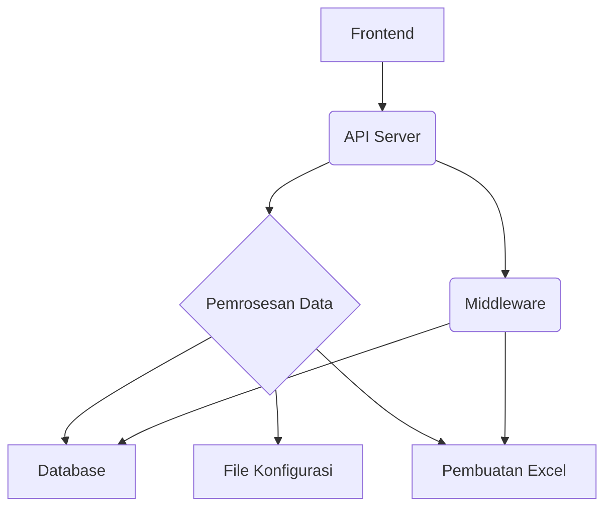

Sumber: [README.md:60-61](), [desa_db/server.py]()

### Antarmuka Frontend

Frontend menyediakan antarmuka bagi pengguna untuk berinteraksi dengan sistem. Ini termasuk login, unggah data, tampilan dasbor, dan kemungkinan fungsionalitas lain yang spesifik untuk pengguna.

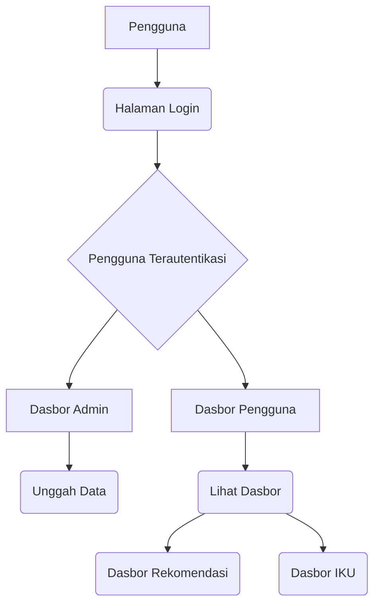

Sumber: [front_end/templates/login.html](), [front_end/templates/admin.html](), [front_end/templates/user.html]()

### Manajemen Konfigurasi

Sistem bergantung pada berbagai file konfigurasi untuk mendefinisikan perilakunya, struktur data, dan pemetaan. File-file ini biasanya terletak di direktori `.config/`.

Sumber: [README.md:5-11]()

## Komponen Inti dan Fungsionalitas

### Integrasi dan Pemrosesan Data

Proyek ini melibatkan integrasi data dari berbagai sumber, kemungkinan untuk tujuan penilaian (scoring) dan rekomendasi. Ini mencakup penanganan format data yang berbeda dan memastikan integritas data.

Skrip `desa_db/server.py` kemungkinan mengorkestrasi layanan backend, termasuk pemuatan dan pemrosesan data. Skrip `desa_db/middleware.py` tampaknya menangani pembuatan laporan Excel berdasarkan data yang diproses dan konfigurasi.

Sumber: [desa_db/server.py]()

#### Skema dan Manajemen Basis Data

Sistem mengelola basis data, kemungkinan untuk menyimpan data desa dan informasi terkait. Skrip `desa_db/server.py` menyertakan logika untuk membuat dan mengelola tabel basis data, termasuk `master_data` dan tabel riwayat.

```sql
CREATE TABLE IF NOT EXISTS master_data (
    valid_from TIMESTAMP,
    valid_to TIMESTAMP,
    commit_id VARCHAR,
    source_file VARCHAR,
    "Col1" VARCHAR, -- Contoh definisi kolom
    "Col2" TINYINT   -- Contoh definisi kolom
)
```

Tabel `master_data` menyimpan snapshot data terbaru, dengan kolom yang ditentukan berdasarkan header dari file konfigurasi. Tabel ini juga menyertakan metadata seperti `valid_from`, `valid_to`, `commit_id`, dan `source_file`. Indeks dibuat pada `ID_COL` untuk kinerja.

Sumber: [desa_db/server.py:117-135]()

### Pembuatan Laporan Excel

Fitur penting adalah pembuatan laporan Excel, yang mencakup beberapa lembar untuk tampilan data yang berbeda. Skrip `desa_db/middleware.py` merinci pembuatan laporan ini.

Sistem menghasilkan tiga lembar utama:
1.  **Data Grid**: Kemungkinan ekspor data mentah.
2.  **Dashboard Rekomendasi**: Dashboard yang merangkum skor dan rekomendasi.
3.  **Dashboard IKU**: Dashboard yang berfokus pada skor Indikator Kinerja Utama (IKU).

Proses pembuatan melibatkan pendefinisian gaya, penggabungan sel, pengaturan lebar kolom, dan penerapan format untuk keterbacaan.

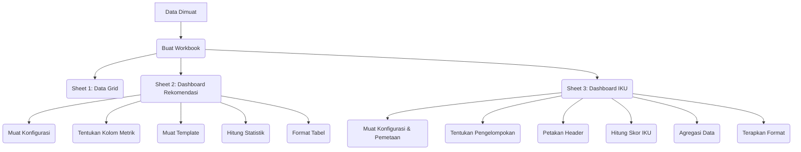

Sumber: [desa_db/middleware.py:25-150]()

#### Detail Dashboard Rekomendasi

Sheet dashboard ini menyajikan data *aggregated*, termasuk penggabungan header yang tepat untuk grup "SKOR" dan "PELAKSANA", lebar kolom yang dioptimalkan, dan `rowspan` untuk data hierarkis.

Sumber: [desa_db/middleware.py:65-150]()

#### Detail Dashboard IKU

Sheet ini berfokus pada skor Indikator Kinerja Utama (IKU). Sheet ini secara dinamis memetakan header CSV ke kolom induk dan sub-kolom (status, rata-rata, total, pencapaian) berdasarkan tingkat pengelompokan yang dipilih (Provinsi, Kabupaten, Kecamatan, Desa). Sheet ini menghitung skor IKU, mengagregasi data, dan menerapkan format termasuk peta panas (heatmaps) dan format angka.

Sumber: [desa_db/middleware.py:152-235](), [desa_db/server.py:236-355]()

### File Konfigurasi dan Struktur

Proyek ini menggunakan beberapa file konfigurasi untuk mendefinisikan perilaku sistem dan pemetaan data.

| Nama File                 | Deskripsi                                                              | Lokasi    |
| :------------------------ | :----------------------------------------------------------------------- | :---------- |
| `auth_users.json`         | Menyimpan detail otentikasi pengguna.                                      | `.config/`  |
| `headers.json`            | Memetakan nama kolom standar ke aliasnya.                             | `.config/`  |
| `intervensi_kegiatan.json`| Berisi template untuk intervensi dan kegiatan.                     | `.config/`  |
| `rekomendasi.json`        | Mendefinisikan logika rekomendasi berdasarkan skor.                            | `.config/`  |
| `table_structure.csv`     | Mendefinisikan struktur untuk tabel "Dashboard Rekomendasi".             | `.config/`  |
| `table_structure_IKU.csv` | Mendefinisikan struktur untuk tabel "Dashboard IKU".                     | `.config/`  |
| `iku_mapping.json`        | Memetakan metrik induk IKU ke kolom skor yang sesuai.            | `.config/`  |

Sumber: [README.md:5-11](), [tests/server_test.py:16-35]()

### Konfigurasi Styling dan Frontend

Styling frontend dikelola menggunakan Tailwind CSS. File `tailwind.config.js` mendefinisikan konfigurasi untuk kompilasi CSS.

```javascript
/** @type {import('tailwindcss').Config} */
module.exports = {
  darkMode: 'class',
  // Use **/*.html to scan all folders in the project for HTML files
  content: ["./**/*.html", "./static/**/*.js"],
  theme: {
    extend: {},
  },
  plugins: [],
}
```

File `output.css` berisi CSS yang dikompilasi, termasuk kelas utilitas untuk tata letak, tipografi, dan warna.

Sumber: [front_end/tailwind.config.js]()

## Deployment dan Pengembangan

### Deployment Docker

Docker dan Docker Compose **direkomendasikan** untuk melakukan deployment aplikasi. Perintah `docker compose up -d --build` memulai proses build dan deployment.

Sumber: [README.md:32-41]()

### Pengembangan Lokal (Tidak Direkomendasikan)

Untuk pengembangan lokal, disediakan pengaturan lingkungan virtual. Ini melibatkan pembuatan lingkungan virtual, mengaktifkannya, dan menginstal dependensi dari `requirements.txt`.

```bash
# Pengaturan Lingkungan Virtual (jalankan sekali)
Python311 -m venv .venv
source .venv/Scripts/activate
pip install -r .config/requirements.txt
```

Backend dapat dijalankan menggunakan `python desa_db/server.py`, dan frontend serta backend dapat dijalankan bersamaan menggunakan `python run_system.py`.

Sumber: [README.md:47-58]()

### Testing

Unit test untuk komponen server dapat dijalankan menggunakan `pytest`. File `tests/server_test.py` berisi fixture dan test case untuk fungsionalitas server.

Sumber: [README.md:43-44](), [tests/server_test.py]()

## Elemen Antarmuka Pengguna

### Halaman Login

Halaman login (`login.html`) menampilkan font kustom, latar belakang bertekstur, dan kotak login yang khas dengan efek bayangan.

Sumber: [front_end/templates/login.html]()

### Dasbor Admin

Dasbor admin (`admin.html`) mencakup fungsionalitas seperti unggah data, yang ditunjukkan dengan ikon dan teks.

Sumber: [front_end/templates/admin.html]()

### Dasbor Pengguna

Dasbor pengguna (`user.html`) menyediakan akses ke tampilan yang berbeda (Tidak ada Upload dan Delete), termasuk "Dashboard IKU", yang divisualisasikan dengan ikon.

Sumber: [front_end/templates/user.html]()

---

<a id='page-system-requirements'></a>

## Persyaratan Sistem

### Halaman Terkait

Topik terkait: [Pengantar Proyek](#page-project-introduction), [Deployment Docker](#page-docker-deployment)

<details>
<summary>File sumber yang relevan</summary>

- [README.md](https://github.com/anbe-on/integrasi_data_skor_rekomendasi_desa/blob/main/README.md)
- [.config/requirements.txt](https://github.com/anbe-on/integrasi_data_skor_rekomendasi_desa/blob/main/.config/requirements.txt)
- [desa_db/middleware.py](https://github.com/anbe-on/integrasi_data_skor_rekomendasi_desa/blob/main/desa_db/middleware.py)
- [desa_db/server.py](https://github.com/anbe-on/integrasi_data_skor_rekomendasi_desa/blob/main/desa_db/server.py)
- [run_system.py](https://github.com/anbe-on/integrasi_data_skor_rekomendasi_desa/blob/main/run_system.py)
- [front_end/tailwind.config.js](https://github.com/anbe-on/integrasi_data_skor_rekomendasi_desa/blob/main/front_end/tailwind.config.js)
- [front_end/templates/login.html](https://github.com/anbe-on/integrasi_data_skor_rekomendasi_desa/blob/main/front_end/templates/login.html)
- [tests/server_test.py](https://github.com/anbe-on/integrasi_data_skor_rekomendasi_desa/blob/main/tests/server_test.py)
</details>

# Persyaratan Sistem

Dokumen ini menguraikan persyaratan sistem untuk proyek "integrasi_data_skor_rekomendasi_desa", yang mencakup dependensi perangkat lunak, lingkungan runtime, dan pengaturan eksekusi. Sistem mengintegrasikan proses penilaian data dan rekomendasi untuk desa, menyediakan fungsionalitas dasbor dan pelaporan. Komponen utama meliputi API backend, antarmuka frontend, dan logika pemrosesan data. Untuk informasi lebih lanjut tentang modul spesifik, lihat [Dokumentasi API Backend](#) dan [Panduan Antarmuka Frontend](#).

## Dependensi Perangkat Lunak

Proyek ini bergantung pada sekumpulan *package* Python tertentu agar berfungsi dengan benar. Python *Package* ini dikelola melalui file `requirements.txt`.

### Versi Python

Sistem dikembangkan dan diuji dengan Python 3.11.9.
Sumber: [README.md:4-5]()

### Paket Python Inti

Paket-paket berikut tercantum dalam `.config/requirements.txt` dan penting untuk fungsionalitas backend dan pemrosesan data proyek.

| Nama Paket          | Penentu Versi      | Deskripsi                                           |
| :------------------ | :----------------- | :-------------------------------------------------- |
| fastapi             | >=0.111.0          | Kerangka kerja web asinkron untuk membangun API.    |
| uvicorn             | >=0.27.0.post1     | Server ASGI untuk menjalankan aplikasi FastAPI.     |
| pandas              | >=2.2.1            | Pustaka manipulasi dan analisis data.               |
| numpy               | >=1.26.4           | Pustaka komputasi numerik.                          |
| openpyxl            | >=3.1.10           | Pustaka untuk membaca/menulis file Excel .xlsx.     |
| python-dotenv       | >=1.0.1            | Untuk memuat variabel lingkungan dari file .env.    |
| python-multipart    | >=0.0.9            | Untuk menangani data formulir, termasuk unggahan file. |
| psycopg2-binary     | >=2.9.9            | Adapter PostgreSQL untuk Python.                    |
| SQLAlchemy          | >=2.0.29           | Toolkit SQL dan Object Relational Mapper.           |
| requests            | >=2.31.0           | Pustaka HTTP untuk membuat permintaan.              |
| pytest              | >=7.4.4            | Kerangka kerja pengujian untuk Python.              |
| pytest-mock         | >=3.12.0           | Fixture untuk mocking di pytest.                    |
| python-jose[cryptography] | >=3.3.0        | Penanganan JSON Web Token.                          |
| passlib[bcrypt]     | >=1.7.4            | Pustaka hashing kata sandi.                         |
| Pillow              | >=10.2.0           | Python Imaging Library.                             |
| python-decouple     | >=3.4              | Untuk membantu aplikasi membaca pengaturan dari berbagai sumber. |
| pandas-stubs        | ^2.2.0.20240316    | Stubs tipe untuk pandas.                            |
| polars              | ^0.20.16           | Pustaka DataFrame berkinerja tinggi.                |
| httpx               | >=0.27.0           | Klien HTTP untuk Python.                            |
Sumber: [.config/requirements.txt]()

## Lingkungan Runtime

Sistem memiliki persyaratan spesifik untuk lingkungan eksekusinya, termasuk pertimbangan sistem operasi dan rekomendasi perangkat keras.

### Sistem Operasi

Meskipun tidak secara eksplisit dinyatakan sebagai persyaratan ketat, penggunaan Docker direkomendasikan, dan WSL (Windows Subsystem for Linux) disarankan untuk pengguna Windows. Ini menyiratkan kompatibilitas dengan lingkungan berbasis Linux.
Sumber: [README.md:17-18](), [README.md:25]()

### Rekomendasi Perangkat Keras

CPU yang mendukung AVX2 direkomendasikan. Ini biasanya mencakup prosesor Intel generasi ke-4 dan prosesor AMD Ryzen.
Sumber: [README.md:6-7]()

## Konfigurasi

Proyek menggunakan direktori konfigurasi (`.config/`) dan variabel lingkungan untuk mengelola pengaturan.

### Direktori File Konfigurasi

Semua file konfigurasi terletak di dalam direktori `.config/`.
Sumber: [README.md:2-3]()

### File Konfigurasi Kunci

*   `auth_users.json`: Menyimpan detail otentikasi pengguna.
*   `headers.json`: Mendefinisikan pemetaan untuk header data.
*   `intervensi_kegiatan.json`: Berisi templat untuk aktivitas intervensi.
*   `rekomendasi.json`: Menyimpan logika dan pemetaan rekomendasi.
*   `table_structure.csv`: Mendefinisikan struktur untuk tabel data.
*   `table_structure_IKU.csv`: Mendefinisikan struktur untuk tabel IKU (Indikator Kinerja Utama).
*   `iku_mapping.json`: Memetakan metrik IKU.
Sumber: [README.md:3-9](), [tests/server_test.py:15-37]()

### Variabel Lingkungan

File `.env` digunakan untuk menyimpan pengaturan sensitif atau spesifik lingkungan.

*   `APP_SECRET_KEY`: Kunci rahasia untuk aplikasi, yang dapat dibuat menggunakan `openssl rand -hex 32`.

Sumber: [README.md:13-16]()

## Instalasi dan Penyiapan

Proyek menawarkan beberapa metode untuk penyiapan dan eksekusi, termasuk penerapan berbasis Docker dan penyiapan lingkungan virtual manual.

### Instalasi dan Jalankan Docker

Ini adalah metode yang direkomendasikan untuk penerapan.

1.  **Instal Docker dan Docker Compose:** Pastikan keduanya terinstal di sistem Anda.
2.  **Build dan Jalankan:** Jalankan `docker compose up -d --build` di direktori root proyek.
    *   Sistem akan mencoba menyiapkan file Excel dari basis data saat startup.

Sumber: [README.md:24-31]()

### Penyiapan Lingkungan Virtual (Manual, Tidak direkomendasikan)

Metode ini digambarkan sebagai "tidak direkomendasikan" tetapi menyediakan solusi cadangan.

1.  **Buat Lingkungan Virtual:** `Python311 -m venv .venv`
2.  **Aktifkan Lingkungan Virtual:** `source .venv/Scripts/activate`
3.  **Instal Dependensi:** `pip install -r .config/requirements.txt`

Sumber: [README.md:34-37]()

## Menjalankan Sistem

Sistem dapat diluncurkan menggunakan skrip yang berbeda tergantung pada mode operasi yang diinginkan.

### Menjalankan dengan Docker Compose

Jalankan `docker compose up -d --build` dari root proyek.
Sumber: [README.md:29]()

### Menjalankan Backend dan Middleware (Manual)

Mulai server backend menggunakan: `python desa_db/server.py`
Sumber: [README.md:39]()

### Menjalankan Frontend dan Backend Secara Bersamaan (Manual)

Gunakan skrip `run_system.py` untuk peluncuran terintegrasi.
Sumber: [README.md:41-42](), [run_system.py]()


## Penyiapan Pengembangan Frontend

Untuk pengembangan frontend, terutama jika menggunakan Tailwind CSS, langkah-langkah berikut terlibat.

### Compile Tailwind CSS

1.  **Navigasi ke Direktori Frontend:** `cd front_end/`
2.  **Instal Dependensi:** `npm install -D tailwindcss@3 postcss autoprefixer`
3.  **Inisialisasi Tailwind CSS:** `npx tailwindcss init`
4.  **Konfigurasi `tailwind.config.js`:** Perbarui file.
    ```javascript
    /** @type {import('tailwindcss').Config} */
    module.exports = {
      darkMode: 'class',
      // Use **/*.html to scan all folders in the project for HTML files
      content: ["./**/*.html", "./static/**/*.js"],
      theme: {
        extend: {},
      },
      plugins: [],
    }
    ```
    Sumber: [front_end/tailwind.config.js]()
5.  **Compile CSS:** `npx tailwindcss -i ./static/css/input.css -o ./static/css/output.css --watch`

Sumber: [README.md:19-23]()

## Pengujian

Tes unit untuk komponen server tersedia dan dapat dieksekusi menggunakan pytest.

### Menjalankan Tes

Jalankan perintah berikut di direktori root proyek:
`pytest tests/server_test.py`
Sumber: [README.md:32]()

## Gambaran Arsitektur Sistem

Sistem ini terdiri dari API backend yang dibangun dengan FastAPI, antarmuka frontend, dan modul pemrosesan data.

### API Backend (`desa_db/server.py`)

Backend berfungsi sebagai lapisan API utama, menangani permintaan untuk pengambilan data, pemrosesan, dan pembuatan dasbor. Ini menggunakan pustaka seperti FastAPI, Uvicorn, Pandas, dan SQLAlchemy. Ini berinteraksi dengan database dan mengoordinasikan transformasi data dan pembuatan laporan.

Sumber: [desa_db/server.py]()

### Pemrosesan Data dan Middleware (`desa_db/middleware.py`)

Modul ini berisi logika inti untuk manipulasi data, pembuatan laporan Excel, perhitungan statistik dasbor, dan rendering dasbor IKU (Indikator Kinerja Utama). Ini membaca file konfigurasi, memproses dataframe, dan memformat keluaran untuk berbagai lembar dalam buku kerja Excel.

Sumber: [desa_db/middleware.py]()

### Frontend (`front_end/`)

Frontend menyediakan antarmuka pengguna untuk berinteraksi dengan sistem. Ini termasuk template HTML dan ditata menggunakan Tailwind CSS. Template `login.html` mendemonstrasikan struktur UI dan pendekatan penataan.

Sumber: [front_end/templates/login.html](), [front_end/tailwind.config.js]()

### Eksekusi Sistem (`run_system.py`) (Tidak direkomendasikan)

Skrip ini mengoordinasikan startup komponen backend dan frontend, memfasilitasi lingkungan pengembangan atau penerapan yang terpadu. Jalankan Skrip jika tidak menggunakan Docker, ini mengelola subproses untuk setiap bagian aplikasi.

Sumber: [run_system.py]()

### Contoh Alur Kerja: Pembuatan Dasbor

Pembuatan data dasbor melibatkan beberapa langkah yang dikoordinasikan oleh middleware dan backend.

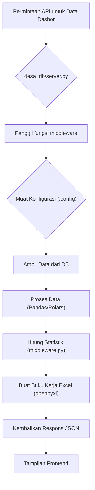
Sumber: [desa_db/server.py:123-131](), [desa_db/middleware.py:136-146](), [desa_db/middleware.py:350-353]()

### Contoh Alur Kerja: Otentikasi Pengguna

Otentikasi pengguna ditangani, dengan pengguna tiruan disediakan untuk tujuan pengujian.

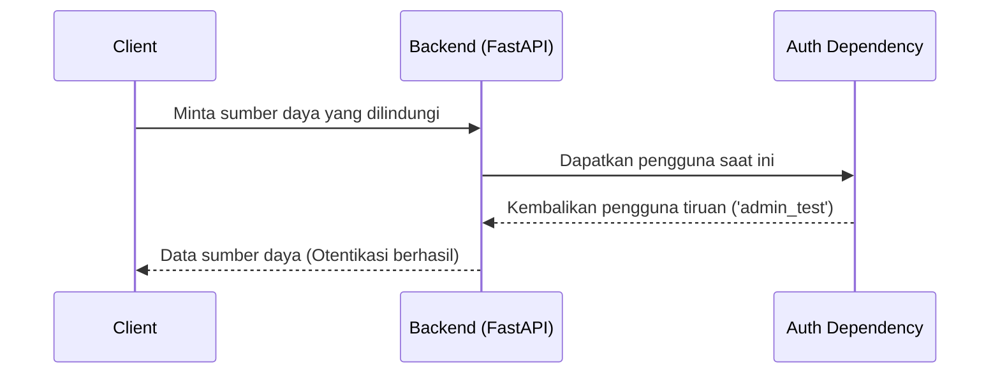
Sumber: [tests/server_test.py:40-43]()

## Penyiapan Pengembangan dan Pengujian

Proyek ini mencakup utilitas dan konfigurasi untuk pengembangan dan pengujian.

### Penyiapan *Mock Data* dan Konfigurasi

Fixture `tests/server_test.py` mendemonstrasikan cara membuat file konfigurasi tiruan (`headers.json`, `table_structure.csv`, `table_structure_IKU.csv`, `iku_mapping.json`, `rekomendasi.json`) yang diperlukan untuk menguji logika backend.

Sumber: [tests/server_test.py:15-37]()

### Eksekusi Test

Kerangka kerja `pytest` digunakan untuk menjalankan test, dengan perintah spesifik yang disediakan untuk mengeksekusi test server.

Sumber: [README.md:32]()

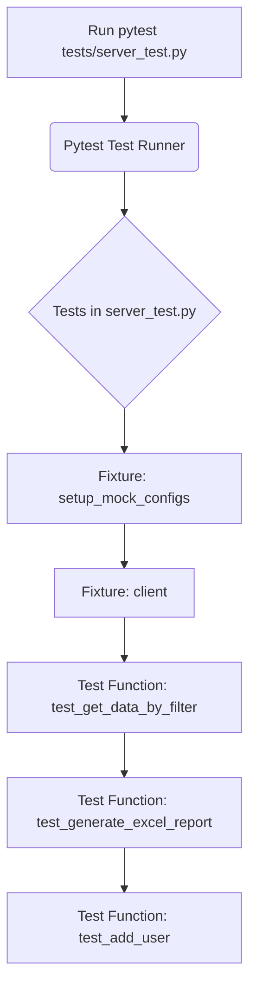
Sumber: [tests/server_test.py]()

## Penataan Frontend

Tailwind CSS digunakan untuk menata komponen frontend. File konfigurasi `front_end/tailwind.config.js` mendefinisikan kelas utilitas proyek dan jalur pemindaian.

Sumber: [front_end/tailwind.config.js]()

### Contoh Penataan Halaman Login

File `front_end/templates/login.html` menampilkan penerapan Tailwind CSS untuk membuat antarmuka login yang berbeda secara visual dengan pola latar belakang kustom dan bayangan kotak.

Sumber: [front_end/templates/login.html]()

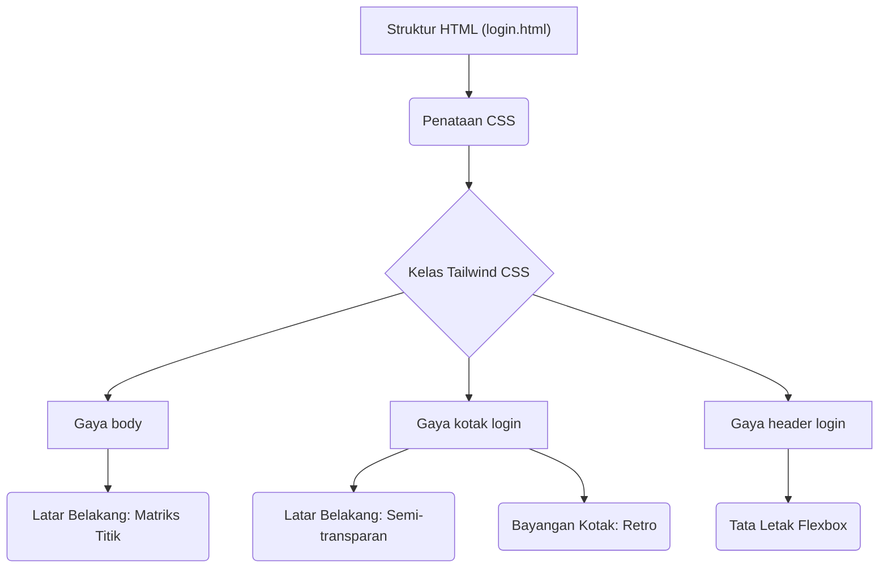
Sumber: [front_end/templates/login.html]()

Ringkasan ini mencakup persyaratan sistem penting, termasuk dependensi perangkat lunak, lingkungan runtime, konfigurasi, instalasi, eksekusi, dan penataan frontend, sebagaimana diturunkan dari file sumber yang disediakan.

---

<a id='page-architecture-overview'></a>

## Tinjauan Arsitektur

### Halaman Terkait

Topik terkait: [Diagram Alur Data](#page-data-flow), [Hubungan Komponen](#page-component-relationships)

<details>
<summary>File sumber yang relevan</summary>

- [docker-compose.yml](https://github.com/anbe-on/integrasi_data_skor_rekomendasi_desa/blob/main/docker-compose.yml)
- [run_system.py](https://github.com/anbe-on/integrasi_data_skor_rekomendasi_desa/blob/main/run_system.py)
- [nginx.conf](https://github.com/anbe-on/integrasi_data_skor_rekomendasi_desa/blob/main/nginx.conf)
- [desa_db/server.py](https://github.com/anbe-on/integrasi_data_skor_rekomendasi_desa/blob/main/desa_db/server.py)
- [front_end/router.py](https://github.com/anbe-on/integrasi_data_skor_rekomendasi_desa/blob/main/front_end/router.py)
- [desa_db/middleware.py](https://github.com/anbe-on/integrasi_data_skor_rekomendasi_desa/blob/main/desa_db/middleware.py)
- [front_end/tailwind.config.js](https://github.com/anbe-on/integrasi_data_skor_rekomendasi_desa/blob/main/front_end/tailwind.config.js)
- [front_end/static/css/output.css](https://github.com/anbe-on/integrasi_data_skor_rekomendasi_desa/blob/main/front_end/static/css/output.css)

</details>

# Tinjauan Arsitektur

Dokumen ini menguraikan tinjauan arsitektur proyek "integrasi_data_skor_rekomendasi_desa". Dokumen ini merinci struktur sistem, penerapan, dan komponen inti, memberikan pemahaman dasar bagi pengembang dan administrator sistem. Sistem ini dirancang sebagai layanan API backend dan aplikasi web frontend, yang diorkestrasi menggunakan Docker Compose untuk kemudahan penerapan dan pengelolaan.

Arsitektur memprioritaskan modularitas, dengan layanan yang berbeda untuk API backend, frontend, dan infrastruktur pendukung seperti Nginx dan pencadangan basis data. Pemisahan ini memungkinkan penskalaan dan pemeliharaan independen dari berbagai bagian sistem.

## Penerapan dan Orkestrasi Sistem

Sistem diterapkan menggunakan Docker Compose, yang mendefinisikan dan mengelola siklus hidup beberapa layanan. Pendekatan ini menyederhanakan penyiapan dan memastikan lingkungan yang konsisten di berbagai target penerapan.

### Layanan Docker Compose

File `docker-compose.yml` mendefinisikan layanan utama berikut:

*   **`backup_id_srd_iku`**: Layanan pencadangan terjadwal yang menjalankan skrip pencadangan setiap hari. Layanan ini memasang volume untuk akses basis data dan penyimpanan cadangan.
    Sumber: [docker-compose.yml:3-8]()
*   **`backend_id_srd_iku`**: Layanan API backend utama, dibangun dari direktori root proyek. Layanan ini mengekspos API pada port 8000 dan mengelola konfigurasi, basis data, file sementara, ekspor, dan aset frontend.
    Sumber: [docker-compose.yml:10-18]()
*   **`frontend_id_srd_iku`**: Layanan aplikasi frontend, juga dibangun dari direktori root. Layanan ini berkomunikasi dengan API backend menggunakan URL jaringan Docker internal dan mengelola aset frontend. Layanan ini bergantung pada layanan backend.
    Sumber: [docker-compose.yml:20-28]()
*   **`nginx_id_srd_iku`**: Layanan *reverse proxy* Nginx yang mendengarkan pada port 8080 dan meneruskan lalu lintas ke aplikasi backend dan frontend. Layanan ini menyajikan aset statis dan ekspor yang telah dirender sebelumnya. Layanan ini bergantung pada layanan backend dan frontend.
    Sumber: [docker-compose.yml:30-36]()

### Interkoneksi Layanan

Layanan berkomunikasi melalui jaringan internal Docker. Frontend dikonfigurasi untuk menggunakan `http://backend_id_srd_iku:8000` untuk panggilan API. Nginx bertindak sebagai titik masuk eksternal, mengarahkan lalu lintas ke layanan internal yang sesuai.

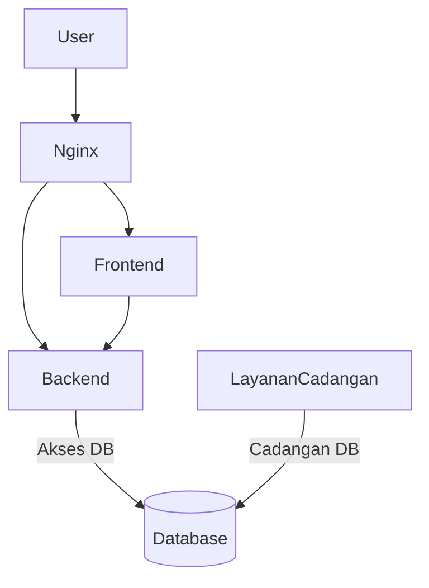

Sumber: [docker-compose.yml]()

## Layanan Backend (`desa_db/server.py`)

Layanan backend dibangun menggunakan FastAPI dan menangani logika aplikasi inti, *endpoints* API, dan pemrosesan data.

### Fungsionalitas Inti

*   **Endpoints API**: Menyediakan *endpoints* API RESTful untuk login, pengambilan data, dan pembuatan laporan.
*   **Autentikasi**: Mengimplementasikan autentikasi berbasis JWT dengan token sesi yang disimpan dalam cookie HttpOnly.
    Sumber: [desa_db/server.py:111-134]()
*   **Pemrosesan Data**: Menyertakan fungsi middleware untuk integrasi data, perhitungan skor, dan pembuatan laporan (Excel).
    Sumber: [desa_db/server.py:15-27]()
*   **Penanganan File**: Mengelola unggahan file sementara dan menghasilkan laporan Excel.
    Sumber: [desa_db/server.py:36-53]()
*   **Konfigurasi**: Membaca konfigurasi dari direktori `.config`, termasuk autentikasi pengguna dan struktur tabel.
    Sumber: [desa_db/server.py:55-69]()

### Komponen dan Modul Utama

*   **`auth_get_current_user`**: Ketergantungan untuk autentikasi pengguna.
    Sumber: [desa_db/server.py:111]()
*   **`helpers_generate_excel_workbook`**: Fungsi untuk membuat buku kerja Excel.
    Sumber: [desa_db/server.py:17]()
*   **`helpers_background_task_generate_pre_render_excel`**: Untuk pembuatan Excel asinkron.
    Sumber: [desa_db/server.py:18]()
*   **`CONFIG_DIR`**: Jalur ke direktori konfigurasi.
    Sumber: [desa_db/server.py:22]()
*   **`TEMP_FOLDER`**: Direktori untuk penyimpanan file sementara.
    Sumber: [desa_db/server.py:38]()

### Tinjauan Endpoints API

Backend mengekspos beberapa *endpoints* API, termasuk:

| Endpoints            | Metode | Deskripsi                                     |
| :------------------- | :----- | :-------------------------------------------- |
| `/api/login`         | POST   | Mengautentikasi pengguna dan mengatur token sesi. |
| `/api/data/preview`  | POST   | Menghasilkan pratinjau data yang diproses.    |
| `/api/data/export`   | POST   | Memicu pembuatan laporan Excel.               |
| `/api/data/download` | GET    | Mengunduh laporan Excel yang dihasilkan.      |
| `/api/data/status`   | GET    | Memeriksa status pembuatan laporan.           |
| `/api/data/progress` | GET    | Mengambil progres pembuatan laporan.          |

Sumber: [desa_db/server.py]()

## Layanan Frontend (`front_end/router.py`)

Layanan frontend bertanggung jawab atas antarmuka pengguna dan interaksi sisi klien. Kemungkinan besar dibangun menggunakan kerangka kerja web yang mendukung Server-Side Rendering (SSR) mengingat file `router.py` dan perannya dalam menyajikan HTML.

### Tanggung Jawab Utama

*   **Rendering Antarmuka Pengguna**: Menyajikan halaman HTML untuk interaksi pengguna, termasuk login, dasbor, dan tampilan data.
    Sumber: [front_end/router.py]()
*   **Interaksi API**: Melakukan permintaan ke API backend untuk mengambil data, mengirimkan formulir, dan memicu tindakan.
    Sumber: [front_end/router.py:23]()
*   **Penyajian Aset Statis**: Menyajikan file statis seperti CSS dan JavaScript, yang dikelola oleh Nginx.
    Sumber: [front_end/router.py:23]()

### Routing dan Tampilan

File `front_end/router.py` kemungkinan mendefinisikan rute yang memetakan jalur URL ke templat HTML atau fungsi rendering tertentu.

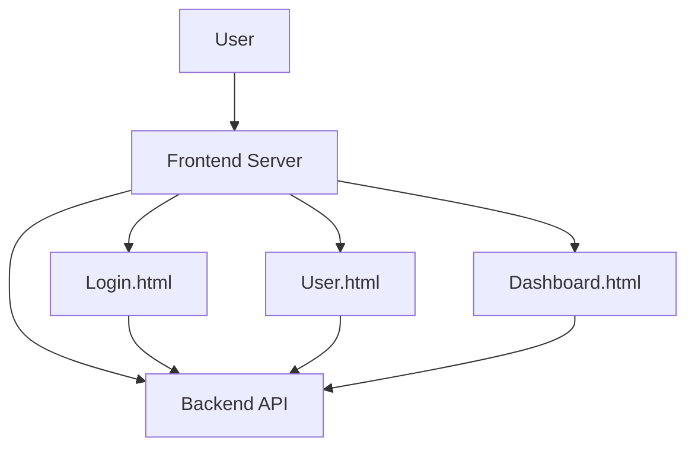

Sumber: [front_end/router.py]()

## *Reverse Proxy* dan Manajemen Aset Statis (Nginx)

Nginx berfungsi sebagai titik masuk utama untuk lalu lintas eksternal, menangani terminasi SSL (jika dikonfigurasi), penyeimbangan beban, dan penyajian aset statis secara efisien.

### Konfigurasi Nginx

File `nginx.conf` mengonfigurasi Nginx untuk:

*   Mendengarkan pada port 8080 untuk permintaan HTTP yang masuk.
*   Menyajikan file statis dari direktori tertentu (`/app/exports`, `/app/front_end/static`).
*   Meneruskan permintaan API ke layanan backend (`http://backend_id_srd_iku:8000`).
*   Meneruskan permintaan untuk aplikasi frontend ke layanan frontend (`http://frontend_id_srd_iku:3000` atau yang serupa).

```nginx
# Simplified representation of nginx.conf
events {}
http {
    server {
        listen 80; # Nginx inside container listens on 80, mapped to 8080 by docker-compose

        location / {
            proxy_pass http://frontend_id_srd_iku:3000; # Example port for frontend
            proxy_set_header Host $host;
            proxy_set_header X-Real-IP $remote_addr;
            proxy_set_header X-Forwarded-For $proxy_add_x_forwarded_for;
            proxy_set_header X-Forwarded-Proto $scheme;
        }

        location /api/ {
            proxy_pass http://backend_id_srd_iku:8000;
            proxy_set_header Host $host;
            proxy_set_header X-Real-IP $remote_addr;
            proxy_set_header X-Forwarded-For $proxy_add_x_forwarded_for;
            proxy_set_header X-Forwarded-Proto $scheme;
        }

        location /exports/ {
            alias /app/exports/;
            expires 30d;
        }

        location /static/ {
            alias /app/front_end/static/;
            expires 30d;
        }
    }
}
```

Sumber: [nginx.conf]()

## Manajemen Konfigurasi

Sistem bergantung pada direktori `.config` untuk berbagai file konfigurasi, memastikan bahwa informasi sensitif dan pengaturan aplikasi dikelola secara terpisah dari kode.

### File Konfigurasi

*   **`auth_users.json`**: Menyimpan kredensial dan peran pengguna.
    Sumber: [docker-compose.yml:15]()
*   **`headers.json`**: Mendefinisikan header standar dan aliasnya untuk mencari di dalam excel yang dimana untuk dilakukan dalam pemrosesan data.
    Sumber: [tests/server_test.py:15]()
*   **`intervensi_kegiatan.json`**: Berisi logika untuk kegiatan intervensi.
    Sumber: [desa_db/middleware.py:16]()
*   **`rekomendasi.json`**: Berisi logika untuk menghasilkan rekomendasi berdasarkan skor.
    Sumber: [tests/server_test.py:41]()
*   **`table_structure.csv`**: Mendefinisikan struktur untuk tabel Rekomendasi ID.
    Sumber: [desa_db/middleware.py:13](), [tests/server_test.py:21]()
*   **`table_structure_IKU.csv`**: Mendefinisikan struktur untuk tabel data IKU (Indikator Kinerja Utama).
    Sumber: [desa_db/middleware.py:132](), [tests/server_test.py:27]()
*   **`iku_mapping.json`**: Berisi logika untuk tabel IKU.
    Sumber: [desa_db/middleware.py:137](), [tests/server_test.py:34]()

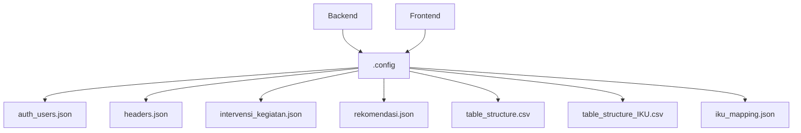

Sumber: [docker-compose.yml:15](), [desa_db/server.py:59](), [desa_db/middleware.py:13](), [desa_db/middleware.py:132](), [desa_db/middleware.py:137](), [tests/server_test.py:15](), [tests/server_test.py:21](), [tests/server_test.py:27](), [tests/server_test.py:34](), [tests/server_test.py:41]()

## Alur Data dan Pemrosesan

Sistem memproses data melalui serangkaian langkah, mulai dari pemuatan dan validasi data awal hingga perhitungan skor, pembuatan rekomendasi, dan akhirnya, ekspor laporan.

### Pemuatan dan Persiapan Data

Data dimuat dari berbagai sumber dan disiapkan untuk analisis. Ini melibatkan:

1.  **Interaksi Basis Data**: Backend kemungkinan berinteraksi dengan basis data (tidak dirinci secara eksplisit dalam file-file ini tetapi tersirat oleh `helpers_get_db_connection` dan `con.execute`).
    Sumber: [desa_db/middleware.py:10]()
2.  **Pemuatan Konfigurasi**: Membaca `table_structure.csv`, `headers.json`, dan file konfigurasi lainnya untuk memahami skema dan pemetaan data.
    Sumber: [desa_db/middleware.py:13-30](), [desa_db/middleware.py:132-141]()
3.  **Pemetaan Header**: Alias dipetakan ke header standar menggunakan `headers.json`.
    Sumber: [desa_db/middleware.py:31-40]()

### Perhitungan Skor dan Rekomendasi

Logika inti untuk menghitung skor dan menghasilkan rekomendasi berada di layanan middleware dan backend.

1.  **Statistik Dasbor**: `helpers_calculate_dashboard_stats` menghitung rata-rata, jumlah, dan ringkasan naratif.
    Sumber: [desa_db/middleware.py:44]()
2.  **Perhitungan Skor IKU**: Pembuatan lembar "Dashboard IKU" melibatkan pemuatan `table_structure_IKU.csv` dan `iku_mapping.json` untuk menghitung skor IKU berdasarkan kolom anak yang dipetakan dan mengagregasikannya berdasarkan tingkat pengelompokan.
    Sumber: [desa_db/middleware.py:130-230]()
3.  **Logika Rekomendasi**: `rekomendasi.json` digunakan untuk memetakan skor ke rekomendasi tekstual.
    Sumber: [tests/server_test.py:41-45]()

### Pembuatan Laporan

Sistem dapat menghasilkan laporan Excel untuk visualisasi data dan unduhan.

1.  **Pembuatan Workbook**: `helpers_generate_excel_workbook` membuat struktur file Excel.
    Sumber: [desa_db/server.py:20]()
2.  **Pembuatan Asinkron**: `helpers_background_task_generate_pre_render_excel` menangani pembuatan di latar belakang.
    Sumber: [desa_db/server.py:21]()
3.  **Ekspor dan Unduh**: Endpoints API mengelola proses ekspor dan pengunduhan laporan yang dihasilkan ini.
    Sumber: [desa_db/server.py:166-182]()

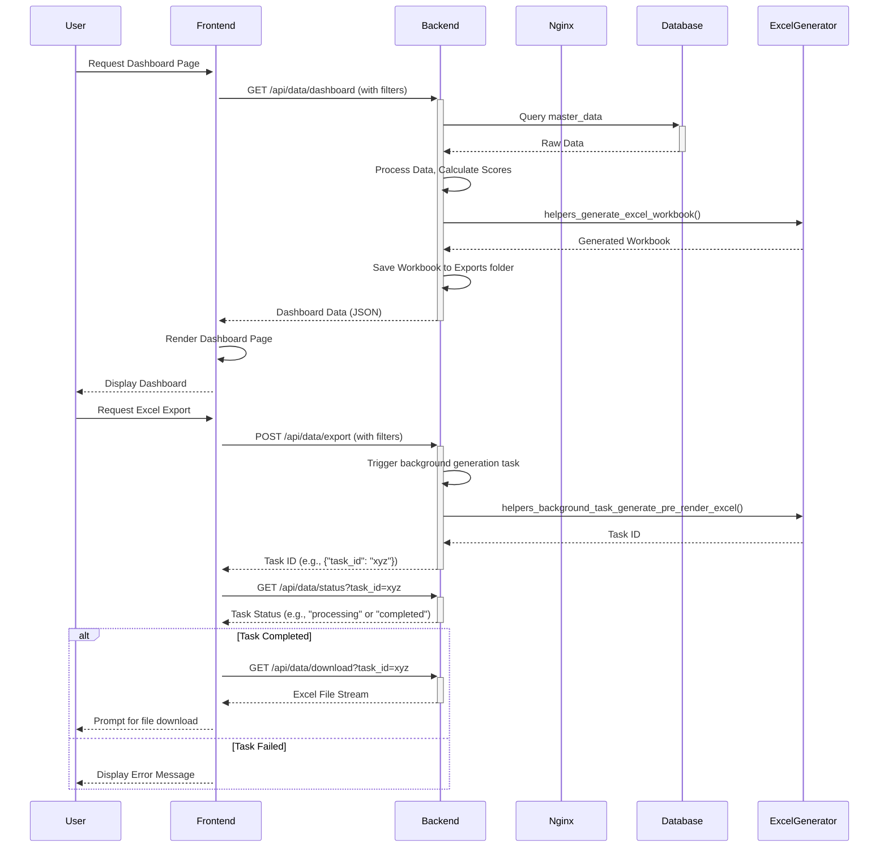

Sumber: [desa_db/server.py](), [front_end/router.py](), [docker-compose.yml]()

## Styling dan Tema Frontend

Frontend menggunakan Tailwind CSS untuk styling, memungkinkan pengembangan UI yang cepat dan tema yang konsisten.

### Konfigurasi Tailwind CSS

File `tailwind.config.js` mengonfigurasi Tailwind CSS, mendefinisikan perilakunya dan cara memindai file HTML untuk menghasilkan gaya.

*   **Pemindaian Konten**: Memindai `**/*.html` dan `./static/**/*.js` untuk nama kelas.
    Sumber: [front_end/tailwind.config.js:4]()
*   **Mode Gelap**: Diaktifkan melalui `darkMode: 'class'`.
    Sumber: [front_end/tailwind.config.js:3]()
*   **Plugin**: Tidak ada plugin kustom yang didefinisikan dalam konfigurasi ini.
    Sumber: [front_end/tailwind.config.js:8]()

### Kelas Utilitas

File `front_end/static/css/output.css` berisi kelas utilitas Tailwind CSS yang dikompilasi, yang digunakan di seluruh template frontend (misalnya, `p-3`, `text-center`, `font-bold`).

Sumber: [front_end/static/css/output.css]()

## Kesimpulan

Sistem "integrasi_data_skor_rekomendasi_desa" menggunakan arsitektur yang mirip dengan microservices yang diorkestrasi oleh Docker Compose. Desain ini mendorong skalabilitas, pemeliharaan, dan kemudahan penerapan. Aplikasi backend FastAPI menangani logika inti dan layanan API, sementara frontend menyediakan antarmuka pengguna. Nginx bertindak sebagai reverse proxy dan server file statis, dan sistem konfigurasi yang kuat di bawah `.config` memastikan modularitas dan keamanan. Pemisahan kekhawatiran yang jelas dan saluran komunikasi yang terdefinisi dengan baik antar layanan membentuk dasar arsitektur sistem.

---

<a id='page-data-flow'></a>

## Diagram Alur Data

### Halaman Terkait

Topik terkait: [Gambaran Umum Arsitektur](#page-architecture-overview), [Struktur Basis Data](#page-database-structure)

<details>
<summary>File sumber yang relevan</summary>

- [desa_db/server.py](https://github.com/anbe-on/integrasi_data_skor_rekomendasi_desa/blob/main/desa_db/server.py)
- [desa_db/middleware.py](https://github.com/anbe-on/integrasi_data_skor_rekomendasi_desa/blob/main/desa_db/middleware.py)
- [front_end/router.py](https://github.com/anbe-on/integrasi_data_skor_rekomendasi_desa/blob/main/front_end/router.py)
- [tests/server_test.py](https://github.com/anbe-on/integrasi_data_skor_rekomendasi_desa/blob/main/tests/server_test.py)
- [README.md](https://github.com/anbe-on/integrasi_data_skor_rekomendasi_desa/blob/main/README.md)
- [front_end/tailwind.config.js](https://github.com/anbe-on/integrasi_data_skor_rekomendasi_desa/blob/main/front_end/tailwind.config.js)
- [front_end/static/css/output.css](https://github.com/anbe-on/integrasi_data_skor_rekomendasi_desa/blob/main/front_end/static/css/output.css)

</details>

# Diagram Alur Data

Dokumen ini menguraikan alur data dan komponen arsitektur yang terlibat dalam integrasi data skor dan rekomendasi desa. Sistem memproses data dari berbagai sumber, mengubahnya, dan menyajikannya melalui berbagai antarmuka, termasuk ekspor Excel dan dasbor berbasis web. Fungsionalitas inti berpusat pada penyerapan data, pemrosesan, interaksi basis data, dan presentasi kepada pengguna.

Sistem secara luas dapat dibagi menjadi layanan backend (FastAPI), logika middleware, dan lapisan presentasi frontend. Backend menangani permintaan API, otentikasi, dan mengorkestrasi tugas pemrosesan data, sementara middleware berisi logika bisnis inti untuk manipulasi data, operasi basis data, dan pembuatan laporan. Frontend menyediakan antarmuka pengguna untuk visualisasi dan interaksi data.

Sumber: [desa_db/server.py:1-13]()

## Komponen Inti dan Alur Data

Sistem ini menggunakan backend FastAPI untuk mengelola endpoint API dan otentikasi pengguna. Pemrosesan data dan interaksi database ditangani oleh fungsi middleware. File konfigurasi memainkan peran penting dalam mendefinisikan struktur data, pemetaan, dan rekomendasi.

### Endpoint API Backend

Aplikasi FastAPI berfungsi sebagai antarmuka utama untuk permintaan klien. Endpoint utama meliputi login, unggah data, pembuatan laporan, dan pengambilan data untuk dasbor.

Sumber: [desa_db/server.py:70-176]()

#### Alur Otentikasi

Otentikasi pengguna ditangani melalui token JWT yang disimpan dalam cookie HttpOnly. Setelah login berhasil, token dibuat dan dikirim kembali ke klien.

Sumber: [desa_db/server.py:87-110]()

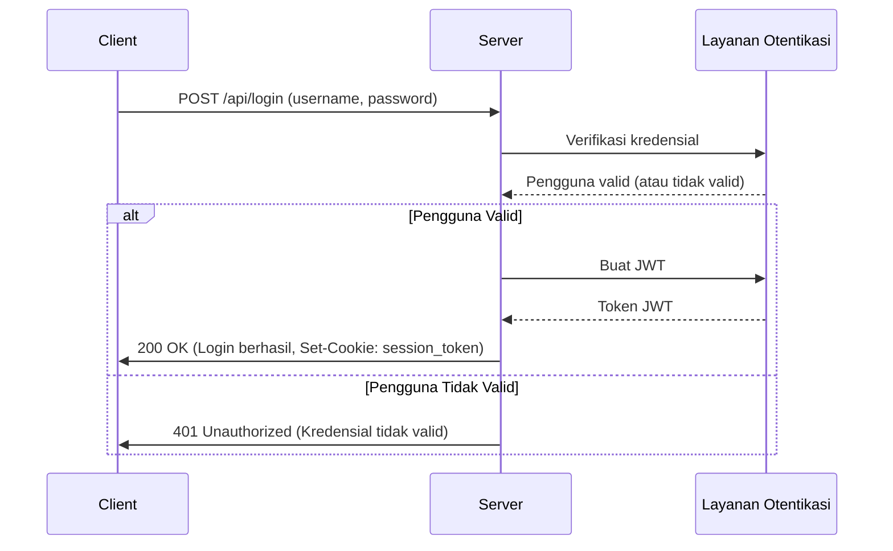

Sumber: [desa_db/server.py:87-110]()

#### Unggah dan Pemrosesan Data

Sistem mendukung pengunggahan data melalui file Excel. File-file ini diproses oleh fungsi middleware, yang mungkin melibatkan pembacaan pratinjau, pemetaan header, dan pemrosesan internal sebelum penyimpanan database.

Sumber: [desa_db/server.py:185-213](), [desa_db/middleware.py:110-143]()

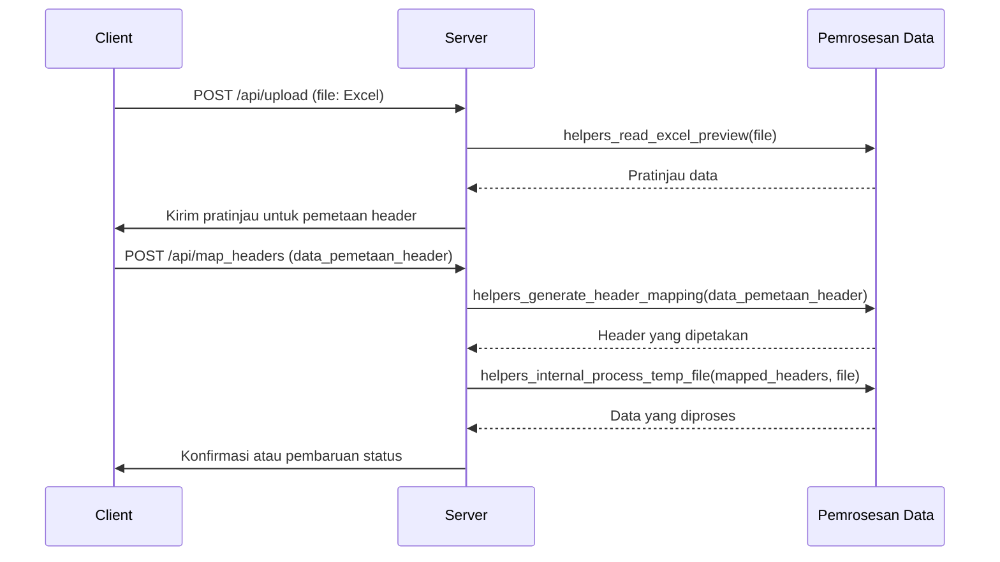

Sumber: [desa_db/server.py:185-213](), [desa_db/middleware.py:110-143]()

### Logika Middleware

Lapisan middleware berisi logika bisnis inti, termasuk operasi database, transformasi data, dan pembuatan laporan.

Sumber: [desa_db/middleware.py]()

#### Inisialisasi dan Manajemen Database

Middleware menangani inisialisasi database, membuat tabel seperti `master_data` dan tabel riwayat jika belum ada. Ini mendefinisikan tipe kolom berdasarkan konfigurasi dan konten data.

Sumber: [desa_db/middleware.py:229-268]()

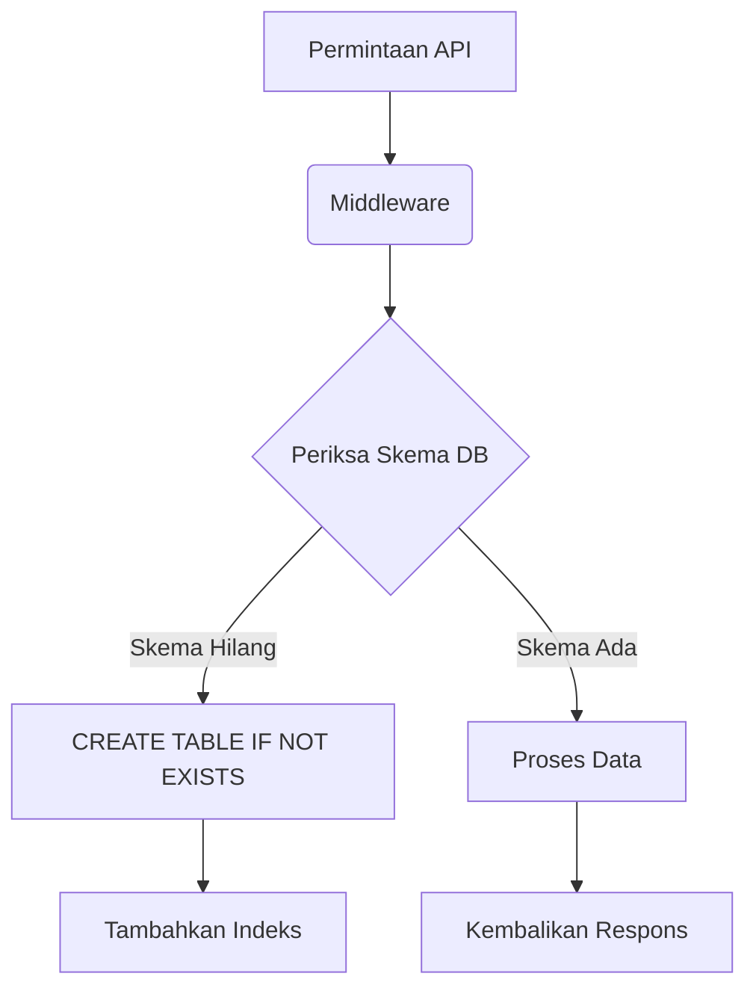

Sumber: [desa_db/middleware.py:229-268]()

#### Pembuatan Laporan (Excel)

Sistem dapat membuat buku kerja Excel yang berisi data grid, rekomendasi dasbor, dan dasbor IKU. Ini melibatkan pembuatan sheet, penerapan pemformatan, penggabungan sel, dan pengisian data.

Sumber: [desa_db/middleware.py:271-444]()

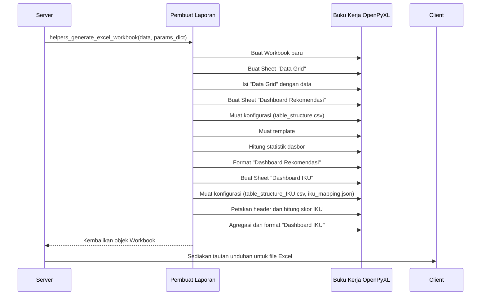

Sumber: [desa_db/middleware.py:271-444]()

#### Perenderan Dasbor (HTML)

Sistem merender dasbor berbasis HTML untuk rekomendasi dan IKU (Indikator Kinerja Utama). Ini melibatkan pembuatan HTML dinamis berdasarkan data dan konfigurasi.

Sumber: [desa_db/middleware.py:446-665](), [desa_db/middleware.py:667-857]()

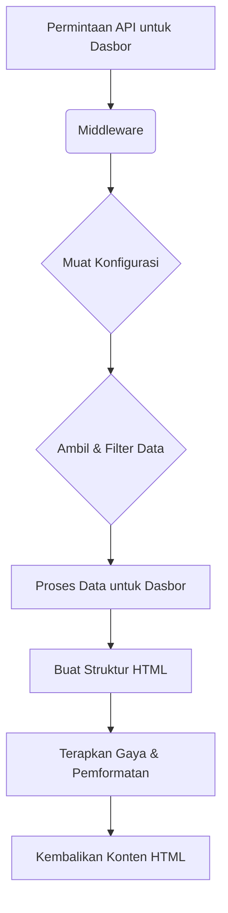

Sumber: [desa_db/middleware.py:446-665](), [desa_db/middleware.py:667-857]()

### Komponen Frontend

Frontend bertanggung jawab untuk interaksi pengguna, menampilkan data, dan membuat permintaan ke API backend. Ini menggunakan Tailwind CSS untuk penataan gaya.

Sumber: [front_end/router.py](), [front_end/tailwind.config.js]()

#### Perutean

Router frontend mendefinisikan berbagai tampilan dan halaman yang dapat diakses oleh pengguna, memetakan URL ke file template tertentu.

Sumber: [front_end/router.py]()

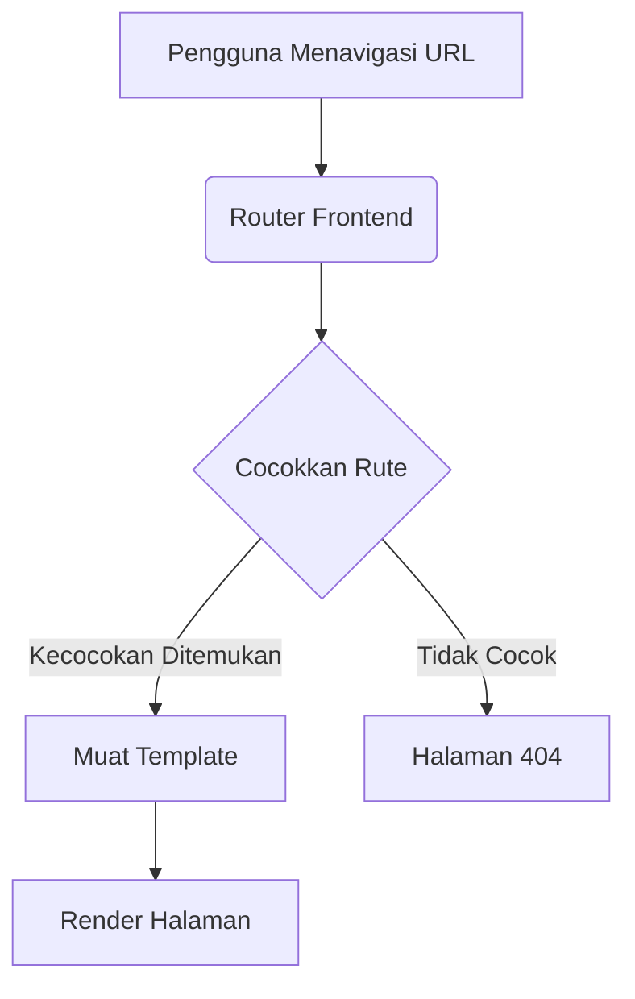

Sumber: [front_end/router.py]()

## Model Konfigurasi dan Data

Sistem sangat bergantung pada file konfigurasi untuk mendefinisikan struktur data, pemetaan, dan logika bisnis.

Sumber: [README.md]()

### File Konfigurasi

Konfigurasi dikelola melalui file JSON dan CSV, biasanya berlokasi di direktori `.config/`.

Sumber: [README.md:3-7]()

| Nama File             | Deskripsi                                       | Format |
| :-------------------- | :---------------------------------------------- | :----- |
| `auth_users.json`     | Menyimpan kredensial dan peran pengguna.        | JSON   |
| `headers.json`        | Memetakan *header* standar ke alias.            | JSON   |
| `intervensi_kegiatan.json` | Menyimpan templat intervensi dan aktivitas. | JSON   |
| `rekomendasi.json`    | Mendefinisikan logika rekomendasi berdasarkan skor. | JSON   |
| `table_structure.csv` | Mendefinisikan struktur untuk dasbor rekomendasi. | CSV    |
| `table_structure_IKU.csv` | Mendefinisikan struktur untuk dasbor IKU.     | CSV    |
| `iku_mapping.json`    | Memetakan metrik IKU induk ke kolom anak.       | JSON   |

Sumber: [README.md:3-7](), [tests/server_test.py:21-44]()

### Skema Basis Data

Tabel `master_data` adalah pusat penyimpanan skor desa. Ini mencakup kolom metadata dan kolom skor yang dibuat secara dinamis. Tabel riwayat mungkin juga ada untuk audit.

Sumber: [desa_db/middleware.py:239-257]()

```mermaid
erDiagram
    master_data {
        TIMESTAMP valid_from
        TIMESTAMP valid_to
        VARCHAR commit_id
        VARCHAR source_file
        VARCHAR Provinsi
        VARCHAR 'Kabupaten/ Kota'
        VARCHAR 'Kecamatan'
        VARCHAR 'Kode Wilayah Administrasi Desa'
        VARCHAR 'Desa'
        VARCHAR 'Status ID'
        TINYINT 'Score A'
        TINYINT 'Score B'
        %% ... kolom skor lainnya ditambahkan secara dinamis
    }
```

Sumber: [desa_db/middleware.py:239-257]()

## Pengaturan Pengujian dan Pengembangan

Proyek ini menyediakan instruksi untuk menyiapkan lingkungan pengembangan, menjalankan pengujian, dan melakukan *deployment* menggunakan Docker.

Sumber: [README.md]()

### *Deployment* Docker

Docker Compose direkomendasikan untuk menjalankan aplikasi, memastikan lingkungan yang konsisten untuk pengembangan dan produksi.

Sumber: [README.md:14-35]()

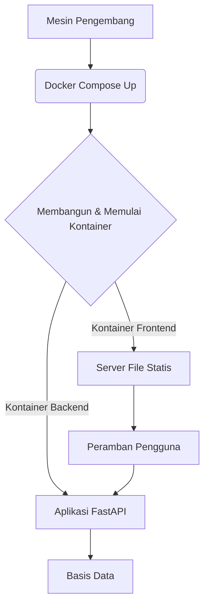

Sumber: [README.md:14-35]()

### Pengujian Unit dan Integrasi

Tes tersedia untuk memverifikasi fungsionalitas *endpoint* server dan logika *middleware*.

Sumber: [tests/server_test.py]()

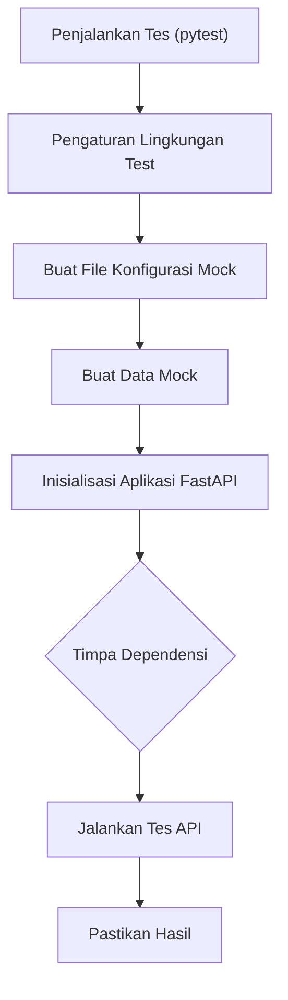

Sumber: [tests/server_test.py]()

## Ringkasan

"Diagram Alur Data" mengilustrasikan sistem yang terstruktur dengan baik di mana *backend* FastAPI mengorkestrasi pemrosesan data melalui fungsi *middleware*. File konfigurasi menjadi pusat dalam mendefinisikan struktur data dan logika, memungkinkan pembuatan laporan dan dasbor secara dinamis. Sistem mendukung unggahan data, otentikasi, dan menyediakan ekspor Excel serta visualisasi berbasis web, dengan pemisahan kekhawatiran yang jelas antara *backend*, *middleware*, dan *frontend*.

Sumber: [desa_db/server.py](), [desa_db/middleware.py](), [front_end/router.py](), [README.md]()

---

<a id='page-component-relationships'></a>

## Hubungan Antar Komponen

### Halaman Terkait

Topik terkait: [Gambaran Umum Arsitektur](#page-architecture-overview), [Diagram Alur Data](#page-data-flow)

<details>
<summary>File sumber yang relevan</summary>

- [docker-compose.yml](https://github.com/anbe-on/integrasi_data_skor_rekomendasi_desa/blob/main/docker-compose.yml)
- [desa_db/server.py](https://github.com/anbe-on/integrasi_data_skor_rekomendasi_desa/blob/main/desa_db/server.py)
- [front_end/router.py](https://github.com/anbe-on/integrasi_data_skor_rekomendasi_desa/blob/main/front_end/router.py)
- [desa_db/auth.py](https://github.com/anbe-on/integrasi_data_skor_rekomendasi_desa/blob/main/desa_db/auth.py)
- [desa_db/middleware.py](https://github.com/anbe-on/integrasi_data_skor_rekomendasi_desa/blob/main/desa_db/middleware.py)
- [front_end/static/css/output.css](https://github.com/anbe-on/integrasi_data_skor_rekomendasi_desa/blob/main/front_end/static/css/output.css)
- [tests/server_test.py](https://github.com/anbe-on/integrasi_data_skor_rekomendasi_desa/blob/main/tests/server_test.py)
- [front_end/templates/login.html](https://github.com/anbe-on/integrasi_data_skor_rekomendasi_desa/blob/main/front_end/templates/login.html)
- [front_end/tailwind.config.js](https://github.com/anbe-on/integrasi_data_skor_rekomendasi_desa/blob/main/front_end/tailwind.config.js)

</details>

# Hubungan Antar Komponen

Dokumen ini menguraikan hubungan dan interaksi antara berbagai komponen proyek "Integrasi Data Skor Rekomendasi Desa". Sistem ini dirancang dengan layanan API backend, antarmuka web frontend, dan layanan pendukung yang dikelola oleh Docker Compose. Tujuan utamanya adalah mengintegrasikan data, menghitung skor, dan memberikan rekomendasi di tingkat desa.

Sistem ini terdiri dari beberapa komponen utama:

*   **Layanan Backend (`desa_db`)**: Diimplementasikan menggunakan FastAPI, layanan ini menangani pemrosesan data, permintaan API, interaksi database, dan logika bisnis. Layanan ini mengekspos endpoint untuk pengambilan data, otentikasi, dan pembuatan laporan.
*   **Layanan Frontend (`front_end`)**: Antarmuka web yang dibangun dengan HTML, CSS (Tailwind CSS), dan JavaScript, bertanggung jawab untuk interaksi pengguna, visualisasi data, dan komunikasi dengan API backend.
*   **Database**: Meskipun tidak dirinci secara eksplisit dalam file yang disediakan, backend berinteraksi dengan database (tersirat oleh `helpers_get_db_connection` dan kueri SQL di `middleware.py`).
*   **Konfigurasi**: Berbagai file JSON dan CSV di dalam direktori `.config` mengelola pengaturan sistem, pemetaan data, dan header.
*   **Orkestrasi Docker**: `docker-compose.yml` mendefinisikan layanan, dependensinya, volume, dan konfigurasi jaringan untuk penerapan dan pengembangan lokal.

## LAYANAN BACKEND (`desa_db`)

Layanan backend, `desa_db/server.py`, berfungsi sebagai inti dari aplikasi. Layanan ini dibangun dengan FastAPI dan mengintegrasikan berbagai fungsi pembantu dari `desa_db/middleware.py` dan logika otentikasi dari `desa_db/auth.py`.

### Fungsionalitas dan Modul Inti

Backend mengelola beberapa fungsi penting:

*   **Endpoint API**: Mengekspos API RESTful untuk login, pengambilan data, unggah file, dan pembuatan laporan.
*   **Otentikasi**: Menangani login pengguna dan pembuatan/validasi token JWT.
*   **Pemrosesan Data**: Mencakup fungsi untuk membaca pratinjau Excel, membuat pemetaan header, memproses file sementara, dan membangun kueri database dinamis.
*   **Pembuatan Dasbor**: Logika untuk menghitung statistik dasbor dan merender HTML untuk dasbor umum dan dasbor IKU (Indikator Kinerja Utama).
*   **Pembuatan Laporan Excel**: Membuat buku kerja Excel dengan beberapa lembar untuk visualisasi data dan pelaporan.
*   **Tugas Latar Belakang**: Mendukung pembuatan file Excel yang telah dirender sebelumnya secara asinkron.

Sumber: [desa_db/server.py:1-250](), [desa_db/middleware.py]()

### Alur Otentikasi

Otentikasi pengguna dikelola oleh `desa_db/auth.py` dan diintegrasikan ke dalam `desa_db/server.py`.

1.  **Permintaan Login**: Model `LoginRequest` didefinisikan untuk nama pengguna dan kata sandi.
2.  **Pemeriksaan Otentikasi**: Endpoint `/api/login` mengambil kredensial pengguna dari `auth_users.json`, memverifikasi kata sandi terhadap hash yang tersimpan menggunakan `auth_verify_password`.
3.  **Pembuatan JWT**: Setelah otentikasi berhasil, token akses JWT dibuat dengan waktu kedaluwarsa.
4.  **Pengaturan Cookie**: JWT diatur sebagai cookie HttpOnly bernama `session_token` dalam respons.

Sumber: [desa_db/server.py:119-154](), [desa_db/auth.py]()

```mermaid
graph TD
    A[Pengguna] --> B[Frontend]
    B --> C{POST /api/login}
    C --> D[desa_db/server.py]
    D --> E[desa_db/auth.py]
    E -- Verifikasi Kredensial --> F[auth_users.json]
    F -- Kredensial Cocok --> E
    E -- Buat JWT --> D
    D -- Atur Cookie HttpOnly --> G[Respons]
    G --> B
    B -- Alihkan/Muat Halaman --> A
```

### Pemrosesan Data dan Pelaporan

Backend memanfaatkan file konfigurasi dan fungsi pembantu untuk memproses data dan menghasilkan laporan.

*   **File Konfigurasi**: `headers.json`, `table_structure.csv`, `table_structure_IKU.csv`, `iku_mapping.json`, dan `rekomendasi.json` sangat penting untuk mendefinisikan struktur data, pemetaan, dan logika penilaian.
*   **Pembuatan Dasbor**:
    *   `helpers_calculate_dashboard_stats`: Menghitung statistik untuk dasbor utama.
    *   `helpers_render_dashboard_html`: Menghasilkan HTML untuk tabel dasbor utama.
    *   `helpers_render_iku_dashboard`: Menghasilkan HTML untuk dasbor IKU.
*   **Pembuatan Excel**:
    *   `helpers_generate_excel_workbook`: Membuat struktur buku kerja Excel.
    *   `helpers_background_task_generate_pre_render_excel`: Menangani pembuatan Excel secara asinkron.

Sumber: [desa_db/server.py:16-26](), [desa_db/middleware.py:45-359](), [tests/server_test.py:15-36]()

```mermaid
graph TD
    A[Frontend] --> B{Permintaan API}
    B --> C[desa_db/server.py]
    C -- Muat Konfigurasi --> D[.config/]
    D -- headers.json --> C
    D -- table_structure.csv --> C
    D -- table_structure_IKU.csv --> C
    D -- iku_mapping.json --> C
    D -- rekomendasi.json --> C
    C -- Proses Data --> E[desa_db/middleware.py]
    E -- Hitung Statistik --> F[helpers_calculate_dashboard_stats]
    E -- Render HTML --> G[helpers_render_dashboard_html]
    E -- Render HTML IKU --> H[helpers_render_iku_dashboard]
    E -- Buat Excel --> I[helpers_generate_excel_workbook]
    E -- Excel Latar Belakang --> J[helpers_background_task_generate_pre_render_excel]
    F --> K[Database]
    G --> L['Respons (HTML)']
    H --> L
    I --> M['Respons (Excel)']
    J --> M
```

## LAYANAN FRONTEND (`front_end`)

Frontend menyediakan antarmuka pengguna untuk berinteraksi dengan layanan backend. Frontend menggunakan HTML, CSS (Tailwind CSS), dan JavaScript.

### File dan Teknologi Utama

*   **Template HTML**: `login.html`, `user.html`, `admin.html` mendefinisikan struktur antarmuka pengguna yang berbeda.
*   **CSS**: `output.css` yang dihasilkan dari Tailwind CSS menyediakan penataan gaya. `tailwind.config.js` mengonfigurasi Tailwind.
*   **Routing**: `front_end/router.py` kemungkinan menangani routing sisi klien atau menyajikan aset statis.
*   **Komunikasi API**: JavaScript di dalam template HTML atau file JS terpisah (tidak disediakan) akan menangani pembuatan permintaan ke API backend.

Sumber: [front_end/templates/login.html](), [front_end/templates/user.html](), [front_end/templates/admin.html](), [front_end/tailwind.config.js](), [front_end/router.py]()

### Penataan Gaya dengan Tailwind CSS

Tailwind CSS digunakan untuk penataan gaya, dikonfigurasi melalui `front_end/tailwind.config.js` dan dikompilasi ke dalam `front_end/static/css/output.css`.

Sumber: [front_end/tailwind.config.js](), [front_end/static/css/output.css]()

```mermaid
graph TD
    A[Pengguna] --> B[Browser]
    B -- Memuat --> C[front_end/router.py]
    C -- Menyajikan --> D[Template HTML]
    D -- Menghubungkan ke --> E[front_end/static/css/output.css]
    E -- Menggunakan --> F[Tailwind CSS]
    F -- Dikonfigurasi oleh --> G[front_end/tailwind.config.js]
    D -- Berisi --> H[JavaScript untuk Panggilan API]
    H --> I[API_BASE_URL]
    I -- contoh --> J[http://backend_id_srd_iku:8000]
    J --> K[Layanan Backend]
```

## ORKESTRASI DOCKER (`docker-compose.yml`)

Docker Compose digunakan untuk mendefinisikan dan mengelola layanan aplikasi, memastikan lingkungan yang konsisten dan dapat direproduksi.

### Layanan yang Didefinisikan

*   **`backend_id_srd_iku`**: Menjalankan layanan backend FastAPI. Layanan ini me-mount direktori konfigurasi, basis data, file sementara, ekspor, dan frontend. Layanan ini juga menggunakan variabel lingkungan dari `.env`.
*   **`frontend_id_srd_iku`**: Menjalankan layanan frontend, dikonfigurasi untuk berkomunikasi dengan backend melalui `API_BASE_URL`.
*   **`nginx_id_srd_iku`**: Sebuah *reverse proxy* menggunakan Nginx untuk merutekan lalu lintas eksternal ke frontend. Layanan ini mengekspos port 8080.
*   **`backup_id_srd_iku`**: Layanan untuk pencadangan basis data otomatis menggunakan skrip.

Sumber: [docker-compose.yml]()

```mermaid
graph TD
    subgraph Lingkungan Docker
        A[Akses Pengguna/Eksternal] --> B(Nginx);
        B -- Port 8080 --> C(Layanan Frontend);
        C -- Panggilan API --> D(Layanan Backend);
        D -- Membaca/Menulis --> E(Konfigurasi/.config);
        D -- Membaca/Menulis --> F(Basis Data/desa_db/dbs);
        D -- Membaca/Menulis --> G(File Sementara/desa_db/temp);
        D -- Membaca/Menulis --> H(Ekspor/exports);
        C -- Membaca --> I(File Statis Frontend/front_end/static);
        J(Layanan Cadangan) -- Menjalankan Skrip --> K(Skrip Cadangan);
        J -- Mengakses --> F;
        J -- Menyimpan ke --> L(Folder Cadangan);
    end

    %% Definisi Layanan
    B -- Mengelola --> C;
    C -- Bergantung pada --> D;
    B -- Bergantung pada --> C;
    J -- Menjalankan --> K;
```

## Manajemen Konfigurasi

Konfigurasi terpusat dan dikelola melalui berbagai file, terutama yang terletak di direktori `.config`.

### File Konfigurasi Utama

*   **`.config/auth_users.json`**: Menyimpan kredensial pengguna (nama pengguna, kata sandi ter-hash, peran) untuk otentikasi.
*   **`.config/headers.json`**: Mendefinisikan header kolom standar dan aliasnya untuk impor dan pemrosesan data.
*   **`.config/intervensi_kegiatan.json`**: Berisi data yang terkait dengan kegiatan intervensi.
*   **`.config/rekomendasi.json`**: Memetakan skor ke teks rekomendasi tertentu.
*   **`.config/table_structure.csv`**: Mendefinisikan struktur tabel, termasuk dimensi, sub-dimensi, indikator, dan item.
*   **`.config/table_structure_IKU.csv`**: Mendefinisikan struktur untuk tabel IKU (Indikator Kinerja Utama).
*   **`.config/iku_mapping.json`**: Memetakan metrik induk IKU ke sub-metrik penyusunnya.
*   **`.env`**: Variabel lingkungan, terutama `APP_SECRET_KEY`, yang digunakan untuk rahasia aplikasi.

Sumber: [tests/server_test.py:15-36](), [README.md:4-9]()

```mermaid
graph TD
    A[Layanan Backend] --> B(File Konfigurasi);
    B -- Memuat --> C[.config/auth_users.json];
    B -- Memuat --> D[.config/headers.json];
    B -- Memuat --> E[.config/intervensi_kegiatan.json];
    B -- Memuat --> F[.config/rekomendasi.json];
    B -- Memuat --> G[.config/table_structure.csv];
    B -- Memuat --> H[.config/table_structure_IKU.csv];
    B -- Memuat --> I[.config/iku_mapping.json];
    J[Layanan Backend] -- Membaca --> K[.env];
    K -- APP_SECRET_KEY --> J;
```

## Alur dan Interaksi Data

Sistem mengikuti arsitektur klien-server yang umum di mana frontend berinteraksi dengan API backend.

1.  **Interaksi Pengguna**: Pengguna berinteraksi dengan aplikasi frontend melalui peramban mereka.
2.  **Permintaan Frontend**: Frontend membuat permintaan HTTP ke *endpoints* API backend (misalnya, `/api/login`, `/api/data`, `/api/generate_excel`).
3.  **Pemrosesan Backend**: Backend (`desa_db/server.py` dan `desa_db/middleware.py`) menangani permintaan ini. Backend membaca file konfigurasi, mengkueri basis data, melakukan perhitungan, dan menghasilkan respons.
4.  **Pengambilan/Manipulasi Data**: Backend dapat berinteraksi dengan basis data untuk mengambil atau menyimpan data.
5.  **Pembuatan Respons**: Backend mengembalikan data (misalnya, JSON untuk respons API, HTML untuk dasbor yang dirender) atau file (misalnya, laporan Excel) ke frontend.
6.  **Rendering Frontend**: Frontend menerima respons dan memperbarui antarmuka pengguna sesuai kebutuhan.

Sumber: [desa_db/server.py](), [front_end/router.py](), [docker-compose.yml]()

```mermaid
sequenceDiagram
    participant Pengguna
    participant Frontend
    participant Backend
    participant BasisData

    Pengguna->>Frontend: Mengakses Aplikasi Web
    Frontend->>Backend: POST /api/login (kredensial)
    Backend->>BasisData: Verifikasi Kredensial Pengguna
    BasisData-->>Backend: Pengguna Ditemukan/Tidak Ditemukan
    Backend-->>Frontend: Token JWT / Respons Kesalahan
    Frontend->>Frontend: Menyimpan JWT (Cookie HttpOnly)
    Pengguna->>Frontend: Meminta Data/Laporan
    Frontend->>Backend: GET /api/data?filters...
    Backend->>BasisData: Ambil Data Berdasarkan Filter
    BasisData-->>Backend: Data Mentah
    Backend->>Middleware: Proses Data (Perhitungan, Pemformatan)
    Middleware-->>Backend: Data yang Diproses / HTML / Excel
    Backend-->>Frontend: Respons JSON / HTML / Tautan Unduh File
    Frontend->>Frontend: Merender Data / Menampilkan Laporan
```


<a id='page-data-upload-and-processing'></a>

## Unggah dan Pemrosesan Data

### Halaman Terkait

Topik terkait: [Dasbor dan Pelaporan](#page-dashboard-and-reporting), [File Konfigurasi](#page-configuration-files)

<details>
<summary>File sumber yang relevan</summary>

- desa_db/server.py
- desa_db/middleware.py
- tests/server_test.py
- front_end/static/js/spark-md5.min.js
- front_end/templates/admin.html

</details>

# Unggah dan Pemrosesan Data

Halaman wiki ini merinci alur kerja unggah dan pemrosesan data dalam proyek `integrasi_data_skor_rekomendasi_desa`. Ini mencakup mekanisme untuk mengunggah file, menangani unggahan yang dapat dilanjutkan, pemecahan menjadi beberapa bagian (chunking), dan langkah-langkah pemrosesan awal yang mempersiapkan data untuk analisis dan penyimpanan lebih lanjut. Sistem mendukung pengguna administratif dalam mengunggah kumpulan data, memastikan integritas data melalui hashing dan memberikan umpan balik tentang status unggahan.

Proses unggah data dirancang agar tangguh, mengakomodasi file yang berpotensi besar melalui unggahan yang dapat dilanjutkan. Setelah diunggah, data akan menjalani pemrosesan awal, termasuk validasi dan persiapan untuk integrasi ke dalam modul basis data dan pelaporan sistem.

## Endpoints Unggah Data

Backend menyediakan beberapa *endpoints* API untuk mengelola proses unggah data. Endpoints ini diamankan dan biasanya memerlukan hak istimewa administratif.

### Inisialisasi Unggahan yang Dapat Dilanjutkan (`/upload/init/{year}`)

Endpoints ini menginisialisasi proses unggahan yang dapat dilanjutkan. Ini memeriksa apakah unggahan parsial untuk file yang diberikan sudah ada dan mengembalikan jumlah byte yang sudah diterima. Hal ini memungkinkan klien untuk melanjutkan unggahan yang terputus dari tempat terakhir kali berhenti.

*   **Metode:** `POST`
*   **Jalur:** `/upload/init/{year}`
*   **Autentikasi:** Memerlukan hak istimewa admin (misalnya, `Depends(auth_require_admin)`).
*   **Badan Permintaan:** Model `UploadInit`
    *   `filename` (str): Nama file yang sedang diunggah.
    *   `file_uid` (str): Pengenal unik untuk file, biasanya berasal dari hash dan ukurannya. Ini digunakan untuk menemukan unggahan parsial.
    *   `total_size` (int): Ukuran total file dalam byte.
    *   `total_hash` (str): Hash MD5 dari seluruh file.
*   **Respons:**
    *   `{"status": "ready", "upload_id": str, "received_bytes": int}`: Menunjukkan unggahan dapat dimulai, memberikan `upload_id` (yaitu `file_uid`) dan jumlah byte yang sudah diterima.
    *   `{"status": "exists", "upload_id": str, "received_bytes": int}`: Menunjukkan file sudah ada dan lengkap. `received_bytes` akan sama dengan `total_size`.
*   **Keamanan:** `file_uid` divalidasi terhadap ekspresi reguler `^[a-zA-Z0-9_]+$` untuk mencegah serangan traversal direktori.
*   **Penyimpanan Sementara:** Unggahan parsial disimpan di `TEMP_FOLDER` dengan awalan `partial_` dan `file_uid`.

Sumber: [desa_db/server.py:205-235]()

### Bagian Unggah (`/upload/chunk/{year}`)

Endpoints ini menerima bagian-bagian individual dari sebuah file selama unggahan yang dapat dilanjutkan. Ini melakukan validasi hash MD5 pada setiap bagian untuk memastikan integritas data sebelum menambahkannya ke file sementara.

*   **Metode:** `POST`
*   **Jalur:** `/upload/chunk/{year}`
*   **Autentikasi:** Memerlukan hak istimewa admin.
*   **Data Formulir:**
    *   `chunk` (File): Bagian file itu sendiri.
    *   `upload_id` (str): Pengenal unik unggahan (dari `UploadInit`).
    *   `offset` (int): Offset byte awal bagian ini dalam file asli.
    *   `chunk_hash` (str): Hash MD5 dari bagian tersebut.
*   **Respons:** `{"status": "ok", "received": int}`: Menunjukkan penerimaan dan penambahan bagian yang berhasil.
*   **Penanganan Kesalahan:** Mengembalikan kode status 400 dengan pesan kesalahan jika kerusakan bagian terdeteksi (ketidakcocokan hash).
*   **Penambahan File:** Bagian ditambahkan dalam mode biner (`'ab'`) ke file sementara.

Sumber: [desa_db/server.py:241-267]()

### Finalisasi Unggah (`/upload/finalize/{year}`)

Endpoints ini dipanggil setelah semua bagian file telah diunggah. Ini memfinalisasi proses unggahan, berpotensi melakukan verifikasi hash akhir dan memindahkan file ke lokasi permanennya atau memulai pemrosesan lebih lanjut.

*   **Metode:** `POST`
*   **Jalur:** `/upload/finalize/{year}`
*   **Autentikasi:** Memerlukan hak istimewa admin.
*   **Badan Permintaan:** Model `UploadFinalize`
    *   `upload_id` (str): Pengenal unik unggahan.
    *   `filename` (str): Nama file asli.
    *   `total_hash` (str): Hash MD5 dari seluruh file.
*   **Pemrosesan:** Endpoints ini kemungkinan memicu finalisasi file dan mungkin memulai tugas pemrosesan latar belakang.

Sumber: [desa_db/server.py:189-194]()

## Antarmuka Unggah Frontend

Frontend menyediakan antarmuka pengguna untuk mengunggah data, yang terintegrasi ke dalam dasbor admin.

### Halaman Admin (`/admin`)

Rute `/admin` menyajikan template `admin.html`, yang berisi elemen UI untuk unggah data.

*   **Fungsionalitas:** Menampilkan pesan status unggahan dan menyediakan kontrol untuk memulai unggahan.
*   **Elemen UI:** Termasuk elemen seperti tombol "Unggah Data" dan tampilan pesan status (`x-show="ui_UploadStatusMessage"`).
*   **Logika JavaScript:** JavaScript sisi klien menangani pemilihan file, pemecahan menjadi beberapa bagian (chunking), hashing (menggunakan SparkMD5), dan panggilan API ke *endpoints* unggahan backend.

Sumber: [front_end/templates/admin.html]()

## Hashing dan Integritas File

Sistem menggunakan hashing MD5 untuk memastikan integritas file yang diunggah dan potongan individual.

### SparkMD5

Pustaka `spark-md5.min.js` digunakan di frontend untuk menghitung hash MD5 dari file dan potongannya. Ini sangat penting untuk memverifikasi bahwa data tidak rusak selama transmisi.

*   **Penggunaan:** Fungsi `helpers_compute_md5` di JavaScript frontend (tidak sepenuhnya disediakan dalam konteks, tetapi tersirat dari penggunaan dalam logika `admin.html`) kemungkinan akan menggunakan SparkMD5 untuk menghash blob file.
*   **Integrasi API:** Hash yang dihitung dikirim ke backend selama fase inisialisasi dan pemotongan unggahan.

Sumber: [front_end/static/js/spark-md5.min.js]()

## Alur Pemrosesan Data

Diagram berikut mengilustrasikan alur yang disederhanakan untuk unggahan yang dapat dilanjutkan dan pemrosesan awal.

```mermaid
graph TD
    A[Admin User] --> B{Select File}
    B --> C["Compute File Hash (SparkMD5)"]
    C --> D["POST /upload/init/{year}"]
    D --> E{Server: Check Partial Upload}
    E -- Ready --> F[Client: Start Chunking]
    E -- Exists --> G[Client: Finalize Upload]
    F --> H["Slice File into Chunks"]
    H --> I["Compute Chunk Hash"]
    I --> J["POST /upload/chunk/{year}"]
    J --> K{Server: Verify Chunk Hash & Append}
    K -- OK --> F
    K -- Corrupt --> L[Client: Handle Error/Retry]
    F -- "All Chunks Sent" --> M["POST /upload/finalize/{year}"]
    M --> N{Server: Finalize Upload}
    N --> O[Process Data]
    G --> O
    O --> P[Store Processed Data]

```

Sumber: [desa_db/server.py:205-267](), [front_end/templates/admin.html]()

## Model API untuk Unggahan

Backend mendefinisikan model Pydantic untuk menstrukturkan data yang masuk untuk permintaan API terkait unggahan.

| Nama Model       | Kolom                                            | Deskripsi                                             |
| :--------------- | :----------------------------------------------- | :---------------------------------------------------- |
| `UploadInit`     | `filename` (str), `file_uid` (str), `total_size` (int), `total_hash` (str) | Model permintaan untuk menginisialisasi unggahan yang dapat dilanjutkan. |
| `UploadFinalize` | `upload_id` (str), `filename` (str), `total_hash` (str) | Model permintaan untuk menyelesaikan unggahan yang dapat dilanjutkan. |

Sumber: [desa_db/server.py:169-185]()

## Kasus Uji

File `tests/server_test.py` menyertakan pengujian untuk fungsionalitas unggahan, memverifikasi alur ujung ke ujung dari inisialisasi hingga penyelesaian dan pemrosesan selanjutnya.

*   **`test_full_etl_and_endpoints_pipeline`**: Kasus uji ini mensimulasikan alur unggah dan pemrosesan data lengkap, termasuk:
    *   Unggahan yang dapat dilanjutkan (inisialisasi, potongan, penyelesaian).
    *   Analisis pratinjau dan header.
    *   Pemrosesan data yang dipetakan.
    *   Melakukan commit data ke database.
    *   Fungsi kueri, pembuatan dasbor, dan ekspor.

Sumber: [tests/server_test.py:53-79]()

## Konfigurasi dan Constant

Konfigurasi server mencakup jalur untuk penyimpanan file sementara dan direktori template.

*   **`TEMP_FOLDER`**: Didefinisikan sebagai `os.path.join(BASE_DIR, "temp")` di `desa_db/server.py`, direktori ini digunakan untuk menyimpan file unggahan sementara.
*   **`TEMPLATE_DIR`**: Didefinisikan sebagai `os.path.join(ROOT_DIR, "front_end", "templates")`, direktori ini berisi template HTML, termasuk `admin.html`.

Sumber: [desa_db/server.py:95-101]()

## Perlindungan dan Perutean Server

File `desa_db/server.py` menangani perutean dan perlindungan server dasar.

*   **Rute `/admin`**: Rute ini menyajikan halaman `admin.html`. Ini termasuk perlindungan sisi server yang mengalihkan pengguna yang tidak terautentikasi ke halaman `/login` jika cookie `session_token` tidak ada.
*   **Pengalihan Akar (`/`)**: Mengalihkan ke `/admin`.

Sumber: [desa_db/server.py:43-59]()

## Logika Pemrosesan Data (Tersirat)

Meskipun logika pemrosesan data terperinci setelah unggahan tidak sepenuhnya terekspos dalam cuplikan yang disediakan, template `admin.html` dan `server.py` menunjukkan bahwa setelah penyelesaian unggahan yang berhasil, sistem melanjutkan ke "Processing" dan kemudian "Store Processed Data". File `middleware.py` berisi fungsi seperti `helpers_internal_process_temp_file`, `helpers_read_excel_preview`, dan `helpers_generate_header_mapping`, menunjukkan bahwa file yang diproses kemungkinan adalah Excel atau CSV, yang kemudian diurai, dipetakan, dan disimpan.

Sumber: [front_end/templates/admin.html](), [desa_db/server.py:205-235](), [desa_db/middleware.py]()

---

<a id='page-dashboard-and-reporting'></a>

## Dasbor dan Pelaporan

### Halaman Terkait

Topik terkait: [Unggah dan Pemrosesan Data](#page-data-upload-and-processing), [Struktur Basis Data](#page-database-structure)

<details>
<summary>File sumber yang relevan</summary>

- [desa_db/server.py](https://github.com/anbe-on/integrasi_data_skor_rekomendasi_desa/blob/main/desa_db/server.py)
- [desa_db/middleware.py](https://github.com/anbe-on/integrasi_data_skor_rekomendasi_desa/blob/main/desa_db/middleware.py)
- [front_end/templates/user.html](https://github.com/anbe-on/integrasi_data_skor_rekomendasi_desa/blob/main/front_end/templates/user.html)
- [front_end/templates/admin.html](https://github.com/anbe-on/integrasi_data_skor_rekomendasi_desa/blob/main/front_end/templates/admin.html)
- [tests/server_test.py](https://github.com/anbe-on/integrasi_data_skor_rekomendasi_desa/blob/main/tests/server_test.py)
- [README.md](https://github.com/anbe-on/integrasi_data_skor_rekomendasi_desa/blob/main/README.md)
- [front_end/static/css/output.css](https://github.com/anbe-on/integrasi_data_skor_rekomendasi_desa/blob/main/front_end/static/css/output.css)
</details>

# Dasbor dan Pelaporan

Proyek ini menyediakan fungsionalitas dasbor dan pelaporan yang kuat, yang terutama berfokus pada visualisasi dan analisis skor data desa dan rekomendasi. Fitur-fitur ini dapat diakses melalui antarmuka pengguna yang berbeda (Admin dan Pengguna) dan menghasilkan laporan terperinci dalam format Excel. Sistem ini memanfaatkan file konfigurasi untuk mendefinisikan struktur data, pemetaan, dan logika pelaporan, memastikan fleksibilitas dan kustomisasi.

Sistem pelaporan menghasilkan tiga lembar yang berbeda dalam sebuah buku kerja Excel: "Grid Data," "Dashboard Rekomendasi," dan "Dashboard IKU." Setiap lembar melayani tujuan tertentu dalam menyajikan data terintegrasi, mulai dari kisi data mentah hingga dasbor analitik terperinci. Aplikasi front-end, `admin.html` dan `user.html`, menyediakan antarmuka pengguna untuk berinteraksi dengan fitur-fitur ini, sementara middleware back-end (`middleware.py`) menangani pemrosesan data yang kompleks dan pembuatan Excel.

Sumber: [desa_db/middleware.py:11](https://github.com/anbe-on/integrasi_data_skor_rekomendasi_desa/blob/main/desa_db/middleware.py#L11), [desa_db/server.py:117](https://github.com/anbe-on/integrasi_data_skor_rekomendasi_desa/blob/main/desa_db/server.py#L117)

## Komponen Inti Pelaporan

Sistem pelaporan dibangun di sekitar beberapa komponen kunci dan file konfigurasi yang menentukan perilaku dan keluarannya.

### File Konfigurasi

Proyek ini bergantung pada serangkaian file konfigurasi yang terletak di direktori `.config/` untuk mendefinisikan struktur dan logika untuk dasbor dan laporan.

*   `headers.json`: Mendefinisikan nama kolom standar dan aliasnya.
*   `table_structure.csv`: Menentukan struktur untuk lembar "Dashboard Rekomendasi," termasuk dimensi, sub-dimensi, indikator, dan item.
*   `table_structure_IKU.csv`: Mendefinisikan struktur untuk lembar "Dashboard IKU," termasuk unit teritorial dan induk indikator.
*   `iku_mapping.json`: Memetakan indikator induk dari `table_structure_IKU.csv` ke kolom skor yang sesuai.
*   `rekomendasi.json`: Berisi logika untuk menerjemahkan skor numerik menjadi rekomendasi tekstual.
*   `intervensi_kegiatan.json`: Menyimpan templat untuk kegiatan intervensi.
*   `auth_users.json`: Mengelola otentikasi pengguna.

Sumber: [README.md:4](https://github.com/anbe-on/integrasi_data_skor_rekomendasi_desa/blob/main/README.md#configuration-files), [tests/server_test.py:18](https://github.com/anbe-on/integrasi_data_skor_rekomendasi_desa/blob/main/tests/server_test.py#L18), [tests/server_test.py:26](https://github.com/anbe-on/integrasi_data_skor_rekomendasi_desa/blob/main/tests/server_test.py#L26), [tests/server_test.py:31](https://github.com/anbe-on/integrasi_data_skor_rekomendasi_desa/blob/main/tests/server_test.py#L31), [tests/server_test.py:36](https://github.com/anbe-on/integrasi_data_skor_rekomendasi_desa/blob/main/tests/server_test.py#L36), [tests/server_test.py:41](https://github.com/anbe-on/integrasi_data_skor_rekomendasi_desa/blob/main/tests/server_test.py#L41), [tests/server_test.py:46](https://github.com/anbe-on/integrasi_data_skor_rekomendasi_desa/blob/main/tests/server_test.py#L46)

### Pembuatan Buku Kerja Excel

Skrip `middleware.py` mengoordinasikan pembuatan buku kerja Excel dengan beberapa lembar.

```python
# Contoh inisialisasi buku kerja dan pembuatan lembar
wb = Workbook()

# --- LEMBAR 1: GRID DATA ---
ws1 = wb.active
ws1.title = "Grid Data"

# --- LEMBAR 2: DASHBOARD REKOMENDASI ---
ws2 = wb.create_sheet("Dashboard Rekomendasi")

# --- LEMBAR 3: DASHBOARD IKU ---
ws3 = wb.create_sheet("Dashboard IKU")
```

Sumber: [desa_db/middleware.py:88](https://github.com/anbe-on/integrasi_data_skor_rekomendasi_desa/blob/main/desa_db/middleware.py#L88), [desa_db/middleware.py:117](https://github.com/anbe-on/integrasi_data_skor_rekomendasi_desa/blob/main/desa_db/middleware.py#L117), [desa_db/middleware.py:145](https://github.com/anbe-on/integrasi_data_skor_rekomendasi_desa/blob/main/desa_db/middleware.py#L145)

### Penataan Gaya dan Pemformatan

Gaya Excel umum seperti batas, perataan, isian, dan font didefinisikan dan digunakan kembali di seluruh lembar untuk presentasi yang konsisten.

```python
# Definisi Gaya Umum
thin_border = Border(
    left=Side(style='thin'),
    right=Side(style='thin'),
    top=Side(style='thin'),
    bottom=Side(style='thin')
)
align_top = Alignment(vertical='top', wrap_text=True)
align_center = Alignment(horizontal='center', vertical='center', wrap_text=True)
header_fill = PatternFill(start_color="F2F2F2", end_color="F2F2F2", fill_type="solid")
header_font = Font(bold=True)
```

Sumber: [desa_db/middleware.py:91](https://github.com/anbe-on/integrasi_data_skor_rekomendasi_desa/blob/main/desa_db/middleware.py#L91)

## Sheet 1: Data Grid

Sheet ini menyajikan data mentah dalam format tabel, seringkali setelah menerapkan terjemahan atau pemfilteran berdasarkan parameter pengguna.

### Pemuatan dan Transformasi Data

Data dimuat ke dalam pandas DataFrame dan kemudian dikonversi menjadi daftar kamus agar lebih mudah ditulis ke lembar Excel. Jika `do_translate` bernilai benar, fungsi `apply_rekomendasis` akan dipanggil.

```python
df_sheet1 = apply_rekomendasis(df_grid) if do_translate else df_grid
grid_dicts = df_sheet1.to_dicts()
```

Sumber: [desa_db/middleware.py:106](https://github.com/anbe-on/integrasi_data_skor_rekomendasi_desa/blob/main/desa_db/middleware.py#L106)

### Penulisan Header dan Data

Header ditulis terlebih dahulu, diikuti oleh baris data. Nilai `None` atau `NaN` dikonversi menjadi string kosong agar kompatibel dengan Excel.

```python
if grid_dicts:
    headers = list(grid_dicts[0].keys())
    ws1.append(headers)
    for row in grid_dicts:
        clean_row = [(v if v is not None else "") for v in row.values()]
        ws1.append(clean_row)
else:
    ws1.append(["Tidak Ditemukan Data untuk filter"])
```

Sumber: [desa_db/middleware.py:109](https://github.com/anbe-on/integrasi_data_skor_rekomendasi_desa/blob/main/desa_db/middleware.py#L109)

### Pemformatan

Pemformatan dasar diterapkan pada baris header, termasuk font tebal dan isian abu-abu muda.

```python
for cell in ws1[1]:
    cell.font = header_font
    cell.fill = header_fill
```

Sumber: [desa_db/middleware.py:114](https://github.com/anbe-on/integrasi_data_skor_rekomendasi_desa/blob/main/desa_db/middleware.py#L114)

## Sheet 2: Dasbor Rekomendasi

Sheet ini menyediakan dasbor terperinci dengan skor agregat, rekomendasi, dan detail intervensi, yang diorganisir berdasarkan dimensi, sub-dimensi, dan indikator.

### Pemuatan dan Konfigurasi Data

Ini memuat `table_structure.csv` untuk memahami struktur laporan dan skema `master_data` untuk menentukan kolom metrik. Templat intervensi juga dimuat.

```python
csv_path = os.path.join(CONFIG_DIR, "table_structure.csv")
structure = []
if os.path.exists(csv_path):
    with open(csv_path, "r", encoding="utf-8-sig", errors="replace") as f:
        # ... (logika pembacaan CSV) ...
        structure = list(reader)

db_cols_info = con.execute("DESCRIBE master_data").fetchall()
metadata_cols = { ... } # Kolom metadata yang ditentukan
ordered_db_cols = [r[0] for r in db_cols_info if r[0] not in metadata_cols]

item_names = [row.get("ITEM", "") for row in structure if row.get("ITEM")]
templates = helpers_get_or_create_intervensi_kegiatan(item_names)
```

Sumber: [desa_db/middleware.py:120](https://github.com/anbe-on/integrasi_data_skor_rekomendasi_desa/blob/main/desa_db/middleware.py#L120), [desa_db/middleware.py:135](https://github.com/anbe-on/integrasi_data_skor_rekomendasi_desa/blob/main/desa_db/middleware.py#L135)

### Pemrosesan dan Perhitungan Data

Fungsi `helpers_calculate_dashboard_stats` dipanggil untuk menghitung rata-rata, jumlah, dan menghasilkan teks naratif berdasarkan struktur dan templat yang dimuat.

```python
calculated_rows = helpers_calculate_dashboard_stats(df_grid, structure, ordered_db_cols, templates)
```

Sumber: [desa_db/middleware.py:175](https://github.com/anbe-on/integrasi_data_skor_rekomendasi_desa/blob/main/desa_db/middleware.py#L175)

### Pemformatan Header dan Kolom

Header disusun dengan sel gabungan untuk grup "SKOR" dan "PELAKSANA". Lebar kolom dioptimalkan untuk keterbacaan.

```python
# Baris 1: Header Gabungan
ws2.append(["NO", "DIMENSI", "SUB DIMENSI", "INDIKATOR", "ITEM",
            "SKOR", "", "", "", "", "",         # Colspan 6
            "INTERVENSI",                       # Rowspan 2
            "PUSAT", "PROVINSI", "KABUPATEN", "DESA", "Lainnya"]) # PELAKSANA

# Baris 2: Sub Header untuk grup SKOR
ws2.append(["", "", "", "", "",
            "Rata-rata", "Min", "Max", "Total", "Jumlah", "Standar Deviasi",
            "", # INTERVENSI (sudah rowspan 2)
            "", "", "", "", ""]) # PELAKSANA (sudah rowspan 2)

# Terapkan pemformatan ke header
for r in range(1, 3):
    for cell in ws2[r]:
        cell.font = header_font
        cell.fill = header_fill
        cell.border = thin_border
        cell.alignment = align_center

# Lebar Kolom
ws2.column_dimensions['A'].width = 5   # NO
ws2.column_dimensions['B'].width = 15  # DIMENSI
# ... pengaturan lebar kolom lainnya ...
ws2.column_dimensions['L'].width = 100 # INTERVENSI (Sangat Lebar)
```

Sumber: [desa_db/middleware.py:184](https://github.com/anbe-on/integrasi_data_skor_rekomendasi_desa/blob/main/desa_db/middleware.py#L184), [desa_db/middleware.py:212](https://github.com/anbe-on/integrasi_data_skor_rekomendasi_desa/blob/main/desa_db/middleware.py#L212)

### Penggabungan dan Penataan Baris

Rowspan diterapkan untuk kolom "NO", "DIMENSI", "SUB DIMENSI", dan "INDIKATOR" untuk mengelompokkan data terkait. Batas dan perataan diterapkan ke semua sel.

```python
# Logika untuk menerapkan rowspan dan batas ke baris data
# ... (kode di dalam helpers_render_dashboard_html) ...
```

Sumber: [desa_db/middleware.py:258](https://github.com/anbe-on/integrasi_data_skor_rekomendasi_desa/blob/main/desa_db/middleware.py#L258)

## Sheet 3: Dasbor IKU

Sheet ini menyajikan dasbor Indikator Kinerja Utama (IKU), mengagregasi data pada berbagai tingkatan administratif (Provinsi, Kabupaten, Kecamatan, Desa) dan memvisualisasikan metrik kinerja.

### Pemuatan dan Pemetaan Data

Ini memuat `table_structure_IKU.csv` dan `iku_mapping.json` untuk mendefinisikan struktur IKU dan memetakan indikator induk ke kolom skor penyusunnya.

```python
iku_csv_path = os.path.join(CONFIG_DIR, "table_structure_IKU.csv")
iku_mapping_path = os.path.join(CONFIG_DIR, "iku_mapping.json")

if os.path.exists(iku_csv_path) and os.path.exists(iku_mapping_path):
    with open(iku_mapping_path, "r", encoding="utf-8") as f:
        iku_mapping = json.load(f)

    with open(iku_csv_path, "r", encoding="utf-8-sig", errors="replace") as f:
        reader = csv.reader(f, delimiter=';')
        rows = list(reader)
        # ... (pemrosesan baris) ...
```

Sumber: [desa_db/middleware.py:148](https://github.com/anbe-on/integrasi_data_skor_rekomendasi_desa/blob/main/desa_db/middleware.py#L148), [desa_db/middleware.py:305](https://github.com/anbe-on/integrasi_data_skor_rekomendasi_desa/blob/main/desa_db/middleware.py#L305)

### Logika Pengelompokan dan Agregasi

Sistem menentukan tingkat pengelompokan (Provinsi, Kabupaten, dan lain-lain.) berdasarkan `params_dict` dan kemudian menghitung skor IKU dengan merata-ratakan kolom anak yang dipetakan. Ini mengagregasi data untuk menampilkan jumlah desa (`JLH DESA`), skor rata-rata, dan jumlah ambang batas status yang berbeda.

```python
# Menentukan hierarki pengelompokan
group_col = params_dict.get("group_by", "")
# ... (logika untuk mengatur group_cols berdasarkan group_col) ...

# Menghitung Rata-rata Tingkat Desa untuk setiap Metrik Induk
exprs = []
for parent in parent_metrics:
    children = iku_mapping.get(parent, [])
    # ... (menghitung skor rata-rata untuk induk) ...
    exprs.append(avg_expr.alias(f"__iku_score_{parent}"))

# Mengelompokkan dan mengagregasi
df_grouped = df_filtered.group_by(group_cols).agg(
    pl.count().alias("JLH DESA"),
    *[pl.mean(f"__iku_score_{p}").alias(f"Rata-rata {p}") for p in parent_metrics],
    *[pl.col(f"__iku_score_{p}").is_in(valid_statuses).sum().alias(f"Jumlah {s}") for p in parent_metrics for s in valid_statuses],
    # ... agregasi lainnya ...
)
```

Sumber: [desa_db/middleware.py:320](https://github.com/anbe-on/integrasi_data_skor_rekomendasi_desa/blob/main/desa_db/middleware.py#L320), [desa_db/middleware.py:350](https://github.com/anbe-on/integrasi_data_skor_rekomendasi_desa/blob/main/desa_db/middleware.py#L350), [desa_db/middleware.py:466](https://github.com/anbe-on/integrasi_data_skor_rekomendasi_desa/blob/main/desa_db/middleware.py#L466)

### Perenderan dan Penataan Gaya Header

Header dibuat dengan kolom induk yang digabungkan dan sub-kolom yang mewakili status, rata-rata, total, dan pencapaian. Peta panas (heatmap) diterapkan menggunakan CSS untuk representasi data visual. Format angka diterapkan untuk bilangan bulat dan pecahan.

```python
# Pembuatan header HTML untuk Dasbor IKU
html = "<thead class='sticky top-0 z-10'>"
# ... (logika untuk membuat header induk gabungan dan sub-header) ...
html += "</thead>"

# ... (pembuatan badan HTML dengan CSS untuk peta panas dan pemformatan angka) ...
```

Sumber: [desa_db/middleware.py:514](https://github.com/anbe-on/integrasi_data_skor_rekomendasi_desa/blob/main/desa_db/middleware.py#L514), [desa_db/middleware.py:666](https://github.com/anbe-on/integrasi_data_skor_rekomendasi_desa/blob/main/desa_db/middleware.py#L666)

### Presentasi Data

Dasbor menampilkan unit teritorial, jumlah desa, skor rata-rata, dan jumlah status. Baris "TOTAL" merangkum data yang diagregasi. Peta panas diterapkan untuk secara visual merepresentasikan intensitas data dan persentase pencapaian.

```python
# Merender baris data dengan pemformatan bersyarat (peta panas)
for row_data in df_grouped.to_dicts():
    html += "<tr class='dash-tr-hover'>"
    # ... (render kolom wilayah dan JLH DESA) ...
    for idx in range(2, len(row2)):
        metric_info = col_idx_to_metric.get(idx)
        val_to_show = "-"
        if metric_info:
            # ... (logika untuk menentukan nilai dan menerapkan gaya peta panas) ...
            html += f'<td class="p-3 border dark:border-slate-600 ... iku-cell-data" data-col-idx="{idx + len(group_cols) - 1}">{val_to_show}</td>'
    html += "</tr>"

# Menambahkan baris TOTAL
# ... (logika untuk baris TOTAL) ...
```

Sumber: [desa_db/middleware.py:681](https://github.com/anbe-on/integrasi_data_skor_rekomendasi_desa/blob/main/desa_db/middleware.py#L681), [desa_db/middleware.py:794](https://github.com/anbe-on/integrasi_data_skor_rekomendasi_desa/blob/main/desa_db/middleware.py#L794)

## Antarmuka Pengguna

Templat *front-end* menyediakan antarmuka pengguna untuk mengakses dan berinteraksi dengan dasbor dan fitur pelaporan.

### Dasbor Admin (`admin.html`)

Dasbor admin kemungkinan menawarkan akses penuh ke semua fitur pelaporan, termasuk pembuatan data dan manajemen konfigurasi. Dasbor ini menggunakan Alpine.js untuk interaktivitas dan AG-Grid untuk tampilan data.

```html
<!-- Snippet from admin.html -->
<body class="global_body_container font-mono bg-gray-100 h-screen flex flex-col transition-colors
  duration-300 dark:bg-slate-900 dark:text-slate-100">
  <!-- ... header dan konten utama ... -->
  <h1 class="header_title_label text-sm font-bold flex items-center gap-2 truncate h-8 w-full text-slate-700
    border-r border-gray-300 dark:text-slate-100 dark:border-slate-600/50">
    <span class="text-blue-600 dark:text-blue-400 flex items-center gap-1.5">
      
      <span>Admin</span>
    </span>
    <span class="text-gray-300 dark:text-gray-600">|</span>
    <span>Data skor rekomendasi</span>
  </h1>
  <!-- ... -->
</body>
```

Sumber: [front_end/templates/admin.html:1](https://github.com/anbe-on/integrasi_data_skor_rekomendasi_desa/blob/main/front_end/templates/admin.html#L1)

### Dasbor Pengguna (`user.html`)

Dasbor pengguna menyediakan akses untuk melihat laporan dan dasbor, berpotensi dengan fungsionalitas yang lebih terbatas dibandingkan dengan antarmuka admin. Dasbor ini berbagi teknologi *front-end* yang serupa dengan dasbor admin.

```html
<!-- Snippet from user.html -->
<body class="global_body_container font-mono bg-gray-100 h-screen flex flex-col transition-colors
  duration-300 dark:bg-slate-900 dark:text-slate-100">
  <!-- ... header dan konten utama ... -->
  <h1 class="header_title_label text-sm font-bold flex items-center gap-2 truncate h-8 w-full text-slate-700
    border-r border-gray-300 dark:text-slate-100 dark:border-slate-600/50">
    <span class="text-blue-600 dark:text-blue-400 flex items-center gap-1.5">
      
      <span>User</span>
    </span>
    <span class="text-gray-300 dark:text-gray-600">|</span>
    <span>Data skor rekomendasi</span>
  </h1>
  <!-- ... -->
</body>
```

Sumber: [front_end/templates/user.html:1](https://github.com/anbe-on/integrasi_data_skor_rekomendasi_desa/blob/main/front_end/templates/user.html#L1)

## Endpoints API Backend

File `server.py` mendefinisikan *endpoints* API yang menyajikan data dasbor dan memicu pembuatan laporan.

### Endpoints `/dashboard`

Endpoints ini kemungkinan mengambil data untuk dasbor utama, memprosesnya melalui fungsi *middleware*.

```python
@app.get("/dashboard")
async def dashboard(
    request: Request,
    response: Response,
    user: User = Depends(auth_get_current_user),
    params_dict: dict = Depends(get_params_dict),
):
    # ... (logika pengambilan dan pemrosesan data) ...
    return HTMLResponse(content=helpers_render_dashboard_html(calculated_rows))
```

Sumber: [desa_db/server.py:117](https://github.com/anbe-on/integrasi_data_skor_rekomendasi_desa/blob/main/desa_db/server.py#L117)

### Endpoints `/dashboard_iku`

Endpoints ini bertanggung jawab untuk mengambil dan merender data dasbor IKU.

```python
@app.get("/dashboard_iku")
async def dashboard_iku(
    request: Request,
    response: Response,
    user: User = Depends(auth_get_current_user),
    params_dict: dict = Depends(get_params_dict),
    limit: int = 100,
    offset: int = 0,
    is_append: bool = False,
):
    # ... (logika pengambilan dan pemrosesan data) ...
    return HTMLResponse(content=helpers_render_iku_dashboard(df_filtered, params_dict, limit, offset, is_append))
```

Sumber: [desa_db/server.py:145](https://github.com/anbe-on/integrasi_data_skor_rekomendasi_desa/blob/main/desa_db/server.py#L145)

### Endpoints `/download_excel`

Endpoints ini memicu pembuatan dan pengunduhan laporan Excel yang terkonsolidasi.

```python
@app.get("/download_excel")
async def download_excel(
    request: Request,
    response: Response,
    user: User = Depends(auth_get_current_user),
    params_dict: dict = Depends(get_params_dict),
):
    # ... (logika pembuatan workbook menggunakan middleware) ...
    # Buat aliran byte dalam memori
    output = io.BytesIO()
    wb.save(output)
    output.seek(0)

    return StreamingResponse(
        output,
        media_type="application/vnd.openxmlformats-officedocument.spreadsheetml.sheet",
        headers={"Content-Disposition": "attachment; filename=desa_data_report.xlsx"},
    )
```

Sumber: [desa_db/server.py:170](https://github.com/anbe-on/integrasi_data_skor_rekomendasi_desa/blob/main/desa_db/server.py#L170)

## Alur Data dan Arsitektur

Sistem pelaporan mengikuti arsitektur berlapis:

1.  **Front-end:** Antarmuka pengguna (`admin.html`, `user.html`) berinteraksi dengan backend melalui panggilan API.
2.  **Lapisan API (`server.py`):** Mengekspos endpoint untuk mengambil data dasbor, merender HTML, dan memicu pembuatan laporan Excel. Lapisan ini menangani otentikasi dan penguraian parameter.
3.  **Middleware (`middleware.py`):** Berisi logika inti untuk pemrosesan data, perhitungan, dan pembuatan buku kerja Excel. Middleware ini membaca file konfigurasi dan berinteraksi dengan database.
4.  **File Konfigurasi:** Menyediakan metadata dan logika yang diperlukan untuk struktur dan konten laporan.
5.  **Database:** Menyimpan `master_data` yang digunakan untuk analisis.

### Contoh Alur Permintaan (Unduh Excel)

```mermaid
graph TD
    A[Permintaan Pengguna Unduh Excel] --> B(Endpoint API /download_excel);
    B --> C{Otentikasi & Penguraian Parameter};
    C --> D[Middleware: Buat Buku Kerja];
    D --> E[Muat File Konfigurasi];
    E --> F[Ambil Data dari DB];
    F --> G[Proses & Hitung Statistik];
    G --> H[Isi Lembar: Grid, Rekomendasi, IKU];
    H --> I[Simpan Buku Kerja ke BytesIO];
    I --> J[Kembalikan File Excel via StreamingResponse];
```

Sumber: [desa\_db/server.py:170](https://github.com/anbe-on/integrasi_data_skor_rekomendasi_desa/blob/main/desa_db/server.py#L170), [desa\_db/middleware.py](https://github.com/anbe-on/integrasi_data_skor_rekomendasi_desa/blob/main/desa_db/middleware.py)

### Alur Render HTML (Dasbor IKU)

```mermaid
graph TD
    A[Permintaan Pengguna Dasbor IKU] --> B(Endpoint API /dashboard_iku);
    B --> C{Otentikasi & Penguraian Parameter};
    C --> D[Middleware: Render HTML Dasbor IKU];
    D --> E[Muat Konfigurasi: table_structure_IKU.csv, iku_mapping.json];
    E --> F[Ambil Data Terfilter];
    F --> G[Petakan Header & Kelompokkan Data];
    G --> H[Hitung Skor & Agregasi IKU];
    H --> I[Buat Isi Tabel HTML dengan CSS];
    I --> J[Kembalikan Respons HTML];
```

Sumber: [desa\_db/server.py:145](https://github.com/anbe-on/integrasi_data_skor_rekomendasi_desa/blob/main/desa_db/server.py#L145), [desa\_db/middleware.py:305](https://github.com/anbe-on/integrasi_data_skor_rekomendasi_desa/blob/main/desa_db/middleware.py#L305)

## Pengujian

Proyek ini menyertakan pengujian untuk memastikan fungsionalitas server dan mekanisme pelaporan.

### Uji Unit untuk Server dan Pelaporan

File `tests/server_test.py` berisi fixture dan pengujian untuk endpoint server dan logika pembuatan Excel. File ini memalsukan (mock) file konfigurasi untuk mensimulasikan berbagai skenario.

```python
# Contoh Uji Fixture
@pytest.fixture
def client():
    # ... (timpa dependensi otentikasi) ...
    server.app.dependency_overrides[server.auth_get_current_user] = lambda: "admin_test"
    return TestClient(server.app)

# Contoh Kasus Uji
def test_download_excel(client, tmp_path):
    # ... (siapkan file konfigurasi tiruan) ...
    response = client.get("/download_excel")
    assert response.status_code == 200
    # ... (pastikan isi file) ...
```

Sumber: [tests/server\_test.py:52](https://github.com/anbe-on/integrasi_data_skor_rekomendasi_desa/blob/main/tests/server_test.py#L52), [tests/server\_test.py:60](https://github.com/anbe-on/integrasi_data_skor_rekomendasi_desa/blob/main/tests/server_test.py#L60)

Dasbor dan fitur pelaporan menyediakan sistem komprehensif untuk menganalisis data desa, menghasilkan wawasan yang dapat ditindaklanjuti, dan menyajikannya dalam format yang ramah pengguna. Desain modular, yang didorong oleh file konfigurasi dan fungsi middleware yang terdefinisi dengan baik, memungkinkan fleksibilitas dan kemudahan pemeliharaan.

---

<a id='page-user-authentication'></a>

## Otentikasi dan Otorisasi Pengguna

### Halaman Terkait

Topik terkait: [Halaman Login](#page-login-page), [Dasbor Admin](#page-admin-dashboard)

<details>
<summary>File sumber yang relevan</summary>

- [desa\_db/auth.py](https://github.com/anbe-on/integrasi_data_skor_rekomendasi_desa/blob/main/desa_db/auth.py)
- [add\_user.py](https://github.com/anbe-on/integrasi_data_skor_rekomendasi_desa/blob/main/add_user.py)
- [front\_end/templates/login.html](https://github.com/anbe-on/integrasi_data_skor_rekomendasi_desa/blob/main/front_end/templates/login.html)
- [front\_end/templates/user.html](https://github.com/anbe-on/integrasi_data_skor_rekomendasi_desa/blob/main/front_end/templates/user.html)
- [front\_end/templates/admin.html](https://github.com/anbe-on/integrasi_data_skor_rekomendasi_desa/blob/main/front_end/templates/admin.html)
- [desa\_db/server.py](https://github.com/anbe-on/integrasi_data_skor_rekomendasi_desa/blob/main/desa_db/server.py)
- [front\_end/router.py](https://github.com/anbe-on/integrasi_data_skor_rekomendasi_desa/blob/main/front_end/router.py)
- [tests/server_test.py](https://github.com/anbe-on/integrasi_data_skor_rekomendasi_desa/blob/main/tests/server_test.py)

</details>

# Otentikasi dan Otorisasi Pengguna

Dokumen ini menguraikan mekanisme otentikasi dan otorisasi pengguna yang diimplementasikan dalam proyek Integrasi Data Skor Rekomendasi Desa. Sistem ini menggunakan kombinasi hashing kata sandi, JSON Web Tokens (JWT), dan kontrol akses berbasis peran untuk mengamankan akses pengguna ke berbagai bagian aplikasi. Manajemen pengguna, termasuk penambahan pengguna baru dengan peran tertentu, juga dirinci.

Alur otentikasi memastikan bahwa hanya pengguna yang valid yang dapat mengakses sistem, dan otorisasi memastikan bahwa pengguna hanya diizinkan untuk melakukan tindakan atau melihat data yang relevan dengan peran yang ditugaskan kepada mereka (misalnya, admin vs. pengguna biasa).

## Alur Otentikasi

Proses otentikasi melibatkan pengguna yang mengirimkan kredensial mereka, yang kemudian diverifikasi terhadap data pengguna yang tersimpan. Otentikasi yang berhasil menghasilkan penerbitan JWT, yang disimpan dalam cookie HttpOnly untuk permintaan selanjutnya.

### Proses Login

Pengguna dapat masuk melalui halaman login khusus atau melalui endpoint API.

**Login Antarmuka Web:**
`front_end/templates/login.html` menyediakan antarmuka pengguna untuk mengirimkan kredensial login. Formulir dikirim ke endpoint `/login` pada router frontend. Frontend kemudian meneruskan permintaan ini ke API backend.

**Login Endpoint API:**
Endpoint `/api/login` di `desa_db/server.py` menangani permintaan login. Endpoint ini mengharapkan payload JSON yang berisi `username` dan `password`.

**Langkah-langkah:**
1.  Pengguna mengirimkan kredensial (username, password).
2.  Frontend (jika ada) atau panggilan API langsung mengirimkan kredensial ke `/api/login`.
3.  Backend memverifikasi kredensial.
4.  Setelah verifikasi berhasil, JWT dibuat.
5.  JWT diatur sebagai cookie `HttpOnly` bernama `session_token`.
6.  Pengguna diarahkan ke dasbor yang ditentukan (`/admin` untuk admin, `/user` untuk yang lain).

Sumber:
- [front_end/templates/login.html:1-61]()
- [front_end/router.py:60-77]()
- [desa_db/server.py:119-145]()

### Pembuatan JWT dan Manajemen Cookie

JSON Web Tokens (JWT) digunakan untuk mempertahankan sesi pengguna setelah otentikasi berhasil.

*   **Pembuatan Token:** JWT dibuat berisi nama pengguna dan peran pengguna yang terotentikasi. Token memiliki waktu kedaluwarsa yang ditentukan oleh `ACCESS_TOKEN_EXPIRE_MINUTES`.
    Sumber:
    - [desa_db/auth.py:45-52]()
    - [desa_db/server.py:132-136]()
*   **Penyimpanan Cookie Aman:** JWT yang dibuat disimpan dalam cookie `HttpOnly` bernama `session_token`. `HttpOnly` mencegah JavaScript sisi klien mengakses cookie, meningkatkan keamanan. Cookie juga dikonfigurasi dengan `samesite="lax"` dan `secure=True` (jika HTTPS digunakan) untuk keamanan lebih lanjut.
    Sumber:
    - [desa_db/server.py:139-145]()
    - [front_end/router.py:69-77]()
*   **Verifikasi Token:** Untuk rute yang dilindungi, dependensi `auth_get_current_user` di `desa_db/auth.py` mengekstrak `session_token` dari cookie permintaan. Kemudian mendekode dan memverifikasi JWT. Jika token hilang, tidak valid, atau kedaluwarsa, `HTTPException` dengan kode status 401 akan dinaikkan.
    Sumber:
    - [desa_db/auth.py:66-81]()
    - [desa_db/server.py:151-156]()

### Proses Logout

Endpoint `/api/logout` menangani logout pengguna. Endpoint ini menghapus cookie `session_token`, yang secara efektif mengakhiri sesi pengguna.

Sumber:
- [desa_db/server.py:147-157]()

## Otorisasi dan Kontrol Akses Berbasis Peran

Sistem menerapkan kontrol akses berbasis peran untuk membedakan hak istimewa pengguna. Pengguna diberi peran (misalnya, "admin", "user") selama pembuatan pengguna.

### Peran Pengguna

*   **Admin:** Pengguna dengan peran "admin" biasanya memiliki akses ke fungsi administratif dan potensi akses data yang lebih luas. Rute `/admin` dilindungi dan ditujukan untuk administrator.
    Sumber:
    - [desa_db/server.py:159-164]()
    - [front_end/router.py:27-31]()
*   **Pengguna:** Pengguna biasa (non-admin) diarahkan ke rute `/user` setelah login berhasil.
    Sumber:
    - [front_end/router.py:32-34]()

### Penegakan Peran

Informasi peran disematkan dalam payload JWT. Ketika pengguna diautentikasi, peran mereka diekstrak dan disertakan dalam token. Rute yang dilindungi kemudian dapat mengakses informasi peran ini untuk menegakkan kebijakan akses.

Sumber:
- [desa_db/auth.py:75]()
- [desa_db/server.py:134]()
- [front_end/router.py:67]()

## Manajemen Pengguna

Skrip `add_user.py` dan modul otentikasi backend menangani pembuatan dan manajemen pengguna.

### Menambahkan Pengguna

Skrip `add_user.py` memungkinkan pembuatan dan manajemen akun pengguna.

*   **Penggunaan:** `python add_user.py <username> <password> [role]`
*   **Peran Default:** Jika tidak ada peran yang ditentukan, pengguna secara default menjadi "admin".
*   **Penyimpanan:** Kredensial pengguna (kata sandi yang di-hash dan peran) disimpan dalam file JSON yang terletak di `.config/auth_users.json`.
    Sumber:
    - [add_user.py:13-16]()
    - [add_user.py:39-49]()
    - [add_user.py:55-58]()
    - [README.md:5-7]()

### Hashing Kata Sandi

Kata sandi tidak disimpan dalam teks biasa. Sebaliknya, kata sandi di-hash secara aman menggunakan pustaka `bcrypt` sebelum disimpan.

*   **Proses Hashing:**
    1.  Kata sandi pengguna dikodekan menjadi byte.
    2.  `bcrypt.hashpw` menghasilkan salt dan meng-hash kata sandi.
    3.  Hash yang dihasilkan didekode kembali menjadi string untuk disimpan.
*   **Verifikasi:** Fungsi `auth_verify_password` di `desa_db/auth.py` menggunakan `bcrypt.checkpw` untuk membandingkan kata sandi teks biasa dengan hash yang tersimpan.
    Sumber:
    - [add_user.py:25-30]()
    - [desa_db/auth.py:27-32]()

## Penyimpanan Data untuk Otentikasi

Data otentikasi pengguna disimpan dalam file JSON.

*   **Lokasi File:** `.config/auth_users.json`
*   **Struktur:** File berisi objek JSON di mana kunci adalah nama pengguna. Setiap nama pengguna memetakan ke objek yang berisi:
    *   `hash`: String kata sandi yang di-hash bcrypt.
    *   `role`: Peran pengguna (misalnya, "admin", "user").
    *   `active`: Boolean yang menunjukkan apakah akun pengguna aktif.

Sumber:
- [add_user.py:13-16]()
- [desa_db/auth.py:16-19]()
- [README.md:5-7]()

## Komponen dan Berkas Utama

| Komponen/Berkas             | Deskripsi                                                                                                                                                           | Bagian Relevan           |
| :-------------------------- | :------------------------------------------------------------------------------------------------------------------------------------------------------------------ | :----------------------- |
| `add_user.py`               | Skrip untuk menambah/memperbarui pengguna, termasuk hashing kata sandi dan penugasan peran.                                                                          | Manajemen Pengguna       |
| `desa_db/auth.py`           | Logika otentikasi dan otorisasi inti, termasuk pembuatan/verifikasi JWT, hashing/verifikasi kata sandi, dan pemuatan basis data pengguna.                               | Alur Otentikasi, Otorisasi, Penyimpanan Data |
| `desa_db/server.py`         | Implementasi server FastAPI, termasuk endpoint API untuk login, logout, dan manajemen cookie JWT.                                                                     | Alur Otentikasi          |
| `front_end/router.py`       | Logika perutean frontend yang menangani permintaan login, pengaturan token, dan pengalihan berdasarkan peran pengguna.                                               | Alur Otentikasi, Otorisasi |
| `front_end/templates/login.html` | Templat HTML untuk antarmuka login pengguna.                                                                                                                        | Alur Otentikasi          |
| `front_end/templates/admin.html` | Templat HTML untuk dasbor admin, menyiratkan akses yang dilindungi.                                                                                                | Otorisasi                |
| `front_end/templates/user.html`  | Templat HTML untuk dasbor pengguna biasa, menyiratkan akses yang dilindungi.                                                                                       | Otorisasi                |
| `.config/auth_users.json`   | Menyimpan kredensial pengguna yang di-hash dan peran.                                                                                                               | Penyimpanan Data         |

## Gambaran Arsitektur

Sistem otentikasi dan otorisasi mengikuti arsitektur klien-server di mana frontend berinteraksi dengan endpoint API backend. JWT digunakan untuk manajemen sesi tanpa status.

### Diagram Alur Otentikasi

Diagram ini mengilustrasikan proses pengguna masuk ke sistem.

```mermaid
graph TD
    A[Input Kredensial Pengguna] --> B{Router Frontend};
    B -- POST /login --> C[API Backend /api/login];
    C -- Verifikasi Kredensial --> D[Modul Auth: auth_get_users_db];
    D -- Data Pengguna --> C;
    C -- Pemeriksaan Hash --> E[Modul Auth: auth_verify_password];
    E -- Cocok? --> F{Berhasil};
    E -- Tidak Cocok --> G{Gagal};
    F -- Buat JWT --> H[Modul Auth: auth_create_access_token];
    H -- JWT --> C;
    C -- Atur Cookie session_token --> B;
    C -- Alihkan ke Dasbor --> B;
    G -- Kembalikan Error 401 --> B;
    B -- Tampilkan Error --> A;
```

Sumber:
- [front_end/router.py:60-77]()
- [desa_db/server.py:119-145]()
- [desa_db/auth.py:27-32, 45-52]()

### Diagram Pemeriksaan Otorisasi

Diagram ini menunjukkan cara rute yang dilindungi memverifikasi otorisasi pengguna.

```mermaid
graph TD
    A["Pengguna Mengakses Rute yang Dilindungi"] --> B{Penangan Rute Backend}
    B -- "Panggil Dependensi auth_get_current_user" --> C["Modul Auth: auth_get_current_user"]
    C -- "Dapatkan Cookie session_token" --> D["Cookie Permintaan"]
    D -- "Token Hadir?" --> E{Ya}
    D -- "Tidak Ada Token" --> F["Tidak Sah (401)"]
    E -- "Dekode & Verifikasi JWT" --> G["Modul Auth: jwt.decode"]
    G -- "Token Valid?" --> H{Ya}
    G -- "Token Tidak Valid" --> F
    H -- "Ekstrak Data Pengguna (Peran)" --> B
    B -- "Periksa Izin Peran" --> I{Sah}
    B -- "Izin Tidak Cukup" --> J["Tidak Sah (403)"]
    I -- "Izinkan Akses" --> K["Sajikan Konten Rute"]
    F -- "Kembalikan Error" --> B
    J -- "Kembalikan Error" --> B

```

Sumber:
- [desa_db/auth.py:66-81]()
- [desa_db/server.py:151-156]()
- [front_end/router.py:20-37]()

Sistem ini menyediakan fondasi yang kuat untuk mengamankan akses ke fitur aplikasi berdasarkan identitas pengguna dan peran yang ditugaskan.

---

<a id='page-configuration-files'></a>

## File Konfigurasi

### Halaman Terkait

Topik terkait: [Unggah dan Pemrosesan Data](#page-data-upload-and-processing), [Dasbor dan Pelaporan](#page-dashboard-and-reporting)

<details>
<summary>File sumber yang relevan</summary>

- [.config/headers.json](https://github.com/anbe-on/integrasi_data_skor_rekomendasi_desa/blob/main/.config/headers.json)
- [.config/rekomendasi.json](https://github.com/anbe-on/integrasi_data_skor_rekomendasi_desa/blob/main/.config/rekomendasi.json)
- [.config/table_structure.csv](https://github.com/anbe-on/integrasi_data_skor_rekomendasi_desa/blob/main/.config/table_structure.csv)
- [.config/table_structure_IKU.csv](https://github.com/anbe-on/integrasi_data_skor_rekomendasi_desa/blob/main/.config/table_structure_IKU.csv)
- [.config/iku_mapping.json](https://github.com/anbe-on/integrasi_data_skor_rekomendasi_desa/blob/main/.config/iku_mapping.json)
- [.config/intervensi_kegiatan_mapping.json](https://github.com/anbe-on/integrasi_data_skor_rekomendasi_desa/blob/main/.config/intervensi_kegiatan_mapping.json)
- [README.md](https://github.com/anbe-on/integrasi_data_skor_rekomendasi_desa/blob/main/README.md)
- [desa_db/middleware.py](https://github.com/anbe-on/integrasi_data_skor_rekomendasi_desa/blob/main/desa_db/middleware.py)
- [tests/server_test.py](https://github.com/anbe-on/integrasi_data_skor_rekomendasi_desa/blob/main/tests/server_test.py)

</details>

# File Konfigurasi

Proyek ini menggunakan serangkaian file konfigurasi untuk mendefinisikan struktur data, pemetaan, dan logika penilaian. File-file ini sangat penting bagi kemampuan sistem untuk memproses, menafsirkan, dan menyajikan data yang berkaitan dengan skor dan rekomendasi desa. File-file ini berlokasi terpusat di dalam direktori `.config/`.

File konfigurasi menentukan bagaimana data mentah diubah menjadi metrik yang bermakna, bagaimana berbagai titik data dipetakan ke indikator tertentu, dan bagaimana skor dihasilkan dan ditampilkan. Memahami file-file ini sangat penting untuk menyesuaikan perilaku sistem, interpretasi data, dan kemampuan pelaporan.

Sumber: [README.md:5-9]()

## Direktori File Konfigurasi

Semua file konfigurasi disimpan di direktori `.config/`, yang terletak di akar proyek. Lokasi terpusat ini memastikan akses dan pengelolaan yang mudah untuk semua pengaturan sistem.

Sumber: [README.md:5-9]()

## File Konfigurasi Utama

Proyek ini bergantung pada beberapa file konfigurasi utama, masing-masing melayani tujuan tertentu:

### `headers.json`

File ini mendefinisikan nama standar untuk kolom geografis dan data, bersama dengan aliasnya yang memungkinkan. Ini digunakan untuk memetakan dan menstandardisasi header kolom dari berbagai sumber data.

Sumber: [README.md:7]() , [tests/server_test.py:13-18]()

**Contoh Struktur:**

```json
[
    {"standard": "Provinsi", "aliases": []},
    {"standard": "Kabupaten/ Kota", "aliases": []},
    {"standard": "Kecamatan", "aliases": []},
    {"standard": "Kode Wilayah Administrasi Desa", "aliases": ["ID"]},
    {"standard": "Desa", "aliases": []},
    {"standard": "Status ID", "aliases": []},
    {"standard": "Score A", "aliases": ["Skor A"]}
]
```

Sumber: [tests/server_test.py:15-18]()

### `rekomendasi.json`

File ini berisi logika inti untuk penilaian rekomendasi. Ini memetakan skor numerik (biasanya 1-5) ke label deskriptif, mendefinisikan interpretasi kualitatif dari skor kuantitatif.

Sumber: [README.md:8]() , [tests/server_test.py:41-45]()

**Contoh Struktur:**

```json
{
    "Score A": { "1": "Sangat Kurang A", "5": "Sangat Baik A" }
}
```

Sumber: [tests/server_test.py:43-45]()

### `table_structure.csv`

File CSV ini mendefinisikan struktur untuk lembar "Dashboard Rekomendasi". Ini menguraikan dimensi, sub-dimensi, indikator, dan item yang sesuai (metrik) yang membentuknya.

Sumber: [README.md:9]() , [desa_db/middleware.py:186-193]()

**Contoh Struktur:**

```csv
DIMENSI;SUB DIMENSI;INDIKATOR;ITEM
Dimensi 1;Sub 1;Ind 1;Score A
```

Sumber: [tests/server_test.py:21-24]()

### `table_structure_IKU.csv`

File CSV ini mendefinisikan struktur untuk lembar "Dashboard IKU". Ini menentukan kolom yang berkaitan dengan indikator desa (IKU), termasuk nama indikator utama dan komponennya seperti "rata-rata".

Sumber: [README.md:9]() , [desa_db/middleware.py:321-324]()

**Contoh Struktur:**

```csv
WILAYAH;JLH DESA;Parent1
; ;rata-rata
```

Sumber: [tests/server_test.py:27-30]()

### `iku_mapping.json`

File JSON ini memetakan nama indikator induk dari `table_structure_IKU.csv` ke metrik atau status anak yang sesuai. Pemetaan ini sangat penting untuk menghitung skor agregat dan memahami komposisi setiap indikator induk.

Sumber: [README.md:9]() , [desa_db/middleware.py:327-330]()

**Contoh Struktur:**

```json
{
    "Parent1": ["Score A"]
}
```

Sumber: [tests/server_test.py:33-36]()

### `intervensi_kegiatan_mapping.json`

File ini kemungkinan memetakan item intervensi atau kegiatan ke dimensi dan sub-dimensi masing-masing, membantu dalam pengorganisasian dan pelaporan tindakan yang direkomendasikan.

Sumber: [README.md:7]()

## Alur Data dan Pemrosesan

File konfigurasi memainkan peran sentral dalam alur pemrosesan data, khususnya dalam modul `desa_db/middleware.py`.

### Alur Data Dashboard Rekomendasi

Fungsi `create_dashboard_rekomendasi` di `desa_db/middleware.py` mengorkestrasi pembuatan lembar Excel "Dashboard Rekomendasi". Fungsi ini memuat `table_structure.csv`, mengambil informasi kolom metrik dari skema `master_data`, dan memuat templat intervensi. Kemudian, fungsi ini memanggil `helpers_calculate_dashboard_stats()` untuk menghitung statistik dan membangun tabel.

Sumber: [desa_db/middleware.py:183-205]()

**Diagram Alur:**

```mermaid
graph TD
    A[Mulai: create_dashboard_rekomendasi] --> B{Muat table_structure.csv};
    B --> C{Dapatkan kolom metrik dari skema master_data};
    C --> D{Muat templat intervensi};
    D --> E{Panggil helpers_calculate_dashboard_stats};
    E --> F[Bangun tabel terformat];
    F --> G[Kembalikan Workbook];
```

Sumber: [desa_db/middleware.py:183-205]()

### Alur Data Dashboard IKU

Fungsi `create_dashboard_iku` di `desa_db/middleware.py` menangani pembuatan lembar Excel "Dashboard IKU". Fungsi ini memuat `table_structure_IKU.csv` dan `iku_mapping.json`, menentukan tingkat pengelompokan berdasarkan filter, memetakan header CSV, menghitung skor IKU, mengagregasi data, dan menerapkan gaya.

Sumber: [desa_db/middleware.py:318-370]()

**Diagram Alur:**

```mermaid
graph TD
    A[Mulai: create_dashboard_iku] --> B{Muat table_structure_IKU.csv};
    B --> C{Muat iku_mapping.json};
    C --> D{Tentukan tingkat pengelompokan dari filter};
    D --> E{Petakan header CSV};
    E --> F{Hitung skor IKU per-induk};
    F --> G{Agregasi berdasarkan grup};
    G --> H{Tambahkan baris TOTAL};
    H --> I{Terapkan heatmap};
    I --> J[Kembalikan tabel HTML];
```

Sumber: [desa_db/middleware.py:318-370]()

## Manajemen Konfigurasi

File `README.md` menyediakan instruksi tentang cara mengelola file konfigurasi dan menjalankan sistem, termasuk penyiapan untuk Docker dan lingkungan virtual.

Sumber: [README.md:5-9]()

### Menambahkan Pengguna

Pengguna dapat ditambahkan menggunakan skrip `add_user.py`, yang menyimpan kredensial di `.config/auth_users.json`.

Sumber: [README.md:15-19]()

### Variabel Lingkungan

File `.env` digunakan untuk menyimpan rahasia aplikasi yang sensitif, seperti `APP_SECRET_KEY`, yang dapat dibuat menggunakan `openssl rand -hex 32`.

Sumber: [README.md:21-27]()

### Konfigurasi Tailwind CSS

File `front_end/tailwind.config.js` mengonfigurasi Tailwind CSS untuk penataan gaya, menentukan sumber konten dan memperluas tema.

Sumber: [front_end/tailwind.config.js:3-9]()

File konfigurasi sistem sangat fundamental bagi operasinya, memungkinkan interpretasi data, penilaian, dan pelaporan yang fleksibel. Dengan mengorganisir pengaturan ini dalam file khusus, proyek memfasilitasi kustomisasi dan pemeliharaan.

Sumber: [README.md:5-9](), [desa_db/middleware.py]()

---

<a id='page-database-structure'></a>

## Struktur Database

### Halaman Terkait

Topik terkait: [Diagram Alur Data](#page-data-flow), [File Konfigurasi](#page-configuration-files)

---

<a id='page-backend-api'></a>

## Endpoints API Backend

### Halaman Terkait

Topik terkait: [Tinjauan Frontend](#page-frontend-overview), [Modul Otentikasi](#page-authentication-module)

<details>
<summary>File sumber yang relevan</summary>

- [desa_db/server.py](https://github.com/anbe-on/integrasi_data_skor_rekomendasi_desa/blob/main/desa_db/server.py)
- [tests/server_test.py](https://github.com/anbe-on/integrasi_data_skor_rekomendasi_desa/blob/main/tests/server_test.py)
- [docker-compose.yml](https://github.com/anbe-on/integrasi_data_skor_rekomendasi_desa/blob/main/docker-compose.yml)
- [run_system.py](https://github.com/anbe-on/integrasi_data_skor_rekomendasi_desa/blob/main/run_system.py)
- [front_end/router.py](https://github.com/anbe-on/integrasi_data_skor_rekomendasi_desa/blob/main/front_end/router.py)
- [desa_db/middleware.py](https://github.com/anbe-on/integrasi_data_skor_rekomendasi_desa/blob/main/desa_db/middleware.py)

</details>

# Endpoints API Backend

Dokumen ini menguraikan *endpoints* API backend yang disediakan oleh proyek `integrasi_data_skor_rekomendasi_desa`. Endpoints ini berfungsi sebagai antarmuka inti bagi aplikasi frontend dan layanan lain untuk berinteraksi dengan logika backend, pemrosesan data, dan mekanisme otentikasi. Backend terutama diimplementasikan menggunakan FastAPI, kerangka kerja web modern dan cepat untuk membangun API dengan Python. Backend menangani otentikasi pengguna, manipulasi data, pemrosesan file, dan menyajikan konten dinamis untuk dasbor.

API backend dirancang untuk diakses secara internal oleh router frontend (`front_end/router.py`) dan dapat diorkestrasi untuk berjalan bersama frontend menggunakan `run_system.py` atau `docker-compose.yml`.

## AKHIR:
## Endpoints Otentikasi

Backend menyediakan *endpoints* API untuk otentikasi pengguna, memungkinkan akses aman ke sumber daya yang dilindungi.

### Endpoints Login

Endpoints `/api/login` menangani otentikasi pengguna. Endpoints ini menerima nama pengguna dan kata sandi, memverifikasinya terhadap basis data pengguna yang tersimpan, dan setelah otentikasi berhasil, menerbitkan JSON Web Token (JWT) yang kemudian diatur sebagai cookie `HttpOnly` di peramban klien.

*   **Metode:** `POST`
*   **Jalur:** `/api/login`
*   **Badan Permintaan:**
    *   `username` (str): Nama pengguna.
    *   `password` (str): Kata sandi pengguna.
*   **Respons:**
    *   Saat berhasil: Respons JSON dengan pesan sukses dan peran pengguna, bersama dengan cookie `HttpOnly` bernama `session_token`.
    *   Saat gagal: Respons JSON `401 Unauthorized` dengan pesan kesalahan.

Sumber: [desa_db/server.py:100-136]()

Model Pydantic `LoginRequest` digunakan untuk memvalidasi payload permintaan yang masuk.

```python
class LoginRequest(BaseModel):
    """Model kredensial login."""
    username: str
    password: str
```

Sumber: [desa_db/server.py:97-101]()

### Endpoints Logout

Endpoints `/api/logout` bertanggung jawab untuk membatalkan sesi pengguna. Ini dicapai dengan menghapus cookie `session_token` dari peramban klien.

*   **Metode:** `POST`
*   **Jalur:** `/api/logout`
*   **Respons:** Respons JSON dengan pesan logout dan cookie `session_token` dihapus.

Sumber: [desa_db/server.py:138-156]()

### Middleware Otentikasi

Backend memanfaatkan injeksi dependensi dengan `Depends` FastAPI untuk memberlakukan otentikasi pada rute yang dilindungi. Dependensi `auth_get_current_user` dan `auth_require_admin` digunakan untuk memverifikasi keabsahan cookie `session_token` dan peran pengguna.

Sumber: [desa_db/server.py:338-341](), [desa_db/server.py:343-346]()

## Endpoints Data dan Konfigurasi

Endpoints ini menyediakan akses ke data konfigurasi dan memfasilitasi pemrosesan data.

### Endpoints Struktur Tabel

Endpoints `/config/table_structure` mengambil konfigurasi struktur tabel, yang biasanya disimpan dalam `table_structure.csv`. Data ini sangat penting untuk komponen frontend yang perlu memahami skema data yang diharapkan untuk tampilan dan pemrosesan.

*   **Metode:** `GET`
*   **Jalur:** `/config/table_structure`
*   **Otentikasi:** Memerlukan pengguna yang terotentikasi (peran admin tidak secara eksplisit ditegakkan di sini, tetapi kemungkinan dimaksudkan).
*   **Respons:** Array JSON yang mewakili struktur tabel, atau `404 Not Found` jika file konfigurasi hilang.

Sumber: [desa_db/server.py:350-376]()

### Endpoints Pratinjau dan Pemrosesan Excel

Serangkaian *endpoints* mengelola pratinjau dan pemrosesan file Excel yang diunggah oleh pengguna. Ini melibatkan beberapa langkah untuk memastikan integritas data dan pemetaan yang benar.

*   **`/upload/init/{year}` (POST):** Menginisialisasi proses unggah yang dapat dilanjutkan (resumable). Endpoints ini memeriksa unggahan parsial yang ada dan mengembalikan kemajuan saat ini. Endpoints ini menyertakan validasi untuk `file_uid` untuk mencegah serangan traversal direktori.
    Sumber: [desa_db/server.py:380-407]()
*   **`/upload/chunk/{year}` (POST):** Menangani pengunggahan potongan file untuk unggahan yang dapat dilanjutkan.
    Sumber: [desa_db/server.py:410-439]()
*   **`/upload/finalize/{year}` (POST):** Menyelesaikan proses unggah yang dapat dilanjutkan setelah semua potongan diterima.
    Sumber: [desa_db/server.py:442-467]()
*   **`/preview_excel/{year}` (POST):** Menghasilkan pratinjau file Excel yang diunggah.
    Sumber: [desa_db/server.py:470-486]()
*   **`/analyze_header/{year}` (POST):** Menganalisis header file Excel yang diunggah untuk menyarankan pemetaan.
    Sumber: [desa_db/server.py:489-505]()
*   **`/process_excel/{year}` (POST):** Memproses file Excel berdasarkan pemetaan header yang dikonfirmasi dan parameter lainnya.
    Sumber: [desa_db/server.py:508-525]()

Endpoints ini menggunakan model Pydantic untuk validasi permintaan: `UploadInit`, `UploadFinalize`, `PreviewRequest`, `HeaderAnalysisRequest`, dan `ProcessRequest`.

Sumber: [desa_db/server.py:302-328]()

## Endpoints Dasbor dan Pelaporan

Endpoints ini didedikasikan untuk menghasilkan dan menyajikan data untuk berbagai dasbor, termasuk dasbor rekomendasi dan IKU (Indikator Kinerja Utama).

### Endpoints Pembuatan Buku Kerja Excel

Endpoints `/generate_excel` memicu pembuatan buku kerja Excel yang berisi beberapa lembar: "Data Grid", "Dasbor Rekomendasi", dan "Dasbor IKU". Ini adalah tugas latar belakang untuk menghindari permintaan yang berjalan lama.

*   **Metode:** `POST`
*   **Jalur:** `/generate_excel`
*   **Badan Permintaan:** Parameter opsional untuk memfilter dan mengelompokkan data untuk dasbor.
*   **Respons:** Respons JSON yang menunjukkan dimulainya tugas latar belakang.

Sumber: [desa_db/server.py:530-544]()

Proses pembuatan ditangani oleh `helpers_generate_excel_workbook` di `desa_db/middleware.py`, yang mengisi berbagai lembar dengan data yang diformat, statistik, dan perhitungan IKU.

Sumber: [desa_db/middleware.py:573-928]()

### Endpoints Perenderan Dasbor

*   **`/render_dashboard` (GET):** Merender dasbor utama, kemungkinan menyajikan halaman HTML.
    Sumber: [desa_db/server.py:547-556]()
*   **`/render_iku_dashboard` (GET):** Merender dasbor khusus IKU.
    Sumber: [desa_db/server.py:559-568]()

Endpoints ini memanfaatkan fungsi pembantu seperti `helpers_render_dashboard_html` dan `helpers_render_iku_dashboard` untuk pembuatan konten.

Sumber: [desa_db/middleware.py:148-150]()

## Orkestrasi dan Konfigurasi Sistem

Proyek ini mencakup skrip dan konfigurasi untuk menjalankan backend dan frontend secara bersamaan, serta untuk mengelola dependensi dan deployment.

### `run_system.py`

Skrip ini mengorkestrasi startup simultan aplikasi backend dan frontend. Skrip ini menyiapkan variabel lingkungan yang diperlukan dan meluncurkan proses masing-masing.

Sumber: [run_system.py]()

Sebuah dictionary `FRONTEND_CONFIGS` mendefinisikan perintah dan port untuk berbagai jenis frontend (misalnya, `fastapi`, `nextjs`).

```python
FRONTEND_CONFIGS = {
    "fastapi": {
        "cmd": [sys.executable, "front_end/router.py"],
        "port": 8001,
        "path": "front_end/router.py"
    },
    "nextjs": {
        "cmd": ["npm", "run", "dev"],
        "port": 3000,
        "path": "frontend/package.json",
        "cwd": "frontend"
    }
}
```

Sumber: [run_system.py:24-37]()

### `docker-compose.yml`

File ini mendefinisikan layanan Docker untuk aplikasi, termasuk backend, frontend, layanan backup, dan reverse proxy Nginx. File ini menentukan volume untuk data persisten dan konfigurasi, variabel lingkungan, serta dependensi antar-layanan.

Sumber: [docker-compose.yml]()

Layanan `backend_id_srd_iku` menggunakan image `integrasi_data_skor_rekomendasi_desa_iku` dan menjalankan `python desa_db/server.py`. Layanan ini me-mount direktori konfigurasi dan data.

Sumber: [docker-compose.yml:12-21]()

Layanan `frontend_id_srd_iku` juga menggunakan image yang sama dan menjalankan `python front_end/router.py`, mengatur `API_BASE_URL` untuk komunikasi internal.

Sumber: [docker-compose.yml:23-31]()

## Pengujian

File `tests/server_test.py` berisi pengujian unit untuk endpoint API backend, memanfaatkan `TestClient` FastAPI untuk mensimulasikan permintaan dan memverifikasi respons. File ini juga mencakup fixture untuk menyiapkan konfigurasi mock dan otentikasi.

Sumber: [tests/server_test.py]()

Sebuah fixture `client` disediakan untuk melewati otentikasi selama pengujian.

```python
@pytest.fixture
def client():
    """Menyediakan klien pengujian FastAPI dengan Auth Dilewati."""
    # Timpa dependensi otentikasi untuk menguji endpoint secara langsung
    server.app.dependency_overrides[server.auth_get_current_user] = lambda: "admin_test"
```

Sumber: [tests/server_test.py:158-162]()

## Ringkasan Endpoint API

Tabel berikut merangkum endpoint API utama yang diekspos oleh backend.

| Jalur Endpoint              | Metode | Deskripsi                                       | Otentikasi Diperlukan |
| :-------------------------- | :----- | :---------------------------------------------- | :-------------------- |
| `/api/login`                | POST   | Mengotentikasi pengguna dan mengembalikan cookie JWT | Tidak                 |
| `/api/logout`               | POST   | Menghapus cookie sesi                           | Tidak                 |
| `/config/table_structure`   | GET    | Mengambil konfigurasi struktur tabel            | Ya                    |
| `/upload/init/{year}`       | POST   | Menginisialisasi unggahan file yang dapat dilanjutkan | Ya (Admin)            |
| `/upload/chunk/{year}`      | POST   | Mengunggah sebagian file                        | Ya (Admin)            |
| `/upload/finalize/{year}`   | POST   | Menyelesaikan unggahan file yang dapat dilanjutkan | Ya (Admin)            |
| `/preview_excel/{year}`     | POST   | Menghasilkan pratinjau file Excel yang diunggah | Ya (Admin)            |
| `/analyze_header/{year}`    | POST   | Menganalisis header Excel untuk saran pemetaan  | Ya (Admin)            |
| `/process_excel/{year}`     | POST   | Memproses file Excel berdasarkan pemetaan yang dikonfirmasi | Ya (Admin)            |
| `/generate_excel`           | POST   | Memicu pembuatan buku kerja Excel di latar belakang | Ya (Admin)            |
| `/render_dashboard`         | GET    | Merender dasbor utama                           | Ya                    |
| `/render_iku_dashboard`     | GET    | Merender dasbor IKU                             | Ya                    |

Sumber: [desa_db/server.py]()

Serangkaian endpoint API yang komprehensif ini memungkinkan integrasi data yang kuat, manajemen pengguna, dan pelaporan dinamis dalam proyek `integrasi_data_skor_rekomendasi_desa`.

```mermaid
graph TD
    A["Permintaan Klien"] --> B{"API Gateway/Nginx"}
    B --> C["Backend API (FastAPI)"]
    C --> D{Middleware Otentikasi}
    D -- Token Valid --> E[Logika Bisnis]
    D -- Token Tidak Valid --> F[401 Unauthorized]
    E --> G[Operasi Basis Data]
    E --> H[Pemrosesan File]
    E --> I[Pembuatan Excel]
    G --> J[Basis Data]
    H --> K[Penyimpanan Sementara]
    I --> L[Folder Ekspor]
    E --> M["Pembuatan Respons"]
    M --> C
    C --> B
    B --> A
```

Sumber: [desa_db/server.py](), [docker-compose.yml]()

```mermaid
sequenceDiagram
    participant Client
    participant FrontendRouter as FrontEndRouter
    participant BackendAPI as BackendAPI

    Client->>FrontendRouter: Permintaan Halaman Terlindungi (/admin)
    FrontendRouter->>Client: Periksa cookie session_token
    alt Token Ada
        FrontendRouter->>BackendAPI: Validasi Token (/api/login dengan token tersirat)
        BackendAPI-->>FrontendRouter: Token Valid (Peran: admin/user)
        alt Peran adalah admin
            FrontendRouter->>Client: Render /admin.html
        else Peran adalah user
            FrontendRouter->>Client: Render /user.html
        else Peran tidak valid/tidak dikenal
            FrontendRouter->>Client: Alihkan ke /login
        end
    else Token Tidak Ada
        FrontendRouter->>Client: Alihkan ke /login
    end

    Client->>FrontendRouter: Kirim Kredensial Login
    FrontendRouter->>BackendAPI: POST /api/login (username, password)
    BackendAPI->>BackendAPI: Verifikasi Kredensial
    alt Otentikasi Berhasil
        BackendAPI-->>FrontendRouter: Berhasil (JWT) + Set-Cookie: session_token
        FrontendRouter->>Client: Atur cookie session_token
        alt Peran Pengguna adalah admin
            FrontendRouter->>Client: Alihkan ke /admin
        else Peran Pengguna adalah user
            FrontendRouter->>Client: Alihkan ke /user
        end
    else Otentikasi Gagal
        BackendAPI-->>FrontendRouter: Error 401 Unauthorized
        FrontendRouter->>Client: Render login.html dengan pesan error
    end

    Client->>FrontendRouter: Permintaan Logout
    FrontendRouter->>Client: Hapus cookie session_token
    FrontendRouter->>Client: Alihkan ke /login
```

Sumber: [front_end/router.py](), [desa_db/server.py]()

---

<a id='page-authentication-module'></a>

## Modul Otentikasi

### Halaman Terkait

Topik terkait: [Otentikasi dan Otorisasi Pengguna](#page-user-authentication), [Endpoint API Backend](#page-backend-api)

<details>
<summary>File sumber yang relevan</summary>

- [desa_db/auth.py](https://github.com/anbe-on/integrasi_data_skor_rekomendasi_desa/blob/main/desa_db/auth.py)
- [add_user.py](https://github.com/anbe-on/integrasi_data_skor_rekomendasi_desa/blob/main/add_user.py)
- [desa_db/server.py](https://github.com/anbe-on/integrasi_data_skor_rekomendasi_desa/blob/main/desa_db/server.py)
- [front_end/router.py](https://github.com/anbe-on/integrasi_data_skor_rekomendasi_desa/blob/main/front_end/router.py)
- [tests/server_test.py](https://github.com/anbe-on/integrasi_data_skor_rekomendasi_desa/blob/main/tests/server_test.py)
- [README.md](https://github.com/anbe-on/integrasi_data_skor_rekomendasi_desa/blob/main/README.md)

</details>

# Modul Otentikasi

Modul Otentikasi bertanggung jawab untuk mengelola akses pengguna dan keamanan dalam aplikasi. Modul ini menangani registrasi pengguna, login, manajemen sesi, dan otorisasi, memastikan bahwa hanya pengguna yang terotentikasi dan berwenang yang dapat mengakses sumber daya tertentu. Modul ini bergantung pada hashing kata sandi yang aman, JSON Web Tokens (JWT) untuk manajemen sesi, dan file konfigurasi untuk penyimpanan data pengguna.

Sumber: [add_user.py:1-42]() , [desa_db/auth.py:1-63]() , [desa_db/server.py:1-156]() , [front_end/router.py:1-27]() , [tests/server_test.py:1-64]()

## Manajemen Pengguna

### Menambah Pengguna Baru

Skrip `add_user.py` menyediakan antarmuka baris perintah untuk menambah atau memperbarui akun pengguna. Skrip ini menerima nama pengguna, kata sandi, dan peran opsional sebagai masukan. Kata sandi di-hash secara otomatis menggunakan bcrypt untuk penyimpanan yang aman.

Sumber: [add_user.py:1-42]()

Skrip ini memastikan bahwa kredensial dan peran pengguna disimpan secara persisten.

#### Penggunaan

```bash
python add_user.py <nama_pengguna> <kata_sandi> [peran]
```

Contoh:
```bash
python add_user.py admin MySecretPass123 admin
```

Sumber: [add_user.py:34-38]()

### Penyimpanan Data Pengguna

Data otentikasi pengguna, termasuk kata sandi yang di-hash dan peran, disimpan dalam file JSON yang terletak di `.config/auth_users.json`. File ini dikelola oleh modul otentikasi.

Sumber: [add_user.py:10-13]() , [desa_db/auth.py:21-24]() , [README.md:5-8]()

## Alur Otentikasi

### Proses Login

Proses login diinisiasi melalui endpoint `/api/login`. Endpoint ini menerima nama pengguna dan kata sandi, memverifikasinya terhadap kredensial pengguna yang tersimpan, dan setelah otentikasi berhasil, menghasilkan JWT.

Sumber: [desa_db/server.py:69-73]()

1.  **Terima Kredensial**: Pengguna mengirimkan nama pengguna dan kata sandi.
2.  **Ambil Pengguna**: Sistem mengambil catatan pengguna dari file `auth_users.json`.
3.  **Verifikasi Kata Sandi**: Kata sandi yang diberikan dibandingkan dengan hash bcrypt yang tersimpan.
4.  **Hasilkan JWT**: Jika kredensial valid, JWT dibuat yang berisi nama pengguna dan peran, dengan waktu kedaluwarsa.
5.  **Atur Cookie Sesi**: JWT diatur sebagai cookie `HttpOnly` bernama `session_token` di peramban pengguna.

#### Endpoint Login (`/api/login`)

Endpoint `/api/login` adalah permintaan POST yang menerima model `LoginRequest` (berisi `username` dan `password`) dan mengembalikan pesan sukses bersama dengan JWT yang diatur dalam cookie `HttpOnly`.

Sumber: [desa_db/server.py:69-93]()

```mermaid
graph TD
    A[Permintaan Klien POST /api/login] --> B{Validasi Kredensial};
    B -- Valid --> C[Hasilkan JWT];
    C --> D[Atur Cookie 'session_token'];
    D --> E[Kirim Respons Sukses];
    B -- Tidak Valid --> F[Kirim 401 Unauthorized];
```

Sumber: [desa_db/server.py:69-93]()

### Proses Logout

Endpoint `/api/logout` menghapus cookie `session_token`, yang secara efektif mengeluarkan pengguna.

Sumber: [desa_db/server.py:95-107]()

```mermaid
graph TD
    A[Permintaan Klien POST /api/logout] --> B[Hapus Cookie 'session_token'];
    B --> C[Kirim Respons Sukses];
```

Sumber: [desa_db/server.py:95-107]()

### Rute Terlindungi

Rute yang memerlukan otentikasi, seperti halaman `/admin`, memeriksa keberadaan cookie `session_token`. Jika cookie tidak ada, pengguna akan diarahkan ke halaman `/login`.

Sumber: [desa_db/server.py:131-145]() , [front_end/router.py:1-27]()

## Otorisasi

### Kontrol Akses Berbasis Peran

JWT yang dihasilkan selama login menyertakan peran pengguna. Informasi peran ini digunakan untuk menentukan izin akses ke berbagai bagian aplikasi. Misalnya, rute `/admin` ditujukan untuk pengguna dengan peran "admin".

Sumber: [desa_db/auth.py:37-41]() , [desa_db/server.py:79-80]() , [front_end/router.py:14-18]()

Dependensi `auth_get_current_user` di `desa_db/auth.py` mendekode JWT dan mengekstrak peran pengguna, yang kemudian dapat digunakan untuk pemeriksaan otorisasi.

Sumber: [desa_db/auth.py:54-63]()

## Pertimbangan Keamanan

### Hashing Kata Sandi

Kata sandi tidak disimpan dalam teks biasa. Pustaka `bcrypt` digunakan untuk meng-hash kata sandi dengan aman sebelum menyimpannya. Ini memastikan bahwa bahkan jika basis data pengguna dikompromikan, kata sandi asli tidak dapat diambil dengan mudah.

Sumber: [add_user.py:20-27]() , [desa_db/auth.py:14-17]()

### Keamanan JWT

*   **Cookie `HttpOnly`**: Cookie `session_token` ditandai sebagai `HttpOnly`, mencegah JavaScript sisi klien mengaksesnya. Ini mengurangi risiko serangan Cross-Site Scripting (XSS) yang mencuri token sesi.
*   **`secure=True`**: Cookie diatur ke `secure=True`, yang berarti cookie hanya akan dikirim melalui koneksi HTTPS, melindunginya dari penyadapan di jaringan yang tidak terenkripsi.
*   **`samesite="lax"`**: Atribut ini membantu mengurangi serangan Cross-Site Request Forgery (CSRF) dengan mengontrol kapan cookie dikirim dengan permintaan lintas situs.

Sumber: [desa_db/server.py:88-92]() , [front_end/router.py:22-26]()

## Konfigurasi

Modul otentikasi bergantung pada beberapa elemen konfigurasi:

| File/Variabel         | Deskripsi                                                                 | Lokasi/Sumber                                     |
| :-------------------- | :-------------------------------------------------------------------------- | :-------------------------------------------------- |
| `.config/auth_users.json` | Menyimpan kata sandi yang di-hash, peran, dan status pengguna.                          | [add_user.py:10-13]() , [README.md:5-8]()           |
| `SECRET_KEY`          | Kunci rahasia untuk penandatanganan dan enkripsi JWT. Harus diatur sebagai variabel lingkungan. | [desa_db/auth.py:8-10]() , [README.md:20-27]()       |
| `ALGORITHM`           | Algoritma penandatanganan JWT (misalnya, "HS256").                                  | [desa_db/auth.py:11]()                              |
| `ACCESS_TOKEN_EXPIRE_MINUTES` | Durasi JWT berlaku.                                      | [desa_db/auth.py:12]()                              |

### Variabel Lingkungan `APP_SECRET_KEY`

`APP_SECRET_KEY` sangat penting untuk keamanan JWT dan harus diatur di lingkungan. Kunci ini digunakan untuk menandatangani dan memverifikasi JWT.

Sumber: [desa_db/auth.py:8-10]() , [README.md:20-27]()

## Pengujian

File `tests/server_test.py` berisi pengujian yang melakukan *mock* pada sistem otentikasi untuk menguji *endpoint* API secara langsung. Hal ini melibatkan penggantian dependensi `auth_get_current_user` untuk mensimulasikan pengguna yang terotentikasi.

Sumber: [tests/server_test.py:56-59]()

```python
# Contoh penggantian otentikasi untuk pengujian
server.app.dependency_overrides[server.auth_get_current_user] = lambda: "admin_test"
```

Sumber: [tests/server_test.py:58-59]()

## Komponen Kunci

| Komponen/Fungsi        | Deskripsi                                                                                                  | File Sumber                                    |
| :------------------------ | :----------------------------------------------------------------------------------------------------------- | :------------------------------------------------- |
| `add_user.py`             | Skrip untuk menambah/memperbarui pengguna dengan *password* yang di-*hash*.                                                            | [add_user.py]()                                    |
| `desa_db/auth.py`         | Logika otentikasi inti, termasuk verifikasi *password*, pembuatan JWT, dan dependensi `auth_get_current_user`. | [desa_db/auth.py]()                                |
| `desa_db/server.py`       | Mengimplementasikan *endpoint* `/api/login` dan `/api/logout`, serta mengintegrasikan otentikasi dengan perlindungan rute.    | [desa_db/server.py]()                              |
| `front_end/router.py`     | Menangani pengalihan sisi klien berdasarkan status otentikasi dan *cookie* JWT.                                 | [front_end/router.py]()                            |
| Pustaka `bcrypt`          | Digunakan untuk *hashing password* yang aman.                                                                            | [add_user.py:21]() , [desa_db/auth.py:14]()        |
| Pustaka `python-jose`     | Digunakan untuk pengkodean dan dekode JWT.                                                                          | [desa_db/auth.py:31-34]()                          |
| *Cookie* `session_token`    | Menyimpan JWT untuk mempertahankan sesi pengguna.                                                                | [desa_db/server.py:88]() , [front_end/router.py:22]() |

Modul ini membentuk dasar untuk kontrol akses yang aman dalam aplikasi, memastikan integritas data dan privasi pengguna.

---

<a id='page-frontend-overview'></a>

## Tinjauan Frontend

### Halaman Terkait

Topik terkait: [Halaman Login](#page-login-page), [Dasbor Pengguna](#page-user-dashboard), [Dasbor Admin](#page-admin-dashboard)

<details>
<summary>File sumber yang relevan</summary>

- [front_end/router.py](https://github.com/anbe-on/integrasi_data_skor_rekomendasi_desa/blob/main/front_end/router.py)
- [front_end/tailwind.config.js](https://github.com/anbe-on/integrasi_data_skor_rekomendasi_desa/blob/main/front_end/tailwind.config.js)
- [front_end/package.json](https://github.com/anbe-on/integrasi_data_skor_rekomendasi_desa/blob/main/front_end/package.json)
- [run_system.py](https://github.com/anbe-on/integrasi_data_skor_rekomendasi_desa/blob/main/run_system.py)
- [desa_db/server.py](https://github.com/anbe-on/integrasi_data_skor_rekomendasi_desa/blob/main/desa_db/server.py)
- [front_end/static/css/output.css](https://github.com/anbe-on/integrasi_data_skor_rekomendasi_desa/blob/main/front_end/static/css/output.css)
</details>

# Tinjauan Frontend

Frontend dari proyek Integrasi Data Skor Rekomendasi Desa bertanggung jawab untuk menyediakan antarmuka pengguna untuk berinteraksi dengan sistem. Frontend menangani otentikasi pengguna, menampilkan data, dan memfasilitasi navigasi antar bagian yang berbeda dari aplikasi. Frontend dibangun menggunakan Python dengan kerangka kerja FastAPI untuk perutean dan *templating*, dan memanfaatkan Tailwind CSS untuk penataan gaya. Frontend berkomunikasi dengan API backend untuk mengambil dan menampilkan data, serta mengelola sesi pengguna melalui *cookie* HTTP.

Tujuan utama frontend adalah menyajikan antarmuka yang ramah pengguna bagi administrator dan pengguna untuk melihat dan mengelola data desa, skor, dan rekomendasi. Frontend dirancang agar dapat diakses melalui peramban web dan terintegrasi dengan layanan backend untuk pemrosesan dan pengambilan data.

## Arsitektur dan Penyiapan

Aplikasi frontend disusun untuk menyajikan template HTML dan menangani perutean. Aplikasi ini dikonfigurasi untuk berjalan pada port tertentu dan terintegrasi dengan layanan backend.

### Komponen Inti dan Penyiapan

Aplikasi frontend diinisiasi dan dikonfigurasi di `front_end/router.py`. Aplikasi ini menggunakan `FastAPI` untuk penyajian web dan `uvicorn` untuk menjalankan aplikasi. Aplikasi diatur untuk berjalan pada port `8001` untuk menghindari konflik dengan API backend, yang biasanya berjalan pada port `8000`.

Skrip `run_system.py` mengorkestrasi startup layanan backend dan frontend. Skrip ini mendefinisikan perintah untuk menjalankan aplikasi frontend, menentukan eksekutor Python dan skrip `front_end/router.py`. Skrip ini juga mengatur variabel lingkungan seperti `API_BASE_URL` untuk memastikan frontend dapat berkomunikasi dengan benar dengan backend.

```python
# run_system.py
FRONTEND_CONFIGS = {
    "fastapi": {
        "cmd": [sys.executable, "front_end/router.py"],
        "port": 8001,
        "path": "front_end/router.py"
    },
    # ... konfigurasi lainnya
}

# ... selanjutnya di main()
frontend_config = FRONTEND_CONFIGS.get(FRONTEND_TYPE)
# ...
frontend = subprocess.Popen(frontend_config['cmd'], cwd=frontend_cwd, env=os.environ.copy())
# ...
print(f"Frontend: http://localhost:{frontend_config['port']}")
```

Sumber: [run_system.py:57-60]() , [run_system.py:75]() , [run_system.py:96]()

### Ketergantungan dan Penataan Gaya

Ketergantungan proyek frontend, termasuk alat pengembangan untuk penataan gaya, dikelola melalui `package.json`. Tailwind CSS digunakan untuk CSS utility-first, dengan konfigurasi yang ditentukan dalam `tailwind.config.js`.

File `package.json` mencantumkan `tailwindcss`, `postcss`, dan `autoprefixer` sebagai ketergantungan pengembangan.

```json
// front_end/package.json
{
  "devDependencies": {
    "autoprefixer": "^10.4.27",
    "postcss": "^8.5.6",
    "tailwindcss": "^3.4.19"
  }
}
```

Sumber: [front_end/package.json:2-6]()

File `tailwind.config.js` mengonfigurasi Tailwind CSS, mengaktifkan mode gelap dan menentukan jalur konten untuk memindai file HTML dan JavaScript untuk kelas Tailwind.

```javascript
// front_end/tailwind.config.js
/** @type {import('tailwindcss').Config} */
module.exports = {
  darkMode: 'class',
  // Gunakan **/*.html untuk memindai semua folder dalam proyek untuk file HTML
  content: ["./**/*.html", "./static/**/*.js"],
  theme: {
    extend: {},
  },
  plugins: [],
}
```

Sumber: [front_end/tailwind.config.js:3-7]()

File `output.css`, yang dihasilkan oleh Tailwind CSS, berisi aturan CSS yang dikompilasi.

Sumber: [front_end/static/css/output.css]()

## Perutean dan Antarmuka Pengguna

Aplikasi frontend mendefinisikan beberapa rute untuk menangani interaksi pengguna dan tampilan halaman yang berbeda, termasuk login, dasbor admin, dasbor pengguna, dan fungsionalitas logout.

### Otentikasi dan Pengalihan

Otentikasi pengguna dikelola melalui cookie sesi. Cookie `session_token` digunakan untuk mempertahankan sesi pengguna.

*   **Halaman Login (`/login`):** Rute ini menyajikan template `login.html`, memungkinkan pengguna untuk otentikasi. Sumber: [front_end/router.py:23-26]()
*   **Halaman Admin (`/admin`):** Rute ini dilindungi. Jika cookie `session_token` ada, rute ini menyajikan template `admin.html`. Jika tidak, pengguna dialihkan ke halaman `/login`. Sumber: [front_end/router.py:30-42]()
*   **Halaman Pengguna (`/user`):** Rute ini juga dilindungi dan menyajikan template `user.html` jika `session_token` yang valid ditemukan, jika tidak, dialihkan ke `/login`. Sumber: [front_end/router.py:45-53]()
*   **Pengalihan Akar (`/`):** Jalur akar dialihkan ke `/admin` jika pengguna adalah admin, `/user` jika mereka adalah pengguna biasa, dan `/login` jika tidak ada sesi yang ditemukan. Sumber: [front_end/router.py:56-62]()
*   **Logout (`/logout`):** Rute ini membatalkan cookie `session_token` dan mengalihkan pengguna ke halaman `/login`. Sumber: [front_end/router.py:65-70]()

Fungsi `get_current_user_role` (diimpor dari `desa_db.middleware`) digunakan untuk menentukan peran pengguna berdasarkan token yang diberikan.

Sumber: [front_end/router.py:17]() , [front_end/router.py:48]() , [front_end/router.py:59]()

### Integrasi API

Frontend berkomunikasi dengan API backend untuk pengambilan dan pemrosesan data. Variabel `api_url` dikonfigurasi untuk menunjuk ke layanan backend. Dalam lingkungan produksi atau Docker, ini mungkin berupa string kosong, bergantung pada perutean Nginx. Untuk pengembangan lokal, ini biasanya akan menunjuk ke alamat backend (misalnya, `http://localhost:8000`).

```python
# front_end/router.py
@app.get("/admin", response_class=HTMLResponse)
async def get_admin_page(request: Request):
    # ...
    return templates.TemplateResponse("admin.html", {
        "request": request,
        # Ini memaksa browser untuk menggunakan jalur relatif (misalnya, "/query/...")
        # yang akan dirutekan dengan benar oleh Nginx ke backend.
        # API_BASE_URL adalah untuk non docker, buka komentar jika diperlukan
        "api_url": ""
        #"api_url": API_BASE_URL
    })
```

Sumber: [front_end/router.py:27-31]()

Endpoints API backend, seperti login, didefinisikan dalam `desa_db/server.py`. Frontend membuat permintaan POST ke `/api/login` dengan kredensial nama pengguna dan kata sandi.

```python
# desa_db/server.py
@app.post("/api/login")
async def login(creds: LoginRequest, response: JSONResponse = None):
    # ... logika otentikasi ...
    return JSONResponse(content={"message": "Login successful", "role": user['role']})
```

Sumber: [desa_db/server.py:122-138]()

## ALUR KERJA PENGEMBANGAN FRONTEND

Alur kerja pengembangan frontend melibatkan penyiapan dependensi, konfigurasi penataan gaya, dan menjalankan aplikasi.

### Server Pengembangan

Skrip `run_system.py` digunakan untuk meluncurkan lingkungan pengembangan, yang mencakup memulai layanan backend dan frontend. Frontend dikonfigurasi untuk berjalan pada port `8001`.

```python
# run_system.py
print(f"🎨 Frontend starting...\n")
frontend_cwd = frontend_config.get('cwd', None)
frontend = subprocess.Popen(frontend_config['cmd'], cwd=frontend_cwd, env=os.environ.copy())
processes.append(frontend)
# ...
print(f"Frontend: http://localhost:{frontend_config['port']}")
```

Sumber: [run_system.py:95-98]() , [run_system.py:106]()

### Penataan Gaya dengan Tailwind CSS

Tailwind CSS diintegrasikan untuk penataan gaya. Berkas `tailwind.config.js` menentukan konten yang akan dipindai untuk kelas Tailwind, dan perintah `npm run dev` (atau yang setara) biasanya digunakan untuk memantau perubahan dan mengkompilasi ulang CSS.

```bash
# Dari README.md
cd front_end/
npm install -D tailwindcss@3 postcss autoprefixer
npx tailwindcss init

# ... konfigurasikan tailwind.config.js ...

npx tailwindcss -i ./static/css/input.css -o ./static/css/output.css --watch
```

Sumber: [README.md:48-56]()

## Alur Data dan Interaksi

Frontend berinteraksi dengan backend untuk menampilkan data dan melakukan tindakan. Ini melibatkan panggilan API untuk otentikasi, pengambilan data, dan potensi pengiriman data.

### Alur Otentikasi Pengguna

1.  Pengguna mengakses halaman `/login`.
2.  Pengguna memasukkan kredensial (nama pengguna, kata sandi).
3.  Frontend mengirimkan permintaan POST ke `/api/login` di backend.
4.  Backend memverifikasi kredensial dan, jika berhasil, mengembalikan JWT.
5.  Frontend mengatur JWT sebagai cookie `HttpOnly` bernama `session_token`.
6.  Permintaan selanjutnya ke endpoint backend yang dilindungi akan menyertakan cookie ini.

```mermaid
sequenceDiagram
    participant Browser
    participant Frontend
    participant Backend API

    Browser->>Frontend: Request /login page
    Frontend-->>Browser: Render login.html
    Browser->>Frontend: Submit credentials
    Frontend->>Backend API: POST /api/login (username, password)
    Backend API-->>Frontend: JWT (session_token)
    Frontend->>Browser: Set session_token cookie
    Frontend-->>Browser: Redirect to /admin or /user
```

Sumber: [front_end/router.py:23-26]() , [front_end/router.py:30-42]() , [front_end/router.py:45-53]() , [desa_db/server.py:122-138]()

### Alur Tampilan Data

1.  Frontend memuat halaman yang memerlukan data (misalnya, `/admin` atau `/user`).
2.  Frontend membuat permintaan API ke backend (misalnya, `/api/data`, `/api/recommendations`). Permintaan ini menyertakan cookie `session_token` untuk otentikasi.
3.  Backend memproses permintaan, mengambil data dari database, dan mengembalikannya dalam format terstruktur (kemungkinan JSON).
4.  Frontend menerima data dan secara dinamis merendernya di dalam template HTML, sering kali menggunakan atribut data dan JavaScript untuk mengelola presentasi dan interaktivitas.

```mermaid
graph TD
    A[Frontend Page Load] --> B{Request Data};
    B --> C[Backend API Endpoint];
    C --> D[Database Query];
    D --> C;
    C --> E[Backend Data Processing];
    E --> B;
    B --> F[Frontend Data Rendering];
    F --> A;
```

Sumber: [front_end/router.py:27-31]() , [desa_db/server.py]()

## Konfigurasi

Perilaku dan tampilan frontend dipengaruhi oleh berkas konfigurasi dan variabel lingkungan.

### Variabel Lingkungan

Skrip `run_system.py` mengatur variabel lingkungan penting untuk frontend, seperti `API_BROWSER_URL` dan `API_BASE_URL`, untuk mendefinisikan cara frontend berkomunikasi dengan backend.

```python
# run_system.py
os.environ["API_BROWSER_URL"] = "http://localhost:8000"
os.environ["API_BASE_URL"] = "http://localhost:8000"
```

Sumber: [run_system.py:51-52]()

### Konfigurasi Frontend di `router.py`

Skrip `front_end/router.py` mengonfigurasi aplikasi FastAPI dan mendefinisikan rute. Skrip ini juga menyiapkan variabel `api_url` yang diteruskan ke template, yang menentukan URL dasar untuk panggilan API dari frontend.

```python
# front_end/router.py
templates.TemplateResponse("admin.html", {
        "request": request,
        "api_url": "" # Dikonfigurasi untuk perutean Nginx di produksi
    })
```

Sumber: [front_end/router.py:14-19]()

## Styling dan Elemen UI

Frontend menggunakan Tailwind CSS untuk styling, menyediakan antarmuka pengguna yang konsisten dan responsif.

### Konfigurasi Tailwind CSS

File `tailwind.config.js` mendefinisikan perilaku framework styling, termasuk sumber konten dan ekstensi tema.

| Pengaturan | Nilai                                 | Deskripsi                                                                |
| :-------- | :------------------------------------ | :------------------------------------------------------------------------- |
| `darkMode`  | `class`                               | Mengaktifkan mode gelap berdasarkan kelas CSS.                                    |
| `content` | `["./**/*.html", "./static/**/*.js"]` | Menentukan file yang akan dipindai untuk nama kelas Tailwind.                          |
| `theme`   | `extend: {}`                          | Memungkinkan perluasan tema default Tailwind.                               |
| `plugins` | `[]`                                  | Array untuk menambahkan plugin Tailwind CSS.                                     |

Sumber: [front_end/tailwind.config.js:3-7]()

### Kelas Utilitas CSS

File `front_end/static/css/output.css` berisi berbagai macam kelas utilitas CSS yang dihasilkan oleh Tailwind CSS. Kelas-kelas ini diterapkan langsung di template HTML untuk menata elemen. Contohnya termasuk padding (`p-4`), perataan teks (`text-center`), gaya font (`font-bold`, `text-2xl`), dan warna (`text-blue-500`).

```css
/* Contoh dari output.css */
.p-4 {
  padding: 1rem;
}

.text-center {
  text-align: center;
}

.font-bold {
  font-weight: 700;
}

.text-blue-500 {
  --tw-text-opacity: 1;
  color: rgb(59 130 246 / var(--tw-text-opacity, 1));
}
```

Sumber: [front_end/static/css/output.css]()

Rangkaian kelas utilitas yang komprehensif ini memungkinkan pengembangan UI yang cepat dan memastikan bahasa desain yang konsisten di seluruh aplikasi.

---

<a id='page-login-page'></a>

## Halaman Login

### Halaman Terkait

Topik terkait: [Autentikasi dan Otorisasi Pengguna](#page-user-authentication), [Tinjauan Frontend](#page-frontend-overview)

<details>
<summary>File sumber yang relevan</summary>

- [front_end/templates/login.html](https://github.com/anbe-on/integrasi_data_skor_rekomendasi_desa/blob/main/front_end/templates/login.html)
- [front_end/router.py](https://github.com/anbe-on/integrasi_data_skor_rekomendasi_desa/blob/main/front_end/router.py)
- [desa_db/auth.py](https://github.com/anbe-on/integrasi_data_skor_rekomendasi_desa/blob/main/desa_db/auth.py)
- [desa_db/server.py](https://github.com/anbe-on/integrasi_data_skor_rekomendasi_desa/blob/main/desa_db/server.py)
- [README.md](https://github.com/anbe-on/integrasi_data_skor_rekomendasi_desa/blob/main/README.md)

</details>

# Halaman Login

Halaman Login berfungsi sebagai titik masuk utama bagi pengguna untuk mengautentikasi dan mendapatkan akses ke fitur aplikasi. Halaman ini dirancang dengan antarmuka yang jelas dan ramah pengguna untuk mengumpulkan kredensial dan proses backend yang kuat untuk memverifikasinya, yang pada akhirnya memberikan akses berdasarkan peran pengguna. Halaman ini terintegrasi dengan layanan frontend dan backend untuk mengelola sesi pengguna dengan aman.

Proses login melibatkan rendering formulir HTML, pengiriman kredensial ke API backend, dan penanganan respons autentikasi, termasuk pengaturan cookie sesi dan pengalihan pengguna ke dasbor masing-masing.

## Antarmuka Pengguna (Frontend)

Antarmuka pengguna halaman login didefinisikan dalam `front_end/templates/login.html`. Halaman ini menampilkan desain yang bersih dengan latar belakang bertekstur dan kotak login di tengah.

### Elemen UI Utama:

*   **Judul:** "Login data skor rekomendasi desa"
*   **Font:** Menggunakan 'Atkinson Hyperlegible' untuk keterbacaan.
*   **Latar Belakang:** Pola matriks titik (`radial-gradient`).
*   **Kotak Login:** Kotak putih semi-transparan dengan padding, border, dan bayangan yang jelas.
*   **Header:** Berisi logo Kementerian Desa dan judul "Login" dan "Skor Rekomendasi Desa".
*   **Tampilan Pesan Kesalahan:** `div` khusus (`.error-msg`) untuk menampilkan kesalahan autentikasi.
*   **Formulir:**
    *   **Aksi:** Mengirim ke `/login` melalui metode POST.
    *   **Kolom Nama Pengguna:** `label` "Username", `input type="text"`, `name="username"`, `required`, `autofocus`.
    *   **Kolom Kata Sandi:** `label` "Password", `input type="password"`, `name="password"`, `required`.
    *   **Tombol Kirim:** Tombol "Login".

Sumber: [front_end/templates/login.html:1-136]()

## Alur Otentikasi (Interaksi Frontend & Backend)

Proses login diatur oleh `front_end/router.py` dan `desa_db/server.py`.

### Routing Frontend (`front_end/router.py`)

File `front_end/router.py` menangani rendering halaman login dan proxy permintaan login ke API backend.

*   **GET `/login`:**
    *   Memeriksa cookie `session_token` yang ada.
    *   Jika token ada dan valid (diverifikasi oleh `get_current_user_role`), pengguna akan diarahkan ke dasbor masing-masing (`/admin` atau `/user`).
    *   Jika tidak ada token yang valid ditemukan, template `login.html` akan dirender.
    Sumber: [front_end/router.py:77-91]()

*   **POST `/login`:**
    *   Rute ini bertindak sebagai proxy ke API backend (`/api/login`).
    *   Menangkap `username` dan `password` dari pengiriman formulir.
    *   Membuat permintaan POST ke API backend (`API_INTERNAL_URL`).
    *   Setelah respons berhasil (kode status 200) dari backend:
        *   Menerima JWT (`access_token`) dan peran pengguna.
        *   Menetapkan cookie `HttpOnly` bernama `session_token` dengan token yang diterima.
        *   Mengarahkan pengguna ke `/admin` atau `/user` berdasarkan peran mereka.
    *   Menangani `urllib.error.HTTPError` untuk kesalahan backend (misalnya, 401, 500), menampilkan pesan kesalahan yang sesuai.
    *   Menangani pengecualian umum untuk kesalahan koneksi.
    Sumber: [front_end/router.py:95-136]()

### API Backend (`desa_db/server.py`)

File `desa_db/server.py` berisi endpoint `/api/login` yang menangani otentikasi pengguna yang sebenarnya.

*   **POST `/api/login`:**
    *   Menerima model `LoginRequest` yang berisi `username` dan `password`.
    *   Mengambil data pengguna dari `users_db` (diperoleh melalui `auth_get_users_db()`).
    *   Memverifikasi kata sandi yang diberikan terhadap hash yang tersimpan menggunakan `auth_verify_password`.
    *   Jika kredensial valid:
        *   Menghasilkan token JWT (`access_token`) dengan waktu kedaluwarsa.
        *   Membuat `JSONResponse` yang menunjukkan login berhasil dan menyertakan peran pengguna.
        *   Menetapkan cookie `HttpOnly` bernama `session_token` pada respons, dengan parameter seperti `httponly=True`, `max_age=21600` (6 jam), `samesite="lax"`, dan `secure=True`.
    *   Jika kredensial tidak valid, mengembalikan `JSONResponse` dengan kode status 401 dan pesan kesalahan "Invalid credentials".
    Sumber: [desa_db/server.py:178-206]()

## Logika Otentikasi (`desa_db/auth.py`)

Modul `desa_db/auth.py` menyediakan fungsionalitas otentikasi inti, termasuk manajemen database pengguna, hashing kata sandi, dan pembuatan/verifikasi JWT.

### Fungsi Kunci:

*   **`auth_get_users_db()`:** Mengambil database pengguna, biasanya dari file konfigurasi (misalnya, `.config/auth_users.json`).
    Sumber: [desa_db/auth.py:14-16]()
*   **`auth_verify_password(plain_password, hashed_password)`:** Membandingkan kata sandi teks biasa dengan versi hash-nya.
    Sumber: [desa_db/auth.py:19-21]()
*   **`auth_create_access_token(data, expires_delta)`:** Menghasilkan token JWT menggunakan data yang diberikan (misalnya, nama pengguna, peran) dan delta kedaluwarsa.
    Sumber: [desa_db/auth.py:25-29]()
*   **`auth_get_current_user(token)`:** Mendekode token JWT untuk mengekstrak informasi pengguna.
    Sumber: [desa_db/auth.py:32-38]()

## Model Data dan Skema

### Permintaan Login (`desa_db/server.py`)

Model `LoginRequest` mendefinisikan struktur yang diharapkan untuk kredensial login.

| Field    | Tipe   | Deskripsi           |
| :------- | :----- | :-------------------- |
| `username` | `str`  | Nama pengguna.  |
| `password` | `str`  | Kata sandi pengguna.  |

Sumber: [desa_db/server.py:166-170]()

### Struktur Data Pengguna (dari `auth_users.json`)

Database pengguna diharapkan berupa kamus di mana kunci adalah nama pengguna dan nilai adalah objek yang berisi detail pengguna, termasuk hash kata sandi dan peran mereka.

Contoh struktur:
```json
{
  "admin": {
    "hash": "$2b$12$...",
    "role": "admin"
  },
  "user": {
    "hash": "$2b$12$...",
    "role": "user"
  }
}
```
Sumber: [desa_db/auth.py:14-16](), [README.md:11-17]()

## Pertimbangan Keamanan

*   **Cookie HttpOnly:** Cookie `session_token` ditandai sebagai `httponly=True`, mencegah JavaScript sisi klien mengaksesnya, yang mengurangi serangan cross-site scripting (XSS) tertentu. Sumber: [desa_db/server.py:199](), [front_end/router.py:126]()
*   **Cookie Aman:** Bendera `secure=True` memastikan cookie hanya dikirim melalui koneksi HTTPS. Sumber: [desa_db/server.py:201](), [front_end/router.py:128]()
*   **Atribut SameSite:** Atribut `samesite="lax"` membantu melindungi dari serangan cross-site request forgery (CSRF) dengan mengontrol kapan cookie dikirim dengan permintaan lintas situs. Sumber: [desa_db/server.py:200](), [front_end/router.py:127]()
*   **Kunci Rahasia JWT:** Kunci rahasia yang kuat (`APP_SECRET_KEY`) diperlukan untuk penandatanganan dan verifikasi JWT, dimuat dari variabel lingkungan. Sumber: [front_end/router.py:43-47]()
*   **Hashing Kata Sandi:** Kata sandi tidak disimpan dalam teks biasa tetapi sebagai hash, memastikan bahwa bahkan jika database disusupi, kata sandi pengguna tetap terlindungi. Sumber: [desa_db/auth.py:21]()

## Konfigurasi

*   **`APP_SECRET_KEY`**: Variabel lingkungan yang harus diatur dengan string acak yang dihasilkan secara aman untuk penandatanganan JWT. Sumber: [front_end/router.py:45](), [README.md:30-35]()
*   **`API_INTERNAL_URL`**: Variabel lingkungan yang menentukan URL dasar untuk panggilan API backend, penting untuk komunikasi frontend-backend. Defaultnya adalah `http://localhost:8000`. Sumber: [front_end/router.py:51]()
*   **Database Pengguna**: File `auth_users.json` yang terletak di direktori `.config/` menyimpan kredensial pengguna. Sumber: [README.md:6]()

## Pengalihan Pengguna

Setelah berhasil masuk, pengguna dialihkan ke dasbor yang berbeda berdasarkan peran yang ditugaskan kepada mereka:

*   **Peran Admin:** Dialihkan ke `/admin`. Sumber: [front_end/router.py:83](), [front_end/router.py:129]()
*   **Peran Pengguna:** Dialihkan ke `/user`. Sumber: [front_end/router.py:85](), [front_end/router.py:130]()

Logika pengalihan ini memastikan pengguna mengakses antarmuka yang sesuai dengan izin mereka.

## Diagram Mermaid

### Diagram Urutan Alur Login

Diagram ini mengilustrasikan urutan peristiwa ketika pengguna mencoba masuk.

```mermaid
graph TD
    A[Pengguna memasukkan kredensial] --> B{Frontend: POST /login};
    B --> C[Backend API: POST /api/login];
    C --> D{Verifikasi Kredensial};
    D -- Valid --> E[Hasilkan JWT & Atur Cookie];
    D -- Tidak Valid --> F[Kembalikan Error 401];
    E --> G[Frontend: Alihkan ke Dasbor];
    F --> H[Frontend: Tampilkan Pesan Error];
```

Sumber: [front_end/router.py:95-136](), [desa_db/server.py:178-206]()

### Diagram Logika Router Frontend

Diagram ini menunjukkan proses pengambilan keputusan di dalam router frontend untuk rute login dan rute yang dilindungi.

```mermaid
graph TD
    subgraph Frontend Router
        A[Permintaan Diterima] --> B{Periksa Token Sesi};
        B -- Token Ada --> C{Verifikasi Peran Token};
        B -- Tidak Ada Token --> D[Render Halaman Login];
        C -- Peran Admin --> E[Alihkan ke /admin];
        C -- Peran Pengguna --> F[Alihkan ke /user];
        C -- Peran Tidak Valid --> D;
    end
```

Sumber: [front_end/router.py:77-91](), [front_end/router.py:109-111]()

---

<a id='page-user-dashboard'></a>

## Dasbor Pengguna

### Halaman Terkait

Topik terkait: [Dasbor dan Pelaporan](#page-dashboard-and-reporting), [Tinjauan Frontend](#page-frontend-overview)

<details>
<summary>File sumber yang relevan</summary>

- [front_end/templates/user.html](https://github.com/anbe-on/integrasi_data_skor_rekomendasi_desa/blob/main/front_end/templates/user.html)
- [desa_db/middleware.py](https://github.com/anbe-on/integrasi_data_skor_rekomendasi_desa/blob/main/desa_db/middleware.py)
- [front_end/static/js/ag-grid-community.min.js](https://github.com/anbe-on/integrasi_data_skor_rekomendasi_desa/blob/main/front_end/static/js/ag-grid-community.min.js)
- [front_end/router.py](https://github.com/anbe-on/integrasi_data_skor_rekomendasi_desa/blob/main/front_end/router.py)
- [desa_db/server.py](https://github.com/anbe-on/integrasi_data_skor_rekomendasi_desa/blob/main/desa_db/server.py)
- [front_end/static/css/output.css](https://github.com/anbe-on/integrasi_data_skor_rekomendasi_desa/blob/main/front_end/static/css/output.css)
- [tests/server_test.py](https://github.com/anbe-on/integrasi_data_skor_rekomendasi_desa/blob/main/tests/server_test.py)
</details>

# Dasbor Pengguna

Dasbor Pengguna adalah antarmuka berbasis web yang dirancang bagi pengguna untuk berinteraksi dan memvisualisasikan data terkait rekomendasi skor desa. Ini menyediakan pusat kendali bagi pengguna untuk mengakses dan menganalisis berbagai kumpulan data, termasuk data skor, dasbor rekomendasi, dan dasbor IKU (Indikator Kinerja Utama). Dasbor memanfaatkan teknologi frontend seperti Alpine.js dan AG-Grid untuk tampilan dan manipulasi data interaktif, serta berkomunikasi dengan API backend untuk pengambilan dan pemrosesan data.

Tujuan utama Dasbor Pengguna adalah menyajikan data yang kompleks dalam format yang mudah diakses dan dipahami, memungkinkan pengguna untuk membuat keputusan yang tepat berdasarkan data desa yang terintegrasi. Ini berfungsi sebagai antarmuka utama bagi pengguna akhir untuk melihat hasil proses integrasi dan penilaian data.

Sumber: [front_end/templates/user.html:1-7]()

## Komponen Inti dan Fungsionalitas

Dasbor Pengguna terdiri dari beberapa komponen kunci yang bekerja sama untuk memberikan fungsionalitasnya. Ini termasuk struktur HTML utama, JavaScript untuk perilaku dinamis, dan CSS untuk penataan gaya.

### Struktur Front-end (`user.html`)

File `user.html` mendefinisikan struktur dasar Dasbor Pengguna. Ini mencakup:
- Deklarasi `DOCTYPE` dan tag `html` dengan `x-data="UserDashboardApp()"` untuk menginisialisasi komponen Alpine.js.
- Pengikatan `:class="{ 'dark': isDarkModeEnabled }"` untuk peralihan mode gelap dinamis.
- Tag meta untuk set karakter dan judul.
- Tautan ke sumber daya eksternal seperti Google Fonts dan CSS lokal (`output.css`).
- Gaya inline untuk memberlakukan font 'Atkinson Hyperlegible'.
- Penyertaan pustaka JavaScript: `alpine-collapse.min.js`, `alpine.min.js`, `ag-grid-community.min.js`, dan `spark-md5.min.js`.
- Elemen `body` utama dengan kelas gaya global untuk tata letak, font, latar belakang, dan transisi mode gelap.
- Bagian header (`header_main_container`) dengan branding (logo Kementerian) dan judul halaman.
- Area konten utama yang biasanya menampung kisi data interaktif dan visualisasi.

Sumber: [front_end/templates/user.html:1-60]()

### Fungsionalitas JavaScript (`UserDashboardApp()`)

Fungsi `UserDashboardApp()`, yang kemungkinan didefinisikan dalam file JavaScript terpisah (tidak disediakan dalam konteks tetapi tersirat oleh `x-data`), bertanggung jawab untuk mengelola status dan perilaku dasbor pengguna. Ini termasuk menangani interaksi pengguna, mengambil data dari API, dan memperbarui UI secara dinamis. Penyertaan pustaka seperti Alpine.js menunjukkan pendekatan berbasis komponen untuk manajemen UI.

Sumber: [front_end/templates/user.html:2-3]()

### Integrasi Data Grid (`ag-grid-community.min.js`)

Kehadiran `ag-grid-community.min.js` menunjukkan bahwa dasbor kemungkinan menggunakan pustaka AG-Grid untuk menampilkan data tabular. AG-Grid adalah kisi data JavaScript yang kuat yang menawarkan fitur seperti pengurutan, pemfilteran, paginasi, pengubahan ukuran kolom, dan banyak lagi, membuatnya cocok untuk menyajikan kumpulan data besar seperti skor desa dan rekomendasi.

Sumber: [front_end/templates/user.html:21]()

### Penataan Gaya (`output.css`)

File `output.css`, yang diduga dihasilkan oleh Tailwind CSS, menyediakan penataan gaya untuk dasbor. Ini mendefinisikan kelas utilitas untuk tata letak, tipografi, warna, dan responsivitas, memastikan antarmuka pengguna yang konsisten dan modern. Kelas seperti `global_body_container`, `header_main_container`, `font-mono`, `bg-gray-100`, `dark:bg-slate-900`, `dark:text-slate-100` digunakan untuk menata elemen halaman.

Sumber: [front_end/templates/user.html:13](), [front_end/static/css/output.css]()

## Alur Data dan Interaksi API

Dasbor Pengguna berinteraksi dengan API back-end untuk mengambil dan menampilkan data. Meskipun *endpoints* API spesifik yang dipanggil dari front-end tidak dirinci dalam `user.html`, kehadiran `front_end/router.py` dan `desa_db/server.py` menunjukkan arsitektur API RESTful.

### Endpoints API (Disimpulkan)

Berdasarkan konteks proyek, *endpoints* API potensial yang mungkin berinteraksi dengan Dasbor Pengguna meliputi:
- Endpoints untuk mengambil data skor agregat untuk desa.
- Endpoints untuk mengambil detail rekomendasi.
- Endpoints untuk mengambil data untuk Dasbor IKU.

Endpoints ini kemungkinan akan didefinisikan dalam `desa_db/server.py` dan berpotensi dirutekan melalui `front_end/router.py`.

Sumber: [desa_db/server.py]()

### Pemrosesan Data (Middleware)

File `desa_db/middleware.py` berisi fungsi yang menangani pemrosesan data, termasuk pembuatan Excel dan perhitungan statistik dasbor. Fungsi-fungsi ini sangat penting untuk menyiapkan data yang pada akhirnya akan ditampilkan oleh Dasbor Pengguna. Misalnya, `helpers_render_dashboard_html` dan `helpers_render_iku_dashboard` bertanggung jawab untuk menghasilkan tabel HTML dari data yang diproses, yang kemudian akan dirender di antarmuka pengguna.

- `helpers_render_dashboard_html`: Menghasilkan HTML untuk tabel dasbor, termasuk header gabungan, rowspan, dan penataan gaya.
- `helpers_render_iku_dashboard`: Merender HTML untuk dasbor IKU, menangani pengelompokan, perhitungan skor, agregasi, dan peta panas.

Fungsi-fungsi ini menunjukkan bahwa back-end menyiapkan struktur data yang kemudian diterjemahkan langsung ke HTML untuk ditampilkan oleh front-end.

Sumber: [desa_db/middleware.py:183-258](), [desa_db/middleware.py:260-360]()

## Elemen Antarmuka Pengguna

Dasbor Pengguna dirancang dengan elemen UI tertentu untuk memfasilitasi interaksi pengguna dan penyajian data.

### Header

Header menampilkan judul aplikasi dan branding, termasuk logo Kementerian Desa, Pembangunan Daerah Tertinggal, dan Transmigrasi. Ini juga menunjukkan bagian saat ini, "Dasbor Pengguna".

Sumber: [front_end/templates/user.html:36-51]()

### Area Konten Utama

Area konten utama adalah tempat visualisasi data dan tabel interaktif akan dirender. Area ini ditata untuk mengakomodasi komponen AG-Grid atau mekanisme tampilan data lainnya. Atribut `x-data="UserDashboardApp()"` pada tag `html` menunjukkan bahwa Alpine.js digunakan untuk mengelola status dan rendering area konten ini.

Sumber: [front_end/templates/user.html:2-3]()

## Visualisasi Data Contoh (Tersirat)

Meskipun komponen visualisasi data spesifik tidak dirinci secara eksplisit dalam `user.html`, keberadaan AG-Grid dan konteks "rekomendasi skor" serta "dashboard IKU" menyiratkan bahwa dashboard akan menampilkan:

-   **Data Grids:** Tabel interaktif yang menampilkan skor desa, metrik rekomendasi, dan indikator kinerja IKU. Grid ini kemungkinan akan mendukung pengurutan, pemfilteran, dan pencarian.
-   **Statistik Ringkasan:** Metrik kunci dan skor agregat yang disajikan secara jelas dan ringkas.
-   **Visualisasi (Potensial):** Meskipun tidak secara langsung terlihat di `user.html`, dashboard yang komprehensif mungkin menyertakan bagan atau grafik untuk memvisualisasikan tren dan perbandingan.

Fungsi file `desa_db/middleware.py` seperti `helpers_render_iku_dashboard` yang menyebutkan "heatmap: intensitas hijau untuk data, nuansa merah-hijau untuk capaian %" semakin menunjukkan pengkodean visual data dalam tabel yang dirender.

Sumber: [front_end/static/js/ag-grid-community.min.js]() , [desa_db/middleware.py:315-316]()

## Gambaran Umum Arsitektur

Dashboard Pengguna beroperasi dalam arsitektur klien-server. Front-end (HTML, CSS, JavaScript) berjalan di browser pengguna, berinteraksi dengan API back-end (Python/FastAPI) untuk mendapatkan data.

```mermaid
graph TD
    A[Browser Pengguna] --> B{UI Dashboard Pengguna};
    B --> C[API Gateway/Router];
    C --> D[Server API Back-end];
    D --> E[Database];
    E --> D;
    D --> C;
    C --> B;
    B --> A;
```

Sumber: [front_end/templates/user.html]() , [desa_db/server.py]() , [front_end/router.py]()

### Framework dan Pustaka Front-end

-   **Alpine.js:** Digunakan untuk manajemen UI deklaratif dan penanganan state.
-   **AG-Grid:** Untuk rendering tabel data yang kuat dan interaktif.
-   **Tailwind CSS:** Untuk styling utility-first.

Sumber: [front_end/templates/user.html:2-3](), [front_end/templates/user.html:21](), [front_end/static/css/output.css]()

### Framework dan Pustaka Back-end

-   **FastAPI:** Framework web yang digunakan untuk membangun API.
-   **OpenPyXL:** Digunakan untuk menghasilkan file Excel.
-   **Pandas/Polars:** Kemungkinan digunakan untuk manipulasi dan analisis data dalam fungsi middleware.

Sumber: [desa_db/server.py]() , [desa_db/middleware.py]()

## Pertimbangan Keamanan

File `desa_db/server.py` menguraikan langkah-langkah keamanan untuk akses API, termasuk otentikasi melalui JWT (JSON Web Tokens) dan pengaturan cookie HttpOnly untuk manajemen sesi. Meskipun `user.html` sendiri tidak secara langsung mengimplementasikan keamanan, ia bergantung pada mekanisme keamanan back-end untuk melindungi data. Keberadaan endpoint `/api/login` dan `/api/logout` di `desa_db/server.py` menunjukkan alur otentikasi standar.

Sumber: [desa_db/server.py:116-159]()

## Pengujian

File `tests/server_test.py` mendemonstrasikan bagaimana API back-end dan komponennya dapat diuji. Ini termasuk fixture untuk menyiapkan konfigurasi tiruan dan klien pengujian dengan otentikasi dilewati, yang sangat penting untuk pengujian unit dan integrasi endpoint API yang akan dikonsumsi oleh Dashboard Pengguna.

Sumber: [tests/server_test.py]()


---

<a id='page-admin-dashboard'></a>

## Dashboard Admin

### Halaman Terkait

Topik terkait: [Otentikasi dan Otorisasi Pengguna](#page-user-authentication), [Gambaran Umum Frontend](#page-frontend-overview)

---

<a id='page-docker-deployment'></a>

## Deployment Docker

### Halaman Terkait

Topik terkait: [Konfigurasi Nginx](#page-nginx-configuration), [Variabel Lingkungan](#page-environment-variables)

<details>
<summary>File sumber yang relevan</summary>

- [docker-compose.yml](https://github.com/anbe-on/integrasi_data_skor_rekomendasi_desa/blob/main/docker-compose.yml)
- [Dockerfile](https://github.com/anbe-on/integrasi_data_skor_rekomendasi_desa/blob/main/Dockerfile)
- [.dockerignore](https://github.com/anbe-on/integrasi_data_skor_rekomendasi_desa/blob/main/.dockerignore)
- [README.md](https://github.com/anbe-on/integrasi_data_skor_rekomendasi_desa/blob/main/README.md)
- [front_end/package.json](https://github.com/anbe-on/integrasi_data_skor_rekomendasi_desa/blob/main/front_end/package.json)
- [front_end/tailwind.config.js](https://github.com/anbe-on/integrasi_data_skor_rekomendasi_desa/blob/main/front_end/tailwind.config.js)
- [desa_db/server.py](https://github.com/anbe-on/integrasi_data_skor_rekomendasi_desa/blob/main/desa_db/server.py)
- [nginx.conf](https://github.com/anbe-on/integrasi_data_skor_rekomendasi_desa/blob/main/nginx.conf)

</details>

# Deployment Docker

Dokumen ini menguraikan strategi deployment Docker untuk proyek "integrasi_data_skor_rekomendasi_desa". Ini merinci layanan, konfigurasi, dan perintah yang diperlukan untuk mengkontainerisasi dan menjalankan aplikasi, memastikan lingkungan yang konsisten dan dapat direproduksi di berbagai tahap pengembangan dan deployment. Deployment memanfaatkan Docker Compose untuk mengelola beberapa layanan, termasuk API backend, aplikasi frontend, dan *reverse proxy*.

Sumber: [docker-compose.yml:1-31](), [README.md:34-111]()

## Tinjauan Arsitektur

Aplikasi ini dirancang untuk di-deploy menggunakan Docker, mengorkestrasi beberapa layanan untuk menangani logika backend, penyajian frontend, dan perutean permintaan. Komponen inti adalah API backend, aplikasi web frontend, dan *reverse proxy* Nginx. Layanan terpisah didedikasikan untuk pencadangan basis data.

Sumber: [docker-compose.yml:1-31]()

### Layanan

File `docker-compose.yml` mendefinisikan layanan-layanan berikut:

*   **`backup_id_srd_iku`**: Layanan yang bertanggung jawab untuk mencadangkan basis data. Layanan ini menggunakan image Alpine Linux, me-mount direktori basis data dan cadangan, serta menjalankan skrip pencadangan setiap hari.
    *   Sumber: [docker-compose.yml:3-9]()
*   **`backend_id_srd_iku`**: Layanan ini menampung API backend Python. Layanan ini membangun image Docker dari root proyek, menjalankan skrip `desa_db/server.py`, dan me-mount direktori konfigurasi, basis data, sementara, ekspor, dan frontend. Layanan ini juga menggunakan variabel lingkungan dari file `.env`.
    *   Sumber: [docker-compose.yml:11-20]()
*   **`frontend_id_srd_iku`**: Layanan ini menyajikan aplikasi frontend. Layanan ini juga dibangun dari Dockerfile root, menjalankan `front_end/router.py`, dan me-mount direktori konfigurasi dan frontend. Layanan ini dikonfigurasi untuk berkomunikasi dengan layanan backend menggunakan URL Docker internal.
    *   Sumber: [docker-compose.yml:22-29]()
*   **`nginx_id_srd_iku`**: Layanan ini bertindak sebagai *reverse proxy* menggunakan Nginx. Layanan ini mengekspos port 8080 secara eksternal, memetakannya ke port 80 secara internal. Layanan ini me-mount file konfigurasi Nginx, direktori ekspor, dan aset frontend statis. Layanan ini bergantung pada layanan backend dan frontend agar berjalan.
    *   Sumber: [docker-compose.yml:31-38]()

### Alur Data

Alur permintaan tipikal melibatkan:
1.  Pengguna mengakses aplikasi melalui *reverse proxy* Nginx pada port 8080.
2.  Nginx merutekan permintaan ke layanan yang sesuai (baik frontend untuk aset statis atau API backend untuk konten dinamis).
3.  Aplikasi frontend, jika dipanggil, berkomunikasi dengan API backend untuk mengambil atau mengirim data.
4.  API backend memproses permintaan, berinteraksi dengan basis data, dan mengembalikan respons.

Sumber: [docker-compose.yml:31-38](), [nginx.conf:1-19]()

## Pembuatan Dockerfile dan Image

Proyek ini menggunakan satu `Dockerfile` untuk membangun image Docker bagi layanan backend dan frontend. Pendekatan ini memungkinkan pengaturan lingkungan yang konsisten.

Sumber: [Dockerfile:1-15](), [docker-compose.yml:11-20, 22-29]()

### Instruksi Dockerfile

`Dockerfile` melakukan langkah-langkah kunci berikut:

1.  **Image Dasar**: Dimulai dengan image slim Python 3.11.9.
2.  **Direktori Kerja**: Menetapkan direktori kerja ke `/app`.
3.  **Salin Persyaratan**: Menyalin `requirements.txt` dari direktori `.config` ke dalam kontainer.
4.  **Instal Dependensi**: Menginstal dependensi Python menggunakan `pip`.
5.  **Salin File Proyek**: Menyalin seluruh direktori proyek (`.`) ke `/app`.
6.  **Instal Dependensi Frontend**: Menginstal dependensi Node.js untuk Tailwind CSS menggunakan `npm install`.
7.  **Kompilasi Tailwind CSS**: Mengompilasi `input.css` menjadi `output.css` menggunakan `npx tailwindcss`.
8.  **Atur Lingkungan**: Mengatur variabel lingkungan untuk Python dan Flask.
9.  **Ekspos Port**: Mengekspos port 8000 untuk backend dan port 8001 untuk frontend.
10. **Perintah Default**: Menetapkan perintah default untuk menjalankan server backend (`python desa_db/server.py`).

Sumber: [Dockerfile:1-15]()

## Konfigurasi

Konfigurasi dikelola melalui beberapa file dan variabel lingkungan.

### File `.env`

File `.env` digunakan untuk menyimpan variabel sensitif atau spesifik lingkungan, seperti `APP_SECRET_KEY`. Kunci ini harus dibuat menggunakan `openssl rand -hex 32`.

Sumber: [README.md:23-28](), [docker-compose.yml:17, 27]()

### Direktori Konfigurasi (`.config/`)

Direktori `.config` berisi file konfigurasi penting:

*   `auth_users.json`: Detail otentikasi pengguna.
*   `headers.json`: Pemetaan header untuk pemrosesan data.
*   `intervensi_kegiatan.json`: Konfigurasi untuk kegiatan intervensi.
*   `rekomendasi.json`: Logika dan pemetaan rekomendasi.
*   `table_structure.csv`: Mendefinisikan struktur tabel data.
*   `table_structure_IKU.csv`: Mendefinisikan struktur untuk data IKU (Indikator Kinerja Utama).
*   `iku_mapping.json`: Memetakan metrik IKU.
*   `requirements.txt`: Daftar dependensi Python.

File-file ini di-mount ke dalam kontainer Docker agar dapat diakses oleh aplikasi.

Sumber: [README.md:1-10](), [docker-compose.yml:14, 25]()

### `tailwind.config.js`

File ini mengonfigurasi Tailwind CSS untuk frontend, menentukan jalur konten untuk memindai file HTML dan JavaScript.

Sumber: [front_end/tailwind.config.js:1-7]()

### `nginx.conf`

File konfigurasi Nginx mendefinisikan cara permintaan masuk ditangani, termasuk mem-proxy permintaan ke backend dan menyajikan file frontend statis.

*   Menyiapkan server yang mendengarkan pada port 80.
*   Mendefinisikan blok `location` untuk menyajikan file statis dari direktori `front_end/static` dan file yang diekspor lainnya.
*   Mem-proxy permintaan API (di bawah `/api/`) ke layanan backend (`http://backend_id_srd_iku:8000`).
*   Menyertakan fallback untuk menyajikan `index.html` untuk permintaan lainnya, mengaktifkan perutean sisi klien.

Sumber: [nginx.conf:1-19](), [docker-compose.yml:31-38]()

## Menjalankan Aplikasi dengan Docker Compose

File `docker-compose.yml` mengatur orkestrasi deployment. Perintah utama untuk memulai semua layanan adalah:

```bash
docker compose up -d --build
```

Perintah ini membangun image Docker (jika belum dibangun) dan memulai semua layanan yang terdefinisi dalam mode terpisah (`-d`).

Sumber: [README.md:57-60]()

### Development vs. Production

*   **Development**: `README.md` menyarankan penggunaan `docker compose up -d --build` untuk pengembangan.
*   **Production**: Meskipun tidak dirinci secara eksplisit untuk produksi, struktur `docker-compose.yml` dengan layanan terpisah untuk backend, frontend, dan Nginx, bersama dengan mounting volume untuk konfigurasi dan data, cocok untuk lingkungan produksi. `ALLOWED_ORIGINS` di `desa_db/server.py` perlu dikonfigurasi untuk produksi.

Sumber: [docker-compose.yml:1-38](), [desa_db/server.py:15-36]()

## Pengujian

Tes unit dan integrasi dapat dijalankan menggunakan pytest. Perintah yang disediakan adalah:

```bash
pytest tests/server_test.py
```

Perintah ini mengeksekusi tes yang didefinisikan dalam `tests/server_test.py`, yang kemungkinan mencakup pengaturan untuk konfigurasi mock dan pengujian endpoint API.

Sumber: [README.md:62-64]()

## Metode yang Ditolak (Deprecated)

`README.md` menyebutkan metode yang ditolak untuk menjalankan frontend mock menggunakan Streamlit:

```bash
streamlit run tests/serverSheets_test.py
```

Metode ini tidak direkomendasikan untuk pengembangan atau deployment saat ini.

Sumber: [README.md:66-69]()

## File `.dockerignore`

File `.dockerignore` mencegah file dan direktori yang tidak perlu disalin ke dalam image Docker selama proses build. Ini membantu menjaga ukuran image tetap kecil dan mempercepat proses build. Biasanya mengecualikan:

*   `.git`
*   `__pycache__`
*   `.venv`
*   `*.pyc`
*   `*.swp`
*   `*.DS_Store`

Sumber: [.dockerignore:1-7]()

---

<a id='page-nginx-configuration'></a>

## Konfigurasi Nginx

### Halaman Terkait

Topik terkait: [Docker Deployment](#page-docker-deployment)

<details>
<summary>File sumber yang relevan</summary>

- [nginx.conf](https://github.com/anbe-on/integrasi_data_skor_rekomendasi_desa/blob/main/nginx.conf)
- [docker-compose.yml](https://github.com/anbe-on/integrasi_data_skor_rekomendasi_desa/blob/main/docker-compose.yml)
- [README.md](https://github.com/anbe-on/integrasi_data_skor_rekomendasi_desa/blob/main/README.md)
- [run_system.py](https://github.com/anbe-on/integrasi_data_skor_rekomendasi_desa/blob/main/run_system.py)
- [front_end/router.py](https://github.com/anbe-on/integrasi_data_skor_rekomendasi_desa/blob/main/front_end/router.py)
- [front_end/package.json](https://github.com/anbe-on/integrasi_data_skor_rekomendasi_desa/blob/main/front_end/package.json)
- [desa_db/server.py](https://github.com/anbe-on/integrasi_data_skor_rekomendasi_desa/blob/main/desa_db/server.py)

</details>

# Konfigurasi Nginx

Dokumen ini merinci konfigurasi Nginx dalam proyek `integrasi_data_skor_rekomendasi_desa`. Nginx berfungsi sebagai server web utama, yang bertanggung jawab untuk merutekan lalu lintas masuk ke layanan backend yang sesuai (frontend dan API backend). Nginx memainkan peran penting dalam mengelola penyajian file statis, melakukan reverse proxy untuk permintaan, dan menangani terminasi SSL jika dikonfigurasi. Konfigurasi ini memastikan bahwa aplikasi dapat diakses dan lalu lintas diarahkan secara efisien ke layanan yang berjalan.

Konfigurasi Nginx terintegrasi erat dengan strategi deployment Docker, seperti yang didefinisikan dalam file `docker-compose.yml`. Pengaturan ini memungkinkan proses deployment yang disederhanakan di mana Nginx bertindak sebagai titik masuk untuk semua permintaan eksternal.

## Konfigurasi Inti Nginx (`nginx.conf`)

File konfigurasi utama Nginx, `nginx.conf`, mendefinisikan perilaku server. File ini menyiapkan satu blok server yang mendengarkan pada port 8080, yang diekspos secara eksternal. Port ini dimaksudkan untuk ditunnel atau diakses secara langsung untuk berinteraksi dengan aplikasi.

### Blok Server

Blok `server` mengonfigurasi host virtual.

-   **`listen 8080`**: Menentukan bahwa Nginx akan mendengarkan koneksi masuk pada port 8080. Ini adalah port publik untuk aplikasi.
    Sumber: [nginx.conf:5]()
-   **`server_name _`**: Wildcard yang cocok dengan nama host apa pun. Ini biasanya digunakan dalam pengembangan atau ketika nama domain tertentu belum dikonfigurasi.
    Sumber: [nginx.conf:6]()
-   **`location /`**: Blok ini menangani semua permintaan yang tidak cocok dengan blok lokasi yang lebih spesifik. Ini mendefinisikan bagaimana Nginx harus meneruskan permintaan ke layanan upstream.
    Sumber: [nginx.conf:8]()
    -   **`proxy_pass http://frontend_id_srd_iku:8001;`**: Direktif ini meneruskan permintaan ke layanan `frontend_id_srd_iku`, yang berjalan pada port 8001. Ini menunjukkan bahwa Nginx bertindak sebagai reverse proxy untuk aplikasi frontend.
        Sumber: [nginx.conf:9]()
    -   **`proxy_set_header Host $host;`**: Meneruskan header `Host` asli dari klien ke layanan backend.
        Sumber: [nginx.conf:10]()
    -   **`proxy_set_header X-Real-IP $remote_addr;`**: Meneruskan alamat IP asli klien ke layanan backend.
        Sumber: [nginx.conf:11]()
    -   **`proxy_set_header X-Forwarded-For $proxy_add_x_forwarded_for;`**: Menambahkan alamat IP klien ke header `X-Forwarded-For`, yang merupakan daftar alamat IP yang telah meneruskan permintaan.
        Sumber: [nginx.conf:12]()
    -   **`proxy_set_header X-Forwarded-Proto $scheme;`**: Meneruskan protokol asli (HTTP atau HTTPS) yang digunakan oleh klien.
        Sumber: [nginx.conf:13]()

### Penyajian File Statis

Konfigurasi juga mencakup direktif untuk menyajikan file statis langsung dari Nginx, yang lebih efisien daripada meneruskannya ke backend.

-   **`location /static/`**: Blok ini secara khusus menangani permintaan untuk file di bawah jalur `/static/`.
    Sumber: [nginx.conf:16]()
    -   **`alias /app/front_end/static/;`**: Direktif ini memberitahu Nginx untuk menyajikan file dari direktori `/app/front_end/static/` di dalam kontainer. Ini memetakan jalur URL `/static/` ke jalur sistem file.
        Sumber: [nginx.conf:17]()
    -   **`expires 30d;`**: Mengatur header `Expires` untuk aset statis menjadi 30 hari, memungkinkan caching browser.
        Sumber: [nginx.conf:18]()

### Penerusan API Backend

Blok lokasi terpisah menangani permintaan untuk API backend.

-   **`location /api/`**: Blok ini menargetkan permintaan yang dimulai dengan `/api/`.
    Sumber: [nginx.conf:20]()
    -   **`proxy_pass http://backend_id_srd_iku:8000;`**: Meneruskan permintaan ini ke layanan `backend_id_srd_iku`, yang berjalan pada port 8000.
        Sumber: [nginx.conf:21]()
    -   **`proxy_set_header Host $host;`**, **`proxy_set_header X-Real-IP $remote_addr;`**, **`proxy_set_header X-Forwarded-For $proxy_add_x_forwarded_for;`**, **`proxy_set_header X-Forwarded-Proto $scheme;`**: Ini adalah header proxy yang sama seperti yang didefinisikan untuk frontend, memastikan bahwa API backend menerima informasi klien yang diperlukan.
        Sumber: [nginx.conf:22-25]()

## Integrasi Docker (`docker-compose.yml`)

File `docker-compose.yml` mengorkestrasi penerapan Nginx bersama dengan layanan lainnya. File ini mendefinisikan layanan `nginx_id_srd_iku`.

### Definisi Layanan Nginx

-   **`image: nginx:alpine`**: Menggunakan citra Docker `nginx:alpine` yang ringan.
    Sumber: [docker-compose.yml:30]()
-   **`ports:`**:
    -   **`"8080:80"`**: Memetakan port 8080 pada mesin host ke port 80 di dalam kontainer Nginx. Ini berarti aplikasi akan dapat diakses melalui `http://localhost:8080`.
        Sumber: [docker-compose.yml:32]()
-   **`volumes:`**: Memasang konfigurasi dan aset statis ke dalam kontainer.
    -   **`./nginx.conf:/etc/nginx/nginx.conf:ro`**: Memasang file `nginx.conf` lokal ke dalam direktori konfigurasi Nginx kontainer. Bendera `:ro` menjadikannya hanya-baca.
        Sumber: [docker-compose.yml:34]()
    -   **`./exports:/app/exports:ro`**: Memasang direktori `exports` dari host ke `/app/exports` di dalam kontainer, membuat ekspor yang dihasilkan dapat diakses.
        Sumber: [docker-compose.yml:35]()
    -   **`./front_end/static:/app/front_end/static:ro`**: Memasang direktori aset statis frontend. Ini memungkinkan Nginx untuk menyajikan file-file ini secara langsung.
        Sumber: [docker-compose.yml:36]()
-   **`depends_on:`**: Menentukan bahwa layanan Nginx bergantung pada layanan `backend_id_srd_iku` dan `frontend_id_srd_iku`, memastikan mereka dimulai sebelum Nginx.
    Sumber: [docker-compose.yml:38-39]()

### Dependensi Layanan

Direktif `depends_on` dalam `docker-compose.yml` menetapkan urutan startup. Nginx hanya akan dimulai setelah layanan frontend dan backend berjalan. Ini sangat penting agar konfigurasi proxy berfungsi dengan benar.

## Penerapan dan Runtime (`run_system.py`, `README.md`)

Skrip `run_system.py` dan `README.md` memberikan konteks tentang bagaimana Nginx digunakan dalam penerapan.

-   **`run_system.py`**: Skrip ini digunakan untuk meluncurkan seluruh tumpukan aplikasi, termasuk backend, frontend, dan berpotensi Nginx jika dikelola sebagai proses terpisah. Dalam konteks `docker-compose`, Nginx dimulai oleh Docker Compose itu sendiri. Namun, `run_system.py` mungkin digunakan dalam lingkungan non-Docker atau untuk mengorkestrasi startup layanan yang akan diteruskan oleh Nginx.
    Sumber: [run_system.py]()
-   **`README.md`**: File `README.md` menguraikan pengaturan Docker yang direkomendasikan, yang mencakup menjalankan `docker compose up -d --build`. Perintah ini akan memulai semua layanan yang ditentukan dalam `docker-compose.yml`, termasuk layanan Nginx.
    Sumber: [README.md:38]()

Tentu, berikut terjemahannya ke dalam Bahasa Indonesia:

## Perutean Frontend (`front_end/router.py`)

Meskipun Nginx menangani perutean dan proxy awal, perute peramban aplikasi frontend (`front_end/router.py`) mengelola perutean sisi klien di dalam Aplikasi Halaman Tunggal (SPA). Nginx dikonfigurasi untuk mem-proxy permintaan ke aplikasi frontend, yang kemudian menangani perutean internal.

-   `front_end/router.py` mendefinisikan rute seperti `/login`, `/admin`, `/user`, dan akar `/`.
    Sumber: [front_end/router.py]()
-   Nginx dikonfigurasi untuk mem-proxy permintaan ke port 8001, tempat server Uvicorn frontend berjalan.
    Sumber: [nginx.conf:9](), [docker-compose.yml:32]()

## Ringkasan Peran Nginx

Dalam proyek ini, Nginx berfungsi sebagai gerbang ke aplikasi. Nginx dikonfigurasi untuk:

1.  **Mendengarkan pada port publik (8080)**: Membuat aplikasi dapat diakses.
2.  **Reverse Proxy**: Meneruskan permintaan ke layanan backend yang sesuai (frontend di port 8001, API di port 8000).
3.  **Menyajikan Aset Statis**: Langsung menyajikan file dari direktori `/static/` untuk kinerja.
4.  **Mengelola Header**: Memastikan layanan backend menerima informasi klien penting seperti alamat IP dan protokol.

Pengaturan ini penting untuk menerapkan aplikasi dalam lingkungan kontainer menggunakan Docker Compose, menyediakan titik masuk yang kuat dan dapat diskalakan.

```mermaid
graph TD
    A["Browser Klien"] --> B("Nginx 8080")
    B --> C{Jenis Permintaan?}
    C -- File Statis --> D["Nginx menyajikan dari /app/front_end/static"]
    C -- Aplikasi Frontend --> E(Proxy ke Layanan Frontend 8001)
    C -- Permintaan API --> F(Proxy ke Layanan Backend 8000)
    E --> G[Aplikasi Frontend]
    F --> H[API Backend]
    G --> I[Panggilan API]
    I --> H
    H --> I
    G --> J[Render UI]
    J --> A
    H --> F
    E --> B
    D --> B
    F --> B

    subgraph Jaringan Docker
        E
        F
        G
        H
    end
```
Sumber: [nginx.conf:5-25](), [docker-compose.yml:30-39]()

---

<a id='page-environment-variables'></a>

## Variabel Lingkungan

### Halaman Terkait

Topik terkait: [Penerapan Docker](#page-docker-deployment)

<details>
<summary>File sumber yang relevan</summary>

- [.env](https://github.com/anbe-on/integrasi_data_skor_rekomendasi_desa/blob/.env)
- [README.md](https://github.com/anbe-on/integrasi_data_skor_rekomendasi_desa/blob/main/README.md)
- [docker-compose.yml](https://github.com/anbe-on/integrasi_data_skor_rekomendasi_desa/blob/main/docker-compose.yml)
- [run_system.py](https://github.com/anbe-on/integrasi_data_skor_rekomendasi_desa/blob/main/run_system.py)
- [front_end/tailwind.config.js](https://github.com/anbe-on/integrasi_data_skor_rekomendasi_desa/blob/main/front_end/tailwind.config.js)

</details>

# Variabel Lingkungan

Variabel lingkungan sangat penting untuk mengonfigurasi perilaku dan konektivitas proyek `integrasi_data_skor_rekomendasi_desa`. Variabel ini memungkinkan penerapan yang fleksibel di berbagai lingkungan (pengembangan, staging, produksi) tanpa mengubah basis kode inti. Sistem ini menggunakan variabel lingkungan untuk rahasia aplikasi, URL dasar API, dan konfigurasi runtime lainnya.

Mekanisme utama untuk mengelola variabel ini adalah melalui file `.env`, yang direferensikan oleh `docker-compose.yml` dan dimuat ke dalam lingkungan aplikasi. Skrip `run_system.py` juga secara langsung mengatur beberapa variabel lingkungan saat memulai layanan backend dan frontend.

## Manajemen Konfigurasi

### File `.env`

File `.env` adalah tempat sentral untuk mendefinisikan konfigurasi spesifik lingkungan. File ini diharapkan berada di akar proyek. File `docker-compose.yml` secara eksplisit mereferensikan file ini menggunakan `env_file: - .env`.

File `.env` minimal memerlukan `APP_SECRET_KEY`.

Sumber:
- [docker-compose.yml:31]()
- [docker-compose.yml:56]()
- [docker-compose.yml:81]()
- [.env:3]()

### `APP_SECRET_KEY`

Ini adalah kunci rahasia penting yang digunakan untuk keamanan aplikasi, kemungkinan untuk manajemen sesi atau penandatanganan token. Kunci ini harus dibuat dan disediakan dalam file `.env`. `README.md` memberikan instruksi tentang cara membuat kunci ini.

**Perintah Pembuatan:**
```bash
openssl rand -hex 32
```

Sumber:
- [.env:3]()
- [README.md:28]()
- [README.md:29]()

### `API_BASE_URL`

Variabel lingkungan ini mendefinisikan URL dasar untuk API backend. Variabel ini digunakan oleh layanan frontend untuk berkomunikasi dengan backend.

Dalam `docker-compose.yml`, layanan `frontend_id_srd_iku` mengatur `API_BASE_URL` ke `http://backend_id_srd_iku:8000`. Ini adalah URL jaringan Docker internal.

Skrip `run_system.py` mengatur `API_BASE_URL` ke `http://localhost:8000` saat menjalankan sistem secara lokal.

Sumber:
- [docker-compose.yml:77]()
- [run_system.py:19]()

### `API_BROWSER_URL`

Variabel lingkungan ini menentukan URL API sebagaimana dapat diakses dari peramban. Skrip `run_system.py` mengatur ini ke `http://localhost:8000`.

Sumber:
- [run_system.py:18]()

## Mulai Sistem dan Injeksi Variabel Lingkungan

Skrip `run_system.py` mengorkestrasi startup layanan backend dan frontend, memastikan bahwa variabel lingkungan yang diperlukan tersedia untuk mereka.

### Logika `run_system.py`

Saat `run_system.py` dieksekusi, ia melakukan tindakan berikut terkait variabel lingkungan:

1.  **Memuat `.env`:** Skrip ini secara implisit bergantung pada lingkungan tempat ia dijalankan yang telah memuat file `.env` (misalnya, saat dijalankan langsung atau melalui Docker Compose).
2.  **Menetapkan `APP_SECRET_KEY`:** Membaca `APP_SECRET_KEY` dari lingkungan.
3.  **Menetapkan `API_BASE_URL`:** Menetapkan `API_BASE_URL` ke `http://localhost:8000`.
4.  **Menetapkan `API_BROWSER_URL`:** Menetapkan `API_BROWSER_URL` ke `http://localhost:8000`.
5.  **Memulai Backend:** Proses backend (`desa_db/server.py`) mewarisi lingkungan, termasuk variabel-variabel ini.
6.  **Memulai Frontend:** Proses frontend (`front_end/router.py`) juga mewarisi lingkungan. Jika tipe frontend adalah "fastapi", ia juga menetapkan variabel lingkungan `FRONTEND_PORT`.

```mermaid
graph TD
    A[Mulai run_system.py] --> B{Muat .env};
    B --> C[Tetapkan APP_SECRET_KEY];
    C --> D[Tetapkan API_BASE_URL];
    D --> E[Tetapkan API_BROWSER_URL];
    E --> F{Mulai Proses Backend};
    F --> G{Mulai Proses Frontend};
    G --> H[Sistem Berjalan];
    H --> I[Tekan Ctrl+C untuk Berhenti];

    subgraph Variabel Lingkungan
        C
        D
        E
    end

    subgraph Proses
        F
        G
    end
```

Sumber:
- [run_system.py:15]()
- [run_system.py:18]()
- [run_system.py:19]()
- [run_system.py:20]()
- [run_system.py:23]()
- [run_system.py:33]()
- [run_system.py:37]()

### Penanganan Variabel Lingkungan Docker Compose

`docker-compose.yml` mendefinisikan layanan dan bagaimana mereka berinteraksi, termasuk penyediaan variabel lingkungan.

-   **Layanan `backend_id_srd_iku`:** Menggunakan `env_file: - .env` untuk memuat variabel dari file `.env`. Ia juga memasang direktori `.config`, yang mungkin berisi file konfigurasi yang direferensikan oleh backend.
-   **Layanan `frontend_id_srd_iku`:** Juga menggunakan `env_file: - .env`. Yang terpenting, ia mendefinisikan `API_BASE_URL=http://backend_id_srd_iku:8000` sebagai variabel lingkungan khusus untuk komunikasi Docker internal frontend. Ia juga memasang direktori `.config` dan `front_end`.
-   **Layanan `nginx_id_srd_iku`:** Memasang file konfigurasi dan aset statis tetapi tidak langsung memuat `.env`. Ia bergantung pada layanan backend dan frontend yang dikonfigurasi dengan benar melalui variabel lingkungan mereka sendiri.

```mermaid
graph TD
    A[Docker Compose Up] --> B(Mulai backend_id_srd_iku);
    A --> C(Mulai frontend_id_srd_iku);
    A --> D(Mulai nginx_id_srd_iku);

    B -- memuat --> E[File .env];
    C -- memuat --> E;

    B -- menggunakan --> F[APP_SECRET_KEY];
    C -- menggunakan --> F;

    B -- mengekspos --> G[API pada port 8000];
    C -- menggunakan URL internal --> H[API_BASE_URL: http://backend_id_srd_iku:8000];
    D -- merutekan lalu lintas --> G;

    subgraph Layanan
        B
        C
        D
    end

    subgraph Konfigurasi
        E
        F
        H
    end
```

Sumber:
- [docker-compose.yml:19]()
- [docker-compose.yml:31]()
- [docker-compose.yml:56]()
- [docker-compose.yml:77]()
- [docker-compose.yml:81]()


## Ringkasan

Variabel lingkungan sangat mendasar untuk penerapan dan operasi proyek `integrasi_data_skor_rekomendasi_desa`. Mereka menyediakan mekanisme yang fleksibel untuk mengelola informasi sensitif seperti `APP_SECRET_KEY` dan untuk mengonfigurasi komunikasi antar-layanan melalui `API_BASE_URL`. Proyek ini memanfaatkan file `.env` dan Docker Compose untuk manajemen lingkungan yang kuat, memastikan bahwa aplikasi dapat diterapkan dan diskalakan secara efektif di berbagai lingkungan. Skrip `run_system.py` selanjutnya menyederhanakan pengembangan lokal dengan menetapkan variabel-variabel ini dan meluncurkan layanan terintegrasi.

---

<a id='page-customizing-configurations'></a>

## Kustomisasi Konfigurasi

### Halaman Terkait

Topik terkait: [File Konfigurasi](#page-configuration-files)

<details>
<summary>File sumber yang relevan</summary>

- [.config/headers.json](https://github.com/anbe-on/integrasi_data_skor_rekomendasi_desa/blob/main/.config/headers.json)
- [.config/rekomendasi.json](https://github.com/anbe-on/integrasi_data_skor_rekomendasi_desa/blob/main/.config/rekomendasi.json)
- [.config/table_structure.csv](https://github.com/anbe-on/integrasi_data_skor_rekomendasi_desa/blob/main/.config/table_structure.csv)
- [.config/table_structure_IKU.csv](https://github.com/anbe-on/integrasi_data_skor_rekomendasi_desa/blob/main/.config/table_structure_IKU.csv)
- [desa_db/middleware.py](https://github.com/anbe-on/integrasi_data_skor_rekomendasi_desa/blob/main/desa_db/middleware.py)
- [desa_db/server.py](https://github.com/anbe-on/integrasi_data_skor_rekomendasi_desa/blob/main/desa_db/server.py)
- [tests/server_test.py](https://github.com/anbe-on/integrasi_data_skor_rekomendasi_desa/blob/main/tests/server_test.py)
</details>

# Kustomisasi Konfigurasi

Dokumen ini merinci cara mengkustomisasi file konfigurasi yang menggerakkan sistem integrasi data, penilaian, dan rekomendasi dalam proyek. Konfigurasi ini menentukan bagaimana data diinterpretasikan, ditampilkan, dan diproses di berbagai dasbor dan laporan. Memahami dan memodifikasi file-file ini memungkinkan penyesuaian perilaku sistem dengan struktur data dan persyaratan analitis tertentu.

File konfigurasi utama terletak di dalam direktori `.config/` dan mencakup pemetaan untuk header data, logika penilaian, dan struktur tabel untuk berbagai dasbor. Sistem secara dinamis memuat konfigurasi ini untuk membangun logika internalnya dan menghasilkan keluaran.

Sumber: [desa_db/server.py:25-32]()

## Struktur File Konfigurasi

Proyek ini menggunakan beberapa file konfigurasi, masing-masing melayani tujuan yang berbeda dalam mendefinisikan perilaku sistem. File-file ini biasanya disimpan di direktori `.config/`.

Sumber: [README.md:3-7]()

### `headers.json`

File ini mendefinisikan pemetaan antara nama kolom standar yang digunakan secara internal dan alias potensialnya yang ditemukan dalam sumber data mentah. Ini sangat penting untuk menstandardisasi penyerapan data dan memastikan konsistensi di berbagai masukan.

Sumber: [tests/server_test.py:15-21]()

### `rekomendasi.json`

File JSON ini berisi logika inti untuk penilaian dan rekomendasi. Ini memetakan rentang skor numerik ke label deskriptif (misalnya, memetakan skor "1" ke "Sangat Kurang A" dan "5" ke "Sangat Baik A"). File ini fundamental untuk menginterpretasikan skor yang dihitung dan memberikan rekomendasi yang bermakna.

Sumber: [tests/server_test.py:46-50]()

### `table_structure.csv`

File CSV ini mendefinisikan struktur lembar "Dashboard Rekomendasi". Ini menguraikan dimensi, sub-dimensi, indikator, dan item yang terkait dengannya, yang digunakan untuk mengatur dan menyajikan data terkait rekomendasi.

Sumber: [tests/server_test.py:23-27]()

### `table_structure_IKU.csv`

File CSV ini mendefinisikan struktur untuk "Dashboard IKU" (Indikator Kinerja Utama). Ini menentukan kolom yang terkait dengan hierarki geografis (WILAYAH), jumlah desa (JLH DESA), dan struktur untuk metrik utama (misalnya, "Parent1" dengan sub-metriknya seperti "rata-rata").

Sumber: [tests/server_test.py:29-33]()

### `iku_mapping.json`

File JSON ini menyediakan pemetaan untuk "Dashboard IKU". Ini menghubungkan metrik induk (didefinisikan dalam `table_structure_IKU.csv`) ke kolom spesifik dalam data yang berkontribusi pada metrik tersebut, seperti memetakan "Parent1" ke "Score A".

Sumber: [tests/server_test.py:35-39]()

## Pemrosesan Data dan Pemuatan Konfigurasi

Sistem memuat dan memproses file konfigurasi ini untuk menyiapkan data untuk tampilan dan analisis. File `desa_db/middleware.py` dan `desa_db/server.py` adalah pusat dari proses ini.

### Direktori Konfigurasi

Constant `CONFIG_DIR` menunjuk ke direktori `.config/`, memastikan bahwa sistem dapat menemukan semua file konfigurasi dengan andal.

Sumber: [desa_db/middleware.py:29]()

### Pemuatan `rekomendasi.json`

Fungsi `load_logic()` di `desa_db/middleware.py` bertanggung jawab untuk memuat file `rekomendasi.json`. Ini mengonversi kunci string (misalnya, "1") menjadi integer (misalnya, 1) untuk memastikan kompatibilitas dengan data numerik dari database. Ini adalah langkah penting untuk interpretasi skor yang akurat.

Sumber: [desa_db/middleware.py:106-117]()

### Pembuatan Workbook Excel

Fungsi `helpers_generate_excel_workbook` di `desa_db/middleware.py` mengoordinasikan pembuatan file Excel, memanfaatkan berbagai file konfigurasi untuk menstrukturkan dan mengisi lembar. Ini membuat tiga lembar: "Grid Data", "Dashboard Rekomendasi", dan "Dashboard IKU".

*   **Sheet 1: Grid Data:** Diisi langsung dari data grid, dengan header yang ditentukan oleh `headers.json`.
*   **Sheet 2: Dashboard Rekomendasi:** Distrukturkan berdasarkan `table_structure.csv` dan menggunakan data yang diproses oleh `apply_rekomendasis` dan `helpers_calculate_dashboard_stats`.
*   **Sheet 3: Dashboard IKU:** Distrukturkan berdasarkan `table_structure_IKU.csv` dan `iku_mapping.json`, dengan data diagregasi dan diformat sesuai dengan logika IKU.

Sumber: [desa_db/middleware.py:348-581]()

## Konfigurasi Spesifik Dasbor

### Konfigurasi Dasbor Rekomendasi

Sheet "Dasbor Rekomendasi" dihasilkan menggunakan `table_structure.csv` untuk mendefinisikan tata letaknya. Sistem memuat struktur ini, menentukan urutan kolom basis data, dan mengambil templat intervensi. Logika inti untuk menghitung statistik dasbor ditangani oleh `helpers_calculate_dashboard_stats`. Hasil akhir adalah tabel HTML yang diformat dengan header gabungan, rowspan, dan gaya.

Sumber: [desa_db/middleware.py:404-431]()

### Konfigurasi Dasbor IKU

Sheet "Dasbor IKU" dikonfigurasi menggunakan `table_structure_IKU.csv` dan `iku_mapping.json`. Sistem menentukan hierarki pengelompokan berdasarkan parameter (Provinsi, Kabupaten, Kecamatan, Desa). Kemudian memetakan header CSV ke metrik induk dan sub-metriknya (status, rata-rata, total, pencapaian). Skor IKU per induk dihitung, diagregasi berdasarkan grup yang dipilih, dan baris total ditambahkan. Peta panas diterapkan untuk representasi data visual.

Sumber: [desa_db/middleware.py:460-578]()

## Contoh Cuplikan Konfigurasi

### Contoh `headers.json`

Cuplikan ini menunjukkan bagaimana nama kolom standar dipetakan ke alias potensial.

```json
[
    {"standard": "Provinsi", "aliases": []},
    {"standard": "Kabupaten/ Kota", "aliases": []},
    {"standard": "Kecamatan", "aliases": []},
    {"standard": "Kode Wilayah Administrasi Desa", "aliases": ["ID"]},
    {"standard": "Desa", "aliases": []},
    {"standard": "Status ID", "aliases": []},
    {"standard": "Score A", "aliases": ["Skor A"]}
]
```

Sumber: [tests/server_test.py:15-21]()

### Contoh `rekomendasi.json`

Cuplikan ini mengilustrasikan pemetaan rentang skor numerik ke deskripsi tekstual untuk rekomendasi.

```json
{
    "Score A": { "1": "Sangat Kurang A", "5": "Sangat Baik A" }
}
```

Sumber: [tests/server_test.py:46-50]()

### Contoh `table_structure_IKU.csv`

Ini mendefinisikan struktur dasar untuk dasbor IKU, termasuk hierarki geografis dan metrik utama.

```csv
WILAYAH;JLH DESA;Parent1
,,,rata-rata
```

Sumber: [tests/server_test.py:29-33]()

### Contoh `iku_mapping.json`

Ini memetakan metrik induk yang didefinisikan dalam CSV ke kolom data tertentu.

```json
{
    "Parent1": ["Score A"]
}
```

Sumber: [tests/server_test.py:35-39]()

## Integrasi Sistem

File konfigurasi diintegrasikan ke dalam alur kerja sistem melalui modul `desa_db/server.py` dan `desa_db/middleware.py`. Fungsi `apply_rekomendasis` di `middleware.py` menggunakan `rekomendasi.json` untuk menerjemahkan skor menjadi label deskriptif. Fungsi `helpers_generate_excel_workbook` mengorkestrasi pembuatan laporan Excel dengan memuat dan menerapkan struktur yang didefinisikan dalam `table_structure.csv` dan `table_structure_IKU.csv`.

Sumber: [desa_db/middleware.py:348-581](), [desa_db/server.py:106-117]()

Penggunaan komprehensif file konfigurasi ini memungkinkan sistem yang fleksibel dan dapat disesuaikan yang dapat beradaptasi dengan kebutuhan data dan persyaratan analitis yang berkembang.

---

<a id='page-adding-users'></a>

## Menambah dan Mengelola Pengguna

### Halaman Terkait

Topik terkait: [Autentikasi dan Otorisasi Pengguna](#page-user-authentication)

<details>
<summary>File sumber yang relevan</summary>

- [add_user.py](https://github.com/anbe-on/integrasi_data_skor_rekomendasi_desa/blob/main/add_user.py)
- [.config/auth_users.json](https://github.com/anbe-on/integrasi_data_skor_rekomendasi_desa/blob/main/.config/auth_users.json)
- [desa_db/server.py](https://github.com/anbe-on/integrasi_data_skor_rekomendasi_desa/blob/main/desa_db/server.py)
- [tests/server_test.py](https://github.com/anbe-on/integrasi_data_skor_rekomendasi_desa/blob/main/tests/server_test.py)
- [front_end/templates/login.html](https://github.com/anbe-on/integrasi_data_skor_rekomendasi_desa/blob/main/front_end/templates/login.html)
- [front_end/static/css/output.css](https://github.com/anbe-on/integrasi_data_skor_rekomendasi_desa/blob/main/front_end/static/css/output.css)
</details>

# Menambah dan Mengelola Pengguna

Dokumen ini menguraikan proses dan detail teknis untuk menambah dan mengelola pengguna dalam proyek integrasi_data_skor_rekomendasi_desa. Manajemen pengguna sangat penting untuk mengontrol akses ke data dan fungsionalitas sensitif, memastikan bahwa hanya personel yang berwenang yang dapat melakukan tindakan tertentu. Sistem mendukung peran yang berbeda untuk pengguna, memungkinkan pendekatan granular terhadap izin.

Sistem manajemen pengguna terutama mengandalkan skrip `add_user.py` untuk pembuatan pengguna awal dan *endpoints* API backend yang ditentukan dalam `desa_db/server.py` untuk autentikasi dan manajemen sesi. Kredensial dan peran pengguna disimpan dengan aman dalam file JSON.

## Otentikasi dan Otorisasi Pengguna

Sistem menggunakan mekanisme otentikasi berbasis JWT (JSON Web Token) untuk mengamankan endpoint API. Setelah login berhasil, JWT akan dibuat dan dikirim ke klien sebagai cookie HttpOnly. Cookie ini berisi identitas dan peran pengguna, yang kemudian digunakan oleh backend untuk mengotorisasi permintaan.

### Endpoint Login (`/api/login`)

Endpoint `/api/login` menangani otentikasi pengguna. Endpoint ini menerima kredensial nama pengguna dan kata sandi, memverifikasinya terhadap data pengguna yang tersimpan, dan setelah berhasil, mengeluarkan JWT.

**Request Body:**
Objek JSON yang berisi `username` dan `password`.

**Response:**
- **Sukses (200 OK):** Objek JSON dengan pesan sukses dan peran pengguna. Cookie `HttpOnly` bernama `session_token` yang berisi JWT juga akan diatur.
- **Gagal (401 Unauthorized):** Objek JSON dengan pesan error jika kredensial tidak valid.

Sumber: [desa_db/server.py:113-140]()

### Endpoint Logout (`/api/logout`)

Endpoint `/api/logout` membatalkan sesi pengguna dengan menghapus cookie `session_token`.

**Response:**
Objek JSON dengan pesan sukses. Cookie `session_token` akan dihapus.

Sumber: [desa_db/server.py:142-154]()

### Rute yang Dilindungi

Rute yang memerlukan otentikasi akan memeriksa keberadaan dan validitas cookie `session_token`. Peran pengguna, yang tertanam dalam JWT, menentukan hak akses. Misalnya, endpoint `/admin` dilindungi dan akan mengarahkan pengguna yang tidak terotentikasi ke halaman login.

Sumber: [desa_db/server.py:156-170]()

## Skrip Manajemen Pengguna (`add_user.py`)

Skrip `add_user.py` menyediakan antarmuka baris perintah untuk menambahkan pengguna baru ke sistem. Skrip ini menangani hashing dan penyimpanan kata sandi.

### Fungsionalitas

- **Muat Pengguna:** Membaca data pengguna yang ada dari `.config/auth_users.json`. Jika file tidak ada, skrip akan menginisialisasi daftar pengguna kosong.
- **Simpan Pengguna:** Menulis kembali data pengguna yang diperbarui ke `.config/auth_users.json`.
- **Tambah Pengguna:**
    - Menerima input nama pengguna, kata sandi, dan peran opsional.
    - Melakukan hashing kata sandi yang diberikan menggunakan `bcrypt`.
    - Menyimpan nama pengguna, kata sandi yang di-hash, peran, dan status `active` dalam data pengguna.
    - Memperbarui file `.config/auth_users.json`.

Sumber: [add_user.py:1-44]()

### Penggunaan

Skrip dapat dieksekusi dari baris perintah:

```bash
python add_user.py <username> <password> [role]
```

**Contoh:**
```bash
python add_user.py admin MySecretPass123 admin
```

Perintah ini menambahkan pengguna bernama `admin` dengan kata sandi `MySecretPass123` dan menetapkan peran `admin` kepadanya.

Sumber: [add_user.py:46-57]()

## Penyimpanan Data Pengguna (`.config/auth_users.json`)

Kredensial dan peran pengguna disimpan dalam file JSON yang terletak di `.config/auth_users.json`. File ini berisi pemetaan nama pengguna ke kata sandi yang di-hash, peran, dan status aktif yang terkait.

**Contoh Struktur:**

```json
{
    "admin": {
        "hash": "$2b$12$...",
        "role": "admin",
        "active": true
    },
    "user1": {
        "hash": "$2b$12$...",
        "role": "user",
        "active": true
    }
}
```

Sumber: [.config/auth_users.json](), [add_user.py:1-44]()

## Antarmuka Login Frontend (`front_end/templates/login.html`)

Frontend menyediakan antarmuka pengguna untuk login. Halaman ini mencakup kolom input untuk nama pengguna dan kata sandi serta ditata agar sesuai dengan estetika aplikasi.

### Komponen

- **Struktur HTML:** Elemen formulir HTML5 standar untuk input dan pengiriman.
- **Styling CSS:** Menggunakan kelas Tailwind CSS untuk tata letak, tampilan, dan responsivitas. Termasuk gaya kustom untuk latar belakang bertekstur dan header terpisah.
- **JavaScript (Tersirat):** Meskipun tidak dirinci secara eksplisit dalam HTML yang disediakan, JavaScript akan bertanggung jawab untuk menangkap input pengguna, mengirimkannya ke endpoint `/api/login`, dan menangani respons (misalnya, mengarahkan setelah login berhasil).

Sumber: [front_end/templates/login.html]()

## Persyaratan Sistem untuk Manajemen Pengguna

- **Python 3.11.9:** Layanan backend dan skrip dikembangkan dalam Python.
- **Pustaka bcrypt:** Diperlukan untuk hashing kata sandi yang aman. Ini biasanya diinstal melalui `pip install -r .config/requirements.txt`.
- **Docker (Direkomendasikan):** Untuk menerapkan aplikasi, termasuk layanan backend yang menangani otentikasi pengguna.

Sumber: [README.md:7-9]()

## Pengujian Manajemen Pengguna

File `tests/server_test.py` menyertakan pengujian yang berkaitan dengan otentikasi pengguna, mendemonstrasikan cara melakukan mock data pengguna dan menguji endpoint login/logout.

### Pengaturan Pengujian

Pengujian melibatkan pembuatan file konfigurasi mock, termasuk `auth_users.json`, untuk mensimulasikan basis data pengguna.

Sumber: [tests/server_test.py:1-16]()

### Klien Pengujian

Klien pengujian FastAPI disediakan untuk mensimulasikan permintaan ke API backend, memungkinkan verifikasi logika otentikasi dan otorisasi.

Sumber: [tests/server_test.py:19-22]()

## Diagram Mermaid

### Alur Otentikasi Pengguna

Diagram ini mengilustrasikan proses pengguna login ke sistem.

```mermaid
graph TD
    A[Pengguna Memasukkan Kredensial] --> B{Kirim Permintaan Login ke /api/login};
    B --> C{Verifikasi Kredensial};
    C -- Valid --> D[Buat JWT];
    D --> E[Atur Cookie session_token];
    E --> F[Respons dengan Sukses];
    C -- Tidak Valid --> G[Respons dengan Error 401];
```

Sumber: [desa_db/server.py:113-140]()

### Struktur Data Pengguna

Diagram ini menunjukkan struktur data pengguna seperti yang disimpan di `auth_users.json`.

```mermaid
erDiagram
    USER {
        VARCHAR username PK
        VARCHAR hash
        VARCHAR role
        BOOLEAN active
    }
```

Sumber: [.config/auth_users.json](), [add_user.py:1-44]()

### Alur Penambahan Pengguna

Diagram ini menggambarkan proses penambahan pengguna baru menggunakan skrip `add_user.py`.

```mermaid
graph TD
    A[Eksekusi add_user.py] --> B{Muat Pengguna yang Ada};
    B --> C{Hash Kata Sandi};
    C --> D[Tambahkan Data Pengguna Baru];
    D --> E{Simpan Pengguna yang Diperbarui};
    E --> F[Cetak Pesan Sukses];
```

Sumber: [add_user.py:1-44]()

## Kesimpulan

Sistem manajemen pengguna menyediakan fungsionalitas penting untuk mengamankan aplikasi. Sistem ini menggabungkan alat baris perintah untuk penyiapan awal dengan *endpoints* API yang kuat untuk otentikasi dan otorisasi, memastikan bahwa akses pengguna dikelola secara efektif dan aman. Penggunaan bcrypt untuk hashing kata sandi dan JWT untuk manajemen sesi mematuhi praktik keamanan standar.

---
