# Dokumentasi Wiki untuk https://github.com/anbe-on/integrasi_data_skor_rekomendasi_desa

Dihasilkan pada: 2026-04-16 04:29:49

# Daftar Isi

- [Penyiapan Server (Ubuntu / Debian)](#page-server-setup)
  - [1. Perbarui Sistem](#1-update-the-system)
  - [2. Instal Git](#2-install-git)
  - [3. Instal Docker dan Docker Compose](#4-install-docker-and-docker-compose)
  - [4. Instal Python 3.11 dan Lingkungan Virtual](#5-install-python-311-and-virtual-environment)
  - [5. Instal Node.js, npm, dan npx](#6-install-nodejs-npm-and-npx)
  - [6. Instal OpenSSL](#7-install-openssl)
  - [7. Kompilasi Tailwind CSS](#8-compile-tailwind-css)
  - [8. Hasilkan APP_SECRET_KEY dan Buat .env](#9-generate-app_secret_key-and-create-env)
  - [9. Tambahkan Pengguna Pertama](#10-add-the-first-user)
  - [10. Mulai Tumpukan Aplikasi](#11-start-the-stack)

- [Pengantar Proyek](#page-project-introduction)
  - [Tinjauan Arsitektur Sistem](#system-architecture-overview)
    - [Layanan Backend](#backend-services)
    - [Antarmuka Frontend](#frontend-interface)
    - [Manajemen Konfigurasi](#configuration-management)
  - [Komponen Inti dan Fungsionalitas](#core-components-and-functionality)
    - [Integrasi dan Pemrosesan Data](#data-integration-and-processing)
      - [Skema dan Manajemen Basis Data](#database-schema-and-management)
    - [Pembuatan Laporan Excel](#excel-report-generation)
      - [Detail Dasbor Rekomendasi](#dashboard-rekomendasi-details)
      - [Detail Dasbor IKU](#dashboard-iku-details)
    - [Berkas dan Struktur Konfigurasi](#configuration-files-and-structure)
    - [Konfigurasi Penataan Gaya dan Frontend](#styling-and-frontend-configuration)
  - [Penyebaran dan Pengembangan](#deployment-and-development)
    - [Penyebaran Docker](#docker-deployment)
    - [Pengujian](#testing)
  - [Elemen Antarmuka Pengguna](#user-interface-elements)
    - [Halaman Masuk](#login-page)
    - [Dasbor Admin](#admin-dashboard)
    - [Dasbor Pengguna](#user-dashboard)

- [Persyaratan Sistem](#page-system-requirements)
  - [Dependensi Perangkat Lunak](#software-dependencies)
    - [Versi Python](#python-version)
    - [Paket Python Inti](#core-python-packages)
  - [Lingkungan Runtime](#runtime-environment)
    - [Sistem Operasi](#operating-system)
    - [Rekomendasi Perangkat Keras](#hardware-recommendations)
  - [Konfigurasi](#configuration)
    - [Direktori Berkas Konfigurasi](#configuration-files-directory)
    - [Berkas Konfigurasi Kunci](#key-configuration-files)
    - [Variabel Lingkungan](#environment-variables)
  - [Instalasi dan Penyiapan](#installation-and-setup)
    - [Instalasi dan Menjalankan Docker](#docker-installation-and-run)
  - [Menjalankan Sistem](#running-the-system)
    - [Menjalankan dengan Docker Compose](#running-with-docker-compose)
  - [Penyiapan Pengembangan Frontend](#frontend-development-setup)
    - [Kompilasi Tailwind CSS](#compiling-tailwind-css)
  - [Pengujian](#testing-1)
    - [Menjalankan Pengujian](#running-tests)
  - [Tinjauan Arsitektur Sistem](#system-architecture-overview-1)
    - [API Backend (desa_db/server.py)](#backend-api-desa_dbserverpy)
    - [Pemrosesan Data dan Middleware (desa_db/middleware.py)](#data-processing-and-middleware-desa_dbmiddlewarepy)
    - [Frontend (front_end/)](#frontend-front_end)
    - [Contoh Alur Kerja: Pembuatan Dasbor](#workflow-example-dashboard-generation)
    - [Contoh Alur Kerja: Otentikasi Pengguna](#workflow-example-user-authentication)
  - [Penyiapan Pengembangan dan Pengujian](#development-and-testing-setup)
    - [Penyiapan Data Tiruan dan Konfigurasi](#mock-data-and-configuration-setup)
    - [Eksekusi Pengujian](#test-execution)
  - [Penataan Gaya Frontend](#frontend-styling)
    - [Contoh Penataan Gaya Halaman Masuk](#example-login-page-styling)

- [Tinjauan Arsitektur](#page-architecture-overview)
  - [Penyebaran dan Orkestrasi Sistem](#system-deployment-and-orchestration)
    - [Layanan Docker Compose](#docker-compose-services)
    - [Interkoneksi Layanan](#service-interconnections)
  - [Layanan Backend (desa_db/server.py)](#backend-service-desa_dbserverpy)
    - [Fungsionalitas Inti](#core-functionality)
    - [Komponen dan Modul Kunci](#key-components-and-modules)
    - [Tinjauan Endpoint API](#api-endpoints-overview)
  - [Layanan Frontend (front_end/router.py)](#frontend-service-front_endrouterpy)
    - [Tanggung Jawab Kunci](#key-responsibilities)
    - [Perutean dan Tampilan](#routing-and-views)
  - [Manajemen *Reverse Proxy* dan Aset Statis (Nginx)](#reverse-proxy-and-static-asset-management-nginx)
    - [Konfigurasi Nginx](#nginx-configuration)
  - [Manajemen Konfigurasi](#configuration-management-1)
    - [Berkas Konfigurasi](#configuration-files-1)
  - [Alur dan Pemrosesan Data](#data-flow-and-processing)
    - [Pemuatan dan Persiapan Data](#data-loading-and-preparation)
    - [Perhitungan Skor dan Rekomendasi](#score-and-recommendation-calculation)
    - [Pembuatan Laporan](#report-generation)
  - [Penataan Gaya dan Tema Frontend](#frontend-styling-and-theming)
    - [Konfigurasi Tailwind CSS](#tailwind-css-configuration)
    - [Kelas Utilitas](#utility-classes)
  - [Kesimpulan](#conclusion)

- [Diagram Alur Data](#page-data-flow)
  - [Komponen Inti dan Alur Data](#core-components-and-data-flow)
    - [Endpoint API Backend](#backend-api-endpoints)
      - [Alur Otentikasi](#authentication-flow)
      - [Unggah dan Pemrosesan Data](#data-upload-and-processing)
    - [Logika Middleware](#middleware-logic)
      - [Inisialisasi dan Manajemen Basis Data](#database-initialization-and-management)
      - [Pembuatan Laporan (Excel)](#report-generation-excel)
      - [Perenderan Dasbor (HTML)](#dashboard-rendering-html)
    - [Komponen Frontend](#frontend-components)
      - [Perutean](#routing)
  - [Konfigurasi dan Model Data](#configuration-and-data-models)
    - [Berkas Konfigurasi](#configuration-files-2)
    - [Skema Basis Data](#database-schema)
  - [Penyiapan Pengujian dan Pengembangan](#testing-and-development-setup)
    - [Penyebaran Docker](#docker-deployment-1)
    - [Pengujian Unit dan Integrasi](#unit-and-integration-testing)
  - [Ringkasan](#summary)

- [Hubungan Komponen](#page-component-relationships)
  - [Layanan Backend (desa_db)](#backend-service-desa_db)
    - [Fungsionalitas dan Modul Inti](#core-functionality-and-modules)
    - [Alur Otentikasi](#authentication-flow-1)
    - [Pemrosesan Data dan Pelaporan](#data-processing-and-reporting)
  - [Layanan Frontend (front_end)](#frontend-service-front_end)
    - [Berkas dan Teknologi Kunci](#key-files-and-technologies)
    - [Penataan Gaya dengan Tailwind CSS](#styling-with-tailwind-css)
  - [Orkestrasi Docker (docker-compose.yml)](#docker-orchestration-docker-composeyml)
    - [Layanan yang Didefinisikan](#services-defined)
  - [Manajemen Konfigurasi](#configuration-management-2)
    - [Berkas Konfigurasi Kunci](#key-configuration-files-1)
  - [Alur dan Interaksi Data](#data-flow-and-interaction)

- [Unggah dan Pemrosesan Data](#page-data-upload-and-processing)
  - [Endpoint Unggah Data](#data-upload-endpoints)
    - [Inisialisasi Unggahan yang Dapat Dilanjutkan (/upload/init/{year})](#resumable-upload-initialization-uploadinityear)
    - [Potongan Unggahan (/upload/chunk/{year})](#upload-chunk-uploadchunkyear)
    - [Finalisasi Unggahan (/upload/finalize/{year})](#finalize-upload-uploadfinalizeyear)
  - [Antarmuka Unggahan Frontend](#frontend-upload-interface)
    - [Halaman Admin (/admin)](#admin-page-admin)
  - [Hashing dan Integritas Berkas](#hashing-and-file-integrity)
    - [SparkMD5](#sparkmd5)
  - [Alur Pemrosesan Data](#data-processing-flow)
  - [Model API untuk Unggahan](#api-models-for-upload)
  - [Kasus Uji](#test-cases)
  - [Konfigurasi dan Konstanta](#configuration-and-constants)
  - [Perlindungan Server dan Perutean](#server-protection-and-routing)
  - [Logika Pemrosesan Data (Tersirat)](#data-processing-logic-implied)

- [Dasbor dan Pelaporan](#page-dashboard-and-reporting)
  - [Komponen Pelaporan Inti](#core-reporting-components)
    - [Berkas Konfigurasi](#configuration-files-3)
    - [Pembuatan Buku Kerja Excel](#excel-workbook-generation)
    - [Penataan Gaya dan Pemformatan](#styling-and-formatting)
  - [Lembar 1: Data Grid](#sheet-1-grid-data)
    - [Pemuatan dan Transformasi Data](#data-loading-and-transformation)
    - [Penulisan Header dan Data](#header-and-data-writing)
    - [Pemformatan](#formatting)
  - [Lembar 2: Dasbor Rekomendasi](#sheet-2-dashboard-rekomendasi)
    - [Pemuatan Data dan Konfigurasi](#data-loading-and-configuration)
    - [Pemrosesan dan Perhitungan Data](#data-processing-and-calculation)
    - [Pemformatan Header dan Kolom](#header-and-column-formatting)
    - [Penggabungan dan Penataan Gaya Baris](#row-merging-and-styling)
  - [Lembar 3: Dasbor IKU](#sheet-3-dashboard-iku)
    - [Pemuatan dan Pemetaan Data](#data-loading-and-mapping)
    - [Logika Pengelompokan dan Agregasi](#grouping-and-aggregation-logic)
    - [Perenderan dan Penataan Gaya Header](#header-rendering-and-styling)
    - [Penyajian Data](#data-presentation)
  - [Antarmuka Pengguna](#user-interface)
    - [Dasbor Admin (admin.html)](#admin-dashboard-adminhtml)
    - [Dasbor Pengguna (user.html)](#user-dashboard-userhtml)
  - [Endpoint API Backend](#backend-api-endpoints-1)
    - [Endpoint /dashboard](#dashboard-endpoint)
    - [Endpoint /dashboard_iku](#dashboard_iku-endpoint)
    - [Endpoint /download_excel](#download_excel-endpoint)
  - [Alur Data dan Arsitektur](#data-flow-and-architecture)
    - [Contoh Alur Permintaan (Unduh Excel)](#request-flow-example-excel-download)
    - [Alur Perenderan HTML (Dasbor IKU)](#html-rendering-flow-dashboard-iku)
  - [Pengujian](#testing-2)
    - [Pengujian Unit untuk Server dan Pelaporan](#unit-tests-for-server-and-reporting)

- [Otentikasi dan Otorisasi Pengguna](#page-user-authentication)
  - [Alur Otentikasi](#authentication-flow-2)
    - [Proses Masuk](#login-process)
    - [Pembuatan JWT dan Manajemen Kuki](#jwt-generation-and-cookie-management)
    - [Proses Keluar](#logout-process)
  - [Otorisasi dan Kontrol Akses Berbasis Peran](#authorization-and-role-based-access-control)
    - [Peran Pengguna](#user-roles)
    - [Penegakan Peran](#role-enforcement)
  - [Manajemen Pengguna](#user-management)
    - [Menambahkan Pengguna](#adding-users)
    - [Hashing Kata Sandi](#password-hashing)
  - [Penyimpanan Data untuk Otentikasi](#data-storage-for-authentication)
  - [Komponen dan Berkas Kunci](#key-components-and-files)
  - [Tinjauan Arsitektur](#architectural-overview)
    - [Diagram Alur Otentikasi](#authentication-flow-diagram)
    - [Diagram Pemeriksaan Otorisasi](#authorization-check-diagram)

- [Berkas Konfigurasi](#page-configuration-files)
  - [Direktori Berkas Konfigurasi](#configuration-file-directory)
  - [Berkas Konfigurasi Kunci](#key-configuration-files-2)
    - [headers.json](#headersjson)
    - [rekomendasi.json](#rekomendasijson)
    - [table_structure.csv](#table_structurecsv)
    - [table_structure_IKU.csv](#table_structure_ikucsv)
    - [iku_mapping.json](#iku_mappingjson)
    - [intervensi_kegiatan_mapping.json](#intervensi_kegiatan_mappingjson)
  - [Alur dan Pemrosesan Data](#data-flow-and-processing-1)
    - [Alur Data Dasbor Rekomendasi](#dashboard-rekomendasi-data-flow)
    - [Alur Data Dasbor IKU](#dashboard-iku-data-flow)
  - [Manajemen Konfigurasi](#configuration-management-3)
    - [Menambahkan Pengguna](#adding-users-1)
    - [Variabel Lingkungan](#environment-variables-1)
    - [Konfigurasi Tailwind CSS](#tailwind-css-configuration-1)

- [Struktur Basis Data](#page-database-structure)

- [Endpoint API Backend](#page-backend-api)
  - [Endpoint Otentikasi](#authentication-endpoints)
    - [Endpoint Masuk](#login-endpoint)
    - [Endpoint Keluar](#logout-endpoint)
    - [Middleware Otentikasi](#authentication-middleware)
  - [Endpoint Data dan Konfigurasi](#data-and-configuration-endpoints)
    - [Endpoint Struktur Tabel](#table-structure-endpoint)
    - [Endpoint Pratinjau dan Pemrosesan Excel](#excel-preview-and-processing-endpoints)
  - [Endpoint Dasbor dan Pelaporan](#dashboard-and-reporting-endpoints)
    - [Endpoint Pembuatan Buku Kerja Excel](#generate-excel-workbook-endpoint)
    - [Endpoint Perenderan Dasbor](#dashboard-rendering-endpoints)
  - [Orkestrasi dan Konfigurasi Sistem](#system-orchestration-and-configuration)
    - [docker-compose.yml](#docker-composeyml)
  - [Pengujian](#testing-3)
  - [Ringkasan Endpoint API](#api-endpoint-summary)

- [Modul Otentikasi](#page-authentication-module)
  - [Manajemen Pengguna](#user-management-1)
    - [Menambahkan Pengguna Baru](#adding-new-users)
      - [Penggunaan](#usage)
    - [Penyimpanan Data Pengguna](#user-data-storage)
  - [Alur Otentikasi](#authentication-flow-3)
    - [Proses Masuk](#login-process-1)
      - [Endpoint Masuk (/api/login)](#login-endpoint-apilogin)
    - [Proses Keluar](#logout-process-1)
    - [Rute Terlindungi](#protected-routes)
  - [Otorisasi](#authorization)
    - [Kontrol Akses Berbasis Peran](#role-based-access-control)
  - [Pertimbangan Keamanan](#security-considerations)
    - [Hashing Kata Sandi](#password-hashing-1)
    - [Keamanan JWT](#jwt-security)
  - [Konfigurasi](#configuration-1)
    - [Variabel Lingkungan APP_SECRET_KEY](#environment-variable-app_secret_key)
  - [Pengujian](#testing-4)
  - [Komponen Kunci](#key-components)

- [Tinjauan Frontend](#page-frontend-overview)
  - [Arsitektur dan Penyiapan](#architecture-and-setup)
    - [Komponen dan Penyiapan Inti](#core-components-and-setup)
    - [Dependensi dan Penataan Gaya](#dependencies-and-styling)
  - [Perutean dan Antarmuka Pengguna](#routing-and-user-interface)
    - [Otentikasi dan Pengalihan](#authentication-and-redirection)
    - [Integrasi API](#api-integration)
  - [Alur Kerja Pengembangan Frontend](#frontend-development-workflow)
    - [Server Pengembangan](#development-server)
    - [Penataan Gaya dengan Tailwind CSS](#styling-with-tailwind-css-1)
  - [Alur dan Interaksi Data](#data-flow-and-interaction-1)
    - [Alur Otentikasi Pengguna](#user-authentication-flow-3)
    - [Alur Penyajian Data](#data-display-flow)
  - [Konfigurasi](#configuration-2)
    - [Variabel Lingkungan](#environment-variables-2)
    - [Konfigurasi Frontend di router.py](#frontend-configuration-in-routerpy)
  - [Penataan Gaya dan Elemen UI](#styling-and-ui-elements)
    - [Konfigurasi Tailwind CSS](#tailwind-css-configuration-2)
    - [Kelas Utilitas CSS](#css-utility-classes)

- [Halaman Masuk](#page-login-page)
  - [Antarmuka Pengguna (Frontend)](#user-interface-frontend)
    - [Elemen UI Kunci:](#key-ui-elements)
  - [Alur Otentikasi (Interaksi Frontend & Backend)](#authentication-flow-frontend--backend-interaction)
    - [Perutean Frontend (front_end/router.py)](#frontend-routing-front_endrouterpy-1)
    - [API Backend (desa_db/server.py)](#backend-api-desa_dbserverpy-1)
  - [Logika Otentikasi (desa_db/auth.py)](#authentication-logic-desa_dbauthpy)
    - [Fungsi Kunci:](#key-functions)
  - [Model Data dan Skema](#data-models-and-schemas)
    - [Permintaan Masuk (desa_db/server.py)](#login-request-desa_dbserverpy)
    - [Struktur Data Pengguna (dari auth_users.json)](#user-data-structure-from-auth_usersjson)
  - [Pertimbangan Keamanan](#security-considerations-1)
  - [Konfigurasi](#configuration-3)
  - [Pengalihan Pengguna](#user-redirection)
  - [Diagram Mermaid](#mermaid-diagrams)
    - [Diagram Urutan Alur Masuk](#login-flow-sequence-diagram)
    - [Diagram Logika Perute Frontend](#frontend-router-logic-diagram)

- [Dasbor Pengguna](#page-user-dashboard)
  - [Komponen Inti dan Fungsionalitas](#core-components-and-functionality-1)
    - [Struktur Frontend (user.html)](#front-end-structure-userhtml)
    - [Fungsionalitas JavaScript (UserDashboardApp())](#javascript-functionality-userdashboardapp)
    - [Integrasi Grid Data (ag-grid-community.min.js)](#data-grid-integration-ag-grid-communityminjs)
    - [Penataan Gaya (output.css)](#styling-outputcss)
  - [Alur dan Interaksi Data API](#data-flow-and-api-interaction-1)
    - [Endpoint API (Tersirat)](#api-endpoints-inferred)
    - [Pemrosesan Data (Middleware)](#data-processing-middleware)
  - [Elemen Antarmuka Pengguna](#user-interface-elements-1)
    - [Header](#header)
    - [Area Konten Utama](#main-content-area)
  - [Contoh Visualisasi Data (Tersirat)](#example-data-visualization-inferred)
  - [Tinjauan Arsitektur](#architecture-overview-1)
    - [Kerangka Kerja dan Pustaka Frontend](#front-end-frameworks-and-libraries)
    - [Kerangka Kerja dan Pustaka Backend](#back-end-frameworks-and-libraries)
  - [Pertimbangan Keamanan](#security-considerations-2)
  - [Pengujian](#testing-5)

- [Dasbor Admin](#page-admin-dashboard)

- [Penyebaran Docker](#page-docker-deployment)
  - [Tinjauan Arsitektur](#architecture-overview-2)
    - [Layanan](#services)
    - [Alur Data](#data-flow-1)
  - [Dockerfile dan Pembuatan Citra](#dockerfile-and-image-building)
    - [Instruksi Dockerfile](#dockerfile-instructions)
  - [Konfigurasi](#configuration-4)
    - [Berkas .env](#env-file)
    - [Direktori Konfigurasi (.config/)](#configuration-directory-config)
    - [tailwind.config.js](#tailwindconfigjs)
    - [nginx.conf](#nginxconf)
  - [Menjalankan Aplikasi dengan Docker Compose](#running-the-application-with-docker-compose)
    - [Pengembangan vs. Produksi](#development-vs-production)
  - [Pengujian](#testing-6)
  - [Metode yang Ditinggalkan](#deprecated-methods)
  - [Berkas .dockerignore](#dockerignore-file)

- [Konfigurasi Nginx](#page-nginx-configuration)
  - [Konfigurasi Nginx Inti (nginx.conf)](#core-nginx-configuration-nginxconf)
    - [Blok Server](#server-block)
    - [Penyajian Berkas Statis](#static-file-serving)
    - [Proxy API Backend](#backend-api-proxying)
  - [Integrasi Docker (docker-compose.yml)](#docker-integration-docker-composeyml)
    - [Definisi Layanan Nginx](#nginx-service-definition)
    - [Dependensi Layanan](#service-dependencies)
  - [Penyebaran dan Runtime (README.md)](#deployment-and-runtime-readmemd)
  - [Perutean Frontend (front_end/router.py)](#frontend-routing-front_endrouterpy-2)
  - [Ringkasan Peran Nginx](#summary-of-nginx-role)

- [Variabel Lingkungan](#page-environment-variables)
  - [Manajemen Konfigurasi](#configuration-management-4)
    - [Berkas .env](#env-file-1)
    - [APP_SECRET_KEY](#app_secret_key)
    - [API_BASE_URL](#api_base_url)
  - [Startup Sistem dan Injeksi Variabel Lingkungan](#system-startup-and-environment-variable-injection)
    - [Penanganan Variabel Lingkungan Docker Compose](#docker-compose-environment-variable-handling)
  - [Ringkasan](#summary-1)

- [Kustomisasi Konfigurasi](#page-customizing-configurations)
  - [Struktur Berkas Konfigurasi](#configuration-file-structure)
    - [headers.json](#headersjson-1)
    - [rekomendasi.json](#rekomendasijson-1)
    - [table_structure.csv](#table_structurecsv-1)
    - [table_structure_IKU.csv](#table_structure_ikucsv-1)
    - [iku_mapping.json](#iku_mappingjson-1)
  - [Pemrosesan Data dan Pemuatan Konfigurasi](#data-processing-and-configuration-loading)
    - [Direktori Konfigurasi](#configuration-directory-1)
    - [Memuat rekomendasi.json](#loading-rekomendasijson)
    - [Membuat Buku Kerja Excel](#generating-excel-workbooks-1)
  - [Konfigurasi Khusus Dasbor](#dashboard-specific-configurations)
    - [Konfigurasi Dasbor Rekomendasi](#dashboard-rekomendasi-configuration)
    - [Konfigurasi Dasbor IKU](#dashboard-iku-configuration)
  - [Contoh Cuplikan Konfigurasi](#example-configuration-snippets)
    - [Contoh headers.json](#headersjson-example)
    - [Contoh rekomendasi.json](#rekomendasijson-example)
    - [Contoh table_structure_IKU.csv](#table_structure_ikucsv-example)
    - [Contoh iku_mapping.json](#iku_mappingjson-example)
  - [Integrasi Sistem](#system-integration)

- [Menambah dan Mengelola Pengguna](#page-adding-users)
  - [Otentikasi dan Otorisasi Pengguna](#user-authentication-and-authorization-1)
    - [Endpoint Masuk (/api/login)](#login-endpoint-apilogin-1)
    - [Endpoint Keluar (/api/logout)](#logout-endpoint-apilogout-1)
    - [Rute Terlindungi](#protected-routes-1)
  - [Skrip Manajemen Pengguna (add_user.py)](#user-management-script-add_userpy)
    - [Fungsionalitas](#functionality-1)
    - [Penggunaan](#usage-1)
  - [Penyimpanan Data Pengguna (.config/auth_users.json)](#user-data-storage-configauth_usersjson)
  - [Antarmuka Masuk Frontend (front_end/templates/login.html)](#frontend-login-interface-front_endtemplatesloginhtml)
    - [Komponen](#components-1)
  - [Persyaratan Sistem untuk Manajemen Pengguna](#system-requirements-for-user-management)
  - [Menguji Manajemen Pengguna](#testing-user-management)
    - [Penyiapan Pengujian](#test-setup)
    - [Klien Pengujian](#test-client)
  - [Diagram Mermaid](#mermaid-diagrams-1)
    - [Alur Otentikasi Pengguna](#user-authentication-flow-4)
    - [Struktur Data Pengguna](#user-data-structure-1)
    - [Alur Penambahan Pengguna](#user-addition-flow)
  - [Kesimpulan](#conclusion-1)

<a id='page-server-setup'></a>

## Penyiapan Server (Ubuntu / Debian)

### Halaman Terkait

Topik terkait: [Persyaratan Sistem](#page-system-requirements), [Penyebaran Docker](#page-docker-deployment), [Menambah dan Mengelola Pengguna](#page-adding-users)

# Penyiapan Server (Ubuntu / Debian)

Panduan ini akan memandu Anda dalam mempersiapkan server Ubuntu (22.04 LTS atau lebih baru) atau sistem berbasis Debian lainnya yang bersih untuk menjalankan tumpukan `integrasi_data_skor_rekomendasi_desa`. Seluruh layanan runtime dikelola oleh Docker Compose. Alat lokal yang diinstal di sini — Python `.venv`, Node.js/npm, dan OpenSSL — hanya digunakan untuk langkah-langkah penyiapan satu kali sebelum kontainer dimulai.

---

## 1. Perbarui Sistem

Selalu mulai dengan pembaruan paket penuh untuk memastikan Anda memiliki patch keamanan dan indeks paket terbaru.

```bash
sudo apt update && sudo apt upgrade -y
```

---

## 2. Instal Git

Git diperlukan untuk mengkloning repositori.

```bash
sudo apt install -y git
```

Verifikasi:

```bash
git --version
```

Kloning repositori dan masuk ke direktori proyek:

```bash
git clone https://github.com/anbe-on/integrasi_data_skor_rekomendasi_desa.git
cd integrasi_data_skor_rekomendasi_desa
```

---

## 3. Instal Docker dan Docker Compose

Tumpukan ini berjalan sepenuhnya di dalam Docker. Instal Docker Engine dan plugin Compose menggunakan repositori apt Docker resmi.

```bash
# Perbarui indeks paket dan instal prasyarat
sudo apt update
sudo apt install -y ca-certificates curl

# Tambahkan kunci GPG resmi Docker
sudo install -m 0755 -d /etc/apt/keyrings
sudo curl -fsSL https://download.docker.com/linux/ubuntu/gpg -o /etc/apt/keyrings/docker.asc
sudo chmod a+r /etc/apt/keyrings/docker.asc

# Tambahkan repositori Docker (format .sources modern)
sudo tee /etc/apt/sources.list.d/docker.sources <<EOF
Types: deb
URIs: https://download.docker.com/linux/ubuntu
Suites: $(. /etc/os-release && echo "${UBUNTU_CODENAME:-$VERSION_CODENAME}")
Components: stable
Architectures: $(dpkg --print-architecture)
Signed-By: /etc/apt/keyrings/docker.asc
EOF

# Perbarui apt dan instal Docker
sudo apt update
sudo apt install -y docker-ce docker-ce-cli containerd.io docker-buildx-plugin docker-compose-plugin
```

Izinkan pengguna Anda menjalankan Docker tanpa `sudo`:

```bash
sudo usermod -aG docker $USER
newgrp docker
```

Verifikasi kedua alat berfungsi:

```bash
docker --version
docker compose version
```

> **Pengguna Debian:** ganti `ubuntu` dengan `debian` pada URL repositori di atas.

---

## 4. Instal Python 3.11 dan Lingkungan Virtual

Python **tidak** digunakan untuk menjalankan tumpukan — Docker yang menanganinya. Python hanya diperlukan secara lokal untuk `add_user.py`, skrip yang membuat akun pengguna awal yang disimpan dalam `.config/auth_users.json`.

```bash
sudo apt install -y python3.11 python3.11-venv python3-pip
```

Buat lingkungan virtual di dalam proyek dan instal hanya yang dibutuhkan oleh `add_user.py`:

```bash
python3.11 -m venv .venv
source .venv/bin/activate
pip install -r .config/requirements.txt
```

Anda dapat menonaktifkan lingkungan virtual setelah selesai dengan manajemen pengguna:

```bash
deactivate
```

> Direktori `.venv` dikecualikan dari citra Docker melalui `.dockerignore`.

---

## 5. Instal Node.js, npm, dan npx

Node.js/npm diperlukan untuk mengompilasi stylesheet Tailwind CSS menjadi `front_end/static/css/output.css`. Ini adalah langkah satu kali sebelum pembangunan pertama. Jika `output.css` sudah ada di repositori, Anda dapat melewati bagian ini.

Instal Node.js 20 LTS melalui NodeSource:

```bash
curl -fsSL https://deb.nodesource.com/setup_20.x | sudo -E bash -
sudo apt install -y nodejs
```

`npx` dibundel dengan npm dan tersedia segera setelahnya. Verifikasi:

```bash
node --version
npm --version
npx --version
```

---

## 6. Instal OpenSSL

OpenSSL digunakan untuk menghasilkan `APP_SECRET_KEY` untuk penandatanganan JWT. OpenSSL sudah terinstal sebelumnya pada sebagian besar sistem Ubuntu/Debian; jalankan perintah berikut untuk mengonfirmasi atau menginstalnya:

```bash
sudo apt install -y openssl
openssl version
```

---

## 7. Kompilasi Tailwind CSS

Langkah ini hanya perlu dilakukan sekali (atau kapan pun templat HTML berubah secara signifikan). Lewati jika `front_end/static/css/output.css` sudah ada.

```bash
cd front_end/
npm install -D tailwindcss@3 postcss autoprefixer
npx tailwindcss init
```

Tempelkan kode berikut ke dalam `tailwind.config.js`:

```javascript
/** @type {import('tailwindcss').Config} */
module.exports = {
  darkMode: 'class',
  content: ["./**/*.html", "./static/**/*.js"],
  theme: {
    extend: {},
  },
  plugins: [],
}
```

Kompilasi stylesheet:

```bash
npx tailwindcss -i ./static/css/input.css -o ./static/css/output.css
```

Kembali ke direktori root proyek:

```bash
cd ..
```

---

## 8. Hasilkan APP_SECRET_KEY dan Buat .env

Buat file `.env` di direktori root proyek dengan kunci rahasia yang dihasilkan secara aman:

```bash
echo "APP_SECRET_KEY=$(openssl rand -hex 32)" > .env
```

Verifikasi file terlihat benar:

```bash
cat .env
# APP_SECRET_KEY=<string heksadesimal 64 karakter>
```

---

# 9. Tambah Pengguna Pertama

Gunakan `add_user.py` dengan lingkungan virtual yang telah diaktifkan untuk membuat akun administrator awal Anda. Kredensial akan disimpan ke dalam berkas `.config/auth_users.json`.

```bash
source .venv/bin/activate
python add_user.py <nama_pengguna> <kata_sandi> admin
# Contoh:
python add_user.py admin KataSandiRahasia123 admin
deactivate
```

Ganti `<nama_pengguna>` dan `<kata_sandi>` dengan nilai Anda sendiri. Argumen ketiga adalah peran (`admin` atau `user`).

---

# 10. Mulai Tumpukan Layanan (Stack)

Setelah semua prasyarat terpenuhi, bangun dan mulai semua layanan Docker dalam mode terpisah (detached mode):

```bash
docker compose up -d --build
```

Pada saat pertama kali dijalankan, sistem akan berupaya mempersiapkan berkas Excel dari basis data. Aplikasi kemudian dapat diakses melalui Nginx pada port `8080`:

```
http://<ip_server>:8080
```

Untuk memeriksa kontainer yang sedang berjalan:

```bash
docker compose ps
```

Untuk mengikuti log:

```bash
docker compose logs -f
```

---

<a id='page-project-introduction'></a>

## Pengantar Proyek

### Halaman Terkait

Topik terkait: [Persyaratan Sistem](#page-system-requirements)

<details>
<summary>Berkas sumber yang relevan</summary>

- [README.md](https://github.com/anbe-on/integrasi_data_skor_rekomendasi_desa/blob/main/README.md)
- [desa_db/middleware.py](https://github.com/anbe-on/integrasi_data_skor_rekomendasi_desa/blob/main/desa_db/middleware.py)
- [front_end/static/css/output.css](https://github.com/anbe-on/integrasi_data_skor_rekomendasi_desa/blob/main/front_end/static/css/output.css)
- [front_end/tailwind.config.js](https://github.com/anbe-on/integrasi_data_skor_rekomendasi_desa/blob/main/front_end/tailwind.config.js)
- [tests/server_test.py](https://github.com/anbe-on/integrasi_data_skor_rekomendasi_desa/blob/main/tests/server_test.py)
- [front_end/templates/login.html](https://github.com/anbe-on/integrasi_data_skor_rekomendasi_desa/blob/main/front_end/templates/login.html)
- [front_end/templates/admin.html](https://github.com/anbe-on/integrasi_data_skor_rekomendasi_desa/blob/main/front_end/templates/admin.html)
- [front_end/templates/user.html](https://github.com/anbe-on/integrasi_data_skor_rekomendasi_desa/blob/main/front_end/templates/user.html)
- [desa_db/server.py](https://github.com/anbe-on/integrasi_data_skor_rekomendasi_desa/blob/main/desa_db/server.py)

</details>

# Pengantar Proyek

Proyek ini, "integrasi_data_skor_rekomendasi_desa", berfokus pada integrasi data untuk menghasilkan skor dan rekomendasi bagi desa. Proyek ini melibatkan pemrosesan data di sisi server (backend), layanan API, dan antarmuka pengguna di sisi klien (frontend) untuk visualisasi dan interaksi. Sistem ini bertujuan untuk memproses data desa, menghitung skor berdasarkan berbagai metrik, dan memberikan rekomendasi yang dapat ditindaklanjuti.

Proyek ini menggunakan Python untuk layanan backend-nya, termasuk pemrosesan data dan *endpoints* API, serta HTML, CSS, dan JavaScript untuk frontend-nya. Konfigurasi dikelola melalui berkas JSON dan CSV, dan Docker direkomendasikan untuk penerapan (deployment). Sistem ini mendukung otentikasi pengguna dan akses berbasis peran.

## Gambaran Umum Arsitektur Proyek

Sistem ini secara luas dapat dibagi menjadi tiga bagian utama: API backend dan pemrosesan data, antarmuka pengguna frontend, dan manajemen konfigurasi.

Sumber: [README.md:1-15]()

### Layanan Backend

Backend utamanya bertanggung jawab untuk penyerapan data, pemrosesan, penilaian skor, dan generasi rekomendasi. Backend mengekspos *endpoints* API untuk frontend dan menangani interaksi basis data.

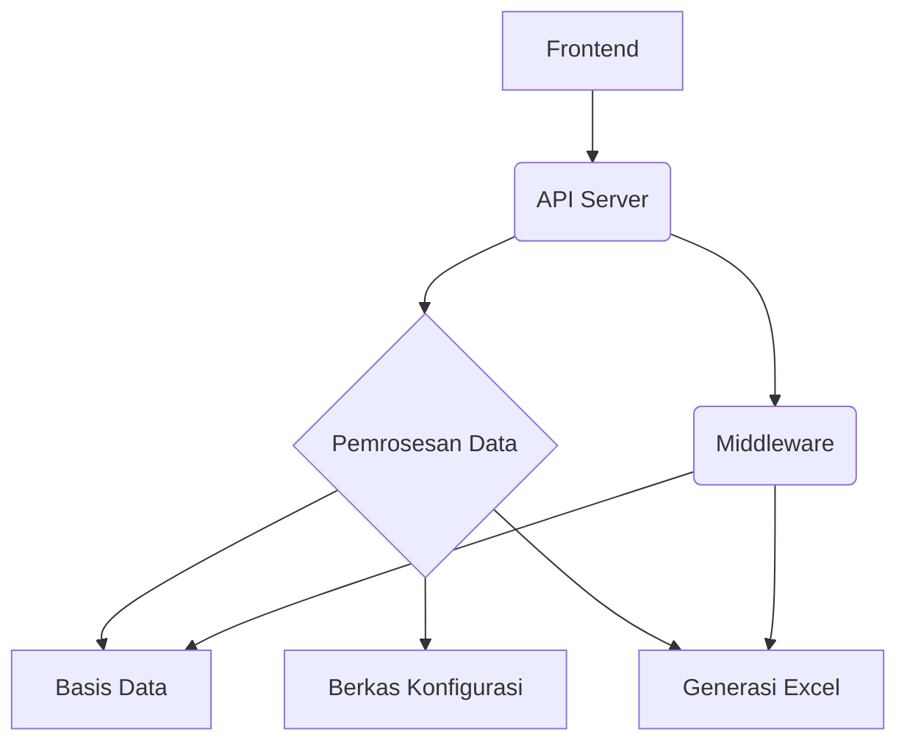

Sumber: [README.md:67-73](), [desa_db/server.py]()

### Antarmuka Frontend

Frontend menyediakan pengguna dengan antarmuka untuk berinteraksi dengan sistem. Ini mencakup halaman masuk (login), unggah data, tampilan dasbor (dashboard), dan potensi fungsionalitas spesifik pengguna lainnya.

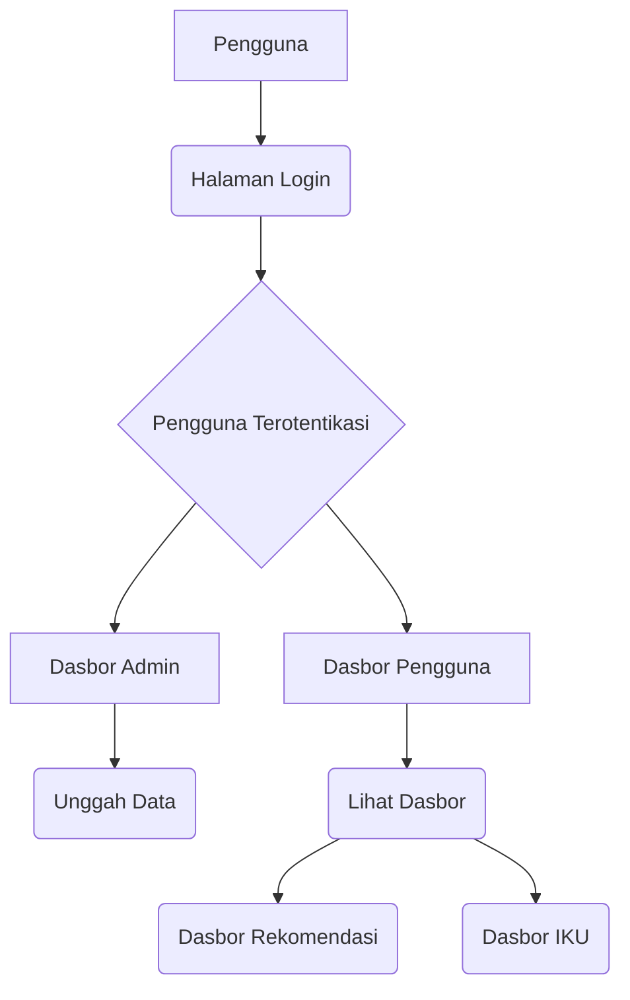

Sumber: [front_end/templates/login.html](), [front_end/templates/admin.html](), [front_end/templates/user.html]()

### Manajemen Konfigurasi

Sistem bergantung pada berbagai berkas konfigurasi untuk mendefinisikan perilakunya, struktur data, dan pemetaan. Berkas-berkas ini biasanya terletak di dalam direktori `.config/`.

Sumber: [README.md:1-11]()

## Komponen Inti dan Fungsionalitas

### Integrasi dan Pemrosesan Data

Proyek ini mencakup integrasi data dari berbagai sumber, yang bertujuan untuk keperluan penilaian (scoring) dan rekomendasi. Proses ini meliputi penanganan berbagai format data serta memastikan integritas data.

Skrip `desa_db/server.py` bertugas mengorkestrasi layanan backend, termasuk pemuatan dan pemrosesan data. Skrip `desa_db/middleware.py` tampaknya menangani pembuatan laporan Excel berdasarkan data yang telah diproses dan konfigurasi yang ada.

Sumber: [desa_db/server.py]()

#### Skema dan Manajemen Basis Data

Sistem ini mengelola sebuah basis data, yang diperkirakan digunakan untuk menyimpan data desa dan informasi terkait. Skrip `desa_db/server.py` memuat logika untuk membuat dan mengelola tabel basis data, termasuk tabel `master_data` dan tabel riwayat.

```sql
CREATE TABLE IF NOT EXISTS master_data (
    valid_from TIMESTAMP,
    valid_to TIMESTAMP,
    commit_id VARCHAR,
    source_file VARCHAR,
    "Col1" VARCHAR, -- Definisi kolom contoh
    "Col2" TINYINT   -- Definisi kolom contoh
)
```

Tabel `master_data` menyimpan salinan data terbaru. Kolom-kolom dalam tabel ini didefinisikan berdasarkan header dari berkas konfigurasi. Tabel ini juga menyertakan metadata seperti `valid_from`, `valid_to`, `commit_id`, dan `source_file`. Sebuah indeks dibuat pada `ID_COL` untuk meningkatkan kinerja.

Sumber: [desa_db/server.py:117-135]()

### Pembuatan Laporan Excel

Salah satu fitur utama adalah pembuatan laporan Excel, yang terdiri dari beberapa lembar (sheet) untuk menampilkan berbagai pandangan data. Skrip `desa_db/middleware.py` merinci proses pembuatan laporan ini.

Sistem menghasilkan tiga lembar utama:
1.  **Data Grid**: Kemungkinan merupakan ekspor data mentah.
2.  **Dashboard Rekomendasi**: Sebuah dasbor yang merangkum skor dan rekomendasi.
3.  **Dashboard IKU**: Sebuah dasbor yang berfokus pada skor Indikator Kinerja Utama (IKU).

Proses pembuatan laporan melibatkan pendefinisian gaya (styles), penggabungan sel (merging cells), pengaturan lebar kolom, dan penerapan format agar mudah dibaca.

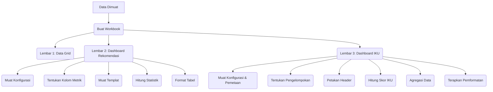

Sumber: [desa_db/middleware.py:25-150]()

#### Detail Dashboard Rekomendasi

Lembar dasbor ini menampilkan data agregat, termasuk penggabungan header yang tepat untuk grup "SKOR" dan "PELAKSANA", lebar kolom yang dioptimalkan, serta penggunaan `rowspan` untuk data hierarkis.

Sumber: [desa_db/middleware.py:65-150]()

#### Detail Dashboard IKU

Lembar ini berfokus pada skor Indikator Kinerja Utama (IKU). Lembar ini secara dinamis memetakan header CSV ke kolom induk dan sub-kolom (status, rata-rata, total, pencapaian) berdasarkan tingkat pengelompokan yang dipilih (Provinsi, Kabupaten, Kecamatan, Desa). Lembar ini menghitung skor IKU, mengagregasi data, dan menerapkan pemformatan termasuk peta panas (heatmaps) dan format angka.

Sumber: [desa_db/middleware.py:152-235](), [desa_db/server.py:236-355]()

### Berkas Konfigurasi dan Struktur

Proyek ini menggunakan beberapa berkas konfigurasi untuk mendefinisikan perilaku sistem dan pemetaan data.

| Nama Berkas                 | Deskripsi                                                              | Lokasi    |
| :-------------------------- | :--------------------------------------------------------------------- | :-------- |
| `auth_users.json`           | Menyimpan detail otentikasi pengguna.                                  | `.config/`|
| `headers.json`              | Memetakan nama kolom standar ke aliasnya.                              | `.config/`|
| `intervensi_kegiatan.json`  | Berisi templat untuk intervensi dan kegiatan.                          | `.config/`|
| `rekomendasi.json`          | Mendefinisikan logika rekomendasi berdasarkan skor.                    | `.config/`|
| `table_structure.csv`       | Mendefinisikan struktur untuk tabel "Dashboard Rekomendasi".           | `.config/`|
| `table_structure_IKU.csv`   | Mendefinisikan struktur untuk tabel "Dashboard IKU".                   | `.config/`|
| `iku_mapping.json`          | Memetakan metrik induk IKU ke kolom skor yang sesuai.                  | `.config/`|

Sumber: [README.md:1-11](), [tests/server_test.py:16-35]()

### Konfigurasi Gaya dan Frontend

Penataan gaya frontend dikelola menggunakan Tailwind CSS. Berkas `tailwind.config.js` mendefinisikan konfigurasi untuk kompilasi CSS.

```javascript
/** @type {import('tailwindcss').Config} */
module.exports = {
  darkMode: 'class',
  // Gunakan **/*.html untuk memindai semua folder dalam proyek untuk file HTML
  content: ["./**/*.html", "./static/**/*.js"],
  theme: {
    extend: {},
  },
  plugins: [],
}
```

Berkas `output.css` berisi CSS yang telah dikompilasi, termasuk kelas utilitas untuk tata letak, tipografi, dan warna.

Sumber: [front_end/tailwind.config.js]()

## Penerapan dan Pengembangan

### Penerapan Docker

Docker dan Docker Compose direkomendasikan untuk penerapan aplikasi. Perintah `docker compose up -d --build` memulai proses pembangunan dan penerapan.

Sumber: [README.md:67-73]()


### Pengujian

Pengujian unit untuk komponen server dapat dijalankan menggunakan `pytest`. Berkas `tests/server_test.py` berisi *fixture* dan kasus uji untuk fungsionalitas server.

Sumber: [README.md:75-77](), [tests/server_test.py]()

## Elemen Antarmuka Pengguna

### Halaman Masuk (Login)

Halaman masuk (`login.html`) menampilkan font kustom, latar belakang bertekstur, dan kotak masuk yang khas dengan efek bayangan.

Sumber: [front_end/templates/login.html]()

### Dasbor Admin

Dasbor admin (`admin.html`) mencakup fungsionalitas seperti unggah data, yang ditunjukkan dengan ikon dan teks.

Sumber: [front_end/templates/admin.html]()

### Dasbor Pengguna

Dasbor pengguna (`user.html`) menyediakan akses ke tampilan yang berbeda, termasuk "Dashboard IKU", yang divisualisasikan dengan ikon.

Sumber: [front_end/templates/user.html]()

---

<a id='page-system-requirements'></a>

## Persyaratan Sistem

### Halaman Terkait

Topik terkait: [Pendahuluan Proyek](#page-project-introduction), [Penerapan Docker](#page-docker-deployment)

<details>
<summary>Berkas sumber yang relevan</summary>

- [README.md](https://github.com/anbe-on/integrasi_data_skor_rekomendasi_desa/blob/main/README.md)
- [.config/requirements.txt](https://github.com/anbe-on/integrasi_data_skor_rekomendasi_desa/blob/main/.config/requirements.txt)
- [desa_db/middleware.py](https://github.com/anbe-on/integrasi_data_skor_rekomendasi_desa/blob/main/desa_db/middleware.py)
- [desa_db/server.py](https://github.com/anbe-on/integrasi_data_skor_rekomendasi_desa/blob/main/desa_db/server.py)
- [front_end/tailwind.config.js](https://github.com/anbe-on/integrasi_data_skor_rekomendasi_desa/blob/main/front_end/tailwind.config.js)
- [front_end/templates/login.html](https://github.com/anbe-on/integrasi_data_skor_rekomendasi_desa/blob/main/front_end/templates/login.html)
- [tests/server_test.py](https://github.com/anbe-on/integrasi_data_skor_rekomendasi_desa/blob/main/tests/server_test.py)
</details>

# Persyaratan Sistem

Dokumen ini menguraikan persyaratan sistem untuk proyek "integrasi_data_skor_rekomendasi_desa", yang mencakup dependensi perangkat lunak, lingkungan runtime, dan pengaturan eksekusi. Sistem ini mengintegrasikan proses penilaian data dan rekomendasi untuk desa, menyediakan fungsionalitas dasbor dan pelaporan. Komponen utama meliputi API backend, antarmuka frontend, dan logika pemrosesan data. Untuk informasi lebih lanjut mengenai modul spesifik, rujuk ke [Dokumentasi API Backend](#) dan [Panduan Antarmuka Frontend](#).

## Ketergantungan Perangkat Lunak

Proyek ini memerlukan sekumpulan paket Python spesifik agar berfungsi dengan benar. Paket-paket ini dikelola melalui berkas `requirements.txt`.

### Versi Python

Sistem ini dikembangkan dan diuji menggunakan Python versi 3.11.9.
Sumber: [README.md:14]()

### Paket Inti Python

Paket-paket berikut tercantum dalam berkas `.config/requirements.txt` dan merupakan komponen esensial untuk fungsionalitas *backend* dan pemrosesan data proyek ini.

| Nama Paket              | Penentu Versi     | Deskripsi                                                              |
| :---------------------- | :---------------- | :--------------------------------------------------------------------- |
| fastapi                 | >=0.111.0         | Kerangka kerja web asinkron untuk membangun API.                       |
| uvicorn                 | >=0.27.0.post1    | Server ASGI untuk menjalankan aplikasi FastAPI.                          |
| pandas                  | >=2.2.1           | Pustaka untuk manipulasi dan analisis data.                            |
| numpy                   | >=1.26.4          | Pustaka untuk komputasi numerik.                                       |
| openpyxl                | >=3.1.10          | Pustaka untuk membaca dan menulis berkas Excel format .xlsx.          |
| python-dotenv           | >=1.0.1           | Untuk memuat variabel lingkungan dari berkas .env.                     |
| python-multipart        | >=0.0.9           | Untuk menangani data formulir, termasuk unggahan berkas.               |
| psycopg2-binary         | >=2.9.9           | Adaptor PostgreSQL untuk Python.                                       |
| SQLAlchemy              | >=2.0.29          | Perangkat SQL dan Pemeta Relasional Objek (*Object Relational Mapper*). |
| requests                | >=2.31.0          | Pustaka HTTP untuk melakukan permintaan.                               |
| pytest                  | >=7.4.4           | Kerangka kerja pengujian untuk Python.                                 |
| pytest-mock             | >=3.12.0          | *Fixture* untuk melakukan *mocking* dalam pytest.                      |
| python-jose[cryptography] | >=3.3.0       | Penanganan JSON Web Token.                                             |
| passlib[bcrypt]         | >=1.7.4           | Pustaka untuk *hashing* kata sandi.                                    |
| Pillow                  | >=10.2.0          | Pustaka Pencitraan Python (*Python Imaging Library*).                  |
| python-decouple         | >=3.4             | Membantu aplikasi membaca pengaturan dari berbagai sumber.             |
| pandas-stubs            | ^2.2.0.20240316   | *Stubs* tipe untuk pandas.                                             |
| polars                  | ^0.20.16          | Pustaka *DataFrame* berkinerja tinggi.                                 |
| httpx                   | >=0.27.0          | Klien HTTP untuk Python.                                               |
Sumber: [.config/requirements.txt]()

## Lingkungan Runtime

Sistem ini memiliki persyaratan spesifik untuk lingkungan eksekusinya, mencakup pertimbangan sistem operasi dan rekomendasi perangkat keras.

### Versi Sistem Operasi

Docker diperlukan untuk menjalankan aplikasi. Pada sistem operasi Windows, WSL (*Windows Subsystem for Linux*) direkomendasikan untuk menjalankan Docker.
Sumber: [README.md:17](), [README.md:69]()

### Rekomendasi Perangkat Keras

CPU yang mendukung AVX2 direkomendasikan. Jenis CPU ini umumnya mencakup prosesor Intel generasi ke-4 dan prosesor AMD Ryzen.
Sumber: [README.md:15]()

## Konfigurasi

Proyek ini memanfaatkan direktori konfigurasi (`.config/`) dan variabel lingkungan untuk pengelolaan pengaturan.

### Direktori Berkas Konfigurasi

Semua berkas konfigurasi berlokasi di dalam direktori `.config/`.
Sumber: [README.md:1-2]()

### Berkas Konfigurasi Kunci

*   `auth_users.json`: Menyimpan detail otentikasi pengguna.
*   `headers.json`: Mendefinisikan pemetaan untuk *header* data.
*   `intervensi_kegiatan.json`: Berisi templat untuk aktivitas intervensi.
*   `rekomendasi.json`: Menyimpan logika dan pemetaan rekomendasi.
*   `table_structure.csv`: Mendefinisikan struktur untuk tabel data.
*   `table_structure_IKU.csv`: Mendefinisikan struktur untuk tabel IKU (*Indikator Kinerja Utama*).
*   `iku_mapping.json`: Memetakan metrik IKU.
Sumber: [README.md:5-10](), [tests/server_test.py:15-37]()

### Variabel Lingkungan

Berkas `.env` digunakan untuk menyimpan pengaturan yang bersifat sensitif atau spesifik lingkungan.

*   `APP_SECRET_KEY`: Kunci rahasia untuk aplikasi, yang dapat dihasilkan menggunakan perintah `openssl rand -hex 32`.

Sumber: [README.md:26-37]()

## Instalasi dan Penyiapan

Proyek ini di-*deploy* menggunakan Docker. Pastikan Docker dan Docker Compose telah terinstal sebelum melanjutkan.

### Instalasi dan Menjalankan Docker

1.  **Instal Docker dan Docker Compose:** Pastikan kedua perangkat lunak ini terinstal pada sistem Anda.
2.  **Bangun dan Jalankan:** Eksekusi perintah `docker compose up -d --build` pada direktori akar proyek.
    *   Sistem akan berupaya menyiapkan berkas Excel dari basis data saat startup.

Sumber: [README.md:67-73]()

## Menjalankan Sistem

Sistem dijalankan sepenuhnya melalui Docker Compose.

### Menjalankan dengan Docker Compose

Eksekusi perintah `docker compose up -d --build` dari direktori akar proyek.
Sumber: [README.md:71]()

## Penyiapan Pengembangan Frontend

Apabila `output.css` belum ada, kompilasi Tailwind CSS sebelum membangun citra Docker.

### Kompilasi Tailwind CSS

1.  **Navigasi ke Direktori Frontend:** `cd front_end/`
2.  **Instal Dependensi:** `npm install -D tailwindcss@3 postcss autoprefixer`
3.  **Inisialisasi Tailwind CSS:** `npx tailwindcss init`
4.  **Konfigurasi `tailwind.config.js`:** Perbarui berkas dengan jalur pemindaian konten dan ekstensi tema.
    ```javascript
    /** @type {import('tailwindcss').Config} */
    module.exports = {
      darkMode: 'class',
      // Use **/*.html to scan all folders in the project for HTML files
      content: ["./**/*.html", "./static/**/*.js"],
      theme: {
        extend: {},
      },
      plugins: [],
    }
    ```
    Sumber: [front_end/tailwind.config.js]()
5.  **Kompilasi CSS:** `npx tailwindcss -i ./static/css/input.css -o ./static/css/output.css --watch`

Sumber: [README.md:39-66]()

## Pengujian

Pengujian unit untuk komponen server tersedia dan dapat dieksekusi menggunakan pytest.

### Menjalankan Pengujian

Eksekusi perintah berikut di direktori akar proyek:
`pytest tests/server_test.py`
Sumber: [README.md:77]()

## Tinjauan Arsitektur Sistem

Sistem terdiri dari API backend yang dibangun dengan FastAPI, antarmuka frontend, dan modul pemrosesan data.

### API Backend (`desa_db/server.py`)

Backend berfungsi sebagai lapisan API utama, menangani permintaan untuk pengambilan data, pemrosesan, dan pembuatan dasbor. Backend memanfaatkan pustaka seperti FastAPI, Uvicorn, Pandas, dan SQLAlchemy. Backend berinteraksi dengan basis data serta mengorkestrasi transformasi data dan pembuatan laporan.

Sumber: [desa_db/server.py]()

### Pemrosesan Data dan Middleware (`desa_db/middleware.py`)

Modul ini berisi logika inti untuk manipulasi data, pembuatan laporan Excel, perhitungan statistik dasbor, dan perenderan dasbor IKU (Indikator Kinerja Utama). Modul ini membaca berkas konfigurasi, memproses dataframe, dan memformat keluaran untuk berbagai lembar dalam buku kerja Excel.

Sumber: [desa_db/middleware.py]()

### Frontend (`front_end/`)

Frontend menyediakan antarmuka pengguna untuk berinteraksi dengan sistem. Frontend mencakup templat HTML dan ditata menggunakan Tailwind CSS. Templat `login.html` mendemonstrasikan struktur antarmuka pengguna dan pendekatan penataan gaya.

Sumber: [front_end/templates/login.html](), [front_end/tailwind.config.js]()

### Contoh Alur Kerja: Pembuatan Dasbor

Pembuatan data dasbor melibatkan beberapa langkah yang diorkestrasi oleh middleware dan backend.

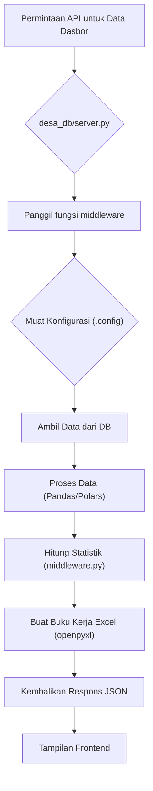
Sumber: [desa_db/server.py:123-131](), [desa_db/middleware.py:136-146](), [desa_db/middleware.py:350-353]()

### Contoh Alur Kerja: Otentikasi Pengguna

Otentikasi pengguna ditangani, dengan pengguna tiruan disediakan untuk tujuan pengujian.

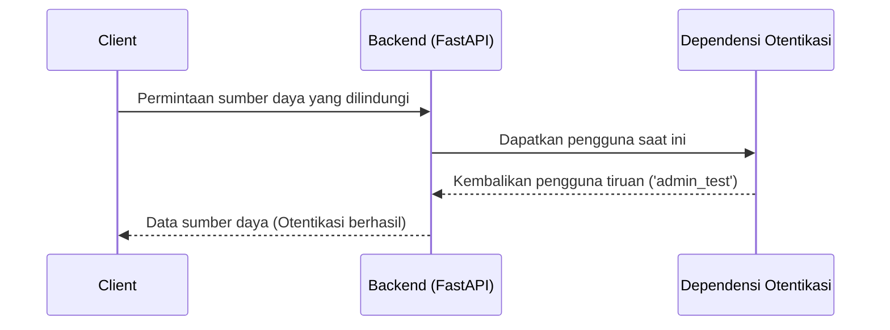
Sumber: [tests/server_test.py:40-43]()

## Penyiapan Pengembangan dan Pengujian

Proyek ini mencakup utilitas dan konfigurasi untuk pengembangan dan pengujian.

### Penyiapan Data Tiruan dan Konfigurasi

Fixture `tests/server_test.py` mendemonstrasikan cara membuat berkas konfigurasi tiruan (`headers.json`, `table_structure.csv`, `table_structure_IKU.csv`, `iku_mapping.json`, `rekomendasi.json`) yang diperlukan untuk menguji logika backend.

Sumber: [tests/server_test.py:15-37]()

### Eksekusi Pengujian

Kerangka kerja `pytest` digunakan untuk menjalankan pengujian, dengan perintah spesifik yang disediakan untuk mengeksekusi pengujian server.

Sumber: [README.md:77]()

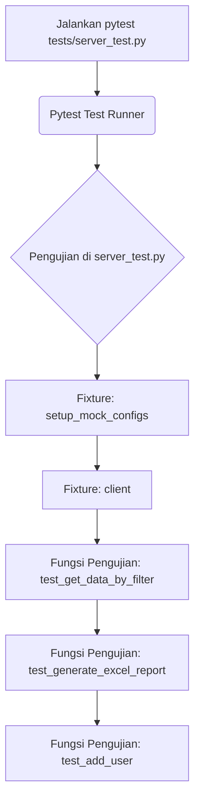
Sumber: [tests/server_test.py]()

## Penataan Tampilan Antarmuka (Frontend Styling)

Tailwind CSS digunakan untuk menata komponen antarmuka pengguna (frontend). Berkas konfigurasi `front_end/tailwind.config.js` mendefinisikan kelas utilitas proyek dan jalur pemindaian.

Sumber: [front_end/tailwind.config.js]()

### Contoh Penataan Halaman Masuk (Login Page Styling)

Berkas `front_end/templates/login.html` memperlihatkan penerapan Tailwind CSS untuk menciptakan antarmuka masuk yang khas secara visual dengan pola latar belakang kustom dan bayangan kotak (box shadows).

Sumber: [front_end/templates/login.html]()

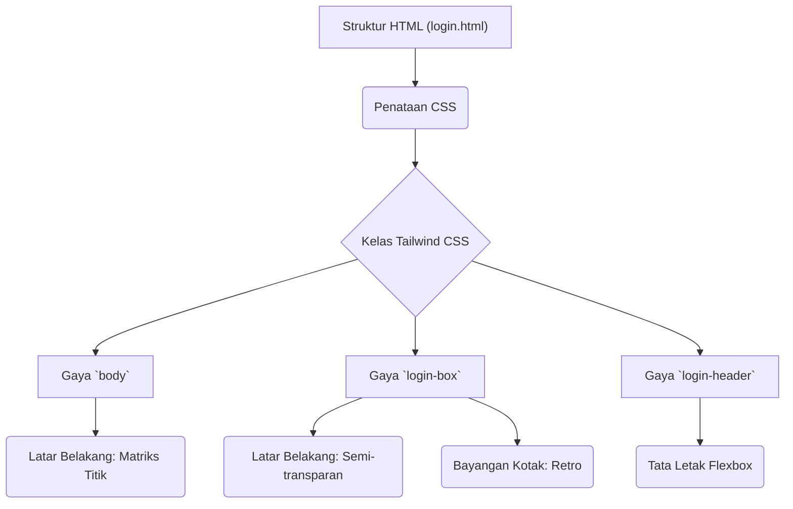
Sumber: [front_end/templates/login.html]()

Ringkasan ini mencakup persyaratan sistem esensial, termasuk dependensi perangkat lunak, lingkungan eksekusi, konfigurasi, instalasi, eksekusi, dan penataan tampilan antarmuka, sebagaimana disarikan dari berkas sumber yang disediakan.

---

<a id='page-architecture-overview'></a>

## Tinjauan Arsitektur (Architecture Overview)

### Halaman Terkait

Topik terkait: [Diagram Alur Data](#page-data-flow), [Hubungan Komponen](#page-component-relationships)

<details>
<summary>Berkas sumber yang relevan</summary>

- [docker-compose.yml](https://github.com/anbe-on/integrasi_data_skor_rekomendasi_desa/blob/main/docker-compose.yml)
- [nginx.conf](https://github.com/anbe-on/integrasi_data_skor_rekomendasi_desa/blob/main/nginx.conf)
- [desa_db/server.py](https://github.com/anbe-on/integrasi_data_skor_rekomendasi_desa/blob/main/desa_db/server.py)
- [front_end/router.py](https://github.com/anbe-on/integrasi_data_skor_rekomendasi_desa/blob/main/front_end/router.py)
- [desa_db/middleware.py](https://github.com/anbe-on/integrasi_data_skor_rekomendasi_desa/blob/main/desa_db/middleware.py)
- [front_end/tailwind.config.js](https://github.com/anbe-on/integrasi_data_skor_rekomendasi_desa/blob/main/front_end/tailwind.config.js)
- [front_end/static/css/output.css](https://github.com/anbe-on/integrasi_data_skor_rekomendasi_desa/blob/main/front_end/static/css/output.css)

</details>

# Tinjauan Arsitektur (Architecture Overview)

Dokumen ini menguraikan tinjauan arsitektur proyek "integrasi_data_skor_rekomendasi_desa". Dokumen ini merinci struktur sistem, penerapan (deployment), dan komponen inti, yang menyediakan pemahaman fundamental bagi pengembang dan administrator sistem. Sistem dirancang sebagai layanan API backend dan aplikasi web antarmuka (frontend), yang diorkestrasi menggunakan Docker Compose untuk kemudahan penerapan dan pengelolaan.

Arsitektur memprioritaskan modularitas, dengan layanan yang terpisah untuk API backend, antarmuka, dan infrastruktur pendukung seperti Nginx serta pencadangan basis data. Pemisahan ini memungkinkan penskalaan dan pemeliharaan independen dari berbagai bagian sistem.

## Penerapan dan Orkestrasi Sistem (System Deployment and Orchestration)

Sistem diterapkan menggunakan Docker Compose, yang mendefinisikan dan mengelola siklus hidup beberapa layanan. Pendekatan ini menyederhanakan penyiapan dan memastikan lingkungan yang konsisten di berbagai target penerapan.

### Layanan Docker Compose (Docker Compose Services)

Berkas `docker-compose.yml` mendefinisikan layanan utama berikut:

*   **`backup_id_srd_iku`**: Layanan pencadangan terjadwal yang menjalankan skrip pencadangan setiap hari. Layanan ini memasang (mount) volume untuk akses basis data dan penyimpanan cadangan.
    Sumber: [docker-compose.yml:3-8]()
*   **`backend_id_srd_iku`**: Layanan API backend utama, dibangun dari direktori akar proyek. Layanan ini mengekspos API pada port 8000 dan mengelola konfigurasi, basis data, berkas sementara, ekspor, dan aset antarmuka.
    Sumber: [docker-compose.yml:10-18]()
*   **`frontend_id_srd_iku`**: Layanan aplikasi antarmuka, juga dibangun dari direktori akar. Layanan ini berkomunikasi dengan API backend menggunakan URL jaringan internal Docker dan mengelola aset antarmuka. Layanan ini bergantung pada layanan backend.
    Sumber: [docker-compose.yml:20-28]()
*   **`nginx_id_srd_iku`**: Layanan *reverse proxy* Nginx yang mendengarkan pada port 8080 dan meneruskan lalu lintas ke aplikasi backend dan antarmuka. Layanan ini menyajikan aset statis dan ekspor yang telah dirender sebelumnya. Layanan ini bergantung pada layanan backend dan antarmuka.
    Sumber: [docker-compose.yml:30-36]()

### Interkoneksi Layanan (Service Interconnections)

Layanan berkomunikasi melalui jaringan internal Docker. Antarmuka dikonfigurasi untuk menggunakan `http://backend_id_srd_iku:8000` untuk panggilan API. Nginx bertindak sebagai titik masuk eksternal, mengarahkan lalu lintas ke layanan internal yang sesuai.

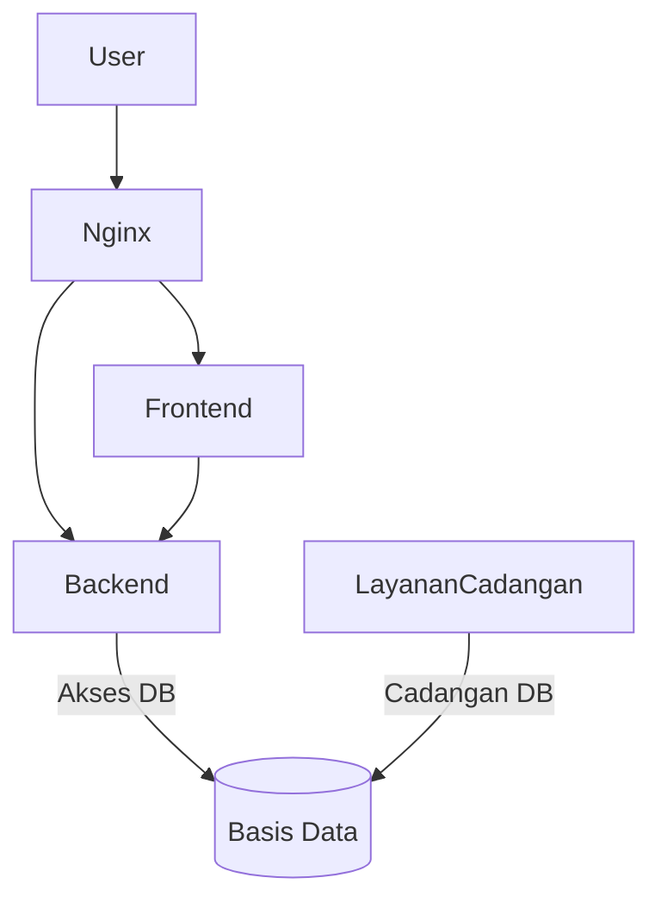

Sumber: [docker-compose.yml]()

## Layanan Backend (`desa_db/server.py`)

Layanan backend ini dibangun menggunakan FastAPI dan bertanggung jawab atas logika aplikasi inti, _endpoint_ API, serta pemrosesan data.

### Fungsionalitas Inti

*   **_Endpoint_ API**: Menyediakan _endpoint_ API bergaya RESTful untuk keperluan otentikasi pengguna (login), pengambilan data, dan pembuatan laporan.
*   **Otentikasi**: Mengimplementasikan mekanisme otentikasi berbasis JSON Web Token (JWT) dengan token sesi yang disimpan dalam _cookie_ HttpOnly.
    Sumber: [desa_db/server.py:111-134]()
*   **Pemrosesan Data**: Mencakup fungsi _middleware_ yang didedikasikan untuk integrasi data, perhitungan skor, dan pembuatan laporan dalam format Excel.
    Sumber: [desa_db/server.py:15-27]()
*   **Penanganan Berkas**: Mengelola unggahan berkas sementara dan menghasilkan laporan dalam format Excel.
    Sumber: [desa_db/server.py:36-53]()
*   **Konfigurasi**: Membaca pengaturan konfigurasi dari direktori `.config`, yang meliputi otentikasi pengguna dan struktur tabel.
    Sumber: [desa_db/server.py:55-69]()

### Komponen dan Modul Kunci

*   **`auth_get_current_user`**: Sebuah dependensi yang digunakan untuk otentikasi pengguna.
    Sumber: [desa_db/server.py:111]()
*   **`helpers_generate_excel_workbook`**: Fungsi yang bertugas membuat objek _workbook_ Excel.
    Sumber: [desa_db/server.py:17]()
*   **`helpers_background_task_generate_pre_render_excel`**: Digunakan untuk proses pembuatan laporan Excel secara asinkron.
    Sumber: [desa_db/server.py:18]()
*   **`CONFIG_DIR`**: Variabel yang menyimpan jalur (path) menuju direktori konfigurasi.
    Sumber: [desa_db/server.py:22]()
*   **`TEMP_FOLDER`**: Direktori yang dialokasikan untuk penyimpanan berkas sementara.
    Sumber: [desa_db/server.py:38]()

### Tinjauan _Endpoint_ API

Layanan backend mengekspos beberapa _endpoint_ API, antara lain:

| _Endpoint_           | Metode | Deskripsi                                                              |
| :------------------- | :----- | :--------------------------------------------------------------------- |
| `/api/login`         | POST   | Melakukan otentikasi pengguna dan menetapkan token sesi.               |
| `/api/data/preview`  | POST   | Menghasilkan pratinjau (preview) dari data yang telah diproses.        |
| `/api/data/export`   | POST   | Memulai proses pembuatan laporan dalam format Excel.                   |
| `/api/data/download` | GET    | Mengunduh laporan Excel yang telah selesai dibuat.                     |
| `/api/data/status`   | GET    | Memeriksa status terkini dari proses pembuatan laporan.                |
| `/api/data/progress` | GET    | Mengambil informasi mengenai progres dari proses pembuatan laporan.     |

Sumber: [desa_db/server.py]()

## Layanan Frontend (`front_end/router.py`)

Layanan frontend bertanggung jawab atas antarmuka pengguna (UI) dan interaksi di sisi klien. Kemungkinan besar layanan ini dibangun menggunakan kerangka kerja web yang mendukung _Server-Side Rendering_ (SSR), sebagaimana diindikasikan oleh keberadaan berkas `router.py` dan perannya dalam menyajikan konten HTML.

### Tanggung Jawab Utama

*   **Perenderan Antarmuka Pengguna**: Menyajikan halaman HTML untuk interaksi pengguna, mencakup halaman login, dasbor (dashboard), dan tampilan data.
    Sumber: [front_end/router.py]()
*   **Interaksi API**: Melakukan permintaan ke API backend untuk mengambil data, mengirimkan formulir, dan memicu berbagai aksi.
    Sumber: [front_end/router.py:23]()
*   **Penyajian Aset Statis**: Menyajikan berkas statis seperti CSS dan JavaScript, yang pengelolaannya dilakukan oleh Nginx.
    Sumber: [front_end/router.py:23]()

### Perutean (_Routing_) dan Tampilan (_Views_)

Berkas `front_end/router.py` mendefinisikan rute-rute yang memetakan jalur URL ke templat HTML spesifik atau fungsi perenderan tertentu.

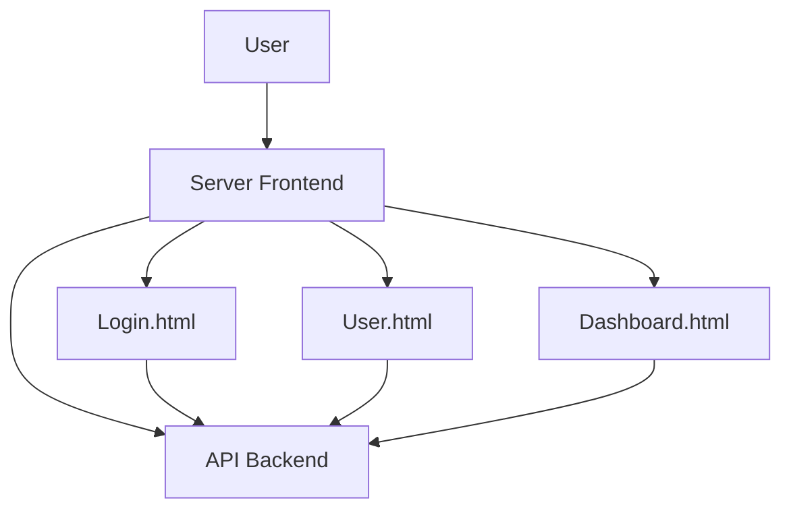

Sumber: [front_end/router.py]()

## Reverse Proxy dan Manajemen Aset Statis (Nginx)

Nginx berfungsi sebagai titik masuk utama untuk lalu lintas eksternal, menangani terminasi SSL (jika dikonfigurasi), penyeimbangan beban (load balancing), dan penyajian aset statis secara efisien.

### Konfigurasi Nginx

Berkas `nginx.conf` mengonfigurasi Nginx untuk:

*   Mendengarkan permintaan HTTP masuk pada port 8080.
*   Menyajikan berkas statis dari direktori spesifik (`/app/exports`, `/app/front_end/static`).
*   Meneruskan permintaan API ke layanan backend (`http://backend_id_srd_iku:8000`).
*   Meneruskan permintaan untuk aplikasi frontend ke layanan frontend (`http://frontend_id_srd_iku:3000` atau yang serupa).

```nginx
# Representasi yang disederhanakan dari nginx.conf
events {}
http {
    server {
        listen 80; # Nginx di dalam kontainer mendengarkan pada port 80, yang dipetakan ke 8080 oleh docker-compose

        location / {
            proxy_pass http://frontend_id_srd_iku:3000; # Contoh port untuk frontend
            proxy_set_header Host $host;
            proxy_set_header X-Real-IP $remote_addr;
            proxy_set_header X-Forwarded-For $proxy_add_x_forwarded_for;
            proxy_set_header X-Forwarded-Proto $scheme;
        }

        location /api/ {
            proxy_pass http://backend_id_srd_iku:8000;
            proxy_set_header Host $host;
            proxy_set_header X-Real-IP $remote_addr;
            proxy_set_header X-Forwarded-For $proxy_add_x_forwarded_for;
            proxy_set_header X-Forwarded-Proto $scheme;
        }

        location /exports/ {
            alias /app/exports/;
            expires 30d;
        }

        location /static/ {
            alias /app/front_end/static/;
            expires 30d;
        }
    }
}
```

Sumber: [nginx.conf]()

## Manajemen Konfigurasi

Sistem mengandalkan direktori `.config` untuk berbagai berkas konfigurasi, memastikan bahwa informasi sensitif dan pengaturan aplikasi dikelola secara terpisah dari kode.

### Berkas Konfigurasi

*   **`auth_users.json`**: Menyimpan kredensial pengguna dan peran mereka.
    Sumber: [docker-compose.yml:15]()
*   **`headers.json`**: Mendefinisikan header standar dan aliasnya untuk pemrosesan data.
    Sumber: [tests/server_test.py:15]()
*   **`intervensi_kegiatan.json`**: Berisi logika untuk aktivitas intervensi.
    Sumber: [desa_db/middleware.py:16]()
*   **`rekomendasi.json`**: Berisi logika untuk menghasilkan rekomendasi berdasarkan skor.
    Sumber: [tests/server_test.py:41]()
*   **`table_structure.csv`**: Mendefinisikan struktur untuk tabel data Rekomendasi ID.
    Sumber: [desa_db/middleware.py:13](), [tests/server_test.py:21]()
*   **`table_structure_IKU.csv`**: Mendefinisikan struktur untuk tabel data IKU (Indikator Kinerja Utama).
    Sumber: [desa_db/middleware.py:132](), [tests/server_test.py:27]()
*   **`iku_mapping.json`**: Berisi logika untuk tabel IKU.
    Sumber: [desa_db/middleware.py:137](), [tests/server_test.py:34]()

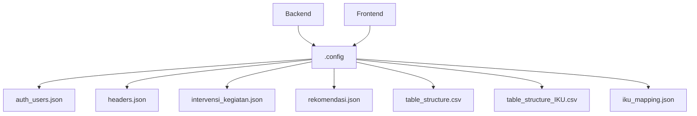

Sumber: [docker-compose.yml:15](), [desa_db/server.py:59](), [desa_db/middleware.py:13](), [desa_db/middleware.py:132](), [desa_db/middleware.py:137](), [tests/server_test.py:15](), [tests/server_test.py:21](), [tests/server_test.py:27](), [tests/server_test.py:34](), [tests/server_test.py:41]()

## Alur Data dan Pemrosesan

Sistem memproses data melalui serangkaian langkah, mulai dari pemuatan dan validasi data awal hingga perhitungan skor, pembuatan rekomendasi, dan akhirnya, ekspor laporan.

### Pemuatan dan Persiapan Data

Data dimuat dari berbagai sumber dan dipersiapkan untuk analisis. Ini mencakup:

1.  **Interaksi Basis Data**: Komponen backend berinteraksi dengan basis data (tidak dirinci secara eksplisit dalam berkas-berkas ini namun tersirat dari `helpers_get_db_connection` dan `con.execute`).
    Sumber: [desa_db/middleware.py:10]()
2.  **Pemuatan Konfigurasi**: Membaca `table_structure.csv`, `headers.json`, dan berkas konfigurasi lainnya untuk memahami skema dan pemetaan data.
    Sumber: [desa_db/middleware.py:13-30](), [desa_db/middleware.py:132-141]()
3.  **Pemetaan Header**: Alias dipetakan ke header standar menggunakan `headers.json`.
    Sumber: [desa_db/middleware.py:31-40]()

### Perhitungan Skor dan Rekomendasi

Logika inti untuk menghitung skor dan menghasilkan rekomendasi berada di layanan middleware dan backend.

1.  **Statistik Dasbor**: `helpers_calculate_dashboard_stats` menghitung rata-rata, jumlah, dan ringkasan naratif.
    Sumber: [desa_db/middleware.py:44]()
2.  **Perhitungan Skor IKU**: Pembuatan lembar "Dasbor IKU" melibatkan pemuatan `table_structure_IKU.csv` dan `iku_mapping.json` untuk menghitung skor IKU berdasarkan kolom anak yang dipetakan dan mengagregasikannya berdasarkan tingkat pengelompokan.
    Sumber: [desa_db/middleware.py:130-230]()
3.  **Logika Rekomendasi**: `rekomendasi.json` digunakan untuk memetakan skor ke rekomendasi tekstual.
    Sumber: [tests/server_test.py:41-45]()

### Pembuatan Laporan

Sistem dapat menghasilkan laporan Excel untuk visualisasi data dan pengunduhan.

1.  **Pembuatan Buku Kerja**: `helpers_generate_excel_workbook` membuat struktur berkas Excel.
    Sumber: [desa_db/server.py:20]()
2.  **Pembuatan Asinkron**: `helpers_background_task_generate_pre_render_excel` menangani pembuatan di latar belakang.
    Sumber: [desa_db/server.py:21]()
3.  **Ekspor dan Unduh**: *Endpoints* API mengelola proses ekspor dan pengunduhan laporan yang dihasilkan ini.
    Sumber: [desa_db/server.py:166-182]()

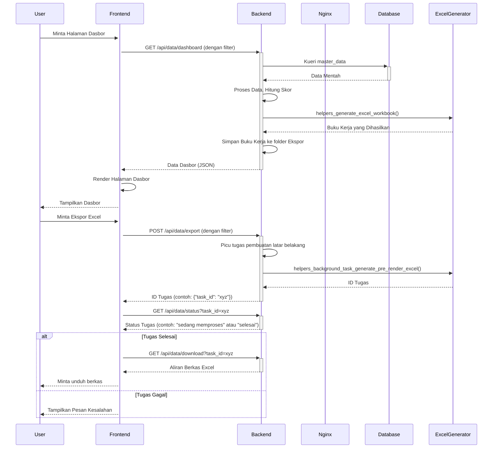

Sumber: [desa_db/server.py](), [front_end/router.py](), [docker-compose.yml]()

## Gaya dan Tema Frontend

Frontend menggunakan Tailwind CSS untuk penataan gaya, memungkinkan pengembangan UI yang cepat dan tema yang konsisten.

### Konfigurasi Tailwind CSS

Berkas `tailwind.config.js` mengonfigurasi Tailwind CSS, mendefinisikan perilakunya dan cara memindai berkas HTML untuk menghasilkan gaya.

*   **Pemindaian Konten**: Memindai `**/*.html` dan `./static/**/*.js` untuk nama kelas.
    Sumber: [front_end/tailwind.config.js:4]()
*   **Mode Gelap**: Diaktifkan melalui `darkMode: 'class'`.
    Sumber: [front_end/tailwind.config.js:3]()
*   **Plugin**: Tidak ada plugin kustom yang didefinisikan dalam konfigurasi ini.
    Sumber: [front_end/tailwind.config.js:8]()

### Kelas Utilitas

Berkas `front_end/static/css/output.css` berisi kelas utilitas Tailwind CSS yang terkompilasi, yang digunakan di seluruh templat frontend (contoh: `p-3`, `text-center`, `font-bold`).

Sumber: [front_end/static/css/output.css]()

## Kesimpulan

Sistem "integrasi_data_skor_rekomendasi_desa" mengadopsi arsitektur yang menyerupai _microservices_ yang diorkestrasi menggunakan Docker Compose. Desain ini berkontribusi pada peningkatan skalabilitas, kemudahan pemeliharaan, dan penyederhanaan proses _deployment_. Aplikasi _backend_ yang dibangun dengan FastAPI bertanggung jawab atas logika inti dan layanan API, sementara _frontend_ menyediakan antarmuka pengguna. Nginx berfungsi sebagai _reverse proxy_ dan penyedia berkas statis, dan sistem konfigurasi yang terstruktur di bawah direktori `.config` menjamin modularitas dan keamanan. Pemisahan tanggung jawab yang jelas dan jalur komunikasi yang terdefinisi dengan baik antar layanan menjadi fondasi utama arsitektur sistem ini.

---

<a id='page-data-flow'></a>

## Diagram Alur Data

### Halaman Terkait

Topik terkait: [Gambaran Umum Arsitektur](#page-architecture-overview), [Struktur Basis Data](#page-database-structure)

<details>
<summary>Berkas sumber yang relevan</summary>

- [desa_db/server.py](https://github.com/anbe-on/integrasi_data_skor_rekomendasi_desa/blob/main/desa_db/server.py)
- [desa_db/middleware.py](https://github.com/anbe-on/integrasi_data_skor_rekomendasi_desa/blob/main/desa_db/middleware.py)
- [front_end/router.py](https://github.com/anbe-on/integrasi_data_skor_rekomendasi_desa/blob/main/front_end/router.py)
- [tests/server_test.py](https://github.com/anbe-on/integrasi_data_skor_rekomendasi_desa/blob/main/tests/server_test.py)
- [README.md](https://github.com/anbe-on/integrasi_data_skor_rekomendasi_desa/blob/main/README.md)
- [front_end/tailwind.config.js](https://github.com/anbe-on/integrasi_data_skor_rekomendasi_desa/blob/main/front_end/tailwind.config.js)
- [front_end/static/css/output.css](https://github.com/anbe-on/integrasi_data_skor_rekomendasi_desa/blob/main/front_end/static/css/output.css)

</details>

# Diagram Alur Data

Dokumen ini menguraikan alur data dan komponen arsitektur yang terlibat dalam integrasi data skor dan rekomendasi desa. Sistem ini memproses data dari berbagai sumber, melakukan transformasi, dan menyajikannya melalui berbagai antarmuka, termasuk ekspor ke Excel dan dasbor berbasis web. Fungsionalitas inti berpusat pada _ingestion_ data, pemrosesan, interaksi basis data, dan penyajian kepada pengguna.

Sistem ini dapat dikategorikan secara luas menjadi layanan _backend_ (FastAPI), logika _middleware_, dan lapisan penyajian _frontend_. _Backend_ menangani permintaan API, otentikasi, dan mengorkestrasi tugas pemrosesan data, sementara _middleware_ berisi logika bisnis inti untuk manipulasi data, operasi basis data, dan pembuatan laporan. _Frontend_ menyediakan antarmuka pengguna untuk visualisasi dan interaksi data.

Sumber: [desa_db/server.py:1-13]()

## Komponen Inti dan Alur Data

Sistem ini memanfaatkan *backend* FastAPI untuk mengelola *endpoint* API dan otentikasi pengguna. Pemrosesan data dan interaksi basis data ditangani oleh fungsi-fungsi *middleware*. Berkas konfigurasi memegang peranan krusial dalam mendefinisikan struktur data, pemetaan (*mapping*), dan rekomendasi.

### *Endpoint* API *Backend*

Aplikasi FastAPI berfungsi sebagai antarmuka utama untuk permintaan klien. *Endpoint* kunci meliputi login, unggah data, pembuatan laporan, dan pengambilan data untuk dasbor.

Sumber: [desa_db/server.py:70-176]()

#### Alur Otentikasi

Otentikasi pengguna ditangani melalui token JWT yang disimpan dalam *cookie* HttpOnly. Setelah login berhasil, sebuah token dihasilkan dan dikirim kembali ke klien.

Sumber: [desa_db/server.py:87-110]()

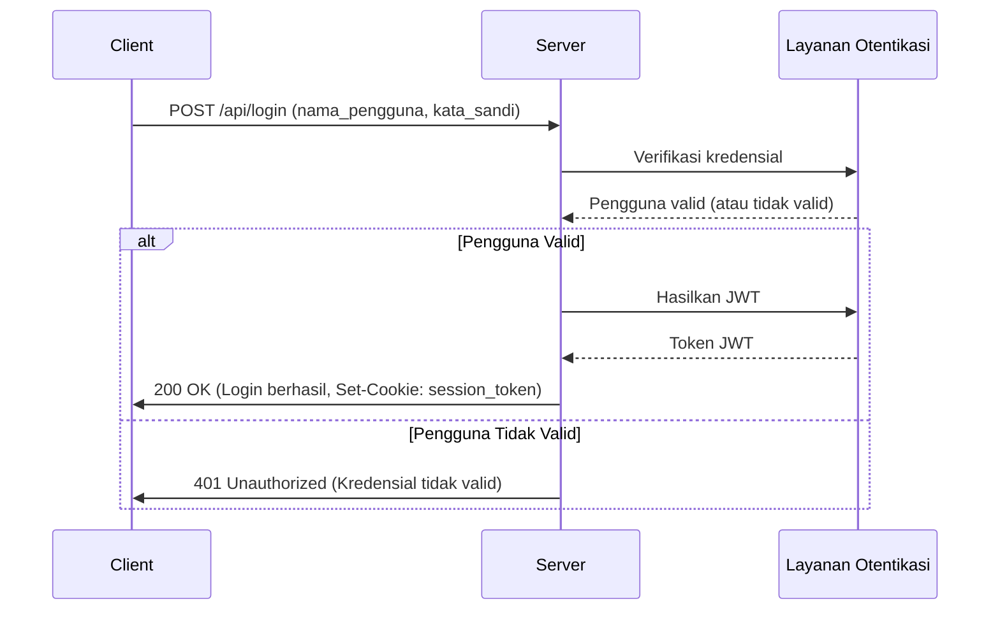

Sumber: [desa_db/server.py:87-110]()

#### Unggah dan Pemrosesan Data

Sistem mendukung pengunggahan data melalui berkas Excel. Berkas-berkas ini diproses oleh fungsi *middleware*, yang dapat melibatkan pembacaan pratinjau, pemetaan *header*, dan pemrosesan internal sebelum disimpan ke basis data.

Sumber: [desa_db/server.py:185-213](), [desa_db/middleware.py:110-143]()

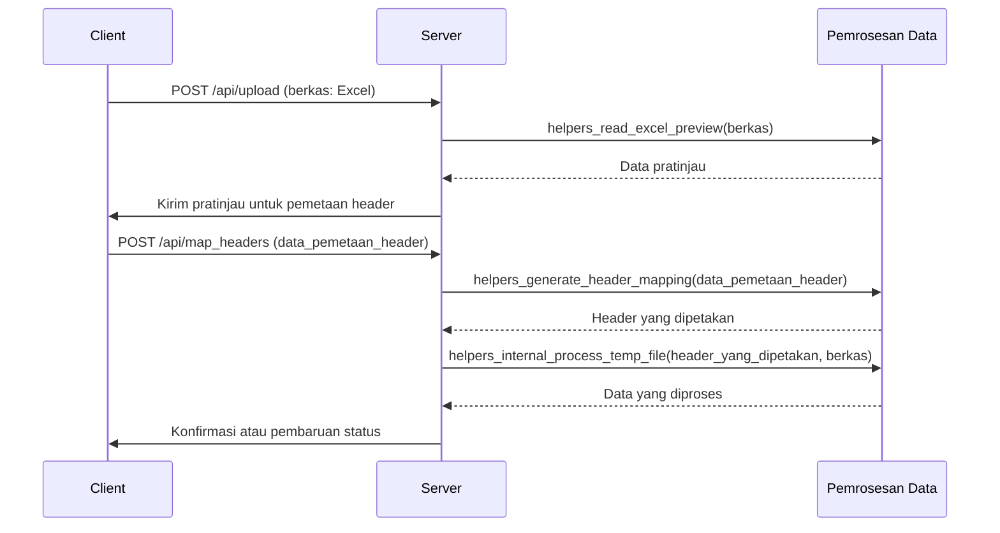

Sumber: [desa_db/server.py:185-213](), [desa_db/middleware.py:110-143]()

### Logika *Middleware*

Lapisan *middleware* berisi logika bisnis inti, termasuk operasi basis data, transformasi data, dan pembuatan laporan.

Sumber: [desa_db/middleware.py]()

#### Inisialisasi dan Manajemen Basis Data

*Middleware* menangani inisialisasi basis data, membuat tabel seperti `master_data` dan tabel riwayat jika belum ada. *Middleware* mendefinisikan tipe kolom berdasarkan konfigurasi dan konten data.

Sumber: [desa_db/middleware.py:229-268]()

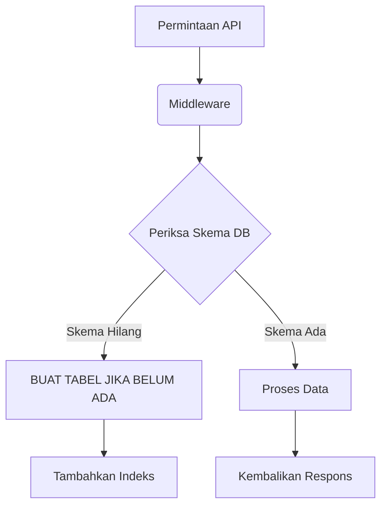

Sumber: [desa_db/middleware.py:229-268]()

#### Pembuatan Laporan (Excel)

Sistem dapat menghasilkan buku kerja Excel yang berisi data grid, rekomendasi dasbor, dan dasbor IKU. Proses ini melibatkan pembuatan lembar kerja, penerapan format, penggabungan sel, dan pengisian data.

Sumber: [desa_db/middleware.py:271-444]()

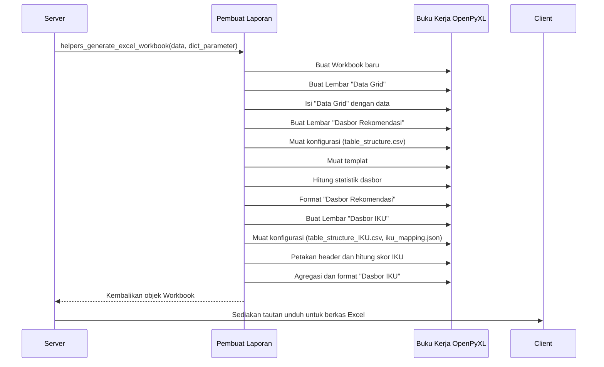

Sumber: [desa_db/middleware.py:271-444]()

#### Perenderan Dasbor (HTML)

Sistem merender dasbor berbasis HTML untuk rekomendasi dan IKU (Indikator Kinerja Utama). Proses ini melibatkan pembuatan HTML dinamis berdasarkan data dan konfigurasi.

Sumber: [desa_db/middleware.py:446-665](), [desa_db/middleware.py:667-857]()

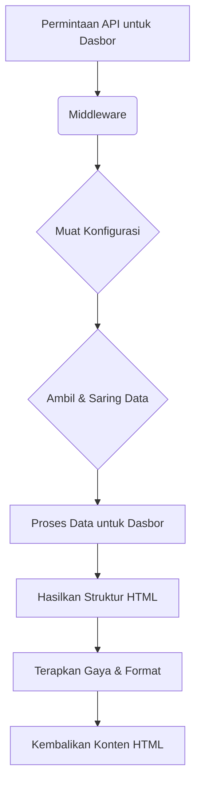

Sumber: [desa_db/middleware.py:446-665](), [desa_db/middleware.py:667-857]()

### Komponen *Frontend*

*Frontend* bertanggung jawab atas interaksi pengguna, menampilkan data, dan membuat permintaan ke API *backend*. *Frontend* menggunakan Tailwind CSS untuk penataan gaya.

Sumber: [front_end/router.py](), [front_end/tailwind.config.js]()

#### Perutean (*Routing*)

Perute (*router*) *frontend* mendefinisikan berbagai tampilan dan halaman yang dapat diakses oleh pengguna, memetakan URL ke berkas templat spesifik.

Sumber: [front_end/router.py]()

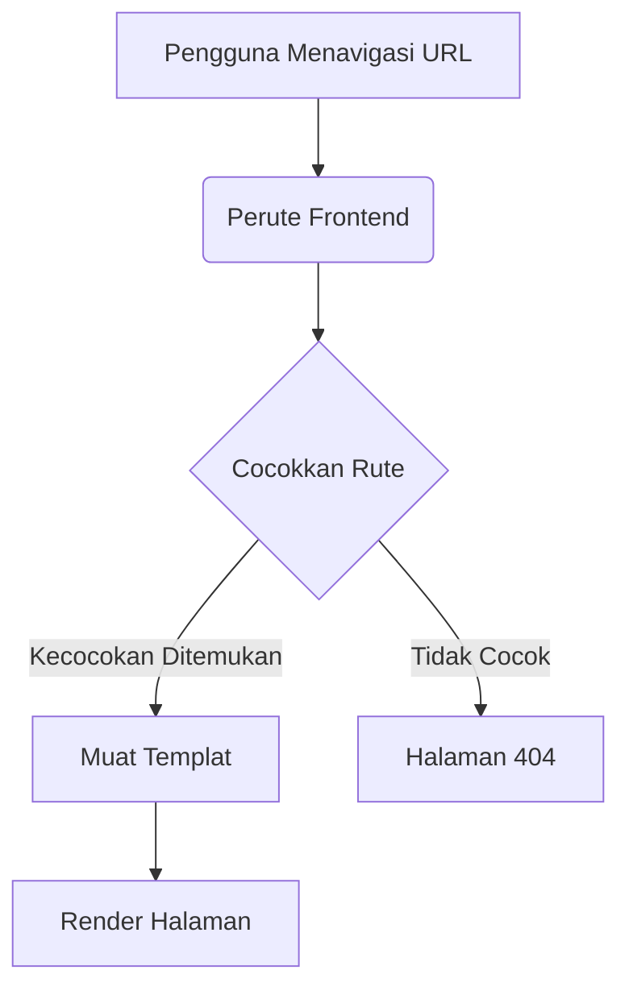

Sumber: [front_end/router.py]()

## Konfigurasi dan Model Data

Sistem ini sangat bergantung pada berkas konfigurasi untuk mendefinisikan struktur data, pemetaan (mapping), dan logika bisnis.

Sumber: [README.md]()

### Berkas Konfigurasi

Konfigurasi dikelola melalui berkas berformat JSON dan CSV, yang umumnya berlokasi di dalam direktori `.config/`.

Sumber: [README.md:5-10]()

| Nama Berkas             | Deskripsi                                                              | Format |
| :---------------------- | :--------------------------------------------------------------------- | :----- |
| `auth_users.json`       | Menyimpan kredensial pengguna dan peran mereka.                        | JSON   |
| `headers.json`          | Memetakan header standar ke alias (nama panggilan).                   | JSON   |
| `intervensi_kegiatan.json` | Menyimpan templat intervensi dan kegiatan.                             | JSON   |
| `rekomendasi.json`      | Mendefinisikan logika rekomendasi berdasarkan skor yang diperoleh.     | JSON   |
| `table_structure.csv`   | Mendefinisikan struktur untuk dasbor rekomendasi.                      | CSV    |
| `table_structure_IKU.csv` | Mendefinisikan struktur untuk dasbor Indikator Kinerja Utama (IKU).    | CSV    |
| `iku_mapping.json`      | Memetakan metrik IKU induk ke kolom-kolom anak.                        | JSON   |

Sumber: [README.md:5-10](), [tests/server_test.py:21-44]()

### Skema Basis Data

Tabel `master_data` merupakan elemen sentral dalam penyimpanan skor desa. Tabel ini mencakup kolom-kolom metadata dan kolom skor yang dihasilkan secara dinamis. Tabel riwayat (history tables) juga dapat disertakan untuk keperluan audit.

Sumber: [desa_db/middleware.py:239-257]()

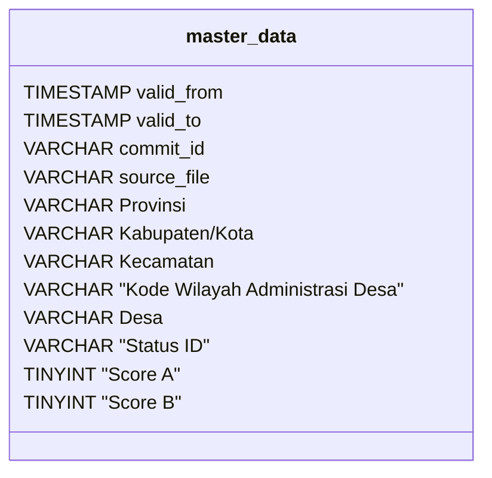

Sumber: [desa_db/middleware.py:239-257]()

## Penyiapan Pengujian dan Pengembangan

Proyek ini menyediakan instruksi untuk menyiapkan lingkungan pengembangan, menjalankan pengujian, dan melakukan penerapan (deployment) menggunakan Docker.

Sumber: [README.md]()

### Penerapan Docker

Docker Compose direkomendasikan untuk menjalankan aplikasi, guna memastikan konsistensi lingkungan baik untuk pengembangan maupun produksi.

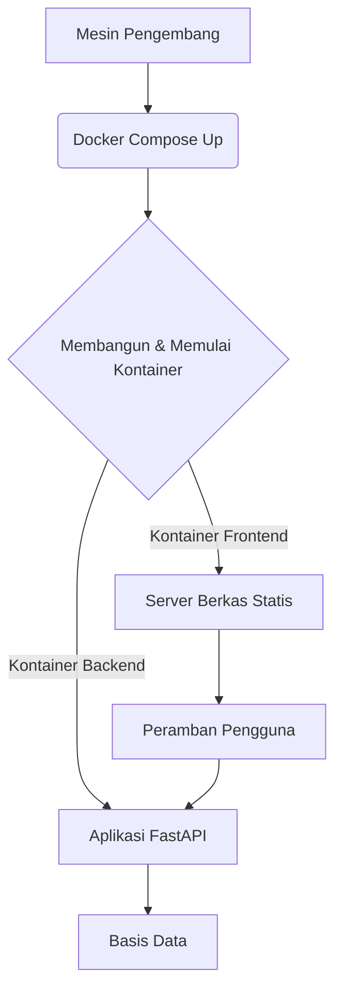

Sumber: [README.md:39-66]()

### Pengujian Unit dan Integrasi

Tersedia pengujian untuk memverifikasi fungsionalitas *endpoints* (endpoint) server dan logika perantara (middleware).

Sumber: [tests/server_test.py]()

```mermaid
graph TD
    A[Runner Pengujian pytest] --> B(Penyiapan Lingkungan Pengujian)
    B --> C[Pembuatan Berkas Konfigurasi Tiruan (Mock)]
    C --> D[Pembuatan Data Tiruan (Mock)]
    D --> E[Inisialisasi Aplikasi FastAPI]
    E --> F{Penggantian Ketergantungan (Override Dependencies)}
    F --> G[Pelaksanaan Pengujian API]
    G --> H[Penegasan Hasil (Assert Results)]
```

Sumber: [tests/server_test.py]()

## Ringkasan

Diagram Alur Data ("Data Flow Diagram") mengilustrasikan sebuah sistem yang terstruktur dengan baik, di mana backend FastAPI bertindak sebagai orkestrator pemrosesan data melalui fungsi-fungsi perantara (middleware). Berkas konfigurasi memegang peranan sentral dalam mendefinisikan struktur data dan logika, yang memungkinkan pembuatan laporan dan dasbor secara dinamis. Sistem ini mendukung unggahan data, otentikasi, serta menyediakan ekspor ke format Excel dan visualisasi berbasis web, dengan pemisahan tanggung jawab yang jelas antara backend, perantara, dan frontend.

Sumber: [desa_db/server.py](), [desa_db/middleware.py](), [front_end/router.py](), [README.md]()

---

<a id='page-component-relationships'></a>

# Hubungan Antar Komponen

## Halaman Terkait

Topik terkait: [Gambaran Umum Arsitektur](#page-architecture-overview), [Diagram Alur Data](#page-data-flow)

<details>
<summary>File sumber yang relevan</summary>

- [docker-compose.yml](https://github.com/anbe-on/integrasi_data_skor_rekomendasi_desa/blob/main/docker-compose.yml)
- [desa_db/server.py](https://github.com/anbe-on/integrasi_data_skor_rekomendasi_desa/blob/main/desa_db/server.py)
- [front_end/router.py](https://github.com/anbe-on/integrasi_data_skor_rekomendasi_desa/blob/main/front_end/router.py)
- [desa_db/auth.py](https://github.com/anbe-on/integrasi_data_skor_rekomendasi_desa/blob/main/desa_db/auth.py)
- [desa_db/middleware.py](https://github.com/anbe-on/integrasi_data_skor_rekomendasi_desa/blob/main/desa_db/middleware.py)
- [front_end/static/css/output.css](https://github.com/anbe-on/integrasi_data_skor_rekomendasi_desa/blob/main/front_end/static/css/output.css)
- [tests/server_test.py](https://github.com/anbe-on/integrasi_data_skor_rekomendasi_desa/blob/main/tests/server_test.py)
- [front_end/templates/login.html](https://github.com/anbe-on/integrasi_data_skor_rekomendasi_desa/blob/main/front_end/templates/login.html)
- [front_end/tailwind.config.js](https://github.com/anbe-on/integrasi_data_skor_rekomendasi_desa/blob/main/front_end/tailwind.config.js)

</details>

# Hubungan Antar Komponen

Dokumen ini menguraikan hubungan dan interaksi antara berbagai komponen dalam proyek "Integrasi Data Skor Rekomendasi Desa". Sistem ini dirancang dengan layanan API backend, antarmuka web frontend, dan layanan pendukung yang dikelola oleh Docker Compose. Tujuan utama adalah mengintegrasikan data, menghitung skor, dan menyediakan rekomendasi di tingkat desa.

Sistem ini terdiri dari beberapa komponen utama:

*   **Layanan Backend (`desa_db`)**: Diimplementasikan menggunakan FastAPI, layanan ini menangani pemrosesan data, permintaan API, interaksi basis data, dan logika bisnis. Layanan ini mengekspos *endpoints* untuk pengambilan data, otentikasi, dan pembuatan laporan.
*   **Layanan Frontend (`front_end`)**: Antarmuka web yang dibangun dengan HTML, CSS (Tailwind CSS), dan JavaScript, bertanggung jawab untuk interaksi pengguna, visualisasi data, dan komunikasi dengan API backend.
*   **Basis Data**: Meskipun tidak dirinci secara eksplisit dalam berkas yang disediakan, backend berinteraksi dengan basis data (tersirat dari `helpers_get_db_connection` dan kueri SQL dalam `middleware.py`).
*   **Konfigurasi**: Berbagai berkas JSON dan CSV di dalam direktori `.config` mengelola pengaturan sistem, pemetaan data, dan header.
*   **Orkestrasi Docker**: `docker-compose.yml` mendefinisikan layanan, dependensinya, volume, dan konfigurasi jaringan untuk penerapan.

## Layanan Backend (`desa_db`)

Layanan backend, `desa_db/server.py`, berfungsi sebagai inti dari aplikasi. Layanan ini dibangun menggunakan FastAPI dan mengintegrasikan berbagai fungsi pembantu dari `desa_db/middleware.py` serta logika otentikasi dari `desa_db/auth.py`.

### Fungsionalitas Inti dan Modul

Backend mengelola beberapa fungsi krusial:

*   **Endpoint API (API Endpoints)**: Mengekspos API RESTful untuk keperluan login, pengambilan data, unggah berkas, dan pembuatan laporan.
*   **Otentikasi (Authentication)**: Menangani proses login pengguna serta pembuatan dan validasi token JWT (JSON Web Token).
*   **Pemrosesan Data (Data Processing)**: Mencakup fungsi-fungsi untuk membaca pratinjau berkas Excel, menghasilkan pemetaan kepala kolom (header mapping), memproses berkas sementara, dan membangun kueri basis data yang dinamis.
*   **Pembuatan Dasbor (Dashboard Generation)**: Logika untuk menghitung statistik dasbor dan merender HTML baik untuk dasbor umum maupun dasbor IKU (Indikator Kinerja Utama).
*   **Pembuatan Laporan Excel (Excel Report Generation)**: Membuat buku kerja Excel dengan beberapa lembar untuk visualisasi data dan pelaporan.
*   **Tugas Latar Belakang (Background Tasks)**: Mendukung pembuatan berkas Excel yang telah dirender sebelumnya secara asinkron.

Sumber: [desa_db/server.py:1-250](), [desa_db/middleware.py]()

### Alur Otentikasi

Otentikasi pengguna dikelola oleh `desa_db/auth.py` dan diintegrasikan ke dalam `desa_db/server.py`.

1.  **Permintaan Login (Login Request)**: Model `LoginRequest` didefinisikan untuk menampung nama pengguna (username) dan kata sandi (password).
2.  **Pemeriksaan Otentikasi (Authentication Check)**: *Endpoints* `/api/login` mengambil kredensial pengguna dari berkas `auth_users.json`, kemudian memverifikasi kata sandi terhadap *hash* yang tersimpan menggunakan fungsi `auth_verify_password`.
3.  **Pembuatan JWT (JWT Generation)**: Setelah otentikasi berhasil, token akses JWT dibuat dengan menyertakan waktu kedaluwarsa.
4.  **Pengaturan Kuki (Cookie Setting)**: Token JWT diatur sebagai kuki `HttpOnly` dengan nama `session_token` dalam respons.

Sumber: [desa_db/server.py:119-154](), [desa_db/auth.py]()

```mermaid
graph TD
    A[Pengguna] --> B(Frontend)
    B --> C{"POST /api/login"}
    C --> D["desa_db/server.py"]
    D --> E["desa_db/auth.py"]
    E -- "Verifikasi Kredensial" --> F["auth_users.json"]
    F -- "Kredensial Cocok" --> E
    E -- "Buat JWT" --> D
    D -- "Atur Kuki HttpOnly" --> G[Respons]
    G --> B
    B -- "Alihkan/Muat Halaman" --> A
```

### Pemrosesan Data dan Pelaporan

Backend memanfaatkan berkas konfigurasi dan fungsi pembantu untuk memproses data dan menghasilkan laporan.

*   **Berkas Konfigurasi (Configuration Files)**: Berkas `headers.json`, `table_structure.csv`, `table_structure_IKU.csv`, `iku_mapping.json`, dan `rekomendasi.json` sangat penting untuk mendefinisikan struktur data, pemetaan, dan logika penilaian.
*   **Pembuatan Dasbor (Dashboard Generation)**:
    *   `helpers_calculate_dashboard_stats`: Menghitung statistik untuk dasbor utama.
    *   `helpers_render_dashboard_html`: Menghasilkan HTML untuk tabel dasbor utama.
    *   `helpers_render_iku_dashboard`: Menghasilkan HTML untuk dasbor IKU.
*   **Pembuatan Excel (Excel Generation)**:
    *   `helpers_generate_excel_workbook`: Membuat struktur buku kerja Excel.
    *   `helpers_background_task_generate_pre_render_excel`: Menangani pembuatan Excel yang dirender sebelumnya secara asinkron.

Sumber: [desa_db/server.py:16-26](), [desa_db/middleware.py:45-359](), [tests/server_test.py:15-36]()

```mermaid
graph TD
    A[Frontend] ->> B{Permintaan API};
    B -> C{desa_db/server.py};
    C -- Muat Konfigurasi --> D[.config/];
    D -- headers.json --> C;
    D -- table_structure.csv --> C;
    D -- table_structure_IKU.csv --> C;
    D -- iku_mapping.json --> C;
    D -- rekomendasi.json --> C;
    C -- Proses Data --> E[desa_db/middleware.py];
    E -- Hitung Statistik --> F[helpers_calculate_dashboard_stats];
    E -- Render HTML --> G[helpers_render_dashboard_html];
    E -- Render HTML IKU --> H[helpers_render_iku_dashboard];
    E -- Buat Excel --> I[helpers_generate_excel_workbook];
    E -- Excel Latar Belakang --> J[helpers_background_task_generate_pre_render_excel];
    F --> K[Basis Data];
    G --> L[Respons (HTML)];
    H --> L;
    I --> M[Respons (Excel)];
    J --> M;
```

# Layanan Frontend (`front_end`)

Layanan frontend menyediakan antarmuka pengguna untuk berinteraksi dengan layanan backend. Layanan ini menggunakan HTML, CSS (Tailwind CSS), dan JavaScript.

### Berkas dan Teknologi Utama

*   **Templat HTML**: `login.html`, `user.html`, `admin.html` mendefinisikan struktur antarmuka pengguna yang berbeda.
*   **CSS**: `output.css` yang dihasilkan dari Tailwind CSS menyediakan penataan gaya. `tailwind.config.js` mengonfigurasi Tailwind.
*   **Perutean (Routing)**: `front_end/router.py` menangani perutean sisi klien atau menyajikan aset statis.
*   **Komunikasi API**: JavaScript di dalam templat HTML atau berkas JS terpisah (tidak disediakan) akan menangani pembuatan permintaan ke API backend.

Sumber: [front_end/templates/login.html](), [front_end/templates/user.html](), [front_end/templates/admin.html](), [front_end/tailwind.config.js](), [front_end/router.py]()

### Penataan Gaya dengan Tailwind CSS

Tailwind CSS digunakan untuk penataan gaya, dikonfigurasi melalui `front_end/tailwind.config.js` dan dikompilasi menjadi `front_end/static/css/output.css`.

Sumber: [front_end/tailwind.config.js](), [front_end/static/css/output.css]()

```mermaid
graph TD
    A[Pengguna] -> B(Peramban);
    B -- Memuat --> C[front_end/router.py];
    C -- Menyajikan --> D[Templat HTML];
    D -- Menghubungkan ke --> E[front_end/static/css/output.css];
    E -- Menggunakan --> F[Tailwind CSS];
    F -- Dikonfigurasi oleh --> G[front_end/tailwind.config.js];
    D -- Berisi --> H[JavaScript untuk Panggilan API];
    H ->> I[API_BASE_URL];
    I -- Contoh --> J[http://backend_id_srd_iku:8000];
    J ->> K[Layanan Backend];
```

## Orkestrasi Docker (`docker-compose.yml`)

Docker Compose digunakan untuk mendefinisikan dan mengelola layanan aplikasi, memastikan lingkungan yang konsisten dan dapat direproduksi.

### Layanan yang Didefinisikan

*   **`backend_id_srd_iku`**: Menjalankan layanan backend FastAPI. Layanan ini memasang (mount) direktori konfigurasi, basis data, berkas sementara, ekspor, dan frontend. Layanan ini juga menggunakan variabel lingkungan dari `.env`.
*   **`frontend_id_srd_iku`**: Menjalankan layanan frontend, dikonfigurasi untuk berkomunikasi dengan backend melalui `API_BASE_URL`.
*   **`nginx_id_srd_iku`**: Sebuah *reverse proxy* (reverse proxy) yang menggunakan Nginx untuk mengarahkan lalu lintas eksternal ke frontend. Layanan ini mengekspos port 8080.
*   **`backup_id_srd_iku`**: Sebuah layanan untuk pencadangan basis data otomatis menggunakan skrip.

Sumber: [docker-compose.yml]()

```mermaid
graph TD
    subgraph Lingkungan Docker
        A[Pengguna/Akses Eksternal] --> B(Nginx);
        B -- Port 8080 --> C(Layanan Frontend);
        C -- Panggilan API --> D(Layanan Backend);
        D -- Membaca/Menulis --> E(Konfigurasi/.config);
        D -- Membaca/Menulis --> F(Basis Data/desa_db/dbs);
        D -- Membaca/Menulis --> G(Berkas Sementara/desa_db/temp);
        D -- Membaca/Menulis --> H(Ekspor/exports);
        C -- Membaca --> I(Berkas Statis Frontend/front_end/static);
        J(Layanan Pencadangan) -- Menjalankan Skrip --> K(Skrip Pencadangan);
        J -- Mengakses --> F;
        J -- Menyimpan ke --> L(Folder Cadangan);
    end

    %% Definisi Layanan
    B -- Mengelola --> C;
    C -- Bergantung pada --> D;
    B -- Bergantung pada --> C;
    J -- Menjalankan --> K;
```

## Manajemen Konfigurasi

Konfigurasi terpusat dan dikelola melalui berbagai berkas, terutama yang berlokasi di direktori `.config`.

### Berkas Konfigurasi Utama

*   **`.config/auth_users.json`**: Menyimpan kredensial pengguna (nama pengguna, kata sandi ter-hash, peran) untuk otentikasi.
*   **`.config/headers.json`**: Mendefinisikan header kolom standar dan aliasnya untuk impor dan pemrosesan data.
*   **`.config/intervensi_kegiatan.json`**: Berisi data yang berkaitan dengan kegiatan intervensi.
*   **`.config/rekomendasi.json`**: Memetakan skor ke teks rekomendasi spesifik.
*   **`.config/table_structure.csv`**: Mendefinisikan struktur tabel, termasuk dimensi, sub-dimensi, indikator, dan item.
*   **`.config/table_structure_IKU.csv`**: Mendefinisikan struktur untuk tabel IKU (Indikator Kinerja Utama).
*   **`.config/iku_mapping.json`**: Memetakan metrik induk IKU ke sub-metrik penyusunnya.
*   **`.env`**: Variabel lingkungan, khususnya `APP_SECRET_KEY`, yang digunakan untuk rahasia aplikasi.

Sumber: [tests/server_test.py:15-36](), [README.md:5-10]()

```mermaid
graph TD
    A[Layanan Backend] --> B(Berkas Konfigurasi);
    B -- Memuat --> C[.config/auth_users.json];
    B -- Memuat --> D[.config/headers.json];
    B -- Memuat --> E[.config/intervensi_kegiatan.json];
    B -- Memuat --> F[.config/rekomendasi.json];
    B -- Memuat --> G[.config/table_structure.csv];
    B -- Memuat --> H[.config/table_structure_IKU.csv];
    B -- Memuat --> I[.config/iku_mapping.json];
    J[Layanan Backend] -- Membaca --> K[.env];
    K -- APP_SECRET_KEY --> J;
```

## Alur Data dan Interaksi

Sistem ini mengikuti arsitektur klien-server yang umum, di mana frontend berinteraksi dengan API backend.

1.  **Interaksi Pengguna**: Pengguna berinteraksi dengan aplikasi frontend melalui peramban web mereka.
2.  **Permintaan Frontend**: Frontend membuat permintaan HTTP ke *endpoints* API backend (contoh: `/api/login`, `/api/data`, `/api/generate_excel`).
3.  **Pemrosesan Backend**: Backend (`desa_db/server.py` dan `desa_db/middleware.py`) menangani permintaan ini. Backend membaca berkas konfigurasi, melakukan kueri ke basis data, melaksanakan perhitungan, dan menghasilkan respons.
4.  **Pengambilan/Manipulasi Data**: Backend dapat berinteraksi dengan basis data untuk mengambil atau menyimpan data.
5.  **Generasi Respons**: Backend mengembalikan data (contoh: JSON untuk respons API, HTML untuk dasbor yang dirender) atau berkas (contoh: laporan Excel) ke frontend.
6.  **Perenderan Frontend**: Frontend menerima respons dan memperbarui antarmuka pengguna sesuai dengan itu.

Sumber: [desa_db/server.py](), [front_end/router.py](), [docker-compose.yml]()

```mermaid
sequenceDiagram
    participant User
    participant Frontend
    participant Backend
    participant Database

    User->>Frontend: Mengakses Aplikasi Web
    Frontend->>Backend: POST /api/login (kredensial)
    Backend->>Database: Verifikasi Kredensial Pengguna
    Database-->>Backend: Pengguna Ditemukan/Tidak Ditemukan
    Backend-->>Frontend: Token JWT / Respons Kesalahan
    Frontend->>Frontend: Menyimpan JWT (Cookie HttpOnly)
    User->>Frontend: Meminta Data/Laporan
    Frontend->>Backend: GET /api/data?filters...
    Backend->>Database: Ambil Data Berdasarkan Filter
    Database-->>Backend: Data Mentah
    Backend->>Middleware: Proses Data (Perhitungan, Pemformatan)
    Middleware-->>Backend: Data Terproses / HTML / Excel
    Backend-->>Frontend: Respons JSON / HTML / Tautan Unduhan Berkas
    Frontend->>Frontend: Merender Data / Menampilkan Laporan
```


<a id='page-data-upload-and-processing'></a>

## Unggah dan Pemrosesan Data

### Halaman Terkait

Topik terkait: [Dasbor dan Pelaporan](#page-dashboard-and-reporting), [Berkas Konfigurasi](#page-configuration-files)

<details>
<summary>Berkas sumber yang relevan</summary>

- desa_db/server.py
- desa_db/middleware.py
- tests/server_test.py
- front_end/static/js/spark-md5.min.js
- front_end/templates/admin.html

</details>

# Unggah dan Pemrosesan Data

Halaman wiki ini merinci alur unggah dan pemrosesan data dalam proyek `integrasi_data_skor_rekomendasi_desa`. Halaman ini mencakup mekanisme untuk mengunggah berkas, menangani unggahan yang dapat dilanjutkan (resumable uploads), pemecahan berkas menjadi bagian-bagian (chunking), dan langkah-langkah pemrosesan awal yang mempersiapkan data untuk analisis dan penyimpanan lebih lanjut. Sistem mendukung pengguna administratif dalam mengunggah kumpulan data, memastikan integritas data melalui penghitungan hash (hashing) dan memberikan umpan balik mengenai status unggahan.

Proses unggah data dirancang agar tangguh, mengakomodasi berkas yang berpotensi berukuran besar melalui fitur unggahan yang dapat dilanjutkan. Setelah diunggah, data akan melalui pemrosesan awal, termasuk validasi dan persiapan untuk integrasi ke dalam basis data sistem dan modul pelaporan.

## Endpoint Unggah Data

Backend menyediakan beberapa *endpoints* API untuk mengelola proses unggah data. *Endpoints* ini diamankan dan umumnya memerlukan hak akses administratif.

### Inisialisasi Unggah yang Dapat Dilanjutkan (`/upload/init/{year}`)

*Endpoints* ini menginisialisasi proses unggah yang dapat dilanjutkan. *Endpoints* ini memeriksa apakah unggahan parsial untuk berkas yang diberikan sudah ada dan mengembalikan jumlah byte yang telah diterima. Hal ini memungkinkan klien untuk melanjutkan unggahan yang terputus dari titik terakhirnya.

*   **Metode:** `POST`
*   **Jalur:** `/upload/init/{year}`
*   **Autentikasi:** Memerlukan hak akses administratif (contoh: `Depends(auth_require_admin)`).
*   **Badan Permintaan (Request Body):** Model `UploadInit`
    *   `filename` (str): Nama berkas yang sedang diunggah.
    *   `file_uid` (str): Pengidentifikasi unik untuk berkas, umumnya berasal dari hash dan ukurannya. Ini digunakan untuk menemukan unggahan parsial.
    *   `total_size` (int): Ukuran total berkas dalam byte.
    *   `total_hash` (str): Hash MD5 dari keseluruhan berkas.
*   **Respons:**
    *   `{"status": "ready", "upload_id": str, "received_bytes": int}`: Menunjukkan unggahan dapat dimulai, menyediakan `upload_id` (yang merupakan `file_uid`) dan jumlah byte yang telah diterima.
    *   `{"status": "exists", "upload_id": str, "received_bytes": int}`: Menunjukkan berkas sudah ada dan lengkap. `received_bytes` akan sama dengan `total_size`.
*   **Keamanan:** `file_uid` divalidasi terhadap ekspresi reguler `^[a-zA-Z0-9_]+$` untuk mencegah serangan *directory traversal*.
*   **Penyimpanan Sementara:** Unggahan parsial disimpan di `TEMP_FOLDER` dengan awalan `partial_` dan `file_uid`.

Sumber: [desa_db/server.py:205-235]()

### Potongan Unggah (`/upload/chunk/{year}`)

*Endpoints* ini menerima potongan-potongan individual dari sebuah berkas selama proses unggah yang dapat dilanjutkan. *Endpoints* ini melakukan validasi hash MD5 pada setiap potongan untuk memastikan integritas data sebelum menambahkannya ke berkas sementara.

*   **Metode:** `POST`
*   **Jalur:** `/upload/chunk/{year}`
*   **Autentikasi:** Memerlukan hak akses administratif.
*   **Data Formulir (Form Data):**
    *   `chunk` (File): Potongan berkas itu sendiri.
    *   `upload_id` (str): Pengidentifikasi unik unggahan (dari `UploadInit`).
    *   `offset` (int): Offset byte awal dari potongan ini di dalam berkas asli.
    *   `chunk_hash` (str): Hash MD5 dari potongan tersebut.
*   **Respons:** `{"status": "ok", "received": int}`: Menunjukkan penerimaan dan penambahan potongan yang berhasil.
*   **Penanganan Kesalahan:** Mengembalikan kode status 400 dengan pesan kesalahan jika kerusakan potongan terdeteksi (ketidaksesuaian hash).
*   **Penambahan Berkas:** Potongan ditambahkan dalam mode biner (`'ab'`) ke berkas sementara.

Sumber: [desa_db/server.py:241-267]()

### Finalisasi Unggah (`/upload/finalize/{year}`)

*Endpoints* ini dipanggil setelah semua potongan berkas telah diunggah. *Endpoints* ini memfinalisasi proses unggah, berpotensi melakukan verifikasi hash akhir dan memindahkan berkas ke lokasi permanennya atau memulai pemrosesan lebih lanjut.

*   **Metode:** `POST`
*   **Jalur:** `/upload/finalize/{year}`
*   **Autentikasi:** Memerlukan hak akses administratif.
*   **Badan Permintaan (Request Body):** Model `UploadFinalize`
    *   `upload_id` (str): Pengidentifikasi unik unggahan.
    *   `filename` (str): Nama berkas asli.
    *   `total_hash` (str): Hash MD5 dari keseluruhan berkas.
*   **Pemrosesan:** *Endpoints* ini memicu finalisasi berkas dan dapat memulai tugas pemrosesan latar belakang.

Sumber: [desa_db/server.py:189-194]()

## Antarmuka Unggah Frontend

Frontend menyediakan antarmuka pengguna untuk mengunggah data, yang terintegrasi ke dalam dasbor administratif.

### Halaman Admin (`/admin`)

Rute `/admin` menyajikan templat `admin.html`, yang berisi elemen antarmuka pengguna untuk unggah data.

*   **Fungsionalitas:** Menampilkan pesan status unggahan dan menyediakan kontrol untuk memulai unggahan.
*   **Elemen Antarmuka Pengguna:** Mencakup elemen seperti tombol "Unggah Data" dan tampilan pesan status (`x-show="ui_UploadStatusMessage"`).
*   **Logika JavaScript:** JavaScript sisi klien menangani pemilihan berkas, pemotongan (chunking), penghashan (menggunakan SparkMD5), dan panggilan API ke *endpoints* unggah backend.

Sumber: [front_end/templates/admin.html]()

## Penghashan dan Integritas Berkas

Sistem menggunakan penghashan MD5 untuk memastikan integritas berkas yang diunggah dan potongan individual.

### SparkMD5

Pustaka `spark-md5.min.js` digunakan di frontend untuk menghitung hash MD5 dari berkas dan potongannya. Hal ini sangat penting untuk memverifikasi bahwa data tidak rusak selama transmisi.

*   **Penggunaan:** Fungsi `helpers_compute_md5` dalam JavaScript frontend (tidak sepenuhnya disediakan dalam konteks, tetapi tersirat dari penggunaannya dalam logika `admin.html`) akan menggunakan SparkMD5 untuk menghash *blob* berkas.
*   **Integrasi API:** Hash yang dihitung dikirim ke backend selama fase inisialisasi unggahan dan pemotongan.

Sumber: [front_end/static/js/spark-md5.min.js]()

## Alur Pemrosesan Data

Diagram berikut mengilustrasikan alur yang disederhanakan untuk unggahan yang dapat dilanjutkan (resumable upload) dan pemrosesan awal.

```mermaid
graph TD
    A[Pengguna Admin] --> B{Pilih Berkas}
    B --> C["Hitung Hash Berkas (SparkMD5)"]
    C --> D["POST /upload/init/{year}"]
    D --> E{Server: Periksa Unggahan Parsial}
    E -- Siap --> F[Klien: Mulai Pemecahan Menjadi Bagian (Chunking)]
    E -- Ada --> G[Klien: Selesaikan Unggahan]
    F --> H["Bagi Berkas Menjadi Bagian-bagian (Chunks)"]
    H --> I["Hitung Hash Bagian (Chunk Hash)"]
    I --> J["POST /upload/chunk/{year}"]
    J --> K{Server: Verifikasi Hash Bagian & Tambahkan}
    K -- OK --> F
    K -- Rusak --> L[Klien: Tangani Kesalahan/Coba Lagi]
    F -- "Semua Bagian Terkirim" --> M["POST /upload/finalize/{year}"]
    M --> N{Server: Selesaikan Unggahan}
    N --> O[Proses Data]
    G --> O
    O --> P[Simpan Data yang Diproses]

```

Sumber: [desa_db/server.py:205-267](), [front_end/templates/admin.html]()

## Model API untuk Unggahan

Backend mendefinisikan model Pydantic untuk menstrukturkan data yang masuk untuk permintaan API terkait unggahan.

| Nama Model       | Kolom                                            | Deskripsi                                                              |
| :--------------- | :----------------------------------------------- | :--------------------------------------------------------------------- |
| `UploadInit`     | `filename` (str), `file_uid` (str), `total_size` (int), `total_hash` (str) | Model permintaan untuk menginisialisasi unggahan yang dapat dilanjutkan. |
| `UploadFinalize` | `upload_id` (str), `filename` (str), `total_hash` (str) | Model permintaan untuk menyelesaikan unggahan yang dapat dilanjutkan.    |

Sumber: [desa_db/server.py:169-185]()

## Kasus Uji (Test Cases)

Berkas `tests/server_test.py` menyertakan pengujian untuk fungsionalitas unggahan, memverifikasi alur dari awal hingga akhir, mulai dari inisialisasi hingga penyelesaian dan pemrosesan selanjutnya.

*   **`test_full_etl_and_endpoints_pipeline`**: Kasus uji ini mensimulasikan alur unggahan dan pemrosesan data yang lengkap, meliputi:
    *   Unggahan yang dapat dilanjutkan (inisialisasi, pengiriman bagian, penyelesaian).
    *   Analisis pratinjau dan header.
    *   Pemrosesan data yang telah dipetakan.
    *   Penyimpanan data ke dalam basis data.
    *   Fungsionalitas kueri, pembuatan dasbor, dan ekspor.

Sumber: [tests/server_test.py:53-79]()

## Konfigurasi dan Konstanta

Konfigurasi server mencakup jalur untuk penyimpanan berkas sementara dan direktori templat.

*   **`TEMP_FOLDER`**: Didefinisikan sebagai `os.path.join(BASE_DIR, "temp")` dalam `desa_db/server.py`, direktori ini digunakan untuk menyimpan berkas unggahan sementara.
*   **`TEMPLATE_DIR`**: Didefinisikan sebagai `os.path.join(ROOT_DIR, "front_end", "templates")`, direktori ini menampung templat HTML, termasuk `admin.html`.

Sumber: [desa_db/server.py:95-101]()

## Perlindungan Server dan Perutean (Routing)

Berkas `desa_db/server.py` menangani perutean dan perlindungan server dasar.

*   **Rute `/admin`**: Rute ini menyajikan halaman `admin.html`. Rute ini menyertakan perlindungan sisi server yang mengalihkan pengguna yang tidak terautentikasi ke halaman `/login` jika kuki `session_token` tidak ada.
*   **Pengalihan Akar (`/`)**: Mengalihkan ke `/admin`.

Sumber: [desa_db/server.py:43-59]()

## Logika Pemrosesan Data (Tersirat)

Meskipun logika pemrosesan data secara rinci setelah unggahan tidak sepenuhnya diekspos dalam cuplikan yang diberikan, templat `admin.html` dan `server.py` mengindikasikan bahwa setelah penyelesaian unggahan berhasil, sistem akan melanjutkan ke "Pemrosesan" dan kemudian "Simpan Data yang Diproses". Berkas `middleware.py` berisi fungsi-fungsi seperti `helpers_internal_process_temp_file`, `helpers_read_excel_preview`, dan `helpers_generate_header_mapping`, yang menyarankan bahwa berkas yang diproses adalah Excel atau CSV, yang kemudian diurai, dipetakan, dan disimpan.

Sumber: [front_end/templates/admin.html](), [desa_db/server.py:205-235](), [desa_db/middleware.py]()

---

<a id='page-dashboard-and-reporting'></a>

## Dasbor dan Pelaporan

### Halaman Terkait

Topik terkait: [Unggah dan Pemrosesan Data](#page-data-upload-and-processing), [Struktur Basis Data](#page-database-structure)

<details>
<summary>Berkas sumber yang relevan</summary>

- [desa_db/server.py](https://github.com/anbe-on/integrasi_data_skor_rekomendasi_desa/blob/main/desa_db/server.py)
- [desa_db/middleware.py](https://github.com/anbe-on/integrasi_data_skor_rekomendasi_desa/blob/main/desa_db/middleware.py)
- [front_end/templates/user.html](https://github.com/anbe-on/integrasi_data_skor_rekomendasi_desa/blob/main/front_end/templates/user.html)
- [front_end/templates/admin.html](https://github.com/anbe-on/integrasi_data_skor_rekomendasi_desa/blob/main/front_end/templates/admin.html)
- [tests/server_test.py](https://github.com/anbe-on/integrasi_data_skor_rekomendasi_desa/blob/main/tests/server_test.py)
- [README.md](https://github.com/anbe-on/integrasi_data_skor_rekomendasi_desa/blob/main/README.md)
- [front_end/static/css/output.css](https://github.com/anbe-on/integrasi_data_skor_rekomendasi_desa/blob/main/front_end/static/css/output.css)
</details>

# Dasbor dan Pelaporan

Proyek ini menyediakan fungsionalitas dasbor dan pelaporan yang kuat, yang utamanya berfokus pada visualisasi dan analisis skor data desa serta rekomendasi. Fitur-fitur ini dapat diakses melalui antarmuka pengguna yang berbeda (Admin dan Pengguna) dan menghasilkan laporan terperinci dalam format Excel. Sistem ini memanfaatkan berkas konfigurasi untuk mendefinisikan struktur data, pemetaan, dan logika pelaporan, sehingga memastikan fleksibilitas dan kustomisasi.

Sistem pelaporan menghasilkan tiga lembar kerja yang berbeda dalam sebuah buku kerja Excel: "Grid Data," "Dashboard Rekomendasi," dan "Dashboard IKU." Setiap lembar kerja melayani tujuan spesifik dalam menyajikan data terintegrasi, mulai dari kisi data mentah hingga dasbor analitik terperinci. Aplikasi antarmuka pengguna, `admin.html` dan `user.html`, menyediakan antarmuka pengguna untuk berinteraksi dengan fitur-fitur ini, sementara perantara antarmuka sisi server (`middleware.py`) menangani pemrosesan data yang kompleks dan pembuatan berkas Excel.

Sumber: [desa_db/middleware.py:11](https://github.com/anbe-on/integrasi_data_skor_rekomendasi_desa/blob/main/desa_db/middleware.py#L11), [desa_db/server.py:117](https://github.com/anbe-on/integrasi_data_skor_rekomendasi_desa/blob/main/desa_db/server.py#L117)

## Komponen Pelaporan Inti

Sistem pelaporan dibangun berdasarkan beberapa komponen kunci dan berkas konfigurasi yang menentukan perilaku dan keluarannya.

### Berkas Konfigurasi

Proyek ini mengandalkan serangkaian berkas konfigurasi yang berlokasi di direktori `.config/` untuk mendefinisikan struktur dan logika untuk dasbor dan laporan.

*   `headers.json`: Mendefinisikan nama kolom standar dan aliasnya.
*   `table_structure.csv`: Menentukan struktur untuk lembar "Dashboard Rekomendasi", mencakup dimensi, sub-dimensi, indikator, dan item.
*   `table_structure_IKU.csv`: Mendefinisikan struktur untuk lembar "Dashboard IKU", mencakup unit teritorial dan induk indikator.
*   `iku_mapping.json`: Memetakan induk indikator dari `table_structure_IKU.csv` ke kolom skor yang sesuai.
*   `rekomendasi.json`: Berisi logika untuk menerjemahkan skor numerik menjadi rekomendasi tekstual.
*   `intervensi_kegiatan.json`: Menyimpan templat untuk kegiatan intervensi.
*   `auth_users.json`: Mengelola otentikasi pengguna.

Sumber: [README.md:4](https://github.com/anbe-on/integrasi_data_skor_rekomendasi_desa/blob/main/README.md#configuration-files), [tests/server_test.py:18](https://github.com/anbe-on/integrasi_data_skor_rekomendasi_desa/blob/main/tests/server_test.py#L18), [tests/server_test.py:26](https://github.com/anbe-on/integrasi_data_skor_rekomendasi_desa/blob/main/tests/server_test.py#L26), [tests/server_test.py:31](https://github.com/anbe-on/integrasi_data_skor_rekomendasi_desa/blob/main/tests/server_test.py#L31), [tests/server_test.py:36](https://github.com/anbe-on/integrasi_data_skor_rekomendasi_desa/blob/main/tests/server_test.py#L36), [tests/server_test.py:41](https://github.com/anbe-on/integrasi_data_skor_rekomendasi_desa/blob/main/tests/server_test.py#L41), [tests/server_test.py:46](https://github.com/anbe-on/integrasi_data_skor_rekomendasi_desa/blob/main/tests/server_test.py#L46)

### Pembuatan Buku Kerja Excel

Skrip `middleware.py` mengorkestrasi pembuatan buku kerja Excel dengan beberapa lembar.

```python
# Contoh inisialisasi buku kerja dan pembuatan lembar
wb = Workbook()

# --- LEMBAR 1: DATA GRID ---
ws1 = wb.active
ws1.title = "Grid Data"

# --- LEMBAR 2: DASHBOARD REKOMENDASI ---
ws2 = wb.create_sheet("Dashboard Rekomendasi")

# --- LEMBAR 3: DASHBOARD IKU ---
ws3 = wb.create_sheet("Dashboard IKU")
```

Sumber: [desa_db/middleware.py:88](https://github.com/anbe-on/integrasi_data_skor_rekomendasi_desa/blob/main/desa_db/middleware.py#L88), [desa_db/middleware.py:117](https://github.com/anbe-on/integrasi_data_skor_rekomendasi_desa/blob/main/desa_db/middleware.py#L117), [desa_db/middleware.py:145](https://github.com/anbe-on/integrasi_data_skor_rekomendasi_desa/blob/main/desa_db/middleware.py#L145)

### Penataan Gaya dan Pemformatan

Gaya Excel umum seperti batas, perataan, isian, dan font didefinisikan dan digunakan kembali di berbagai lembar untuk presentasi yang konsisten.

```python
# Definisi Gaya Umum
thin_border = Border(
    left=Side(style='thin'),
    right=Side(style='thin'),
    top=Side(style='thin'),
    bottom=Side(style='thin')
)
align_top = Alignment(vertical='top', wrap_text=True)
align_center = Alignment(horizontal='center', vertical='center', wrap_text=True)
header_fill = PatternFill(start_color="F2F2F2", end_color="F2F2F2", fill_type="solid")
header_font = Font(bold=True)
```

Sumber: [desa_db/middleware.py:91](https://github.com/anbe-on/integrasi_data_skor_rekomendasi_desa/blob/main/desa_db/middleware.py#L91)

## Lembar 1: Data Grid

Lembar ini menyajikan data mentah dalam format tabel, sering kali setelah menerapkan terjemahan atau pemfilteran berdasarkan parameter pengguna.

### Pemuatan dan Transformasi Data

Data dimuat ke dalam pandas DataFrame kemudian dikonversi menjadi daftar kamus untuk memudahkan penulisan ke lembar Excel. Apabila `do_translate` bernilai benar (`true`), sebuah fungsi `apply_rekomendasis` akan dipanggil.

```python
df_sheet1 = apply_rekomendasis(df_grid) if do_translate else df_grid
grid_dicts = df_sheet1.to_dicts()
```

Sumber: [desa_db/middleware.py:106](https://github.com/anbe-on/integrasi_data_skor_rekomendasi_desa/blob/main/desa_db/middleware.py#L106)

### Penulisan Header dan Data

Header ditulis terlebih dahulu, diikuti oleh baris-baris data. Nilai `None` atau `NaN` dikonversi menjadi string kosong agar kompatibel dengan Excel.

```python
if grid_dicts:
    headers = list(grid_dicts[0].keys())
    ws1.append(headers)
    for row in grid_dicts:
        clean_row = [(v if v is not None else "") for v in row.values()]
        ws1.append(clean_row)
else:
    ws1.append(["No Data Found for filters"])
```

Sumber: [desa_db/middleware.py:109](https://github.com/anbe-on/integrasi_data_skor_rekomendasi_desa/blob/main/desa_db/middleware.py#L109)

### Pemformatan

Pemformatan dasar diterapkan pada baris header, mencakup jenis huruf tebal dan isian berwarna abu-abu muda.

```python
for cell in ws1[1]:
    cell.font = header_font
    cell.fill = header_fill
```

Sumber: [desa_db/middleware.py:114](https://github.com/anbe-on/integrasi_data_skor_rekomendasi_desa/blob/main/desa_db/middleware.py#L114)

## Lembar 2: Dasbor Rekomendasi

Lembar ini menyajikan sebuah dasbor terperinci yang berisi skor agregat, rekomendasi, dan detail intervensi. Data dalam lembar ini diorganisasi berdasarkan dimensi, sub-dimensi, dan indikator.

### Pemuatan Data dan Konfigurasi

Proses ini memuat berkas `table_structure.csv` untuk memahami struktur laporan dan skema `master_data` guna mengidentifikasi kolom-kolom metrik. Templat intervensi juga dimuat dalam tahap ini.

```python
csv_path = os.path.join(CONFIG_DIR, "table_structure.csv")
structure = []
if os.path.exists(csv_path):
    with open(csv_path, "r", encoding="utf-8-sig", errors="replace") as f:
        # ... (CSV reading logic) ...
        structure = list(reader)

db_cols_info = con.execute("DESCRIBE master_data").fetchall()
metadata_cols = { ... } # Defined metadata columns
ordered_db_cols = [r[0] for r in db_cols_info if r[0] not in metadata_cols]

item_names = [row.get("ITEM", "") for row in structure if row.get("ITEM")]
templates = helpers_get_or_create_intervensi_kegiatan(item_names)
```

Sumber: [desa_db/middleware.py:120](https://github.com/anbe-on/integrasi_data_skor_rekomendasi_desa/blob/main/desa_db/middleware.py#L120), [desa_db/middleware.py:135](https://github.com/anbe-on/integrasi_data_skor_rekomendasi_desa/blob/main/desa_db/middleware.py#L135)

### Pemrosesan dan Perhitungan Data

Fungsi `helpers_calculate_dashboard_stats` dipanggil untuk menghitung nilai rata-rata, jumlah, serta menghasilkan teks naratif berdasarkan struktur data yang telah dimuat dan templat yang tersedia.

```python
calculated_rows = helpers_calculate_dashboard_stats(df_grid, structure, ordered_db_cols, templates)
```

Sumber: [desa_db/middleware.py:175](https://github.com/anbe-on/integrasi_data_skor_rekomendasi_desa/blob/main/desa_db/middleware.py#L175)

### Pemformatan Header dan Kolom

Header disusun dengan penggabungan sel (merged cells) untuk grup "SKOR" dan "PELAKSANA". Lebar kolom dioptimalkan untuk memastikan keterbacaan data.

```python
# Baris 1: Header Gabungan
ws2.append(["NO", "DIMENSI", "SUB DIMENSI", "INDIKATOR", "ITEM",
            "SKOR", "", "", "", "", "",         # Colspan 6
            "INTERVENSI",                       # Rowspan 2
            "PUSAT", "PROVINSI", "KABUPATEN", "DESA", "Lainnya"]) # PELAKSANA

# Baris 2: Sub Header untuk grup SKOR
ws2.append(["", "", "", "", "",
            "Rata-rata", "Min", "Max", "Total", "Jumlah", "Standar Deviasi",
            "", # INTERVENSI (sudah rowspan 2)
            "", "", "", "", ""]) # PELAKSANA (sudah rowspan 2)

# Penerapan format pada header
for r in range(1, 3):
    for cell in ws2[r]:
        cell.font = header_font
        cell.fill = header_fill
        cell.border = thin_border
        cell.alignment = align_center

# Lebar Kolom
ws2.column_dimensions['A'].width = 5   # NO
ws2.column_dimensions['B'].width = 15  # DIMENSI
# ... pengaturan lebar kolom lainnya ...
ws2.column_dimensions['L'].width = 100 # INTERVENSI (Sangat Lebar)
```

Sumber: [desa_db/middleware.py:184](https://github.com/anbe-on/integrasi_data_skor_rekomendasi_desa/blob/main/desa_db/middleware.py#L184), [desa_db/middleware.py:212](https://github.com/anbe-on/integrasi_data_skor_rekomendasi_desa/blob/main/desa_db/middleware.py#L212)

### Penggabungan Baris dan Penataan Gaya

Penggabungan baris (rowspan) diterapkan pada kolom "NO", "DIMENSI", "SUB DIMENSI", dan "INDIKATOR" untuk mengelompokkan data yang saling terkait. Batas (borders) dan perataan (alignment) diterapkan pada semua sel.

```python
# Logika untuk menerapkan rowspan dan border pada baris data
# ... (kode di dalam helpers_render_dashboard_html) ...
```

Sumber: [desa_db/middleware.py:258](https://github.com/anbe-on/integrasi_data_skor_rekomendasi_desa/blob/main/desa_db/middleware.py#L258)

## Lembar 3: Dasbor IKU

Lembar ini menyajikan dasbor Indikator Kinerja Utama (IKU), mengagregasi data pada berbagai tingkatan administratif (Provinsi, Kabupaten, Kecamatan, Desa) dan memvisualisasikan metrik kinerja.

### Pemuatan dan Pemetaan Data

Sistem memuat `table_structure_IKU.csv` dan `iku_mapping.json` untuk mendefinisikan struktur IKU dan memetakan indikator induk ke kolom skor penyusunnya.

```python
iku_csv_path = os.path.join(CONFIG_DIR, "table_structure_IKU.csv")
iku_mapping_path = os.path.join(CONFIG_DIR, "iku_mapping.json")

if os.path.exists(iku_csv_path) and os.path.exists(iku_mapping_path):
    with open(iku_mapping_path, "r", encoding="utf-8") as f:
        iku_mapping = json.load(f)

    with open(iku_csv_path, "r", encoding="utf-8-sig", errors="replace") as f:
        reader = csv.reader(f, delimiter=';')
        rows = list(reader)
        # ... (pemrosesan baris) ...
```

Sumber: [desa_db/middleware.py:148](https://github.com/anbe-on/integrasi_data_skor_rekomendasi_desa/blob/main/desa_db/middleware.py#L148), [desa_db/middleware.py:305](https://github.com/anbe-on/integrasi_data_skor_rekomendasi_desa/blob/main/desa_db/middleware.py#L305)

### Logika Pengelompokan dan Agregasi

Sistem menentukan tingkat pengelompokan (Provinsi, Kabupaten, dst.) berdasarkan `params_dict` dan kemudian menghitung skor IKU dengan merata-ratakan kolom anak yang telah dipetakan. Sistem mengagregasi data untuk menampilkan jumlah desa (`JLH DESA`), skor rata-rata, dan jumlah ambang batas status yang berbeda.

```python
# Menentukan hierarki pengelompokan
group_col = params_dict.get("group_by", "")
# ... (logika untuk mengatur group_cols berdasarkan group_col) ...

# Menghitung Rata-rata Tingkat Desa untuk setiap Metrik Induk
exprs = []
for parent in parent_metrics:
    children = iku_mapping.get(parent, [])
    # ... (menghitung skor rata-rata untuk induk) ...
    exprs.append(avg_expr.alias(f"__iku_score_{parent}"))

# Mengelompokkan dan mengagregasi
df_grouped = df_filtered.group_by(group_cols).agg(
    pl.count().alias("JLH DESA"),
    *[pl.mean(f"__iku_score_{p}").alias(f"Rata-rata {p}") for p in parent_metrics],
    *[pl.col(f"__iku_score_{p}").is_in(valid_statuses).sum().alias(f"Jumlah {s}") for p in parent_metrics for s in valid_statuses],
    # ... agregasi lainnya ...
)
```

Sumber: [desa_db/middleware.py:320](https://github.com/anbe-on/integrasi_data_skor_rekomendasi_desa/blob/main/desa_db/middleware.py#L320), [desa_db/middleware.py:350](https://github.com/anbe-on/integrasi_data_skor_rekomendasi_desa/blob/main/desa_db/middleware.py#L350), [desa_db/middleware.py:466](https://github.com/anbe-on/integrasi_data_skor_rekomendasi_desa/blob/main/desa_db/middleware.py#L466)

### Perenderan dan Penataan Gaya Header

Header dibangun dengan kolom induk yang digabungkan dan sub-kolom yang mewakili status, rata-rata, total, dan pencapaian. Peta panas (heatmap) diterapkan menggunakan CSS untuk representasi data visual. Format angka diterapkan untuk bilangan bulat dan pecahan.

```python
# Pembuatan header HTML untuk Dasbor IKU
html = "<thead class='sticky top-0 z-10'>"
# ... (logika untuk membuat header induk gabungan dan sub-header) ...
html += "</thead>"

# ... (pembuatan badan HTML dengan CSS untuk peta panas dan pemformatan angka) ...
```

Sumber: [desa_db/middleware.py:514](https://github.com/anbe-on/integrasi_data_skor_rekomendasi_desa/blob/main/desa_db/middleware.py#L514), [desa_db/middleware.py:666](https://github.com/anbe-on/integrasi_data_skor_rekomendasi_desa/blob/main/desa_db/middleware.py#L666)

### Presentasi Data

Dasbor menampilkan unit teritorial, jumlah desa, skor rata-rata, dan jumlah status. Baris "TOTAL" merangkum data yang diagregasi. Peta panas diterapkan untuk merepresentasikan intensitas data dan persentase pencapaian secara visual.

```python
# Merender baris data dengan pemformatan bersyarat (peta panas)
for row_data in df_grouped.to_dicts():
    html += "<tr class='dash-tr-hover'>"
    # ... (merender kolom wilayah dan JLH DESA) ...
    for idx in range(2, len(row2)):
        metric_info = col_idx_to_metric.get(idx)
        val_to_show = "-"
        if metric_info:
            # ... (logika untuk menentukan nilai dan menerapkan gaya peta panas) ...
            html += f'<td class="p-3 border dark:border-slate-600 ... iku-cell-data" data-col-idx="{idx + len(group_cols) - 1}">{val_to_show}</td>'
    html += "</tr>"

# Menambahkan baris TOTAL
# ... (logika untuk baris TOTAL) ...
```

Sumber: [desa_db/middleware.py:681](https://github.com/anbe-on/integrasi_data_skor_rekomendasi_desa/blob/main/desa_db/middleware.py#L681), [desa_db/middleware.py:794](https://github.com/anbe-on/integrasi_data_skor_rekomendasi_desa/blob/main/desa_db/middleware.py#L794)

## Antarmuka Pengguna

Templat _front-end_ menyediakan antarmuka pengguna untuk mengakses dan berinteraksi dengan fitur dasbor (_dashboard_) dan pelaporan.

### Dasbor Admin (`admin.html`)

Dasbor admin menyediakan akses penuh ke seluruh fitur pelaporan, mencakup pembuatan data dan manajemen konfigurasi. Dasbor ini memanfaatkan Alpine.js untuk interaktivitas dan AG-Grid untuk tampilan data.

```html
<!-- Snippet from admin.html -->
<body class="global_body_container font-mono bg-gray-100 h-screen flex flex-col transition-colors
  duration-300 dark:bg-slate-900 dark:text-slate-100">
  <!-- ... header dan konten utama ... -->
  <h1 class="header_title_label text-sm font-bold flex items-center gap-2 truncate h-8 w-full text-slate-700
    border-r border-gray-300 dark:text-slate-100 dark:border-slate-600/50">
    <span class="text-blue-600 dark:text-blue-400 flex items-center gap-1.5">
      
      <span>Admin</span>
    </span>
    <span class="text-gray-300 dark:text-gray-600">|</span>
    <span>Data skor rekomendasi</span>
  </h1>
  <!-- ... -->
</body>
```

Sumber: [front_end/templates/admin.html:1](https://github.com/anbe-on/integrasi_data_skor_rekomendasi_desa/blob/main/front_end/templates/admin.html#L1)

### Dasbor Pengguna (`user.html`)

Dasbor pengguna menyediakan akses untuk melihat laporan dan dasbor, dengan fungsionalitas yang lebih terbatas dibandingkan antarmuka admin. Dasbor ini menggunakan teknologi _front-end_ yang serupa dengan dasbor admin.

```html
<!-- Snippet from user.html -->
<body class="global_body_container font-mono bg-gray-100 h-screen flex flex-col transition-colors
  duration-300 dark:bg-slate-900 dark:text-slate-100">
  <!-- ... header and main content ... -->
  <h1 class="header_title_label text-sm font-bold flex items-center gap-2 truncate h-8 w-full text-slate-700
    border-r border-gray-300 dark:text-slate-100 dark:border-slate-600/50">
    <span class="text-blue-600 dark:text-blue-400 flex items-center gap-1.5">
      
      <span>User</span>
    </span>
    <span class="text-gray-300 dark:text-gray-600">|</span>
    <span>Data skor rekomendasi</span>
  </h1>
  <!-- ... -->
</body>
```

Sumber: [front_end/templates/user.html:1](https://github.com/anbe-on/integrasi_data_skor_rekomendasi_desa/blob/main/front_end/templates/user.html#L1)

## Endpoint API _Back-end_

Berkas `server.py` mendefinisikan *endpoints* API yang menyajikan data dasbor dan memicu pembuatan laporan.

### Endpoint `/dashboard`

*Endpoints* ini mengambil data untuk dasbor utama, memprosesnya melalui fungsi _middleware_.

```python
@app.get("/dashboard")
async def dashboard(
    request: Request,
    response: Response,
    user: User = Depends(auth_get_current_user),
    params_dict: dict = Depends(get_params_dict),
):
    # ... (data fetching and processing logic) ...
    return HTMLResponse(content=helpers_render_dashboard_html(calculated_rows))
```

Sumber: [desa_db/server.py:117](https://github.com/anbe-on/integrasi_data_skor_rekomendasi_desa/blob/main/desa_db/server.py#L117)

### Endpoint `/dashboard_iku`

*Endpoints* ini bertanggung jawab untuk mengambil dan merender data dasbor IKU (_Indikator Kinerja Utama_).

```python
@app.get("/dashboard_iku")
async def dashboard_iku(
    request: Request,
    response: Response,
    user: User = Depends(auth_get_current_user),
    params_dict: dict = Depends(get_params_dict),
    limit: int = 100,
    offset: int = 0,
    is_append: bool = False,
):
    # ... (data fetching and processing logic) ...
    return HTMLResponse(content=helpers_render_iku_dashboard(df_filtered, params_dict, limit, offset, is_append))
```

Sumber: [desa_db/server.py:145](https://github.com/anbe-on/integrasi_data_skor_rekomendasi_desa/blob/main/desa_db/server.py#L145)

### Endpoint `/download_excel`

*Endpoints* ini memicu pembuatan dan pengunduhan laporan Excel yang terkonsolidasi.

```python
@app.get("/download_excel")
async def download_excel(
    request: Request,
    response: Response,
    user: User = Depends(auth_get_current_user),
    params_dict: dict = Depends(get_params_dict),
):
    # ... (workbook generation logic using middleware) ...
    # Create an in-memory byte stream
    output = io.BytesIO()
    wb.save(output)
    output.seek(0)

    return StreamingResponse(
        output,
        media_type="application/vnd.openxmlformats-officedocument.spreadsheetml.sheet",
        headers={"Content-Disposition": "attachment; filename=desa_data_report.xlsx"},
    )
```

Sumber: [desa_db/server.py:170](https://github.com/anbe-on/integrasi_data_skor_rekomendasi_desa/blob/main/desa_db/server.py#L170)

## Alur Data dan Arsitektur

Sistem pelaporan mengikuti arsitektur berlapis:

1.  **Front-end:** Antarmuka pengguna (`admin.html`, `user.html`) berinteraksi dengan *back-end* melalui panggilan API.
2.  **Lapisan API (`server.py`):** Mengekspos *endpoints* (*endpoint*) untuk mengambil data dasbor, merender HTML, dan memicu pembuatan laporan Excel. Lapisan ini menangani otentikasi dan pemrosesan parameter.
3.  **Middleware (`middleware.py`):** Berisi logika inti untuk pemrosesan data, perhitungan, dan pembuatan buku kerja Excel. Komponen ini membaca berkas konfigurasi dan berinteraksi dengan basis data.
4.  **Berkas Konfigurasi:** Menyediakan metadata dan logika yang diperlukan untuk struktur dan konten laporan.
5.  **Basis Data:** Menyimpan `master_data` yang digunakan untuk analisis.

### Contoh Alur Permintaan (Unduh Excel)

```mermaid
graph TD
    A[Permintaan Pengguna Unduh Excel] --> B(Endpoint API /download_excel);
    B --> C{Otentikasi & Pemrosesan Parameter};
    C --> D[Middleware: Buat Buku Kerja];
    D --> E[Muat Berkas Konfigurasi];
    E --> F[Ambil Data dari DB];
    F --> G[Proses & Hitung Statistik];
    G --> H[Isi Lembar: Grid, Rekomendasi, IKU];
    H --> I[Simpan Buku Kerja ke BytesIO];
    I --> J[Kembalikan Berkas Excel via StreamingResponse];
```

Sumber: [desa\_db/server.py:170](https://github.com/anbe-on/integrasi_data_skor_rekomendasi_desa/blob/main/desa_db/server.py#L170), [desa\_db/middleware.py](https://github.com/anbe-on/integrasi_data_skor_rekomendasi_desa/blob/main/desa_db/middleware.py)

### Alur Perenderan HTML (Dasbor IKU)

```mermaid
graph TD
    A[Permintaan Pengguna Dasbor IKU] --> B(Endpoint API /dashboard_iku);
    B --> C{Otentikasi & Pemrosesan Parameter};
    C --> D[Middleware: Render HTML Dasbor IKU];
    D --> E[Muat Konfigurasi: table\_structure\_IKU.csv, iku\_mapping.json];
    E --> F[Ambil Data Terfilter];
    F --> G[Petakan Header & Kelompokkan Data];
    G --> H[Hitung Skor IKU & Agregasi];
    H --> I[Buat Badan Tabel HTML dengan CSS];
    I --> J[Kembalikan Respons HTML];
```

Sumber: [desa\_db/server.py:145](https://github.com/anbe-on/integrasi_data_skor_rekomendasi_desa/blob/main/desa_db/server.py#L145), [desa\_db/middleware.py:305](https://github.com/anbe-on/integrasi_data_skor_rekomendasi_desa/blob/main/desa_db/middleware.py#L305)

## Pengujian

Proyek ini mencakup pengujian untuk memastikan fungsionalitas mekanisme server dan pelaporan.

### Pengujian Unit untuk Server dan Pelaporan

Berkas `tests/server_test.py` berisi *fixture* dan pengujian untuk *endpoints* server serta logika pembuatan Excel. Pengujian ini melakukan *mock* pada berkas konfigurasi untuk mensimulasikan berbagai skenario.

```python
# Example Test Fixture
@pytest.fixture
def client():
    # ... (override auth dependency) ...
    server.app.dependency_overrides[server.auth_get_current_user] = lambda: "admin_test"
    return TestClient(server.app)

# Example Test Case
def test_download_excel(client, tmp_path):
    # ... (setup mock config files) ...
    response = client.get("/download_excel")
    assert response.status_code == 200
    # ... (assert file content) ...
```

Sumber: [tests/server\_test.py:52](https://github.com/anbe-on/integrasi_data_skor_rekomendasi_desa/blob/main/tests/server_test.py#L52), [tests/server\_test.py:60](https://github.com/anbe-on/integrasi_data_skor_rekomendasi_desa/blob/main/tests/server_test.py#L60)

Dasbor dan fitur pelaporan menyediakan sistem komprehensif untuk menganalisis data desa, menghasilkan wawasan yang dapat ditindaklanjuti, dan menyajikannya dalam format yang ramah pengguna. Desain modular, yang didorong oleh berkas konfigurasi dan fungsi *middleware* yang terdefinisi dengan baik, memungkinkan fleksibilitas dan kemudahan pemeliharaan.

---

<a id='page-user-authentication'></a>

## Otentikasi dan Otorisasi Pengguna

### Halaman Terkait

Topik terkait: [Halaman Login](#page-login-page), [Dasbor Admin](#page-admin-dashboard)

<details>
<summary>File sumber yang relevan</summary>

- [desa_db/auth.py](https://github.com/anbe-on/integrasi_data_skor_rekomendasi_desa/blob/main/desa_db/auth.py)
- [add_user.py](https://github.com/anbe-on/integrasi_data_skor_rekomendasi_desa/blob/main/add_user.py)
- [front_end/templates/login.html](https://github.com/anbe-on/integrasi_data_skor_rekomendasi_desa/blob/main/front_end/templates/login.html)
- [front_end/templates/user.html](https://github.com/anbe-on/integrasi_data_skor_rekomendasi_desa/blob/main/front_end/templates/user.html)
- [front_end/templates/admin.html](https://github.com/anbe-on/integrasi_data_skor_rekomendasi_desa/blob/main/front_end/templates/admin.html)
- [desa_db/server.py](https://github.com/anbe-on/integrasi_data_skor_rekomendasi_desa/blob/main/desa_db/server.py)
- [front_end/router.py](https://github.com/anbe-on/integrasi_data_skor_rekomendasi_desa/blob/main/front_end/router.py)
- [tests/server_test.py](https://github.com/anbe-on/integrasi_data_skor_rekomendasi_desa/blob/main/tests/server_test.py)

</details>

# Otentikasi dan Otorisasi Pengguna

Dokumen ini menguraikan mekanisme otentikasi dan otorisasi pengguna yang diimplementasikan dalam proyek Integrasi Data Skor Rekomendasi Desa. Sistem ini menggunakan kombinasi *hashing* kata sandi, *JSON Web Tokens* (JWT), dan kontrol akses berbasis peran untuk mengamankan akses pengguna ke berbagai bagian aplikasi. Manajemen pengguna, termasuk penambahan pengguna baru dengan peran spesifik, juga dirinci.

Alur otentikasi memastikan bahwa hanya pengguna yang valid yang dapat mengakses sistem, dan otorisasi memastikan bahwa pengguna hanya diizinkan untuk melakukan tindakan atau melihat data yang relevan dengan peran yang ditugaskan kepada mereka (misalnya, administrator versus pengguna biasa).

## Alur Otentikasi

Proses otentikasi melibatkan pengguna yang mengirimkan kredensial mereka, yang kemudian diverifikasi terhadap data pengguna yang tersimpan. Otentikasi yang berhasil menghasilkan penerbitan JWT, yang disimpan dalam *cookie HttpOnly* untuk permintaan selanjutnya.

### Proses Login

Pengguna dapat masuk melalui halaman login khusus atau melalui *endpoint* API.

**Login Antarmuka Web:**
`front_end/templates/login.html` menyediakan antarmuka pengguna untuk mengirimkan kredensial login. Formulir mengirimkan ke *endpoint* `/login` pada perute *frontend*. *Frontend* kemudian meneruskan permintaan ini ke API *backend*.

**Login Endpoint API:**
*Endpoint* `/api/login` di `desa_db/server.py` menangani permintaan login. *Endpoint* ini mengharapkan muatan JSON yang berisi `username` dan `password`.

**Langkah-langkah:**
1.  Pengguna mengirimkan kredensial (nama pengguna, kata sandi).
2.  *Frontend* (jika berlaku) atau panggilan API langsung mengirimkan kredensial ke `/api/login`.
3.  *Backend* memverifikasi kredensial.
4.  Setelah verifikasi berhasil, JWT dihasilkan.
5.  JWT diatur sebagai *cookie* `HttpOnly` bernama `session_token`.
6.  Pengguna diarahkan ke dasbor yang ditunjuk (`/admin` untuk administrator, `/user` untuk yang lain).

Sumber:
- [front_end/templates/login.html:1-61]()
- [front_end/router.py:60-77]()
- [desa_db/server.py:119-145]()

### Pembuatan JWT dan Manajemen Cookie

*JSON Web Tokens* (JWT) digunakan untuk mempertahankan sesi pengguna setelah otentikasi berhasil.

*   **Pembuatan Token:** JWT dibuat berisi nama pengguna dan peran pengguna yang diautentikasi. Token memiliki waktu kedaluwarsa yang ditentukan oleh `ACCESS_TOKEN_EXPIRE_MINUTES`.
    Sumber:
    - [desa_db/auth.py:45-52]()
    - [desa_db/server.py:132-136]()
*   **Penyimpanan Cookie Aman:** JWT yang dihasilkan disimpan dalam *cookie* `HttpOnly` bernama `session_token`. `HttpOnly` mencegah JavaScript sisi klien mengakses *cookie*, meningkatkan keamanan. *Cookie* juga dikonfigurasi dengan `samesite="lax"` dan `secure=True` (jika HTTPS digunakan) untuk keamanan lebih lanjut.
    Sumber:
    - [desa_db/server.py:139-145]()
    - [front_end/router.py:69-77]()
*   **Verifikasi Token:** Untuk rute yang dilindungi, dependensi `auth_get_current_user` di `desa_db/auth.py` mengekstrak `session_token` dari *cookie* permintaan. Kemudian mendekode dan memverifikasi JWT. Jika token hilang, tidak valid, atau kedaluwarsa, `HTTPException` dengan kode status 401 akan dinaikkan.
    Sumber:
    - [desa_db/auth.py:66-81]()
    - [desa_db/server.py:151-156]()

### Proses Logout

*Endpoint* `/api/logout` menangani logout pengguna. *Endpoint* ini menghapus *cookie* `session_token`, yang secara efektif mengakhiri sesi pengguna.

Sumber:
- [desa_db/server.py:147-157]()

## Otorisasi dan Kontrol Akses Berbasis Peran

Sistem ini menerapkan kontrol akses berbasis peran untuk membedakan hak istimewa pengguna. Pengguna diberikan peran (contoh: "admin", "user") saat pembuatan pengguna.

### Peran Pengguna

*   **Admin:** Pengguna dengan peran "admin" umumnya memiliki akses ke fungsi administratif dan potensi akses data yang lebih luas. Rute `/admin` dilindungi dan ditujukan untuk administrator.
    Sumber:
    - [desa_db/server.py:159-164]()
    - [front_end/router.py:27-31]()
*   **User:** Pengguna reguler (non-admin) diarahkan ke rute `/user` setelah berhasil masuk.
    Sumber:
    - [front_end/router.py:32-34]()

### Penegakan Peran

Informasi peran disematkan di dalam muatan JWT (JSON Web Token). Ketika seorang pengguna diautentikasi, perannya diekstrak dan dimasukkan ke dalam token. Rute yang dilindungi kemudian dapat mengakses informasi peran ini untuk menegakkan kebijakan akses.

Sumber:
- [desa_db/auth.py:75]()
- [desa_db/server.py:134]()
- [front_end/router.py:67]()

## Manajemen Pengguna

Skrip `add_user.py` dan modul otentikasi backend menangani pembuatan dan manajemen pengguna.

### Penambahan Pengguna

Skrip `add_user.py` memungkinkan pembuatan dan pengelolaan akun pengguna.

*   **Penggunaan:** `python add_user.py <nama_pengguna> <kata_sandi> [peran]`
*   **Peran Bawaan:** Jika tidak ada peran yang ditentukan, pengguna secara otomatis mendapatkan peran "admin".
*   **Penyimpanan:** Kredensial pengguna (kata sandi yang di-hash dan peran) disimpan dalam berkas JSON yang berlokasi di `.config/auth_users.json`.
    Sumber:
    - [add_user.py:13-16]()
    - [add_user.py:39-49]()
    - [add_user.py:55-58]()
    - [README.md:5-7]()

### Hashing Kata Sandi

Kata sandi tidak disimpan dalam teks biasa. Sebaliknya, kata sandi di-hash secara aman menggunakan pustaka `bcrypt` sebelum disimpan.

*   **Proses Hashing:**
    1.  Kata sandi pengguna dikodekan menjadi byte.
    2.  `bcrypt.hashpw` menghasilkan garam (salt) dan menghash kata sandi.
    3.  Hasil hash yang diperoleh dikodekan kembali menjadi string untuk penyimpanan.
*   **Verifikasi:** Fungsi `auth_verify_password` di `desa_db/auth.py` menggunakan `bcrypt.checkpw` untuk membandingkan kata sandi teks biasa dengan hash yang tersimpan.
    Sumber:
    - [add_user.py:25-30]()
    - [desa_db/auth.py:27-32]()

## Penyimpanan Data untuk Otentikasi

Data otentikasi pengguna disimpan dalam berkas JSON.

*   **Lokasi Berkas:** `.config/auth_users.json`
*   **Struktur:** Berkas ini berisi objek JSON di mana kunci adalah nama pengguna. Setiap nama pengguna dipetakan ke objek yang berisi:
    *   `hash`: String kata sandi yang di-hash menggunakan bcrypt.
    *   `role`: Peran pengguna (contoh: "admin", "user").
    *   `active`: Nilai boolean yang menunjukkan apakah akun pengguna aktif.

Sumber:
- [add_user.py:13-16]()
- [desa_db/auth.py:16-19]()
- [README.md:5-7]()

## Komponen dan Berkas Utama

| Komponen/Berkas             | Deskripsi                                                                                                                                                           | Bagian Relevan           |
| :-------------------------- | :------------------------------------------------------------------------------------------------------------------------------------------------------------------ | :----------------------- |
| `add_user.py`               | Skrip untuk menambah/memperbarui pengguna, termasuk hashing kata sandi dan penugasan peran.                                                                          | Manajemen Pengguna       |
| `desa_db/auth.py`           | Logika otentikasi dan otorisasi inti, termasuk pembuatan/verifikasi JWT, hashing/verifikasi kata sandi, dan pemuatan basis data pengguna.                               | Alur Otentikasi, Otorisasi, Penyimpanan Data |
| `desa_db/server.py`         | Implementasi server FastAPI, termasuk endpoint API untuk login, logout, dan manajemen cookie JWT.                                                                     | Alur Otentikasi          |
| `front_end/router.py`       | Logika perutean frontend yang menangani permintaan login, pengaturan token, dan pengalihan berdasarkan peran pengguna.                                               | Alur Otentikasi, Otorisasi |
| `front_end/templates/login.html` | Templat HTML untuk antarmuka login pengguna.                                                                                                                        | Alur Otentikasi          |
| `front_end/templates/admin.html` | Templat HTML untuk dasbor admin, menyiratkan akses yang dilindungi.                                                                                                | Otorisasi                |
| `front_end/templates/user.html`  | Templat HTML untuk dasbor pengguna biasa, menyiratkan akses yang dilindungi.                                                                                       | Otorisasi                |
| `.config/auth_users.json`   | Menyimpan kredensial pengguna yang di-hash dan peran.                                                                                                               | Penyimpanan Data         |

## Gambaran Arsitektur

Sistem otentikasi dan otorisasi mengikuti arsitektur klien-server di mana frontend berinteraksi dengan endpoint API backend. JWT digunakan untuk manajemen sesi tanpa status.

### Diagram Alur Otentikasi

Diagram ini mengilustrasikan proses pengguna masuk ke sistem.

```mermaid
graph TD
    A[Input Kredensial Pengguna] --> B{Router Frontend};
    B -- POST /login --> C[API Backend /api/login];
    C -- Verifikasi Kredensial --> D[Modul Auth: auth_get_users_db];
    D -- Data Pengguna --> C;
    C -- Pemeriksaan Hash --> E[Modul Auth: auth_verify_password];
    E -- Cocok? --> F{Berhasil};
    E -- Tidak Cocok --> G{Gagal};
    F -- Buat JWT --> H[Modul Auth: auth_create_access_token];
    H -- JWT --> C;
    C -- Atur Cookie session_token --> B;
    C -- Alihkan ke Dasbor --> B;
    G -- Kembalikan Error 401 --> B;
    B -- Tampilkan Error --> A;
```

Sumber:
- [front_end/router.py:60-77]()
- [desa_db/server.py:119-145]()
- [desa_db/auth.py:27-32, 45-52]()

### Diagram Pemeriksaan Otorisasi

Diagram ini menunjukkan cara rute yang dilindungi memverifikasi otorisasi pengguna.

```mermaid
graph TD
    A["Pengguna Mengakses Rute yang Dilindungi"] --> B{Penangan Rute Backend}
    B -- "Panggil Dependensi auth_get_current_user" --> C["Modul Auth: auth_get_current_user"]
    C -- "Dapatkan Cookie session_token" --> D["Cookie Permintaan"]
    D -- "Token Hadir?" --> E{Ya}
    D -- "Tidak Ada Token" --> F["Tidak Sah (401)"]
    E -- "Dekode & Verifikasi JWT" --> G["Modul Auth: jwt.decode"]
    G -- "Token Valid?" --> H{Ya}
    G -- "Token Tidak Valid" --> F
    H -- "Ekstrak Data Pengguna (Peran)" --> B
    B -- "Periksa Izin Peran" --> I{Sah}
    B -- "Izin Tidak Cukup" --> J["Tidak Sah (403)"]
    I -- "Izinkan Akses" --> K["Sajikan Konten Rute"]
    F -- "Kembalikan Error" --> B
    J -- "Kembalikan Error" --> B

```

Sumber:
- [desa_db/auth.py:66-81]()
- [desa_db/server.py:151-156]()
- [front_end/router.py:20-37]()

Sistem ini menyediakan fondasi yang kuat untuk mengamankan akses ke fitur aplikasi berdasarkan identitas pengguna dan peran yang ditugaskan.

---

<a id='page-configuration-files'></a>

## Berkas Konfigurasi

### Halaman Terkait

Topik terkait: [Unggah dan Pemrosesan Data](#page-data-upload-and-processing), [Dasbor dan Pelaporan](#page-dashboard-and-reporting)

<details>
<summary>Berkas sumber yang relevan</summary>

- [.config/headers.json](https://github.com/anbe-on/integrasi_data_skor_rekomendasi_desa/blob/main/.config/headers.json)
- [.config/rekomendasi.json](https://github.com/anbe-on/integrasi_data_skor_rekomendasi_desa/blob/main/.config/rekomendasi.json)
- [.config/table_structure.csv](https://github.com/anbe-on/integrasi_data_skor_rekomendasi_desa/blob/main/.config/table_structure.csv)
- [.config/table_structure_IKU.csv](https://github.com/anbe-on/integrasi_data_skor_rekomendasi_desa/blob/main/.config/table_structure_IKU.csv)
- [.config/iku_mapping.json](https://github.com/anbe-on/integrasi_data_skor_rekomendasi_desa/blob/main/.config/iku_mapping.json)
- [.config/intervensi_kegiatan_mapping.json](https://github.com/anbe-on/integrasi_data_skor_rekomendasi_desa/blob/main/.config/intervensi_kegiatan_mapping.json)
- [README.md](https://github.com/anbe-on/integrasi_data_skor_rekomendasi_desa/blob/main/README.md)
- [desa_db/middleware.py](https://github.com/anbe-on/integrasi_data_skor_rekomendasi_desa/blob/main/desa_db/middleware.py)
- [tests/server_test.py](https://github.com/anbe-on/integrasi_data_skor_rekomendasi_desa/blob/main/tests/server_test.py)

</details>

# Berkas Konfigurasi

Proyek ini memanfaatkan serangkaian berkas konfigurasi untuk mendefinisikan struktur data, pemetaan (mapping), dan logika penilaian. Berkas-berkas ini sangat penting bagi kemampuan sistem untuk memproses, menginterpretasikan, dan menyajikan data yang berkaitan dengan skor dan rekomendasi desa. Berkas-berkas tersebut berlokasi secara terpusat di dalam direktori `.config/`.

Berkas konfigurasi menentukan bagaimana data mentah diubah menjadi metrik yang bermakna, bagaimana berbagai titik data dipetakan ke indikator spesifik, dan bagaimana skor dihasilkan serta ditampilkan. Pemahaman terhadap berkas-berkas ini esensial untuk melakukan kustomisasi perilaku sistem, interpretasi data, dan kapabilitas pelaporan.

Sumber: [README.md:5-10]()

## Direktori Berkas Konfigurasi

Seluruh berkas konfigurasi disimpan dalam direktori `.config/`, yang terletak di akar proyek. Lokasi yang terpusat ini memastikan kemudahan akses dan pengelolaan seluruh pengaturan sistem.

Sumber: [README.md:5-10]()

## File Konfigurasi Kunci

Proyek ini bergantung pada beberapa file konfigurasi kunci, masing-masing memiliki tujuan spesifik:

### `headers.json`

File ini mendefinisikan nama standar untuk kolom geografis dan data, beserta alias yang dimilikinya. Informasi ini digunakan untuk pemetaan dan standardisasi *header* kolom dari berbagai sumber data.

Sumber: [README.md:7]() , [tests/server_test.py:13-18]()

**Struktur Contoh:**

```json
[
    {"standard": "Provinsi", "aliases": []},
    {"standard": "Kabupaten/ Kota", "aliases": []},
    {"standard": "Kecamatan", "aliases": []},
    {"standard": "Kode Wilayah Administrasi Desa", "aliases": ["ID"]},
    {"standard": "Desa", "aliases": []},
    {"standard": "Status ID", "aliases": []},
    {"standard": "Score A", "aliases": ["Skor A"]}
]
```

Sumber: [tests/server_test.py:15-18]()

### `rekomendasi.json`

File ini berisi logika inti untuk penilaian rekomendasi. File ini memetakan skor numerik (biasanya 1-5) ke label deskriptif, yang mendefinisikan interpretasi kualitatif dari skor kuantitatif.

Sumber: [README.md:8]() , [tests/server_test.py:41-45]()

**Struktur Contoh:**

```json
{
    "Score A": { "1": "Sangat Kurang A", "5": "Sangat Baik A" }
}
```

Sumber: [tests/server_test.py:43-45]()

### `table_structure.csv`

File CSV ini mendefinisikan struktur untuk lembar "Dashboard Rekomendasi". File ini menguraikan dimensi, sub-dimensi, indikator, dan item (metrik) yang bersesuaian yang membentuk elemen-elemen tersebut.

Sumber: [README.md:9]() , [desa_db/middleware.py:186-193]()

**Struktur Contoh:**

```csv
DIMENSI;SUB DIMENSI;INDIKATOR;ITEM
Dimensi 1;Sub 1;Ind 1;Score A
```

Sumber: [tests/server_test.py:21-24]()

### `table_structure_IKU.csv`

File CSV ini mendefinisikan struktur untuk lembar "Dashboard IKU". File ini menetapkan kolom yang berkaitan dengan indikator desa (IKU), termasuk nama indikator utama dan komponen turunannya seperti "rata-rata".

Sumber: [README.md:9]() , [desa_db/middleware.py:321-324]()

**Struktur Contoh:**

```csv
WILAYAH;JLH DESA;Parent1
; ;rata-rata
```

Sumber: [tests/server_test.py:27-30]()

### `iku_mapping.json`

File JSON ini memetakan nama indikator induk dari `table_structure_IKU.csv` ke metrik atau status turunan yang bersesuaian. Pemetaan ini sangat penting untuk menghitung skor agregat dan memahami komposisi setiap indikator induk.

Sumber: [README.md:9]() , [desa_db/middleware.py:327-330]()

**Struktur Contoh:**

```json
{
    "Parent1": ["Score A"]
}
```

Sumber: [tests/server_test.py:33-36]()

### `intervensi_kegiatan_mapping.json`

File ini memetakan item intervensi atau kegiatan ke dimensi dan sub-dimensi masing-masing, yang membantu dalam pengorganisasian dan pelaporan tindakan yang direkomendasikan.

Sumber: [README.md:7]()

## Alur dan Pemrosesan Data

File konfigurasi memainkan peran sentral dalam alur pemrosesan data, khususnya dalam modul `desa_db/middleware.py`.

### Alur Data Dashboard Rekomendasi

Fungsi `create_dashboard_rekomendasi` dalam `desa_db/middleware.py` mengorkestrasi pembuatan lembar Excel "Dashboard Rekomendasi". Fungsi ini memuat `table_structure.csv`, mengambil informasi kolom metrik dari skema `master_data`, dan memuat templat intervensi. Selanjutnya, fungsi ini memanggil `helpers_calculate_dashboard_stats()` untuk menghitung statistik dan membangun tabel.

Sumber: [desa_db/middleware.py:183-205]()

**Diagram Alir:**

```mermaid
graph TD
    A[Mulai: create_dashboard_rekomendasi] --> B{Muat table_structure.csv};
    B --> C{Dapatkan kolom metrik dari skema master_data};
    C --> D{Muat templat intervensi};
    D --> E{Panggil helpers_calculate_dashboard_stats};
    E --> F[Bangun tabel terformat];
    F --> G[Kembalikan Workbook];
```

Sumber: [desa_db/middleware.py:183-205]()

### Alur Data Dashboard IKU

Fungsi `create_dashboard_iku` dalam `desa_db/middleware.py` menangani pembuatan lembar Excel "Dashboard IKU". Fungsi ini memuat `table_structure_IKU.csv` dan `iku_mapping.json`, menentukan tingkat pengelompokan berdasarkan filter, memetakan *header* CSV, menghitung skor IKU, mengagregasi data, dan menerapkan penataan gaya.

Sumber: [desa_db/middleware.py:318-370]()

**Diagram Alir:**

```mermaid
graph TD
    A[Mulai: create_dashboard_iku] --> B{Muat table_structure_IKU.csv};
    B --> C{Muat iku_mapping.json};
    C --> D{Tentukan tingkat pengelompokan dari filter};
    D --> E{Petakan header CSV};
    E --> F{Hitung skor IKU per induk};
    F --> G{Agregasi berdasarkan grup};
    G --> H{Tambahkan baris TOTAL};
    H --> I{Terapkan heatmap};
    I --> J[Kembalikan tabel HTML];
```

Sumber: [desa_db/middleware.py:318-370]()

# Manajemen Konfigurasi

Berkas `README.md` menyediakan instruksi mengenai cara mengelola berkas konfigurasi dan menjalankan sistem, dengan fokus pada penerapan berbasis Docker.

Sumber: [README.md:5-10]()

### Penambahan Pengguna

Pengguna dapat ditambahkan menggunakan skrip `add_user.py`, yang menyimpan kredensial pada berkas `.config/auth_users.json`.

Sumber: [README.md:13-17]()

### Variabel Lingkungan

Berkas `.env` digunakan untuk menyimpan rahasia aplikasi yang sensitif, seperti `APP_SECRET_KEY`, yang dapat dihasilkan menggunakan perintah `openssl rand -hex 32`.

Sumber: [README.md:26-37]()

### Konfigurasi Tailwind CSS

Berkas `front_end/tailwind.config.js` mengonfigurasi Tailwind CSS untuk keperluan penataan gaya, dengan menentukan sumber konten dan memperluas tema yang ada.

Sumber: [front_end/tailwind.config.js:3-9]()

Berkas konfigurasi sistem merupakan komponen fundamental bagi operasionalnya, yang memungkinkan interpretasi data, penilaian, dan pelaporan secara fleksibel. Dengan mengorganisasi pengaturan-pengaturan ini dalam berkas khusus, proyek ini memfasilitasi kustomisasi dan pemeliharaan.

Sumber: [README.md:5-10](), [desa_db/middleware.py]()

---

<a id='page-database-structure'></a>

# Struktur Basis Data

### Halaman Terkait

Topik terkait: [Diagram Alur Data](#page-data-flow), [Berkas Konfigurasi](#page-configuration-files)

---

<a id='page-backend-api'></a>

# Endpoint API Backend

### Halaman Terkait

Topik terkait: [Tinjauan Frontend](#page-frontend-overview), [Modul Otentikasi](#page-authentication-module)

<details>
<summary>Berkas sumber yang relevan</summary>

- [desa_db/server.py](https://github.com/anbe-on/integrasi_data_skor_rekomendasi_desa/blob/main/desa_db/server.py)
- [tests/server_test.py](https://github.com/anbe-on/integrasi_data_skor_rekomendasi_desa/blob/main/tests/server_test.py)
- [docker-compose.yml](https://github.com/anbe-on/integrasi_data_skor_rekomendasi_desa/blob/main/docker-compose.yml)
- [front_end/router.py](https://github.com/anbe-on/integrasi_data_skor_rekomendasi_desa/blob/main/front_end/router.py)
- [desa_db/middleware.py](https://github.com/anbe-on/integrasi_data_skor_rekomendasi_desa/blob/main/desa_db/middleware.py)

</details>

# Endpoint API Backend

Dokumen ini menguraikan *endpoints* API backend yang disediakan oleh proyek `integrasi_data_skor_rekomendasi_desa`. *Endpoints* ini berfungsi sebagai antarmuka inti bagi aplikasi frontend dan layanan lain untuk berinteraksi dengan logika backend, pemrosesan data, dan mekanisme otentikasi. Backend utamanya diimplementasikan menggunakan FastAPI, sebuah kerangka kerja web modern dan cepat untuk membangun API dengan Python. Backend menangani otentikasi pengguna, manipulasi data, pemrosesan berkas, dan menyajikan konten dinamis untuk dasbor.

API backend dirancang untuk diakses secara internal oleh perutean frontend (`front_end/router.py`) dan diorkestrasi bersama dengan frontend melalui `docker-compose.yml`.

## Endpoint Otentikasi

Backend menyediakan *endpoints* API untuk otentikasi pengguna, yang memungkinkan akses aman ke sumber daya yang dilindungi.

### Endpoint Login

*Endpoints* `/api/login` menangani otentikasi pengguna. *Endpoints* ini menerima nama pengguna dan kata sandi, memverifikasinya terhadap basis data pengguna yang tersimpan, dan setelah otentikasi berhasil, menerbitkan Token Web JSON (JWT) yang kemudian diatur sebagai cookie `HttpOnly` di peramban klien.

*   **Metode:** `POST`
*   **Jalur:** `/api/login`
*   **Badan Permintaan:**
    *   `username` (str): Nama pengguna.
    *   `password` (str): Kata sandi pengguna.
*   **Respons:**
    *   Saat berhasil: Respons JSON dengan pesan sukses dan peran pengguna, beserta cookie `HttpOnly` bernama `session_token`.
    *   Saat gagal: Respons JSON `401 Unauthorized` dengan pesan kesalahan.

Sumber: [desa_db/server.py:100-136]()

Model Pydantic `LoginRequest` digunakan untuk memvalidasi muatan permintaan yang masuk.

```python
class LoginRequest(BaseModel):
    """Login credentials model."""
    username: str
    password: str
```

Sumber: [desa_db/server.py:97-101]()

### Endpoint Logout

*Endpoints* `/api/logout` bertanggung jawab untuk membatalkan sesi pengguna. Hal ini dicapai dengan menghapus cookie `session_token` dari peramban klien.

*   **Metode:** `POST`
*   **Jalur:** `/api/logout`
*   **Respons:** Respons JSON dengan pesan logout dan cookie `session_token` dihapus.

Sumber: [desa_db/server.py:138-156]()

### Middleware Otentikasi

Backend menggunakan injeksi dependensi dengan `Depends` FastAPI untuk memberlakukan otentikasi pada rute yang dilindungi. Dependensi `auth_get_current_user` dan `auth_require_admin` digunakan untuk memverifikasi validitas cookie `session_token` dan peran pengguna.

Sumber: [desa_db/server.py:338-341](), [desa_db/server.py:343-346]()

## Endpoint Data dan Konfigurasi

*Endpoints* ini menyediakan akses ke data konfigurasi dan memfasilitasi pemrosesan data.

### Endpoint Struktur Tabel

*Endpoints* `/config/table_structure` mengambil konfigurasi struktur tabel, yang umumnya disimpan dalam berkas `table_structure.csv`. Data ini sangat penting bagi komponen antarmuka pengguna (frontend) yang perlu memahami skema data yang diharapkan untuk tampilan dan pemrosesan.

*   **Metode:** `GET`
*   **Jalur:** `/config/table_structure`
*   **Autentikasi:** Memerlukan pengguna yang terautentikasi (peran admin tidak secara eksplisit ditegakkan di sini, tetapi dibutuhkan).
*   **Respons:** Sebuah larik JSON yang merepresentasikan struktur tabel, atau respons `404 Not Found` jika berkas konfigurasi tidak ditemukan.

Sumber: [desa_db/server.py:350-376]()

### Endpoint Pratinjau dan Pemrosesan Excel

Serangkaian *endpoints* mengelola pratinjau dan pemrosesan berkas Excel yang diunggah oleh pengguna. Proses ini melibatkan beberapa langkah untuk memastikan integritas data dan pemetaan yang benar.

*   **`/upload/init/{year}` (POST):** Menginisialisasi proses unggah yang dapat dilanjutkan (resumable upload). *Endpoints* ini memeriksa unggahan parsial yang sudah ada dan mengembalikan kemajuan saat ini. *Endpoints* ini menyertakan validasi untuk `file_uid` guna mencegah serangan traversal direktori.
    Sumber: [desa_db/server.py:380-407]()
*   **`/upload/chunk/{year}` (POST):** Menangani pengunggahan bagian-bagian berkas (chunks) untuk unggahan yang dapat dilanjutkan.
    Sumber: [desa_db/server.py:410-439]()
*   **`/upload/finalize/{year}` (POST):** Menyelesaikan proses unggahan yang dapat dilanjutkan setelah semua bagian berkas diterima.
    Sumber: [desa_db/server.py:442-467]()
*   **`/preview_excel/{year}` (POST):** Menghasilkan pratinjau dari berkas Excel yang telah diunggah.
    Sumber: [desa_db/server.py:470-486]()
*   **`/analyze_header/{year}` (POST):** Menganalisis kepala (header) dari berkas Excel yang telah diunggah untuk menyarankan pemetaan.
    Sumber: [desa_db/server.py:489-505]()
*   **`/process_excel/{year}` (POST):** Memproses berkas Excel berdasarkan pemetaan kepala yang telah dikonfirmasi dan parameter lainnya.
    Sumber: [desa_db/server.py:508-525]()

*Endpoints* ini memanfaatkan model Pydantic untuk validasi permintaan: `UploadInit`, `UploadFinalize`, `PreviewRequest`, `HeaderAnalysisRequest`, dan `ProcessRequest`.

Sumber: [desa_db/server.py:302-328]()

## Endpoint Dasbor dan Pelaporan

*Endpoints* ini didedikasikan untuk menghasilkan dan menyajikan data bagi berbagai dasbor, termasuk dasbor rekomendasi dan dasbor IKU (Indikator Kinerja Utama).

### Endpoint Pembuatan Buku Kerja Excel

*Endpoints* `/generate_excel` memicu pembuatan buku kerja Excel yang berisi beberapa lembar: "Grid Data", "Dashboard Rekomendasi", dan "Dashboard IKU". Ini merupakan tugas latar belakang untuk menghindari permintaan yang berjalan lama.

*   **Metode:** `POST`
*   **Jalur:** `/generate_excel`
*   **Badan Permintaan:** Parameter opsional untuk memfilter dan mengelompokkan data untuk dasbor.
*   **Respons:** Respons JSON yang menunjukkan dimulainya tugas latar belakang.

Sumber: [desa_db/server.py:530-544]()

Proses pembuatan ditangani oleh fungsi `helpers_generate_excel_workbook` di dalam berkas `desa_db/middleware.py`, yang mengisi berbagai lembar dengan data yang diformat, statistik, dan perhitungan IKU.

Sumber: [desa_db/middleware.py:573-928]()

### Endpoint Perenderan Dasbor

*   **`/render_dashboard` (GET):** Merender dasbor utama, yang menyajikan halaman HTML.
    Sumber: [desa_db/server.py:547-556]()
*   **`/render_iku_dashboard` (GET):** Merender dasbor khusus IKU.
    Sumber: [desa_db/server.py:559-568]()

*Endpoints* ini memanfaatkan fungsi pembantu seperti `helpers_render_dashboard_html` dan `helpers_render_iku_dashboard` untuk pembuatan konten.

Sumber: [desa_db/middleware.py:148-150]()

## Orkestrasi dan Konfigurasi Sistem

Proyek ini mencakup skrip dan konfigurasi untuk menjalankan backend dan frontend secara bersamaan, serta untuk mengelola dependensi dan penerapan.

### `docker-compose.yml`

Berkas ini mendefinisikan layanan Docker untuk aplikasi, termasuk backend, frontend, layanan pencadangan (backup), dan *reverse proxy* Nginx. Berkas ini menentukan volume untuk data persisten dan konfigurasi, variabel lingkungan, serta dependensi antar-layanan.

Sumber: [docker-compose.yml]()

Layanan `backend_id_srd_iku` menggunakan citra (image) `integrasi_data_skor_rekomendasi_desa_iku` dan menjalankan `python desa_db/server.py`. Layanan ini memasang (mount) direktori konfigurasi dan data.

Sumber: [docker-compose.yml:12-21]()

Layanan `frontend_id_srd_iku` juga menggunakan citra yang sama dan menjalankan `python front_end/router.py`, dengan menetapkan `API_BASE_URL` untuk komunikasi internal.

Sumber: [docker-compose.yml:23-31]()

# Pengujian

Berkas `tests/server_test.py` memuat pengujian unit untuk *endpoints* API backend, menggunakan `TestClient` dari FastAPI untuk mensimulasikan permintaan dan memverifikasi respons. Berkas ini juga menyertakan *fixture* untuk penyiapan konfigurasi tiruan (*mock*) dan otentikasi.

Sumber: [tests/server_test.py]()

Sebuah *fixture* `client` disediakan untuk melewati otentikasi selama pengujian.

```python
@pytest.fixture
def client():
    """Menyediakan klien pengujian FastAPI dengan Otentikasi Dilewati."""
    # Timpa dependensi otentikasi untuk menguji *endpoints* secara langsung
    server.app.dependency_overrides[server.auth_get_current_user] = lambda: "admin_test"
```

Sumber: [tests/server_test.py:158-162]()

## Ringkasan Endpoint API

Tabel berikut merangkum *endpoints* API utama yang diekspos oleh backend.

| Jalur Endpoint          | Metode | Deskripsi                                         | Otentikasi Diperlukan |
| :------------------------- | :----- | :------------------------------------------------ | :-------------------- |
| `/api/login`               | POST   | Mengotentikasi pengguna dan mengembalikan *cookie* JWT | Tidak                 |
| `/api/logout`              | POST   | Menghapus *cookie* sesi                           | Tidak                 |
| `/config/table_structure`  | GET    | Mengambil konfigurasi struktur tabel              | Ya                    |
| `/upload/init/{year}`      | POST   | Menginisialisasi unggahan berkas yang dapat dilanjutkan | Ya (Admin)            |
| `/upload/chunk/{year}`     | POST   | Mengunggah sebagian berkas                        | Ya (Admin)            |
| `/upload/finalize/{year}`  | POST   | Menyelesaikan unggahan berkas yang dapat dilanjutkan | Ya (Admin)            |
| `/preview_excel/{year}`    | POST   | Menghasilkan pratinjau berkas Excel yang diunggah | Ya (Admin)            |
| `/analyze_header/{year}`   | POST   | Menganalisis *header* Excel untuk saran pemetaan  | Ya (Admin)            |
| `/process_excel/{year}`    | POST   | Memproses berkas Excel berdasarkan pemetaan yang dikonfirmasi | Ya (Admin)            |
| `/generate_excel`          | POST   | Memicu pembuatan buku kerja Excel di latar belakang | Ya (Admin)            |
| `/render_dashboard`        | GET    | Merender dasbor utama                             | Ya                    |
| `/render_iku_dashboard`    | GET    | Merender dasbor IKU                               | Ya                    |

Sumber: [desa_db/server.py]()

Rangkaian komprehensif *endpoints* API ini memungkinkan integrasi data yang kuat, manajemen pengguna, dan pelaporan dinamis dalam proyek `integrasi_data_skor_rekomendasi_desa`.

```mermaid
graph TD
    A["Permintaan Klien"] --> B{"API Gateway/Nginx"}
    B --> C["Backend API (FastAPI)"]
    C --> D{Middleware Otentikasi}
    D -- Token Valid --> E[Logika Bisnis]
    D -- Token Tidak Valid --> F[401 Tidak Sah]
    E --> G[Operasi Basis Data]
    E --> H[Pemrosesan Berkas]
    E --> I[Pembuatan Excel]
    G --> J[Basis Data]
    H --> K[Penyimpanan Sementara]
    I --> L[Folder Ekspor]
    E --> M["Pembuatan Respons"]
    M --> C
    C --> B
    B --> A
```

Sumber: [desa_db/server.py](), [docker-compose.yml]()

```mermaid
sequenceDiagram
    participant Client
    participant FrontendRouter as FrontEndRouter
    participant BackendAPI as BackendAPI

    Client->>FrontendRouter: Permintaan Halaman Terlindungi (/admin)
    FrontendRouter->>Client: Periksa *cookie* `session_token`
    alt Token Ada
        FrontendRouter->>BackendAPI: Validasi Token (/api/login dengan token tersirat)
        BackendAPI-->>FrontendRouter: Token Valid (Peran: admin/user)
        alt Peran adalah admin
            FrontendRouter->>Client: Render /admin.html
        else Peran adalah user
            FrontendRouter->>Client: Render /user.html
        else Peran tidak valid/tidak dikenal
            FrontendRouter->>Client: Alihkan ke /login
        end
    else Token Tidak Ada
        FrontendRouter->>Client: Alihkan ke /login
    end

    Client->>FrontendRouter: Kirim Kredensial Login
    FrontendRouter->>BackendAPI: POST /api/login (nama pengguna, kata sandi)
    BackendAPI->>BackendAPI: Verifikasi Kredensial
    alt Keberhasilan Otentikasi
        BackendAPI-->>FrontendRouter: Berhasil (JWT) + Set-Cookie: session_token
        FrontendRouter->>Client: Atur *cookie* `session_token`
        alt Peran Pengguna adalah admin
            FrontendRouter->>Client: Alihkan ke /admin
        else Peran Pengguna adalah user
            FrontendRouter->>Client: Alihkan ke /user
        end
    else Kegagalan Otentikasi
        BackendAPI-->>FrontendRouter: Kesalahan 401 Tidak Sah
        FrontendRouter->>Client: Render login.html dengan pesan kesalahan
    end

    Client->>FrontendRouter: Permintaan Logout
    FrontendRouter->>Client: Hapus *cookie* `session_token`
    FrontendRouter->>Client: Alihkan ke /login
```

Sumber: [front_end/router.py](), [desa_db/server.py]()

---

<a id='page-authentication-module'></a>

# Modul Otentikasi

## Halaman Terkait

Topik terkait: [Otentikasi dan Otorisasi Pengguna](#page-user-authentication), [Endpoint API Backend](#page-backend-api)

<details>
<summary>File sumber yang relevan</summary>

- [desa_db/auth.py](https://github.com/anbe-on/integrasi_data_skor_rekomendasi_desa/blob/main/desa_db/auth.py)
- [add_user.py](https://github.com/anbe-on/integrasi_data_skor_rekomendasi_desa/blob/main/add_user.py)
- [desa_db/server.py](https://github.com/anbe-on/integrasi_data_skor_rekomendasi_desa/blob/main/desa_db/server.py)
- [front_end/router.py](https://github.com/anbe-on/integrasi_data_skor_rekomendasi_desa/blob/main/front_end/router.py)
- [tests/server_test.py](https://github.com/anbe-on/integrasi_data_skor_rekomendasi_desa/blob/main/tests/server_test.py)
- [README.md](https://github.com/anbe-on/integrasi_data_skor_rekomendasi_desa/blob/main/README.md)

</details>

# Modul Otentikasi

Modul Otentikasi bertanggung jawab untuk mengelola akses pengguna dan keamanan di dalam aplikasi. Modul ini menangani registrasi pengguna, login, manajemen sesi, dan otorisasi, memastikan bahwa hanya pengguna yang terotentikasi dan terotorisasi yang dapat mengakses sumber daya tertentu. Modul ini mengandalkan *hashing* kata sandi yang aman, *JSON Web Tokens* (JWT) untuk manajemen sesi, dan berkas konfigurasi untuk penyimpanan data pengguna.

Sumber: [add_user.py:1-42]() , [desa_db/auth.py:1-63]() , [desa_db/server.py:1-156]() , [front_end/router.py:1-27]() , [tests/server_test.py:1-64]()

## Manajemen Pengguna

### Penambahan Pengguna Baru

Skrip `add_user.py` menyediakan antarmuka baris perintah untuk menambah atau memperbarui akun pengguna. Skrip ini menerima nama pengguna, kata sandi, dan peran opsional sebagai masukan. Kata sandi secara otomatis di-*hash* menggunakan bcrypt untuk penyimpanan yang aman.

Sumber: [add_user.py:1-42]()

Skrip ini memastikan bahwa kredensial dan peran pengguna disimpan secara persisten.

#### Penggunaan

```bash
python add_user.py <nama_pengguna> <kata_sandi> [peran]
```

Contoh:
```bash
python add_user.py admin KataSandiRahasia123 admin
```

Sumber: [add_user.py:34-38]()

### Penyimpanan Data Pengguna

Data otentikasi pengguna, termasuk kata sandi yang di-*hash* dan peran, disimpan dalam berkas JSON yang berlokasi di `.config/auth_users.json`. Berkas ini dikelola oleh modul otentikasi.

Sumber: [add_user.py:10-13]() , [desa_db/auth.py:21-24]() , [README.md:5-8]()

## Alur Otentikasi

### Proses Login

Proses login diinisiasi melalui *endpoint* `/api/login`. *Endpoint* ini menerima nama pengguna dan kata sandi, memverifikasinya terhadap kredensial pengguna yang tersimpan, dan setelah otentikasi berhasil, menghasilkan JWT.

Sumber: [desa_db/server.py:69-73]()

1.  **Menerima Kredensial**: Pengguna mengirimkan nama pengguna dan kata sandi.
2.  **Mengambil Pengguna**: Sistem mengambil catatan pengguna dari berkas `auth_users.json`.
3.  **Memverifikasi Kata Sandi**: Kata sandi yang diberikan dibandingkan dengan *hash* bcrypt yang tersimpan.
4.  **Menghasilkan JWT**: Jika kredensial valid, JWT dibuat yang berisi nama pengguna dan peran, beserta waktu kedaluwarsa.
5.  **Menetapkan *Cookie* Sesi**: JWT ditetapkan sebagai *cookie* `HttpOnly` bernama `session_token` di peramban pengguna.

#### *Endpoint* Login (`/api/login`)

*Endpoint* `/api/login` adalah permintaan POST yang menerima model `LoginRequest` (berisi `username` dan `password`) dan mengembalikan pesan sukses beserta JWT yang ditetapkan dalam *cookie* `HttpOnly`.

Sumber: [desa_db/server.py:69-93]()

```mermaid
graph TD
    A[Permintaan Klien POST /api/login] --> B{Validasi Kredensial};
    B -- Valid --> C[Hasilkan JWT];
    C --> D[Tetapkan Cookie 'session_token'];
    D --> E[Kirim Respons Sukses];
    B -- Tidak Valid --> F[Kirim 401 Unauthorized];
```

Sumber: [desa_db/server.py:69-93]()

### Proses Logout

*Endpoint* `/api/logout` menghapus *cookie* `session_token`, yang secara efektif mengeluarkan pengguna.

Sumber: [desa_db/server.py:95-107]()

```mermaid
graph TD
    A[Permintaan Klien POST /api/logout] --> B[Hapus Cookie 'session_token'];
    B --> C[Kirim Respons Sukses];
```

Sumber: [desa_db/server.py:95-107]()

### Rute Terlindungi

Rute yang memerlukan otentikasi, seperti halaman `/admin`, memeriksa keberadaan *cookie* `session_token`. Jika *cookie* tidak ditemukan, pengguna akan diarahkan ke halaman `/login`.

Sumber: [desa_db/server.py:131-145]() , [front_end/router.py:1-27]()

## Otorisasi

### Kontrol Akses Berbasis Peran

JWT yang dihasilkan selama login mencakup peran pengguna. Informasi peran ini digunakan untuk menentukan izin akses ke berbagai bagian aplikasi. Sebagai contoh, rute `/admin` ditujukan untuk pengguna dengan peran "admin".

Sumber: [desa_db/auth.py:37-41]() , [desa_db/server.py:79-80]() , [front_end/router.py:14-18]()

Dependensi `auth_get_current_user` di `desa_db/auth.py` mendekode JWT dan mengekstrak peran pengguna, yang kemudian dapat digunakan untuk pemeriksaan otorisasi.

Sumber: [desa_db/auth.py:54-63]()

## Pertimbangan Keamanan

### Hashing Kata Sandi

Kata sandi tidak disimpan dalam format teks biasa. Pustaka `bcrypt` digunakan untuk melakukan hashing kata sandi secara aman sebelum menyimpannya. Hal ini memastikan bahwa meskipun basis data pengguna disusupi, kata sandi asli tidak dapat diambil dengan mudah.

Sumber: [add_user.py:20-27]() , [desa_db/auth.py:14-17]()

### Keamanan JWT

*   **Cookie `HttpOnly`**: Cookie `session_token` ditandai sebagai `HttpOnly`, yang mencegah JavaScript sisi klien mengaksesnya. Ini mengurangi risiko serangan Cross-Site Scripting (XSS) yang mencuri token sesi.
*   **`secure=True`**: Cookie diatur ke `secure=True`, yang berarti cookie tersebut hanya akan dikirim melalui koneksi HTTPS, melindunginya dari penyadapan pada jaringan yang tidak terenkripsi.
*   **`samesite="lax"`**: Atribut ini membantu mengurangi serangan Cross-Site Request Forgery (CSRF) dengan mengontrol kapan cookie dikirim bersama permintaan lintas situs.

Sumber: [desa_db/server.py:88-92]() , [front_end/router.py:22-26]()

## Konfigurasi

Modul otentikasi bergantung pada beberapa elemen konfigurasi:

| File/Variabel             | Deskripsi                                                                            | Lokasi/Sumber                                       |
| :------------------------ | :----------------------------------------------------------------------------------- | :-------------------------------------------------- |
| `.config/auth_users.json` | Menyimpan kata sandi yang telah di-hash, peran, dan status pengguna.                 | [add_user.py:10-13]() , [README.md:5-8]()           |
| `SECRET_KEY`              | Kunci rahasia untuk penandatanganan dan enkripsi JWT. Harus diatur sebagai variabel lingkungan. | [desa_db/auth.py:8-10]() , [README.md:26-37]()       |
| `ALGORITHM`               | Algoritma penandatanganan JWT (contoh: "HS256").                                     | [desa_db/auth.py:11]()                              |
| `ACCESS_TOKEN_EXPIRE_MINUTES` | Durasi validitas JWT.                                                                | [desa_db/auth.py:12]()                              |

### Variabel Lingkungan `APP_SECRET_KEY`

`APP_SECRET_KEY` sangat penting untuk keamanan JWT dan harus diatur dalam lingkungan. Kunci ini digunakan untuk menandatangani dan memverifikasi JWT.

Sumber: [desa_db/auth.py:8-10]() , [README.md:26-37]()

## Pengujian

File `tests/server_test.py` berisi pengujian yang melakukan *mock* pada sistem otentikasi untuk menguji *endpoint* API secara langsung. Hal ini melibatkan penggantian dependensi `auth_get_current_user` untuk mensimulasikan pengguna yang terotentikasi.

Sumber: [tests/server_test.py:56-59]()

```python
# Contoh penggantian otentikasi untuk pengujian
server.app.dependency_overrides[server.auth_get_current_user] = lambda: "admin_test"
```

Sumber: [tests/server_test.py:58-59]()

## Komponen Kunci

| Komponen/Fungsi           | Deskripsi                                                                                                                            | File Sumber                                        |
| :------------------------ | :----------------------------------------------------------------------------------------------------------------------------------- | :------------------------------------------------- |
| `add_user.py`             | Skrip untuk menambah/memperbarui pengguna dengan kata sandi yang telah di-hash.                                                       | [add_user.py]()                                    |
| `desa_db/auth.py`         | Logika otentikasi inti, termasuk verifikasi kata sandi, pembuatan JWT, dan dependensi `auth_get_current_user`.                        | [desa_db/auth.py]()                                |
| `desa_db/server.py`       | Mengimplementasikan *endpoint* `/api/login` dan `/api/logout`, serta mengintegrasikan otentikasi dengan perlindungan rute.           | [desa_db/server.py]()                              |
| `front_end/router.py`     | Menangani pengalihan sisi klien berdasarkan status otentikasi dan cookie JWT.                                                         | [front_end/router.py]()                            |
| Pustaka `bcrypt`          | Digunakan untuk *hashing* kata sandi yang aman.                                                                                      | [add_user.py:21]() , [desa_db/auth.py:14]()        |
| Pustaka `python-jose`     | Digunakan untuk pengkodean dan dekode JWT.                                                                                           | [desa_db/auth.py:31-34]()                          |
| Cookie `session_token`    | Menyimpan JWT untuk pemeliharaan sesi pengguna.                                                                                      | [desa_db/server.py:88]() , [front_end/router.py:22]() |

Modul ini membentuk dasar untuk kontrol akses yang aman dalam aplikasi, memastikan integritas data dan privasi pengguna.

---

<a id='page-frontend-overview'></a>

# Tinjauan Antarmuka Pengguna (Frontend)

## Halaman Terkait

Topik terkait: [Halaman Login](#page-login-page), [Dasbor Pengguna](#page-user-dashboard), [Dasbor Admin](#page-admin-dashboard)

<details>
<summary>Berkas sumber yang relevan</summary>

- [front_end/router.py](https://github.com/anbe-on/integrasi_data_skor_rekomendasi_desa/blob/main/front_end/router.py)
- [front_end/tailwind.config.js](https://github.com/anbe-on/integrasi_data_skor_rekomendasi_desa/blob/main/front_end/tailwind.config.js)
- [front_end/package.json](https://github.com/anbe-on/integrasi_data_skor_rekomendasi_desa/blob/main/front_end/package.json)
- [desa_db/server.py](https://github.com/anbe-on/integrasi_data_skor_rekomendasi_desa/blob/main/desa_db/server.py)
- [front_end/static/css/output.css](https://github.com/anbe-on/integrasi_data_skor_rekomendasi_desa/blob/main/front_end/static/css/output.css)
</details>

# Tinjauan Antarmuka Pengguna (Frontend)

Antarmuka pengguna (frontend) dari proyek Integrasi Data Skor Rekomendasi Desa bertugas menyediakan antarmuka interaksi bagi pengguna dengan sistem. Komponen ini menangani otentikasi pengguna, menampilkan data, dan memfasilitasi navigasi antar berbagai bagian aplikasi. Frontend dibangun menggunakan bahasa pemrograman Python dengan kerangka kerja FastAPI untuk penanganan rute (routing) dan pembuatan templat (templating), serta memanfaatkan Tailwind CSS untuk keperluan gaya visual (styling). Frontend berkomunikasi dengan API backend untuk mengambil dan menampilkan data, serta mengelola sesi pengguna melalui kuki HTTP (HTTP cookies).

Tujuan utama frontend adalah menyajikan antarmuka yang ramah pengguna bagi administrator dan pengguna untuk melihat serta mengelola data desa, skor, dan rekomendasi. Desainnya ditujukan agar dapat diakses melalui peramban web (web browser) dan terintegrasi dengan layanan backend untuk pemrosesan dan pengambilan data.

## Arsitektur dan Penyiapan

Aplikasi frontend disusun sedemikian rupa untuk menyajikan templat HTML dan menangani proses routing. Aplikasi ini dikonfigurasi untuk berjalan pada port spesifik dan terintegrasi dengan layanan backend.

### Komponen Inti dan Penyiapan

Aplikasi frontend diinisiasi dan dikonfigurasi pada berkas `front_end/router.py`. Aplikasi ini menggunakan `FastAPI` sebagai server web dan `uvicorn` untuk menjalankan aplikasi. Konfigurasi aplikasi menetapkan port `8001` untuk dijalankan, guna menghindari konflik dengan API backend yang umumnya berjalan pada port `8000`.

Dalam penyiapan Docker, layanan frontend dimulai secara otomatis oleh berkas `docker-compose.yml` bersamaan dengan backend. Variabel lingkungan `API_BASE_URL` dikonfigurasi melalui berkas tersebut agar frontend dapat berkomunikasi dengan benar dengan backend.

### Dependensi dan Gaya Visual

Dependensi proyek frontend, termasuk alat pengembangan untuk gaya visual, dikelola melalui berkas `package.json`. Tailwind CSS digunakan untuk pendekatan gaya utilitas (utility-first CSS), dengan konfigurasi yang didefinisikan dalam berkas `tailwind.config.js`.

Berkas `package.json` mencantumkan `tailwindcss`, `postcss`, dan `autoprefixer` sebagai dependensi pengembangan.

```json
// front_end/package.json
{
  "devDependencies": {
    "autoprefixer": "^10.4.27",
    "postcss": "^8.5.6",
    "tailwindcss": "^3.4.19"
  }
}
```

Sumber: [front_end/package.json:2-6]()

Berkas `tailwind.config.js` mengonfigurasi Tailwind CSS, mengaktifkan mode gelap (dark mode), dan menentukan jalur konten (content paths) untuk pemindaian berkas HTML dan JavaScript guna mendeteksi kelas-kelas Tailwind.

```javascript
// front_end/tailwind.config.js
/** @type {import('tailwindcss').Config} */
module.exports = {
  darkMode: 'class',
  // Use **/*.html to scan all folders in the project for HTML files
  content: ["./**/*.html", "./static/**/*.js"],
  theme: {
    extend: {},
  },
  plugins: [],
}
```

Sumber: [front_end/tailwind.config.js:3-7]()

Berkas `output.css`, yang dihasilkan oleh Tailwind CSS, berisi aturan CSS yang telah dikompilasi.

Sumber: [front_end/static/css/output.css]()

## Perutean dan Antarmuka Pengguna

Aplikasi antarmuka pengguna (frontend) mendefinisikan beberapa rute (jalur) untuk menangani interaksi pengguna yang berbeda dan tampilan halaman. Rute-rute ini mencakup fungsionalitas untuk masuk (login), dasbor administrator, dasbor pengguna, dan keluar (logout).

### Otentikasi dan Pengalihan

Otentikasi pengguna dikelola melalui *cookie* sesi. *Cookie* `session_token` digunakan untuk mempertahankan sesi pengguna yang aktif.

*   **Halaman Masuk (`/login`):** Rute ini menyajikan templat `login.html`, yang memungkinkan pengguna untuk melakukan otentikasi. Sumber: [front_end/router.py:23-26]()
*   **Halaman Administrator (`/admin`):** Rute ini dilindungi. Jika *cookie* `session_token` ada, rute ini akan menyajikan templat `admin.html`. Jika tidak, pengguna akan dialihkan ke halaman `/login`. Sumber: [front_end/router.py:30-42]()
*   **Halaman Pengguna (`/user`):** Rute ini juga dilindungi dan akan menyajikan templat `user.html` jika ditemukan `session_token` yang valid. Jika tidak, pengguna akan dialihkan ke `/login`. Sumber: [front_end/router.py:45-53]()
*   **Pengalihan Akar (`/`):** Jalur akar akan mengalihkan ke `/admin` jika pengguna adalah administrator, ke `/user` jika pengguna adalah pengguna biasa, dan ke `/login` jika tidak ada sesi yang ditemukan. Sumber: [front_end/router.py:56-62]()
*   **Keluar (`/logout`):** Rute ini membatalkan validitas *cookie* `session_token` dan mengalihkan pengguna ke halaman `/login`. Sumber: [front_end/router.py:65-70]()

Fungsi `get_current_user_role` (diimpor dari `desa_db.middleware`) digunakan untuk menentukan peran pengguna berdasarkan token yang diberikan.

Sumber: [front_end/router.py:17]() , [front_end/router.py:48]() , [front_end/router.py:59]()

### Integrasi API

Antarmuka pengguna berkomunikasi dengan API antarmuka belakang (backend) untuk pengambilan dan pemrosesan data. Variabel `api_url` diatur ke string kosong agar Nginx dapat merutekan semua panggilan API dengan benar ke layanan backend.

```python
# front_end/router.py
@app.get("/admin", response_class=HTMLResponse)
async def get_admin_page(request: Request):
    # ...
    return templates.TemplateResponse("admin.html", {
        "request": request,
        # Ini memaksa peramban untuk menggunakan jalur relatif (misalnya "/query/...")
        # yang akan dirutekan dengan benar oleh Nginx ke backend.
        # API_BASE_URL digunakan untuk kasus non-docker, aktifkan jika diperlukan
        "api_url": ""
        #"api_url": API_BASE_URL
    })
```

Sumber: [front_end/router.py:27-31]()

*Endpoints* API backend, seperti login, didefinisikan dalam `desa_db/server.py`. Antarmuka pengguna melakukan permintaan POST ke `/api/login` dengan kredensial nama pengguna dan kata sandi.

```python
# desa_db/server.py
@app.post("/api/login")
async def login(creds: LoginRequest, response: JSONResponse = None):
    # ... authentication logic ...
    return JSONResponse(content={"message": "Login successful", "role": user['role']})
```

Sumber: [desa_db/server.py:122-138]()

## Alur Kerja Pengembangan Antarmuka Pengguna

Alur kerja pengembangan antarmuka pengguna melibatkan penyiapan dependensi, konfigurasi penataan gaya (styling), dan menjalankan aplikasi.

### Server Pengembangan

Cara yang direkomendasikan untuk meluncurkan tumpukan penuh (full stack) adalah menggunakan Docker: `docker compose up -d --build`. Perintah ini akan memulai layanan backend, frontend, dan Nginx secara bersamaan dalam urutan yang benar.

### Penataan Gaya dengan Tailwind CSS

Tailwind CSS diintegrasikan untuk penataan gaya. Berkas `tailwind.config.js` menentukan konten yang akan dipindai untuk kelas-kelas Tailwind, dan perintah `npm run dev` (atau yang setara) biasanya digunakan untuk memantau perubahan dan mengompilasi ulang CSS.

```bash
# Dari README.md
cd front_end/
npm install -D tailwindcss@3 postcss autoprefixer
npx tailwindcss init

# ... configure tailwind.config.js ...

npx tailwindcss -i ./static/css/input.css -o ./static/css/output.css --watch
```

Sumber: [README.md:47-66]()

# Alur Data dan Interaksi

Antarmuka pengguna (frontend) berinteraksi dengan basis data (backend) untuk menampilkan data dan melaksanakan tindakan. Interaksi ini melibatkan pemanggilan Antarmuka Pemrograman Aplikasi (API) untuk otentikasi, pengambilan data, dan pengiriman data.

### Alur Otentikasi Pengguna

1.  Pengguna mengakses halaman `/login`.
2.  Pengguna memasukkan kredensial (nama pengguna, kata sandi).
3.  Antarmuka pengguna mengirimkan permintaan POST ke `/api/login` pada basis data.
4.  Basis data memverifikasi kredensial dan, jika berhasil, mengembalikan Token Web JSON (JWT).
5.  Antarmuka pengguna menetapkan JWT sebagai kuki `HttpOnly` dengan nama `session_token`.
6.  Permintaan selanjutnya ke *endpoints* basis data yang dilindungi akan menyertakan kuki ini.

```mermaid
sequenceDiagram
    participant Browser
    participant Frontend
    participant Backend API

    Browser->>Frontend: Permintaan halaman /login
    Frontend-->>Browser: Tampilkan login.html
    Browser->>Frontend: Kirim kredensial
    Frontend->>Backend API: POST /api/login (nama_pengguna, kata_sandi)
    Backend API-->>Frontend: JWT (session_token)
    Frontend->>Browser: Tetapkan kuki session_token
    Frontend-->>Browser: Alihkan ke /admin atau /user
```

Sumber: [front_end/router.py:23-26]() , [front_end/router.py:30-42]() , [front_end/router.py:45-53]() , [desa_db/server.py:122-138]()

### Alur Tampilan Data

1.  Antarmuka pengguna memuat halaman yang memerlukan data (misalnya, `/admin` atau `/user`).
2.  Antarmuka pengguna membuat permintaan API ke basis data (misalnya, `/api/data`, `/api/recommendations`). Permintaan ini menyertakan kuki `session_token` untuk otentikasi.
3.  Basis data memproses permintaan, mengambil data dari basis data, dan mengembalikannya dalam format terstruktur dalam JSON.
4.  Antarmuka pengguna menerima data dan secara dinamis menampilkannya di dalam templat HTML, sering kali menggunakan atribut data dan JavaScript untuk mengelola presentasi dan interaktivitas.

```mermaid
graph TD
    A[Pemuatan Halaman Frontend] --> B{Permintaan Data};
    B --> C[Endpoint API Backend];
    C --> D[Kueri Basis Data];
    D --> C;
    C --> E[Pemrosesan Data Backend];
    E --> B;
    B --> F[Penyajian Data Frontend];
    F --> A;
```

Sumber: [front_end/router.py:27-31]() , [desa_db/server.py]()

## Konfigurasi

Perilaku dan tampilan antarmuka pengguna dipengaruhi oleh berkas konfigurasi dan variabel lingkungan.

### Variabel Lingkungan

Dalam penerapan Docker, `API_BASE_URL` diatur melalui `docker-compose.yml` untuk mengonfigurasi cara antarmuka pengguna berkomunikasi dengan basis data secara internal.

Sumber: [docker-compose.yml:33]()

### Konfigurasi Antarmuka Pengguna di `router.py`

Skrip `front_end/router.py` mengonfigurasi aplikasi FastAPI dan mendefinisikan rute. Skrip ini juga menyiapkan variabel `api_url` yang diteruskan ke templat, yang menentukan URL dasar untuk pemanggilan API dari antarmuka pengguna.

```python
# front_end/router.py
templates.TemplateResponse("admin.html", {
        "request": request,
        "api_url": "" # Dikonfigurasi untuk perutean Nginx dalam produksi
    })
```

Sumber: [front_end/router.py:14-19]()

## Gaya dan Elemen Antarmuka Pengguna

Antarmuka pengguna memanfaatkan Tailwind CSS untuk penataan gaya, menyediakan antarmuka pengguna yang konsisten dan responsif.

### Konfigurasi Tailwind CSS

Berkas `tailwind.config.js` mendefinisikan perilaku kerangka kerja penataan gaya, termasuk sumber konten dan ekstensi tema.

| Pengaturan | Nilai                                 | Deskripsi                                                                |
| :-------- | :------------------------------------ | :------------------------------------------------------------------------- |
| `darkMode`  | `class`                               | Mengaktifkan mode gelap berdasarkan kelas CSS.                                    |
| `content` | `["./**/*.html", "./static/**/*.js"]` | Menentukan berkas yang akan dipindai untuk nama kelas Tailwind.                          |
| `theme`   | `extend: {}`                          | Memungkinkan perluasan tema Tailwind bawaan.                               |
| `plugins` | `[]`                                  | Larik untuk menambahkan plugin Tailwind CSS.                                     |

Sumber: [front_end/tailwind.config.js:3-7]()

### Kelas Utilitas CSS

Berkas `front_end/static/css/output.css` berisi beragam kelas utilitas CSS yang dihasilkan oleh Tailwind CSS. Kelas-kelas ini diterapkan langsung dalam templat HTML untuk menata elemen. Contohnya meliputi bantalan (`p-4`), perataan teks (`text-center`), gaya font (`font-bold`, `text-2xl`), dan warna (`text-blue-500`).

```css
/* Contoh dari output.css */
.p-4 {
  padding: 1rem;
}

.text-center {
  text-align: center;
}

.font-bold {
  font-weight: 700;
}

.text-blue-500 {
  --tw-text-opacity: 1;
  color: rgb(59 130 246 / var(--tw-text-opacity, 1));
}
```

Sumber: [front_end/static/css/output.css]()

Rangkaian kelas utilitas yang komprehensif ini memungkinkan pengembangan antarmuka pengguna yang cepat dan memastikan bahasa desain yang konsisten di seluruh aplikasi.

---

<a id='page-login-page'></a>

## Halaman Login

### Halaman Terkait

Topik terkait: [Otentikasi dan Otorisasi Pengguna](#page-user-authentication), [Tinjauan Antarmuka Pengguna (Frontend)](#page-frontend-overview)

<details>
<summary>Berkas sumber yang relevan</summary>

- [front_end/templates/login.html](https://github.com/anbe-on/integrasi_data_skor_rekomendasi_desa/blob/main/front_end/templates/login.html)
- [front_end/router.py](https://github.com/anbe-on/integrasi_data_skor_rekomendasi_desa/blob/main/front_end/router.py)
- [desa_db/auth.py](https://github.com/anbe-on/integrasi_data_skor_rekomendasi_desa/blob/main/desa_db/auth.py)
- [desa_db/server.py](https://github.com/anbe-on/integrasi_data_skor_rekomendasi_desa/blob/main/desa_db/server.py)
- [README.md](https://github.com/anbe-on/integrasi_data_skor_rekomendasi_desa/blob/main/README.md)

</details>

# Halaman Login

Halaman Login berfungsi sebagai titik masuk utama bagi pengguna untuk melakukan otentikasi dan memperoleh akses ke fitur-fitur aplikasi. Halaman ini dirancang dengan antarmuka yang jelas dan mudah digunakan untuk mengumpulkan kredensial pengguna, serta proses *backend* yang kuat untuk memverifikasinya, yang pada akhirnya memberikan akses berdasarkan peran pengguna. Halaman ini terintegrasi dengan layanan *frontend* dan *backend* untuk mengelola sesi pengguna secara aman.

Proses login melibatkan perenderan formulir HTML, pengiriman kredensial ke API *backend*, dan penanganan respons otentikasi, termasuk pengaturan *cookie* sesi dan pengalihan pengguna ke dasbor masing-masing.

## Antarmuka Pengguna (Frontend)

Antarmuka pengguna halaman login didefinisikan dalam berkas `front_end/templates/login.html`. Halaman ini menampilkan desain yang bersih dengan latar belakang bertekstur dan kotak login di bagian tengah.

### Elemen Antarmuka Pengguna Utama:

*   **Judul:** "Login data skor rekomendasi desa"
*   **Jenis Huruf:** Menggunakan 'Atkinson Hyperlegible' untuk keterbacaan.
*   **Latar Belakang:** Pola matriks titik (`radial-gradient`).
*   **Kotak Login:** Kotak putih semi-transparan dengan bantalan (*padding*), bingkai (*border*), dan bayangan yang jelas.
*   **Kepala Surat (*Header*):** Berisi logo Kementerian Desa dan judul "Login" serta "Skor Rekomendasi Desa".
*   **Tampilan Pesan Kesalahan:** Sebuah `div` khusus (`.error-msg`) untuk menampilkan kesalahan otentikasi.
*   **Formulir:**
    *   **Tindakan (*Action*):** Mengirimkan data ke `/login` melalui metode POST.
    *   **Kolom Nama Pengguna (*Username*):** `label` "Username", `input type="text"`, `name="username"`, `required`, `autofocus`.
    *   **Kolom Kata Sandi (*Password*):** `label` "Password", `input type="password"`, `name="password"`, `required`.
    *   **Tombol Kirim (*Submit Button*):** Tombol "Login".

Sumber: [front_end/templates/login.html:1-136]()

## Alur Otentikasi (Interaksi Frontend & Backend)

Proses login diorkestrasi oleh `front_end/router.py` dan `desa_db/server.py`.

### Perutean Frontend (`front_end/router.py`)

Berkas `front_end/router.py` menangani perenderan halaman login dan *proxying* permintaan login ke API *backend*.

*   **GET `/login`:**
    *   Memeriksa keberadaan *cookie* `session_token`.
    *   Apabila token ada dan valid (diverifikasi oleh `get_current_user_role`), pengguna akan dialihkan ke dasbor masing-masing (`/admin` atau `/user`).
    *   Apabila tidak ditemukan token yang valid, templat `login.html` akan dirender.
    Sumber: [front_end/router.py:77-91]()

*   **POST `/login`:**
    *   Rute ini berfungsi sebagai *proxy* ke API *backend* (`/api/login`).
    *   Rute ini menangkap `username` dan `password` dari pengiriman formulir.
    *   Rute ini membangun permintaan POST ke API *backend* (`API_INTERNAL_URL`).
    *   Setelah menerima respons sukses (kode status 200) dari *backend*:
        *   Menerima JWT (`access_token`) dan peran pengguna.
        *   Mengatur *cookie* `HttpOnly` bernama `session_token` dengan token yang diterima.
        *   Mengalihkan pengguna ke `/admin` atau `/user` berdasarkan peran mereka.
    *   Menangani `urllib.error.HTTPError` untuk kesalahan *backend* (misalnya, 401, 500), menampilkan pesan kesalahan yang sesuai.
    *   Menangani pengecualian umum untuk kesalahan koneksi.
    Sumber: [front_end/router.py:95-136]()

### API Backend (`desa_db/server.py`)

Berkas `desa_db/server.py` berisi *endpoint* `/api/login` yang menangani otentikasi pengguna yang sebenarnya.

*   **POST `/api/login`:**
    *   Menerima model `LoginRequest` yang berisi `username` dan `password`.
    *   Mengambil data pengguna dari `users_db` (diperoleh melalui `auth_get_users_db()`).
    *   Memverifikasi kata sandi yang diberikan terhadap *hash* yang tersimpan menggunakan `auth_verify_password`.
    *   Apabila kredensial valid:
        *   Menghasilkan JWT (`access_token`) dengan waktu kedaluwarsa.
        *   Membuat `JSONResponse` yang menunjukkan login berhasil dan menyertakan peran pengguna.
        *   Mengatur *cookie* `HttpOnly` bernama `session_token` pada respons, dengan parameter seperti `httponly=True`, `max_age=21600` (6 jam), `samesite="lax"`, dan `secure=True`.
    *   Apabila kredensial tidak valid, mengembalikan `JSONResponse` dengan kode status 401 dan pesan kesalahan "Invalid credentials".
    Sumber: [desa_db/server.py:178-206]()

## Logika Otentikasi (`desa_db/auth.py`)

Modul `desa_db/auth.py` menyediakan fungsionalitas otentikasi inti, mencakup manajemen basis data pengguna, *hashing* kata sandi, serta pembuatan dan verifikasi JWT.

### Fungsi Kunci:

*   **`auth_get_users_db()`**: Mengambil basis data pengguna, yang umumnya disimpan dalam berkas konfigurasi (contoh: `.config/auth_users.json`).
    Sumber: [desa_db/auth.py:14-16]()
*   **`auth_verify_password(plain_password, hashed_password)`**: Membandingkan kata sandi dalam format teks biasa dengan versi yang telah di-*hash*.
    Sumber: [desa_db/auth.py:19-21]()
*   **`auth_create_access_token(data, expires_delta)`**: Menghasilkan token JWT menggunakan data yang diberikan (misalnya, nama pengguna, peran) dan selisih waktu kedaluwarsa.
    Sumber: [desa_db/auth.py:25-29]()
*   **`auth_get_current_user(token)`**: Mendekode token JWT untuk mengekstrak informasi pengguna.
    Sumber: [desa_db/auth.py:32-38]()

## Model dan Skema Data

### Permintaan Login (`desa_db/server.py`)

Model `LoginRequest` mendefinisikan struktur yang diharapkan untuk kredensial login.

| Kolom    | Tipe   | Deskripsi           |
| :------- | :----- | :-------------------- |
| `username` | `str`  | Nama pengguna.  |
| `password` | `str`  | Kata sandi pengguna.  |

Sumber: [desa_db/server.py:166-170]()

### Struktur Data Pengguna (dari `auth_users.json`)

Basis data pengguna diharapkan berupa kamus (dictionary) di mana kunci adalah nama pengguna dan nilai adalah objek yang berisi detail pengguna, termasuk *hash* kata sandi dan perannya.

Contoh struktur:
```json
{
  "admin": {
    "hash": "$2b$12$...",
    "role": "admin"
  },
  "user": {
    "hash": "$2b$12$...",
    "role": "user"
  }
}
```
Sumber: [desa_db/auth.py:14-16](), [README.md:13-17]()

## Pertimbangan Keamanan

*   **Kuki HttpOnly**: Kuki `session_token` ditandai sebagai `httponly=True`, yang mencegah akses oleh JavaScript sisi klien. Hal ini mengurangi risiko serangan *cross-site scripting* (XSS) tertentu. Sumber: [desa_db/server.py:199](), [front_end/router.py:126]()
*   **Kuki Aman**: Bendera `secure=True` memastikan kuki hanya dikirim melalui koneksi HTTPS. Sumber: [desa_db/server.py:201](), [front_end/router.py:128]()
*   **Atribut SameSite**: Atribut `samesite="lax"` membantu melindungi dari serangan *cross-site request forgery* (CSRF) dengan mengontrol kapan kuki dikirim bersama permintaan lintas situs. Sumber: [desa_db/server.py:200](), [front_end/router.py:127]()
*   **Kunci Rahasia JWT**: Kunci rahasia yang kuat (`APP_SECRET_KEY`) diperlukan untuk penandatanganan dan verifikasi JWT. Kunci ini dimuat dari variabel lingkungan. Sumber: [front_end/router.py:43-47]()
*   **Hashing Kata Sandi**: Kata sandi tidak disimpan dalam teks biasa, melainkan dalam bentuk *hash*. Ini memastikan bahwa meskipun basis data terkompromi, kata sandi pengguna tetap terlindungi. Sumber: [desa_db/auth.py:21]()

## Konfigurasi

*   **`APP_SECRET_KEY`**: Variabel lingkungan yang wajib diatur dengan *string* acak yang dihasilkan secara aman untuk penandatanganan JWT. Sumber: [front_end/router.py:45](), [README.md:33-36]()
*   **`API_INTERNAL_URL`**: Variabel lingkungan yang menentukan URL dasar untuk panggilan API *backend*. Dalam pengaturan Docker, ini diatur melalui `docker-compose.yml` ke URL layanan internal. Sumber: [front_end/router.py:51]()
*   **Basis Data Pengguna**: Berkas `auth_users.json` yang berlokasi di direktori `.config/` menyimpan kredensial pengguna. Sumber: [README.md:6]()

## Pengalihan Pengguna

Setelah berhasil login, pengguna dialihkan ke dasbor yang berbeda berdasarkan peran yang ditetapkan kepada mereka:

*   **Peran Admin**: Dialihkan ke `/admin`. Sumber: [front_end/router.py:83](), [front_end/router.py:129]()
*   **Peran Pengguna**: Dialihkan ke `/user`. Sumber: [front_end/router.py:85](), [front_end/router.py:130]()

Logika pengalihan ini memastikan pengguna mengakses antarmuka yang sesuai dengan izin mereka.

## Diagram Mermaid

### Diagram Urutan Alur Login

Diagram ini mengilustrasikan urutan kejadian ketika pengguna mencoba melakukan login.

```mermaid
graph TD
    A[Pengguna memasukkan kredensial] --> B{Frontend: POST /login};
    B --> C[Backend API: POST /api/login];
    C --> D{Verifikasi Kredensial};
    D -- Valid --> E[Buat JWT & Atur Kuki];
    D -- Tidak Valid --> F[Kembalikan Kesalahan 401];
    E --> G[Frontend: Alihkan ke Dasbor];
    F --> H[Frontend: Tampilkan Pesan Kesalahan];
```

Sumber: [front_end/router.py:95-136](), [desa_db/server.py:178-206]()

### Diagram Logika Router Frontend

Diagram ini menunjukkan proses pengambilan keputusan di dalam router frontend untuk rute login dan rute yang dilindungi.

```mermaid
graph TD
    subgraph Router Frontend
        A[Permintaan Diterima] --> B{Periksa Kuki Sesi};
        B -- Kuki Ada --> C{Verifikasi Peran Kuki};
        B -- Tidak Ada Kuki --> D[Tampilkan Halaman Login];
        C -- Peran Admin --> E[Alihkan ke /admin];
        C -- Peran Pengguna --> F[Alihkan ke /user];
        C -- Peran Tidak Valid --> D;
    end
```

Sumber: [front_end/router.py:77-91](), [front_end/router.py:109-111]()

---

<a id='page-user-dashboard'></a>

# Dasbor Pengguna

### Halaman Terkait

Topik terkait: [Dasbor dan Pelaporan](#page-dashboard-and-reporting), [Tinjauan Antarmuka Pengguna](#page-frontend-overview)

<details>
<summary>Berkas sumber yang relevan</summary>

- [front_end/templates/user.html](https://github.com/anbe-on/integrasi_data_skor_rekomendasi_desa/blob/main/front_end/templates/user.html)
- [desa_db/middleware.py](https://github.com/anbe-on/integrasi_data_skor_rekomendasi_desa/blob/main/desa_db/middleware.py)
- [front_end/static/js/ag-grid-community.min.js](https://github.com/anbe-on/integrasi_data_skor_rekomendasi_desa/blob/main/front_end/static/js/ag-grid-community.min.js)
- [front_end/router.py](https://github.com/anbe-on/integrasi_data_skor_rekomendasi_desa/blob/main/front_end/router.py)
- [desa_db/server.py](https://github.com/anbe-on/integrasi_data_skor_rekomendasi_desa/blob/main/desa_db/server.py)
- [front_end/static/css/output.css](https://github.com/anbe-on/integrasi_data_skor_rekomendasi_desa/blob/main/front_end/static/css/output.css)
- [tests/server_test.py](https://github.com/anbe-on/integrasi_data_skor_rekomendasi_desa/blob/main/tests/server_test.py)
</details>

# Dasbor Pengguna

Dasbor Pengguna merupakan sebuah antarmuka berbasis web yang dirancang bagi pengguna untuk berinteraksi dan memvisualisasikan data yang berkaitan dengan rekomendasi skor desa. Dasbor ini menyediakan pusat akses bagi pengguna untuk memperoleh dan menganalisis berbagai kumpulan data, termasuk data skor, dasbor rekomendasi, dan dasbor IKU (Indikator Kinerja Utama). Dasbor ini memanfaatkan teknologi antarmuka pengguna (frontend) seperti Alpine.js dan AG-Grid untuk menampilkan dan memanipulasi data secara interaktif, serta berkomunikasi dengan API backend untuk pengambilan dan pemrosesan data.

Tujuan utama Dasbor Pengguna adalah menyajikan data yang kompleks dalam format yang mudah diakses dan dipahami, sehingga memungkinkan pengguna untuk membuat keputusan yang terinformasi berdasarkan data desa yang terintegrasi. Dasbor ini berfungsi sebagai antarmuka utama bagi pengguna akhir untuk melihat hasil dari proses integrasi data dan penilaian skor.

Sumber: [front_end/templates/user.html:1-7]()

## Komponen Inti dan Fungsionalitas

Dasbor Pengguna terdiri dari beberapa komponen kunci yang bekerja sama untuk memberikan fungsionalitasnya. Komponen-komponen ini mencakup struktur HTML utama, JavaScript untuk perilaku dinamis, dan CSS untuk penataan gaya.

### Struktur Antarmuka Pengguna (`user.html`)

Berkas `user.html` mendefinisikan struktur dasar dari Dasbor Pengguna. Berkas ini mencakup:
-   Deklarasi `DOCTYPE` dan tag `html` dengan atribut `x-data="UserDashboardApp()"` untuk menginisialisasi komponen Alpine.js.
-   Sebuah pengikatan `:class="{ 'dark': isDarkModeEnabled }"` untuk peralihan mode gelap yang dinamis.
-   Tag meta untuk set karakter dan judul.
-   Tautan ke sumber daya eksternal seperti Google Fonts dan CSS lokal (`output.css`).
-   Gaya sebaris (inline styles) untuk memberlakukan font 'Atkinson Hyperlegible'.
-   Penyertaan pustaka JavaScript: `alpine-collapse.min.js`, `alpine.min.js`, `ag-grid-community.min.js`, dan `spark-md5.min.js`.
-   Elemen `body` utama dengan kelas gaya global untuk tata letak, font, latar belakang, dan transisi mode gelap.
-   Bagian kepala (`header_main_container`) dengan identitas merek (logo Kementerian) dan judul halaman.
-   Area konten utama yang biasanya menampung kisi data interaktif dan visualisasi.

Sumber: [front_end/templates/user.html:1-60]()

### Fungsionalitas JavaScript (`UserDashboardApp()`)

Fungsi `UserDashboardApp()`, yang diasumsikan didefinisikan dalam berkas JavaScript terpisah (tidak disediakan dalam konteks ini tetapi tersirat oleh `x-data`), bertanggung jawab untuk mengelola status dan perilaku dasbor pengguna. Ini mencakup penanganan interaksi pengguna, pengambilan data dari API, dan pembaruan antarmuka pengguna secara dinamis. Penyertaan pustaka seperti Alpine.js menunjukkan pendekatan berbasis komponen untuk manajemen antarmuka pengguna.

Sumber: [front_end/templates/user.html:2-3]()

### Integrasi Kisi Data (`ag-grid-community.min.js`)

Keberadaan `ag-grid-community.min.js` dasbor menggunakan pustaka AG-Grid untuk menampilkan data tabular. AG-Grid adalah kisi data JavaScript yang kuat yang menawarkan fitur seperti pengurutan, pemfilteran, paginasi, pengubahan ukuran kolom, dan banyak lagi, menjadikannya cocok untuk menyajikan kumpulan data besar seperti skor desa dan rekomendasi.

Sumber: [front_end/templates/user.html:21]()

### Penataan Gaya (`output.css`)

Berkas `output.css`, yang diasumsikan dihasilkan oleh Tailwind CSS, menyediakan penataan gaya untuk dasbor. Berkas ini mendefinisikan kelas utilitas untuk tata letak, tipografi, warna, dan responsivitas, memastikan antarmuka pengguna yang konsisten dan modern. Kelas-kelas seperti `global_body_container`, `header_main_container`, `font-mono`, `bg-gray-100`, `dark:bg-slate-900`, `dark:text-slate-100` digunakan untuk menata elemen halaman.

Sumber: [front_end/templates/user.html:13](), [front_end/static/css/output.css]()

## Alur Data dan Interaksi API

Dasbor Pengguna berinteraksi dengan API *back-end* untuk mengambil dan menampilkan data. Meskipun *endpoint* API spesifik yang dipanggil dari *front-end* tidak dirinci dalam `user.html`, keberadaan `front_end/router.py` dan `desa_db/server.py` mengindikasikan arsitektur API bergaya RESTful.

### *Endpoint* API (Disimpulkan)

Berdasarkan konteks proyek, *endpoint* API potensial yang mungkin berinteraksi dengan Dasbor Pengguna meliputi:
- *Endpoint* untuk mengambil data skor agregat untuk desa.
- *Endpoint* untuk mengambil detail rekomendasi.
- *Endpoint* untuk mengambil data bagi Dasbor IKU (Indikator Kinerja Utama).

*Endpoint* ini didefinisikan dalam `desa_db/server.py` dan dirutekan melalui `front_end/router.py`.

Sumber: [desa_db/server.py]()

### Pemrosesan Data (*Middleware*)

Berkas `desa_db/middleware.py` berisi fungsi-fungsi yang menangani pemrosesan data, termasuk pembuatan berkas Excel dan perhitungan statistik dasbor. Fungsi-fungsi ini sangat krusial untuk mempersiapkan data yang pada akhirnya akan ditampilkan oleh Dasbor Pengguna. Sebagai contoh, `helpers_render_dashboard_html` dan `helpers_render_iku_dashboard` bertanggung jawab untuk menghasilkan tabel HTML dari data yang telah diproses, yang kemudian akan dirender dalam antarmuka pengguna.

-   `helpers_render_dashboard_html`: Menghasilkan HTML untuk tabel dasbor, mencakup penggabungan *header*, penggunaan *rowspan*, dan pewarnaan (*styling*).
-   `helpers_render_iku_dashboard`: Merender HTML untuk dasbor IKU, menangani pengelompokan, komputasi skor, agregasi, dan pemetaan panas (*heatmaps*).

Fungsi-fungsi ini mengindikasikan bahwa *back-end* mempersiapkan struktur data yang kemudian diterjemahkan secara langsung menjadi HTML untuk ditampilkan oleh *front-end*.

Sumber: [desa_db/middleware.py:183-258](), [desa_db/middleware.py:260-360]()

## Elemen Antarmuka Pengguna

Dasbor Pengguna dirancang dengan elemen-elemen antarmuka pengguna spesifik untuk memfasilitasi interaksi pengguna dan penyajian data.

### *Header*

Bagian *header* menampilkan judul aplikasi dan identitas merek (*branding*), termasuk logo Kementerian Desa, Pembangunan Daerah Tertinggal, dan Transmigrasi. Bagian ini juga menunjukkan bagian yang sedang aktif, yaitu "Dasbor Pengguna".

Sumber: [front_end/templates/user.html:36-51]()

### Area Konten Utama

Area konten utama adalah tempat visualisasi data dan tabel interaktif akan dirender. Area ini diberi pewarnaan (*styling*) untuk mengakomodasi komponen AG-Grid atau mekanisme tampilan data lainnya. Atribut `x-data="UserDashboardApp()"` pada tag `html` mengindikasikan bahwa Alpine.js digunakan untuk mengelola status dan proses render area konten ini.

Sumber: [front_end/templates/user.html:2-3]()

## Visualisasi Data Contoh (Disimpulkan)

Meskipun komponen visualisasi data spesifik tidak dirinci secara eksplisit dalam `user.html`, keberadaan AG-Grid dan konteks "rekomendasi skor" serta "dasbor IKU" menyiratkan bahwa dasbor akan menampilkan:

-   **Grid Data:** Tabel interaktif yang menampilkan skor desa, metrik rekomendasi, dan indikator kinerja IKU. Grid ini mendukung pengurutan (*sorting*), penyaringan (*filtering*), dan pencarian (*searching*).
-   **Statistik Ringkasan:** Metrik kunci dan skor agregat yang disajikan secara jelas dan ringkas.
-   **Visualisasi (Potensial):** Walaupun tidak secara langsung terlihat dalam `user.html`, sebuah dasbor yang komprehensif mungkin menyertakan grafik atau diagram untuk memvisualisasikan tren dan perbandingan.

Fungsi-fungsi dalam berkas `desa_db/middleware.py` seperti `helpers_render_iku_dashboard` yang menyebutkan "heatmaps: green intensity for data, red-green hue for capaian %" semakin mengindikasikan pengodean visual data di dalam tabel yang dirender.

Sumber: [front_end/static/js/ag-grid-community.min.js]() , [desa_db/middleware.py:315-316]()

## Tinjauan Arsitektur

Dasbor Pengguna beroperasi dalam arsitektur klien-server. *Front-end* (HTML, CSS, JavaScript) berjalan di peramban pengguna, berinteraksi dengan API *back-end* (Python/FastAPI) untuk mendapatkan data.

```mermaid
graph TD
    A[Peramban Pengguna] --> B{UI Dasbor Pengguna};
    B --> C[API Gateway/Router];
    C --> D[Server API Back-end];
    D --> E[Basis Data];
    E --> D;
    D --> C;
    C --> B;
    B --> A;
```

Sumber: [front_end/templates/user.html]() , [desa_db/server.py]() , [front_end/router.py]()

### Kerangka Kerja dan Pustaka *Front-end*

-   **Alpine.js:** Digunakan untuk manajemen UI deklaratif dan penanganan status.
-   **AG-Grid:** Untuk rendering tabel data yang kuat dan interaktif.
-   **Tailwind CSS:** Untuk pewarnaan (*styling*) berbasis utilitas (*utility-first*).

Sumber: [front_end/templates/user.html:2-3](), [front_end/templates/user.html:21](), [front_end/static/css/output.css]()

### Kerangka Kerja dan Pustaka *Back-end*

-   **FastAPI:** Kerangka kerja web yang digunakan untuk membangun API.
-   **OpenPyXL:** Digunakan untuk membuat berkas Excel.
-   **Pandas/Polars:** Kemungkinan digunakan untuk manipulasi dan analisis data dalam fungsi *middleware*.

Sumber: [desa_db/server.py]() , [desa_db/middleware.py]()

# Pertimbangan Keamanan

File `desa_db/server.py` menguraikan langkah-langkah keamanan untuk akses API, mencakup otentikasi melalui JWT (JSON Web Tokens) dan pengaturan cookie HttpOnly untuk manajemen sesi. Meskipun `user.html` sendiri tidak secara langsung mengimplementasikan keamanan, ia bergantung pada mekanisme keamanan _back-end_ untuk melindungi data. Keberadaan _endpoint_ `/api/login` dan `/api/logout` di `desa_db/server.py` mengindikasikan alur otentikasi standar.

Sumber: [desa_db/server.py:116-159]()

# Pengujian

File `tests/server_test.py` mendemonstrasikan cara _back-end_ API dan komponennya dapat diuji. File ini mencakup _fixture_ untuk menyiapkan konfigurasi tiruan (_mock_) dan klien pengujian dengan otentikasi dilewati, yang krusial untuk pengujian unit dan integrasi _endpoint_ API yang akan dikonsumsi oleh Dasbor Pengguna.

Sumber: [tests/server_test.py]()


---

<a id='page-admin-dashboard'></a>

# Dasbor Admin

### Halaman Terkait

Topik terkait: [Otentikasi dan Otorisasi Pengguna](#page-user-authentication), [Tinjauan Antarmuka (_Frontend_)](#page-frontend-overview)

---

<a id='page-docker-deployment'></a>

# Penyebaran Docker

### Halaman Terkait

Topik terkait: [Konfigurasi Nginx](#page-nginx-configuration), [Variabel Lingkungan](#page-environment-variables)

<details>
<summary>File sumber yang relevan</summary>

- [docker-compose.yml](https://github.com/anbe-on/integrasi_data_skor_rekomendasi_desa/blob/main/docker-compose.yml)
- [Dockerfile](https://github.com/anbe-on/integrasi_data_skor_rekomendasi_desa/blob/main/Dockerfile)
- [.dockerignore](https://github.com/anbe-on/integrasi_data_skor_rekomendasi_desa/blob/main/.dockerignore)
- [README.md](https://github.com/anbe-on/integrasi_data_skor_rekomendasi_desa/blob/main/README.md)
- [front_end/package.json](https://github.com/anbe-on/integrasi_data_skor_rekomendasi_desa/blob/main/front_end/package.json)
- [front_end/tailwind.config.js](https://github.com/anbe-on/integrasi_data_skor_rekomendasi_desa/blob/main/front_end/tailwind.config.js)
- [desa_db/server.py](https://github.com/anbe-on/integrasi_data_skor_rekomendasi_desa/blob/main/desa_db/server.py)
- [nginx.conf](https://github.com/anbe-on/integrasi_data_skor_rekomendasi_desa/blob/main/nginx.conf)

</details>

# Penyebaran Docker

Dokumen ini menguraikan strategi penyebaran Docker untuk proyek "integrasi_data_skor_rekomendasi_desa". Dokumen ini merinci layanan, konfigurasi, dan perintah yang diperlukan untuk mengemas (_containerize_) dan menjalankan aplikasi, memastikan lingkungan yang konsisten dan dapat direproduksi di berbagai tahap pengembangan dan penyebaran. Penyebaran ini memanfaatkan Docker Compose untuk mengelola beberapa layanan, termasuk API _back-end_, aplikasi _front-end_, dan _reverse proxy_.

Sumber: [docker-compose.yml:1-31](), [README.md:67-73]()

## Tinjauan Arsitektur

Aplikasi dirancang untuk disebarkan menggunakan Docker, mengorkestrasi beberapa layanan untuk menangani logika _back-end_, penyajian _front-end_, dan perutean permintaan. Komponen inti adalah API _back-end_, aplikasi web _front-end_, dan _reverse proxy_ Nginx. Layanan terpisah didedikasikan untuk pencadangan basis data.

Sumber: [docker-compose.yml:1-31]()

### Layanan

File `docker-compose.yml` mendefinisikan layanan-layanan berikut:

*   **`backup_id_srd_iku`**: Layanan yang bertanggung jawab untuk mencadangkan basis data. Layanan ini menggunakan citra (_image_) Alpine Linux, memasang (_mount_) direktori basis data dan cadangan, serta mengeksekusi skrip pencadangan setiap hari.
    *   Sumber: [docker-compose.yml:3-9]()
*   **`backend_id_srd_iku`**: Layanan ini menghosting API _back-end_ Python. Layanan ini membangun citra Docker dari akar proyek, menjalankan skrip `desa_db/server.py`, dan memasang direktori konfigurasi, basis data, sementara, ekspor, dan _front-end_. Layanan ini juga menggunakan variabel lingkungan dari file `.env`.
    *   Sumber: [docker-compose.yml:11-20]()
*   **`frontend_id_srd_iku`**: Layanan ini menyajikan aplikasi _front-end_. Layanan ini juga dibangun dari Dockerfile akar, menjalankan `front_end/router.py`, dan memasang direktori konfigurasi dan _front-end_. Layanan ini dikonfigurasi untuk berkomunikasi dengan layanan _back-end_ menggunakan URL Docker internal.
    *   Sumber: [docker-compose.yml:22-29]()
*   **`nginx_id_srd_iku`**: Layanan ini bertindak sebagai _reverse proxy_ menggunakan Nginx. Layanan ini mengekspos port 8080 secara eksternal, memetakannya ke port 80 secara internal. Layanan ini memasang file konfigurasi Nginx, direktori ekspor, dan aset _front-end_ statis. Layanan ini bergantung pada layanan _back-end_ dan _front-end_ agar berjalan.
    *   Sumber: [docker-compose.yml:31-38]()

### Alur Data

Alur permintaan tipikal melibatkan:
1.  Pengguna mengakses aplikasi melalui _reverse proxy_ Nginx pada port 8080.
2.  Nginx mengarahkan permintaan ke layanan yang sesuai (baik _front-end_ untuk aset statis atau API _back-end_ untuk konten dinamis).
3.  Aplikasi _front-end_, jika dipanggil, berkomunikasi dengan API _back-end_ untuk mengambil atau mengirim data.
4.  API _back-end_ memproses permintaan, berinteraksi dengan basis data, dan mengembalikan respons.

Sumber: [docker-compose.yml:31-38](), [nginx.conf:1-19]()

## Dockerfile dan Pembuatan Citra (Image)

Proyek ini menggunakan satu `Dockerfile` tunggal untuk membangun citra Docker bagi layanan backend dan frontend. Pendekatan ini memfasilitasi penyiapan lingkungan yang konsisten.

Sumber: [Dockerfile:1-15](), [docker-compose.yml:11-20, 22-29]()

### Instruksi Dockerfile

`Dockerfile` melaksanakan langkah-langkah kunci berikut:

1.  **Citra Dasar (Base Image)**: Dimulai dengan citra dasar Python versi 3.11.9 dengan varian "slim".
2.  **Direktori Kerja (Working Directory)**: Menetapkan direktori kerja di dalam kontainer menjadi `/app`.
3.  **Salin Persyaratan (Copy Requirements)**: Menyalin berkas `requirements.txt` dari direktori `.config` ke dalam kontainer.
4.  **Instal Dependensi**: Menginstal dependensi Python menggunakan perintah `pip`.
5.  **Salin Berkas Proyek**: Menyalin seluruh direktori proyek (`.`) ke dalam direktori `/app` di dalam kontainer.
6.  **Instal Dependensi Frontend**: Menginstal dependensi Node.js yang diperlukan untuk Tailwind CSS menggunakan perintah `npm install`.
7.  **Kompilasi Tailwind CSS**: Mengkompilasi berkas `input.css` menjadi `output.css` menggunakan perintah `npx tailwindcss`.
8.  **Atur Lingkungan (Set Environment)**: Menetapkan variabel lingkungan yang diperlukan oleh Python dan Flask.
9.  **Buka Port (Expose Ports)**: Membuka port 8000 untuk layanan backend dan port 8001 untuk layanan frontend.
10. **Perintah Default (Default Command)**: Menetapkan perintah default yang akan dijalankan saat kontainer dimulai, yaitu menjalankan server backend (`python desa_db/server.py`).

Sumber: [Dockerfile:1-15]()

## Konfigurasi

Konfigurasi dikelola melalui beberapa berkas dan variabel lingkungan.

### Berkas `.env`

Berkas `.env` digunakan untuk menyimpan variabel yang bersifat sensitif atau spesifik untuk lingkungan tertentu, contohnya adalah `APP_SECRET_KEY`. Kunci ini sebaiknya dihasilkan menggunakan perintah `openssl rand -hex 32`.

Sumber: [README.md:17-24](), [docker-compose.yml:17, 27]()

### Direktori Konfigurasi (`.config/`)

Direktori `.config` berisi berkas-berkas konfigurasi esensial:

*   `auth_users.json`: Berisi detail otentikasi pengguna.
*   `headers.json`: Berisi pemetaan (mapping) header untuk keperluan pemrosesan data.
*   `intervensi_kegiatan.json`: Berisi konfigurasi untuk kegiatan intervensi.
*   `rekomendasi.json`: Berisi logika dan pemetaan untuk rekomendasi.
*   `table_structure.csv`: Mendefinisikan struktur tabel data.
*   `table_structure_IKU.csv`: Mendefinisikan struktur untuk data IKU (Indikator Kinerja Utama).
*   `iku_mapping.json`: Memetakan metrik-metrik IKU.
*   `requirements.txt`: Mendaftar semua dependensi Python yang dibutuhkan.

Berkas-berkas ini akan dipasang (mounted) ke dalam kontainer Docker agar dapat diakses oleh aplikasi.

Sumber: [README.md:1-11](), [docker-compose.yml:14, 25]()

### `tailwind.config.js`

Berkas ini mengkonfigurasi Tailwind CSS untuk bagian frontend, dengan menentukan jalur konten (content paths) yang akan dipindai untuk menemukan berkas HTML dan JavaScript.

Sumber: [front_end/tailwind.config.js:1-7]()

### `nginx.conf`

Berkas konfigurasi Nginx mendefinisikan cara permintaan (request) yang masuk ditangani. Ini mencakup penerusan permintaan ke layanan backend dan penyajian berkas statis frontend.

*   Berkas ini mengatur sebuah server yang mendengarkan pada port 80.
*   Berkas ini mendefinisikan blok `location` untuk menyajikan berkas statis dari direktori `front_end/static` dan berkas-berkas lain yang diekspor.
*   Berkas ini meneruskan permintaan API (yang dimulai dengan `/api/`) ke layanan backend (`http://backend_id_srd_iku:8000`).
*   Berkas ini menyertakan mekanisme fallback untuk menyajikan `index.html` bagi permintaan lainnya, yang memungkinkan penggunaan routing sisi klien (client-side routing).

Sumber: [nginx.conf:1-19](), [docker-compose.yml:31-38]()

## Menjalankan Aplikasi dengan Docker Compose

Berkas `docker-compose.yml` berfungsi sebagai orkestrator untuk penempatan (deployment). Perintah utama untuk memulai semua layanan adalah:

```bash
docker compose up -d --build
```

Perintah ini akan membangun citra Docker (jika belum ada) dan memulai semua layanan yang telah didefinisikan dalam mode terpisah (`-d`).

Sumber: [README.md:67-71]()

### Pengembangan vs. Produksi

*   **Pengembangan**: Untuk lingkungan pengembangan, pastikan Anda berada di cabang `dev` dengan menjalankan `git switch dev`, kemudian jalankan `docker compose up -d --build` untuk memulai proses pengembangan.
*   **Produksi**: Struktur `docker-compose.yml` yang menyertakan layanan terpisah untuk backend, frontend, dan Nginx, ditambah pemasangan volume untuk konfigurasi dan data, sangat sesuai untuk lingkungan produksi. Pastikan variabel `ALLOWED_ORIGINS` di `desa_db/server.py` telah dikonfigurasi secara tepat sesuai dengan domain target.

Sumber: [docker-compose.yml:1-38](), [desa_db/server.py:15-36]()

## Pengujian (Testing)

Pengujian unit (unit tests) dan pengujian integrasi (integration tests) dapat dijalankan menggunakan pytest. Perintah yang disediakan adalah:

```bash
pytest tests/server_test.py
```

Perintah ini akan mengeksekusi pengujian yang didefinisikan dalam berkas `tests/server_test.py`. Berkas ini mencakup penyiapan konfigurasi tiruan (mock configurations) dan pengujian *endpoints* API (API endpoint testing).

Sumber: [README.md:75-78]()

## Berkas `.dockerignore`

Berkas `.dockerignore` berfungsi untuk mencegah berkas dan direktori yang tidak perlu disalin ke dalam citra Docker selama proses pembangunan. Hal ini berkontribusi pada pengurangan ukuran citra dan percepatan proses pembangunan. Berkas ini umumnya mengecualikan:

*   `.git`
*   `__pycache__`
*   `.venv`
*   `*.pyc`
*   `*.swp`
*   `*.DS_Store`

Sumber: [.dockerignore:1-7]()

---

<a id='page-nginx-configuration'></a>

## Konfigurasi Nginx

### Halaman Terkait

Topik terkait: [Deployment Docker](#page-docker-deployment)

<details>
<summary>File sumber yang relevan</summary>

- [nginx.conf](https://github.com/anbe-on/integrasi_data_skor_rekomendasi_desa/blob/main/nginx.conf)
- [docker-compose.yml](https://github.com/anbe-on/integrasi_data_skor_rekomendasi_desa/blob/main/docker-compose.yml)
- [README.md](https://github.com/anbe-on/integrasi_data_skor_rekomendasi_desa/blob/main/README.md)
- [front_end/router.py](https://github.com/anbe-on/integrasi_data_skor_rekomendasi_desa/blob/main/front_end/router.py)
- [front_end/package.json](https://github.com/anbe-on/integrasi_data_skor_rekomendasi_desa/blob/main/front_end/package.json)
- [desa_db/server.py](https://github.com/anbe-on/integrasi_data_skor_rekomendasi_desa/blob/main/desa_db/server.py)

</details>

# Konfigurasi Nginx

Dokumen ini merinci konfigurasi Nginx di dalam proyek `integrasi_data_skor_rekomendasi_desa`. Nginx berfungsi sebagai server web utama, yang bertanggung jawab untuk mengarahkan lalu lintas masuk ke layanan backend yang sesuai (antarmuka pengguna dan API backend). Nginx memegang peranan krusial dalam mengelola penyajian berkas statis, melakukan *reverse proxy* untuk permintaan, dan menangani terminasi SSL apabila dikonfigurasi. Konfigurasi ini memastikan bahwa aplikasi dapat diakses dan bahwa lalu lintas diarahkan secara efisien ke layanan yang sedang berjalan.

Konfigurasi Nginx terintegrasi erat dengan strategi deployment Docker, sebagaimana didefinisikan dalam berkas `docker-compose.yml`. Pengaturan ini memfasilitasi proses deployment yang efisien di mana Nginx bertindak sebagai titik masuk untuk semua permintaan eksternal.

## Konfigurasi Inti Nginx (`nginx.conf`)

Berkas konfigurasi utama Nginx, `nginx.conf`, mendefinisikan perilaku server. Berkas ini menyiapkan satu blok `server` yang mendengarkan pada port 8080, yang diekspos ke lingkungan eksternal. Port ini dimaksudkan untuk diakses melalui *tunnel* atau diakses secara langsung untuk berinteraksi dengan aplikasi.

### Blok `server`

Blok `server` mengonfigurasi sebuah *virtual host*.

-   **`listen 8080`**: Menentukan bahwa Nginx akan mendengarkan koneksi masuk pada port 8080. Ini adalah port yang menghadap publik untuk aplikasi.
    Sumber: [nginx.conf:5]()
-   **`server_name _`**: Sebuah *wildcard* yang cocok dengan nama *host* apa pun. Ini umumnya digunakan dalam lingkungan pengembangan atau ketika nama domain spesifik belum dikonfigurasi.
    Sumber: [nginx.conf:6]()
-   **`location /`**: Blok ini menangani semua permintaan yang tidak cocok dengan blok `location` yang lebih spesifik. Blok ini mendefinisikan bagaimana Nginx akan meneruskan permintaan ke layanan *upstream*.
    Sumber: [nginx.conf:8]()
    -   **`proxy_pass http://frontend_id_srd_iku:8001;`**: Direktif ini meneruskan permintaan ke layanan `frontend_id_srd_iku`, yang berjalan pada port 8001. Ini mengindikasikan bahwa Nginx bertindak sebagai *reverse proxy* untuk aplikasi *frontend*.
        Sumber: [nginx.conf:9]()
    -   **`proxy_set_header Host $host;`**: Meneruskan *header* `Host` asli dari klien ke layanan *backend*.
        Sumber: [nginx.conf:10]()
    -   **`proxy_set_header X-Real-IP $remote_addr;`**: Meneruskan alamat IP asli klien ke layanan *backend*.
        Sumber: [nginx.conf:11]()
    -   **`proxy_set_header X-Forwarded-For $proxy_add_x_forwarded_for;`**: Menambahkan alamat IP klien ke *header* `X-Forwarded-For`, yang merupakan daftar alamat IP yang telah meneruskan permintaan.
        Sumber: [nginx.conf:12]()
    -   **`proxy_set_header X-Forwarded-Proto $scheme;`**: Meneruskan protokol asli (HTTP atau HTTPS) yang digunakan oleh klien.
        Sumber: [nginx.conf:13]()

### Penyajian Berkas Statis

Konfigurasi ini juga mencakup direktif untuk menyajikan berkas statis secara langsung dari Nginx, yang lebih efisien daripada meneruskannya ke *backend*.

-   **`location /static/`**: Blok ini secara spesifik menangani permintaan untuk berkas di bawah jalur `/static/`.
    Sumber: [nginx.conf:16]()
    -   **`alias /app/front_end/static/;`**: Direktif ini menginstruksikan Nginx untuk menyajikan berkas dari direktori `/app/front_end/static/` di dalam kontainer. Ini memetakan jalur URL `/static/` ke jalur sistem berkas.
        Sumber: [nginx.conf:17]()
    -   **`expires 30d;`**: Menetapkan *header* `Expires` untuk aset statis selama 30 hari, memungkinkan *caching* oleh peramban.
        Sumber: [nginx.conf:18]()

### Penerusan Permintaan API *Backend*

Blok `location` terpisah menangani permintaan untuk API *backend*.

-   **`location /api/`**: Blok ini menargetkan permintaan yang diawali dengan `/api/`.
    Sumber: [nginx.conf:20]()
    -   **`proxy_pass http://backend_id_srd_iku:8000;`**: Meneruskan permintaan ini ke layanan `backend_id_srd_iku`, yang berjalan pada port 8000.
        Sumber: [nginx.conf:21]()
    -   **`proxy_set_header Host $host;`**, **`proxy_set_header X-Real-IP $remote_addr;`**, **`proxy_set_header X-Forwarded-For $proxy_add_x_forwarded_for;`**, **`proxy_set_header X-Forwarded-Proto $scheme;`**: Ini adalah *header proxy* yang sama seperti yang didefinisikan untuk *frontend*, memastikan bahwa API *backend* menerima informasi klien yang diperlukan.
        Sumber: [nginx.conf:22-25]()

# Integrasi Docker (`docker-compose.yml`)

Berkas `docker-compose.yml` mengatur orkestrasi penempatan Nginx bersama dengan layanan-layanan lainnya. Berkas ini mendefinisikan layanan `nginx_id_srd_iku`.

### Definisi Layanan Nginx

-   **`image: nginx:alpine`**: Menggunakan citra Docker `nginx:alpine` yang ringan.
    Sumber: [docker-compose.yml:30]()
-   **`ports:`**:
    -   **`"8080:80"`**: Memetakan port 8080 pada mesin host ke port 80 di dalam kontainer Nginx. Ini berarti aplikasi dapat diakses melalui `http://localhost:8080`.
        Sumber: [docker-compose.yml:32]()
-   **`volumes:`**: Memasang (mount) konfigurasi dan aset statis ke dalam kontainer.
    -   **`./nginx.conf:/etc/nginx/nginx.conf:ro`**: Memasang berkas `nginx.conf` lokal ke direktori konfigurasi Nginx di dalam kontainer. Opsi `:ro` menjadikannya hanya-baca (read-only).
        Sumber: [docker-compose.yml:34]()
    -   **`./exports:/app/exports:ro`**: Memasang direktori `exports` dari host ke `/app/exports` di dalam kontainer, sehingga hasil ekspor yang dihasilkan dapat diakses.
        Sumber: [docker-compose.yml:35]()
    -   **`./front_end/static:/app/front_end/static:ro`**: Memasang direktori aset statis frontend. Ini memungkinkan Nginx untuk menyajikan berkas-berkas ini secara langsung.
        Sumber: [docker-compose.yml:36]()
-   **`depends_on:`**: Menentukan bahwa layanan Nginx bergantung pada layanan `backend_id_srd_iku` dan `frontend_id_srd_iku`, memastikan layanan-layanan tersebut dimulai sebelum Nginx.
    Sumber: [docker-compose.yml:38-39]()

### Dependensi Layanan

Direktif `depends_on` dalam `docker-compose.yml` menetapkan urutan startup. Nginx hanya akan dimulai setelah layanan frontend dan backend berjalan. Hal ini sangat penting agar konfigurasi proxy berfungsi dengan benar.

## Penempatan dan Eksekusi (`README.md`)

Berkas `README.md` menguraikan bagaimana Nginx terintegrasi dalam penempatan aplikasi.

-   **`README.md`**: Pengaturan yang direkomendasikan berbasis Docker. Menjalankan `docker compose up -d --build` akan memulai semua layanan yang didefinisikan dalam `docker-compose.yml`, termasuk layanan Nginx secara otomatis.
    Sumber: [README.md:67-73]()

## Perutean Frontend (`front_end/router.py`)

Meskipun Nginx menangani perutean dan pemrosesan permintaan awal, perute (router) aplikasi frontend (`front_end/router.py`) mengelola perutean sisi klien di dalam Aplikasi Halaman Tunggal (Single Page Application - SPA). Nginx dikonfigurasi untuk meneruskan permintaan ke layanan frontend, yang kemudian menangani perutean internal.

-   Berkas `front_end/router.py` mendefinisikan rute seperti `/login`, `/admin`, `/user`, dan rute akar `/`.
    Sumber: [front_end/router.py]()
-   Nginx dikonfigurasi untuk meneruskan permintaan ke port 8001, tempat server Uvicorn frontend berjalan.
    Sumber: [nginx.conf:9](), [docker-compose.yml:32]()

## Ringkasan Peran Nginx

Dalam proyek ini, Nginx berfungsi sebagai gerbang (gateway) menuju aplikasi. Nginx dikonfigurasi untuk:

1.  **Mendengarkan pada port publik (8080)**: Membuat aplikasi dapat diakses.
2.  **Reverse Proxy**: Meneruskan permintaan ke layanan backend yang sesuai (frontend pada port 8001, API pada port 8000).
3.  **Menyajikan Aset Statis**: Menyajikan berkas langsung dari direktori `/static/` untuk meningkatkan kinerja.
4.  **Mengelola Header**: Memastikan layanan backend menerima informasi klien yang esensial seperti alamat IP dan protokol.

Pengaturan ini esensial untuk menempatkan aplikasi dalam lingkungan kontainer menggunakan Docker Compose, menyediakan titik masuk yang kuat dan dapat diskalakan.

```mermaid
graph TD
    A["Browser Klien"] --> B("Nginx 8080")
    B --> C{Tipe Permintaan?}
    C -- Berkas Statis --> D["Nginx menyajikan dari /app/front_end/static"]
    C -- Aplikasi Frontend --> E(Teruskan ke Layanan Frontend 8001)
    C -- Permintaan API --> F(Teruskan ke Layanan Backend 8000)
    E --> G[Aplikasi Frontend]
    F --> H[API Backend]
    G --> I[Panggilan API]
    I --> H
    H --> I
    G --> J[Render UI]
    J --> A
    H --> F
    E --> B
    D --> B
    F --> B

    subgraph Jaringan Docker
        E
        F
        G
        H
    end
```
Sumber: [nginx.conf:5-25](), [docker-compose.yml:30-39]()

---

<a id='page-environment-variables'></a>

## Variabel Lingkungan

### Halaman Terkait

Topik terkait: [Penerapan Docker](#page-docker-deployment)

<details>
<summary>File sumber yang relevan</summary>

- [.env](https://github.com/anbe-on/integrasi_data_skor_rekomendasi_desa/blob/.env)
- [README.md](https://github.com/anbe-on/integrasi_data_skor_rekomendasi_desa/blob/main/README.md)
- [docker-compose.yml](https://github.com/anbe-on/integrasi_data_skor_rekomendasi_desa/blob/main/docker-compose.yml)
- [front_end/tailwind.config.js](https://github.com/anbe-on/integrasi_data_skor_rekomendasi_desa/blob/main/front_end/tailwind.config.js)

</details>

# Variabel Lingkungan

Variabel lingkungan sangat krusial untuk mengonfigurasi perilaku dan konektivitas proyek `integrasi_data_skor_rekomendasi_desa`. Variabel-variabel ini memungkinkan penerapan yang fleksibel di berbagai lingkungan (pengembangan, *staging*, produksi) tanpa perlu memodifikasi basis kode inti. Sistem ini memanfaatkan variabel lingkungan untuk rahasia aplikasi, URL dasar API, dan konfigurasi waktu eksekusi lainnya.

Mekanisme utama untuk mengelola variabel-variabel ini adalah melalui berkas `.env`, yang direferensikan oleh `docker-compose.yml` dan dimuat ke dalam lingkungan aplikasi.

## Manajemen Konfigurasi

### Berkas `.env`

Berkas `.env` merupakan tempat sentral untuk mendefinisikan konfigurasi spesifik lingkungan. Berkas ini diharapkan berada di direktori akar proyek. Berkas `docker-compose.yml` secara eksplisit mereferensikan berkas ini menggunakan `env_file: - .env`.

Berkas `.env` minimal memerlukan `APP_SECRET_KEY`.

Sumber:
- [docker-compose.yml:31]()
- [docker-compose.yml:56]()
- [docker-compose.yml:81]()
- [.env:3]()

### `APP_SECRET_KEY`

Ini adalah kunci rahasia yang sangat penting, digunakan untuk keamanan aplikasi untuk manajemen sesi atau penandatanganan token. Kunci ini harus dibuat dan disediakan dalam berkas `.env`. Berkas `README.md` memberikan instruksi mengenai cara membuat kunci ini.

**Perintah Pembuatan:**
```bash
openssl rand -hex 32
```

Sumber:
- [.env:3]()
- [README.md:27-28]()
- [README.md:71]()

### `API_BASE_URL`

Variabel lingkungan ini mendefinisikan URL dasar untuk API *backend*. Variabel ini digunakan oleh layanan *frontend* untuk berkomunikasi dengan *backend*.

Dalam `docker-compose.yml`, layanan `frontend_id_srd_iku` menetapkan `API_BASE_URL` menjadi `http://backend_id_srd_iku:8000`. Ini adalah URL jaringan internal Docker.

Sumber:
- [docker-compose.yml:77]()


## Permulaan Sistem dan Injeksi Variabel Lingkungan

Dengan Docker Compose, semua layanan dimulai bersamaan dan variabel lingkungan diinjeksikan secara otomatis.

### Penanganan Variabel Lingkungan Docker Compose

`docker-compose.yml` mendefinisikan layanan dan cara mereka berinteraksi, termasuk penyediaan variabel lingkungan.

-   **Layanan `backend_id_srd_iku`:** Menggunakan `env_file: - .env` untuk memuat variabel dari berkas `.env`. Layanan ini juga memasang direktori `.config`, yang mungkin berisi berkas konfigurasi yang direferensikan oleh *backend*.
-   **Layanan `frontend_id_srd_iku`:** Juga menggunakan `env_file: - .env`. Yang terpenting, layanan ini mendefinisikan `API_BASE_URL=http://backend_id_srd_iku:8000` sebagai variabel lingkungan yang spesifik untuk komunikasi internal Docker *frontend*. Layanan ini juga memasang direktori `.config` dan `front_end`.
-   **Layanan `nginx_id_srd_iku`:** Memasang berkas konfigurasi dan aset statis, tetapi tidak secara langsung memuat `.env`. Layanan ini bergantung pada layanan *backend* dan *frontend* yang terkonfigurasi dengan benar melalui variabel lingkungan mereka masing-masing.

```mermaid
graph TD
    A[Docker Compose Up] --> B(Mulai backend_id_srd_iku);
    A --> C(Mulai frontend_id_srd_iku);
    A --> D(Mulai nginx_id_srd_iku);

    B -- memuat --> E[.env file];
    C -- memuat --> E;

    B -- menggunakan --> F[APP_SECRET_KEY];
    C -- menggunakan --> F;

    B -- mengekspos --> G[API pada port 8000];
    C -- menggunakan URL internal --> H[API_BASE_URL: http://backend_id_srd_iku:8000];
    D -- merutekan lalu lintas --> G;

    subgraph Layanan
        B
        C
        D
    end

    subgraph Konfigurasi
        E
        F
        H
    end
```

Sumber:
- [docker-compose.yml:19]()
- [docker-compose.yml:31]()
- [docker-compose.yml:56]()
- [docker-compose.yml:77]()
- [docker-compose.yml:81]()


## Ringkasan

Variabel lingkungan merupakan fondasi untuk penerapan dan operasional proyek `integrasi_data_skor_rekomendasi_desa`. Variabel-variabel ini menyediakan mekanisme yang fleksibel untuk mengelola informasi sensitif seperti `APP_SECRET_KEY` dan untuk mengonfigurasi komunikasi antar-layanan melalui `API_BASE_URL`. Proyek ini memanfaatkan berkas `.env` dan Docker Compose untuk manajemen lingkungan yang kuat, memastikan aplikasi dapat diterapkan dan diskalakan secara efektif di berbagai lingkungan.

---

<a id='page-customizing-configurations'></a>

## Kustomisasi Konfigurasi

### Halaman Terkait

Topik terkait: [File Konfigurasi](#page-configuration-files)

<details>
<summary>Berkas sumber yang relevan</summary>

- [.config/headers.json](https://github.com/anbe-on/integrasi_data_skor_rekomendasi_desa/blob/main/.config/headers.json)
- [.config/rekomendasi.json](https://github.com/anbe-on/integrasi_data_skor_rekomendasi_desa/blob/main/.config/rekomendasi.json)
- [.config/table_structure.csv](https://github.com/anbe-on/integrasi_data_skor_rekomendasi_desa/blob/main/.config/table_structure.csv)
- [.config/table_structure_IKU.csv](https://github.com/anbe-on/integrasi_data_skor_rekomendasi_desa/blob/main/.config/table_structure_IKU.csv)
- [desa_db/middleware.py](https://github.com/anbe-on/integrasi_data_skor_rekomendasi_desa/blob/main/desa_db/middleware.py)
- [desa_db/server.py](https://github.com/anbe-on/integrasi_data_skor_rekomendasi_desa/blob/main/desa_db/server.py)
- [tests/server_test.py](https://github.com/anbe-on/integrasi_data_skor_rekomendasi_desa/blob/main/tests/server_test.py)
</details>

# Kustomisasi Konfigurasi

Dokumen ini merinci cara mengkustomisasi berkas konfigurasi yang menggerakkan sistem integrasi data, penilaian skor, dan rekomendasi dalam proyek ini. Konfigurasi-konfigurasi ini menentukan bagaimana data diinterpretasikan, ditampilkan, dan diproses di berbagai dasbor dan laporan. Memahami dan memodifikasi berkas-berkas ini memungkinkan penyesuaian perilaku sistem terhadap struktur data spesifik dan kebutuhan analitis.

Berkas konfigurasi utama berlokasi di dalam direktori `.config/` dan mencakup pemetaan untuk *header* data, logika penilaian skor, serta struktur tabel untuk berbagai dasbor. Sistem secara dinamis memuat konfigurasi-konfigurasi ini untuk membangun logika internalnya dan menghasilkan keluaran.

Sumber: [desa_db/server.py:25-32]()

## Struktur Berkas Konfigurasi

Proyek ini menggunakan beberapa berkas konfigurasi, masing-masing memiliki tujuan yang berbeda dalam mendefinisikan perilaku sistem. Berkas-berkas ini umumnya disimpan di dalam direktori `.config/`.

Sumber: [README.md:5-10]()

### `headers.json`

Berkas ini mendefinisikan pemetaan antara nama kolom standar yang digunakan secara internal dan aliasnya yang ditemukan dalam sumber data mentah. Hal ini sangat penting untuk menstandardisasi penyerapan data dan memastikan konsistensi di berbagai masukan.

Sumber: [tests/server_test.py:15-21]()

### `rekomendasi.json`

Berkas JSON ini berisi logika inti untuk penilaian skor dan rekomendasi. Berkas ini memetakan rentang skor numerik ke label deskriptif (misalnya, memetakan skor "1" ke "Sangat Kurang A" dan "5" ke "Sangat Baik A"). Berkas ini fundamental untuk menginterpretasikan skor yang dihitung dan memberikan rekomendasi yang bermakna.

Sumber: [tests/server_test.py:46-50]()

### `table_structure.csv`

Berkas CSV ini mendefinisikan struktur lembar "Dashboard Rekomendasi". Berkas ini menguraikan dimensi, sub-dimensi, indikator, dan item yang terkait dengannya, yang digunakan untuk mengorganisasi dan menyajikan data terkait rekomendasi.

Sumber: [tests/server_test.py:23-27]()

### `table_structure_IKU.csv`

Berkas CSV ini mendefinisikan struktur untuk "Dashboard IKU" (Indikator Kinerja Utama). Berkas ini menentukan kolom-kolom yang berkaitan dengan hierarki geografis (`WILAYAH`), jumlah desa (`JLH DESA`), dan struktur untuk metrik utama (misalnya, "Parent1" dengan sub-metriknya seperti "rata-rata").

Sumber: [tests/server_test.py:29-33]()

### `iku_mapping.json`

Berkas JSON ini menyediakan pemetaan untuk "Dashboard IKU". Berkas ini menghubungkan metrik induk (yang didefinisikan dalam `table_structure_IKU.csv`) ke kolom-kolom spesifik dalam data yang berkontribusi pada metrik tersebut, seperti memetakan "Parent1" ke "Score A".

Sumber: [tests/server_test.py:35-39]()

## Pemrosesan Data dan Pemuatan Konfigurasi

Sistem memuat dan memproses berkas-berkas konfigurasi ini untuk mempersiapkan data guna ditampilkan dan dianalisis. Berkas `desa_db/middleware.py` dan `desa_db/server.py` merupakan inti dari proses ini.

### Direktori Konfigurasi

Konstanta `CONFIG_DIR` menunjuk ke direktori `.config/`, memastikan bahwa sistem dapat menemukan semua berkas konfigurasi secara andal.

Sumber: [desa_db/middleware.py:29]()

### Pemuatan `rekomendasi.json`

Fungsi `load_logic()` dalam `desa_db/middleware.py` bertanggung jawab untuk memuat berkas `rekomendasi.json`. Fungsi ini mengonversi kunci berupa teks (contoh: "1") menjadi bilangan bulat (contoh: 1) untuk menjamin kesesuaian dengan data numerik dari basis data. Ini adalah langkah krusial untuk interpretasi skor yang akurat.

Sumber: [desa_db/middleware.py:106-117]()

### Pembuatan Buku Kerja Excel

Fungsi `helpers_generate_excel_workbook` dalam `desa_db/middleware.py` mengoordinasikan pembuatan berkas Excel, dengan memanfaatkan berbagai berkas konfigurasi untuk menyusun dan mengisi lembar kerja. Fungsi ini membuat tiga lembar kerja: "Grid Data", "Dashboard Rekomendasi", dan "Dashboard IKU".

*   **Lembar Kerja 1: Grid Data:** Diisi langsung dari data grid, dengan kepala kolom yang didefinisikan oleh `headers.json`.
*   **Lembar Kerja 2: Dashboard Rekomendasi:** Disusun berdasarkan `table_structure.csv` dan menggunakan data yang diproses oleh `apply_rekomendasis` dan `helpers_calculate_dashboard_stats`.
*   **Lembar Kerja 3: Dashboard IKU:** Disusun berdasarkan `table_structure_IKU.csv` dan `iku_mapping.json`, dengan data yang diagregasi dan diformat sesuai dengan logika IKU.

Sumber: [desa_db/middleware.py:348-581]()

## Konfigurasi Khusus Dasbor

### Konfigurasi Dasbor Rekomendasi

Lembar kerja "Dashboard Rekomendasi" dibuat menggunakan `table_structure.csv` untuk menentukan tata letaknya. Sistem memuat struktur ini, menentukan urutan kolom basis data, dan mengambil templat intervensi. Logika inti untuk menghitung statistik dasbor ditangani oleh `helpers_calculate_dashboard_stats`. Hasil akhir adalah tabel HTML yang diformat dengan kepala kolom gabungan, `rowspan`, dan penataan gaya.

Sumber: [desa_db/middleware.py:404-431]()

### Konfigurasi Dasbor IKU

Lembar kerja "Dashboard IKU" dikonfigurasi menggunakan `table_structure_IKU.csv` dan `iku_mapping.json`. Sistem menentukan hierarki pengelompokan berdasarkan parameter (Provinsi, Kabupaten, Kecamatan, Desa). Kemudian, sistem memetakan kepala kolom CSV ke metrik induk dan sub-metriknya (status, rata-rata, total, pencapaian). Skor IKU per induk dihitung, diagregasi berdasarkan grup yang dipilih, dan baris total ditambahkan. Peta panas (heatmap) diterapkan untuk representasi data visual.

Sumber: [desa_db/middleware.py:460-578]()

## Contoh Cuplikan Konfigurasi

### Contoh `headers.json`

Cuplikan ini menunjukkan bagaimana nama kolom standar dipetakan ke alias.

```json
[
    {"standard": "Provinsi", "aliases": []},
    {"standard": "Kabupaten/ Kota", "aliases": []},
    {"standard": "Kecamatan", "aliases": []},
    {"standard": "Kode Wilayah Administrasi Desa", "aliases": ["ID"]},
    {"standard": "Desa", "aliases": []},
    {"standard": "Status ID", "aliases": []},
    {"standard": "Score A", "aliases": ["Skor A"]}
]
```

Sumber: [tests/server_test.py:15-21]()

### Contoh `rekomendasi.json`

Cuplikan ini mengilustrasikan pemetaan rentang skor numerik ke deskripsi tekstual untuk rekomendasi.

```json
{
    "Score A": { "1": "Sangat Kurang A", "5": "Sangat Baik A" }
}
```

Sumber: [tests/server_test.py:46-50]()

### Contoh `table_structure_IKU.csv`

Ini mendefinisikan struktur dasar untuk dasbor IKU, termasuk hierarki geografis dan metrik utama.

```csv
WILAYAH;JLH DESA;Parent1
,,,rata-rata
```

Sumber: [tests/server_test.py:29-33]()

### Contoh `iku_mapping.json`

Ini memetakan metrik induk yang didefinisikan dalam CSV ke kolom data tertentu.

```json
{
    "Parent1": ["Score A"]
}
```

Sumber: [tests/server_test.py:35-39]()

## Integrasi Sistem

Berkas-berkas konfigurasi diintegrasikan ke dalam alur kerja sistem melalui modul `desa_db/server.py` dan `desa_db/middleware.py`. Fungsi `apply_rekomendasis` dalam `middleware.py` menggunakan `rekomendasi.json` untuk menerjemahkan skor menjadi label deskriptif. Fungsi `helpers_generate_excel_workbook` mengoordinasikan pembuatan laporan Excel dengan memuat dan menerapkan struktur yang didefinisikan dalam `table_structure.csv` dan `table_structure_IKU.csv`.

Sumber: [desa_db/middleware.py:348-581](), [desa_db/server.py:106-117]()

Penggunaan berkas konfigurasi yang komprehensif ini memungkinkan sistem yang fleksibel dan dapat disesuaikan yang dapat beradaptasi dengan kebutuhan data dan analitis yang berkembang.

---

<a id='page-adding-users'></a>

## Menambah dan Mengelola Pengguna

### Halaman Terkait

Topik terkait: [Autentikasi dan Otorisasi Pengguna](#page-user-authentication)

<details>
<summary>File sumber yang relevan</summary>

- [add_user.py](https://github.com/anbe-on/integrasi_data_skor_rekomendasi_desa/blob/main/add_user.py)
- [.config/auth_users.json](https://github.com/anbe-on/integrasi_data_skor_rekomendasi_desa/blob/main/.config/auth_users.json)
- [desa_db/server.py](https://github.com/anbe-on/integrasi_data_skor_rekomendasi_desa/blob/main/desa_db/server.py)
- [tests/server_test.py](https://github.com/anbe-on/integrasi_data_skor_rekomendasi_desa/blob/main/tests/server_test.py)
- [front_end/templates/login.html](https://github.com/anbe-on/integrasi_data_skor_rekomendasi_desa/blob/main/front_end/templates/login.html)
- [front_end/static/css/output.css](https://github.com/anbe-on/integrasi_data_skor_rekomendasi_desa/blob/main/front_end/static/css/output.css)
</details>

# Penambahan dan Pengelolaan Pengguna

Dokumen ini menguraikan proses dan detail teknis untuk penambahan dan pengelolaan pengguna dalam proyek `integrasi_data_skor_rekomendasi_desa`. Pengelolaan pengguna sangat penting untuk mengontrol akses ke data dan fungsionalitas sensitif, memastikan bahwa hanya personel yang berwenang yang dapat melakukan tindakan tertentu. Sistem mendukung peran yang berbeda untuk pengguna, memungkinkan pendekatan granular terhadap izin.

Sistem pengelolaan pengguna utamanya bergantung pada skrip `add_user.py` untuk pembuatan pengguna awal dan *endpoints* API backend yang didefinisikan dalam `desa_db/server.py` untuk otentikasi dan pengelolaan sesi. Kredensial dan peran pengguna disimpan dengan aman dalam sebuah berkas JSON.

## Otentikasi dan Otorisasi Pengguna

Sistem menggunakan mekanisme otentikasi berbasis JWT (JSON Web Token) untuk mengamankan *endpoints* API. Setelah login berhasil, sebuah JWT dihasilkan dan dikirim ke klien sebagai cookie HttpOnly. Cookie ini berisi identitas dan peran pengguna, yang kemudian digunakan oleh backend untuk mengotorisasi permintaan.

### Endpoint Login (`/api/login`)

*Endpoints* `/api/login` menangani otentikasi pengguna. *Endpoints* ini menerima kredensial nama pengguna dan kata sandi, memverifikasinya terhadap data pengguna yang tersimpan, dan setelah berhasil, menerbitkan sebuah JWT.

**Badan Permintaan:**
Sebuah objek JSON yang berisi `username` dan `password`.

**Respons:**
- **Berhasil (200 OK):** Sebuah objek JSON dengan pesan keberhasilan dan peran pengguna. Sebuah cookie `HttpOnly` bernama `session_token` yang berisi JWT juga diatur.
- **Gagal (401 Unauthorized):** Sebuah objek JSON dengan pesan kesalahan jika kredensial tidak valid.

Sumber: [desa_db/server.py:113-140]()

### Endpoint Logout (`/api/logout`)

*Endpoints* `/api/logout` membatalkan sesi pengguna dengan menghapus cookie `session_token`.

**Respons:**
Sebuah objek JSON dengan pesan keberhasilan. Cookie `session_token` dihapus.

Sumber: [desa_db/server.py:142-154]()

### Rute yang Dilindungi

Rute yang memerlukan otentikasi akan memeriksa keberadaan dan validitas cookie `session_token`. Peran pengguna, yang tertanam dalam JWT, menentukan hak akses. Sebagai contoh, *endpoints* `/admin` dilindungi dan mengarahkan pengguna yang tidak terotentikasi ke halaman login.

Sumber: [desa_db/server.py:156-170]()

## Skrip Pengelolaan Pengguna (`add_user.py`)

Skrip `add_user.py` menyediakan antarmuka baris perintah untuk menambahkan pengguna baru ke dalam sistem. Skrip ini menangani hashing dan penyimpanan kata sandi.

### Fungsionalitas

- **Muat Pengguna:** Membaca data pengguna yang ada dari `.config/auth_users.json`. Jika berkas tidak ada, skrip akan menginisialisasi daftar pengguna kosong.
- **Simpan Pengguna:** Menulis kembali data pengguna yang diperbarui ke `.config/auth_users.json`.
- **Tambah Pengguna:**
    - Menerima masukan nama pengguna, kata sandi, dan peran opsional.
    - Melakukan hashing kata sandi yang diberikan menggunakan `bcrypt`.
    - Menyimpan nama pengguna, kata sandi yang telah di-hash, peran, dan status `active` dalam data pengguna.
    - Memperbarui berkas `.config/auth_users.json`.

Sumber: [add_user.py:1-44]()

### Penggunaan

Skrip ini dapat dieksekusi dari baris perintah:

```bash
python add_user.py <username> <password> [role]
```

**Contoh:**
```bash
python add_user.py admin MySecretPass123 admin
```

Perintah ini menambahkan pengguna bernama `admin` dengan kata sandi `MySecretPass123` dan menetapkan peran `admin` kepadanya.

Sumber: [add_user.py:46-57]()

## Penyimpanan Data Pengguna (`.config/auth_users.json`)

Kredensial dan peran pengguna disimpan dalam sebuah berkas JSON yang berlokasi di `.config/auth_users.json`. Berkas ini berisi pemetaan nama pengguna ke kata sandi yang telah di-hash, peran, dan status aktif yang terkait.

**Contoh Struktur:**

```json
{
    "admin": {
        "hash": "$2b$12$...",
        "role": "admin",
        "active": true
    },
    "user1": {
        "hash": "$2b$12$...",
        "role": "user",
        "active": true
    }
}
```

Sumber: [.config/auth_users.json](), [add_user.py:1-44]()

## Antarmuka Login Frontend (`front_end/templates/login.html`)

Bagian frontend menyediakan antarmuka pengguna untuk proses masuk (login). Halaman ini mencakup kolom masukan untuk nama pengguna (username) dan kata sandi (password), serta telah diatur tampilannya agar sesuai dengan estetika aplikasi.

### Komponen

- **Struktur HTML:** Elemen formulir standar HTML5 untuk masukan dan pengiriman data.
- **Penataan CSS:** Menggunakan kelas-kelas Tailwind CSS untuk tata letak, tampilan visual, dan responsivitas. Mencakup gaya khusus untuk latar belakang bertekstur dan header yang terbagi.
- **JavaScript (Tersirat):** Meskipun tidak dirinci secara eksplisit dalam berkas HTML yang disediakan, JavaScript akan bertanggung jawab untuk menangkap masukan pengguna, mengirimkannya ke *endpoints* (endpoint) `/api/login`, dan menangani respons yang diterima (misalnya, melakukan pengalihan (redirect) setelah login berhasil).

Sumber: [front_end/templates/login.html]()

## Persyaratan Sistem untuk Manajemen Pengguna

- **Python 3.11.9:** Layanan backend dan skrip dikembangkan menggunakan Python.
- **Pustaka bcrypt:** Diperlukan untuk melakukan hashing kata sandi secara aman. Pustaka ini diinstal secara otomatis saat membangun citra Docker.
- **Docker:** Digunakan untuk penyebaran (deployment) aplikasi, termasuk layanan backend yang menangani otentikasi pengguna.

Sumber: [README.md:14-15]()

## Pengujian Manajemen Pengguna

Berkas `tests/server_test.py` memuat pengujian yang berkaitan dengan otentikasi pengguna, yang mendemonstrasikan cara membuat data pengguna tiruan (mock) dan menguji *endpoints* login/logout.

### Penyiapan Pengujian (Test Setup)

Pengujian ini melibatkan pembuatan berkas konfigurasi tiruan, termasuk `auth_users.json`, untuk mensimulasikan basis data pengguna.

Sumber: [tests/server_test.py:1-16]()

### Klien Pengujian (Test Client)

Klien pengujian FastAPI disediakan untuk mensimulasikan permintaan ke API backend, yang memungkinkan verifikasi logika otentikasi dan otorisasi.

Sumber: [tests/server_test.py:19-22]()

## Diagram Mermaid

### Alur Otentikasi Pengguna

Diagram ini mengilustrasikan proses pengguna masuk ke dalam sistem.

```mermaid
graph TD
    A[Pengguna Memasukkan Kredensial] --> B{Kirim Permintaan Login ke /api/login};
    B --> C{Verifikasi Kredensial};
    C -- Valid --> D[Hasilkan JWT];
    D --> E[Atur Cookie session_token];
    E --> F[Kirim Respons Berhasil];
    C -- Tidak Valid --> G[Kirim Respons Kesalahan 401];
```

Sumber: [desa_db/server.py:113-140]()

### Struktur Data Pengguna

Diagram ini menampilkan struktur data pengguna sebagaimana disimpan dalam `auth_users.json`.

```mermaid
erDiagram
    USER {
        VARCHAR username PK
        VARCHAR hash
        VARCHAR role
        BOOLEAN active
    }
```

Sumber: [.config/auth_users.json](), [add_user.py:1-44]()

### Alur Penambahan Pengguna

Diagram ini menggambarkan proses penambahan pengguna baru menggunakan skrip `add_user.py`.

```mermaid
graph TD
    A[Jalankan add_user.py] --> B{Muat Pengguna yang Ada};
    B --> C{Hash Kata Sandi};
    C --> D[Tambahkan Data Pengguna Baru];
    D --> E{Simpan Pengguna yang Diperbarui};
    E --> F[Cetak Pesan Berhasil];
```

Sumber: [add_user.py:1-44]()

## Kesimpulan

Sistem manajemen pengguna menyediakan fungsionalitas esensial untuk mengamankan aplikasi. Sistem ini mengombinasikan alat baris perintah (command-line tool) untuk penyiapan awal dengan *endpoints* API yang kuat untuk otentikasi dan otorisasi, memastikan bahwa akses pengguna dikelola secara efektif dan aman. Penggunaan bcrypt untuk hashing kata sandi dan JWT untuk manajemen sesi mematuhi praktik keamanan standar.

---
