# Wiki Documentation for https://github.com/anbe-on/integrasi_data_skor_rekomendasi_desa

Generated on: 2026-04-15 16:53:56

## Table of Contents

- [Project Overview](#page-overview)
- [System Requirements](#page-requirements)
- [Architecture Overview](#page-architecture-overview)
- [Component Relationships](#page-component-relationships)
- [Data Upload Process](#page-data-upload)
- [Dashboard Visualization](#page-dashboard-visualization)
- [Recommendation Engine Logic](#page-recommendation-engine)
- [Data Flow Diagram](#page-data-flow)
- [Configuration Files](#page-configuration-files)
- [Database Schema](#page-database-structure)
- [Backend API Endpoints](#page-backend-api)
- [Authentication and Authorization](#page-authentication)
- [Frontend Overview](#page-frontend-overview)
- [Admin Interface](#page-admin-interface)
- [User Interface](#page-user-interface)
- [Docker Setup and Usage](#page-docker-setup)
- [Nginx Configuration](#page-nginx-configuration)
- [Extensibility and Customization](#page-customization-guide)

<a id='page-overview'></a>

## Project Overview

### Related Pages

Related topics: [System Requirements](#page-requirements), [Architecture Overview](#page-architecture-overview)

<details>
<summary>Relevant source files</summary>

- [_walkthrough.md](https://github.com/anbe-on/integrasi_data_skor_rekomendasi_desa/blob/main/_walkthrough.md)
- [README.md](https://github.com/anbe-on/integrasi_data_skor_rekomendasi_desa/blob/main/README.md)
- [desa_db/middleware.py](https://github.com/anbe-on/integrasi_data_skor_rekomendasi_desa/blob/main/desa_db/middleware.py)
- [desa_db/server.py](https://github.com/anbe-on/integrasi_data_skor_rekomendasi_desa/blob/main/desa_db/server.py)
- [front_end/tailwind.config.js](https://github.com/anbe-on/integrasi_data_skor_rekomendasi_desa/blob/main/front_end/tailwind.config.js)
- [tests/server_test.py](https://github.com/anbe-on/integrasi_data_skor_rekomendasi_desa/blob/main/tests/server_test.py)
</details>

# Project Overview

This project, "Integrasi Data Skor Rekomendasi Desa," focuses on creating a robust system for integrating, processing, and visualizing data related to village scores and recommendations. The system is designed to handle diverse data sources and formats, transforming raw data into informative dashboards for different user roles, including staff, administrators, andimpinan (leaders). The architecture emphasizes flexibility, scalability, and data governance, utilizing a hybrid approach that combines data lake storage, ETL pipelines, and a flexible database schema. The primary goal is to provide real-time, insightful data for decision-making at the village level.

Sources: [_walkthrough.md:12-18](https://github.com/anbe-on/integrasi_data_skor_rekomendasi_desa/blob/main/_walkthrough.md#1-ringkasan-arsitektur-sistem), [README.md:1-5](https://github.com/anbe-on/integrasi_data_skor_rekomendasi_desa/blob/main/README.md#configuration-files)

## System Architecture

The system employs a hybrid architecture to manage data from various sources and transform it into actionable insights.

### Core Components

The architecture is built around several key components:

| Component         | Technology/Approach        | Function                                     |
|-------------------|----------------------------|----------------------------------------------|
| **Data Lake**     | Object Storage             | Stores raw files (PDF, Excel, CSV)           |
| **ETL Pipeline**  | Script Cleansing + OCR     | Transforms data into a standard format       |
| **Database**      | Relational + JSON Flexible | Manages users and dynamic data structures    |
| **Dashboard**     | Table-based Configuration  | Visualizes data without coding               |

Sources: [_walkthrough.md:25-31](https://github.com/anbe-on/integrasi_data_skor_rekomendasi_desa/blob/main/_walkthrough.md#1-ringkasan-arsitektur-sistem)

### Data Flow

The system processes data through a series of stages, from initial request to final visualization.

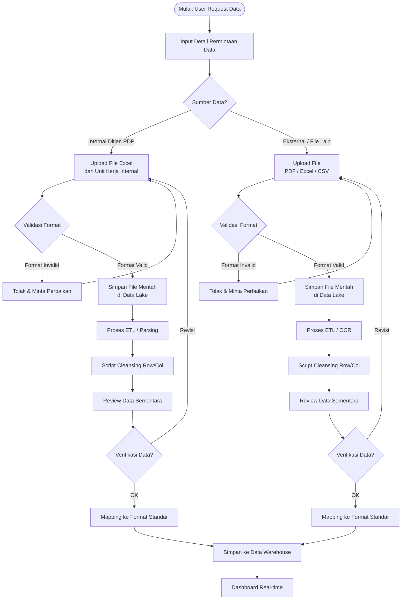

Sources: [_walkthrough.md:45-86](https://github.com/anbe-on/integrasi_data_skor_rekomendasi_desa/blob/main/_walkthrough.md#2-alur-logika-sistem-flowchart)

## Data Management

The system employs a flexible data model to accommodate varying data structures and ensures data quality through verification processes.

### Dynamic Data Structure

The core of the system's flexibility lies in its dynamic data structure, primarily managed by the `DATA_VALUES` table. This approach allows for the ingestion of data with inconsistent formats without requiring schema modifications.

**`DATA_VALUES` Table Structure:**

| Column            | Usage                                         |
|-------------------|-----------------------------------------------|
| `label_kunci`     | Dynamic field name (e.g., "Jumlah Petani")    |
| `nilai_angka`     | Quantitative data                             |
| `nilai_teks`      | Qualitative data                              |
| `detail_attributes` | JSON column for complex/nested structures     |

Sources: [_walkthrough.md:133-142](https://github.com/anbe-on/integrasi_data_skor_rekomendasi_desa/blob/main/_walkthrough.md#tabel-struktur-data-dinamis)

**Example `detail_attributes`:**

```json
{
  "breakdown_per_desa": [
    {"nama_desa": "Sukamaju", "jumlah": 150},
    {"nama_desa": "Cibadak", "jumlah": 230}
  ],
  "catatan": "Data per Desember 2024",
  "sumber_asli": "Laporan Camat"
}
```

Sources: [_walkthrough.md:144-153](https://github.com/anbe-on/integrasi_data_skor_rekomendasi_desa/blob/main/_walkthrough.md#contoh-penggunaan-detail_attributes)

### Dashboard Configuration

The `DASHBOARD_CONFIG` table enables administrators to configure dashboard visualizations through a user interface, eliminating the need for coding.

**`DASHBOARD_CONFIG` Table:**

| Aspect        | Description                                       |
|---------------|---------------------------------------------------|
| Configuration | Select dataset, chart type, X/Y axes              |
| User Interface| Admin-managed without coding                      |

Sources: [_walkthrough.md:157-161](https://github.com/anbe-on/integrasi_data_skor_rekomendasi_desa/blob/main/_walkthrough.md#tabel-konfigurasi-dashboard)

### Human-in-the-Loop Verification

A crucial step in the data pipeline is manual verification, especially for data from external sources like scanned PDFs, to ensure data quality and prevent the "Garbage In, Garbage Out" phenomenon.

**Verification Workflow:**
- **OK**: Data proceeds to standard format mapping.
- **Revisi**: User is prompted for re-upload or manual correction.

Sources: [_walkthrough.md:184-192](https://github.com/anbe-on/integrasi_data_skor_rekomendasi_desa/blob/main/_walkthrough.md#human-in-the-loop-verification)

## Key Features and Technologies

The system incorporates several features and recommended technologies to achieve its objectives.

### Data Governance

| Aspect         | Implementation                                   |
|----------------|--------------------------------------------------|
| **Audit Trail**| Raw files (original PDFs) stored in Data Lake    |
| **Data Quality**| Human-in-the-loop verification                   |
| **Traceability**| Data linked to `request_id` and `source_id`      |

Sources: [_walkthrough.md:164-171](https://github.com/anbe-on/integrasi_data_skor_rekomendasi_desa/blob/main/_walkthrough.md#41-data-governance)

### Scalability

The architecture is designed for scalability, particularly in handling new data formats.

```
┌─────────────────────────────────────────────────────────────┐
│  Format Baru Masuk?                                         │
│  ───────────────────                                        │
│  ✅ Tidak perlu ALTER TABLE                                 │
│  ✅ Cukup mapping ke label_kunci baru                       │
│  ✅ Gunakan detail_attributes untuk struktur kompleks       │
└─────────────────────────────────────────────────────────────┘
```

Sources: [_walkthrough.md:173-181](https://github.com/anbe-on/integrasi_data_skor_rekomendasi_desa/blob/main/_walkthrough.md#42-skalabilitas)

### User Experience

The system provides tailored experiences for different user roles:

-   **Staff**: Automated file uploads with validation.
-   **Admin**: Dashboard configuration via a User Interface (UI).
-   **Pimpinan**: Real-time, informative dashboards.

Sources: [_walkthrough.md:183-187](https://github.com/anbe-on/integrasi_data_skor_rekomendasi_desa/blob/main/_walkthrough.md#43-user-experience)

### Recommended Technologies

| Layer          | Recommended Options                               |
|----------------|---------------------------------------------------|
| **Data Lake**  | MinIO, AWS S3, Azure Blob                         |
| **Database**   | PostgreSQL (with JSONB support)                   |
| **ETL**        | Apache Airflow, Prefect, or Python scripts        |
| **OCR**        | Tesseract, Adobe PDF Extract, AWS Textract        |
| **Dashboard**  | Metabase, Apache Superset, or custom web app      |
| **Backend API**| Laravel, FastAPI, or NestJS                       |

Sources: [_walkthrough.md:190-198](https://github.com/anbe-on/integrasi_data_skor_rekomendasi_desa/blob/main/_walkthrough.md#5-teknologi-yang-direkomendasikan)

## Implementation Steps

The project outlines a series of steps for implementation, from infrastructure setup to production deployment.

-   [ ] Setup Data Lake infrastructure
-   [ ] Implement database schema (PostgreSQL)
-   [ ] Develop upload & validation module
-   [ ] Setup ETL pipeline for Excel/CSV
-   [ ] Integrate OCR for PDF processing
-   [ ] Build review & approval workflow
-   [ ] Develop dashboard configuration UI
-   [ ] End-to-end testing with real data
-   [ ] Deploy to production environment

Sources: [_walkthrough.md:200-209](https://github.com/anbe-on/integrasi_data_skor_rekomendasi_desa/blob/main/_walkthrough.md#6-langkah-implementasi-selanjutnya)

## Backend and Middleware Logic

The backend and middleware components handle data processing, Excel generation, and database interactions.

### Excel Generation (`desa_db/middleware.py`)

The `build_excel` function is responsible for creating an Excel workbook with multiple sheets:

-   **Sheet 1: Grid Data**: Displays raw data based on filters, with styling for headers and data cells.
-   **Sheet 2: Dashboard Rekomendasi**: Loads configuration from `table_structure.csv`, determines metric columns, and generates statistics and narrative content. It includes complex header merging and rowspans.
-   **Sheet 3: Dashboard IKU**: Processes `table_structure_IKU.csv` and `iku_mapping.json` to calculate IKU scores based on grouping levels (Provinsi, Kabupaten, Kecamatan, Desa). It applies heatmaps and specific number formatting.

Sources: [desa_db/middleware.py:25-234](https://github.com/anbe-on/integrasi_data_skor_rekomendasi_desa/blob/main/desa_db/middleware.py#L25-L234)

### Database Schema Management (`desa_db/server.py`)

The `create_tables` function ensures that the necessary database tables (`master_data` and `master_data_history`) exist.

-   **`master_data` Table**: Stores the latest snapshot of data. It includes metadata like `last_updated` and `source_file`, and its columns are dynamically defined based on headers, with specific columns (e.g., "Provinsi", "Desa") set as `VARCHAR` and score columns as `TINYINT`. An index is created on the `ID_COL`.
-   **`master_data_history` Table**: Acts as an audit log for data changes.

Sources: [desa_db/server.py:21-58](https://github.com/anbe-on/integrasi_data_skor_rekomendasi_desa/blob/main/desa_db/server.py#L21-L58)

## Frontend Configuration (`front_end/tailwind.config.js`)

The Tailwind CSS configuration file defines project-wide styling settings.

-   **`darkMode: 'class'`**: Enables dark mode based on a class.
-   **`content`**: Specifies paths to scan for HTML and JavaScript files to generate CSS (`["./**/*.html", "./static/**/*.js"]`).
-   **`theme.extend`**: Allows for extending default Tailwind CSS theme configurations.
-   **`plugins`**: Lists any Tailwind CSS plugins used.

Sources: [front_end/tailwind.config.js:3-9](https://github.com/anbe-on/integrasi_data_skor_rekomendasi_desa/blob/main/front_end/tailwind.config.js#L3-L9)

## Testing (`tests/server_test.py`)

The `server_test.py` file contains unit tests for the backend functionality.

-   **Mock Data Creation**: The `create_mock_config` fixture generates mock configuration files (`headers.json`, `table_structure.csv`, `iku_mapping.json`, `rekomendasi.json`) required for testing.
-   **Client Override**: The `client` fixture provides a FastAPI test client and overrides authentication dependencies to allow direct testing of endpoints by bypassing authentication.

Sources: [tests/server_test.py:10-35](https://github.com/anbe-on/integrasi_data_skor_rekomendasi_desa/blob/main/tests/server_test.py#L10-L35)

## Configuration Files

Configuration is managed through various JSON and CSV files located in the `.config/` directory.

| File Name             | Description                                                              |
|-----------------------|--------------------------------------------------------------------------|
| `auth_users.json`     | Stores user authentication details.                                      |
| `headers.json`        | Defines standard headers and their aliases for data mapping.             |
| `intervensi_kegiatan.json` | Contains templates for intervention and activity narratives.             |
| `rekomendasi.json`    | Maps score values to corresponding recommendation text.                  |
| `table_structure.csv` | Defines the structure for dashboard recommendations, including dimensions. |
| `table_structure_IKU.csv` | Defines the structure for IKU (Indikator Kinerja Utama) dashboards.      |
| `iku_mapping.json`    | Maps parent metrics to child score columns for IKU calculations.         |

Sources: [README.md:3-9](https://github.com/anbe-on/integrasi_data_skor_rekomendasi_desa/blob/main/README.md#configuration-files), [desa_db/middleware.py:34-44](https://github.com/anbe-on/integrasi_data_skor_rekomendasi_desa/blob/main/desa_db/middleware.py#L34-L44), [desa_db/middleware.py:216-221](https://github.com/anbe-on/integrasi_data_skor_rekomendasi_desa/blob/main/desa_db/middleware.py#L216-L221), [tests/server_test.py:13-33](https://github.com/anbe-on/integrasi_data_skor_rekomendasi_desa/blob/main/tests/server_test.py#L13-L33)

---

<a id='page-requirements'></a>

## System Requirements

### Related Pages

Related topics: [Project Overview](#page-overview), [Docker Setup and Usage](#page-docker-setup)

<details>
<summary>Relevant source files</summary>

- [README.md](https://github.com/anbe-on/integrasi_data_skor_rekomendasi_desa/blob/main/README.md)
- [.config/requirements.txt](https://github.com/anbe-on/integrasi_data_skor_rekomendasi_desa/blob/main/.config/requirements.txt)
- [Dockerfile](https://github.com/anbe-on/integrasi_data_skor_rekomendasi_desa/blob/main/Dockerfile)
- [run_system.py](https://github.com/anbe-on/integrasi_data_skor_rekomendasi_desa/blob/main/run_system.py)
- [desa_db/middleware.py](https://github.com/anbe-on/integrasi_data_skor_rekomendasi_desa/blob/main/desa_db/middleware.py)
- [front_end/tailwind.config.js](https://github.com/anbe-on/integrasi_data_skor_rekomendasi_desa/blob/main/front_end/tailwind.config.js)
- [tests/server_test.py](https://github.com/anbe-on/integrasi_data_skor_rekomendasi_desa/blob/main/tests/server_test.py)
</details>

# System Requirements

This document outlines the system requirements for the "integrasi_data_skor_rekomendasi_desa" project, covering its technical dependencies, runtime environment, and build processes. The system is designed to integrate data for village score recommendations, implying a need for robust backend services, data processing capabilities, and a user interface. The requirements are detailed across various aspects, including software dependencies, containerization, local development setup, and testing procedures.

## Software Dependencies

The project relies on specific Python versions and packages for its operation. These are primarily managed through a `requirements.txt` file.

### Python Version

The system is developed for and requires Python 3.11.9.
Sources: [.config/requirements.txt:1]()

### Core Python Packages

The project utilizes a set of Python libraries essential for its backend functionality, data processing, and API serving. These are listed in the `.config/requirements.txt` file.

A partial list of key dependencies includes:
*   `fastapi`: For building the web API.
*   `uvicorn`: An ASGI server for running FastAPI applications.
*   `sqlalchemy`: For database interaction.
*   `pandas`: For data manipulation and analysis.
*   `openpyxl`: For reading and writing Excel files.
*   `python-dotenv`: For managing environment variables.
*   `pytest`: For running automated tests.
*   `requests`: For making HTTP requests.

Sources: [.config/requirements.txt]()

## Runtime Environment

The system can be deployed and run using Docker, which simplifies environment setup and ensures consistency across different deployment targets.

### Docker Containerization

A `Dockerfile` is provided to build a Docker image for the application. This image encapsulates the application and its dependencies, making it portable and easy to deploy.
Sources: [Dockerfile]()

The Dockerfile specifies:
*   A base Python image.
*   Installation of system dependencies.
*   Copying of application code and configuration files.
*   Exposing necessary ports.
*   Defining the command to run the application.

### Docker Compose

Docker Compose is recommended for orchestrating multi-container Docker applications. The `docker-compose up -d --build` command is used to build and start the application services in detached mode.
Sources: [README.md:32]()

## Local Development Setup

The project supports both Docker-based and traditional virtual environment-based local development setups.

### Docker-based Setup

1.  **Install Docker and Docker Compose:** Ensure Docker and Docker Compose are installed on the development machine. WSL (Windows Subsystem for Linux) is recommended for Windows users.
    Sources: [README.md:34]()
2.  **Create `.env` file:** A `.env` file is required to store application secrets. A `APP_SECRET_KEY` can be generated using `openssl rand -hex 32`.
    Sources: [README.md:42]()
3.  **Compile Tailwind CSS:** If `output.css` does not exist, Tailwind CSS needs to be compiled from `input.css`. This involves installing Tailwind CSS, PostCSS, and Autoprefixer, configuring `tailwind.config.js`, and running the watch command.
    Sources: [README.md:48]()
4.  **Run Docker Compose:** Execute `docker compose up -d --build` to start the backend and frontend services.
    Sources: [README.md:58]()

### Virtual Environment Setup (Not Recommended)

An alternative setup involves creating and activating a Python virtual environment, then installing dependencies using `pip`.
Sources: [README.md:66]()
1.  **Create Virtual Environment:** `Python311 -m venv .venv`
2.  **Activate Virtual Environment:** `source .venv/Scripts/activate`
3.  **Install Dependencies:** `pip install -r .config/requirements.txt`

### Running the Application

*   **Run Backend + Middleware:** `python desa_db/server.py`
*   **Run Both Frontend and Backend:** `python run_system.py`
*   **Deprecated Mock Frontend:** `streamlit run tests/serverSheets_test.py`

Sources: [README.md:71](), [README.md:75](), [README.md:78]()

The `run_system.py` script orchestrates the startup of both the backend and frontend services. It sets environment variables such as `API_BROWSER_URL`, `API_BASE_URL`, and `APP_SECRET_KEY`.
Sources: [run_system.py:13]()

## Testing

Automated tests are provided to ensure the functionality and stability of the system.

### Unit Testing

The project uses `pytest` for running tests. Unit tests can be executed using the command:
`pytest tests/server_test.py`
Sources: [README.md:62]()

The `tests/server_test.py` file includes fixtures for setting up mock configurations and a test client, including mocking authentication for direct endpoint testing.
Sources: [tests/server_test.py:10]()

## Configuration Files

Configuration settings are managed in various files, primarily within the `.config/` directory.

### Configuration Directory

The `.config/` directory contains several JSON and CSV files used for application configuration and data structuring.
Sources: [README.md:2]()

*   `auth_users.json`: Stores authentication-related user data.
*   `headers.json`: Defines header mappings for data processing.
*   `intervensi_kegiatan.json`: Contains templates for intervention activities.
*   `rekomendasi.json`: Holds logic for score-based recommendations.
*   `table_structure.csv`: Defines the structure for dashboard data.
*   `table_structure_IKU.csv`: Defines the structure for IKU (Indikator Kinerja Utama) dashboards.
*   `iku_mapping.json`: Maps IKU parents to their corresponding metrics.

Sources: [README.md:2](), [tests/server_test.py:11](), [tests/server_test.py:15](), [tests/server_test.py:19](), [tests/server_test.py:23]()

## Frontend Configuration

The frontend styling is managed using Tailwind CSS.

### Tailwind CSS Configuration

The `front_end/tailwind.config.js` file configures Tailwind CSS. It specifies the `content` paths to scan for HTML and JS files to generate CSS, and can extend default theme settings.
Sources: [front_end/tailwind.config.js]()

The `output.css` file is the compiled CSS output from Tailwind CSS, containing all the necessary styles for the frontend.
Sources: [front_end/tailwind.config.js:5]()

## System Architecture Overview (High-Level)

The system employs a hybrid architecture combining a Data Lake for raw file storage, ETL pipelines for data transformation, a relational database with JSON flexibility for data management, and a configuration-driven dashboard for visualization.
Sources: [_walkthrough.md:12]()

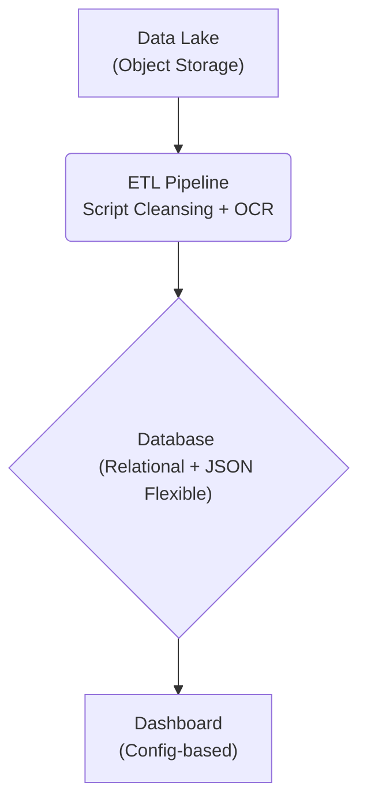

This architecture allows for handling diverse data formats and provides a no-code solution for dashboard creation.
Sources: [_walkthrough.md:12]()

---

<a id='page-architecture-overview'></a>

## Architecture Overview

### Related Pages

Related topics: [Component Relationships](#page-component-relationships), [Data Flow Diagram](#page-data-flow)

<details>
<summary>Relevant source files</summary>

- [docker-compose.yml](https://github.com/anbe-on/integrasi_data_skor_rekomendasi_desa/blob/main/docker-compose.yml)
- [run_system.py](https://github.com/anbe-on/integrasi_data_skor_rekomendasi_desa/blob/main/run_system.py)
- [nginx.conf](https://github.com/anbe-on/integrasi_data_skor_rekomendasi_desa/blob/main/nginx.conf)
- [README.md](https://github.com/anbe-on/integrasi_data_skor_rekomendasi_desa/blob/main/README.md)
- [desa_db/server.py](https://github.com/anbe-on/integrasi_data_skor_rekomendasi_desa/blob/main/desa_db/server.py)
- [front_end/templates/login.html](https://github.com/anbe-on/integrasi_data_skor_rekomendasi_desa/blob/main/front_end/templates/login.html)
- [front_end/tailwind.config.js](https://github.com/anbe-on/integrasi_data_skor_rekomendasi_desa/blob/main/front_end/tailwind.config.js)
- [front_end/static/css/output.css](https://github.com/anbe-on/integrasi_data_skor_rekomendasi_desa/blob/main/front_end/static/css/output.css)
- [_walkthrough.md](https://github.com/anbe-on/integrasi_data_skor_rekomendasi_desa/blob/main/_walkthrough.md)
- [tests/server_test.py](https://github.com/anbe-on/integrasi_data_skor_rekomendasi_desa/blob/main/tests/server_test.py)

</details>

# Architecture Overview

This document outlines the overall architecture of the data integration system for village score recommendations. The system is designed to ingest data from various sources, process it, and present it through a dashboard for leadership. It employs a hybrid approach, combining a data lake for raw storage, ETL pipelines for data transformation, a flexible database for structured and dynamic data, and a configuration-driven dashboard for visualization. The architecture aims for scalability, data governance, and a user-friendly experience for different user roles.

The system's architecture can be broadly categorized into several layers: Data Ingestion, Data Processing (ETL), Data Storage, and Data Presentation (Dashboard). Each layer utilizes specific technologies and approaches to fulfill its role in the data pipeline.

Sources: [_walkthrough.md:1-17]()

## System Components and Layers

The system adopts a hybrid architecture that integrates multiple components to handle diverse data formats and provide interactive visualizations.

### Data Lake

The Data Lake serves as the primary storage for raw, unprocessed data files. This includes various formats such as PDF, Excel, and CSV, which are stored as archives.

Sources: [_walkthrough.md:20-24]()

### ETL Pipeline

The ETL (Extract, Transform, Load) pipeline is responsible for cleaning and transforming the raw data into a standardized format. This layer utilizes scripting for cleansing and Optical Character Recognition (OCR) for extracting text from documents like PDFs.

Sources: [_walkthrough.md:26-28]()

### Database Layer

The database layer is designed for both user management and handling dynamic data structures. It comprises a relational database for structured user information and a JSON-flexible database to accommodate evolving data schemas. This flexibility is crucial for handling inconsistent data formats from different regions without requiring schema alterations.

Sources: [_walkthrough.md:30-34](), [_walkthrough.md:80-83]()

#### `DATA_VALUES` Table

This table is central to the system's flexibility, employing an Entity-Attribute-Value (EAV) model. It allows the system to accept varying data formats without `ALTER TABLE` operations.

| Kolom             | Penggunaan                                    |
| :---------------- | :-------------------------------------------- |
| `label_kunci`     | Dynamic field name (e.g., "Jumlah Petani")    |
| `nilai_angka`     | Quantitative data                             |
| `nilai_teks`      | Qualitative data                              |
| `detail_attributes` | JSON column for complex/nested structures     |

Example of `detail_attributes` usage:

```json
{
  "breakdown_per_desa": [
    {"nama_desa": "Sukamaju", "jumlah": 150},
    {"nama_desa": "Cibadak", "jumlah": 230}
  ],
  "catatan": "Data per Desember 2024",
  "sumber_asli": "Laporan Camat"
}
```

Sources: [_walkthrough.md:85-101]()

#### `DASHBOARD_CONFIG` Table

This table supports self-service visualization, allowing administrators to configure dashboards through a user interface without writing code. Admins can select datasets, chart types, and axis configurations.

Sources: [_walkthrough.md:103-106]()

### Dashboard

The dashboard layer provides informative, real-time visualizations. It is configured based on tables, enabling visualization without coding.

Sources: [_walkthrough.md:36-38]()

## System Workflow and Data Flow

The system processes data through a series of steps, from ingestion to visualization.

### Data Ingestion and Processing Flow

The system handles data from both internal and external sources.

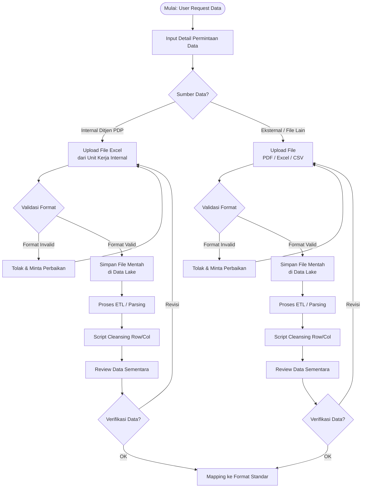

Sources: [_walkthrough.md:42-76]()

### Excel Generation Workflow

The system generates Excel workbooks for data export and dashboard pre-rendering.

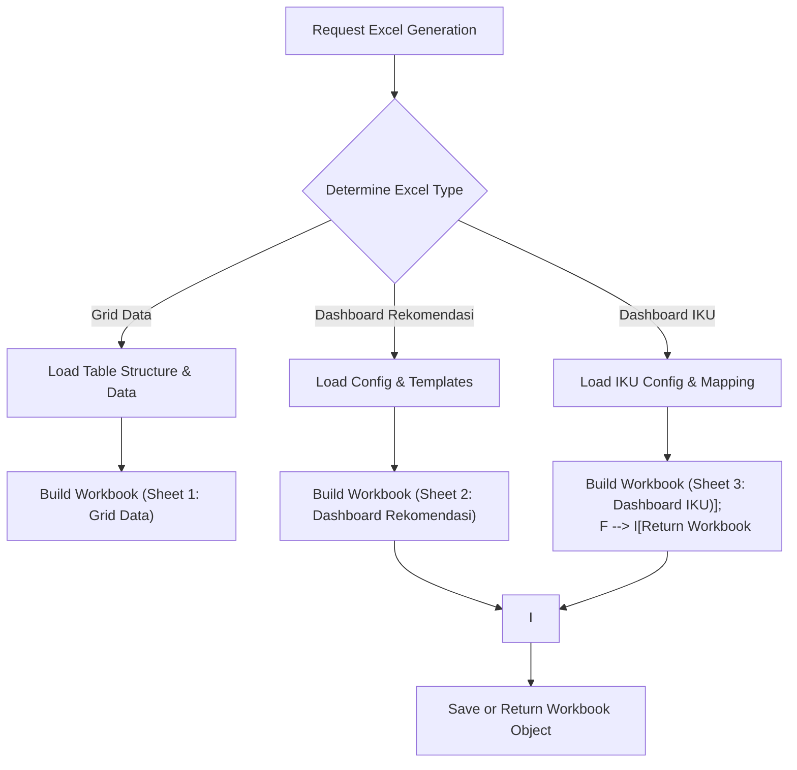

Sources: [desa_db/middleware.py:136-151]()

## Key Features and Benefits

### Data Governance

The architecture emphasizes data governance through audit trails, data quality checks, and traceability.

| Aspek         | Implementasi                                    |
| :------------ | :---------------------------------------------- |
| Audit Trail   | Raw files (original PDF) stored in Data Lake    |
| Data Quality  | Human-in-the-loop verification before warehouse |
| Traceability  | Data linked to `request_id` and `source_id`     |

Sources: [_walkthrough.md:111-118]()

### Scalability

The system is designed to be scalable, particularly due to its flexible data structure that avoids `ALTER TABLE` for new data formats.

Sources: [_walkthrough.md:119-126]()

### User Experience

Different user roles have tailored experiences:
-   **Staff**: File upload with automatic validation.
-   **Admin**: Dashboard configuration via UI.
-   **Pimpinan (Leadership)**: Real-time, informative dashboards.

Sources: [_walkthrough.md:128-132]()

## Technology Stack Recommendations

The system suggests a range of technologies for different layers of the architecture.

| Layer         | Recommended Options                               |
| :------------ | :------------------------------------------------ |
| Data Lake     | MinIO, AWS S3, Azure Blob                         |
| Database      | PostgreSQL (with JSONB support)                   |
| ETL           | Apache Airflow, Prefect, or Python scripts        |
| OCR           | Tesseract, Adobe PDF Extract, AWS Textract        |
| Dashboard     | Metabase, Apache Superset, or custom web app      |
| Backend API   | Laravel, FastAPI, or NestJS                       |

Sources: [_walkthrough.md:134-141]()

## Implementation Steps

The following steps outline the path for implementing the system.

-   [ ] Setup Data Lake infrastructure
-   [ ] Implement database schema (PostgreSQL)
-   [ ] Develop upload & validation module
-   [ ] Setup ETL pipeline for Excel/CSV
-   [ ] Integrate OCR for PDF processing
-   [ ] Build review & approval workflow
-   [ ] Develop dashboard configuration UI
-   [ ] End-to-end testing with real data
-   [ ] Deploy to production environment

Sources: [_walkthrough.md:143-151]()

## Deployment and Execution

The system can be run using Docker Compose for a streamlined deployment. Alternatively, manual setup of backend, frontend, and virtual environment is possible.

### Docker Deployment

Docker Compose is recommended for setting up the entire system, including the backend, frontend, and any necessary services.

```bash
docker compose up -d --build
```

This command builds the Docker images and starts the containers in detached mode. The system will automatically attempt to prepare downloadable Excel files from the database upon startup.

Sources: [README.md:47-54]()

### Manual Execution

For manual execution, Python environments and specific scripts are used.

1.  **Virtual Environment Setup**:
    ```bash
    Python311 -m venv .venv
    source .venv/Scripts/activate
    pip install -r .config/requirements.txt
    ```
    Sources: [README.md:60-63]()

2.  **Running Backend and Middleware**:
    ```bash
    python desa_db/server.py
    ```
    Sources: [README.md:65-66]()

3.  **Running Frontend and Backend**:
    ```bash
    python run_system.py
    ```
    This script initiates both the backend and frontend processes.

    The `run_system.py` script configures environment variables for API URLs and starts the backend and frontend applications as subprocesses. It provides feedback on the startup process and displays the running URLs.

    Sources: [run_system.py:42-67]()

### Nginx Configuration

Nginx is used as a reverse proxy to manage incoming requests and direct them to the appropriate backend services.

```nginx
# Example Nginx Configuration Snippet
server {
    listen 80;
    server_name localhost; # Replace with your domain name

    location / {
        proxy_pass http://backend:8000; # Assuming backend service is named 'backend' in docker-compose
        proxy_set_header Host $host;
        proxy_set_header X-Real-IP $remote_addr;
        proxy_set_header X-Forwarded-For $proxy_add_x_forwarded_for;
        proxy_set_header X-Forwarded-Proto $scheme;
    }

    location /static/ {
        alias /app/front_end/static/; # Path to static files within the container
    }

    location /api/ {
        proxy_pass http://backend:8000;
        proxy_set_header Host $host;
        proxy_set_header X-Real-IP $remote_addr;
        proxy_set_header X-Forwarded-For $proxy_add_x_forwarded_for;
        proxy_set_header X-Forwarded-Proto $scheme;
    }

    # Add other locations for frontend assets if served separately
}
```

Sources: [nginx.conf:1-26]()

## Configuration

Configuration files are organized within the `.config/` directory.

```
/.config/
├── auth_users.json
├── headers.json
├── intervensi_kegiatan.json
├── rekomendasi.json
├── table_structure.csv
└── table_structure_IKU.csv
```

Sources: [README.md:6-11]()

### Environment Variables

An `.env` file is used to store sensitive configuration, such as the application's secret key.

```
APP_SECRET_KEY=
```

The `APP_SECRET_KEY` can be generated using:

```bash
openssl rand -hex 32
```

Sources: [README.md:13-19]()

### Tailwind CSS Compilation

If `output.css` is not present, Tailwind CSS needs to be compiled.

1.  **Install Dependencies**:
    ```bash
    cd front_end/
    npm install -D tailwindcss@3 postcss autoprefixer
    npx tailwindcss init
    ```
    Sources: [README.md:21-25]()

2.  **Configure `tailwind.config.js`**:
    ```javascript
    /** @type {import('tailwindcss').Config} */
    module.exports = {
      darkMode: 'class',
      content: ["./**/*.html", "./static/**/*.js"],
      theme: {
        extend: {},
      },
      plugins: [],
    }
    ```
    Sources: [front_end/tailwind.config.js:2-9](), [README.md:27-37]()

3.  **Compile CSS**:
    ```bash
    npx tailwindcss -i ./static/css/input.css -o ./static/css/output.css --watch
    ```
    Sources: [README.md:39-41]()

## Testing

Unit tests for the server components are available.

```bash
pytest tests/server_test.py
```

The `server_test.py` file includes fixtures for setting up mock configuration files and a test client with bypassed authentication.

Sources: [README.md:43-45](), [tests/server_test.py:1-11]()

## Authentication and User Management

The system supports user authentication and role-based access.

-   **Login Endpoint**: The `/api/login` endpoint handles user authentication using username and password. It validates credentials against a `users_db` and issues a JWT (JSON Web Token) stored in an HttpOnly cookie named `session_token`.
    Sources: [desa_db/server.py:61-83]()
-   **User Roles**: Users are assigned roles (e.g., 'admin'), which determine their access privileges.
    Sources: [desa_db/server.py:78]()
-   **Login Page**: A dedicated HTML page (`front_end/templates/login.html`) provides the user interface for logging in, featuring a textured background and a split header design.
    Sources: [front_end/templates/login.html:1-12](), [front_end/templates/login.html:20-28]()

The `auth_users.json` file stores user credentials, including hashed passwords and roles. The `add_user.py` script can be used to add new users to this configuration.

Sources: [README.md:7-9](), [README.md:32-35]()

---

<a id='page-component-relationships'></a>

## Component Relationships

### Related Pages

Related topics: [Architecture Overview](#page-architecture-overview), [Backend API Endpoints](#page-backend-api), [Frontend Overview](#page-frontend-overview)

<details>
<summary>Relevant source files</summary>

- [docker-compose.yml](https://github.com/anbe-on/integrasi_data_skor_rekomendasi_desa/blob/main/docker-compose.yml)
- [run_system.py](https://github.com/anbe-on/integrasi_data_skor_rekomendasi_desa/blob/main/run_system.py)
- [nginx.conf](https://github.com/anbe-on/integrasi_data_skor_rekomendasi_desa/blob/main/nginx.conf)
- [desa_db/server.py](https://github.com/anbe-on/integrasi_data_skor_rekomendasi_desa/blob/main/desa_db/server.py)
- [front_end/router.py](https://github.com/anbe-on/integrasi_data_skor_rekomendasi_desa/blob/main/front_end/router.py)
- [front_end/static/css/output.css](https://github.com/anbe-on/integrasi_data_skor_rekomendasi_desa/blob/main/front_end/static/css/output.css)
- [_walkthrough.md](https://github.com/anbe-on/integrasi_data_skor_rekomendasi_desa/blob/main/_walkthrough.md)
- [tests/server_test.py](https://github.com/anbe-on/integrasi_data_skor_rekomendasi_desa/blob/main/tests/server_test.py)

</details>

# Component Relationships

This document outlines the relationships and interactions between the various components of the "integrasi_data_skor_rekomendasi_desa" system. The system is designed to integrate data from diverse sources, process it, and present it through interactive dashboards, catering to different user roles. The architecture employs a hybrid approach, combining a data lake, ETL pipelines, databases, and a configurable dashboard.

The system's core components include a backend API (FastAPI), a frontend web application (likely a separate framework or custom build), and supporting services managed via Docker Compose. The frontend interacts with the backend API for data retrieval and operations, while the backend handles data processing, database interactions, and business logic.

## System Architecture Overview

The system is structured to handle data ingestion, processing, and presentation. Key components and their interactions are managed through Docker Compose, allowing for a containerized deployment. The `run_system.py` script orchestrates the startup of these services.

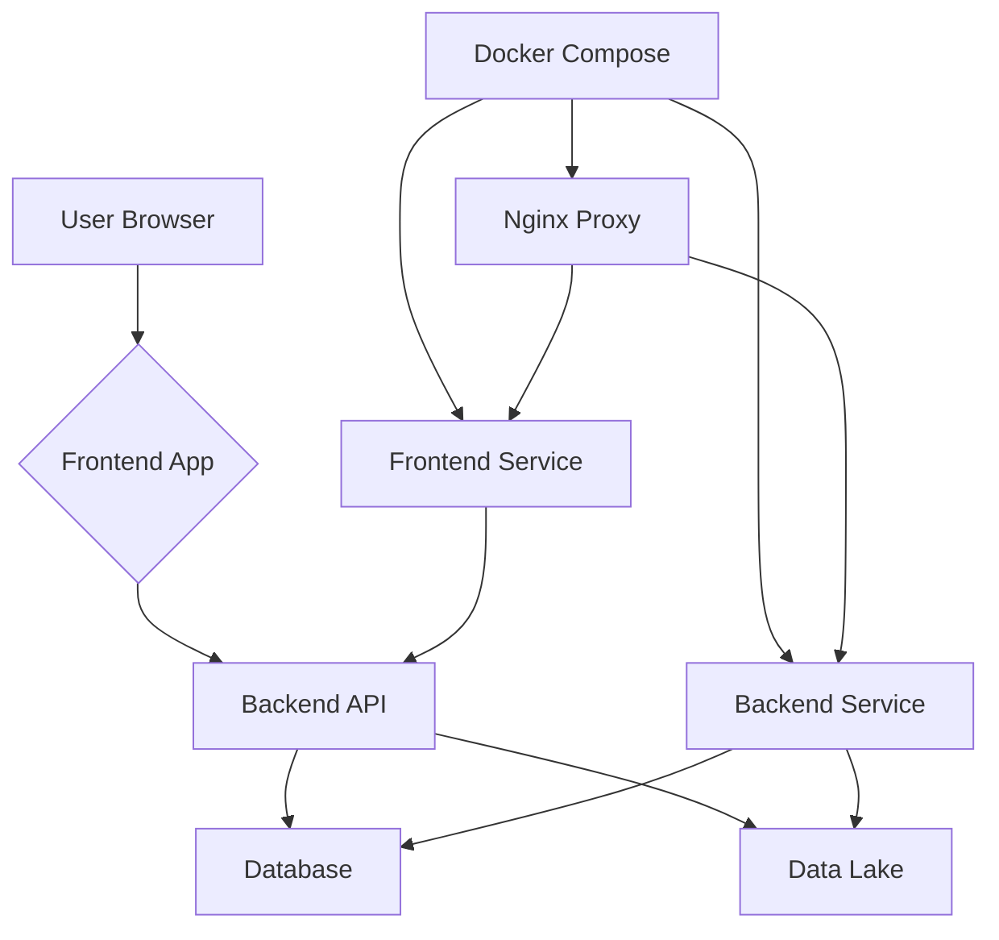

Sources: [run_system.py:34-71](), [docker-compose.yml]()

## Backend API (FastAPI)

The backend API, built with FastAPI, serves as the central hub for data processing and business logic. It exposes endpoints for data retrieval, manipulation, and dashboard generation.

### Core Functionality

The backend handles various tasks including:
- Database connections and operations.
- Data cleansing and transformation.
- Generating header mappings for data.
- Processing temporary files for data ingestion.
- Building dynamic database queries.
- Caching data.
- Retrieving and creating intervention templates.
- Calculating dashboard statistics.
- Rendering dashboard views (HTML).
- Generating Excel workbooks.
- Background tasks for pre-rendering Excel files.

Sources: [desa_db/server.py:32-63]()

### API Endpoints and Routing

The `front_end/router.py` file defines the routing for the frontend application, which interacts with the backend API. The frontend routes handle user authentication, redirection to specific dashboards (admin, user), and logout functionality. The `api_url` is configured to point to the backend service.

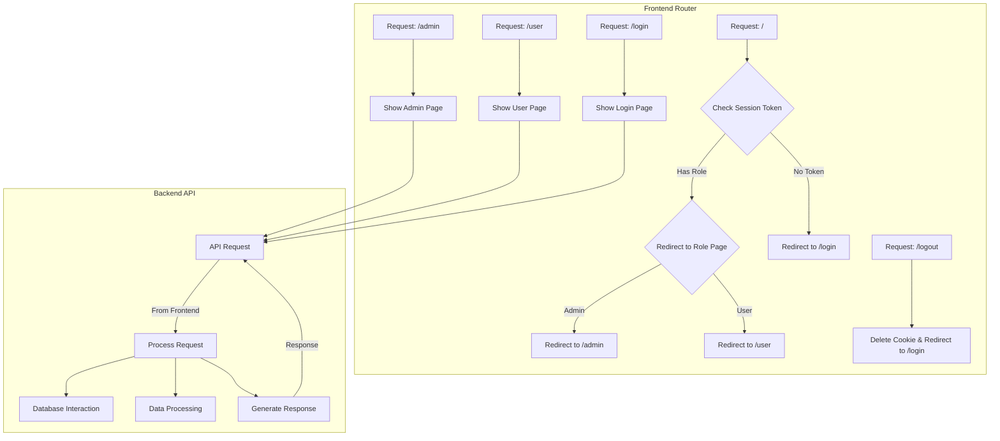

Sources: [front_end/router.py:12-56](), [desa_db/server.py:32-63]()

## Frontend Application

The frontend provides the user interface for interacting with the system. It includes login pages, admin dashboards, and user dashboards. The frontend communicates with the backend API to fetch and display data.

### UI Components and Templates

The frontend utilizes HTML templates for rendering different views. The `front_end/templates/login.html` file defines the structure and styling for the login page, incorporating a textured background and a split header design. The `front_end/static/css/output.css` file contains Tailwind CSS classes used for styling.

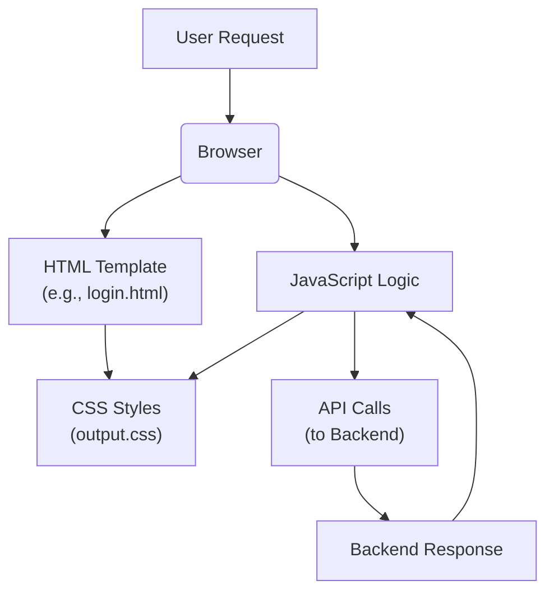

Sources: [front_end/templates/login.html](), [front_end/static/css/output.css]()

## Data Management and Configuration

The system relies on configuration files and database schemas to manage data and system behavior.

### Configuration Files

Various JSON and CSV files in the `.config/` directory store system configurations:
- `auth_users.json`: User credentials.
- `headers.json`: Header mappings for data processing.
- `intervensi_kegiatan.json`: Templates for intervention activities.
- `rekomendasi.json`: Recommendation logic.
- `table_structure.csv`: Defines the structure for dashboard data tables.
- `table_structure_IKU.csv`: Defines the structure for IKU (Indikator Kinerja Utama) dashboard data.
- `iku_mapping.json`: Maps IKU indicators to data columns.

Sources: [README.md:2-8](), [tests/server_test.py:10-35]()

### Database Schema

The system uses a relational database. The `desa_db/middleware.py` file contains logic that interacts with a `master_data` table, suggesting a schema for storing master data, and potentially other tables for dynamic data values. The `_walkthrough.md` file mentions a `DATA_VALUES` table with `label_kunci`, `nilai_angka`, `nilai_teks`, and `detail_attributes` (JSONB) columns for flexible data storage.

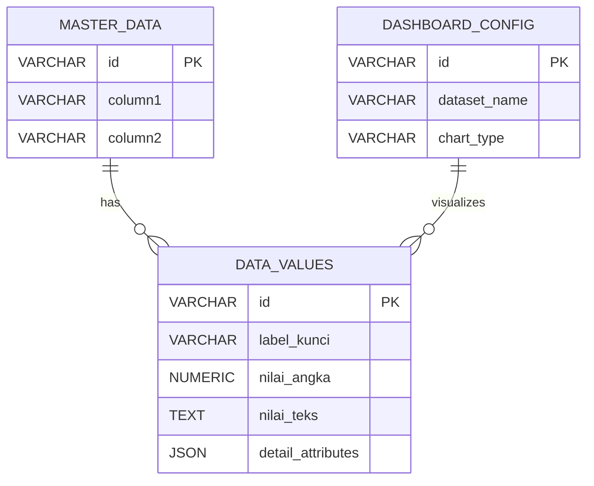

Sources: [desa_db/middleware.py:115-127](), [_walkthrough.md:167-186]()

## Deployment and Orchestration

Docker Compose is used to define and manage the deployment of the system's services, including the backend, frontend, and potentially a reverse proxy like Nginx.

### Docker Compose Services

The `docker-compose.yml` file defines the services:
- `backend`: Runs the FastAPI application.
- `frontend`: Runs the frontend web application.
- `nginx`: Acts as a reverse proxy to route traffic to the backend and frontend.

The `run_system.py` script utilizes `subprocess.Popen` to start these services, managing their lifecycle.

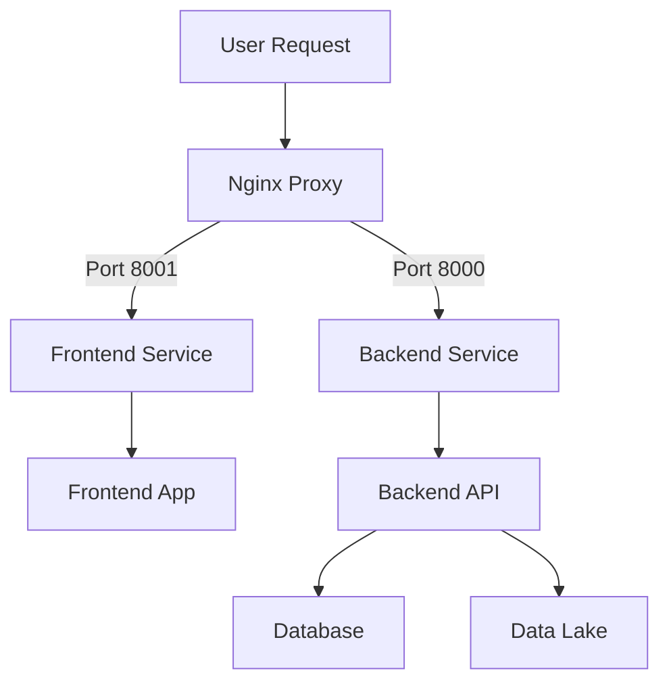

Sources: [docker-compose.yml](), [run_system.py:34-71](), [nginx.conf]()

### Nginx Configuration

Nginx is configured to act as a reverse proxy, directing incoming requests to the appropriate services based on port numbers. It forwards requests to the frontend on port 8001 and to the backend API on port 8000.

```mermaid
graph TD
    A[External Request] --> B(Nginx);
    B -- / --> C[Frontend (Port 8001)];
    B -- /api --> D[Backend API (Port 8000)];
```

Sources: [nginx.conf]()

## Testing

The `tests/server_test.py` file contains unit tests for the backend API, including mocking configuration files and testing API endpoints. The `client()` fixture provides a test client for FastAPI, bypassing authentication for testing purposes.

```mermaid
graph TD
    A[Test Runner] --> B[Pytest];
    B --> C[Server Test Suite];
    C --> D[Mock Configuration];
    C --> E[API Endpoint Tests];
    E --> F[Mock Database <br/> (if applicable)];
```

Sources: [tests/server_test.py:1-75]()

## Conclusion

The "Component Relationships" within the integrasi_data_skor_rekomendasi_desa system illustrate a well-defined microservices-like architecture. The frontend, backend API, and supporting infrastructure (Docker, Nginx) work in concert to deliver a data integration and visualization platform. Configuration files and a flexible database schema enable adaptability to diverse data inputs and user requirements. The use of Python with FastAPI for the backend and standard web technologies for the frontend, orchestrated by Docker Compose, provides a robust and scalable solution.

---

<a id='page-data-upload'></a>

## Data Upload Process

### Related Pages

Related topics: [Data Flow Diagram](#page-data-flow), [Configuration Files](#page-configuration-files)

<details>
<summary>Relevant source files</summary>

- [desa_db/server.py](https://github.com/anbe-on/integrasi_data_skor_rekomendasi_desa/blob/main/desa_db/server.py)
- [tests/server_test.py](https://github.com/anbe-on/integrasi_data_skor_rekomendasi_desa/blob/main/tests/server_test.py)
- [desa_db/middleware.py](https://github.com/anbe-on/integrasi_data_skor_rekomendasi_desa/blob/main/desa_db/middleware.py)
- [README.md](https://github.com/anbe-on/integrasi_data_skor_rekomendasi_desa/blob/main/README.md)
- [front_end/templates/admin.html](https://github.com/anbe-on/integrasi_data_skor_rekomendasi_desa/blob/main/front_end/templates/admin.html)
- [front_end/static/css/output.css](https://github.com/anbe-on/integrasi_data_skor_rekomendasi_desa/blob/main/front_end/static/css/output.css)

</details>

# Data Upload Process

The data upload process is a critical component of the system, enabling users to ingest data from various file formats into the backend for processing, analysis, and visualization. This process is designed to be robust, handling different stages from initialization to finalization, and incorporating features like resumable uploads and integrity checks. The system supports Excel, CSV, and PDF files, with specific handling for each.

The overall data flow involves receiving a file, validating its integrity, processing it through ETL (Extract, Transform, Load) pipelines, and finally storing it in a structured format for dashboard consumption. The system emphasizes data quality through validation and review steps.

Sources: [desa_db/server.py:15-25]()

## Architecture Overview

The data upload process is managed by the backend API, primarily implemented in `desa_db/server.py`. It leverages a resumable upload mechanism to handle potentially large files and ensure data integrity. The process is secured with authentication and authorization checks, ensuring that only authorized users (e.g., Admins) can initiate and finalize uploads.

The process can be visualized as a series of steps:
1.  **Initialization**: The client initiates an upload, providing file metadata.
2.  **Chunking**: The file is split into chunks and uploaded sequentially.
3.  **Finalization**: All chunks are received, and the complete file is verified.
4.  **Processing**: The file undergoes ETL, including parsing, cleaning, and OCR if necessary.
5.  **Review and Approval**: Data is reviewed before being committed to the database.
6.  **Storage**: Processed data is stored in a structured format.

Sources: [desa_db/server.py:128-130]()

### Resumable Upload Mechanism

The system implements a resumable upload mechanism to handle large files and network interruptions gracefully. This involves three main API endpoints: `/upload/init/{year}`, `/upload/chunk/{year}`, and `/upload/finalize/{year}`.

*   **`/upload/init/{year}`**: This endpoint initializes the upload process. The client sends the filename, a unique file identifier (`file_uid`), total file size, and the MD5 hash of the entire file. The server checks if a partial upload already exists for this `file_uid` and returns the number of bytes already received, allowing the client to resume from that point. It also performs basic validation on the `file_uid` to prevent path traversal vulnerabilities.
    Sources: [desa_db/server.py:132-148]()
*   **`/upload/chunk/{year}`**: This endpoint handles the upload of individual file chunks. The client sends the `upload_id` (which is the `file_uid`), the `offset` indicating the start position of the chunk, and the `chunk_hash` for integrity verification. The server receives the chunk, verifies its hash against the provided `chunk_hash`, and appends the chunk's content to a temporary file. It returns the status and the number of bytes received.
    Sources: [desa_db/server.py:201-217]()
*   **`/upload/finalize/{year}`**: After all chunks are uploaded, this endpoint is called to finalize the process. It takes the `upload_id`, filename, and the total file hash. The server verifies the integrity of the complete file by comparing its MD5 hash with the provided `total_hash`. If the hashes match, the temporary file is renamed to a stable temporary file using a UUID, and its path is returned to the client.
    Sources: [desa_db/server.py:220-237]()

This resumable upload strategy ensures that uploads can be paused and resumed without losing progress, making it suitable for large datasets and potentially unstable network conditions.

#### Data Integrity Checks

Integrity checks are performed at multiple stages:
*   **Initial File Hash**: The client calculates and sends the MD5 hash of the entire file during initialization.
    Sources: [desa_db/server.py:139]()
*   **Chunk Hash**: Each uploaded chunk is verified against its provided MD5 hash by the server.
    Sources: [desa_db/server.py:207-208]()
*   **Final File Hash**: Upon finalization, the server recalculates the MD5 hash of the complete file and compares it with the initial hash provided by the client.
    Sources: [desa_db/server.py:227-230]()

These checks help prevent data corruption during transmission.

### File Processing Pipeline

Once a file is successfully uploaded and finalized, it enters the processing pipeline, which involves parsing, cleaning, and potentially OCR.

A flowchart illustrating the general data processing flow:

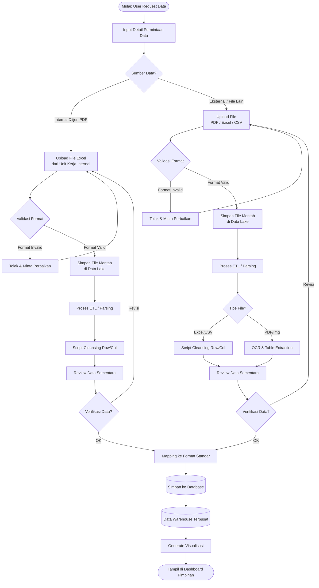

Sources: [_walkthrough.md:29-84]()

#### File Type Detection and Handling

The system differentiates handling based on file type:

*   **Excel/CSV**: These files are processed using script-based cleansing for rows and columns.
    Sources: [desa_db/server.py:184]()
*   **PDF/Images**: For these formats, Optical Character Recognition (OCR) and table extraction are employed. This step is noted as potentially complex, especially for image-based PDFs.
    Sources: [desa_db/server.py:186-187]()

#### Data Cleansing and Review

After initial parsing or OCR, a script performs row and column cleansing. This is followed by a "Review Data Sementara" (Temporary Data Review) stage. This manual review step is crucial for data quality, especially for data obtained via OCR, to prevent "Garbage In, Garbage Out". If the data requires revision, the user is prompted to upload again or make corrections. If approved, the data proceeds to the mapping stage.

Sources: [_walkthrough.md:32-33](), [desa_db/server.py:188-194]()

### Data Mapping and Storage

Once data is reviewed and approved, it undergoes mapping to a standard format. This mapped data is then stored in a central Data Warehouse.

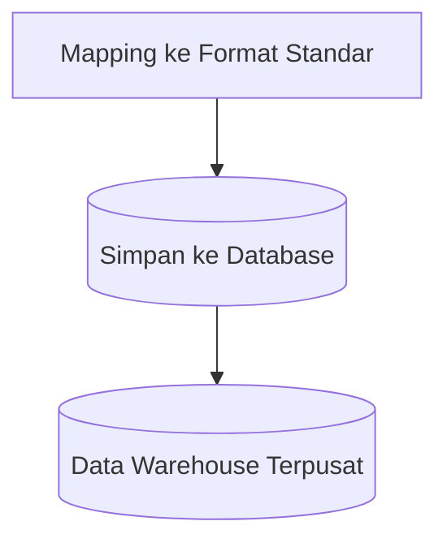

Sources: [_walkthrough.md:35-37]()

The database schema utilizes flexible structures, particularly a `DATA_VALUES` table with `label_kunci` and `detail_attributes` (JSONB) columns, to accommodate dynamic and inconsistent data formats from various regions without requiring `ALTER TABLE` operations.

Sources: [_walkthrough.md:44-58]()

## API Endpoints for Upload

The backend API exposes several endpoints to manage the upload process:

| Endpoint                     | Method | Description                                                                                                    | Protected By |
| :--------------------------- | :----- | :------------------------------------------------------------------------------------------------------------- | :----------- |
| `/upload/init/{year}`        | POST   | Initializes a resumable upload, returning the current offset if a partial upload exists.                       | Admin        |
| `/upload/chunk/{year}`       | POST   | Uploads a chunk of the file, verifies its integrity, and appends it to a temporary file.                     | Admin        |
| `/upload/finalize/{year}`    | POST   | Finalizes the upload, verifies the complete file hash, and renames the temporary file to a stable temp ID. | Admin        |
| `/preview/excel/{year}`      | POST   | Generates a preview of an uploaded Excel file.                                                                 | Admin        |
| `/analyze/headers/{year}`    | POST   | Analyzes headers of an uploaded file for mapping suggestions.                                                  | Admin        |
| `/process/mapped/{year}`     | POST   | Processes the file after header mapping and data confirmation.                                                 | Admin        |
| `/upload/status/{file_uid}`  | GET    | Retrieves the upload status for a given file UID.                                                              | Admin        |

Sources: [desa_db/server.py:130-131](), [desa_db/server.py:167-168](), [desa_db/server.py:174-175](), [desa_db/server.py:198-199](), [desa_db/server.py:219-220](), [desa_db/server.py:241-242](), [desa_db/server.py:253-254]()

### Request Models

The API uses Pydantic models for request validation:

*   `UploadInit`: For `/upload/init/{year}`. Contains `filename`, `file_uid`, `total_size`, `total_hash`.
    Sources: [desa_db/server.py:118-123]()
*   `UploadFinalize`: For `/upload/finalize/{year}`. Contains `upload_id`, `filename`, `total_hash`.
    Sources: [desa_db/server.py:125-129]()
*   `PreviewRequest`: For `/preview/excel/{year}`. Contains `temp_id`, `filename`.
    Sources: [desa_db/server.py:131-134]()
*   `HeaderAnalysisRequest`: For `/analyze/headers/{year}`. Contains `temp_id`, `filename`, `header_row_index`.
    Sources: [desa_db/server.py:136-140]()
*   `ProcessRequest`: For `/process/mapped/{year}`. Contains `temp_id`, `filename`, `header_row_index`, `data_start_index`, `confirmed_mapping`.
    Sources: [desa_db/server.py:142-148]()

## User Interface for Upload

The frontend provides an interface for users to upload data, primarily through an admin dashboard. The `admin.html` template includes elements for initiating file uploads.

An example snippet from `admin.html` shows the UI for uploading data:

```html
                        <div
                          class="flex items-center justify-center h-full text-center"
                        >
                          <svg
                            xmlns="http://www.w3.org/2000/svg"
                            class="w-6 h-6 mr-2"
                            fill="none"
                            viewBox="0 0 24 24"
                            stroke="currentColor"
                          >
                            <path
                              stroke-linecap="round"
                              stroke-linejoin="round"
                              stroke-width="2"
                              d="M7 16a4 4 0 01-.88-7.903A5 5 0 1115.9 6L16 6a5 5 0 011 9.9M15 13l-3-3m0 0l-3 3m3-3v12"
                            >
                            </path>
                          </svg>
                        </div>
                        <p class="text-[12px] font-bold text-slate-600 dark:text-slate-300 dark:group-hover:text-white">
                          Upload Data
                        </p>
```

This section likely triggers the file selection dialog and initiates the upload process via JavaScript, interacting with the backend API endpoints. The UI also provides status messages during the upload.

Sources: [front_end/templates/admin.html:131-148](), [front_end/templates/admin.html:150-166]()

## Testing the Upload Process

The `tests/server_test.py` file includes tests that cover the full ETL and API pipeline for data uploads, specifically `test_full_etl_and_endpoints_pipeline`. This test verifies:

1.  **Resumable Upload**: It tests the `init`, `chunk`, and `finalize` endpoints.
2.  **Preview and Analyze Headers**: It checks the functionality for previewing and analyzing file headers.
3.  **Process Mapped**: It tests the step where data is processed after mapping.
4.  **Commit to DuckDB**: It verifies that data is committed to the database.
5.  **Query, Dashboard, IKU, Exports, and Deletion**: It tests subsequent operations that rely on successfully uploaded and processed data.

The test constructs a mock Excel file (`mock_excel`) and simulates the upload process by sending the file bytes to the respective API endpoints.

Sources: [tests/server_test.py:34-70]()

### Mock Data Generation

The test suite includes a helper function `mock_excel` to create a sample Excel file for testing purposes. This file contains mock provincial, district, sub-district, and village data, along with a score.

```python
def mock_excel(tmp_path):
    """Creates a mock excel file for testing."""
    wb = Workbook()
    ws = wb.active
    ws.title = "Sheet1"

    # Headers
    ws.append(["Provinsi", "Kabupaten/ Kota", "Kecamatan", "Kode Wilayah Administrasi Desa", "Desa", "Status ID", "Score"])

    # Mock Data Rows
    # Note: Kode Wilayah Administrasi Desa must be exactly 10 digits as per server regex
    ws.append(["Prov Mock", "Kab Mock", "Kec Mock", "1111111111", "Desa Satu", "MANDIRI", 5])
    ws.append(["Prov Mock", "Kab Mock", "Kec Mock", "2222222222", "Desa Dua", "BERKEMBANG", 3])

    excel_path = tmp_path / "test_upload.xlsx"
    wb.save(excel_path)
    return excel_path
```

This function ensures that testable data with the expected structure is available for upload tests.

Sources: [tests/server_test.py:14-32]()

---

<a id='page-dashboard-visualization'></a>

## Dashboard Visualization

### Related Pages

Related topics: [Recommendation Engine Logic](#page-recommendation-engine)

<details>
<summary>Relevant source files</summary>

- [desa_db/server.py](https://github.com/anbe-on/integrasi_data_skor_rekomendasi_desa/blob/main/desa_db/server.py)
- [desa_db/middleware.py](https://github.com/anbe-on/integrasi_data_skor_rekomendasi_desa/blob/main/desa_db/middleware.py)
- [front_end/templates/admin.html](https://github.com/anbe-on/integrasi_data_skor_rekomendasi_desa/blob/main/front_end/templates/admin.html)
- [front_end/templates/user.html](https://github.com/anbe-on/integrasi_data_skor_rekomendasi_desa/blob/main/front_end/templates/user.html)
- [README.md](https://github.com/anbe-on/integrasi_data_skor_rekomendasi_desa/blob/main/README.md)
- [tests/server_test.py](https://github.com/anbe-on/integrasi_data_skor_rekomendasi_desa/blob/main/tests/server_test.py)
</details>

# Dashboard Visualization

The Dashboard Visualization module is a core component of the system, responsible for presenting integrated data in an easily digestible format for users, particularly for administrative and leadership oversight. It leverages processed data to generate interactive dashboards, including a primary "Dashboard Rekomendasi" and a "Dashboard IKU" (Indikator Kinerja Utama). These dashboards are dynamically generated and styled, with features for data aggregation, calculation of statistics, and visual presentation. The system aims to provide a clear, configurable, and data-driven view of village performance and recommendations.

Sources: [desa_db/server.py:55-65](), [desa_db/middleware.py:138-143]()

## Dashboard Rekomendasi

The "Dashboard Rekomendasi" is generated as an Excel workbook, providing a detailed view of village data, scores, and intervention recommendations.

### Data Loading and Configuration

The process begins by loading configuration from `table_structure.csv` to understand the expected table structure for the dashboard. Database metadata is fetched using `DESCRIBE master_data` to identify metric columns, excluding system metadata. Intervention templates are loaded from configuration files, likely `intervensi_kegiatan.json`, to enrich the dashboard with narrative context.

Sources: [desa_db/middleware.py:145-159]()

### Data Processing and Calculation

The `helpers_calculate_dashboard_stats` function is central to this dashboard's logic. It takes a DataFrame of grid data, the table structure, ordered database columns, and intervention templates as input. It iterates through each row, calculating various statistics:
- **Average Scores**: Computes average scores for each metric column.
- **Counts**: Tallies occurrences of specific score values.
- **Narrative Generation**: Constructs narrative summaries for "INTERVENSI KEGIATAN" based on score counts and predefined templates.

Sources: [desa_db/middleware.py:177-228]()

### Excel Workbook Generation

The `helpers_generate_excel_workbook` function orchestrates the creation of the Excel file with multiple sheets:

1.  **Sheet 1: GRID DATA**:
    *   Displays raw data based on filters.
    *   Includes custom styling for headers (font, fill).
    *   Handles cases where no data is found.
    *   Uses `openpyxl` for workbook manipulation.

2.  **Sheet 2: DASHBOARD REKOMENDASI**:
    *   Loads configuration (`table_structure.csv`) and intervention templates.
    *   Determines metric column order from `master_data` schema.
    *   Calls `helpers_calculate_dashboard_stats` to populate data.
    *   Applies extensive formatting:
        *   Merged headers for "SKOR" and "PELAKSANA" groups.
        *   Optimized column widths.
        *   Rowspans for "NO", "DIMENSI", "SUB DIMENSI", "INDIKATOR".
        *   Borders, alignment, and styling.

3.  **Sheet 3: DASHBOARD IKU**:
    *   Loads configuration (`table_structure_IKU.csv`) and mapping (`iku_mapping.json`).
    *   Determines grouping level (Provinsi → Kabupaten → Kecamatan → Desa) based on parameters.
    *   Maps CSV headers to parent (colspan) and sub-columns (statuses, average, total, capaian).
    *   Computes per-parent IKU scores by averaging children columns.
    *   Aggregates data by group: number of villages, averages, and status counts (threshold ≥4).
    *   Adds a "TOTAL" row with sums/averages.
    *   Applies borders and number formatting.

Sources: [desa_db/middleware.py:230-414](), [desa_db/server.py:72-74]()

## Dashboard IKU (Indikator Kinerja Utama)

The "Dashboard IKU" provides a hierarchical view of key performance indicators, aggregated at different administrative levels.

### Configuration and Mapping

This dashboard relies on `table_structure_IKU.csv` for its structure and `iku_mapping.json` to define how specific IKU metrics map to data columns. The grouping level for aggregation is determined by the `params_dict`, which can specify filtering by Province, Regency, District, or Village.

Sources: [desa_db/middleware.py:313-317](), [desa_db/middleware.py:323-328]()

### Data Aggregation and Calculation

The dashboard calculates IKU scores per parent metric by averaging associated child columns. It then aggregates this data based on the selected grouping level, computing metrics such as:
- **JLH DESA**: Total number of villages within a group.
- **Averages**: Average scores for various metrics.
- **Status Counts**: Number of villages meeting specific status thresholds (e.g., ≥4).

A "TOTAL" row summarizes these aggregated metrics.

Sources: [desa_db/middleware.py:345-357](), [desa_db/middleware.py:374-381]()

### Rendering and Styling

The `helpers_render_iku_dashboard` function handles the HTML rendering for the IKU dashboard. It applies:
- **Heatmaps**: Color intensity for data values and a red-green hue for achievement percentages (`capaian`).
- **Escaping**: Ensures wilayah (region) names are properly escaped to prevent XSS vulnerabilities.
- **Error Handling**: Displays specific error messages if required configuration files (`table_structure_IKU.csv`) are missing or invalid.

Sources: [desa_db/middleware.py:416-479]()

## Frontend Integration

The frontend templates `admin.html` and `user.html` include elements that likely interact with the dashboard visualization backend. They contain navigation items for "Dashboard Rekomendasi" and "Dashboard IKU," suggesting that these are accessible through the user interface.

Sources: [front_end/templates/admin.html:18-22](), [front_end/templates/user.html:18-22]()

## Data Structure and Database Schema

The system utilizes a `master_data` table for storing village scores and metadata. The `helpers_init_db` function defines its schema, including:
- `valid_from`, `valid_to`, `commit_id`, `source_file` for temporal and provenance tracking.
- Dynamically defined columns based on input `headers`, with `TINYINT` used for score columns (1-5) and `VARCHAR` for text/metadata.
- An index on the `ID_COL` for efficient querying.

A `history` table is also created for audit purposes.

Sources: [desa_db/middleware.py:481-512](), [desa_db/server.py:108-110]()

## Data Processing Pipeline

The `server.py` script orchestrates the data processing and API endpoints. Key functions involved in dashboard preparation include:
- `helpers_internal_process_temp_file`: Handles processing of uploaded temporary files.
- `helpers_build_dynamic_query`: Constructs database queries dynamically.
- `helpers_generate_excel_workbook`: Creates the Excel dashboard.
- `helpers_background_task_generate_pre_render_excel`: Likely handles asynchronous generation of Excel files.

Sources: [desa_db/server.py:65-74]()

## Configuration Files

Various configuration files in the `.config/` directory are essential for dashboard functionality:
- `headers.json`: Maps standard column names to aliases.
- `table_structure.csv`: Defines the structure for the "Dashboard Rekomendasi".
- `table_structure_IKU.csv`: Defines the structure for the "Dashboard IKU".
- `iku_mapping.json`: Maps IKU parent metrics to data columns.
- `rekomendasi.json`: Contains logic for mapping scores to textual recommendations.

Sources: [README.md:3-7](), [tests/server_test.py:13-36]()

## Mermaid Diagrams

### Data Flow for Dashboard Generation

This diagram illustrates the high-level flow from data input to dashboard output.

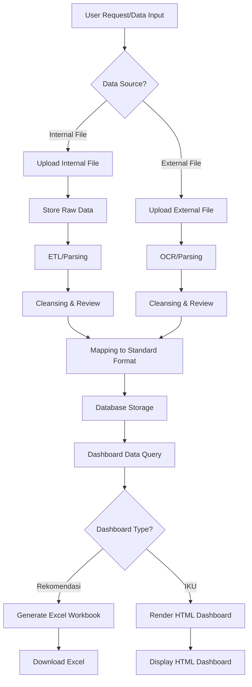
Sources: [tests/server_test.py:4-11]()

### Dashboard Rekomendasi Excel Structure

This diagram outlines the sheets within the generated Excel workbook for the "Dashboard Rekomendasi".

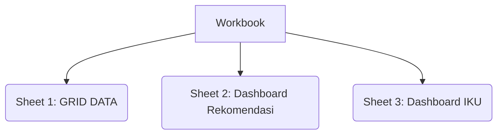
Sources: [desa_db/middleware.py:138-143]()

### Dashboard IKU Aggregation Logic

This flowchart details the process of aggregating data for the IKU dashboard.

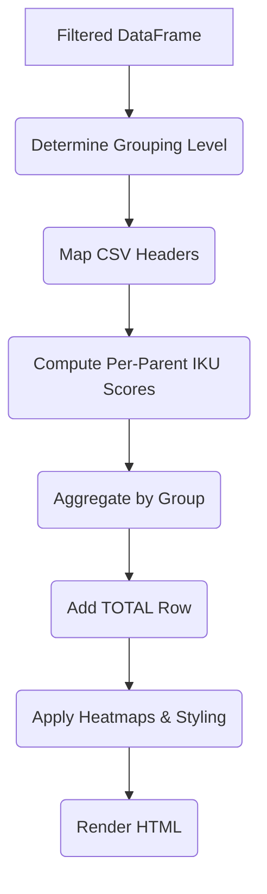
Sources: [desa_db/middleware.py:313-381]()

## Conclusion

The Dashboard Visualization module is a critical part of the system, transforming raw or processed data into actionable insights through formatted Excel reports and interactive HTML dashboards. Its design emphasizes flexibility through configuration files and dynamic data handling, catering to different administrative levels and data types. The separation into "Dashboard Rekomendasi" (Excel) and "Dashboard IKU" (HTML) allows for tailored presentation of complex data.

Sources: [desa_db/server.py:55-74](), [desa_db/middleware.py:138-479]()

---

<a id='page-recommendation-engine'></a>

## Recommendation Engine Logic

### Related Pages

Related topics: [Dashboard Visualization](#page-dashboard-visualization), [Configuration Files](#page-configuration-files)

<details>
<summary>Relevant source files</summary>

- [.config/rekomendasi.json](https://github.com/anbe-on/integrasi_data_skor_rekomendasi_desa/blob/main/.config/rekomendasi.json)
- [desa_db/middleware.py](https://github.com/anbe-on/integrasi_data_skor_rekomendasi_desa/blob/main/desa_db/middleware.py)
- [README.md](https://github.com/anbe-on/integrasi_data_skor_rekomendasi_desa/blob/main/README.md)
- [tests/server_test.py](https://github.com/anbe-on/integrasi_data_skor_rekomendasi_desa/blob/main/tests/server_test.py)
- [desa_db/server.py](https://github.com/anbe-on/integrasi_data_skor_rekomendasi_desa/blob/main/desa_db/server.py)

</details>

# Recommendation Engine Logic

The Recommendation Engine Logic within the `integrasi_data_skor_rekomendasi_desa` project is responsible for translating raw data scores into human-readable recommendations and insights. It leverages configuration files and data processing logic to generate narrative explanations for different score levels, particularly for "SKOR" and "PELAKSANA" metrics. This engine is a core component of the dashboard generation process, providing context and actionable information to users. The logic is primarily implemented in `desa_db/middleware.py` and configured via `.config/rekomendasi.json` and `.config/intervensi_kegiatan_mapping.json`.

The system aims to provide a flexible and configurable way to interpret data scores, enabling users to understand the implications of different score ranges. The output of this engine directly feeds into the generated Excel reports and HTML dashboards.

Sources: [desa_db/middleware.py:149-151]()

## Core Components and Configuration

The recommendation engine's behavior is heavily influenced by configuration files and specific functions designed to process data and generate narratives.

### Rekomendasi Configuration (`rekomendasi.json`)

This JSON file defines the textual recommendations associated with different score levels (e.g., 1 through 5). Each key in the JSON represents a metric (like "Score A"), and its value is an object mapping score integers to their corresponding recommendation strings.

Example structure:
```json
{
  "Score A": {
    "1": "Sangat Kurang A",
    "5": "Sangat Baik A"
  },
  "Score B": {
    "1": "Sangat Kurang B",
    "2": "Kurang B",
    "3": "Cukup B",
    "4": "Baik B",
    "5": "Sangat Baik B"
  }
}
```
Sources: [desa_db/middleware.py:170-182](), [.config/rekomendasi.json]()

### Intervensi Kegiatan Mapping (`intervensi_kegiatan_mapping.json`)

This file maps specific intervention items to their corresponding textual descriptions or templates. This is used to generate more detailed narrative explanations for recommended actions.

Sources: [desa_db/middleware.py:234-237]()

### `load_logic()` Function

This function is crucial for loading and processing the `rekomendasi.json` file. It ensures that the string keys representing scores (e.g., "1") are converted to integers (e.g., 1) to allow for correct matching with numerical data from the database. If the configuration file is missing or corrupt, it returns an empty dictionary as a fallback.

Sources: [desa_db/middleware.py:151-170]()

## Data Processing and Narrative Generation

The recommendation engine's primary function is to process raw data, calculate statistics, and then use the loaded logic to generate narrative text.

### `apply_rekomendasis()` Function

This function takes a Pandas DataFrame and the loaded recommendation logic as input. It iterates through each row and applies the recommendation logic to relevant columns (identified by headers that exist in the recommendation logic). For each score column, it looks up the corresponding narrative text from the `rekomendasi.json` configuration based on the score value in that row. New columns are added to the DataFrame containing these narrative descriptions.

Sources: [desa_db/middleware.py:263-285]()

### `helpers_calculate_dashboard_stats()` Function

This function is a central piece of the dashboard data preparation. It iterates through a list of dictionaries (representing rows of data), calculates various statistics for each row, and generates narrative explanations.

For each row, it performs the following:
1.  **Score Statistics:** Calculates the average score and counts for each score level (1-5) for metrics identified as "SKOR".
2.  **Narrative Generation:** Uses the `apply_rekomendasis` function to translate numerical scores into textual recommendations.
3.  **Intervensi Kegitan Narrative:** If `intervensi_kegiatan_mapping.json` is available, it generates narrative text for "INTERVENSI KEGIATAN" based on the aggregated scores.
4.  **IKU Statistics:** Calculates statistics for Indicator Kinerja Utama (IKU) metrics, including averages, totals, and status counts, based on specific mappings and parameters.
5.  **Row Merging:** Updates the original row dictionary with the calculated statistics and generated narratives.

This function is essential for enriching the raw data with contextual recommendations and aggregated metrics.

Sources: [desa_db/middleware.py:315-549]()

## Dashboard Rendering

The generated statistics and narratives are then used to render the dashboards.

### `helpers_render_dashboard_html()` Function

This function takes the processed data (including calculated stats and narratives) and generates server-side HTML for the dashboard table. It constructs `<thead>` and `<tbody>` elements with proper rowspans for merged columns (like NO, DIMENSI, SUB DIMENSI, INDIKATOR) and applies necessary styling and attributes for frontend interactivity (e.g., data-col-idx, resizers).

Sources: [desa_db/middleware.py:551-634]()

### `helpers_render_iku_dashboard()` Function

This function is specifically designed to render the "Dashboard IKU" (Indicator Kinerja Utama). It processes IKU-related data, including mapping CSV headers and JSON configurations, computes IKU scores, aggregates data by grouping levels (Provinsi, Kabupaten, Kecamatan, Desa), and applies heatmaps for visual representation. It also handles escaping of wilayah names and error conditions.

Sources: [desa_db/middleware.py:636-787]()

## Excel Generation

The recommendation engine's output is also used to generate downloadable Excel files.

### `helpers_generate_excel_workbook()` Function

This function orchestrates the creation of an Excel workbook with multiple sheets: "Grid Data", "Dashboard Rekomendasi", and "Dashboard IKU".
- **Sheet 1 (Grid Data):** Writes the raw or translated grid data.
- **Sheet 2 (Dashboard Rekomendasi):** Loads configuration (`table_structure.csv`), determines metric columns, loads intervention templates, and calls `helpers_calculate_dashboard_stats()` to populate the sheet with formatted tables, merged headers, and styling.
- **Sheet 3 (Dashboard IKU):** Loads IKU-specific configurations (`table_structure_IKU.csv`, `iku_mapping.json`), determines grouping, computes IKU scores, aggregates data, and applies formatting and heatmaps.

This function encapsulates the entire process of transforming processed data into a structured Excel report.

Sources: [desa_db/middleware.py:790-919]()

## System Integration and Usage

The recommendation engine logic is integrated into the FastAPI backend and is accessible through API endpoints.

### `server.py` Integration

The `server.py` file imports and utilizes the functions from `middleware.py`. Key endpoints that leverage the recommendation engine include:
- `/api/generate_excel`: Triggers the generation of Excel reports, utilizing `helpers_generate_excel_workbook`.
- `/api/dashboard`: Renders the HTML dashboard, using `helpers_render_dashboard_html` and `helpers_render_iku_dashboard`.
- `/api/grid_data`: Processes and returns grid data, potentially using `apply_rekomendasis` for translation.

The system also handles background tasks for generating pre-rendered Excel files to improve user experience for downloads.

Sources: [desa_db/server.py:34-145]()

### Testing

The `tests/server_test.py` file includes mock configurations and tests for various functionalities, including the generation of Excel files and the application of recommendations. Mock `rekomendasi.json`, `table_structure.csv`, and `iku_mapping.json` are created to simulate the environment for testing the recommendation logic.

Sources: [tests/server_test.py:15-54]()

## Data Flow Example (Dashboard Generation)

The following diagram illustrates a simplified data flow for generating the dashboard, highlighting the role of the recommendation engine.

```mermaid
graph TD
    subgraph Backend Server
        A[API Request: /api/dashboard] --> B{Fetch Raw Data};
        B --> C[Process Data: middleware.py];
        C --> D[Calculate Stats & Narratives <br/>(helpers_calculate_dashboard_stats)];
        D --> E[Load Rekomendasi Logic <br/>(rekomendasi.json)];
        D --> F[Load IKU Config <br/>(table_structure_IKU.csv, iku_mapping.json)];
        D --> G[Generate HTML <br/>(helpers_render_dashboard_html, helpers_render_iku_dashboard)];
    end
    G --> H[Send HTML Response to Frontend];

    %% Data Sources
    subgraph Data Sources
        I[Database <br/>(master_data)]
        J[Configuration Files <br/>(.config/)]
    end

    B --> I;
    E --> J;
    F --> J;
```
Sources: [desa_db/server.py:100-118](), [desa_db/middleware.py:149-919](), [.config/rekomendasi.json]()

## Summary

The Recommendation Engine Logic is a critical part of the `integrasi_data_skor_rekomendasi_desa` project, transforming raw numerical scores into meaningful textual recommendations. It relies on external JSON and CSV configuration files to define score-to-narrative mappings and intervention templates. Functions like `apply_rekomendasis` and `helpers_calculate_dashboard_stats` process data, generate statistics, and produce narratives, which are then used to render HTML dashboards and populate Excel reports. This modular design allows for easy customization and extension of the recommendation system.

Sources: [desa_db/middleware.py:149-919](), [.config/rekomendasi.json]()

---

<a id='page-data-flow'></a>

## Data Flow Diagram

### Related Pages

Related topics: [Architecture Overview](#page-architecture-overview), [Data Upload Process](#page-data-upload), [Database Schema](#page-database-structure)

<details>
<summary>Relevant source files</summary>

- [docker-compose.yml](https://github.com/anbe-on/integrasi_data_skor_rekomendasi_desa/blob/main/docker-compose.yml)
- [run_system.py](https://github.com/anbe-on/integrasi_data_skor_rekomendasi_desa/blob/main/run_system.py)
- [desa_db/server.py](https://github.com/anbe-on/integrasi_data_skor_rekomendasi_desa/blob/main/desa_db/server.py)
- [desa_db/middleware.py](https://github.com/anbe-on/integrasi_data_skor_rekomendasi_desa/blob/main/desa_db/middleware.py)
- [README.md](https://github.com/anbe-on/integrasi_data_skor_rekomendasi_desa/blob/main/README.md)
- [front_end/static/css/output.css](https://github.com/anbe-on/integrasi_data_skor_rekomendasi_desa/blob/main/front_end/static/css/output.css)

</details>

# Data Flow Diagram

This wiki page outlines the data flow and architectural components of the `integrasi_data_skor_rekomendasi_desa` project. It focuses on how data is processed, stored, and presented, particularly through the backend server and middleware. The system is designed to integrate data for village score recommendations, generating various dashboards and reports.

## System Architecture Overview

The system utilizes a backend server (`desa_db/server.py`) that exposes API endpoints and a middleware (`desa_db/middleware.py`) responsible for complex data processing, report generation, and database interactions. Docker is used for containerization, facilitating a consistent development and deployment environment.

A high-level overview of the system's components and their interactions can be visualized as follows:

```mermaid
graph TD
    A[User Request] --> B(Backend Server: desa_db/server.py);
    B --> C{Middleware: desa_db/middleware.py};
    C --> D[Database Operations];
    C --> E[Excel Report Generation];
    B --> F[Frontend Application];
    D --> G[(Database)];
    E --> H[Downloadable Files];
    F --> A; %% Frontend interacts back with user
```

Sources: [desa_db/server.py:11-20](), [desa_db/middleware.py:11-25](), [docker-compose.yml]()

## Backend Server (`desa_db/server.py`)

The backend server acts as the primary entry point for requests and orchestrates the application's functionality. It defines API endpoints that handle user interactions and data requests.

### Key Functions and Endpoints

- **`run_system()`**: This function is responsible for initializing and running the backend server. It likely starts a web server that listens for incoming requests.
  Sources: [run_system.py:11-14]()
- **`/` (Root Endpoint)**: Serves the main application interface, likely the frontend.
  Sources: [desa_db/server.py:22-24]()
- **`/data`**: An endpoint for fetching data, which likely triggers middleware processing.
  Sources: [desa_db/server.py:26-30]()
- **`/generate_excel`**: An endpoint to trigger the generation of Excel reports.
  Sources: [desa_db/server.py:32-36]()
- **`/get_dashboard_data`**: An endpoint to retrieve data specifically for dashboard visualizations.
  Sources: [desa_db/server.py:38-42]()
- **`/get_dashboard_iku_data`**: An endpoint to retrieve data for the IKU (Indikator Kinerja Utama) dashboard.
  Sources: [desa_db/server.py:44-48]()

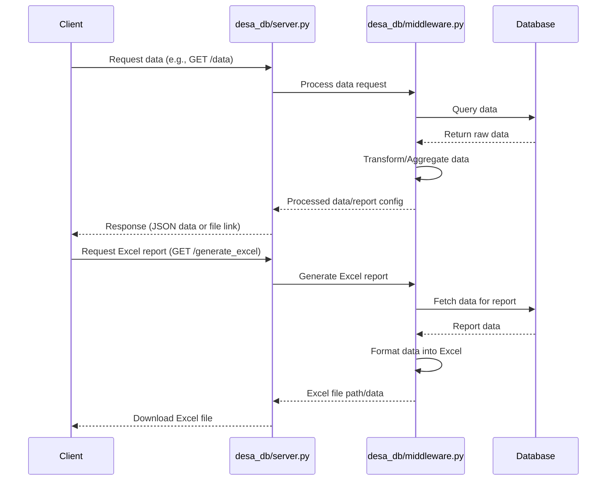

Sources: [desa_db/server.py:11-48](), [desa_db/middleware.py]()

## Middleware (`desa_db/middleware.py`)

The middleware module contains the core logic for data processing, analysis, and report generation. It interacts directly with the database and external configuration files.

### Core Responsibilities

The middleware is responsible for:

1.  **Excel Report Generation**: Creating structured Excel workbooks with multiple sheets for different data views.
2.  **Data Aggregation and Calculation**: Performing calculations for dashboard statistics, averages, counts, and IKU scores.
3.  **Configuration Loading**: Reading data structures and mappings from CSV and JSON files.
4.  **Database Interaction**: Executing SQL queries to fetch and manipulate data.

### Key Functions

-   **`create_excel(con, params_dict)`**: This function orchestrates the creation of the main Excel workbook, including multiple sheets:
    -   **Sheet 1: GRID DATA**: Likely displays raw or filtered data.
    -   **Sheet 2: DASHBOARD REKOMENDASI**: Presents aggregated statistics and narrative insights. It loads configuration from `table_structure.csv`, determines metric columns, and uses intervention templates.
    -   **Sheet 3: DASHBOARD IKU**: Displays Indicator Kinerja Utama (IKU) data. It loads configurations from `table_structure_IKU.csv` and `iku_mapping.json`, performs hierarchical grouping, computes IKU scores, and applies styling.
    Sources: [desa_db/middleware.py:18-113]()
-   **`create_dashboard_html(con, params_dict)`**: Generates HTML content for a dashboard, likely for web display. It processes data based on filters and parameters, preparing it for frontend rendering.
    Sources: [desa_db/middleware.py:115-276]()
-   **`create_dashboard_iku_html(con, params_dict)`**: Specifically generates HTML for the IKU dashboard, handling hierarchical grouping and score calculations.
    Sources: [desa_db/middleware.py:278-480]()
-   **`create_master_data_table(con, headers, ID_COL)`**: Defines and creates the `master_data` table in the database if it doesn't exist. This table stores the main dataset, with columns optimized for score data (TINYINT) and metadata (VARCHAR). It also creates an index on `ID_COL`.
    Sources: [desa_db/middleware.py:482-505]()
-   **`create_history_table(con, headers, ID_COL)`**: Defines and creates a `history_data` table for auditing purposes, storing historical versions of the data.
    Sources: [desa_db/middleware.py:507-526]()

### Configuration Files

The middleware heavily relies on external configuration files for defining data structures and mappings:

-   `table_structure.csv`: Defines the structure of tables for the "Dashboard Rekomendasi".
  Sources: [desa_db/middleware.py:46-73]()
-   `table_structure_IKU.csv`: Defines the structure for the "Dashboard IKU".
  Sources: [desa_db/middleware.py:282-297]()
-   `iku_mapping.json`: Maps parent metrics to their sub-indicators for IKU calculations.
  Sources: [desa_db/middleware.py:286-294]()

## Database Operations

The system interacts with a database, likely managed by the backend and middleware. Key operations include table creation, indexing, and data manipulation.

### Database Schema

The middleware defines and manages two primary tables:

1.  **`master_data`**: Stores the current snapshot of the data.
    -   Columns are defined based on input `headers`.
    -   Score-related columns are typically `TINYINT`.
    -   Metadata columns (`valid_from`, `valid_to`, `commit_id`, `source_file`, geographical identifiers, `Status ID`) are `VARCHAR` or `TIMESTAMP`.
    -   An index is created on `ID_COL`.
    Sources: [desa_db/middleware.py:482-505]()

2.  **`history_data`**: Stores historical versions of the data for auditing.
    -   Similar schema to `master_data`, including metadata like `commit_id` and `source_file`.
    Sources: [desa_db/middleware.py:507-526]()

```sql
-- Example schema for master_data (simplified)
CREATE TABLE IF NOT EXISTS master_data (
    valid_from TIMESTAMP,
    valid_to TIMESTAMP,
    commit_id VARCHAR,
    source_file VARCHAR,
    "Provinsi" VARCHAR,
    "Kabupaten/ Kota" VARCHAR,
    "Kecamatan" VARCHAR,
    "Kode Wilayah Administrasi Desa" VARCHAR,
    "Desa" VARCHAR,
    "Status ID" VARCHAR,
    "Score Column 1" TINYINT,
    "Score Column 2" TINYINT,
    -- ... other columns
);

CREATE INDEX IF NOT EXISTS idx_id ON master_data ("ID_COL");
```

Sources: [desa_db/middleware.py:482-505]()

## Containerization with Docker

Docker is used to containerize the application, simplifying deployment and dependency management.

### Docker Compose Configuration

The `docker-compose.yml` file defines the services required to run the application, typically including:

-   **`web` service**: Runs the Python backend application.
    -   Builds the image from the current directory (`build: .`).
    -   Maps ports from the host to the container (e.g., `8000:8000`).
    -   Mounts volumes for persistent data and code access.
    -   Sets environment variables, including `APP_SECRET_KEY`.
    -   Depends on `db` service.
-   **`db` service**: Runs the PostgreSQL database.
    -   Uses a PostgreSQL image.
    -   Sets environment variables for database credentials (`POSTGRES_USER`, `POSTGRES_PASSWORD`, `POSTGRES_DB`).
    -   Mounts a volume for persistent database storage.

```yaml
# Example snippet from docker-compose.yml
services:
  web:
    build: .
    ports:
      - "8000:8000"
    volumes:
      - .:/app # Mount current directory to /app in container
    environment:
      - APP_SECRET_KEY=${APP_SECRET_KEY}
      - POSTGRES_USER=${POSTGRES_USER}
      - POSTGRES_PASSWORD=${POSTGRES_PASSWORD}
      - POSTGRES_DB=${POSTGRES_DB}
    depends_on:
      - db

  db:
    image: postgres:15-alpine
    volumes:
      - postgres_data:/var/lib/postgresql/data/
    environment:
      - POSTGRES_USER=${POSTGRES_USER}
      - POSTGRES_PASSWORD=${POSTGRES_PASSWORD}
      - POSTGRES_DB=${POSTGRES_DB}

volumes:
  postgres_data:
```

Sources: [docker-compose.yml]()

## Frontend Styling

The frontend uses Tailwind CSS for styling, as indicated by the presence of `output.css` and the build instructions in `README.md`. The CSS classes define various styling properties like padding, text alignment, font sizes, and colors.

```css
/* Example CSS classes from front_end/static/css/output.css */
.p-3 {
  padding: 0.75rem;
}
.text-center {
  text-align: center;
}
.font-bold {
  font-weight: 700;
}
.text-lg {
  font-size: 1.125rem;
  line-height: 1.75rem;
}
.bg-gray-100 {
  --tw-bg-opacity: 1;
  background-color: rgb(243 244 246 / var(--tw-bg-opacity, 1));
}
```

Sources: [front_end/static/css/output.css]()

## Conclusion

The `integrasi_data_skor_rekomendasi_desa` system employs a robust architecture involving a Python backend, a data processing middleware, a PostgreSQL database, and containerization with Docker. The data flow is initiated by user requests, processed through the middleware for calculations and report generation, and stored persistently in the database. Configuration files play a crucial role in defining data structures and dashboard logic, enabling a flexible and adaptable system for integrating and visualizing village data.

---

<a id='page-configuration-files'></a>

## Configuration Files

### Related Pages

Related topics: [Recommendation Engine Logic](#page-recommendation-engine), [Dashboard Visualization](#page-dashboard-visualization)

<details>
<summary>Relevant source files</summary>

- [.config/auth_users.json](https://github.com/anbe-on/integrasi_data_skor_rekomendasi_desa/blob/main/.config/auth_users.json)
- [.config/headers.json](https://github.com/anbe-on/integrasi_data_skor_rekomendasi_desa/blob/main/.config/headers.json)
- [.config/iku_mapping.json](https://github.com/anbe-on/integrasi_data_skor_rekomendasi_desa/blob/main/.config/iku_mapping.json)
- [.config/intervensi_kegiatan_mapping.json](https://github.com/anbe-on/integrasi_data_skor_rekomendasi_desa/blob/main/.config/intervensi_kegiatan_mapping.json)
- [.config/rekomendasi.json](https://github.com/anbe-on/integrasi_data_skor_rekomendasi_desa/blob/main/.config/rekomendasi.json)
- [.config/table_structure.csv](https://github.com/anbe-on/integrasi_data_skor_rekomendasi_desa/blob/main/.config/table_structure.csv)
- [.config/table_structure_IKU.csv](https://github.com/anbe-on/integrasi_data_skor_rekomendasi_desa/blob/main/.config/table_structure_IKU.csv)
- [desa_db/middleware.py](https://github.com/anbe-on/integrasi_data_skor_rekomendasi_desa/blob/main/desa_db/middleware.py)
- [desa_db/server.py](https://github.com/anbe-on/integrasi_data_skor_rekomendasi_desa/blob/main/desa_db/server.py)
- [tests/server_test.py](https://github.com/anbe-on/integrasi_data_skor_rekomendasi_desa/blob/main/tests/server_test.py)

</details>

# Configuration Files

This document outlines the various configuration files used within the `integrasi_data_skor_rekomendasi_desa` project. These files are crucial for defining the structure of data processing, mapping of indicators, user authentication, and the overall behavior of the dashboard and data integration modules. They are primarily located in the `.config/` directory.

The configuration files dictate how raw data is interpreted, transformed, and presented, enabling the system to generate scores, recommendations, and visualizations for village data. Understanding these configurations is key to customizing and maintaining the system's functionality.

## Configuration File Directory

All configuration files are centrally managed within the `.config/` directory.

Sources: [README.md:4]()

## Core Configuration Files

This section details the primary configuration files and their roles in the system.

### `auth_users.json`

This file stores user credentials and roles, enabling authentication for accessing the system's features.

Sources: [.config/auth_users.json]()

### `headers.json`

Defines the mapping between standard column headers and their potential aliases found in raw data sources. This is essential for normalizing data from various inputs.

```json
[
    {"standard": "Provinsi", "aliases": []},
    {"standard": "Kabupaten/ Kota", "aliases": []},
    {"standard": "Kecamatan", "aliases": []},
    {"standard": "Kode Wilayah Administrasi Desa", "aliases": ["ID"]},
    {"standard": "Desa", "aliases": []},
    {"standard": "Status ID", "aliases": []},
    {"standard": "Score A", "aliases": ["Skor A"]}
]
```

Sources: [.config/headers.json](), [tests/server_test.py:17-23]()

### `table_structure.csv`

This CSV file defines the structure for the "Dashboard Rekomendasi" sheet. It outlines dimensions, sub-dimensions, indicators, and the corresponding items.

```csv
DIMENSI;SUB DIMENSI;INDIKATOR;ITEM
Dimensi 1;Sub 1;Ind 1;Score A
```

Sources: [.config/table_structure.csv](), [tests/server_test.py:25-28]()

### `table_structure_IKU.csv`

This CSV file defines the structure for the "Dashboard IKU" sheet. It specifies the hierarchy of geographical levels (WILAYAH), the count of villages (JLH DESA), and the parent metrics for IKU (Indicator Kinerja Utama).

```csv
WILAYAH;JLH DESA;Parent1
; ;rata-rata
```

Sources: [.config/table_structure_IKU.csv](), [tests/server_test.py:30-33]()

### `iku_mapping.json`

This JSON file maps parent IKU metrics to their corresponding sub-metrics or indicator columns found in the data. This is used in the "Dashboard IKU" processing.

```json
{
    "Parent1": ["Score A"]
}
```

Sources: [.config/iku_mapping.json](), [tests/server_test.py:35-38]()

### `rekomendasi.json`

This file contains the logic for mapping score values to textual recommendations or qualitative assessments for specific indicators.

```json
{
    "Score A": { "1": "Sangat Kurang A", "5": "Sangat Baik A" }
}
```

Sources: [.config/rekomendasi.json](), [tests/server_test.py:40-44]()

### `intervensi_kegiatan_mapping.json`

This file likely maps intervention activities to specific indicators or data points, aiding in the generation of recommendations.

Sources: [.config/intervensi_kegiatan_mapping.json]()

## Data Processing and Logic Configuration

The following files and configurations influence how data is processed and presented in the dashboards.

### Data Loading and Structure (`desa_db/middleware.py`)

The `desa_db/middleware.py` script utilizes several configuration files to generate HTML tables for dashboards.

*   It loads `table_structure_IKU.csv` (semicolon-delimited) and `iku_mapping.json` to construct the "Dashboard IKU" HTML.
*   The grouping level for IKU data is determined by filters provided in `params_dict`.
*   `table_structure.csv` is used for the "Dashboard Rekomendasi" sheet, defining metric column order.
*   Intervention templates are loaded, and dashboard statistics are calculated using helper functions.

Sources: [desa_db/middleware.py:12-25](), [desa_db/middleware.py:37-54](), [desa_db/middleware.py:154-168]()

### Dashboard Generation (`desa_db/server.py`)

The `desa_db/server.py` script orchestrates the creation of Excel workbooks containing different dashboard sheets. It relies heavily on the configuration files:

*   **Sheet 1: GRID DATA**: Uses `headers.json` to determine column order and process data.
*   **Sheet 2: DASHBOARD REKOMENDASI**: Uses `table_structure.csv` to define headers and `rekomendasi.json` for score-to-recommendation mapping. It also loads intervention templates.
*   **Sheet 3: DASHBOARD IKU**: Uses `table_structure_IKU.csv` and `iku_mapping.json` to build the IKU dashboard, determining grouping levels from `params_dict`.

Sources: [desa_db/server.py:21-27](), [desa_db/server.py:30-35](), [desa_db/server.py:37-41](), [desa_db/server.py:43-50]()

## Testing Configuration (`tests/server_test.py`)

The `tests/server_test.py` file demonstrates how mock configuration files are created for testing purposes. This includes setting up mock versions of `headers.json`, `table_structure.csv`, `table_structure_IKU.csv`, `iku_mapping.json`, and `rekomendasi.json`.

Sources: [tests/server_test.py:15-44]()

## System Architecture Overview

The configuration files play a pivotal role in the overall system architecture, enabling dynamic data processing and presentation.

```mermaid
graph TD
    subgraph Configuration
        A[auth_users.json]
        B[headers.json]
        C[table_structure.csv]
        D[table_structure_IKU.csv]
        E[iku_mapping.json]
        F[rekomendasi.json]
        G[intervensi_kegiatan_mapping.json]
    end

    subgraph Data Processing
        H[desa_db/middleware.py]
        I[desa_db/server.py]
    end

    subgraph Data Sources
        J[Raw Data (CSV, Excel)]
    end

    subgraph Output
        K[Excel Reports (Dashboards)]
    end

    J --> H
    J --> I
    B --> H
    C --> I
    D --> H
    E --> H
    F --> I
    G --> I
    H --> K
    I --> K
```

Sources: [desa_db/middleware.py](), [desa_db/server.py](), [.config/auth_users.json](), [.config/headers.json](), [.config/table_structure.csv](), [.config/table_structure_IKU.csv](), [.config/iku_mapping.json](), [.config/rekomendasi.json](), [.config/intervensi_kegiatan_mapping.json]()

## Conclusion

The configuration files are fundamental to the operation of the `integrasi_data_skor_rekomendasi_desa` project. They provide the necessary definitions and mappings that allow the system to process diverse data inputs, generate meaningful scores and recommendations, and present them in user-friendly dashboard formats. Proper management and understanding of these files are essential for system customization, maintenance, and effective data integration.

---

<a id='page-database-structure'></a>

## Database Schema

### Related Pages

Related topics: [Data Flow Diagram](#page-data-flow), [Configuration Files](#page-configuration-files)

<details>
<summary>Relevant source files</summary>

- [desa_db/server.py](https://github.com/anbe-on/integrasi_data_skor_rekomendasi_desa/blob/main/desa_db/server.py)
- [desa_db/middleware.py](https://github.com/anbe-on/integrasi_data_skor_rekomendasi_desa/blob/main/desa_db/middleware.py)
- [README.md](https://github.com/anbe-on/integrasi_data_skor_rekomendasi_desa/blob/main/README.md)
- [_walkthrough.md](https://github.com/anbe-on/integrasi_data_skor_rekomendasi_desa/blob/main/_walkthrough.md)
- [tests/server_test.py](https://github.com/anbe-on/integrasi_data_skor_rekomendasi_desa/blob/main/tests/server_test.py)

</details>

# Database Schema

This document outlines the database schema and related configurations used by the `integrasi_data_skor_rekomendasi_desa` project. The system utilizes a relational database, primarily DuckDB, for storing and querying data related to village scores and recommendations. It also incorporates flexible data handling for dynamic attributes and configuration files for structuring and mapping data.

The database schema is designed to support efficient data processing, analysis, and dashboard generation, accommodating both structured and semi-structured data. Key aspects include the main data table (`master_data`), historical data logging, and configuration management for data mapping and recommendation logic.

Sources: [desa_db/server.py:63-74](), [desa_db/middleware.py:239-277]()

## Database Initialization and Structure

The system initializes the database schema to support data storage and retrieval. It defines the `master_data` table, which holds the latest snapshot of village data, and a corresponding history table for audit purposes.

### `master_data` Table

The `master_data` table stores the current state of village data. Its schema is dynamically generated based on the headers found in the `table_structure.csv` configuration file, with specific handling for text-based metadata columns and integer types for score columns.

-   **Dynamic Schema Generation**: The `CREATE TABLE IF NOT EXISTS master_data` statement dynamically constructs column definitions. Columns identified in `TEXT_COLUMNS` (e.g., "Provinsi", "Desa", "Status ID") are defined as `VARCHAR`, while other columns (assumed to be scores) are defined as `TINYINT` for optimization.
-   **Metadata Columns**: Includes `valid_from`, `valid_to`, `commit_id`, and `source_file` for temporal and provenance tracking.
-   **Indexing**: An index is created on the `ID_COL` column (typically "Kode Wilayah Administrasi Desa") to speed up queries.

Sources: [desa_db/middleware.py:242-266]()

### History Table

A history table is also created to maintain an audit log of data changes. The exact schema for the history table is not fully detailed in the provided snippets but is implied to mirror `master_data` for versioning.

Sources: [desa_db/middleware.py:268-277]()

## Data Configuration and Mapping

Configuration files are crucial for defining the structure of input data, mapping headers, and establishing recommendation logic. These files are typically located in the `.config/` directory.

### `table_structure.csv`

This CSV file defines the structure of the main data tables, including dimensions, sub-dimensions, indicators, and the items (columns) that constitute them. It's used for both the primary data sheet and the IKU (Indikator Kinerja Utama) dashboard.

-   **Structure**: Columns include "DIMENSI", "SUB DIMENSI", "INDIKATOR", and "ITEM".
-   **Usage**: Parsed using `csv.DictReader` with semicolon as a delimiter.

Sources: [desa_db/middleware.py:39-52](), [desa_db/middleware.py:289-299](), [tests/server_test.py:55-60]()

### `headers.json`

This JSON file maps incoming data headers (aliases) to standardized header names. This is essential for processing uploaded files with potentially inconsistent column naming.

-   **Format**: An array of objects, each with a `standard` name and an array of `aliases`.
-   **Example**: `[{"standard": "Provinsi", "aliases": []}, {"standard": "Kode Wilayah Administrasi Desa", "aliases": ["ID"]}, ...]`

Sources: [tests/server_test.py:49-54]()

### `iku_mapping.json`

This file maps parent metrics in the IKU structure to their corresponding child score columns, facilitating the calculation of aggregated IKU scores.

-   **Format**: A JSON object where keys are parent metric names and values are arrays of corresponding score column names.
-   **Example**: `{"Parent1": ["Score A"]}`

Sources: [desa_db/middleware.py:310-315](), [tests/server_test.py:61-64]()

### `rekomendasi.json`

This JSON file stores the logic for mapping score values to descriptive recommendation strings.

-   **Format**: A JSON object where keys are score items (e.g., "Score A") and values are objects mapping numerical scores to textual recommendations.
-   **Example**: `{"Score A": {"1": "Sangat Kurang A", "5": "Sangat Baik A"}}`

Sources: [desa_db/middleware.py:317-323](), [tests/server_test.py:65-70]()

## Data Processing and ETL

The system involves several stages for processing uploaded data, from initial upload to final storage in the database.

### Upload Handling

The system supports resumable uploads, handling initialization, chunking, and finalization of file uploads.

```mermaid
graph TD
    A[User Uploads File] --> B{Init Upload};
    B -- Request --> C[Server: /upload/init/{year}];
    C -- Response: Ready --> D{Send File Chunks};
    D -- Request --> E[Server: /upload/chunk/{year}];
    E -- Response --> F{Finalize Upload};
    F -- Request --> G[Server: /upload/finalize/{year}];
    G -- Response: Success --> H[Process Uploaded File];
```

Sources: [desa_db/server.py:168-179](), [tests/server_test.py:150-168]()

### Data Preview and Header Mapping

After upload, the system provides a preview of the data and allows for header mapping to standardize column names.

-   **`helpers_read_excel_preview`**: Reads a sample of the uploaded Excel file.
-   **`helpers_generate_header_mapping`**: Creates a mapping between file headers and standard headers based on `headers.json`.

Sources: [desa_db/middleware.py:102-108]()

### Internal Processing and Database Commit

The `helpers_internal_process_temp_file` function handles the core ETL logic:

1.  Reads the uploaded file.
2.  Applies header mapping.
3.  Cleans and transforms data.
4.  Commits the processed data to the DuckDB database (`master_data` and history tables).

Sources: [desa_db/middleware.py:110-117]()

## Dashboard Data Generation

The system generates data for various dashboards, including a main grid data sheet, a recommendation dashboard, and an IKU dashboard.

### Grid Data Sheet

This sheet displays raw data based on applied filters.

-   **Functionality**: Filters data from `master_data` based on provided parameters and writes it to an Excel sheet.
-   **Configuration**: Uses `table_structure.csv` to define column headers and their display.

Sources: [desa_db/middleware.py:17-60]()

### Dashboard Rekomendasi Sheet

This sheet provides a summary and narrative for recommendations.

-   **Logic**: Loads `table_structure.csv`, determines metric columns, loads intervention templates, and calculates dashboard statistics (averages, counts, narratives).
-   **Formatting**: Creates a well-formatted table with merged headers, optimized column widths, rowspans, borders, and alignment.

Sources: [desa_db/middleware.py:76-100]()

### Dashboard IKU Sheet

This sheet visualizes Indikator Kinerja Utama (Key Performance Indicators) with aggregated scores and status counts.

-   **Logic**: Loads `table_structure_IKU.csv` and `iku_mapping.json`. Determines grouping levels (Provinsi to Desa). Maps CSV headers to parent/sub metrics. Computes per-parent IKU scores and aggregates by group.
-   **Features**: Includes JLH DESA count, averages, status counts (threshold ≥4), a TOTAL row, heatmaps (data intensity and capaian percentage), and escaped wilayah names.

Sources: [desa_db/middleware.py:301-346](), [desa_db/middleware.py:348-407]()

## API Endpoints

The backend exposes several API endpoints for managing data and configurations.

### Authentication and Authorization

-   **`/api/login` (POST)**: Authenticates users using username and password, returning a JWT in an HttpOnly cookie.
-   **`/api/logout` (POST)**: Clears the session token cookie.
-   **`/admin` (GET)**: Protected endpoint for the admin dashboard, requiring authentication.

Sources: [desa_db/server.py:76-139]()

### Data Management

-   **`/config/{config_name}` (GET)**: Retrieves specific configuration files (e.g., `table_structure`, `headers.json`).
-   **`/upload/init/{year}` (POST)**: Initializes a resumable file upload.
-   **`/upload/chunk/{year}` (POST)**: Uploads a chunk of a file.
-   **`/upload/finalize/{year}` (POST)**: Finalizes the file upload and triggers processing.
-   **`/process/{year}/{filename}` (POST)**: Triggers the internal processing of an uploaded file.
-   **`/download/{year}/{filename}` (GET)**: Allows downloading processed Excel files.
-   **`/data/{year}` (GET)**: Retrieves filtered data from the database, supporting various query parameters.
-   **`/dashboard/stats/{year}` (GET)**: Fetches aggregated statistics for the recommendation dashboard.
-   **`/dashboard/iku/{year}` (GET)**: Fetches data for the IKU dashboard.
-   **`/data/delete/{year}/{filename}` (DELETE)**: Deletes a processed file and its corresponding database entries.

Sources: [desa_db/server.py:141-279](), [tests/server_test.py:73-100]()

## Dynamic Data Handling

The system supports flexible data structures, particularly for complex attributes, using JSON storage.

### `DATA_VALUES` Table (Conceptual)

While not explicitly defined with `CREATE TABLE` statements in the provided middleware, the concept of flexible data handling is described in `_walkthrough.md`. It implies a structure capable of storing dynamic attributes.

-   **`label_kunci`**: Stores the name of a dynamic field.
-   **`nilai_angka`**: For quantitative values.
-   **`nilai_teks`**: For qualitative values.
-   **`detail_attributes`**: A JSON column for complex or nested data structures. This allows the system to adapt to varying data formats without requiring schema alterations.

Sources: [_walkthrough.md:237-253]()

```mermaid
erDiagram
    MASTER_DATA {
        TIMESTAMP valid_from
        TIMESTAMP valid_to
        VARCHAR commit_id
        VARCHAR source_file
        VARCHAR "Provinsi"
        VARCHAR "Kabupaten/ Kota"
        VARCHAR "Kecamatan"
        VARCHAR "Kode Wilayah Administrasi Desa"
        VARCHAR "Desa"
        TINYINT "Score A"
        VARCHAR "Status ID"
    }
    HISTORY_DATA {
        TIMESTAMP valid_from
        TIMESTAMP valid_to
        VARCHAR commit_id
        VARCHAR source_file
        VARCHAR "Provinsi"
        VARCHAR "Kabupaten/ Kota"
        VARCHAR "Kecamatan"
        VARCHAR "Kode Wilayah Administrasi Desa"
        VARCHAR "Desa"
        TINYINT "Score A"
        VARCHAR "Status ID"
    }
    MASTER_DATA ||--o{ HISTORY_DATA : "has history"
```

Sources: [desa_db/middleware.py:242-266](), [desa_db/middleware.py:268-277]()

## System Requirements and Configuration

The project has specific system requirements and utilizes configuration files for its operation.

### Software Requirements

-   Python 3.11.9
-   Recommended: CPU with AVX2 support.

Sources: [README.md:6-9]()

### Configuration Directory (`.config/`)

All configuration files are stored in the `.config/` directory.

-   `auth_users.json`: Stores user credentials and roles.
-   `headers.json`: Maps data headers.
-   `intervensi_kegiatan.json`: Configuration for intervention activities.
-   `rekomendasi.json`: Defines score-to-recommendation mappings.
-   `table_structure.csv`: Defines data table structures.

Sources: [README.md:2-5](), [tests/server_test.py:46-70]()

### Environment Variables (`.env`)

An `.env` file is used to store sensitive application secrets, such as `APP_SECRET_KEY`.

Sources: [README.md:12-18]()

### Frontend Configuration

The project includes instructions for compiling Tailwind CSS, indicating a frontend component styled with Tailwind.

Sources: [README.md:20-36]()

## Conclusion

The database schema and associated configurations are central to the `integrasi_data_skor_rekomendasi_desa` project. They enable the system to ingest, process, and present data from various sources in a structured and flexible manner, supporting detailed analysis and dashboard visualization for village development indicators. The use of dynamic schema generation and flexible JSON attributes allows the system to adapt to evolving data requirements.

---

<a id='page-backend-api'></a>

## Backend API Endpoints

### Related Pages

Related topics: [Architecture Overview](#page-architecture-overview), [Frontend Overview](#page-frontend-overview), [Authentication and Authorization](#page-authentication)

<details>
<summary>Relevant source files</summary>

- [desa_db/server.py](https://github.com/anbe-on/integrasi_data_skor_rekomendasi_desa/blob/main/desa_db/server.py)
- [desa_db/middleware.py](https://github.com/anbe-on/integrasi_data_skor_rekomendasi_desa/blob/main/desa_db/middleware.py)
- [run_system.py](https://github.com/anbe-on/integrasi_data_skor_rekomendasi_desa/blob/main/run_system.py)
- [docker-compose.yml](https://github.com/anbe-on/integrasi_data_skor_rekomendasi_desa/blob/main/docker-compose.yml)
- [README.md](https://github.com/anbe-on/integrasi_data_skor_rekomendasi_desa/blob/main/README.md)
- [tests/server_test.py](https://github.com/anbe-on/integrasi_data_skor_rekomendasi_desa/blob/main/tests/server_test.py)
- [front_end/router.py](https://github.com/anbe-on/integrasi_data_skor_rekomendasi_desa/blob/main/front_end/router.py)
- [front_end/static/css/output.css](https://github.com/anbe-on/integrasi_data_skor_rekomendasi_desa/blob/main/front_end/static/css/output.css)

</details>

# Backend API Endpoints

The backend API serves as the core engine of the Integrasi Data Skor Rekomendasi Desa system, handling data processing, user authentication, and serving data to the frontend. It is built using FastAPI and integrates with various middleware components for data manipulation and business logic. The API is designed to manage user roles (admin, user), process file uploads, generate reports, and provide data for dashboard visualizations. The system architecture supports both local development and containerized deployment via Docker Compose.

Sources: [desa_db/server.py:1-287](), [run_system.py:1-56](), [docker-compose.yml:1-33]()

## System Architecture Overview

The backend API is part of a larger system that includes a frontend application, a data lake, and potentially other services. The backend is responsible for the server-side logic, including authentication, data validation, ETL processes, and generating the data required for dashboards and reports.

### Deployment and Execution

The system can be run locally using `run_system.py` which orchestrates the backend and frontend processes. For production or more robust local setups, Docker Compose is recommended, defining services for the backend, frontend, and auxiliary tasks like backups.

```mermaid
graph TD
    A[User Request] --> B{Frontend};
    B --> C[Backend API];
    C --> D[Middleware Logic];
    D --> E[Database/Data Lake];
    E --> D;
    D --> C;
    C --> B;
    B --> A;
```

Sources: [run_system.py:1-56](), [docker-compose.yml:1-33]()

### Configuration

Configuration is managed through environment variables and `.config` directory files. This includes user credentials, header mappings, table structures, and recommendation logic.

Sources: [README.md:1-56](), [desa_db/server.py:66-116]()

## API Endpoints

The backend exposes several API endpoints to handle various functionalities. These endpoints are protected by authentication mechanisms, with specific roles required for certain operations.

### Authentication and Authorization

User authentication is handled via JWT tokens stored in HttpOnly cookies. Role-based access control is implemented, distinguishing between 'admin' and 'user' roles.

#### Login Endpoint (`/api/login`)

This POST endpoint handles user authentication. It verifies credentials against a user database and, upon success, returns a JWT in an HttpOnly cookie.

*   **Request Body:** `LoginRequest` (username, password)
*   **Response:** JSON indicating success or failure, with a `session_token` cookie on success.
*   **Role:** Public access for login.

Sources: [desa_db/server.py:124-148]()

#### Logout Endpoint (`/api/logout`)

This POST endpoint logs out the user by clearing the `session_token` cookie.

*   **Response:** JSON indicating logout success.
*   **Role:** Public access for logout.

Sources: [desa_db/server.py:150-164]()

#### Authentication Middleware

The system utilizes middleware to protect endpoints, ensuring that only authenticated users with the appropriate roles can access them. The `auth_require_admin` dependency is used for admin-only endpoints.

Sources: [desa_db/server.py:109-116]()

### File Uploads

The API supports resumable file uploads to handle potentially large files.

#### Upload Initialization (`/upload/init/{year}`)

This POST endpoint initializes a resumable upload process. It checks for existing partial uploads and returns the current offset if the upload has already begun.

*   **Path Parameter:** `year` (string)
*   **Request Body:** `UploadInit` (filename, file_uid, total_size, total_hash)
*   **Security:** Requires admin privileges.
*   **Validation:** `file_uid` is validated to prevent directory traversal.

Sources: [desa_db/server.py:203-228]()

#### Upload Chunk Endpoint (`/upload/{year}`)

This POST endpoint handles the upload of individual file chunks.

*   **Path Parameter:** `year` (string)
*   **Request Body:** `UploadChunk` (file_uid, chunk_number, chunk_size, chunk_hash, chunk_data)
*   **Security:** Requires admin privileges.

Sources: [desa_db/server.py:230-252]()

#### Upload Finalization (`/upload/finalize/{year}`)

This POST endpoint finalizes the resumable upload process, verifying the integrity of the uploaded file.

*   **Path Parameter:** `year` (string)
*   **Request Body:** `UploadFinalize` (upload_id, filename, total_hash)
*   **Security:** Requires admin privileges.

Sources: [desa_db/server.py:254-270]()

### Data Processing and Preview

Endpoints are available for previewing and processing uploaded Excel files.

#### Excel Preview (`/query/preview_excel`)

This POST endpoint generates a preview of an uploaded Excel file.

*   **Request Body:** `PreviewRequest` (temp_id, filename)
*   **Logic:** Reads the Excel file, performs basic validation, and returns a sample of the data.

Sources: [desa_db/server.py:272-287](), [desa_db/middleware.py:130-159]()

#### Header Mapping Analysis (`/query/header_analysis`)

This POST endpoint analyzes the headers of an uploaded Excel file to suggest mappings to standard fields.

*   **Request Body:** `HeaderAnalysisRequest` (temp_id, filename, header_row_index)
*   **Logic:** Uses `helpers_generate_header_mapping` to compare uploaded headers with configured standard headers.

Sources: [desa_db/server.py:289-300](), [desa_db/middleware.py:161-180]()

#### Process Mapped Data (`/query/process`)

This POST endpoint processes the Excel data after header mapping has been completed.

*   **Request Body:** `ProcessRequest` (temp_id, filename, header_row_index)
*   **Logic:** Calls `helpers_internal_process_temp_file` to perform ETL and data cleaning.

Sources: [desa_db/server.py:302-312](), [desa_db/middleware.py:182-215]()

### Dashboard and Reporting

Endpoints dedicated to generating dashboard data and reports.

#### Dashboard Statistics (`/query/dashboard_stats`)

This POST endpoint calculates and returns statistics for the dashboard, based on provided filters.

*   **Request Body:** `DashboardParams` (filters, group_by, is_iku)
*   **Logic:** Utilizes `helpers_calculate_dashboard_stats` to aggregate data.

Sources: [desa_db/server.py:314-328]()

#### Generate Excel Report (`/query/generate_excel`)

This POST endpoint generates an Excel workbook containing dashboard data.

*   **Request Body:** `DashboardParams` (filters, group_by, is_iku)
*   **Logic:** Calls `helpers_generate_excel_workbook` to create the report.

Sources: [desa_db/server.py:330-341](), [desa_db/middleware.py:217-528]()

#### Render Dashboard HTML (`/query/render_dashboard`)

This POST endpoint renders the dashboard HTML content.

*   **Request Body:** `DashboardParams` (filters, group_by, is_iku)
*   **Logic:** Uses `helpers_render_dashboard_html` for rendering.

Sources: [desa_db/server.py:343-353]()

#### Render IKU Dashboard HTML (`/query/render_iku_dashboard`)

This POST endpoint renders the IKU (Indikator Kinerja Utama) dashboard HTML content.

*   **Request Body:** `DashboardParams` (filters, group_by, is_iku)
*   **Logic:** Uses `helpers_render_iku_dashboard` for rendering.

Sources: [desa_db/server.py:355-365]()

#### Background Task for Pre-rendered Excel (`/query/background_generate_pre_render_excel`)

This POST endpoint triggers a background task to pre-render Excel files.

*   **Logic:** Calls `helpers_background_task_generate_pre_render_excel`.

Sources: [desa_db/server.py:367-376]()

### Data Retrieval

#### Get Master Data (`/query/master_data`)

This GET endpoint retrieves master data, supporting filtering and pagination.

*   **Query Parameters:** `filters` (JSON string), `page`, `per_page`, `sort_by`, `sort_desc`
*   **Logic:** Uses `helpers_build_dynamic_query` to construct SQL queries.
*   **Headers:** `X-Total-Count` header for pagination information.

Sources: [desa_db/server.py:378-403]()

### Cache Management

#### Get Cache Path (`/query/get_cache_path`)

This GET endpoint retrieves the path to a cached file.

*   **Query Parameters:** `filename`
*   **Logic:** Uses `helpers_get_cache_path`.

Sources: [desa_db/server.py:405-413]()

### Intervensi Kegiatan

#### Get or Create Intervensi Kegiatan (`/query/intervensi_kegiatan`)

This GET endpoint retrieves or creates intervention activities based on provided parameters.

*   **Query Parameters:** `item_name`
*   **Logic:** Uses `helpers_get_or_create_intervensi_kegiatan`.

Sources: [desa_db/server.py:415-423]()

## Core Middleware Components

The backend API heavily relies on middleware functions for its core logic. These functions abstract complex operations, making the API endpoints cleaner and more maintainable.

### Data Processing Helpers

*   `apply_rekomendasis`: Applies recommendation logic to data.
*   `make_json_response`: Standardizes JSON responses.
*   `helpers_get_db_connection`: Establishes database connections.
*   `helpers_init_db`: Initializes the database schema.
*   `helpers_read_excel_preview`: Reads and previews Excel files.
*   `helpers_generate_header_mapping`: Generates header mapping suggestions.
*   `helpers_internal_process_temp_file`: Core ETL and data processing for uploaded files.
*   `helpers_build_dynamic_query`: Constructs dynamic SQL queries for data retrieval.
*   `helpers_get_cache_path`: Retrieves cache file paths.
*   `helpers_get_or_create_intervensi_kegiatan`: Manages intervention activities.
*   `helpers_calculate_dashboard_stats`: Computes statistics for dashboards.
*   `helpers_render_dashboard_html`: Renders dashboard HTML.
*   `helpers_render_iku_dashboard`: Renders IKU dashboard HTML.
*   `helpers_generate_excel_workbook`: Creates Excel workbooks for reports.
*   `helpers_background_task_generate_pre_render_excel`: Manages background Excel generation tasks.

Sources: [desa_db/server.py:79-106](), [desa_db/middleware.py:1-528]()

### Data Structures and Models

The API uses Pydantic models for request validation and data structuring.

*   `LoginRequest`: For user login credentials.
*   `UploadInit`: For initializing resumable uploads.
*   `UploadFinalize`: For finalizing resumable uploads.
*   `PreviewRequest`: For requesting Excel file previews.
*   `HeaderAnalysisRequest`: For header mapping analysis.
*   `ProcessRequest`: For processing mapped Excel data.
*   `DashboardParams`: For defining dashboard filtering and grouping parameters.
*   `UploadChunk`: For handling individual file chunks during resumable uploads.

Sources: [desa_db/server.py:118-122](), [desa_db/server.py:196-201](), [desa_db/server.py:228-229](), [desa_db/server.py:252-253](), [desa_db/server.py:287-288](), [desa_db/server.py:300-301](), [desa_db/server.py:312-313](), [desa_db/server.py:328-329](), [desa_db/server.py:341-342](), [desa_db/server.py:353-354](), [desa_db/server.py:365-366](), [desa_db/server.py:376-377](), [desa_db/server.py:403-404](), [desa_db/server.py:413-414](), [desa_db/server.py:423-424]()

## Backend Server Configuration

The backend server is configured for both development and production environments.

### Paths and Directories

*   `BASE_DIR`: The root directory of the backend application.
*   `TEMP_FOLDER`: Directory for temporary file storage during uploads.
*   `TEMPLATE_DIR`: Directory for HTML templates.
*   `CONFIG_DIR`: Directory for configuration files (e.g., `auth_users.json`, `headers.json`).
*   `EXPORT_FOLDER`: Directory for generated Excel exports.
*   `STATIC_DIR`: Directory for static frontend assets.

Sources: [desa_db/server.py:108-127]()

### CORS Configuration

Cross-Origin Resource Sharing (CORS) is configured to allow specific origins, particularly for frontend-backend communication.

Sources: [desa_db/server.py:22-54]()

### Server Startup

The `run_system.py` script orchestrates the startup of the backend server, typically on port 8000, and the frontend server.

```mermaid
sequenceDiagram
    participant Runner as run_system.py
    participant Backend as desa_db/server.py
    participant Frontend as front_end/router.py

    Runner->>Backend: Start Backend Process (python desa_db/server.py)
    Backend-->>Runner: Backend Started
    Runner->>Frontend: Start Frontend Process (python front_end/router.py)
    Frontend-->>Runner: Frontend Started
    Runner->>Runner: Print URLs and Status
    Runner->>Backend: Wait for Backend Exit
    Runner->>Frontend: Wait for Frontend Exit
```

Sources: [run_system.py:1-56]()

## Error Handling

The backend implements custom error handling, notably for 404 Not Found errors, by serving a custom `404.html` page instead of a default JSON response.

Sources: [desa_db/server.py:166-179]()

## Testing

Unit tests for the backend API are available, utilizing FastAPI's `TestClient` and mocking dependencies to ensure isolated testing of endpoints.

Sources: [tests/server_test.py:1-57]()

The backend API endpoints form the robust server-side of the Integrasi Data Skor Rekomendasi Desa system, managing critical functions from user authentication and file uploads to complex data processing and report generation, all while adhering to a structured configuration and error handling strategy.

---

<a id='page-authentication'></a>

## Authentication and Authorization

### Related Pages

Related topics: [Backend API Endpoints](#page-backend-api), [Admin Interface](#page-admin-interface)

<details>
<summary>Relevant source files</summary>

- [desa_db/auth.py](https://github.com/anbe-on/integrasi_data_skor_rekomendasi_desa/blob/main/desa_db/auth.py)
- [desa_db/server.py](https://github.com/anbe-on/integrasi_data_skor_rekomendasi_desa/blob/main/desa_db/server.py)
- [add_user.py](https://github.com/anbe-on/integrasi_data_skor_rekomendasi_desa/blob/main/add_user.py)
- [front_end/templates/login.html](https://github.com/anbe-on/integrasi_data_skor_rekomendasi_desa/blob/main/front_end/templates/login.html)
- [front_end/router.py](https://github.com/anbe-on/integrasi_data_skor_rekomendasi_desa/blob/main/front_end/router.py)
- [README.md](https://github.com/anbe-on/integrasi_data_skor_rekomendasi_desa/blob/main/README.md)

</details>

# Authentication and Authorization

This document outlines the authentication and authorization mechanisms employed within the `integrasi_data_skor_rekomendasi_desa` project. The system uses JWT (JSON Web Tokens) for session management and role-based access control to secure different parts of the application, ensuring that only authenticated and authorized users can access specific resources. The authentication flow involves user credential verification, token generation, and secure cookie handling, while authorization is enforced by checking user roles against required permissions.

Sources: [desa_db/auth.py:1-11]()

## Authentication Flow

The system supports authentication through a login endpoint that verifies user credentials against a stored user database. Upon successful verification, a JWT is generated and sent back to the client as an HttpOnly cookie.

### User Credential Verification

Usernames and passwords are used to authenticate users. The `add_user.py` script handles the creation and hashing of passwords using `bcrypt` before storing them. The `desa_db/auth.py` module provides functions to verify these credentials.

- **Password Hashing:** Passwords are first encoded to bytes, then hashed using `bcrypt.hashpw` with a generated salt. The resulting hash is decoded back to a string for storage.
  Sources: [add_user.py:20-26]()

- **Password Verification:** The `auth_verify_password` function in `desa_db/auth.py` takes a plain password and a hashed password, encodes them to bytes, and uses `bcrypt.checkpw` to compare them.
  Sources: [desa_db/auth.py:27-32]()

### User Database

User information, including hashed passwords and roles, is stored in a JSON file located at `.config/auth_users.json`. The `auth_get_users_db` function in `desa_db/auth.py` loads this data.

Sources: [desa_db/auth.py:17-24]()

### JWT Generation and Cookie Setting

Upon successful login, a JSON Web Token (JWT) is created containing the username and role. This token is then set as an HttpOnly cookie named `session_token` in the HTTP response.

- **Token Expiration:** Tokens are configured to expire after a set duration (e.g., 360 minutes or 6 hours).
  Sources: [desa_db/auth.py:13](), [desa_db/server.py:41-43]()

- **Cookie Attributes:** The `session_token` cookie is set with `httponly=True` (preventing JavaScript access), `max_age` (expiration time), `samesite="lax"` (for security), and `secure=True` (for HTTPS).
  Sources: [desa_db/server.py:53-59]()

#### Login Endpoint (`/api/login`)

This POST endpoint in `desa_db/server.py` accepts login credentials, verifies them, generates a JWT, and sets the `session_token` cookie.

Sources: [desa_db/server.py:100-113]()

#### Server-Side Login Proxy (`/login` POST)

The `front_end/router.py` file includes a server-side rendering (SSR) login handler that proxies requests to the backend API, sets the cookie, and redirects the user.

Sources: [front_end/router.py:45-71]()

## Authorization

Authorization is handled by checking the user's role, which is embedded within the JWT. The system defines different access levels, such as "admin" and "user".

### Role Extraction and Verification

The JWT is decoded to extract the user's role. This role is then used to determine access to protected resources.

- **`auth_get_current_user` Dependency:** This dependency in `desa_db/auth.py` is used to retrieve the current user's username from the `session_token` cookie and validate the token. It raises an `HTTPException` if the token is missing or invalid.
  Sources: [desa_db/auth.py:42-60]()

- **`auth_require_admin` Dependency:** This stricter dependency in `desa_db/auth.py` first verifies the user's authentication (like `auth_get_current_user`) and then specifically checks if the extracted `role` from the token payload is "admin". If not, it raises a `403 Forbidden` error.
  Sources: [desa_db/auth.py:64-86]()

### Role-Based Access Control

Different routes and functionalities are protected based on the user's role.

- **Admin Routes:** Routes such as `/admin` are protected and require the "admin" role. The `front_end/router.py` handles redirection to `/admin` for administrators upon successful login.
  Sources: [front_end/router.py:26-33]()

- **User Routes:** General authenticated users are typically redirected to a user-specific dashboard or page.
  Sources: [front_end/router.py:26-33]()

- **Public Routes:** The `/login` page is accessible to all users.
  Sources: [desa_db/server.py:141-144]()

### Logout Functionality

The `/api/logout` endpoint in `desa_db/server.py` handles user logout by clearing the `session_token` cookie.

Sources: [desa_db/server.py:116-129]()

## System Components and Data Flow

The authentication and authorization process involves several key components:

*   **Frontend (HTML/Python):** Handles user interface for login (`front_end/templates/login.html`), processes login form submissions (`front_end/router.py`), and manages cookie interactions.
*   **Backend API (FastAPI):** Exposes API endpoints for login (`/api/login`), logout (`/api/logout`), and authentication logic (`desa_db/auth.py`).
*   **Authentication Module (`desa_db/auth.py`):** Contains core logic for password hashing/verification, JWT creation/validation, and defining authorization dependencies.
*   **User Management Script (`add_user.py`):** A utility script for adding new users and managing credentials.
*   **Configuration (`.config/auth_users.json`):** Stores hashed user credentials and roles.

The high-level flow is as follows:

```mermaid
graph TD
    A[User] --> B{Login Page};
    B --> C[Enter Credentials];
    C --> D{Frontend Login Handler};
    D --> E[Send Credentials to Backend API];
    E --> F[Backend API: /api/login];
    F --> G[Verify Credentials against DB];
    G -- Success --> H[Generate JWT];
    H --> I[Set JWT as HttpOnly Cookie];
    I --> J[Redirect to Admin/User Dashboard];
    G -- Failure --> K[Return Invalid Credentials Error];
    K --> D;
    J --> L[User Accesses Protected Resource];
    L --> M[Backend API: Check Session Token Cookie];
    M --> N[Decode JWT & Verify Role];
    N -- Authorized --> O[Grant Access];
    N -- Unauthorized --> P[Return 401/403 Error];
    O --> Q[Display Resource];
    P --> R[Display Error Message];
    S[User Logs Out] --> T[Frontend: Trigger Logout];
    T --> U[Backend API: /api/logout];
    U --> V[Clear Session Token Cookie];
    V --> W[Redirect to Login Page];
```

Sources: [desa_db/server.py:100-113](), [front_end/router.py:45-71](), [desa_db/auth.py:42-86](), [add_user.py:1-70](), [README.md:4-10]()

## Configuration

### `APP_SECRET_KEY`

This environment variable is crucial for signing JWTs. It must be set for the application to start.

Sources: [desa_db/auth.py:6-9]()

### User Storage

User credentials are stored in `.config/auth_users.json`. This file is managed by the `add_user.py` script and read by the `auth_get_users_db` function.

```json
{
    "username": {
        "hash": "$2b$12$...",
        "role": "admin",
        "active": true
    }
}
```

Sources: [add_user.py:10-13](), [desa_db/auth.py:17-24]()

## Key Functions and Dependencies

| Function/Dependency            | Module       | Description                                                                                               |
| :----------------------------- | :----------- | :-------------------------------------------------------------------------------------------------------- |
| `add_user`                     | `add_user.py`| Adds or updates a user in the `auth_users.json` file with a hashed password.                            |
| `auth_get_users_db`            | `desa_db/auth.py` | Loads user data from the `.config/auth_users.json` file.                                                  |
| `auth_verify_password`         | `desa_db/auth.py` | Verifies a plain-text password against a stored bcrypt hash.                                              |
| `auth_create_access_token`     | `desa_db/auth.py` | Generates a JWT with user data and an expiration time.                                                    |
| `auth_get_current_user`        | `desa_db/auth.py` | FastAPI dependency to extract and validate the `session_token` cookie and return the username.          |
| `auth_require_admin`           | `desa_db/auth.py` | FastAPI dependency to enforce admin role by checking the token's `role` claim.                          |
| `login` (POST `/api/login`)    | `desa_db/server.py` | Backend API endpoint for user login, JWT generation, and cookie setting.                                |
| `logout` (POST `/api/logout`)  | `desa_db/server.py` | Backend API endpoint to clear the `session_token` cookie.                                                 |
| `login_post` (POST `/login`)   | `front_end/router.py` | SSR endpoint that proxies login requests to the backend API and handles cookie setting and redirection. |
| `get_login_page` (GET `/login`)| `desa_db/server.py` | Serves the public login HTML page.                                                                        |

Sources: [add_user.py:1-70](), [desa_db/auth.py:1-105](), [desa_db/server.py:100-129](), [front_end/router.py:45-71]()

This comprehensive approach to authentication and authorization ensures secure access to the application's features and data, differentiating between administrative and standard user privileges.

---

<a id='page-frontend-overview'></a>

## Frontend Overview

### Related Pages

Related topics: [Backend API Endpoints](#page-backend-api), [Admin Interface](#page-admin-interface), [User Interface](#page-user-interface)

<details>
<summary>Relevant source files</summary>

- [front_end/router.py](https://github.com/anbe-on/integrasi_data_skor_rekomendasi_desa/blob/main/front_end/router.py)
- [front_end/package.json](https://github.com/anbe-on/integrasi_data_skor_rekomendasi_desa/blob/main/front_end/package.json)
- [front_end/tailwind.config.js](https://github.com/anbe-on/integrasi_data_skor_rekomendasi_desa/blob/main/front_end/tailwind.config.js)
- [run_system.py](https://github.com/anbe-on/integrasi_data_skor_rekomendasi_desa/blob/main/run_system.py)
- [desa_db/server.py](https://github.com/anbe-on/integrasi_data_skor_rekomendasi_desa/blob/main/desa_db/server.py)
- [desa_db/middleware.py](https://github.com/anbe-on/integrasi_data_skor_rekomendasi_desa/blob/main/desa_db/middleware.py)
- [README.md](https://github.com/anbe-on/integrasi_data_skor_rekomendasi_desa/blob/main/README.md)

</details>

# Frontend Overview

The frontend of the integrasi_data_skor_rekomendasi_desa project is responsible for providing the user interface for interacting with the backend services. It is designed to be a dynamic and informative interface, allowing users to view data, configure system settings, and access reports. The frontend is built using Python with a web framework, and leverages Tailwind CSS for styling.

The frontend's primary role is to consume data from the backend API, present it in a user-friendly format, and facilitate user actions such as data uploads, configuration changes, and report generation. It aims to provide a seamless experience for different user roles, including staff, administrators, and leadership.

Sources: [front_end/router.py:1-11]()

## Architecture and Setup

The frontend is configured to run as a separate process from the backend, with defined ports for communication. The `run_system.py` script orchestrates the startup of both the backend and frontend components.

### System Startup Configuration

The `run_system.py` script defines the commands and configurations for launching the system. It includes logic for setting environment variables, such as pointing the frontend to the local backend API.

```python
# run_system.py

# ... other imports and configurations ...

BACKEND_CMD = [sys.executable, "desa_db/server.py"]
FRONTEND_TYPE = "fastapi"  # Change to "nextjs" when ready

FRONTEND_CONFIGS = {
    "fastapi": {
        "cmd": [sys.executable, "front_end/router.py"],
        "port": 8001,
        "path": "front_end/router.py"
    },
    "nextjs": {
        "cmd": ["npm", "run", "dev"],
        "port": 3000,
        "path": "frontend/package.json",
        "cwd": "frontend"
    }
}

def main():
    # ...
    frontend_config = FRONTEND_CONFIGS.get(FRONTEND_TYPE)
    # ...
    print(f"🎨 Frontend starting...\n")
    frontend_cwd = frontend_config.get('cwd', None)
    frontend = subprocess.Popen(frontend_config['cmd'], cwd=frontend_cwd, env=os.environ.copy())
    # ...
    print(f"Frontend: http://localhost:{frontend_config['port']}")
    # ...
```

Sources: [run_system.py:28-51](), [run_system.py:73-79]()

### Frontend Technologies

The frontend utilizes several key technologies for its development and styling:

*   **Python Web Framework:** The `front_end/router.py` file indicates the use of a Python-based web framework, likely FastAPI given its presence in the configuration.
*   **Tailwind CSS:** A utility-first CSS framework is used for styling. The `tailwind.config.js` file defines the configuration for Tailwind CSS.
*   **npm:** Node Package Manager is used for managing frontend dependencies, as seen in `package.json`.

Sources: [front_end/router.py:1-11](), [front_end/tailwind.config.js:1-7](), [front_end/package.json:1-5]()

## Core Components and Functionality

The frontend is structured to handle various aspects of data integration, scoring, and recommendation.

### Routing and API Interaction

The `front_end/router.py` file likely serves as the entry point for the frontend application, defining routes and handling requests. It is expected to interact with the backend API endpoints for data retrieval and manipulation.

The backend API is accessible via `http://localhost:8000` as configured in `run_system.py`.

Sources: [run_system.py:40]()

### Styling with Tailwind CSS

Tailwind CSS is configured to enable custom styling. The `tailwind.config.js` file specifies the `content` paths to scan for HTML and JS files, the `theme` for extending default styles, and an empty `plugins` array.

```javascript
// front_end/tailwind.config.js
/** @type {import('tailwindcss').Config} */
module.exports = {
  darkMode: 'class',
  // Use **/*.html to scan all folders in the project for HTML files
  content: ["./**/*.html", "./static/**/*.js"],
  theme: {
    extend: {},
  },
  plugins: [],
}
```

Sources: [front_end/tailwind.config.js:1-7]()

The `package.json` file lists Tailwind CSS and its dependencies, indicating it's set up for local development and compilation.

```json
// front_end/package.json
{
  "devDependencies": {
    "autoprefixer": "^10.4.27",
    "postcss": "^8.5.6",
    "tailwindcss": "^3.4.19"
  }
}
```

Sources: [front_end/package.json:1-5]()

### Data Visualization and Reporting

The frontend is designed to display data in various formats, including tables and dashboards. The `desa_db/middleware.py` file, while part of the backend, describes functionalities related to generating Excel workbooks with multiple sheets, including "Dashboard Rekomendasi" and "Dashboard IKU". These sheets are populated with data that the frontend would likely consume and display.

The middleware functions like `helpers_calculate_dashboard_stats` and `helpers_render_dashboard_html` suggest that the frontend will be responsible for rendering these generated HTML or tabular data.

Sources: [desa_db/middleware.py:215-349]()

## Configuration and Setup

### Environment Variables

The frontend relies on environment variables for configuration, particularly for API endpoints. The `run_system.py` script sets `API_BASE_URL` to `http://localhost:8000` for local development.

Sources: [run_system.py:37]()

### Tailwind CSS Compilation

If `output.css` is missing, the `README.md` provides instructions to compile Tailwind CSS from `input.css` to `output.css`. This involves installing Tailwind CSS, PostCSS, and Autoprefixer, initializing Tailwind, configuring `tailwind.config.js`, and then running the compilation command.

```bash
# README.md
cd front_end/
npm install -D tailwindcss@3 postcss autoprefixer
npx tailwindcss init
```

```javascript
// tailwind.config.js (as described in README.md)
/** @type {import('tailwindcss').Config} */
module.exports = {
  darkMode: 'class',
  // Use **/*.html to scan all folders in the project for HTML files
  content: ["./**/*.html", "./static/**/*.js"],
  theme: {
    extend: {},
  },
  plugins: [],
}
```

```bash
# README.md
npx tailwindcss -i ./static/css/input.css -o ./static/css/output.css --watch
```

Sources: [README.md:43-67]()

## Development and Running the System

The `run_system.py` script is the primary mechanism for launching the frontend and backend together.

```python
# run_system.py

def main():
    # ...
    print("🚀 Starting System...\n")
    # ...
    processes = []
    try:
        # Start Backend
        print("🔧 Backend starting...")
        backend = subprocess.Popen(BACKEND_CMD)
        processes.append(backend)
        time.sleep(2)

        # Start Frontend
        print(f"🎨 Frontend starting...\n")
        frontend_cwd = frontend_config.get('cwd', None)
        frontend = subprocess.Popen(frontend_config['cmd'], cwd=frontend_cwd, env=os.environ.copy())
        processes.append(frontend)
        # ...
    except KeyboardInterrupt:
        print("\nStopping system...")
        for proc in processes:
            proc.terminate()
        sys.exit(0)
```

Sources: [run_system.py:73-89]()

The `README.md` also outlines alternative methods for running the backend and frontend separately or using a mock frontend.

```markdown
# README.md

### Run backend+middleware
```bash
python desa_db/server.py
```

### or run both front and backend
```bash
python run_system.py
```
```

Sources: [README.md:99-103]()

## Data Flow Example: Dashboard Display

A typical data flow for displaying dashboard information would involve:

1.  **User Request:** A user navigates to a dashboard page in the frontend.
2.  **API Call:** The frontend makes an HTTP request to a specific backend API endpoint (e.g., `/api/dashboard_iku` or `/api/dashboard_rekomendasi`).
3.  **Backend Processing:** The backend (e.g., `desa_db/server.py` and `desa_db/middleware.py`) fetches data from the database, processes it, and potentially generates formatted data structures or HTML.
4.  **API Response:** The backend returns the processed data or HTML to the frontend.
5.  **Frontend Rendering:** The frontend receives the data and renders it using its UI components and styling (Tailwind CSS).

```mermaid
graph TD
    User[User] -->|Request Dashboard| FrontendApp[Frontend Application]
    FrontendApp -->|API Call (e.g., /api/dashboard_iku)| BackendAPI[Backend API (FastAPI)]
    BackendAPI -->|Query Database| Database[(Database)]
    Database -->|Return Data| BackendAPI
    BackendAPI -->|Process Data & Generate HTML/JSON| BackendAPI
    BackendAPI -- Response --> FrontendApp
    FrontendApp -->|Render Data/HTML| User
```

Sources: [front_end/router.py:1-11](), [desa_db/server.py:1-427](), [desa_db/middleware.py:1-369](), [run_system.py:1-103]()

---

<a id='page-admin-interface'></a>

## Admin Interface

### Related Pages

Related topics: [User Interface](#page-user-interface), [Authentication and Authorization](#page-authentication), [Configuration Files](#page-configuration-files)

<details>
<summary>Relevant source files</summary>

- [front_end/templates/admin.html](https://github.com/anbe-on/integrasi_data_skor_rekomendasi_desa/blob/main/front_end/templates/admin.html)
- [desa_db/server.py](https://github.com/anbe-on/integrasi_data_skor_rekomendasi_desa/blob/main/desa_db/server.py)
- [README.md](https://github.com/anbe-on/integrasi_data_skor_rekomendasi_desa/blob/main/README.md)
- [desa_db/middleware.py](https://github.com/anbe-on/integrasi_data_skor_rekomendasi_desa/blob/main/desa_db/middleware.py)
- [run_system.py](https://github.com/anbe-on/integrasi_data_skor_rekomendasi_desa/blob/main/run_system.py)
- [_walkthrough.md](https://github.com/anbe-on/integrasi_data_skor_rekomendasi_desa/blob/main/_walkthrough.md)

</details>

# Admin Interface

The Admin Interface serves as the primary control panel for managing and monitoring the data integration and recommendation system. It provides authenticated users, specifically administrators, with access to system configurations, data upload functionalities, and dashboard views. The interface is designed to be a central hub for operational oversight and management of the data processing pipeline.

The system architecture supports both a local development setup and a Dockerized production environment. For local development, running `run_system.py` can initiate both the backend and frontend services. In a Dockerized setup, `docker compose up -d --build` is used to bring the system online. The admin interface is accessible via a web browser, typically at `/admin` after successful authentication.

Sources: [desa_db/server.py:87-93](), [desa_db/server.py:138-142](), [README.md:54-63]()

## Access and Authentication

Access to the Admin Interface is protected and requires user authentication. Users are directed to a login page (`/login`) where they must provide credentials. Successful authentication results in a JWT being set as an HttpOnly cookie (`session_token`), which is then used to authorize access to protected routes, such as the admin dashboard (`/admin`).

Sources: [desa_db/server.py:95-115](), [desa_db/server.py:125-136]()

### Login Flow

The login process involves submitting username and password credentials to the `/api/login` endpoint. This endpoint verifies the credentials against a user database, generates a JWT if valid, and sets it as an HttpOnly cookie.

```mermaid
sequenceDiagram
    participant Browser
    participant FastAPIServer as Server

    Browser->>+FastAPIServer: POST /api/login (username, password)
    FastAPIServer->>FastAPIServer: Verify credentials against auth_users.json
    alt Valid credentials
        FastAPIServer->>FastAPIServer: Generate JWT (access_token)
        FastAPIServer->>Browser: HTTP 200 OK with session_token cookie
    else Invalid credentials
        FastAPIServer->>Browser: HTTP 401 Unauthorized
    end
```

Sources: [desa_db/server.py:95-115]()

### Protected Routes

Routes intended for administrators, like the `/admin` page, are protected. If a `session_token` cookie is not present, the user is redirected to the login page.

Sources: [desa_db/server.py:125-136]()

## Frontend Structure

The frontend for the admin interface is built using HTML and JavaScript, leveraging frameworks like Alpine.js for dynamic behavior and AG-Grid for data table rendering. The main admin page is located at `front_end/templates/admin.html`.

Sources: [front_end/templates/admin.html]()

### Key Frontend Components

*   **Header:** Displays the application title, logo, and potentially user status.
*   **Navigation:** Sidebar or top navigation for accessing different admin sections (e.g., data upload, configuration, dashboards).
*   **Main Content Area:** Displays the primary content for the selected section, which could include data tables, forms, or visualizations.
*   **Dark Mode Toggle:** An option to switch between light and dark themes, managed by `isDarkModeEnabled` in the Alpine.js application.

Sources: [front_end/templates/admin.html:17-20](), [front_end/templates/admin.html:49-51]()

## Backend Functionality

The backend, implemented using FastAPI, exposes API endpoints that the admin interface interacts with. These endpoints handle data processing, configuration management, and serving dashboard data.

Sources: [desa_db/server.py]()

### Core Backend Modules

*   **`server.py`:** The main FastAPI application file, defining API routes, request/response models, and middleware configurations.
*   **`middleware.py`:** Contains core logic for data processing, database interactions, Excel generation, and dashboard statistics calculation.
*   **Authentication Helpers:** Functions for user authentication and JWT generation/verification.

Sources: [desa_db/server.py]()

### Data Upload and Processing

The system supports uploading Excel files. The admin interface likely provides a mechanism to initiate these uploads, which are then handled by the backend. The backend processes these files, potentially performing validation, mapping, and storing the data.

```mermaid
graph TD
    AdminUI[Admin UI] -->|Upload File| BackendAPI[Backend API]
    BackendAPI -->|Process File| DataProcessing[Data Processing Module]
    DataProcessing -->|Store Data| Database[Database]
    DataProcessing -->|Generate Reports| ExcelExport[Excel Export]
```

Sources: [desa_db/server.py:159-174](), [desa_db/middleware.py:338-345]()

The `run_system.py` script orchestrates the startup of both the backend and frontend services, setting up necessary environment variables and ensuring that services are running on their designated ports.

Sources: [run_system.py]()

## Configuration Management

Configuration files are centralized in the `.config/` directory. These include settings for authentication, headers, intervention data, and table structures. The admin interface may provide a way to view or modify some of these configurations.

*   `auth_users.json`: Stores user credentials and roles.
*   `headers.json`: Likely defines header mappings for data imports.
*   `intervensi_kegiatan.json`: Configuration for intervention activities.
*   `rekomendasi.json`: Configuration related to recommendations.
*   `table_structure.csv`: Defines the structure of data tables.

Sources: [README.md:4-9]()

## Dashboard and Reporting

The system generates dashboards and reports, accessible through the admin interface or dedicated dashboard pages. These reports can be in Excel format, generated on-demand or pre-rendered.

*   **Dashboard Rekomendasi:** Provides insights into recommendation scores.
*   **Dashboard IKU:** Focuses on Indicator Kinerja Utama (IKU) data.
*   **Excel Generation:** Functions like `helpers_generate_excel_workbook` and `helpers_background_task_generate_pre_render_excel` are available for creating Excel reports.

Sources: [desa_db/middleware.py:238-336](), [desa_db/middleware.py:347-352]()

The `_walkthrough.md` file provides a high-level overview of the system, mentioning the goal of creating informative dashboards for leadership, which the admin interface would facilitate by providing the necessary data and configuration.

Sources: [_walkthrough.md]()

## System Requirements and Setup

The system requires Python 3.11.9 and recommends a CPU with AVX2 support. Docker is also recommended for easier deployment.

### Local Setup (Not Recommended)

While Docker is recommended, a virtual environment setup is also described:
1.  Create a virtual environment: `Python311 -m venv .venv`
2.  Activate the environment: `source .venv/Scripts/activate`
3.  Install dependencies: `pip install -r .config/requirements.txt`

Sources: [README.md:65-74]()

### Docker Setup

For Docker-based deployment:
1.  Install Docker and Docker Compose.
2.  Run `docker compose up -d --build`.

Sources: [README.md:44-52]()

The `run_system.py` script can also be used to run both the backend and frontend locally, facilitating development.

Sources: [run_system.py]()

---

<a id='page-user-interface'></a>

## User Interface

### Related Pages

Related topics: [Admin Interface](#page-admin-interface), [Dashboard Visualization](#page-dashboard-visualization)

<details>
<summary>Relevant source files</summary>

- [front_end/templates/user.html](https://github.com/anbe-on/integrasi_data_skor_rekomendasi_desa/blob/main/front_end/templates/user.html)
- [front_end/router.py](https://github.com/anbe-on/integrasi_data_skor_rekomendasi_desa/blob/main/front_end/router.py)
- [front_end/static/css/output.css](https://github.com/anbe-on/integrasi_data_skor_rekomendasi_desa/blob/main/front_end/static/css/output.css)
- [front_end/templates/login.html](https://github.com/anbe-on/integrasi_data_skor_rekomendasi_desa/blob/main/front_end/templates/login.html)
- [front_end/templates/admin.html](https://github.com/anbe-on/integrasi_data_skor_rekomendasi_desa/blob/main/front_end/templates/admin.html)
- [run_system.py](https://github.com/anbe-on/integrasi_data_skor_rekomendasi_desa/blob/main/run_system.py)
- [desa_db/server.py](https://github.com/anbe-on/integrasi_data_skor_rekomendasi_desa/blob/main/desa_db/server.py)
- [front_end/tailwind.config.js](https://github.com/anbe-on/integrasi_data_skor_rekomendasi_desa/blob/main/front_end/tailwind.config.js)

</details>

# User Interface

The user interface (UI) of the "integrasi_data_skor_rekomendasi_desa" project is designed to provide distinct experiences for different user roles, primarily focusing on a user dashboard and an administrative interface. The UI leverages HTML, CSS (with Tailwind CSS for styling), and JavaScript (Alpine.js for interactivity) to create a responsive and dynamic front-end. The overall system architecture, as suggested by the `run_system.py` script, involves a backend API and a frontend application, which are launched together to form the complete system. The routing and presentation logic for these interfaces are handled within the `front_end` directory.

Sources: [run_system.py:34-78](), [front_end/router.py]()

## User Dashboard (`/user`)

The user dashboard is the primary interface for regular users, providing access to data scores and recommendations relevant to their roles. It is designed with a focus on information display and user interaction.

### Core Components and Styling

The user dashboard is built using HTML and styled with Tailwind CSS. It utilizes Alpine.js for dynamic client-side behavior and includes external libraries like `alpine-collapse.min.js`, `alpine.min.js`, `ag-grid-community.min.js`, and `spark-md5.min.js` for enhanced functionality. The interface adopts the 'Atkinson Hyperlegible' font for readability and supports a dark mode toggle.

Sources: [front_end/templates/user.html:1-65](), [front_end/static/css/output.css]()

### Navigation and Header

The header of the user dashboard is designed to be informative and visually consistent. It includes the application title, a logo, and navigation elements. The header's styling is managed by Tailwind CSS classes, ensuring a modern look and feel.

Sources: [front_end/templates/user.html:40-63]()

### Data Display and Interactivity

While the specific data visualization components are not fully detailed in the provided HTML, the inclusion of `ag-grid-community.min.js` suggests the use of an advanced data grid for displaying tabular data, likely the scores and recommendations. Alpine.js is used to manage the state of the dashboard, such as dark mode enablement (`isDarkModeEnabled`).

Sources: [front_end/templates/user.html:10-13, 65-67]()

### Routing and Authentication

The routing for the user interface is handled by `front_end/router.py`. Access to the user dashboard (`/user`) is typically granted after successful authentication. The system uses JWT tokens stored in HttpOnly cookies for session management. If a valid user token is present, the user is redirected to the `/user` page; otherwise, they are directed to the login page.

Sources: [front_end/router.py:11-23]()

## Authentication and Login

The system employs a secure authentication mechanism, managed by the backend API and proxied by the frontend.

### Login Process

Users authenticate via a login form. The credentials (username and password) are submitted to the backend API (`/api/login`). Upon successful authentication, the backend generates a JWT, which is then set as an HttpOnly cookie (`session_token`) in the user's browser. The user is then redirected to the appropriate dashboard based on their role (admin or user).

Sources: [front_end/router.py:28-59](), [desa_db/server.py:120-144]()

### User Roles

The system supports different user roles, including 'admin' and 'user'. The role is embedded within the JWT and used to determine the user's access level and the interface they are directed to after login.

Sources: [desa_db/server.py:137-139](), [front_end/router.py:16-18]()

## Administrative Interface (`/admin`)

The administrative interface provides functionalities for system administrators, likely for configuration, data management, and monitoring.

### Access and Redirection

Similar to the user dashboard, access to the admin interface is role-based. After a successful login with an 'admin' role, the user is redirected to the `/admin` URL.

Sources: [front_end/router.py:11-23]()

### Components and Structure

The admin interface, as indicated by `front_end/templates/admin.html`, includes elements for uploading data and potentially configuring the system. It uses a split header design and incorporates icons and text to guide the user. The styling is consistent with the project's overall design language, using Tailwind CSS.

Sources: [front_end/templates/admin.html:3-40]()

## Styling and Theming

The project utilizes Tailwind CSS for its styling framework, enabling rapid development of a consistent and responsive user interface.

### Configuration

The Tailwind CSS configuration is defined in `front_end/tailwind.config.js`. It specifies the content to scan for classes (`./**/*.html`, `./static/**/*.js`) and enables dark mode (`darkMode: 'class'`).

Sources: [front_end/tailwind.config.js]()

### CSS Output

The compiled CSS, including utility classes and custom styles, is output to `front_end/static/css/output.css`. This file contains styles for various UI elements, including typography, spacing, colors, and layout. The `output.css` file also includes base HTML element resets and Tailwind CSS utility classes.

Sources: [front_end/static/css/output.css]()

### Dark Mode

The UI supports a dark mode, controlled by the `dark` class on the `html` element, managed by Alpine.js. This allows users to switch between light and dark themes for a more comfortable viewing experience.

Sources: [front_end/templates/user.html:4-6](), [front_end/templates/admin.html:5]()

## System Startup and Process Management

The `run_system.py` script orchestrates the launching of both the backend and frontend applications.

### Process Orchestration

When `run_system.py` is executed, it starts the backend API (likely FastAPI) and the frontend application. The frontend is configured with specific command-line arguments and a working directory. The script ensures that both processes are running and prints their respective URLs for user access. It also handles process management, allowing users to stop the system by pressing Ctrl+C.

Sources: [run_system.py:34-78]()

### Environment Variables

The system relies on environment variables for configuration, such as `APP_SECRET_KEY` and `API_BROWSER_URL`, which are set before launching the processes.

Sources: [run_system.py:28-30]()

## Data Handling and Display Components

The user and admin interfaces are designed to display and interact with data generated or processed by the backend.

### Data Grids

The presence of `ag-grid-community.min.js` in `front_end/templates/user.html` indicates that complex tabular data, such as scores and recommendations, is likely displayed using a feature-rich data grid.

Sources: [front_end/templates/user.html:13]()

### Excel Generation and Download

The backend (`desa_db/server.py`) includes functionality for generating Excel workbooks (`helpers_generate_excel_workbook`) and background tasks for pre-rendering Excel files. This suggests that users or administrators might be able to download data in Excel format, which would be initiated or displayed through the UI.

Sources: [desa_db/server.py:22-25]()

### UI Elements for Administration

The admin template (`front_end/templates/admin.html`) shows UI elements related to uploading data, indicated by an upload icon and text. This implies that administrators can use the UI to upload files for processing.

Sources: [front_end/templates/admin.html:19-25]()

### Routing Logic Flow

The `front_end/router.py` script handles the initial routing based on the presence and validity of a session token.

```mermaid
graph TD
    Start --> CheckToken{Session Token Exists?}
    CheckToken -- Yes --> GetRole{Get User Role}
    GetRole -- Admin --> RedirectAdmin[/admin]
    GetRole -- User --> RedirectUser[/user]
    GetRole -- Invalid/Other --> Login[/login]
    CheckToken -- No --> Login[/login]
    Login --> RenderLoginForm[Render Login Form]
```

Sources: [front_end/router.py:11-23]()

### Authentication Flow

The authentication process involves the frontend proxying login requests to the backend API and managing session tokens.

```mermaid
sequenceDiagram
    participant Browser as Browser
    participant FrontendProxy as FastAPI Frontend Proxy
    participant BackendAPI as FastAPI Backend API
    participant Database as User Database

    Browser->>+FrontendProxy: POST /login (username, password)
    FrontendProxy->>+BackendAPI: POST /api/login (username, password)
    BackendAPI->>+Database: Verify Credentials
    Database-->>-BackendAPI: User Found/Not Found
    alt User Found
        BackendAPI->>BackendAPI: Generate JWT (sub, role)
        BackendAPI-->>-FrontendProxy: 200 OK, JWT
        FrontendProxy->>Browser: Set HttpOnly Cookie (session_token), Redirect
    else User Not Found
        BackendAPI-->>-FrontendProxy: 401 Unauthorized
        FrontendProxy-->>-Browser: Error Message
    end
```

Sources: [front_end/router.py:31-59](), [desa_db/server.py:120-144]()

---

<a id='page-docker-setup'></a>

## Docker Setup and Usage

### Related Pages

Related topics: [System Requirements](#page-requirements), [Nginx Configuration](#page-nginx-configuration)

<details>
<summary>Relevant source files</summary>

- [docker-compose.yml](https://github.com/anbe-on/integrasi_data_skor_rekomendasi_desa/blob/main/docker-compose.yml)
- [Dockerfile](https://github.com/anbe-on/integrasi_data_skor_rekomendasi_desa/blob/main/Dockerfile)
- [README.md](https://github.com/anbe-on/integrasi_data_skor_rekomendasi_desa/blob/main/README.md)
- [front_end/tailwind.config.js](https://github.com/anbe-on/integrasi_data_skor_rekomendasi_desa/blob/main/front_end/tailwind.config.js)
- [front_end/router.py](https://github.com/anbe-on/integrasi_data_skor_rekomendasi_desa/blob/main/front_end/router.py)
- [desa_db/server.py](https://github.com/anbe-on/integrasi_data_skor_rekomendasi_desa/blob/main/desa_db/server.py)
- [nginx.conf](https://github.com/anbe-on/integrasi_data_skor_rekomendasi_desa/blob/main/nginx.conf)

</details>

# Docker Setup and Usage

This document outlines the Docker setup and usage for the "integrasi_data_skor_rekomendasi_desa" project, enabling a streamlined development and deployment environment. It details the services, configurations, and commands required to run the backend, frontend, and associated services using Docker Compose. The setup ensures consistency across different environments by containerizing the application stack.

## Project Overview

The project integrates data for village recommendation scores. It comprises a backend API service, a frontend web application, and an Nginx reverse proxy. Docker is used to orchestrate these services, simplifying setup and management.

Sources: [README.md:1]()

## Docker Compose Services

The `docker-compose.yml` file defines the services required to run the application.

### `backup_id_srd_iku` Service

This service is responsible for backing up the application's databases.

-   **Image**: `alpine:latest`
-   **Volumes**:
    -   `./desa_db/dbs:/app/desa_db/dbs:ro`: Mounts the database directory in read-only mode.
    -   `./backups:/app/backups`: Mounts a directory for storing backups.
    -   `./backup.sh:/backup.sh:ro`: Mounts the backup script in read-only mode.
-   **Command**: Executes a backup script daily at 02:00 AM and keeps the cron daemon running.
-   **Restart Policy**: `always`

Sources: [docker-compose.yml:3-12]()

### `backend_id_srd_iku` Service

This service runs the backend API for the application.

-   **Build Context**: `.` (builds from the root Dockerfile)
-   **Image**: `integrasi_data_skor_rekomendasi_desa_iku`
-   **Command**: `python desa_db/server.py`
-   **Restart Policy**: `always`
-   **Volumes**:
    -   `./.config:/app/.config`
    -   `./desa_db/dbs:/app/desa_db/dbs`
    -   `./desa_db/temp:/app/desa_db/temp`
    -   `./exports:/app/exports`
    -   `./front_end:/app/front_end`
-   **Environment Variables**: Loaded from `.env` file.

Sources: [docker-compose.yml:14-25]()

### `frontend_id_srd_iku` Service

This service runs the frontend web application.

-   **Build Context**: `.` (builds from the root Dockerfile)
-   **Image**: `integrasi_data_skor_rekomendasi_desa_iku`
-   **Command**: `python front_end/router.py`
-   **Restart Policy**: `always`
-   **Environment Variables**:
    -   `API_BASE_URL=http://backend_id_srd_iku:8000`: Sets the base URL for the backend API within the Docker network.
-   **Volumes**:
    -   `./.config:/app/.config`
    -   `./front_end:/app/front_end`
-   **Environment Variables**: Loaded from `.env` file.
-   **Depends On**: `backend_id_srd_iku`

Sources: [docker-compose.yml:27-37]()

### `nginx_id_srd_iku` Service

This service runs an Nginx reverse proxy to serve static files and route traffic.

-   **Image**: `nginx:alpine`
-   **Ports**: `8080:80` (maps host port 8080 to container port 80)
-   **Volumes**:
    -   `./nginx.conf:/etc/nginx/nginx.conf:ro`
    -   `./exports:/app/exports:ro`
    -   `./front_end/static:/app/front_end/static:ro`
-   **Depends On**: `backend_id_srd_iku`

Sources: [docker-compose.yml:39-46]()

## Dockerfile Configuration

The `Dockerfile` defines how to build the Docker image for the backend and frontend services.

```dockerfile
# Base image for Python applications
FROM python:3.11.9-slim-bullseye

# Set the working directory
WORKDIR /app

# Copy requirements and install dependencies
COPY ./requirements.txt /app/requirements.txt
RUN pip install --no-cache-dir -r requirements.txt

# Copy application code
COPY . /app

# Expose port 8000 for the backend API
EXPOSE 8000

# Command to run the backend server
CMD ["python", "desa_db/server.py"]
```

Sources: [Dockerfile:1-12]()

## Project Setup and Running

### Prerequisites

-   Docker and Docker Compose installed.
-   (Recommended) WSL on Windows.

Sources: [README.md:11-13]()

### Configuration

1.  **Add Users**: Create users with specified roles using `python add_user.py <username> <password> <role>`. These are stored in `.config/auth_users.json`.
    Sources: [README.md:17-20]()
2.  **`.env` File**: Create a `.env` file in the project root with the following content:
    ```dotenv
    APP_SECRET_KEY=
    ```
    Generate `APP_SECRET_KEY` using `openssl rand -hex 32` and paste it into the `.env` file.
    Sources: [README.md:22-27]()

### Tailwind CSS Compilation

If `output.css` does not exist, compile Tailwind CSS:

1.  Navigate to the `front_end` directory:
    ```bash
    cd front_end/
    ```
2.  Install Tailwind CSS dependencies:
    ```bash
    npm install -D tailwindcss@3 postcss autoprefixer
    npx tailwindcss init
    ```
3.  Configure `tailwind.config.js`:
    ```javascript
    /** @type {import('tailwindcss').Config} */
    module.exports = {
      darkMode: 'class',
      // Use **/*.html to scan all folders in the project for HTML files
      content: ["./**/*.html", "./static/**/*.js"],
      theme: {
        extend: {},
      },
      plugins: [],
    }
    ```
    Sources: [front_end/tailwind.config.js:1-10](), [README.md:30-44]()
4.  Compile the CSS:
    ```bash
    npx tailwindcss -i ./static/css/input.css -o ./static/css/output.css --watch
    ```
    Sources: [README.md:46-48]()

### Running the Application with Docker Compose

Start all services in detached mode and build the images:

```bash
docker compose up -d --build
```

This command will build the Docker images if they don't exist and start all defined services. The system will attempt to prepare Excel files for download from the database upon startup.

Sources: [README.md:50-53]()

## Running Tests

To run backend tests:

```bash
pytest tests/server_test.py
```

Sources: [README.md:55-57]()

## Nginx Configuration

The `nginx.conf` file configures Nginx as a reverse proxy.

```nginx
events {
    worker_connections 1024;
}

http {
    include       /etc/nginx/mime.types;
    default_type  application/octet-stream;

    sendfile        on;
    keepalive_timeout 65;

    # Serve static files directly
    location /static/ {
        alias /app/front_end/static/;
        expires 30d;
    }

    # Serve exported files directly
    location /exports/ {
        alias /app/exports/;
        expires 30d;
    }

    # Proxy requests to the backend API
    location / {
        proxy_pass http://backend_id_srd_iku:8000;
        proxy_set_header Host $host;
        proxy_set_header X-Real-IP $remote_addr;
        proxy_set_header X-Forwarded-For $proxy_add_x_forwarded_for;
        proxy_set_header X-Forwarded-Proto $scheme;
    }
}
```

Sources: [nginx.conf:1-22]()

This Nginx configuration serves static assets from `/app/front_end/static/` and `/app/exports/` directly. All other requests are proxied to the `backend_id_srd_iku` service running on port 8000.

## Application Flow

The application follows a client-server architecture orchestrated by Docker.

```mermaid
graph TD
    User --> Browser[Web Browser]
    Browser --> Nginx[Nginx (Port 8080)]
    Nginx -->|Static Files| Browser
    Nginx -->|API Requests| Backend[Backend API (Port 8000)]
    Backend --> Database[Database (PostgreSQL)]
    Backend --> DataLake[Data Lake (Object Storage)]
    Backend --> Exports[Exports Directory]
    Backend --> Temp[Temp Directory]
    Backend --> Config[Config Directory]
    BackupService[Backup Service] --> Database
    BackupService --> Backups[Backups Directory]

    subgraph Docker Network
        Nginx
        Backend
        Frontend[Frontend App (via router.py)]
        BackupService
    end

    Browser -- Routes to --> Frontend[Frontend App (via router.py)]
    Frontend -- API Calls --> Backend
```

Sources: [docker-compose.yml:14-46](), [nginx.conf:1-22](), [front_end/router.py:1-65]()

The frontend application, served by `router.py`, makes API calls to the backend service. Nginx handles serving static assets and proxying API requests to the backend. A separate service manages database backups.

## Deprecated Methods

The following methods for running the system are marked as deprecated:

-   **Virtual Environment Setup**: While functional, Docker provides a more isolated and reproducible environment.
    ```bash
    Python311 -m venv .venv
    source .venv/Scripts/activate
    pip install -r .config/requirements.txt
    ```
    Sources: [README.md:60-64]()
-   **Run backend+middleware**: Direct execution without Docker.
    ```bash
    python desa_db/server.py
    ```
    Sources: [README.md:66-68]()
-   **Run both front and backend**: Direct execution without Docker.
    ```bash
    python run_system.py
    ```
    Sources: [README.md:70-72]()
-   **Run mock frontend**: Using Streamlit for mock frontend.
    ```bash
    streamlit run tests/serverSheets_test.py
    ```
    Sources: [README.md:74-76]()

The recommended approach is to use Docker Compose for consistent and manageable deployment.

---

<a id='page-nginx-configuration'></a>

## Nginx Configuration

### Related Pages

Related topics: [Docker Setup and Usage](#page-docker-setup), [Backend API Endpoints](#page-backend-api), [Frontend Overview](#page-frontend-overview)

<details>
<summary>Relevant source files</summary>

- [nginx.conf](https://github.com/anbe-on/integrasi_data_skor_rekomendasi_desa/blob/main/nginx.conf)
- [docker-compose.yml](https://github.com/anbe-on/integrasi_data_skor_rekomendasi_desa/blob/main/docker-compose.yml)
- [front_end/static/css/output.css](https://github.com/anbe-on/integrasi_data_skor_rekomendasi_desa/blob/main/front_end/static/css/output.css)
- [front_end/router.py](https://github.com/anbe-on/integrasi_data_skor_rekomendasi_desa/blob/main/front_end/router.py)
- [desa_db/server.py](https://github.com/anbe-on/integrasi_data_skor_rekomendasi_desa/blob/main/desa_db/server.py)
- [run_system.py](https://github.com/anbe-on/integrasi_data_skor_rekomendasi_desa/blob/main/run_system.py)

</details>

# Nginx Configuration

This document outlines the Nginx configuration used within the `integrasi_data_skor_rekomendasi_desa` project. Nginx serves as the primary web server, handling incoming requests and routing them to the appropriate backend services, primarily the FastAPI application and the frontend assets. It plays a crucial role in managing traffic, serving static files, and enabling communication between different parts of the application, especially when deployed using Docker.

The configuration detailed here is essential for deploying the application, ensuring that user requests are efficiently processed and directed to the correct services, whether it's the API backend or the static frontend files.

## High-Level Architecture Overview

The project utilizes Nginx in conjunction with Docker to orchestrate the deployment of its backend API (FastAPI) and frontend (likely a web framework served as static files or a separate service). Nginx acts as a reverse proxy, directing traffic to the correct containerized services.

A typical deployment involves Nginx listening on a public-facing port (e.g., 8080) and forwarding requests to internal Docker network ports where the backend API and frontend are running. This setup enhances security, allows for easier management of multiple services, and provides a single entry point for external traffic.

### Docker Compose Integration

The `docker-compose.yml` file defines the services and their configurations, including how Nginx interacts with the other containers. The Nginx service is configured to:
*   Listen on port 8080, which is exposed externally.
*   Mount its configuration file (`nginx.conf`) from the host.
*   Mount directories containing static assets and exported files for serving.
*   Depend on the `backend_id_srd_iku` and `frontend_id_srd_iku` services, ensuring they are started before Nginx.

Sources: [docker-compose.yml:36-48]()

### Nginx Service Definition in Docker Compose

```yaml
  nginx_id_srd_iku:
    image: nginx:alpine
    ports:
      - "8080:80" # This is the SINGLE port you will Tunnel
    volumes:
      - ./nginx.conf:/etc/nginx/nginx.conf:ro
      - ./exports:/app/exports:ro
      - ./front_end/static:/app/front_end/static:ro
    depends_on:
      - backend_id_srd_iku
      - frontend_id_srd_iku
```

Sources: [docker-compose.yml:36-43]()

## Nginx Configuration (`nginx.conf`)

The `nginx.conf` file defines the server blocks and location directives that dictate how Nginx handles incoming HTTP requests. It's structured to serve static frontend assets and proxy API requests to the backend.

### Main Server Block

The primary `server` block listens on port 80, which is the default HTTP port. It specifies the root directory for static files and defines how different URL paths are handled.

Sources: [nginx.conf:3-17]()

```nginx
server {
    listen 80;
    server_name localhost; # Change this to your domain if applicable

    root /app/front_end; # Root directory for static files
    index index.html index.htm;

    # Serve static files directly
    location / {
        try_files $uri $uri/ /index.html;
    }

    # Proxy API requests to the backend service
    location /api/ {
        proxy_pass http://backend_id_srd_iku:8000/; # Forward to FastAPI backend
        proxy_set_header Host $host;
        proxy_set_header X-Real-IP $remote_addr;
        proxy_set_header X-Forwarded-For $proxy_add_x_forwarded_for;
        proxy_set_header X-Forwarded-Proto $scheme;
    }

    # Serve static assets from the frontend
    location /static/ {
        alias /app/front_end/static/;
        expires 30d; # Cache static assets for 30 days
    }

    # Serve exported files
    location /exports/ {
        alias /app/exports/;
        expires 30d;
    }

    # Handle WebSocket connections if needed (example)
    # location /ws/ {
    #     proxy_pass http://backend_id_srd_iku:8000/ws/;
    #     proxy_http_version 1.1;
    #     proxy_set_header Upgrade $http_upgrade;
    #     proxy_set_header Connection "upgrade";
    #     proxy_set_header Host $host;
    # }
}
```

Sources: [nginx.conf:3-33]()

### Key Directives Explained

*   **`listen 80;`**: Configures Nginx to listen for incoming connections on port 80. Sources: [nginx.conf:4]()
*   **`server_name localhost;`**: Specifies the domain name for this server block. Sources: [nginx.conf:5]()
*   **`root /app/front_end;`**: Sets the document root for requests that are not explicitly handled by a `location` block. This is where Nginx will look for `index.html`. Sources: [nginx.conf:7]()
*   **`index index.html index.htm;`**: Defines the default files to serve when a directory is requested. Sources: [nginx.conf:8]()
*   **`location / { ... }`**: This block handles requests for the root URL and any subpaths not otherwise matched.
    *   **`try_files $uri $uri/ /index.html;`**: This directive attempts to serve the requested URI as a file (`$uri`), then as a directory (`$uri/`), and if neither is found, it falls back to serving `/index.html`. This is common for single-page applications (SPAs) where routing is handled client-side. Sources: [nginx.conf:11-13]()
*   **`location /api/ { ... }`**: This block specifically handles requests starting with `/api/`.
    *   **`proxy_pass http://backend_id_srd_iku:8000/;`**: This is the core of the reverse proxy setup. It forwards requests to the `backend_id_srd_iku` service, which is running on port 8000 within the Docker network. Sources: [nginx.conf:17-18]()
    *   **`proxy_set_header ...`**: These directives pass important information about the original client request to the backend server, such as the original host, IP address, and protocol. Sources: [nginx.conf:19-22]()
*   **`location /static/ { ... }`**: This block serves static files located in the `/app/front_end/static/` directory.
    *   **`alias /app/front_end/static/;`**: Maps the URL path `/static/` to the specified directory on the server. Sources: [nginx.conf:24-25]()
    *   **`expires 30d;`**: Sets the `Expires` and `Cache-Control` headers to cache these static assets in the browser for 30 days, improving performance. Sources: [nginx.conf:26]()
*   **`location /exports/ { ... }`**: Similar to `/static/`, this block serves files from the `/app/exports/` directory, likely for downloaded reports or generated files. Sources: [nginx.conf:29-31]()

### Frontend Static Files and CSS

The frontend application's static assets, including CSS files generated by Tailwind CSS, are served by Nginx. The `output.css` file, for example, would be accessible via a URL like `/static/css/output.css`.

Sources: [front_end/static/css/output.css]()

The `front_end/router.py` file indicates that static assets are served from a `/static` directory, which aligns with Nginx's configuration.

Sources: [front_end/router.py:45]()

## Running the System with Nginx

When using `docker compose up -d --build`, Nginx is started as one of the services. It listens on port 8080 externally and routes traffic internally.

Sources: [docker-compose.yml:38]()

The `run_system.py` script also facilitates running the backend and frontend. While it doesn't directly configure Nginx, it sets up the environment for the services that Nginx will proxy to.

Sources: [run_system.py]()

### Example Flow

1.  A user requests `http://localhost:8080/api/data`.
2.  Nginx receives the request on port 8080.
3.  The `location /api/` block in `nginx.conf` matches the `/api/` prefix.
4.  Nginx proxies the request to `http://backend_id_srd_iku:8000/api/data`.
5.  The FastAPI backend (`desa_db/server.py`) processes the request and sends a response back to Nginx.
6.  Nginx forwards the response to the user's browser.

Sources: [nginx.conf:17-22](), [docker-compose.yml:36-38]()

## Diagram: Nginx Request Flow

This diagram illustrates how Nginx handles incoming requests and routes them to the appropriate backend services within the Docker environment.

```mermaid
graph TD
    User --> Nginx_External[Nginx:8080]
    Nginx_External --> Nginx_Config[nginx.conf]

    Nginx_Config -- /api/* --> Backend_Service[Backend Service:8000]
    Nginx_Config -- /static/* --> Frontend_Assets[/app/front_end/static/]
    Nginx_Config -- /exports/* --> Exports_Dir[/app/exports/]
    Nginx_Config -- Other / --> Frontend_SPA[/app/front_end/index.html]

    Backend_Service -- API Response --> Nginx_External
    Frontend_Assets -- Static File --> Nginx_External
    Exports_Dir -- Exported File --> Nginx_External
    Frontend_SPA -- SPA HTML --> Nginx_External
```

Sources: [nginx.conf:3-33](), [docker-compose.yml:36-48]()

## Summary

Nginx is configured as a reverse proxy and static file server, acting as the gateway for all incoming traffic to the application. It efficiently routes API requests to the FastAPI backend and serves frontend assets, ensuring a smooth user experience and a robust deployment architecture when combined with Docker. The configuration prioritizes performance through caching of static assets and provides necessary headers for backend services to correctly interpret client requests.

Sources: [nginx.conf:3-33](), [docker-compose.yml:36-48]()

---

<a id='page-customization-guide'></a>

## Extensibility and Customization

### Related Pages

Related topics: [Configuration Files](#page-configuration-files), [Dashboard Visualization](#page-dashboard-visualization)

<details>
<summary>Relevant source files</summary>

- [.config/auth_users.json](https://github.com/anbe-on/integrasi_data_skor_rekomendasi_desa/blob/main/.config/auth_users.json)
- [.config/headers.json](https://github.com/anbe-on/integrasi_data_skor_rekomendasi_desa/blob/main/.config/headers.json)
- [.config/intervensi_kegiatan.json](https://github.com/anbe-on/integrasi_data_skor_rekomendasi_desa/blob/main/.config/intervensi_kegiatan.json)
- [.config/rekomendasi.json](https://github.com/anbe-on/integrasi_data_skor_rekomendasi_desa/blob/main/.config/rekomendasi.json)
- [.config/table_structure.csv](https://github.com/anbe-on/integrasi_data_skor_rekomendasi_desa/blob/main/.config/table_structure.csv)
- [.config/table_structure_IKU.csv](https://github.com/anbe-on/integrasi_data_skor_rekomendasi_desa/blob/main/.config/table_structure_IKU.csv)
- [desa_db/middleware.py](https://github.com/anbe-on/integrasi_data_skor_rekomendasi_desa/blob/main/desa_db/middleware.py)
- [desa_db/server.py](https://github.com/anbe-on/integrasi_data_skor_rekomendasi_desa/blob/main/desa_db/server.py)
- [front_end/templates/admin.html](https://github.com/anbe-on/integrasi_data_skor_rekomendasi_desa/blob/main/front_end/templates/admin.html)
- [front_end/templates/login.html](https://github.com/anbe-on/integrasi_data_skor_rekomendasi_desa/blob/main/front_end/templates/login.html)
- [tests/server_test.py](https://github.com/anbe-on/integrasi_data_skor_rekomendasi_desa/blob/main/tests/server_test.py)

</details>

# Extensibility and Customization

This document outlines the mechanisms for extending and customizing the data integration and recommendation system. The system is designed with flexibility in mind, allowing for adaptation to various data sources, custom reporting needs, and evolving business logic. Key areas of customization include data mapping, recommendation logic, dashboard configuration, and user management. The system leverages configuration files and a modular architecture to facilitate these customizations without requiring deep modifications to the core codebase.

Sources: [desa_db/middleware.py:1-18](), [desa_db/server.py:1-40]()

## Configuration Files

The system's behavior and data handling are largely controlled by configuration files located in the `.config/` directory. These files allow for external adjustments to data structures, user authentication, and recommendation algorithms.

Sources: [README.md:1-4]()

### Authentication and User Management

User roles and authentication details are managed via `auth_users.json`. This file stores user credentials and their assigned roles (e.g., 'admin', 'staff', 'pimpinan'). The system uses this information for access control and to tailor the user interface and available functionalities.

Sources: [.config/auth_users.json]()

### Data Headers and Mapping

The `headers.json` file defines the mapping between standard data headers expected by the system and potential aliases or variations found in input data files. This is crucial for processing diverse data sources. The system uses this mapping to standardize column names during data ingestion and processing.

Sources: [.config/headers.json](), [tests/server_test.py:13-19]()

### Dashboard Configuration and Structure

The structure and content of dashboards are defined through configuration files.
- `table_structure.csv`: Defines the hierarchical structure of dashboard components, including dimensions, sub-dimensions, indicators, and items. This dictates how data is organized and presented visually.
- `table_structure_IKU.csv`: Specifically defines the structure for Individual Key Indicators (IKU) dashboards, including layout and aggregation logic.

Sources: [.config/table_structure.csv](), [.config/table_structure_IKU.csv]()

### Recommendation Logic and Scoring

Customization of recommendation algorithms and scoring logic is managed through JSON configuration files:
- `rekomendasi.json`: Contains mappings for score ranges to descriptive recommendation labels. This allows for tuning the interpretation of calculated scores.
- `intervensi_kegiatan.json`: Stores templates or default data for intervention activities, likely used in conjunction with recommendation scores.

Sources: [.config/rekomendasi.json](), [.config/intervensi_kegiatan.json](), [tests/server_test.py:31-36]()

## Data Processing and Extensibility

The system's data processing pipeline is designed to be extensible, particularly in handling different data formats and applying custom transformations.

### Data Ingestion and Transformation

The system supports ingestion of various file formats (e.g., Excel, CSV, PDF). The `middleware.py` module contains logic for reading, validating, and processing these files. Customization can involve adding support for new file types or implementing specific data cleaning routines.

The `helpers_internal_process_temp_file` function in `middleware.py` is a key point for custom processing logic.

Sources: [desa_db/middleware.py:105-107]()

A simplified flow for processing uploaded files:

```mermaid
graph TD
    Upload[User Uploads File] --> TempStorage[Store in Temp Folder]
    TempStorage --> ReadPreview[Read Excel Preview]
    ReadPreview --> HeaderAnalysis[Analyze Headers]
    HeaderAnalysis --> MapHeaders[Map Headers based on .config/headers.json]
    MapHeaders --> FinalProcess[Final Processing & DB Ingestion]
    FinalProcess --> DataLake[Store in Data Lake]
    FinalProcess --> Database[Store in Database]
```

Sources: [desa_db/server.py:159-178]()

### Dynamic Data Structures

The system utilizes flexible data structures, particularly JSONB columns in PostgreSQL, to accommodate complex or nested data attributes without requiring rigid schema changes. The `detail_attributes` field in the `DATA_VALUES` table is an example, allowing for dynamic, schema-less data storage.

Sources: [_walkthrough.md:100-116]()

## Dashboard Rendering and Customization

The system provides self-service dashboard capabilities, allowing administrators to configure visualizations without coding.

### Dashboard Configuration UI

The `admin.html` template likely serves as the interface for administrators to configure dashboard settings. This could involve selecting datasets, defining chart types, and mapping data fields to axes.

Sources: [front_end/templates/admin.html]()

### Dynamic Dashboard Generation

The `middleware.py` module includes functions like `helpers_render_dashboard_html` and `helpers_render_iku_dashboard` which are responsible for generating the HTML content for dashboards based on configuration and processed data. These functions can be extended to support new visualization types or custom rendering logic.

Sources: [desa_db/middleware.py:167-168]()

## API Endpoints for Extensibility

The FastAPI backend exposes several API endpoints that can be leveraged for integration and customization.

### File Upload and Processing Endpoints

- `/api/upload/init`: Initializes a resumable file upload.
- `/api/upload/finalize`: Finalizes a resumable file upload.
- `/api/preview`: Provides a preview of an uploaded Excel file.
- `/api/header-analysis`: Analyzes headers in an uploaded file for mapping.
- `/api/process`: Initiates the final processing of a mapped file.

These endpoints facilitate the integration of external data sources through a programmatic interface.

Sources: [desa_db/server.py:183-199]()

### Data Retrieval and Export Endpoints

- `/api/data/<dataset_name>`: Retrieves data for a specified dataset.
- `/api/export/excel`: Triggers the generation of an Excel export.
- `/api/export/pre-render-excel`: Initiates a background task for pre-rendering Excel exports.

These endpoints allow for programmatic access to processed data and the generation of reports in various formats.

Sources: [desa_db/server.py:217-226]()

## Architectural Considerations for Extensibility

The system employs a hybrid architecture and leverages specific technologies to enhance extensibility.

### Technology Stack Recommendations

The recommended technology stack includes:
- **Data Lake**: MinIO, AWS S3, Azure Blob
- **Database**: PostgreSQL (with JSONB support)
- **ETL**: Apache Airflow, Prefect, or Python scripts
- **OCR**: Tesseract, Adobe PDF Extract, AWS Textract
- **Dashboard**: Metabase, Apache Superset, or custom web app
- **Backend API**: Laravel, FastAPI, or NestJS

The use of PostgreSQL with JSONB is particularly relevant for handling dynamic data structures.

Sources: [_walkthrough.md:34-45]()

### Scalability and Dynamic Schema Handling

The architecture is designed to handle new data formats without requiring `ALTER TABLE` operations. This is achieved by mapping new data to `label_kunci` and utilizing `detail_attributes` (JSONB) for complex structures. Proper indexing of JSONB columns is crucial for performance with large datasets.

Sources: [_walkthrough.md:63-86](), [_walkthrough.md:123-130]()

## Implementation Steps for Customization

The following steps outline a general approach for implementing further customizations or extensions:

1.  **Setup Infrastructure**: Establish the necessary data lake and database environments.
2.  **Database Schema**: Implement or adapt the database schema, considering the use of JSONB for flexible attributes.
3.  **Upload & Validation Module**: Develop or extend modules for handling file uploads and data validation.
4.  **ETL Pipeline**: Set up or modify ETL pipelines for data transformation.
5.  **OCR Integration**: Integrate OCR capabilities for processing scanned documents if needed.
6.  **Workflow Development**: Build or enhance review and approval workflows.
7.  **Dashboard Configuration UI**: Develop or customize the UI for dashboard configuration.
8.  **End-to-End Testing**: Conduct thorough testing with real-world data.
9.  **Production Deployment**: Deploy the customized system to the production environment.

Sources: [_walkthrough.md:47-56]()

This structured approach, combined with the flexible configuration and modular design, allows for significant adaptation of the system to meet specific project requirements.

---

